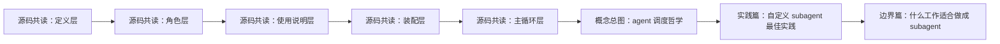

# Claude Code agent / subagent 专题索引

这页是最近一轮 **Claude Code agent / subagent** 相关内容的总导航。

目标不是简单列文件，而是把这批内容按阅读路径串起来：

1. **先看源码共读，建立结构感**
2. **再看概念总图，把零散理解串起来**
3. **再看 subagent 设计与边界，进入实践层**

如果只想快速进入，我建议直接按下面这个顺序读。

---

## 一、推荐阅读顺序

### 第 0 步：先看学习路线
- [[03-Research/Claude Code/cc源码共读笔记/2026-04-01-cc源码共读笔记-00-学习路线]]

这是整个 Claude Code 源码共读系列的起点。先看它，比较容易知道后面每一篇在总线上的位置。

### 第 1 步：先建立 agent 主线
按下面顺序读最顺：

1. [[03-Research/Claude Code/cc源码共读笔记/2026-04-02-cc源码共读笔记-21-loadAgentsDir是agent定义层的总入口]]
2. [[03-Research/Claude Code/cc源码共读笔记/2026-04-02-cc源码共读笔记-22-builtInAgents是官方内建角色模板总表]]
3. [[03-Research/Claude Code/cc源码共读笔记/2026-04-02-cc源码共读笔记-23-prompt是AgentTool给模型看的使用说明层]]
4. [[03-Research/Claude Code/cc源码共读笔记/2026-04-02-cc源码共读笔记-19-runAgent是把agent组装成可运行体的装配线]]
5. [[03-Research/Claude Code/cc源码共读笔记/2026-04-02-cc源码共读笔记-18-主循环在编排一次完整agent回合]]

这 5 篇基本就把 agent 主线拉出来了：
- 定义层
- 角色层
- 使用说明层
- 装配层
- 主循环层

### 第 2 步：补 agent / fork / skill 周边
如果想继续补完整上下文，可以接着看：

- [[03-Research/Claude Code/cc源码共读笔记/2026-04-02-cc源码共读笔记-15-AgentTool不是再开一个agent这么简单]]
- [[03-Research/Claude Code/cc源码共读笔记/2026-04-02-cc源码共读笔记-20-forkSubagent是在同一上下文里分叉出worker]]
- [[03-Research/Claude Code/cc源码共读笔记/2026-04-01-cc源码共读笔记-03-Skill-Fork-Agent-Review]]
- [[03-Research/Claude Code/cc源码共读笔记/2026-04-02-cc源码共读笔记-16-SkillTool是把skill接进runtime的桥]]

### 第 3 步：看概念总图与实践文章
源码看得差不多之后，再看这几篇会很顺：

- [[07-Posts/WeChat/2026-04-Claude-Code-agent-调度哲学：五层结构与主循环总图]]
- [[07-Posts/WeChat/2026-04-Claude-Code-自定义-subagent-最佳实践]]
- [[07-Posts/WeChat/2026-04-什么工作适合做成-subagent-服务端工程师视角]]

这三篇分别回答：
- Claude Code 的 agent 调度哲学到底是什么
- 自定义 subagent 时最该学官方什么
- 什么工作真的适合做成 subagent

---

## 二、这一轮最重要的主线

如果把这一轮内容压成一条主线，大概是这样：

也就是说，这一轮不是几篇孤立文章，而是从：

- **源码结构理解**
逐渐走到
- **概念抽象**
再走到
- **subagent 设计实践与边界判断**

---

## 三、源码共读笔记分组

下面按主题把已有相关笔记再整理一下，后面找会更方便。

### 1. agent 主线核心
- [[03-Research/Claude Code/cc源码共读笔记/2026-04-02-cc源码共读笔记-21-loadAgentsDir是agent定义层的总入口]]
- [[03-Research/Claude Code/cc源码共读笔记/2026-04-02-cc源码共读笔记-22-builtInAgents是官方内建角色模板总表]]
- [[03-Research/Claude Code/cc源码共读笔记/2026-04-02-cc源码共读笔记-23-prompt是AgentTool给模型看的使用说明层]]
- [[03-Research/Claude Code/cc源码共读笔记/2026-04-02-cc源码共读笔记-19-runAgent是把agent组装成可运行体的装配线]]
- [[03-Research/Claude Code/cc源码共读笔记/2026-04-02-cc源码共读笔记-18-主循环在编排一次完整agent回合]]

### 2. agent / fork / skill 邻接笔记
- [[03-Research/Claude Code/cc源码共读笔记/2026-04-02-cc源码共读笔记-15-AgentTool不是再开一个agent这么简单]]
- [[03-Research/Claude Code/cc源码共读笔记/2026-04-02-cc源码共读笔记-20-forkSubagent是在同一上下文里分叉出worker]]
- [[03-Research/Claude Code/cc源码共读笔记/2026-04-01-cc源码共读笔记-03-Skill-Fork-Agent-Review]]
- [[03-Research/Claude Code/cc源码共读笔记/2026-04-02-cc源码共读笔记-16-SkillTool是把skill接进runtime的桥]]
- [[03-Research/Claude Code/cc源码共读笔记/2026-04-01-cc源码共读笔记-01-Skill总图]]
- [[03-Research/Claude Code/cc源码共读笔记/2026-04-01-cc源码共读笔记-02-Skill-frontmatter-字段速查-humanized]]

### 3. 主循环 / tool runtime 邻接笔记
- [[03-Research/Claude Code/cc源码共读笔记/2026-04-02-cc源码共读笔记-08-主循环里tool怎么被接住]]
- [[03-Research/Claude Code/cc源码共读笔记/2026-04-02-cc源码共读笔记-09-从query到tool-call的连接处]]
- [[03-Research/Claude Code/cc源码共读笔记/2026-04-02-cc源码共读笔记-17-ToolSearchTool是工具发现层]]
- [[03-Research/Claude Code/cc源码共读笔记/2026-04-02-cc源码共读笔记-07-Tool体系总览]]
- [[03-Research/Claude Code/cc源码共读笔记/2026-04-02-cc源码共读笔记-06-Claude-Code-tools总览]]

### 4. file / shell 基础工具相关
- [[03-Research/Claude Code/cc源码共读笔记/2026-04-02-cc源码共读笔记-10-BashTool不是跑个shell这么简单]]
- [[03-Research/Claude Code/cc源码共读笔记/2026-04-02-cc源码共读笔记-11-FileReadTool统一读取入口]]
- [[03-Research/Claude Code/cc源码共读笔记/2026-04-02-cc源码共读笔记-12-FileEditTool是受控修改原语]]
- [[03-Research/Claude Code/cc源码共读笔记/2026-04-02-cc源码共读笔记-13-FileWriteTool是整文件覆盖原语]]
- [[03-Research/Claude Code/cc源码共读笔记/2026-04-02-cc源码共读笔记-14-GrepTool是结构化内容搜索原语]]

---

## 四、已经写好的成稿 / 可发布文章

### 1. Claude Code 的 agent 调度哲学
- [[07-Posts/WeChat/2026-04-Claude-Code-agent-调度哲学：五层结构与主循环总图]]

定位：把前面几篇 agent 主线源码解析串成一张概念总图。

### 2. 自定义 subagent 最佳实践
- [[07-Posts/WeChat/2026-04-Claude-Code-自定义-subagent-最佳实践]]

定位：从 Claude Code 使用者视角，讨论如何设计 custom subagent。

### 3. 什么工作适合做成 subagent
- [[07-Posts/WeChat/2026-04-什么工作适合做成-subagent-服务端工程师视角]]

定位：站在服务端工程师视角，讨论 subagent 的适用边界与判断标准。

---

## 五、当前这一组内容回答了哪些问题

### 已经回答的
- Claude Code 的 agent 调度哲学是什么？
- agent 主线在源码里是怎么串起来的？
- 自定义 subagent 时，最该学官方什么？
- 什么工作适合做成 subagent？
- skill、主 agent、subagent 在工程上分别更像什么？

### 还值得继续补的
- 服务端工程师最值得先做的 3 个 subagent
- skill、session、subagent 的边界
- 什么情况下不要用 subagent

---

## 六、我自己建议的最短阅读路径

如果后面只想快速给别人一个“从源码到实践”的阅读路径，我建议直接发这 8 篇：

1. [[03-Research/Claude Code/cc源码共读笔记/2026-04-01-cc源码共读笔记-00-学习路线]]
2. [[03-Research/Claude Code/cc源码共读笔记/2026-04-02-cc源码共读笔记-21-loadAgentsDir是agent定义层的总入口]]
3. [[03-Research/Claude Code/cc源码共读笔记/2026-04-02-cc源码共读笔记-22-builtInAgents是官方内建角色模板总表]]
4. [[03-Research/Claude Code/cc源码共读笔记/2026-04-02-cc源码共读笔记-23-prompt是AgentTool给模型看的使用说明层]]
5. [[03-Research/Claude Code/cc源码共读笔记/2026-04-02-cc源码共读笔记-19-runAgent是把agent组装成可运行体的装配线]]
6. [[03-Research/Claude Code/cc源码共读笔记/2026-04-02-cc源码共读笔记-18-主循环在编排一次完整agent回合]]
7. [[07-Posts/WeChat/2026-04-Claude-Code-agent-调度哲学：五层结构与主循环总图]]
8. [[07-Posts/WeChat/2026-04-Claude-Code-自定义-subagent-最佳实践]]

如果想把 subagent 讨论补完整，再加：

9. [[07-Posts/WeChat/2026-04-什么工作适合做成-subagent-服务端工程师视角]]

---

## 七、备注

这页会继续维护。后面如果这一组继续补文章，建议都往这里挂。

目前可以把它当成：

- Claude Code agent 主线阅读入口
- subagent 设计专题入口
- 从源码共读到成稿文章的桥接页
