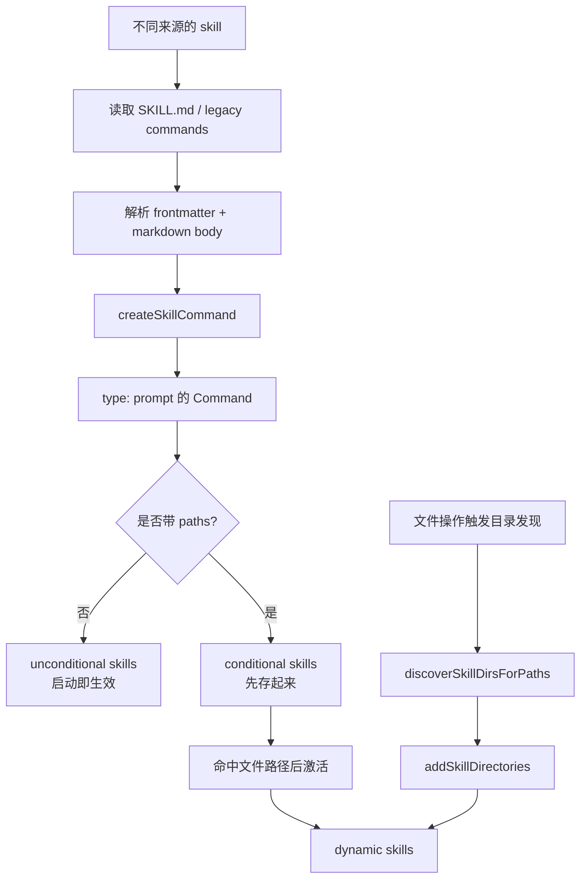
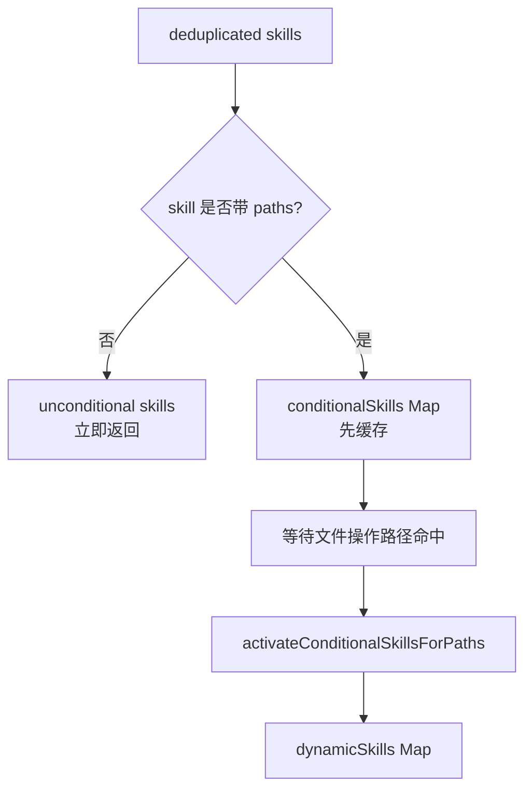

# Claude Code 源码共读笔记 24：loadSkillsDir 是 skill 定义层的总入口

## 这篇看什么

这次我把 skill 这条线重开了。

而且不是按“先看字段、先看样例、先看 SkillTool”的走法重开，而是故意按前面学 agent 那条更稳的路径来：

1. 先立定义层
2. 再看入口层
3. 再看执行层
4. 最后再回到写法层和设计实践

所以这次新的第一讲，主看的是：

- `src/skills/loadSkillsDir.ts`

看完这个文件，我觉得 skill 这条线终于站稳了。因为它先回答了几个真正关键的问题：

- Claude Code 里什么东西才算一个 skill
- skill 从哪里来
- frontmatter 到底什么时候开始有“运行语义”
- skill 为什么不是启动后全都生效
- skill 最后是怎么进入统一 runtime 的

我现在会直接给它下这个定义：

> `loadSkillsDir.ts` 不是“读 skills 目录”的工具函数，而是 Claude Code 的 skill 定义层总入口。

如果前面 agent 那条线里，`loadAgentsDir.ts` 负责把 agent 世界先立起来，那 skill 这边差不多就是同样的位置。

它负责把不同来源、不同形态的 skill，统一收进一种 Claude Code 真正能消费的对象里。后面你再去看 `SkillTool.ts`，就不会再有那种“怎么突然就冒出来一个 skill 入口”的悬空感。

---

## 先给主结论

### 1. skill 在 Claude Code 里，不是 markdown 文件，而是结构化 prompt command

这是这次最核心的一点。

如果只从目录结构看，很容易把 skill 理解成：

- 一个目录
- 里面一个 `SKILL.md`
- 顶部一点 frontmatter
- 下面一段说明文字

但 `loadSkillsDir.ts` 做的事情说明，Claude Code 根本不是按“markdown 文档”来理解 skill 的。

它最后会把 skill 统一压成：

- `type: 'prompt'`
- 的 `Command`

也就是说，skill 在这里不是另一套神秘对象，而是被翻译进 command 系统的一种 prompt 型能力单元。

最短的一句话就是：

> skill 在 Claude Code 里，不是 markdown 文件，而是结构化 prompt command。

这句话非常重要。

因为它意味着后面关于 skill 的很多问题，本质上都不该从“文档怎么写”开始问，而应该从下面这些问题开始问：

- 它最后变成什么 command
- 它有哪些 runtime 字段
- 它什么时候可见
- 它怎么进入执行层

结构一旦这么立住，整条 skill 主线就顺了。

### 2. `loadSkillsDir.ts` 不是在“读取目录”，而是在定义什么是 skill

这个文件表面上像 loader，实际上做的是定义层工作。

它不只是把若干目录里的 markdown 拿出来，而是在决定：

- 什么格式算 skill
- skill 的名字怎么定
- frontmatter 哪些字段变成 runtime 语义
- 哪些 skill 启动即生效
- 哪些 skill 要延后激活
- 多来源 skill 怎么合并和去重

所以如果说 `SkillTool.ts` 解决的是“skill 怎么被调用”，那 `loadSkillsDir.ts` 解决的就是：

> Claude Code 里，到底有哪些东西有资格被称为 skill。

### 3. frontmatter 到这里已经不是 metadata，而是运行语义入口

如果只把 frontmatter 当成一堆说明字段，会低估这层。

在这个文件里，frontmatter 已经开始变成 runtime 真的会消费的结构。

比如这些字段：

- `context`
- `agent`
- `hooks`
- `paths`
- `model`
- `effort`

到这里就不再只是“写在头上的注释”了，而是会直接决定后面：

- 是 inline 还是 fork
- 用哪个 agent
- 允许哪些 hooks
- 是否条件激活
- 是否切模型
- 是否改 effort

也就是说，skill 的 frontmatter 在定义层就已经开始长出“执行语义”。

### 4. skill 来源不是单一目录，而是多层来源系统

这份代码里，skill 并不是只从一个固定的 `skills/` 目录里来。

它会同时处理这些来源：

- managed
- user
- project
- additional dirs
- legacy commands
- MCP builder

这意味着 Claude Code 不是把 skill 当作一个小功能，而是把它当成一个正式的配置/能力系统来经营。

### 5. skill 不是全部启动即生效，而是分 unconditional / conditional / dynamic 三层

这一层特别关键。

很多人会默认觉得：skill 只要被扫描到，就应该立即生效。

但这里不是。

Claude Code 明确把它们拆成：

- unconditional skills
- conditional skills
- dynamically discovered skills

也就是说，skill 会随着当前工作区域和触达路径逐渐显现。

这就不是静态技能清单了，而是带上下文感知的 skill 空间。

---

## 先把总图立住：这份文件到底在做什么

如果只用一句话概括，我会说：

> `loadSkillsDir.ts` 把来自不同来源的 skill 文件，解析成统一的 `prompt command`，再按照“立即可见 / 条件激活 / 动态发现”三种状态组织起来，交给后面的 runtime 去消费。

可以先看这个总图：

这样看会比“读目录函数”这个印象准确得多。

---

## 第一层：它先把 skill 统一压进 command 类型系统

这个文件里最关键的函数之一就是：

- `createSkillCommand(...)`

它返回的不是某种独立的 `Skill` 类型，而是一个 `Command`。

而且类型已经写死了：

- `type: 'prompt'`

这件事背后的架构意味非常重。

它说明 Claude Code 对 skill 的态度不是：

- 再发明一套 skill runtime
- 再单独做一套 skill 调度
- 再让 skill 和 command 并行存在

它选的是另一条更克制的路：

> 让 skill 直接复用 command 抽象，成为 prompt command 宇宙的一部分。

### `createSkillCommand(...)` 最终塞进去了什么

这一层最值得看的不是“返回了一个对象”，而是它到底往对象里灌了哪些能力。

这里面至少有：

- `name`
- `description`
- `allowedTools`
- `argumentHint`
- `argNames`
- `whenToUse`
- `version`
- `model`
- `disableModelInvocation`
- `userInvocable`
- `context`
- `agent`
- `effort`
- `paths`
- `hooks`
- `skillRoot`
- `getPromptForCommand(...)`

也就是说，skill 到这里已经不是“正文字符串 + 一点 metadata”。

它已经变成一个完整的可运行定义：

- 有身份
- 有展示信息
- 有参数约束
- 有工具边界
- 有上下文形态
- 有路径条件
- 有 prompt 生成逻辑

所以从定义层看，skill 更像：

> 一个带结构、带边界、带执行入口的 prompt command。

不是一篇 markdown 文档。

---

## 第二层：frontmatter 在这里被翻译成运行语义

这一层的核心函数是：

- `parseSkillFrontmatterFields(...)`

表面上它像 parser，实际上它干的不是“读字段”，而是“把字段翻译成 runtime 能理解的语义”。

### 它处理了哪些字段

代码里这批字段基本就是 skill 写法层和运行层的接缝：

- `description`
- `allowed-tools`
- `argument-hint`
- `arguments`
- `when_to_use`
- `version`
- `model`
- `disable-model-invocation`
- `user-invocable`
- `hooks`
- `context`
- `agent`
- `effort`
- `shell`

这些字段里，真正值钱的不是“支持得多”，而是：

> 它们在这里就已经不再是文本描述，而是后面 runtime 的正式输入。

### 几个特别值得记的点

#### 1. `model: inherit` 在这里就被规范化掉了

也就是说，定义层不会把原始 frontmatter 生吞下去，而是会先规范化，再交给后面的执行层。

这说明 loader 的目标不是“忠实搬运原文”，而是“产出更干净的 runtime 定义”。

#### 2. `context: fork` 在这里已经开始变 execution context

这一点很重要。

这说明 loader 不是不知道这些字段的意义，而是从定义层起就清楚：

- `context` 会影响执行形态
- 它不是普通标签

也就是说，fork 不是到了 `SkillTool.ts` 才突然出现的，定义层已经提前把这个入口立好了。

#### 3. `hooks` 在这里就走 schema 校验

这意味着 hooks 不是可以随便塞点对象进去的自由文本。

Claude Code 对 skill hooks 的态度是：

- 从定义层就开始收口
- 先校验结构
- 不合法就直接降级/忽略

这很工程化，也很稳。

#### 4. `description` 有 fallback 逻辑

如果 frontmatter 没写 description，它会尝试从 markdown 正文里抽描述。

这说明定义层不仅在做解析，也在做“补齐一个可展示 command”的工作。

它的目标显然不是把文件原样保存下来，而是：

> 尽量把 skill 编译成一个可展示、可搜索、可调度的 command。

---

## 第三层：skill 的来源是多层系统，不是单一目录

这一层是我这次特别想先立住的。

如果不先看 `loadSkillsDir.ts`，很容易默认 skill 就是本地某个目录里的一堆 `SKILL.md`。

但实际不是。

`getSkillDirCommands(...)` 一上来就把来源分得很清楚：

- managed skills
- user skills
- project skills
- additional dirs（`--add-dir`）
- legacy `/commands/`

再往下看，底部还会：

- `registerMCPSkillBuilders(...)`

也就是说，skill 来源并不只是本地目录扫描。

它其实已经是一个多来源、多层叠加、带兼容层的定义系统。

### 这件事意味着什么

意味着 Claude Code 不是把 skill 当成“写几个 prompt 模板”的附属功能。

它把 skill 放到了和这些东西相近的层级：

- settings source
- project config
- managed policy
- plugin / MCP extension

所以 skill 在 Claude Code 里，更像一个正式能力系统，而不是“用户手写的一点小技巧”。

### 这里还有一层很现实的约束逻辑

代码里会看这些条件：

- `isBareMode()`
- `isSettingSourceEnabled(...)`
- `isRestrictedToPluginOnly('skills')`
- `CLAUDE_CODE_DISABLE_POLICY_SKILLS`

这说明 skill 加载不是无条件扫描，而是会受到运行模式、策略源、插件限制、环境变量的影响。

这就是正式系统才会有的味道。

---

## 第四层：legacy `/commands/` 兼容层说明 skill 系统已经进入“有历史包袱”的阶段

如果一个系统只有“理想新格式”，通常说明它还比较新。

但 `loadSkillsDir.ts` 里明显不是这样。

它专门保留了：

- `loadSkillsFromCommandsDir(...)`
- `transformSkillFiles(...)`
- `getSkillCommandName(...)`
- `getRegularCommandName(...)`

也就是说，它不仅支持现在这套：

- `skills/<skill-name>/SKILL.md`

还兼容旧的：

- `/commands/` 目录
- 单个 `.md` 文件
- 子目录里的 `SKILL.md`

### 为什么这层重要

因为它说明 Claude Code 的 skill 系统不是一夜之间从零开始设计好的。

它已经在处理这些现实问题：

- 老格式怎么兼容
- 旧命名怎么转新抽象
- 同目录多个 skill 文件怎么办
- 历史 command 如何并入新的 skill 体系

这类代码一出现，你就知道这是正式系统了。

不是 demo，也不是随手实现。

---

## 第五层：它不是把所有 skill 都立刻暴露出来，而是先分 unconditional / conditional

这是我觉得这份文件最有意思的一层。

`getSkillDirCommands(...)` 不是简单 `return deduplicatedSkills`。

它会先把 skill 拆成两类：

- `unconditionalSkills`
- `conditionalSkills`

条件就是看这个 skill 有没有 `paths` frontmatter。

### 这意味着什么

意味着 skill 不是被扫描到就必然立即可见。

如果一个 skill 带了 `paths`，它就会先被放进：

- `conditionalSkills`

等到后续有文件路径命中时，才真正进入可用集合。

这一步特别关键，因为它说明 Claude Code 在这里已经开始做 skill 的上下文裁剪了。

不是所有 skill 永远在线，而是：

> 和当前工作区域真正相关的那部分 skill，才会逐渐显现。

可以看这张图：

这张图背后其实就是一句话：

> Claude Code 不想让 skill 过早、过多、无差别地进入模型上下文。

这是非常对的。

否则 skill 一多，很容易出现两种问题：

1. 模型看不过来
2. 当前任务根本不相关的 skill 也在旁边吵

所以 conditional activation 本质上是在帮 skill 系统做上下文纪律。

---

## 第六层：dynamic discovery 说明 skill 会随着工作区域浮现

这层是 skill 线里最像“运行时系统”的地方。

相关函数主要有：

- `discoverSkillDirsForPaths(...)`
- `addSkillDirectories(...)`
- `getDynamicSkills()`
- `activateConditionalSkillsForPaths(...)`

它们合起来做的事情是：

1. 当有文件路径被操作
2. 从这些文件的父目录一路往上找
3. 看有没有嵌套的 `.claude/skills`
4. 找到之后动态加载
5. 按更深路径优先的顺序合并
6. 再把命中 `paths` 的 conditional skills 激活出来

这意味着 skill 不是“启动时扫描一次，后面永远不变”。

而是：

> 你的工作区域一变，skill 空间也会跟着变化。

### 这件事为什么重要

因为它直接改变了我们对 skill 的理解。

skill 不再只是挂在全局的一堆模板，而是更接近：

- 某个目录层级下的局部工作流模块
- 会随当前触达区域逐步浮现的能力片段

可以看这个过程图：

这时候 skill 已经完全不是“文档资产”了。

它其实是一种：

> 随工作区上下文动态暴露的 prompt command。

---

## 第七层：去重和身份处理说明这不是玩具 loader

这一层很多人看源码时容易略过去，但我觉得它很见功力。

文件里专门有：

- `getFileIdentity(filePath)`
- 里面走的是 `realpath(...)`

它的目的很明确：

- 解决 symlink
- 解决重复父目录
- 解决同一文件通过不同路径被加载两次

这说明作者已经考虑到了非常真实的工程问题：

- 文件系统路径不可靠
- 目录可能重叠
- 某些挂载环境 inode 不稳定
- 同一个 skill 可能从多个入口被扫到

它不是“看到就收”，而是会先做 canonical identity，再 first-wins 去重。

这个细节非常加分。

因为 skill 系统一旦从单目录扩成多来源、多层目录、动态发现，去重就不是锦上添花，而是基本盘。

---

## 第八层：`getPromptForCommand(...)` 说明定义层已经开始对接执行层

这一层其实很关键，因为它让这份文件不只停留在“静态定义”。

在 `createSkillCommand(...)` 里，skill command 会挂上：

- `getPromptForCommand(args, toolUseContext)`

这相当于告诉你：

> 定义层产出的不是死对象，而是已经带着运行时 prompt 生成入口的 command。

### 这个 prompt 生成过程里干了什么

至少包括：

- 拼上 `Base directory for this skill: ...`
- 做参数替换 `substituteArguments(...)`
- 替换 `${CLAUDE_SKILL_DIR}`
- 替换 `${CLAUDE_SESSION_ID}`
- 执行 skill markdown 里的内联 shell（非 MCP skill）

也就是说，skill 的正文不是简单地原样吐给模型。

它在进入执行层之前，还会经过一轮“按当前参数和上下文生成最终 prompt”的处理。

### 这里最值得记的一点

MCP skills 被明确排除了内联 shell 执行：

- `loadedFrom !== 'mcp'` 才会执行 `executeShellCommandsInPrompt(...)`

注释也写得很直：

> MCP skills 是 remote / untrusted 的，不允许执行 markdown body 里的 inline shell。

这个细节说明定义层和执行层的边界上，安全考虑已经进来了。

也就是说，Claude Code 对 skill 的态度不是“反正都是 prompt”。

它知道不同来源的 skill 信任级别不同，所以运行能力也要分层。

---

## 这篇最值得记住的几个判断

### 判断 1：skill 不是 markdown 文件，而是结构化 prompt command

这是这篇最核心的一句话。

### 判断 2：frontmatter 在定义层已经变成运行语义入口

`context / agent / hooks / paths / model / effort` 都不是纯 metadata。

### 判断 3：skill 系统是多来源、多层叠加、带兼容层的正式系统

managed、user、project、additional dirs、legacy commands、MCP builder 都在这里汇合。

### 判断 4：skill 不是全部启动即生效，而是会随着当前工作区域逐渐显现

这背后对应的是：

- unconditional
- conditional
- dynamic discovery

### 判断 5：`loadSkillsDir.ts` 已经提前把 skill 和后面的执行层接上了

因为它产出的不是静态定义，而是带：

- runtime 字段
- prompt 生成逻辑
- 路径激活机制
- 安全边界

的 command。

---

## 我现在对这篇的最短总结

如果只允许我留一句最短的话，我会留这个：

> `loadSkillsDir.ts` 不是“读 skills 目录”，而是在 Claude Code 里定义什么叫一个 skill，并把它统一编译成结构化的 `prompt command`。

这句话一旦立住，后面 skill 线就很自然了。

因为下一步你问的就不再是：

- 这个字段怎么写
- skill 样例长什么样

而会变成：

- 这个 command 怎么进入 runtime
- 模型怎么调它
- inline / fork 怎么分流
- skill 怎么和 agent 执行层接上

这时整条线的骨架就出来了。

---

## 这次重开之后，skill 线的顺序终于顺了

这次我最满意的，不只是看懂了 `loadSkillsDir.ts` 本身，而是顺序终于对了。

新的顺序应该是：

1. 定义层：`loadSkillsDir.ts` ✅
2. 入口层：`SkillTool.ts`
3. 执行层：fork / context / agent / runAgent
4. 写法层：frontmatter / 模板 / 设计实践

这样走，skill 线就和前面 agent 线一样，有了：

- 定义
- 入口
- 执行
- 写法

这四层骨架。

之前那种“先记字段、先看 SkillTool”的方式，也不是完全不行，但结构感确实不够稳。

这次从定义层重开之后，整个感觉就对了。

---

## 下一步最顺怎么接

如果按这次新的学习法继续，我觉得下一讲最顺的就是：

- `SkillTool.ts`

因为现在我们已经知道：

- skill 从哪里来
- skill 最后变成什么对象
- 哪些 skill 立即可见
- 哪些 skill 条件激活
- 哪些 skill 会随着工作区动态出现

那下一步自然就是：

> skill 怎么从定义层真正进入执行层。

也就是：

- 模型怎么调用它
- inline 和 fork 怎么分流
- skill 怎么把 prompt / context / permission / agent execution 接起来

所以这篇新的第一讲，把 skill 的地基先立住；
下一讲接 `SkillTool.ts`，整条主线就会开始真正闭环。
