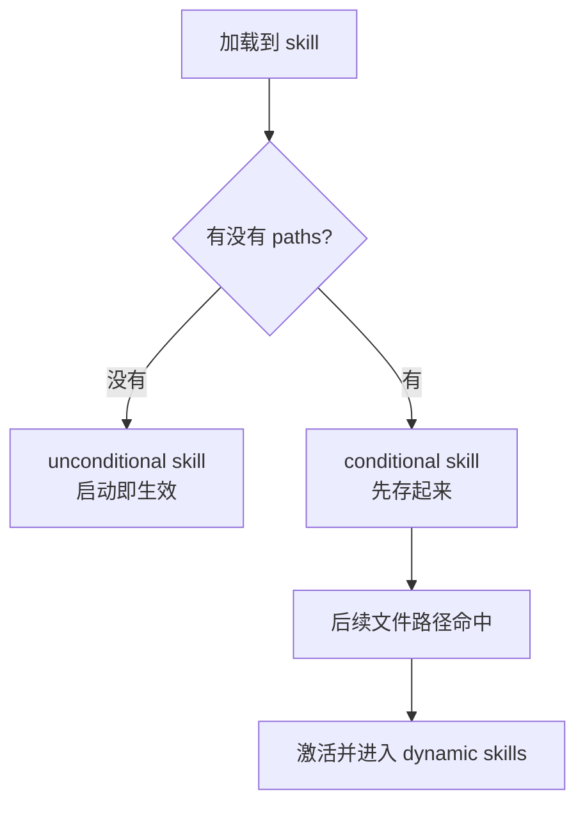

# Claude Code 源码共读笔记 24：loadSkillsDir 是 skill 定义层的总入口

## 这篇看什么

这次我们把 skill 这条线重新开一遍。

不沿用之前“先看字段、先看 SkillTool”的方式，而是按照前面学 agent 的路径，从**定义层**重新起步。

所以这次主看的是：

- `src/skills/loadSkillsDir.ts`

看完之后，我现在的判断很明确：

> `loadSkillsDir.ts` 干的不是“把 skills 目录读一下”这么简单，它其实是 Claude Code 的 **skill 定义层总入口**：负责把本地目录、legacy commands、managed skills、动态发现、conditional activation、MCP skill builder 这些不同来源和形态的 skill，统一收进同一种 `Command(type='prompt')` 抽象里，再决定哪些 skill 现在可见、哪些延后激活。

如果你学 agent 时，`loadAgentsDir.ts` 是“agent 世界的编户齐民系统”，那 skill 这边的 `loadSkillsDir.ts` 基本就是：

> **skill 世界的总登记口。**

它先回答：

- skill 从哪来
- skill 长什么样
- 哪些 skill 现在生效
- 哪些 skill 要等路径命中后再出现
- skill 最后怎么变成 runtime 能消费的对象

这篇把它看清以后，后面再去看 `SkillTool.ts`，感觉会顺得多。

---

## 先给主结论

### 1. `loadSkillsDir.ts` 的核心任务，是把 skill 统一翻译成 prompt command

这一点特别关键。

很多人一开始会把 skill 想成“另一套对象系统”，但从这份代码看，Claude Code 没有把 skill 做成完全独立的 runtime 类型。

它最后统一产出的其实是：

- `Command`
- 而且具体是 `type: 'prompt'`

也就是说，在 Claude Code 里，skill 不是“和 command 平行的一种新物种”，而是：

> **一种被编译进 command 抽象里的 prompt 型能力单元。**

这件事很值，因为它说明 skill 系统本质上不是绕开 runtime 另搞一套，而是复用现有 command/runtime 体系。

### 2. skill 不只是 markdown 文件，而是结构化 prompt command

`loadSkillsDir.ts` 干的也不是“把一段 markdown 读出来”。

它会解析：

- frontmatter
- markdown 正文
- 路径条件
- hooks
- tools
- model / effort / shell
- fork context / agent

然后再组装成统一 command。

所以 skill 在 Claude Code 里更接近：

> **一种由 frontmatter + markdown body 共同定义的结构化 prompt command。**

也就是说：

- frontmatter 负责声明行为与边界
- markdown 正文负责提供具体方法内容

### 3. `loadSkillsDir.ts` 其实同时在处理“加载、去重、分层、延迟激活”四件事

如果只把它当 loader，会低估它。

它实际上至少在做四层事：

1. **加载**：从多个目录和来源收集 skill
2. **去重**：处理 symlink / 重复父目录 / 同一文件多路径问题
3. **分层**：把 unconditional skill 和 conditional skill 分开
4. **延迟激活**：有些 skill 不是启动就可见，而是命中路径后再激活

所以它不是一个薄薄的 `read dir`，而是：

> **skill 定义系统的入口层 + 调度前置层。**

---

## 从架构层看，`loadSkillsDir.ts` 到底在干什么

我觉得可以拆成 6 层。

## 第一层：先把 skill 这件事压进统一类型系统

这一层最重要，也最容易被忽略。

代码里最关键的函数之一是：

- `createSkillCommand(...)`

它返回的不是 skill 专属对象，而是：

- `Command`
- 并且明确是 `type: 'prompt'`

这说明 Claude Code 的设计态度很明确：

> skill 不是 runtime 的平行宇宙，而是 prompt command 宇宙的一部分。

### 这里最值得注意的字段

`createSkillCommand` 最后挂进去的内容非常全：

- `name`
- `description`
- `allowedTools`
- `argNames`
- `whenToUse`
- `model`
- `disableModelInvocation`
- `userInvocable`
- `context`
- `agent`
- `effort`
- `paths`
- `hooks`
- `skillRoot`
- `getPromptForCommand(...)`

这说明 skill 在 Claude Code 里绝不只是“把正文贴给模型”。

它更像：

> **一套带名字、说明、可见性、执行形态、参数、工具边界、路径条件和动态 prompt 生成逻辑的 prompt command。**

所以如果现在要给 skill 下定义，我会更愿意说：

> skill 是运行时可调用的结构化 prompt command。

而不是“一个 markdown 文件”。

---

## 第二层：解析 frontmatter，但不是字段搬运，而是行为语义化

这层的核心函数是：

- `parseSkillFrontmatterFields(...)`

看起来像 parser，但其实做的不是纯机械解析。

它已经开始把 frontmatter 翻译成后续 runtime 真正在乎的语义。

### 它处理了哪些东西

至少包括：

- `description`
- `allowed-tools`
- `argument-hint`
- `arguments`
- `when_to_use`
- `version`
- `model`
- `disable-model-invocation`
- `user-invocable`
- `hooks`
- `context`
- `agent`
- `effort`
- `shell`

### 这里最有意思的几个点

#### 1. `model: inherit` 会被吞掉
也就是说，最终 runtime 层看到的 `model` 不是原始值，而是一个已经规范化过的结果。

#### 2. `context: fork` 在这里就已经被翻译成 execution context
这里不是只把字符串留下来，而是直接变成：

- `executionContext: 'fork' | undefined`

这说明 loader 已经知道：

> 这不是普通 metadata，而是后面执行形态会变的关键开关。

#### 3. `hooks` 会走 schema 校验
说明 hooks 不是随便写个对象塞进去，而是从定义层就开始被规范化。

#### 4. `description` 有 fallback
如果 frontmatter 没写 description，它会回退到：

- `extractDescriptionFromMarkdown(...)`

也就是说，Claude Code 并不强制 skill 所有信息都必须在 frontmatter 里，但一旦进入 runtime，它还是要努力凑出完整描述。

这说明定义层追求的是：

> **不只是读文件，而是尽量把 skill 补成可展示、可调用、可路由的完整 command。**

---

## 第三层：skill 不是单一来源，而是一个多层来源系统

这一层是 skill 线里特别像 agent 定义层的地方。

`getSkillDirCommands(...)` 会同时去拉这些来源：

- managed skills
- user skills
- project skills
- additional dirs (`--add-dir`)
- legacy `/commands/`

而且还有一些条件控制：

- `isBareMode()`
- `isSettingSourceEnabled(...)`
- `isRestrictedToPluginOnly('skills')`
- `CLAUDE_CODE_DISABLE_POLICY_SKILLS`

这说明 Claude Code 对 skill 的理解不是：

- 从某个固定目录读一点 prompt

而是：

> **skill 是一个多来源、多层叠加、受模式和策略约束的定义系统。**

### 这里最关键的设计意味

skill 来源层次其实已经很接近配置系统了：

- policy / managed
- user
- project
- additional dirs
- legacy command compatibility

这说明 skill 不是一个临时机制，而是已经被 Claude Code 当成：

> **和 settings、commands、agents 一样，值得认真管理的配置层。**

---

## 第四层：不是全部立即可见，而是分成 unconditional 和 conditional

这是这份文件最有意思、也最容易被低估的一层。

`getSkillDirCommands(...)` 不是把所有 deduplicated skills 全部直接返回。

它会把它们分成两类：

- `unconditionalSkills`
- `conditionalSkills`

### conditional skill 是什么

就是带 `paths` frontmatter 的 skill。

也就是说，这类 skill 不是启动就直接暴露给模型，而是先暂存起来，等路径命中后再激活。

这件事非常值。

因为它说明 Claude Code 的 skill 不是“全部提示词永远在线”，而是：

> **只有和当前工作上下文相关的那一批，才逐步进入可见集合。**

这其实已经不是静态 prompt 资产了，而更像：

- 带上下文感知的工作流模块

### 为什么这层重要

因为如果没有 conditional activation，skill 很容易遇到两个问题：

1. 太多，模型看不过来
2. 太杂，当前任务不相关的也暴露给模型

所以这层本质上是在做：

> **技能的上下文裁剪。**

这点和 agent 的动态发现、prompt cache、context discipline 是一个方向的。

---

## 第五层：动态发现不是补丁，而是 skill 系统的正式组成部分

这一层我觉得特别像 Claude Code 的味道。

文件后半段专门有一整套动态发现逻辑：

- `discoverSkillDirsForPaths(...)`
- `addSkillDirectories(...)`
- `getDynamicSkills()`
- `activateConditionalSkillsForPaths(...)`

也就是说，skill 不是只有“启动时扫描一次目录”。

它还支持：

- 根据当前 touched file paths 往上走目录
- 找嵌套的 `.claude/skills`
- 动态加载
- 再按更深路径优先覆盖
- 如果命中 conditional `paths`，再把对应 skill 激活出来

### 这说明什么

说明 Claude Code 的 skill 体系不是一个“静态技能列表”。

它更像：

> **随着你当前工作区域变化而逐渐浮现的技能空间。**

这点非常重要。

因为它直接把 skill 从：
- 配置文件

抬到了：
- 运行时上下文系统

### 还有一个很工程的点：它考虑了 gitignored 目录

`discoverSkillDirsForPaths(...)` 里会检查：

- `isPathGitignored(...)`

避免例如 `node_modules/pkg/.claude/skills` 这种东西悄悄被捞进来。

这个细节很 Claude Code。

因为它说明 skill discovery 不是“能找到就全收”，而是考虑了工作区可信边界。

---

## 第六层：去重与身份处理，说明 skill 系统已经很工程化

如果你只看功能，很容易忽略这一层。

但 `loadSkillsDir.ts` 在 dedup 上其实做得挺认真。

### 1. 它用 `realpath` 做文件身份识别
通过：

- `getFileIdentity(...)`

把 symlink / 重复父目录 / 同一文件不同路径的问题都压到统一 canonical path 上。

这说明 skill 系统已经不是“目录少、规则少”的玩具阶段，而是明确考虑到了：

- 父目录重叠
- 软链接
- 容器 / NFS / 特殊文件系统

### 2. 还有 legacy `/commands/` 兼容层
文件里单独保留了：

- `loadSkillsFromCommandsDir(...)`
- `transformSkillFiles(...)`

也就是说，skill 线不是从第一天起就是 `/skills/skill-name/SKILL.md` 这一种格式。

Claude Code 还保留了对旧 `/commands/` 体系的兼容。

这再次说明它不是“新功能小模块”，而是一个：

> **已经有历史包袱、兼容成本、迁移策略的正式系统。**

### 3. 甚至给 MCP 留了 skill builder 注册口
最底部还有：

- `registerMCPSkillBuilders(...)`

这说明 skill 的定义来源，甚至不止本地文件系统。

Claude Code 已经在给：
- MCP 远程技能发现 / 构造

预留正式接入口。

这件事特别重要，因为它说明 skill 的边界已经从：
- 本地 markdown

扩成了：
- 可被不同 provider / discovery mechanism 注入的 runtime prompt command

---

## 这篇最重要的 5 个结论

### 1. `loadSkillsDir.ts` 不是读目录，而是在定义 skill 世界
它负责决定什么算一个 skill，skill 最终长成什么对象。

### 2. skill 最终会被统一压成 `type: 'prompt'` 的 command
这说明 skill 不是和 command 平行的另一套 runtime，而是 prompt command 宇宙的一部分。

### 3. frontmatter 在这里已经不是文本 metadata，而是运行语义
`context`、`agent`、`hooks`、`paths`、`model`、`effort` 都在这一层开始变成后续 runtime 真的会消费的结构。

### 4. skill 系统是多来源、多层叠加、带兼容层的正式配置系统
managed / user / project / additional dirs / legacy commands / MCP builder 都在这里汇合。

### 5. conditional activation 和 dynamic discovery 说明 skill 是运行时上下文的一部分
skill 不是静态挂在那里的 prompt 资产，而是会随当前工作区域逐渐显现的工作流模块。

---

## 我现在对 `loadSkillsDir.ts` 的一句话定义

> `loadSkillsDir.ts` 是 Claude Code 的 skill 定义层总入口：它把本地目录、legacy commands、动态发现、conditional activation 和 MCP skill builder 等不同来源的 skill，统一解析并收敛成 `type: 'prompt'` 的 command，再决定哪些 skill 当前可见、哪些延后激活。

---

## 和后面该怎么接

这次把 `loadSkillsDir.ts` 看完之后，skill 线终于有了一个像 agent 线那样的“定义层起点”。

如果后面继续按这次新的学习法往下走，我觉得最顺的下一步就是：

> **接 `SkillTool.ts`。**

因为现在已经知道了：
- skill 从哪来
- skill 最终变成什么对象
- skill 什么时候出现

那下一步自然就是：

- 模型怎么真正调用这些 skill
- inline 和 fork 在 runtime 里怎么分流
- skill 怎么从定义层进入执行层

也就是说：

- `loadSkillsDir.ts` 解决“skill 世界里有哪些东西”
- `SkillTool.ts` 解决“这些东西怎么真正被用起来”

这两篇接起来，skill 主线就开始有骨架了。