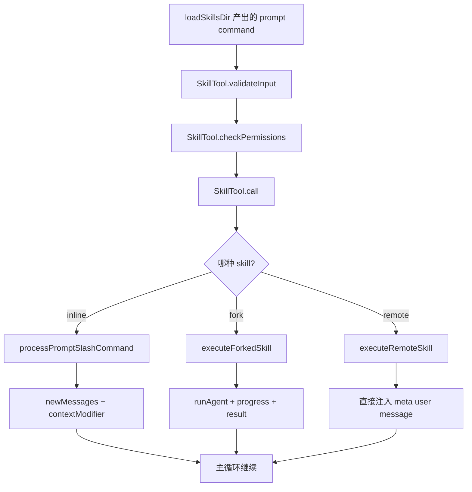
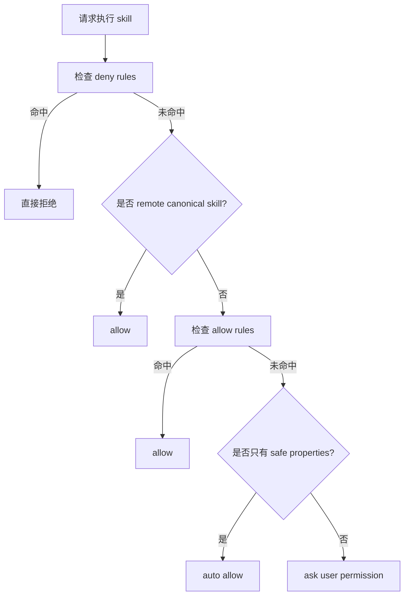
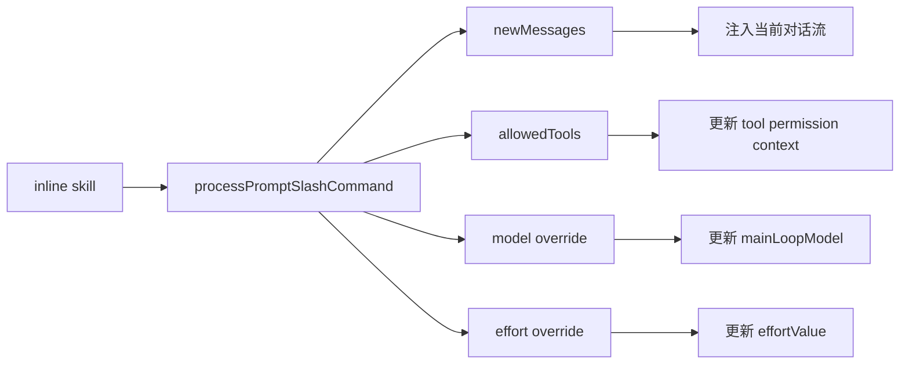

# Claude Code 源码共读笔记 25：SkillTool 是 skill 进入执行层的总入口

## 这篇看什么

上一讲我故意先不碰 `SkillTool.ts`，而是先把 skill 的定义层立住。

因为如果不先看 `loadSkillsDir.ts`，很容易把 skill 理解成：

- 几个 `SKILL.md`
- 一点 frontmatter
- 再加一个能调用它们的入口

但上一讲已经把这个误解拆掉了。

我们现在已经知道：

- skill 不是 markdown 文件，而是结构化 `prompt command`
- frontmatter 到定义层就已经开始长运行语义
- skill 不是全量启动即生效，而是分 unconditional / conditional / dynamic
- skill 来源也不是单目录，而是一个多来源、多层叠加的系统

那接下来最自然的问题就是：

> 这些已经被定义好的 skill，究竟怎么真正进入执行层？

这次主看的是：

- `src/tools/SkillTool/SkillTool.ts`

如果上一讲解决的是：

- Claude Code 里有哪些东西算 skill

那这一讲解决的就是：

- 这些 skill 怎么从定义对象，变成 runtime 里的真实调用

我现在对这个文件的判断是：

> `SkillTool.ts` 不是一个“执行 skill 文本”的小工具，而是 skill 从定义层进入执行层的总入口。

它负责做的事情，远不只是“找到一个 skill 然后展开”。

它真正接起来的是：

- skill 查找
- skill 校验
- skill 权限
- inline / fork 分流
- remote skill 注入
- telemetry
- progress 回传
- context 修改
- tool result 映射

所以它在 skill 这条线里的位置，基本就是：

> 定义层之后的第一个 runtime 关口。

---

## 先给主结论

### 1. SkillTool 不是 skill 的“执行器薄壳”，而是 skill 的 runtime 入口层

第一眼看这个文件，很容易误判。

因为它的输入 schema 很薄：

- `skill`
- `args`

输出 schema 也不复杂：

- inline 结果
- forked 结果

但真的往下看，会发现它根本不是一个“薄包装”。

它至少要处理 5 类问题：

1. 这个名字对应的是不是合法 skill
2. 这个 skill 允不允许现在被调用
3. 这个 skill 应该 inline 还是 fork
4. 这个 skill 展开后，如何安全影响后续上下文
5. 这个 skill 的调用过程如何被追踪、回传、记录

也就是说，SkillTool 真正负责的不是“做 skill 这件事”，而是：

> 让 skill 以一种受约束、可追踪、可分流的方式进入 Claude Code runtime。

### 2. 它把 skill 调用正式纳入了工具系统，而不是当 prompt 宏处理

这一点非常关键。

如果 Claude Code 只是把 skill 当 prompt 宏，最简单的做法其实是：

- 找到 skill 内容
- 替换参数
- 塞回对话

这样当然也能用。

但 SkillTool 并不是这么干的。

它把 skill 调用纳入了完整的 tool 协议里：

- 有 input / output schema
- 有 validateInput
- 有 checkPermissions
- 有 call
- 有 tool result block 映射
- 有 UI render
- 有 progress 回传

所以 skill 在 Claude Code 里并不是“偷偷展开的一段 prompt”。

它是：

> 一个通过 Tool runtime 正式调用的高阶能力单元。

这和上一讲的结论是能扣上的：

- 上一讲：skill 在定义层里是结构化 prompt command
- 这一讲：skill 在执行层里通过 SkillTool 进入正式 Tool runtime

这两层接起来，skill 线才真正闭环。

### 3. SkillTool 的核心工作不是“执行内容”，而是“决定执行路径”

这个文件里最重要的结构，不是 prompt 长什么样，而是它要不要分流。

SkillTool 在 runtime 里真正先做的是判断：

- 这是本地 / bundled / MCP skill 吗
- 这是 remote canonical skill 吗
- 这是 inline skill 吗
- 这是 `context: fork` 的 skill 吗

也就是说，SkillTool 的核心价值不是“执行 skill 内容”，而是：

> 决定这个 skill 应该沿哪条执行路径往下走。

### 4. 它让 skill 不是黑盒 prompt，而是可授权、可观察、可追踪的 runtime 能力

这个文件里有大量信号都在说明：Claude Code 对 skill 的态度非常认真。

比如：

- 权限检查不是省略的，而是专门一整段
- skill usage 会被记录
- plugin / marketplace 身份会进 telemetry
- forked skill 的子 agent tool progress 会回传
- remote skill 会被缓存、打点、注册到 invoked skill state

这说明 skill 不是随手贴一段内容给模型那么轻。

Claude Code 显然在把它当成：

> 会影响执行行为、工具边界、模型上下文、代理分流的正式 runtime 能力。

---

## 先把总图立住：SkillTool 到底接了哪几层

如果把这个文件的角色说得最直白一点，我会说：

> SkillTool 站在 skill 定义层和 skill 执行层之间，负责把“已经被定义好的 prompt command”接进 tool runtime，并按 inline / fork / remote 三条路径分发出去。

先看一个总图会很清楚：



这个总图其实已经能说明一半问题了：

SkillTool 不只是“执行一个 skill”，而是在做一次 runtime 分流。

---

## 第一层：它先把 skill 入口卡得很严，不是什么东西都能叫进来

这一层主要在：

- `validateInput(...)`

这里表面看只是参数校验，但其实已经在做 skill 调用资格过滤。

### 第一关：格式校验

它先做的事情很朴素：

- `trim()`
- 空字符串拒绝
- 去掉前导 `/`

这说明 SkillTool 兼容 `/commit` 这种 slash 形式，但内部处理还是按纯 skill 名做规范化。

### 第二关：名字必须能在 command 集合里找到

它会调用：

- `getAllCommands(context)`
- `findCommand(normalizedCommandName, commands)`

这里有个很值得记的点：

`getAllCommands()` 不只是拿本地 skill，而是会把：

- 本地 / bundled skills
- MCP skills

合并起来。

而且还专门过滤掉 plain MCP prompts，只保留：

- `cmd.type === 'prompt' && cmd.loadedFrom === 'mcp'`

这件事说明 SkillTool 的调用集合，不是“磁盘上的本地 skill 目录”，而是：

> 当前 runtime 中可被当作 skill 调用的 command 联合集合。

### 第三关：必须允许模型调用

即便找到了 command，也不是都能调。

它还会拒绝两类：

- `disableModelInvocation`
- 非 `prompt` 类型

也就是说，SkillTool 不是什么 command 都能吃。

它只接受：

> 已经被定义成 prompt-based、允许模型调用的 command。

这一点特别重要。因为它把 skill 的边界卡得很清楚：

- 不是所有 slash command 都等于 skill
- 只有符合这套 runtime 条件的 prompt command，才能从 SkillTool 入口进来

---

## 第二层：权限检查说明 Claude Code 把 skill 当正式执行能力，不当提示词文本

这一层在：

- `checkPermissions(...)`

如果说上一讲 `loadSkillsDir.ts` 证明了 frontmatter 已经开始有运行语义，那这一讲的 `checkPermissions()` 则进一步说明：

> skill 调用已经正式进入权限系统。

它不是“只是给模型多一点指导文字”，所以它不能绕过授权。

### 它的权限顺序非常清楚

大致是：

1. deny rules
2. remote canonical auto-allow（但要在 deny 之后）
3. allow rules
4. safe-properties auto-allow
5. 默认 ask

这套顺序非常像成熟系统，而不是临时逻辑。

### `ruleMatches()` 很值得注意

它支持两类规则：

- 精确匹配：`review-pr`
- 前缀匹配：`review:*`

这说明 skill 权限不是只支持“某一个 skill 名”，而是支持一种模式化授权。

也就是说，系统允许你表达这种意思：

- 允许这个 skill
- 或者允许这个 skill 家族

这个粒度其实很合理。

### 最关键的是 `skillHasOnlySafeProperties(...)`

我觉得这是这个文件里最有味道的设计之一。

它定义了一份：

- `SAFE_SKILL_PROPERTIES`

然后做一件事：

> 如果一个 skill 除了这些白名单字段之外，没有任何其他“有意义”的属性，那它可以自动 allow。

这一招很稳。

因为它不是黑名单，而是白名单。

也就是说：

- 新增字段默认不信任
- 只有明确被评估过安全性的字段，才在 auto-allow 范围内

这比靠“列出危险字段”靠谱得多。

因为未来新增属性时，黑名单方案很容易漏；白名单方案则天然更保守。

### 这一段真正说明了什么

说明 Claude Code 对 skill 的态度很明确：

- 它会改工具边界
- 它会改模型上下文
- 它会改执行方式
- 它甚至会触发 agent 分流

所以 skill 必须被当作正式执行能力来授权，而不是一段 harmless prompt。

可以看这个权限流：



这一层一出来，skill 就完全不是“宏展开”了。

---

## 第三层：SkillTool 真正最重要的工作，是分流执行路径

这一层在：

- `call(...)`

我觉得很多人第一次看 SkillTool，注意力会落在：

- prompt 怎么生成
- 内容怎么返回

但真正更关键的是：

> 它先决定 skill 要走哪条路径。

### 路径 1：remote canonical skill

如果打开实验特性，并且名字带 `_canonical_<slug>`，它会直接走：

- `executeRemoteSkill(...)`

这说明 remote skill 并不是“本地 command registry 的一个普通变体”，而是被单独拦截的一条路径。

### 路径 2：forked skill

如果找到的 command 满足：

- `command?.type === 'prompt' && command.context === 'fork'`

那就走：

- `executeForkedSkill(...)`

这意味着 `context: fork` 这个定义层字段，到这里终于真正变成执行分流开关了。

也就是说，上一讲看到的定义层语义，在这里闭环了。

### 路径 3：普通 inline skill

如果都不是，那才走：

- `processPromptSlashCommand(...)`

也就是把 skill 当作 inline command 展开回当前执行链。

所以 `call()` 的最核心结构，不是“如何执行 skill”，而是：

> 如何把 skill 路由到正确的执行形态。

---

## 第四层：inline skill 不是“塞一段文本”那么简单，而是在重组主循环上下文

这一层值得讲细一点，因为它最容易被误解成“只是展开 prompt”。

inline 路径里，核心调用是：

- `processPromptSlashCommand(...)`

它返回 `processedCommand` 之后，SkillTool 干的事情主要有两类：

1. 组织 `newMessages`
2. 返回 `contextModifier`

### `newMessages` 在这里不是随便塞进对话

SkillTool 会先把 `processedCommand.messages` 过滤一遍：

- `progress` message 不要
- command-message UI 展示内容不要

然后通过：

- `tagMessagesWithToolUseID(...)`

把这些新消息和当前 tool use 绑定起来。

这里最值得注意的是这个思路：

> skill 展开出来的消息，不是普通历史对话，而是挂在某次 tool invocation 下的派生消息。

这让 skill 注入是有生命周期、有来源绑定的，而不是往上下文里随便泼一段文本。

### 更值钱的是 `contextModifier`

我觉得这才是 inline skill 最厉害的地方。

它不是只返回“展开结果”，还会顺手修改后续执行上下文。

主要改三类东西：

#### 1. `allowedTools`
如果 skill 指定了 `allowedTools`，SkillTool 会把它们并进：

- `toolPermissionContext.alwaysAllowRules.command`

也就是说，skill 不只是加了一段方法说明，它还会：

> 临时扩展后续执行链允许直接调用的工具集合。

#### 2. `model`
如果 skill 指定 model，会通过：

- `resolveSkillModelOverride(...)`

去改 `mainLoopModel`。

注释里还专门提到保留 `[1m]` suffix，避免 skill 切模型时意外掉上下文窗口、触发 autocompact。

这说明 SkillTool 处理的不是抽象字段，而是真实运行期的上下文容量和副作用问题。

#### 3. `effort`
如果 skill 定义了 effort，它还会改：

- `appState.effortValue`

也就是说，skill 在 inline 路径里实际上能影响：

- 允许用什么工具
- 用什么模型
- 用什么 effort

所以 inline skill 根本不只是“一段提示词”。

它更像：

> 对当前主循环的一次局部执行模式切换。

可以看这个图：



---

## 第五层：forked skill 才真正说明 skill 已经和 agent 执行层接上了

这一层主要在：

- `executeForkedSkill(...)`

如果说 inline skill 更像“在当前上下文里展开方法”，那 forked skill 就已经是另一种东西了。

它不是在当前 agent 里继续跑，而是会：

- `prepareForkedCommandContext(...)`
- 组出一个 forked command context
- 再调用 `runAgent(...)`
- 用新的 `agentId` 去跑

这说明 `context: fork` 不是一个小小的风格标签，而是一个真正的执行边界。

### 这里最重要的架构意味

我会这么概括：

> SkillTool 让 skill 不只是一种“指导当前 agent 的方法”，还可以升级成“交给独立 agent 执行的工作流”。

这一下 skill 和 agent 就真正接起来了。

所以现在这条线的结构就很清楚：

- `loadSkillsDir.ts`：定义 skill
- `SkillTool.ts`：决定 skill 怎么进入执行层
- `runAgent(...)`：承接 forked skill 的实际执行

### 这条路径里还有两个特别值的细节

#### 1. skill 的 effort 会并进 agent definition

```ts
const agentDefinition =
  command.effort !== undefined
    ? { ...baseAgent, effort: command.effort }
    : baseAgent
```

这说明 skill frontmatter 里的 `effort`，到了 fork 路径里，不是装饰字段，而是真的会影响子 agent 的运行配置。

#### 2. 子 agent 的工具进度会被回传

这一段很关键。

在 `for await (const message of runAgent(...))` 过程中，如果消息里包含：

- `tool_use`
- `tool_result`

它会通过 `onProgress(...)` 往外报告：

- `type: 'skill_progress'`

这意味着 forked skill 不是黑盒。

它不是“子 agent 自己跑完，然后上层只拿最后结果”。

相反，SkillTool 还在努力把子 agent 的运行过程重新投影回当前 tool 体验里。

这点非常重要。

因为一旦 fork 没有可观察性，用户体验就会迅速变成：

- 发生了某种魔法
- 但你不知道它怎么发生的

现在这套设计至少在努力维持：

> skill 即使 fork 了，仍然尽量保持可见、可追踪。

---

## 第六层：remote skill 不是另起炉灶，而是被拉回统一 skill 执行模型

这一层在：

- `executeRemoteSkill(...)`

它支持 `_canonical_<slug>` 这种 remote canonical skill。

看起来像一条特殊路径，但它最值得注意的不是“远程加载”本身，而是：

> 它加载完以后，还是努力把自己对齐到本地 skill 的执行模型里。

### 这条路径大致做了什么

1. 从 session state 里找到 discovered remote skill
2. `loadRemoteSkill(...)`
3. 记录 cache / latency / scheme / bytes 等 telemetry
4. 去 frontmatter，只留 body
5. 补 `Base directory for this skill: ...`
6. 替换 `${CLAUDE_SKILL_DIR}` 和 `${CLAUDE_SESSION_ID}`
7. `addInvokedSkill(...)`
8. 包装成 meta user message 注入

### 为什么这条路径值得看

因为它没有自立一套“远程 skill runtime”。

它虽然加载来源不同，但最后还是尽量对齐这些东西：

- 被记录 usage
- 被记录 telemetry
- 被注册为 invoked skill
- 被转换成统一的新消息注入形态

这就是一个成熟系统该有的样子。

不是“多一个来源，多一套执行方式”，而是：

> 不同来源的 skill，尽量归并到同一个 runtime 心智模型里。

---

## 第七层：大量 telemetry 说明 SkillTool 站在 skill 生态的交叉点上

这个文件里 telemetry 非常多，而且不是随便打点。

它关心的东西包括：

- inline 还是 fork
- command 是否 built-in / bundled / official / custom
- plugin marketplace 身份
- skill 是否是 discovered 的
- query depth
- parent agent id
- remote skill 的 cache hit / latency

这说明 SkillTool 不是单纯执行层。

它还是 skill 生态的观察点。

也就是说，Claude Code 不是只想“让 skill 能跑”。

它还想知道：

- skill 是怎么被用的
- 被谁发现的
- 哪些来源更常用
- 哪些 skill 真正走到了 fork 路径
- remote skill 的体验成本高不高

所以 SkillTool 实际站在这几个系统交叉口：

- command / skill 定义体系
- tool runtime
- permission system
- agent runtime
- analytics / suggestion / discovery 体系

这也是为什么这个文件虽然不长，但架构地位一点都不低。

---

## 第八层：它和上一讲 `loadSkillsDir.ts` 是怎么扣上的

这一篇如果不和上一讲一起看，很容易又变成“就这个文件讲这个文件”。

但其实这两篇是非常严密地接上的。

### 上一讲回答的是：skill 在定义层里是什么

`loadSkillsDir.ts` 说明：

- skill 最终是 `type: 'prompt'` 的 command
- `context / paths / model / effort / hooks / agent` 等字段已经被定义层结构化

### 这一讲回答的是：这些字段怎么在执行层里真的生效

到了 `SkillTool.ts`：

- `context === 'fork'` 决定是否分流到 `executeForkedSkill(...)`
- `model` 会进入 inline 的 `contextModifier` 或 forked 的 `runAgent(...)`
- `effort` 会改当前上下文或并入子 agent definition
- `allowedTools` 会改 tool permission context
- remote / plugin / built-in 身份会进入 telemetry 和分流逻辑

也就是说，上一讲那些看起来像“定义层字段”的东西，到这里全部开始兑现了。

所以这两篇合起来，skill 线的前半段已经完整了：

1. `loadSkillsDir.ts`：skill 是怎么被定义出来的
2. `SkillTool.ts`：skill 是怎么进入 runtime 执行的

到这里，skill 的定义层和入口层就真正接上了。

---

## 我现在对 SkillTool 的一句话定义

如果只留一句最短的话，我会留这个：

> `SkillTool.ts` 是 skill 进入执行层的总入口：它把定义层产出的 prompt command 纳入工具 runtime，完成校验、授权、路径分流，并把 skill 以 inline / fork / remote 三种形态接进 Claude Code 的真实执行链。

我觉得这句比“SkillTool 是执行 skill 的工具”准确太多。

因为它保留了这个文件真正值钱的部分：

- 它不只是执行
- 它还在判断、约束、分流、接线

---

## 这篇最值得记住的几个判断

### 判断 1：SkillTool 不是 prompt 宏展开器，而是 skill runtime 入口层

### 判断 2：skill 调用被正式纳入 Tool 协议和权限系统

### 判断 3：`context: fork` 到这里真正变成执行分流开关

### 判断 4：inline skill 会重组当前主循环上下文，而不只是塞提示词

### 判断 5：forked skill 说明 skill 已经真正接入 agent 执行层

### 判断 6：remote skill 也被尽量拉回统一 skill runtime 模型

---

## 下一步最顺怎么接

如果按现在这条新主线继续，我觉得下一篇最顺的不是再回去看 frontmatter 样例，而是继续往执行层深入。

最自然的两个方向是：

### 方向 A：`prepareForkedCommandContext` / `forkedAgent.js`

这样可以把 `SkillTool.ts` 里 fork 分支真正拆开，看看 skill 是怎么组 prompt、怎么保留隔离上下文、怎么抽最终结果的。

### 方向 B：`runAgent.ts`

这样可以更完整地把 skill fork 路径接到 agent runtime 主干上。

如果只选一个，我现在更倾向：

> 先接 `prepareForkedCommandContext` 这一层。

因为它正好站在 `SkillTool` 和 `runAgent` 中间，是 skill 进入 agent 执行层之前最关键的那段胶水层。

这样走，skill 这条线会更完整：

1. 定义层：`loadSkillsDir.ts`
2. 入口层：`SkillTool.ts`
3. 执行胶水层：`prepareForkedCommandContext` / `forkedAgent`
4. 执行主干：`runAgent.ts`

这个顺序，我觉得现在是稳的。
