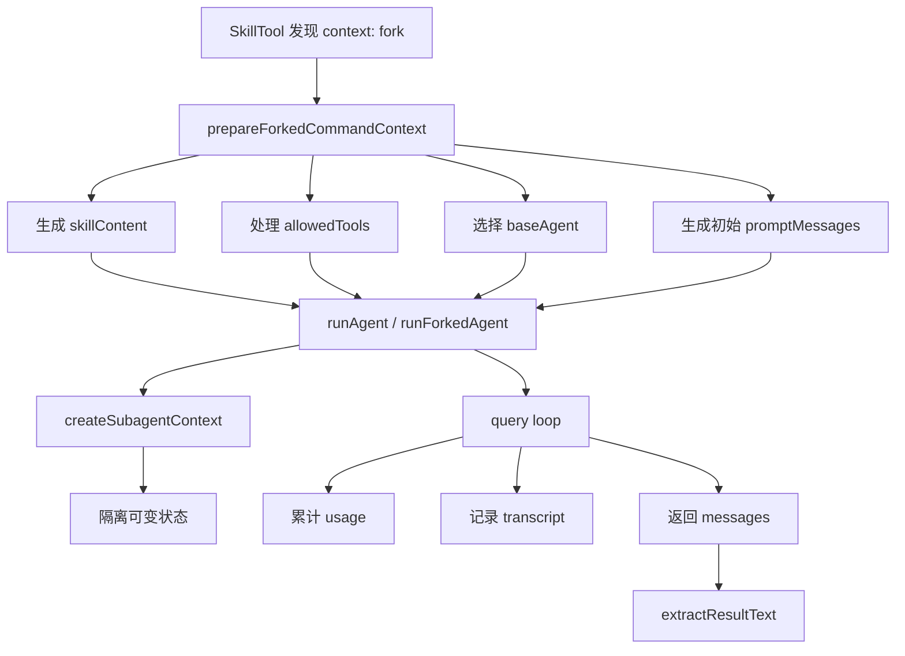
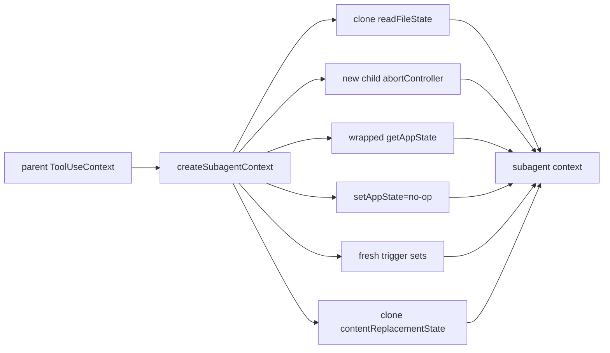

# Claude Code 源码共读笔记 26：forkedAgent 是 skill 接入 agent 执行层的胶水层

## 这篇看什么

上一讲已经把 `SkillTool.ts` 立住了。

那篇最重要的结论之一是：

- skill 不只是 inline prompt 展开
- `context: fork` 会把 skill 分流到独立 agent 执行路径

但如果只停在 `SkillTool.ts`，还有一段最关键的链路其实还没补上：

> 当一个 skill 决定 fork 之后，它是怎么被组装成真正能交给 agent runtime 去跑的？

这次主看的是：

- `src/utils/forkedAgent.ts`

我觉得这份文件的价值，不在于它“功能特别多”，而在于它的位置特别准。

它不负责定义 skill，也不负责实现完整 agent runtime。

它站在中间，专门处理这类问题：

- forked skill 怎么准备 prompt
- allowed tools 怎么带过去
- 该选哪个 agent
- 上下文怎样隔离
- 如何尽量共享 prompt cache
- 如何累计 usage
- 如何记录 sidechain transcript
- 最后怎么从一串 message 里抽出结果

所以我现在会直接给它下这个定义：

> `forkedAgent.ts` 不是普通工具文件，而是 skill 接入 agent 执行层的胶水层。

如果说：

- `loadSkillsDir.ts` 解决 skill 怎么被定义
- `SkillTool.ts` 解决 skill 怎么进入执行层

那 `forkedAgent.ts` 解决的就是：

- forked skill 怎么被包装成一个既隔离、又尽量复用父上下文的 agent 查询链

它看起来不像主角文件，但没有它，`context: fork` 这条线其实落不下来。

---

## 先给主结论

### 1. `forkedAgent.ts` 的核心任务不是“再跑一个 agent”，而是“把 forked work 安全地接进已有主循环”

很多人第一次看到这类文件，会下意识把它理解成：

- 帮你新开一个 agent
- 然后跑一下 query

但这份文件真正麻烦的点，从来都不是“开一个 agent”本身。

真正难的是这些约束要同时成立：

- 这个子执行链要和父上下文足够像，才能吃到 prompt cache
- 这个子执行链又必须和父上下文足够隔离，不能把可变状态污染回去
- 它要能带着父上下文已有 messages 起跑
- 它要能累计完整 usage，而不是只看最后一跳
- 它最好还能把 transcript 记下来，后面可追溯

所以这份文件的真正职责不是“启动一个 agent”，而是：

> 把 forked 执行变成一种既可复用父上下文、又不破坏父上下文的 sidechain 运行方式。

### 2. 它真正想保的不是“复用对象”，而是“复用 prompt cache”

这个文件里最值得注意的核心词其实不是 agent，而是：

- `CacheSafeParams`

而且注释写得很直：

- system prompt
- tools
- model
- messages prefix
- thinking config

这些东西必须尽量和父请求一致，才能命中 parent 的 prompt cache。

这说明 `forkedAgent.ts` 的设计目标不是“抽象一个子 agent API”那么简单。

它其实在认真优化：

> fork 出来的执行链，如何最大概率继续吃到父链已经付过的钱和算过的前缀。

这点很 Claude Code。

因为它不是只关心功能通不通，而是非常在意：

- 缓存
- 使用量
- query 代价
- 真实运行成本

### 3. 这份文件真正接的是两种边界：上下文边界和执行边界

我觉得可以把它拆成两个问题来理解。

#### 上下文边界
它要回答：

- 哪些东西应该继承父上下文
- 哪些东西必须克隆
- 哪些 callback 绝不能默认共享
- 哪些状态要 no-op

#### 执行边界
它要回答：

- forked skill 起跑时第一条 prompt 长什么样
- 这个 skill 用哪个 agent
- 这次 query loop 的 usage 怎么累计
- transcript 怎么记
- 结果怎么抽

所以 `forkedAgent.ts` 真正做的是：

> 在“尽量像父链”和“必须独立运行”之间，搭一个足够稳的中间层。

---

## 先把总图立住：forked skill 是怎么被它接起来的

先看总图最容易理解这份文件的位置。

这张图背后真正想表达的是：

- `SkillTool` 只是决定“走 fork 分支”
- 真正把 fork 分支组起来的，是 `forkedAgent.ts`

---

## 第一层：`prepareForkedCommandContext(...)` 是 skill fork 前的组装台

这一层是这篇最值得先立住的地方。

函数名叫：

- `prepareForkedCommandContext(...)`

这个名字挺朴素，但它干的事情刚好就是 `SkillTool` 和 agent runtime 中间最关键的那段“预装配”。

它主要做 4 件事：

1. 生成 `skillContent`
2. 处理 `allowedTools`
3. 选定 `baseAgent`
4. 产出初始 `promptMessages`

### 1. 先把 skill 真正展开成 `skillContent`

这里调用的是：

- `command.getPromptForCommand(args, context)`

注意这一点很关键：

> forked skill 起跑时喂给子 agent 的，不是原始 `SKILL.md`，而是已经过定义层处理后的最终 prompt。

也就是说，前面定义层里那些：

- 参数替换
- `${CLAUDE_SKILL_DIR}` 替换
- `${CLAUDE_SESSION_ID}` 替换
- 内联 shell 执行（若允许）

到这里都已经落完了。

所以 `prepareForkedCommandContext(...)` 接到的，不再是 skill 原文，而是一个已经 ready-to-run 的 prompt。

### 2. 把 `allowedTools` 变成真正的 permission context 修改

它会先：

- `parseToolListFromCLI(command.allowedTools ?? [])`

再通过：

- `createGetAppStateWithAllowedTools(...)`

包出一个修改后的 `getAppState`

这个函数干的事情其实很重要：

> 把 skill frontmatter 里的 allowedTools，正式翻译成 forked 子链里可直接生效的 permission context。

这说明 forked skill 不是只把正文交过去。

它还把工具边界一起交过去了。

### 3. agent 不是写死的，而是按 `command.agent` 选

这里会先看：

- `command.agent ?? 'general-purpose'`

再去 active agents 里找对应 agentType。

找不到就 fallback 到：

- `general-purpose`
- 再不行才是 `agents[0]`

这一段特别有意思，因为它说明：

> forked skill 的 agent 选择，不是 SkillTool 临时拍脑袋，而是 skill 定义层字段一路带过来的正式执行配置。

也就是说，前面 `loadSkillsDir.ts` 里把 `agent` 结构化，不是为了好看，到这里真的用上了。

### 4. 初始 `promptMessages` 很克制

最后它只做了一件很干净的事：

- `promptMessages = [createUserMessage({ content: skillContent })]`

这很值。

因为它说明 forked 技能起跑时，并没有搞复杂的 wrapper message 套娃，而是：

> 把 skill 展开后的完整内容，作为一条新的 user message，交给子执行链起跑。

这种做法非常直。

不是花哨设计，但稳。

---

## 第二层：`createGetAppStateWithAllowedTools(...)` 是权限迁移器

这个函数短，但我觉得要单独点出来。

它干的事情是：

- 保留原来的 `getAppState`
- 把 `allowedTools` merge 进 `alwaysAllowRules.command`

本质上它做的是：

> 把 skill 自带的工具授权，从定义对象迁移到 forked 子上下文可消费的 app state 里。

这一层为什么重要？

因为 forked skill 一旦进子 agent，如果不把工具权限也一起迁过去，就会出现一个很别扭的状态：

- skill 内容让它用某些工具
- 但子链实际又没拿到对应允许规则

那 skill 定义和执行就脱节了。

所以这个函数虽然小，但本质是在修这个“定义层 → 执行层”的一致性。

---

## 第三层：`createSubagentContext(...)` 才是这份文件最像“胶水层”的地方

如果要选这份文件里最核心的一个函数，我会选：

- `createSubagentContext(...)`

因为它最完整地体现了这份文件的气质：

> 不是简单复制 parent context，也不是完全重新造一个 context，而是有选择地继承、有选择地隔离。

这才是真正的胶水层思维。

### 它默认策略非常明确：**可变状态隔离，必要能力继承**

代码和注释都写得很清楚。

默认情况下：

- `readFileState`：clone
- `abortController`：新 child controller，挂到 parent 下
- `getAppState`：包装成避免 permission prompt 的版本
- 各类 mutation callback：默认 no-op
- `nestedMemoryAttachmentTriggers` / `toolDecisions` 等集合：fresh
- `contentReplacementState`：clone

这背后的原则非常清楚：

> 子 agent 默认不是父 agent 的可写延伸，而是父 agent 的隔离 sidechain。

### 为什么默认 `setAppState` 是 no-op 很关键

这一点特别值得记。

如果默认共享 `setAppState`，那很多 forked 执行就可能悄悄改父状态。

这样会让 forked path 变得非常难推理：

- 子链到底改没改主链
- 哪些 UI 状态被它影响了
- 哪些 permission 状态被它污染了

现在这种默认 no-op 的策略，相当于强行把边界画清：

> 不明确 opt-in 的共享，一律不共享。

这很对。

### `abortController` 的处理也很稳

它不是简单共享 parent abort，而是：

- 默认创建 child controller
- 但 child 跟 parent 有传播关系

这意味着：

- 父链 abort，子链也停
- 但子链自己的 abort 边界还是独立的

这个设计兼顾了：

- 生命周期联动
- 执行隔离

### `shouldAvoidPermissionPrompts` 这层包装也很值

如果不是显式共享 `abortController` 的 interactive subagent，
它会包装 `getAppState()`，把：

- `toolPermissionContext.shouldAvoidPermissionPrompts = true`

也就是说，默认 forked sidechain 不该自己冒 UI 权限弹窗。

这说明 Claude Code 对 forked agent 的默认定位不是“另一个和主线程平级的交互前台”，而是：

> 后台 sidechain worker。

这个定位非常清晰。

可以看这张图：

这张图其实就是一句话：

> 子上下文默认继承只读能力，不继承写回权。

---

## 第四层：为什么它这么在意 cache-safe params

这份文件里另一个很有味道的点是：

- `CacheSafeParams`
- `createCacheSafeParams(...)`
- `lastCacheSafeParams`

它一直在强调：

- system prompt
- user context
- system context
- toolUseContext
- forkContextMessages

这些东西尽量不要乱动。

### 这里真正想保的是 prompt cache 命中

注释里已经说得很明白：

Anthropic API 的 cache key 跟这些东西有关。

这意味着 forked 执行不是只考虑“逻辑上对不对”，而是还得考虑：

> 这次 fork 出去以后，能不能继续命中 parent 已经形成的 prompt cache。

### 这会反过来影响很多设计选择

比如：

- 为什么某些上下文要 clone 而不是重建
- 为什么 `contentReplacementState` 默认 clone
- 为什么 initial messages 要接在 `forkContextMessages` 后面
- 为什么不要随便改 thinking config

这些点如果只从“抽象接口设计”看，会觉得有点啰嗦。

但一旦把 prompt cache 放进来，就会明白它是在做非常现实的成本控制。

Claude Code 在这里的味道很强：

> 不是功能完成就算了，而是要让 forked 执行尽量便宜、尽量共享前缀、尽量不浪费缓存。

---

## 第五层：`runForkedAgent(...)` 不是跑一轮 query，而是在跑一条完整 sidechain

这一层是执行主干。

函数名是：

- `runForkedAgent(...)`

它最容易被误解成“帮你调用一次 query”。

但实际上它做的是一整条 sidechain query loop：

- 准备初始 messages
- 创建隔离上下文
- 迭代 `query(...)`
- 累加 usage
- 回传 message
- 记录 transcript
- 最后打点并返回结果

所以它更像：

> 一个带 usage 统计和 transcript 记录的 forked query runner。

### `initialMessages` 的构造非常关键

它不是只用 `promptMessages`，而是：

- `initialMessages = [...forkContextMessages, ...promptMessages]`

这一点很重要。

因为它意味着 forked 执行不是从真空里起跑，而是：

> 以父链已有上下文前缀为基础，再拼上自己的 fork prompt 起跑。

这就是为什么它有机会继续命中父 prompt cache。

### usage 不是只看一轮，而是跨整个 query loop 累积

这点很容易被忽略，但很关键。

它会盯：

- `stream_event`
- 里的 `message_delta`
- 然后通过 `updateUsage` / `accumulateUsage`

把整条 loop 的 usage 累起来。

也就是说，它统计的不是一次 API 调用，而是：

> 整个 forked 执行链到底花了多少 input/output/cache token。

这让后面的 telemetry 才真正有意义。

### transcript 记录也不是可有可无的

它还会：

- `recordSidechainTranscript(...)`

先记 initial messages，再按消息流继续记。

这说明 forked 执行不是临时黑箱。

Claude Code 其实很认真地在保留：

- 这条 sidechain 是怎么起跑的
- 中间收到了什么消息
- 最终怎样结束的

这样后面无论是 debug、追踪、恢复，都会有抓手。

---

## 第六层：`extractResultText(...)` 说明它对结果抽取采取的是非常克制的策略

这个函数不复杂：

- 找最后一条 assistant message
- 抽 text content
- 没有就 fallback 默认文本

我觉得它很值得一提，因为它说明 forked skill 的结果抽取并没有搞复杂总结器，也没有再套一层转换。

它采取的是一种非常克制的策略：

> 先把 forked sidechain 的最后一个 assistant 文本回答，当作最自然的结果出口。

这种做法好处很明显：

- 简单
- 可预测
- 不额外引入解释层

坏处也有：

- 如果最后 assistant 不是理想总结，结果就一般

但从工程权衡看，我觉得这是合理的。

因为这一层本来就应该是胶水层，不该再偷偷发明一套结果总结协议。

---

## 第七层：它其实在隐含定义“什么样的 fork 才是好 fork”

如果把整份文件抽象一下，我觉得它其实在给 Claude Code 定义一种理想 fork：

### 好的 forked 执行应该同时满足

1. **像父链**
   - 能复用前缀
   - 能命中 cache
   - 能继承必要上下文

2. **又不污染父链**
   - 可变状态隔离
   - 默认不共享写回 callback
   - 默认不弹自己的 permission prompt

3. **可观测**
   - usage 可累计
   - transcript 可记录
   - message 流可回传

4. **可配置**
   - agent 可指定
   - allowedTools 可注入
   - overrides 可精细控制

也就是说，这份文件虽然看起来像一堆 helper，但背后其实是一整套 fork 执行哲学。

---

## 第八层：它和前两篇是怎么严丝合缝接上的

这一篇如果单看，容易变成“又一个 utils 文件”。

但把它放回主线里，它的位置其实非常漂亮。

### 第 24 篇：`loadSkillsDir.ts`
回答的是：

- skill 是怎么被定义成结构化 prompt command 的

### 第 25 篇：`SkillTool.ts`
回答的是：

- skill 是怎么被纳入 tool runtime，并分流到 inline / fork / remote 的

### 第 26 篇：`forkedAgent.ts`
回答的是：

- fork 路径一旦成立，skill 怎么被组装成真正可跑的 sidechain agent 执行链

这三篇连起来以后，skill 主线前半段其实已经非常完整了：

1. 定义层：skill 是什么
2. 入口层：skill 怎么进入 runtime
3. 胶水层：forked skill 怎么被接进 agent 执行层

这就是为什么我会说这份文件虽然不是最显眼的名字，但位置特别关键。

---

## 我现在对这份文件的一句话定义

如果只留一句最短的话，我会留这个：

> `forkedAgent.ts` 是 Claude Code 的 fork 执行胶水层：它把 forked skill/command 组装成一个既尽量继承父链 cache-safe 前缀、又默认隔离可变状态的 sidechain agent 查询链。

这句话里我最想保住两个词：

- **cache-safe**
- **隔离**

因为这两件事，基本就是这份文件最难也最值钱的地方。

---

## 这篇最值得记住的几个判断

### 判断 1：`prepareForkedCommandContext(...)` 是 forked skill 起跑前的预装配台

### 判断 2：`createGetAppStateWithAllowedTools(...)` 在修 skill 定义和执行权限的一致性

### 判断 3：`createSubagentContext(...)` 的核心原则是“可变状态隔离，必要能力继承”

### 判断 4：`CacheSafeParams` 的真正目标不是抽象优雅，而是 prompt cache 命中率

### 判断 5：`runForkedAgent(...)` 跑的不是一次 query，而是一整条可计量、可记录的 sidechain

### 判断 6：这份文件真正站的位置，是 `SkillTool` 和 `runAgent` 中间的胶水层

---

## 下一步最顺怎么接

如果继续按这条线往下走，我觉得下一篇最顺的就是：

- `runAgent.ts`

因为现在：

- forked skill 怎么被组 prompt
- 怎么迁移 allowed tools
- 怎么建立子上下文
- 怎么累计 usage 和 transcript

这些都已经清楚了。

下一步自然就是：

> 这个被装配好的 sidechain，最终是怎么在 `runAgent.ts` 里真正跑起来的？

也就是继续把 skill 这条 fork 线，正式接进 agent runtime 主干。

如果按现在这个顺序，skill 线会很稳：

1. 定义层：`loadSkillsDir.ts`
2. 入口层：`SkillTool.ts`
3. 执行胶水层：`forkedAgent.ts`
4. 执行主干：`runAgent.ts`

我觉得这个顺序已经完全顺了。
