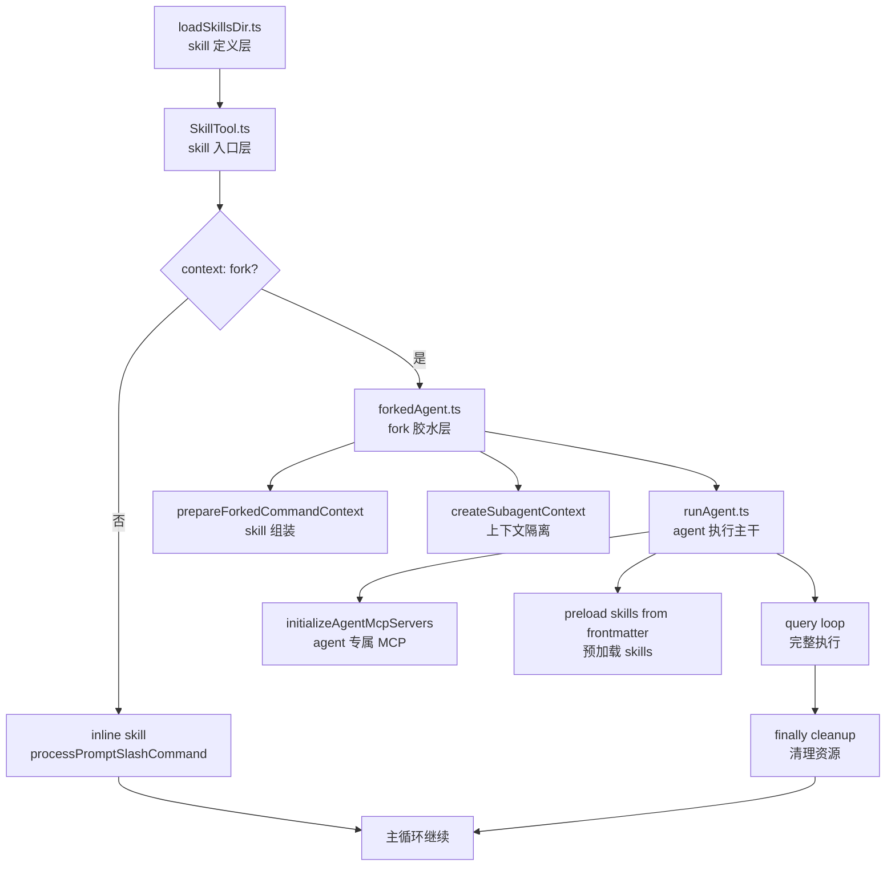
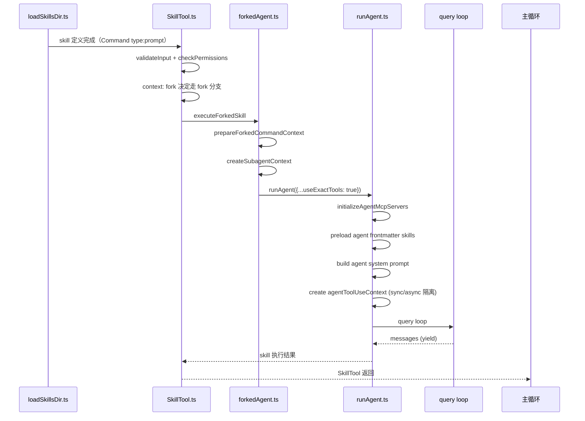

# Claude Code 源码共读笔记 27：runAgent 是 skill 接进 agent 执行层的主干

## 这篇看什么

到这一篇，skill 这条线已经很顺了。

前面三篇我们已经把骨架搭完了：

- 第 24 篇：`loadSkillsDir.ts` → skill 是怎么被定义的
- 第 25 篇：`SkillTool.ts` → skill 怎么进入执行层，并按 inline / fork 分流
- 第 26 篇：`forkedAgent.ts` → forked skill 怎么被组装成 sidechain agent

但还有最后一个关键问题没有回答：

> `forkedAgent.ts` 把 skill 组装成了子 agent 上下文，最后是谁真正执行它？

答案就是这次要看的：

- `src/tools/AgentTool/runAgent.ts`

这是 agent runtime 的执行主干文件之一。

如果 skill fork 路径是一棵树，那 `runAgent.ts` 就是那个真正把叶子跑起来的根。

它不是一个薄薄的 query 包装。

它真正在做的事情非常重：

- 解析 agent 定义里所有的运行时配置
- 初始化 agent 专属的 MCP servers
- 处理 permission mode / effort / thinking config
- 注入 agent frontmatter 里的 hooks 和 skills
- 构建完整的 agent system prompt
- 建立 sync / async 两种不同隔离策略的 subagent context
- 把整条 query loop 跑完、yield 出去
- 在 finally 里做清理（kill bash tasks、cleanup MCP、release state）

所以我现在会直接给它下这个定义：

> `runAgent.ts` 是 skill fork 路径真正落地的主干：它把 `forkedAgent.ts` 组装好的子 agent 上下文，通过完整的 agent 初始化流程，最终跑成一条可观测、可清理、可计量的 query loop。

这篇的核心任务，就是把 skill fork 这条线正式闭环。

---

## 先给主结论

### 1. `runAgent.ts` 不是 agent 的 query 包装，而是完整 agent 执行引擎

很多人第一次看到这个文件，会被它的长度吓到。

光看函数签名就觉得已经很复杂了：

```ts
export async function* runAgent({
  agentDefinition,
  promptMessages,
  toolUseContext,
  canUseTool,
  isAsync,
  forkContextMessages,
  querySource,
  override,
  model,
  maxTurns,
  availableTools,
  allowedTools,
  useExactTools,
  // ...
})
```

但我觉得这个文件真正值得注意的，不是参数多，而是它的处理链路非常完整。

一个 agent 起跑，它要做的远不止“调 query”：

- 先解析 agent 定义里的所有配置
- 再决定 permission mode / thinking / effort
- 再处理 MCP servers
- 再组装 system prompt
- 再决定 sync / async 的上下文隔离策略
- 再注册 hooks 和 skills
- 最后才跑 query loop
- 跑完之后，还要做完整的清理

也就是说，它是真正在做一个 agent 的完整生命周期管理。

而 query loop 只是其中一个环节。

### 2. 它让 skill 和 agent 的边界真正打通了

这个文件最让我觉得有意思的地方之一，是它明确在处理两件事：

- agent 可以 preload skills（通过 frontmatter）
- agent 可以自己初始化专属 MCP servers

这意味着 skill 系统不是游离在 agent 系统外面的东西。

到了 `runAgent.ts` 这一层，它们已经深度集成了。

### 3. 它其实是 skill fork 这条线的正式终点

我们从第 24 篇一路走过来，已经清楚了：

- skill 是怎么被定义 → `loadSkillsDir.ts`
- skill 怎么进 runtime → `SkillTool.ts`
- fork skill 怎么组装 → `forkedAgent.ts`
- 子 agent 怎么真正跑起来 → `runAgent.ts`

这四篇接起来，skill fork 路径才算完整闭环。

没有这一篇，前三篇都是在准备跑道；

有了这一篇，跑道才算真正有飞机落地。

---

## 先把总图立住：skill fork 这条线的完整闭环



这张图就是 skill fork 路径的完整闭环。

---

## 第一层：`runAgent` 对 agent 定义做了完整的运行时解析

这一层是 `runAgent` 里最靠前的部分，也是很多人会略过去的部分。

它上来并不是直接跑 query，而是先从 `agentDefinition` 里提取一大堆运行时配置。

### permission mode

它会先问：

- `agentDefinition.permissionMode`
- parent 的 permission mode 是什么

然后决定：

- 如果 parent 是 `bypassPermissions` 或 `acceptEdits`，那 parent 优先
- 否则，agent 自己的 permission mode 生效

还会决定：

- `shouldAvoidPermissionPrompts`（后台 agent 不该弹权限框）
- `awaitAutomatedChecksBeforeDialog`（前台 agent 等自动化检查）

这段逻辑看起来是配置处理，但背后其实在回答一个问题：

> 子 agent 的权限模型，到底该跟 parent 有多少联动，又该保持多少独立？

Claude Code 选了非常明确的策略：

- 不搞极端（不是完全共享，也不是完全隔离）
- 而是按权限模式的语义来决定联动程度

### effort

它会看：

- `agentDefinition.effort`
- parent 的 effortValue

然后在 `agentGetAppState()` 里写进去。

这个值会一路影响这个 agent 的行为级别。

### thinking config

这里有个很值的细节：

```ts
thinkingConfig: useExactTools
  ? toolUseContext.options.thinkingConfig  // 继承父链thinking
  : { type: 'disabled' as const }           // 普通 subagent 禁用thinking
```

这说明：

- `useExactTools`（也就是 skill fork 路径），会继承父链的 thinking 配置
- 普通 subagent 则默认关掉 thinking 来控制 token 成本

这个设计非常清醒。

因为 fork 路径本来就是为了尽量复用父链上下文，包括 thinking 配置本身也是上下文的一部分。

而普通 subagent 则应该按自己的任务来配置，不该照搬父链。

### model resolution

它会通过 `getAgentModel(...)` 综合三个信号来决定最终模型：

- `agentDefinition.model`
- parent 的 `mainLoopModel`
- 传入的 `model` override
- 当前 permission mode

这个函数干的事情，其实是在说：

> agent 用什么模型，不是一个静态配置，而是一个综合决策结果。

---

## 第二层：`initializeAgentMcpServers(...)` 说明 agent 可以自带 MCP 能力

这个函数我觉得是整份文件里最容易让人眼前一亮的点之一。

它不是在启动一个 agent 之前，把所有 MCP servers 都注册好；

而是：

- agent 定义里可以声明 `mcpServers`
- 这些是 agent 专属的 MCP servers
- 它们是 parent MCP clients 的增量，而不是替换
- 它们在 agent 启动时连接，结束时清理

这个设计非常合理。

因为它允许不同 agent 带不同的工具集：

- 有些 agent 需要 GitHub MCP
- 有些 agent 需要数据库 MCP
- 有些 agent 只需要基础的 file / bash / search

这些不需要全部加载到全局，按需装配就好。

### 这里还有个安全细节

代码里会检查：

- `isRestrictedToPluginOnly('mcp')`
- 但 plugin / built-in / policySettings 的 agent 不受限
- user-controlled agents 在 strict 模式下不能自带的 MCP servers

这说明 Claude Code 对 MCP 这种“可以执行任意代码”的能力，比普通 skill 更谨慎。

它没有把 MCP servers 当成普通工具，而是当成需要单独鉴权的能力。

---

## 第三层：`preload skills from frontmatter` 说明 skill 可以成为 agent 的固定能力

这一段是 skill 系统和 agent 系统真正打通的标志。

代码里会先看：

- `agentDefinition.skills ?? []`

然后对这些 skill 名字做 resolution，找到对应的 command，再调：

- `skill.getPromptForCommand('', toolUseContext)`

最后把 skill 内容注入成：

- 带 `isMeta: true` 的 user message

这意味着：

> 一个 agent 如果声明了 skills，这些 skill 就会成为这个 agent 每次起跑时必定加载的内容。

### 这里还有一个 `resolveSkillName(...)` 值得单独说

它解决了 plugin skill 的命名空间问题：

- Plugin agents 注册的 skill 名字可能是 `my-skill`
- 但实际 command 名字是 `my-plugin:my-skill`

它用了 3 层策略来解决：

1. 先 exact match
2. 再试 agent 的 plugin prefix 拼接
3. 最后做 suffix match

这说明 skill 名字的解析不是简单查表，而是考虑了 plugin 命名空间语义的。

---

## 第四层：sync 和 async 的隔离策略是 `runAgent` 里最关键的执行边界决策

这个文件里最核心的执行策略，其实就是这一行：

```ts
// Sync agents share setAppState, setResponseLength, abortController with parent
// Async agents are fully isolated (but with explicit unlinked abortController)
const agentToolUseContext = createSubagentContext(toolUseContext, {
  shareSetAppState: !isAsync,
  // ...
})
```

这段注释把 Claude Code 对 sync / async subagent 的设计哲学说得非常清楚：

### sync subagent（`isAsync: false`）
- 跟 parent 共享 `setAppState`
- 跟 parent 共享 `setResponseLength`
- 跟 parent 共享 `abortController`

这意味着 sync subagent 在某种意义上是 parent 的延伸，而不是独立 worker。

它可以直接改 parent 的 UI 状态、abort 父链、影响计量。

### async subagent（`isAsync: true`）
- 所有 mutation callback 都是 no-op
- 自己有独立的 abort controller（但会随 parent abort 传播）
- `shouldAvoidPermissionPrompts = true`

这意味着 async subagent 是真正的隔离 sidechain。

它跑完就结束，不影响父链的状态。

### 这个设计最妙的地方

它没有选“要么完全隔离、要么完全共享”这种二极管方案。

而是根据 subagent 的性质，给出了两个有意义的档位：

- sync = 协作线程（可以改父状态）
- async = 独立 worker（隔离，不影响父）

这两个档位都有实际意义，不是过度设计。

---

## 第五层：`query loop` 的 message 处理有精细的过滤策略

这一层在 `for await (const message of query(...))` 里。

它不是把 query 吐出来的所有消息都直接 yield，而是有策略地过滤。

### 几个关键过滤

#### 1. `stream_request_start` 消息直接 drop

这类消息是请求开始事件，不需要向上传递。

#### 2. `stream_event` 里的 TTFT 数据会被捕获，但不会直接 yield

```ts
if (
  message.type === 'stream_event' &&
  message.event.type === 'message_start' &&
  message.ttftMs != null
) {
  toolUseContext.pushApiMetricsEntry?.(message.ttftMs)
  continue
}
```

它会捕获 TTFT（Time to First Token），然后继续。

这就是说：

> subagent 的首个 token 响应速度，会回传给父链的 metrics 显示。

这是让 subagent 对父链可观测的方式之一。

#### 3. `attachment` 类型的 `max_turns_reached` 会 break

这是一个 agent 级别的信号，表示 agent 跑到了配置的 max turns 上限。

#### 4. 只有 `isRecordableMessage` 才被 yield 和记录

这包括：

- `assistant`
- `user`
- `progress`
- `system`（且是 `compact_boundary` subtype）

其他的全部静默 drop。

这个策略很值，因为它在保证可观测性的同时，又避免了把内部状态消息泄露给上层。

---

## 第六层：finally 清理是 `runAgent` 完整生命周期管理的最后一环

这一层是我看这份文件之前容易低估的部分。

它并不是 query 跑完就算了。

finally 块里有非常完整的清理：

```ts
finally {
  await mcpCleanup()                    // 清理 agent 专属 MCP servers
  clearSessionHooks(...)                 // 清理 frontmatter hooks
  cleanupAgentTracking(agentId)          // 清理 prompt cache tracking
  agentToolUseContext.readFileState.clear()  // 释放文件 state cache
  initialMessages.length = 0             // 释放克隆的 fork messages
  unregisterPerfettoAgent(agentId)      // 清理 perfetto trace
  clearAgentTranscriptSubdir(agentId)    // 清理 transcript 目录
  rootSetAppState(...)                  // 清理 todos entries
  killShellTasksForAgent(agentId, ...)  // kill 后台 bash tasks
}
```

### 这里最值的细节：kill bash tasks

注释里已经说了：

> 没有这步，一个 `run_in_background` shell loop 会变成 PPID=1 的僵尸进程，永远不会被回收。

这个细节说明 Claude Code 不是只关心 agent 逻辑层面的完整性，它还在处理：

- 进程级别的资源泄漏
- 容器/NF) 环境下长时间 session 的进程残留

这种意识非常工程化。

---

## 第七层：skill fork 这条线到 `runAgent` 才真正闭环

我们从第 24 篇一路走过来，现在终于可以画出一条完整的 skill fork 执行链：



这个图说明 skill fork 这条线，从定义到执行，每一步都有对应文件负责。

---

## 这篇最值得记住的几个判断

### 判断 1：`runAgent.ts` 是完整的 agent 执行引擎，不是 query 包装

### 判断 2：agent 可以自带 MCP servers 和 preload skills，说明 skill 和 agent 系统已经深度集成

### 判断 3：sync / async 的隔离策略，给了 subagent 两种有实际意义的执行档位

### 判断 4：finally 清理覆盖了 MCP / hooks / file cache / bash tasks，说明 Claude Code 在认真处理资源泄漏

### 判断 5：skill fork 路径到 `runAgent` 才真正落地闭环

---

## 现在 skill 主线的前半段已经很完整了

到这一篇为止，skill 这条线已经有了非常清晰的骨架：

1. **定义层**：`loadSkillsDir.ts` ✅
2. **入口层**：`SkillTool.ts` ✅
3. **胶水层**：`forkedAgent.ts` ✅
4. **执行主干**：`runAgent.ts` ✅

这四篇合起来，已经把 skill 从定义到执行的完整路径讲完了。

剩下的还有两条自然延伸：

- **inline skill 执行层**：`processPromptSlashCommand`（skill 的 inline 路径）
- **写法层**：怎么写一个真正好的 SKILL.md frontmatter + 正文

这两块按需继续。

但骨架已经有了。

---

## 我现在对 `runAgent.ts` 的一句话定义

如果只留一句最短的话，我会留这个：

> `runAgent.ts` 是 skill fork 路径落地的主干：它把 forked skill 组装成完整 agent，通过 agent 系统做初始化、隔离、执行、可观测化，最后跑成一条可清理的 query loop。

这句话最想保留的两个词：

- **agent 系统**
- **可清理的 query loop**

因为前者说明它不是简单 query 封装，而是认真在用 agent 生命周期管理；
后者说明它不是跑完就丢，而是会做完整资源清理。

---

## 下一步最顺怎么接

如果继续按 skill 主线走，下面最顺的方向有两个：

### 方向 A：`processPromptSlashCommand`
这是 skill inline 路径的执行层，解答的是 skill 不走 fork 时的完整展开逻辑。

### 方向 B：skill 写法层
回到 `loadSkillsDir.ts` 里那些 frontmatter 字段，看它们怎么在运行时真正生效。

这两条都是自然延伸，看你更关心哪条。
