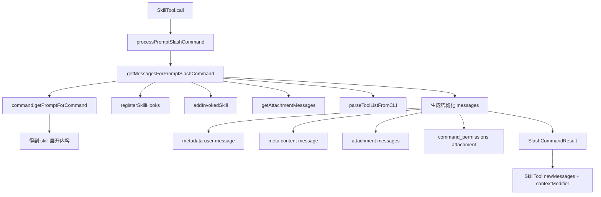
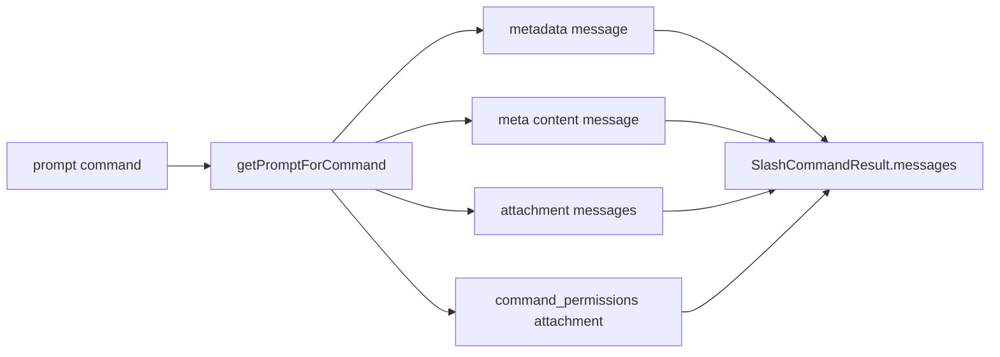

# Claude Code 源码共读笔记 28：processPromptSlashCommand 是 skill inline 路径的展开层

## 这篇看什么

前面 skill 这条主线，我已经把 fork 路径补齐了：

- `loadSkillsDir.ts`：定义层
- `SkillTool.ts`：入口层
- `forkedAgent.ts`：fork 胶水层
- `runAgent.ts`：fork 执行主干

但 skill 其实不是都走 fork。

另一半同样关键的路径是：

> **inline skill 到底怎么展开回当前主循环？**

这次看的真实文件是：

- `src/utils/processUserInput/processSlashCommand.tsx`

更准确一点说，这篇重点看的是其中这几个函数：

- `processPromptSlashCommand(...)`
- `getMessagesForPromptSlashCommand(...)`
- `formatSkillLoadingMetadata(...)`
- `formatCommandLoadingMetadata(...)`

如果前面几篇解决的是：

- skill 怎么被定义
- skill 怎么进入 runtime
- skill 走 fork 时怎么接进 agent 执行层

那这一篇解决的就是：

- skill 不走 fork 时，怎么在当前线程里被展开成一组有语义的 message + permission + metadata

我现在对这段代码的判断是：

> `processPromptSlashCommand(...)` 不是简单的 prompt 拼接器，而是 skill inline 路径的展开层：它把一个 prompt command 变成当前主循环真正可消费的一组结构化消息，并把权限、模型、hook、附件发现这些运行信息一起带出去。

这句话很关键。

因为如果只把 inline skill 理解成“把 SKILL.md 塞回上下文”，会低估这层很多。

它真正干的是：

- 生成运行前提示元数据
- 展开 skill prompt
- 注册 hooks
- 记录 invoked skill 以便 compaction 恢复
- 提取附件消息
- 生成 command permissions 附件
- 把 allowedTools / model / effort 一起往上返回

所以它是 **inline skill 的运行时展开层**，不是文本拼接层。

---

## 先给主结论

### 1. `processPromptSlashCommand(...)` 本身很薄，但它薄得很对

这个函数本体其实非常短：

```ts
export async function processPromptSlashCommand(
  commandName: string,
  args: string,
  commands: Command[],
  context: ToolUseContext,
  imageContentBlocks: ContentBlockParam[] = [],
): Promise<SlashCommandResult> {
  const command = findCommand(commandName, commands)
  if (!command) throw new MalformedCommandError(...)
  if (command.type !== 'prompt') throw new Error(...)
  return getMessagesForPromptSlashCommand(command, args, context, [], imageContentBlocks)
}
```

它几乎不做业务本身，只做三件事：

1. 找 command
2. 确认它真的是 `prompt` command
3. 把活交给 `getMessagesForPromptSlashCommand(...)`

这种写法很好。

因为这说明 Claude Code 对这层的认知是清楚的：

> `processPromptSlashCommand(...)` 只是入口壳，真正复杂的工作应该沉到统一展开函数里。

这样 skill inline 路径和 slash command 路径，才能共享同一套展开逻辑。

### 2. 真正值钱的是 `getMessagesForPromptSlashCommand(...)`

这才是这篇的核心。

这个函数真正做的事，不是“生成一条 prompt”，而是：

> 把一个 prompt command 编译成一组当前主循环能理解、能追踪、能授权、能展示的结构化消息。

也就是说，它的输出不是纯文本，而是：

- command metadata message
- 真正的 meta user message
- attachment messages
- command permissions attachment
- 外加 allowedTools / model / effort 等运行元数据

这就说明 Claude Code 的 inline skill 路径，从一开始就不是“文本宏展开”心智。

而是：

> **消息级展开**。

### 3. inline skill 真正的产物，不是一段 prompt，而是一组结构化 side effects

这个点非常关键。

如果只看 `command.getPromptForCommand(...)`，你会觉得：

- 结果不就是一段展开后的内容吗？

但 `getMessagesForPromptSlashCommand(...)` 往后再看，会发现真正的产物远不止这个：

- hooks 被注册了
- skill invocation 被记到 state 里了
- attachments 被发现了
- allowed tools 被抽出来了
- model / effort 被带出去了
- UI 用的 command metadata 也生成了

也就是说，inline skill 的执行结果不是“一段文字”，而是：

> 一次对当前会话消息流和运行上下文的结构化注入。

---

## 先把总图立住：inline skill 在这里到底怎么展开



这张图其实就是一句话：

> inline skill 的关键，不是 prompt 本身，而是 prompt 被包装成了怎样的一组 runtime 消息。

---

## 第一层：`formatSkillLoadingMetadata(...)` 暗示了 skill 在 UI 层不是“内容块”，而是“命令事件”

这个函数很短，但很值得看。

它生成的是：

```xml
<command-message>skill-name</command-message>
<command-name>skill-name</command-name>
<skill-format>true</skill-format>
```

这个设计的意思其实很明确：

> skill 在 UI / 消息渲染层，不只是“接下来有一段内容”，而是“发生了一次 skill 调用事件”。

### 为什么这点重要

因为如果没有这层 metadata，前端或渲染层看到的就只是一条普通 user message。

但有了这个 metadata，Claude Code 就可以把它渲染成：

- 这是哪个 skill 在运行
- 它是 skill 还是 slash command
- 它应该按哪种 UI 形式展示

这说明 inline skill 不只是 runtime 行为，也是一种前端可感知的命令事件。

### `formatCommandLoadingMetadata(...)` 更进一步

它会区分：

- `userInvocable !== false` 的技能 → 显示成 `/command`
- model-only skills → 显示成 skill format

这个细节挺妙。

因为它说明 Claude Code 区分两类东西：

1. **像 slash command 一样由用户直接感知和触发的东西**
2. **主要给模型用的 skill**

所以同样是 prompt command，在展示层面也会有不同语义。

---

## 第二层：`getMessagesForPromptSlashCommand(...)` 第一件事不是展开 prompt，而是先处理 coordinator mode

这个分支很容易被忽略，但我觉得挺值的。

如果当前是：

- `COORDINATOR_MODE`
- 且 main thread（`!context.agentId`）

它不会去加载完整 skill 内容。

而是直接构造一段摘要，大意是：

- 这个 skill 可用
- 它的 description / whenToUse 是什么
- 它会给 worker 额外哪些 tool permissions
- 你应该让 worker 去用这个 skill

### 这说明什么

说明 Claude Code 对 coordinator 的定位很清楚：

> coordinator 不该自己吃完整 skill prompt，它只需要知道“该把这个 skill 派给哪个 worker”。

这个设计很对。

因为 coordinator 自己通常只有：

- Agent
- TaskStop

这时完整 skill 内容和 allowedTools 对它没意义，反而会白白占上下文。

所以这段逻辑实际上在做：

> **inline skill 展开在不同执行角色下的差异化降级。**

不是所有线程都应该看到同样重的 skill 内容。

---

## 第三层：真正的 skill 展开发生在 `command.getPromptForCommand(...)`

过了 coordinator 分支后，才真正走到：

```ts
const result = await command.getPromptForCommand(args, context)
```

这一步很关键，因为它把这篇和前面的 `loadSkillsDir.ts` 又接起来了。

### 这里接上的是什么

在定义层里，`createSkillCommand(...)` 已经挂好了：

- `getPromptForCommand(...)`

那个函数里面已经做过：

- base directory 注入
- 参数替换
- `${CLAUDE_SKILL_DIR}` 替换
- `${CLAUDE_SESSION_ID}` 替换
- 非 MCP skill 的 inline shell 执行

所以到 `processPromptSlashCommand(...)` 这里，
它拿到的已经不是 skill 原文，而是：

> **按当前 args 和 context fully expanded 的最终 prompt blocks。**

这点非常关键。

因为这说明 inline 路径不是“重复实现一次 skill 展开逻辑”，而是：

- 定义层负责 prompt 生成
- 展开层负责消息打包与 runtime 注入

职责是分开的。

---

## 第四层：hooks 在这里真正注册，说明 inline 路径是 skill 运行语义兑现点之一

这段代码特别重要：

```ts
if (command.hooks && hooksAllowedForThisSkill) {
  const sessionId = getSessionId()
  registerSkillHooks(...)
}
```

这意味着什么？

意味着 skill frontmatter 里的 `hooks`，并不是在定义层一解析就算生效。

真正的生效点在这里。

也就是说：

> 定义层只把 hooks 结构化，inline 展开层才把 hooks 注册进当前 session。

### 这里还有个安全闸门

它会检查：

- `isRestrictedToPluginOnly('hooks')`
- `isSourceAdminTrusted(command.source)`

这说明 hook 注册不是默认信任所有 skill 来源的。

这个位置也选得很准：

- 定义层知道字段长什么样
- 但只有运行时展开层，才知道“这个 skill 现在真的要被执行了”

所以把 hook registration 放在这里，比放在 loader 里合理得多。

---

## 第五层：`addInvokedSkill(...)` 说明 inline skill 不是“一次性 prompt”，而是会被 compaction 追踪

这段也特别关键：

```ts
const skillPath = command.source ? `${command.source}:${command.name}` : command.name
const skillContent = result.filter(...).map(...).join('\n\n')
addInvokedSkill(command.name, skillPath, skillContent, getAgentContext()?.agentId ?? null)
```

这一步背后的设计意图很明确：

> 一旦这个 skill 被调用，Claude Code 要记住它，后面 compact 时还得能恢复它。

也就是说，inline skill 不是临时文本片段，跑完就和系统无关了。

相反，它是会被 runtime state 显式追踪的一类调用资产。

### 为什么这层重要

因为 skill 常常很长，而且对后续行为影响很大。

如果 compact 之后 skill 内容丢了，模型后面的行为可能就失真。

所以 Claude Code 在这里做的，其实是：

> 把 skill 内容纳入 compaction-preservation 体系。

这就再次说明 skill 不是简单 prompt 文本，而是正式 runtime 资产。

---

## 第六层：`getAttachmentMessages(...)` 说明 skill 内容本身还能继续触发附件发现

这层很有意思，也很容易被低估。

代码里会把 skill 展开后的文本拼起来，再喂给：

- `getAttachmentMessages(...)`

也就是说，skill 正文里如果带了：

- `@` mentions
- MCP resources
- agent mentions

这些东西会继续被提取成 attachment messages。

### 但这里有个很聪明的限制

它传了：

- `skipSkillDiscovery: true`

注释也写得很清楚：

> 不让 SKILL.md 本身再次触发 skill discovery。

这特别值。

因为 skill 文件本身可能很大，如果把它当普通用户输入去做 skill discovery，会额外触发 chunked 查询，平白增加很多延迟。

所以这里本质上做了一个很细的区分：

- 允许 skill 内容继续触发附件提取
- 但禁止 skill 内容自己再触发 skill discovery

这个边界拿捏得非常到位。

---

## 第七层：最终返回的不是一条消息，而是四层结构

我觉得这是整篇最关键的地方。

最终 `messages` 长这样：

```ts
const messages = [
  createUserMessage({ content: metadata, uuid }),
  createUserMessage({ content: mainMessageContent, isMeta: true }),
  ...attachmentMessages,
  createAttachmentMessage({
    type: 'command_permissions',
    allowedTools: additionalAllowedTools,
    model: command.model,
  }),
]
```

这意味着 inline skill 真正的结构化展开至少有四层：

### 1. metadata message
告诉系统和 UI：
- 现在在跑哪个 command/skill
- 该按什么形式显示

### 2. main meta content message
这才是 skill 真正展开出来的内容本体。

### 3. attachment messages
从 skill 正文里抽出来的结构化附件信号。

### 4. command permissions attachment
把 `allowedTools` / `model` 这种运行信息，单独挂成 attachment。

这个设计非常成熟。

因为它把：

- 展示信息
- 内容信息
- 附件信息
- 权限/模型信息

分开存放，而不是搅成一个大字符串。

可以看这张图：



这张图就是这篇最核心的结论之一：

> inline skill 的结果是消息结构，不是文本结果。

---

## 第八层：为什么 `SkillTool.ts` 还要再做一层过滤和 `contextModifier`

这一篇如果单看，很容易问一个问题：

> 既然这里都已经把 allowedTools / model / effort 返回了，为什么 `SkillTool.ts` 还要再加工一次？

答案是：

- `processPromptSlashCommand(...)` 负责**展开**
- `SkillTool.ts` 负责**把展开结果接回 Tool runtime**

也就是说，两层职责不同。

### 这层负责的

- 生成结构化 messages
- 附带运行信息

### SkillTool 再负责的

- 过滤掉 progress / command-message 展示层内容
- 通过 `tagMessagesWithToolUseID(...)` 绑定 tool use 生命周期
- 把 allowedTools / model / effort 变成 `contextModifier`

所以不是重复。

而是：

> `processPromptSlashCommand` 先做“命令展开”，`SkillTool` 再做“工具接线”。

这两层分开后，inline 路径才清楚。

---

## 第九层：这篇和前面几篇是怎么扣上的

到这里，skill 主线其实已经非常完整了。

### 第 24 篇：`loadSkillsDir.ts`
回答：
- skill 怎么被定义成 `prompt command`

### 第 25 篇：`SkillTool.ts`
回答：
- skill 怎么作为工具入口进入 runtime
- inline / fork / remote 怎么分流

### 第 26 篇：`forkedAgent.ts`
回答：
- forked skill 怎么被组装成 sidechain

### 第 27 篇：`runAgent.ts`
回答：
- forked skill 怎么真正跑起来

### 第 28 篇：`processPromptSlashCommand.tsx`
回答：
- inline skill 怎么被展开成结构化 message + permission + metadata

所以到这篇为止，skill 的两条执行路径其实都补齐了：

1. **fork 路径**：`SkillTool -> forkedAgent -> runAgent`
2. **inline 路径**：`SkillTool -> processPromptSlashCommand`

这时候 skill 线的结构才算真正稳定。

---

## 我现在对这段代码的一句话定义

如果只留一句最短的话，我会留这个：

> `processPromptSlashCommand(...)` 是 skill inline 路径的展开层：它把 prompt command 生成的内容，包装成一组当前主循环可消费的结构化消息，并把 hooks、attachment、permission、model 等运行信息一起注入会话。

我觉得这里最想保住两个词：

- **展开层**
- **结构化消息**

因为这正是它和“拼 prompt 字符串”最大的区别。

---

## 这篇最值得记住的几个判断

### 判断 1：`processPromptSlashCommand(...)` 本体很薄，但真正复杂的工作被统一沉到 `getMessagesForPromptSlashCommand(...)`

### 判断 2：inline skill 的结果不是文本，而是一组结构化 messages

### 判断 3：hook 注册、invoked skill 记录、attachment 提取，都是 inline 路径真正的运行语义兑现点

### 判断 4：`command_permissions` attachment 说明权限/模型信息被单独结构化存放，而不是揉进正文

### 判断 5：`SkillTool` 和 `processPromptSlashCommand` 不是重复，而是“命令展开”和“工具接线”两层分工

---

## 现在 skill 主线已经闭环了

到这一篇，skill 这条线从定义到执行，已经可以完整画出来：

1. **定义层**：`loadSkillsDir.ts`
2. **入口层**：`SkillTool.ts`
3. **inline 展开层**：`processPromptSlashCommand.tsx`
4. **fork 胶水层**：`forkedAgent.ts`
5. **fork 执行主干**：`runAgent.ts`

这套骨架已经够稳了。

后面如果继续，最顺的就不一定还是追 runtime 文件了，而可以回到：

- skill 写法层
- frontmatter 字段设计
- 什么样的 SKILL.md 才是“真的能进 runtime”的 skill

那会是下一阶段。
