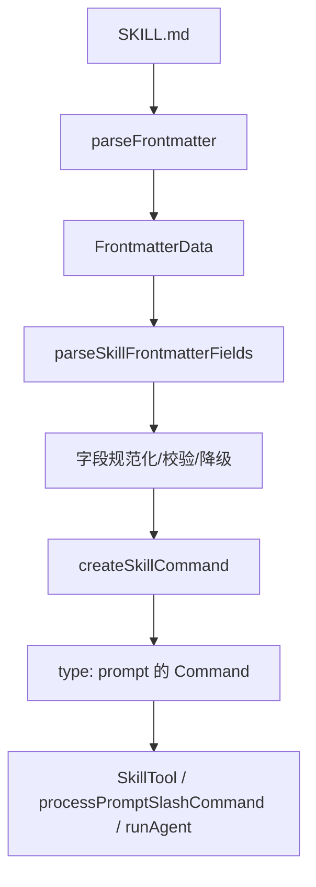

# Claude Code 源码共读笔记 29：frontmatter 不是注释而是 skill 的运行时接口

## 这篇看什么

到上一讲为止，skill 这条执行线已经闭环了：

- `loadSkillsDir.ts`：定义层
- `SkillTool.ts`：入口层
- `processPromptSlashCommand.tsx`：inline 展开层
- `forkedAgent.ts`：fork 胶水层
- `runAgent.ts`：fork 执行主干

所以这次我不再继续沿 runtime 往前追，而是回到 skill 的写法层。

但这次不是那种“字段手册式”的写法。

我更想回答的是：

> Claude Code 里，一个 skill 顶部那段 frontmatter，到底是什么？

这次重点看两个文件：

- `src/utils/frontmatterParser.ts`
- `src/skills/loadSkillsDir.ts`

看完之后，我觉得可以把结论说得非常明确：

> 在 Claude Code 里，frontmatter 不是写在 markdown 顶上的注释块，而是 skill 的运行时接口。

这句话很关键。

因为如果把 frontmatter 当“文档元数据”，就很容易误解 skill：

- description 只是说明
- model 只是建议
- context 只是标签
- hooks 只是附加信息
- paths 只是检索提示

但实际不是。

Claude Code 在定义层里做的事情，是把这些字段正式编译成：

- command identity
- UI 展示信息
- 执行上下文
- 权限边界
- 激活条件
- 模型选择
- hook 注册入口
- shell 执行策略

所以这篇真正想讲清的是：

> **skill frontmatter 不是 markdown 装饰，而是 runtime contract。**

---

## 先给主结论

### 1. frontmatter 的真正角色，不是“补充描述”，而是“声明 skill 如何进入系统”

如果只站在写 markdown 的视角，很容易觉得 frontmatter 只是给人看的说明头：

- 标题
- 描述
- 版本
- 标签

但在 Claude Code 里，它不是这个地位。

从 `parseFrontmatter(...)` 到 `parseSkillFrontmatterFields(...)` 再到 `createSkillCommand(...)` 这一整条链看下来，frontmatter 真正在做的是：

> 把一个 markdown 文件声明成一个可进入 Claude Code runtime 的 prompt command。

也就是说，frontmatter 回答的不是“这篇文档是什么”，而是：

- 这个 skill 叫什么
- 谁能调它
- 什么时候激活
- 走 inline 还是 fork
- 允许它带哪些工具能力
- 它会不会注册 hooks
- 它该用哪个 shell 跑 `!` 块

这是完全不同的层级。

### 2. Claude Code 对 frontmatter 的态度很工程，不是很文档

这一点在两个文件里都很明显。

`frontmatterParser.ts` 在做的是：

- YAML 解析
- 容错引用
- 路径 frontmatter 拆分与 brace expansion
- boolean / shell / description 等字段的 coercion

`loadSkillsDir.ts` 在做的是：

- frontmatter 字段语义化
- 无效值降级
- hooks schema 校验
- model / effort / paths / shell / userInvocable 等字段变成 `Command` 属性

这说明 Claude Code 对 frontmatter 的处理方式不是：

- 原样读出来
- 然后随便用

而是：

> 像解析一段配置接口那样，带着容错、校验、降级、规范化地处理。

这就是典型 runtime 接口的处理方式，不是文档 metadata 的处理方式。

### 3. skill 写法层最该记住的一点：写 frontmatter，本质上是在写 runtime 行为

我觉得这是这篇最重要的一句话。

比如你写：

- `context: fork`
- `allowed-tools: Bash, Read`
- `model: opus`
- `hooks: ...`
- `paths: src/**/*.ts`

你不是在“给这个 skill 加点说明”。

你是在直接声明：

- 这玩意要不要走子 agent
- 它的权限边界是什么
- 它切不切模型
- 它会不会给 session 注册 hooks
- 它是不是条件激活 skill

所以 skill frontmatter 的写法，本质上已经是系统设计，不是文案填写。

---

## 先把总图立住：frontmatter 是怎么变成 runtime 的

这个图最关键的意思是：

> frontmatter 不是停在 markdown 层，而是一路进入 command 对象，再进入 runtime。

---

## 第一层：`parseFrontmatter(...)` 的作用不是“读 YAML”，而是把 skill 写法变成可容错的输入层

这一层在 `frontmatterParser.ts`。

表面上它像个普通 parser，但其实它做了两件很有味道的事：

### 1. 它不是严格失败，而是尽量容错后继续

如果第一次 YAML parse 失败，它不会马上放弃，而是会：

- `quoteProblematicValues(...)`
- 再试一次

这里最典型的就是 glob 场景，比如：

- `src/*.{ts,tsx}`
- 带 `{}`、`*`、`: ` 等 YAML 敏感字符的值

它会自动帮你补 quoting，再重试。

这件事背后的态度很明确：

> frontmatter 是人写的接口，系统应该尽量帮人兜一层，而不是一有字符问题就全盘失效。

### 2. 它失败时也不炸系统，而是 warn + degrade

如果重试后还是失败，它只会：

- `logForDebugging(...)`
- 然后返回空 frontmatter / 原始内容继续走

这说明 Claude Code 把 frontmatter 当成：

- 很重要
- 但不应该让整个 skill loader 因为一段 YAML 崩掉

这是一种很成熟的配置系统心态。

---

## 第二层：`FrontmatterData` 这份类型定义，本身就在告诉你“哪些字段真有运行语义”

`frontmatterParser.ts` 里的 `FrontmatterData` 很值得认真看。

因为它不是一个“任意对象”。

它已经把 Claude Code 认为重要的字段列出来了，比如：

- `allowed-tools`
- `description`
- `argument-hint`
- `when_to_use`
- `model`
- `skills`
- `user-invocable`
- `hooks`
- `effort`
- `context`
- `agent`
- `paths`
- `shell`

这里最重要的不是字段多，而是：

> 这些字段都已经被系统承认成有正式含义的 runtime 输入。

这跟“我在 frontmatter 里随便加个 author / note / topic”完全不是一回事。

后者当然也能写，但系统不认；
前者一旦写了，后面的 loader 和 runtime 都真的会用。

所以如果要分层看：

- 自己随便写的字段 = 文档注释
- `FrontmatterData` 里被系统识别的字段 = runtime 接口

这条线要分清。

---

## 第三层：`parseSkillFrontmatterFields(...)` 才是 frontmatter 变 runtime 的第一道编译器

这函数是整篇最该立住的地方。

它做的事不是简单 `frontmatter.xxx ?? default`，而是：

> 把原始 frontmatter 字段编译成 skill command 能消费的标准运行参数。

### 它产出的不是 frontmatter，而是这些运行字段

- `displayName`
- `description`
- `hasUserSpecifiedDescription`
- `allowedTools`
- `argumentHint`
- `argumentNames`
- `whenToUse`
- `version`
- `model`
- `disableModelInvocation`
- `userInvocable`
- `hooks`
- `executionContext`
- `agent`
- `effort`
- `shell`

这已经不是文档处理了，而是一个小型编译阶段。

### 这里有几个特别值的设计

#### 1. `description` 不只是读出来，还会 fallback

它先走：

- `coerceDescriptionToString(frontmatter.description, ...)`

如果拿不到，再退回：

- `extractDescriptionFromMarkdown(...)`

这说明 loader 的目标不是“忠实保存输入”，而是：

> 尽量产出一个总是可展示、可理解的 command 描述。

#### 2. `model: inherit` 会被规范化成 `undefined`

这个点挺关键。

也就是说，`inherit` 不是一个要往下游继续传的运行值，而是在定义层就被规整成：

- “不 override，由父模型继承”

这很像编译器把语法糖提前消掉。

#### 3. `context: fork` 不保留字符串世界，而是直接变 executionContext

loader 并不关心“原文写的是不是个好看的标签”。

它关心的是：

- runtime 里这个字段最后能不能变成明确的执行分流信号

#### 4. `effort` 会做 parse + invalid degrade

如果 effort 无效，不会硬报错，而是：

- log warning
- 返回 undefined

这 again 很像配置编译，而不是文档解析。

#### 5. `hooks` 会走 schema

这说明 hooks 不是自由文本。

它是一份有结构要求的运行时配置。

只要你把它当“随便写点对象进去”，迟早出问题。

---

## 第四层：`createSkillCommand(...)` 说明 frontmatter 真正的落点是 Command 对象，而不是 markdown 保留层

这层特别重要。

前面 parse 完的那些运行字段，最后都进入：

- `createSkillCommand(...)`

然后被装配成一个真正的 `Command`。

### 这一步意味着什么

意味着 frontmatter 的最终归宿不是：

- 附在 markdown 文件旁边
- 某个 metadata map 里
- 等 UI 需要时再看一下

而是：

> 直接写进 Claude Code 最核心的 command 抽象里。

### 哪些 frontmatter 字段会直接落进 Command

非常多，比如：

- `name`
- `description`
- `allowedTools`
- `argumentHint`
- `argNames`
- `whenToUse`
- `version`
- `model`
- `disableModelInvocation`
- `userInvocable`
- `context`
- `agent`
- `effort`
- `paths`
- `hooks`
- `skillRoot`

也就是说，frontmatter 里的核心字段，最后根本不是“文档头信息”，而是 command runtime 的成员变量。

这就足够说明它是运行时接口，而不是注释了。

---

## 第五层：几个最关键字段，其实对应的是几种完全不同的 runtime 维度

如果从设计角度看，我觉得 skill frontmatter 至少有五类字段。

### A. 身份 / 展示类
- `name`
- `description`
- `version`
- `when_to_use`
- `argument-hint`

这些字段主要解决：

- 这个 skill 怎么被识别
- 怎么展示给用户和模型
- 什么时候建议使用

### B. 调用边界类
- `user-invocable`
- `disable-model-invocation`

这些字段解决的是：

- 用户能不能直接 `/skill-name`
- 模型能不能通过 SkillTool 调它

也就是说，它们定义的是 **谁能调这个 skill**。

### C. 执行路径类
- `context`
- `agent`
- `effort`
- `model`

这些字段定义的是：

- 走 inline 还是 fork
- fork 用哪个 agent
- effort 多高
- 是否切模型

也就是说，它们决定的是 **skill 怎么执行**。

### D. 权限 / 能力类
- `allowed-tools`
- `hooks`
- `shell`

这三类我觉得特别关键，因为它们直接影响：

- 技能运行时能调用什么工具
- 会不会往 session 注册 hooks
- markdown 里的 `!` 块用哪个 shell 执行

这已经不只是“怎么写得更清楚”，而是 **skill 的能力边界**。

### E. 激活条件类
- `paths`

这个字段非常特别。

它不是决定 skill 内容，也不是决定展示，而是决定：

> 这个 skill 是不是当前这轮根本应该出现。

这属于 activation 层，不是 presentation 层。

所以如果从系统设计看，frontmatter 其实不是一类字段，而是多个 runtime 维度的入口。

---

## 第六层：`paths` 这类字段最能证明 frontmatter 不是注释

如果只拿 `description`、`version` 这些字段讲，还是容易有人觉得：

- 不就是 metadata 吗

但 `paths` 一出来，这个误解就很难维持了。

因为 `paths` 会经过：

- `splitPathInFrontmatter(...)`
- brace expansion
- `/**` 归一化
- 最后变成 conditional skill activation 条件

这已经完全不是文档头信息的角色了。

它的作用是：

> 控制这个 skill 会不会进入当前会话可见集合。

这种字段如果还叫“注释”，那就太低估它了。

### `splitPathInFrontmatter(...)` 也很有意思

它会：

- 处理逗号分隔
- 处理 braces 里的逗号不拆分
- 递归展开 `{ts,tsx}` 这种模式

这说明 Claude Code 对 paths frontmatter 的期待不是“写字符串备注”，而是：

> 写一套真的要进匹配器的模式语言。

---

## 第七层：`shell` 字段也很能说明 frontmatter 已经深入到了执行语义

`parseShellFrontmatter(...)` 只接受：

- `bash`
- `powershell`

无效值会 warn，然后 fallback。

这意味着：

> skill markdown 里的 `!` 命令块，到底用什么 shell 执行，是 skill 作者在 frontmatter 里声明的。

这个点特别有意思。

因为它说明 skill 不是“读者本地怎么方便怎么来”，而是：

- 作者明确声明执行环境
- runtime 负责按这个声明兑现

这就是非常典型的接口契约思维。

不是“文档注释告诉你建议用 bash”，而是：

> `shell:` 真会影响命令执行行为。

---

## 第八层：从“怎么写一个好 skill”来看，frontmatter 设计其实是在做约束设计，不是在补说明

我觉得读完这一圈源码后，再回来看 skill 写法，会有一个很大的视角变化：

以前会觉得：

- skill 内容最重要
- frontmatter 只是头部信息

现在我反而会说：

> frontmatter 决定的是 skill 在系统里的行为边界，正文才是具体方法内容。

也就是说，frontmatter 更像：

- 这个 skill 属于什么执行类型
- 能力边界在哪里
- 激活条件是什么
- 该由谁调用
- 应该在哪种模型/agent 上运行

正文才是在这个边界内部，给模型的具体操作说明。

### 所以一个“写得好”的 skill，不是 frontmatter 字段越多越好

而是这些字段应该非常克制、非常明确。

比如：

- 能 inline 就别乱 fork
- 不需要加工具权限就不要写 `allowed-tools`
- 不需要注册 hooks 就不要加 `hooks`
- `paths` 只写真正有条件激活价值的范围
- `model` 和 `effort` 只在真的需要切执行模式时再写

因为你每多写一个字段，就不是多写一句说明，
而是在多声明一层 runtime 行为。

---

## 第九层：这篇和前面几篇是怎么扣上的

这篇其实是在给前面整条 skill 主线收尾。

### 前面几篇主要回答的是“skill 怎么跑”

- 定义层
- 入口层
- inline 路径
- fork 路径
- agent 执行主干

### 这一篇回答的是“skill 为什么能这样跑”

因为 skill 顶部那段 frontmatter，从一开始就不是注释，而是：

- loader 会编译
- command 会承接
- runtime 会兑现

也就是说，前面所有看起来像“运行时行为”的东西，
其实很多在 skill 文件开头就已经决定了。

这也就解释了为什么我说：

> skill 写法层不是文档层，而是设计层。

---

## 我现在对 frontmatter 的一句话定义

如果只留一句最短的话，我会留这个：

> 在 Claude Code 里，frontmatter 不是写在 SKILL.md 顶上的说明头，而是 skill 暴露给 runtime 的接口声明：它决定这个 skill 如何被发现、如何被调用、如何被执行、以及它会带来哪些权限与上下文副作用。

这句话里最想保住两个词：

- **接口声明**
- **副作用**

因为这两点最能把它和普通 markdown metadata 区分开。

---

## 这篇最值得记住的几个判断

### 判断 1：frontmatter 的本质不是 metadata，而是 runtime contract

### 判断 2：`parseFrontmatter(...)` 做的是可容错输入层，不是单纯 YAML 读取

### 判断 3：`parseSkillFrontmatterFields(...)` 是把 frontmatter 编译成运行字段的第一道编译器

### 判断 4：`createSkillCommand(...)` 说明 frontmatter 的最终落点是 `Command`，不是 markdown 保留层

### 判断 5：`paths`、`hooks`、`shell` 这类字段最能证明 frontmatter 已经深入执行语义

### 判断 6：写一个 skill 的 frontmatter，本质上是在设计它的行为边界，而不是补头部说明

---

## 下一步最顺怎么接

如果继续写，我觉得下一篇最顺的不是再泛泛讲 frontmatter 字段列表，而是更具体一点：

> **什么样的 SKILL.md 才算一个“真的能进 runtime”的好 skill？**

也就是把这一篇再往前推一步，落到：

- skill 模板怎么写
- 哪些字段是常用骨架
- 什么时候该 inline，什么时候该 fork
- `allowed-tools` / `paths` / `hooks` / `model` / `effort` 分别什么时候值得写
- 什么样的写法会导致 skill 又重又乱又难用

这会从“源码理解”正式走到“写法实践”。
