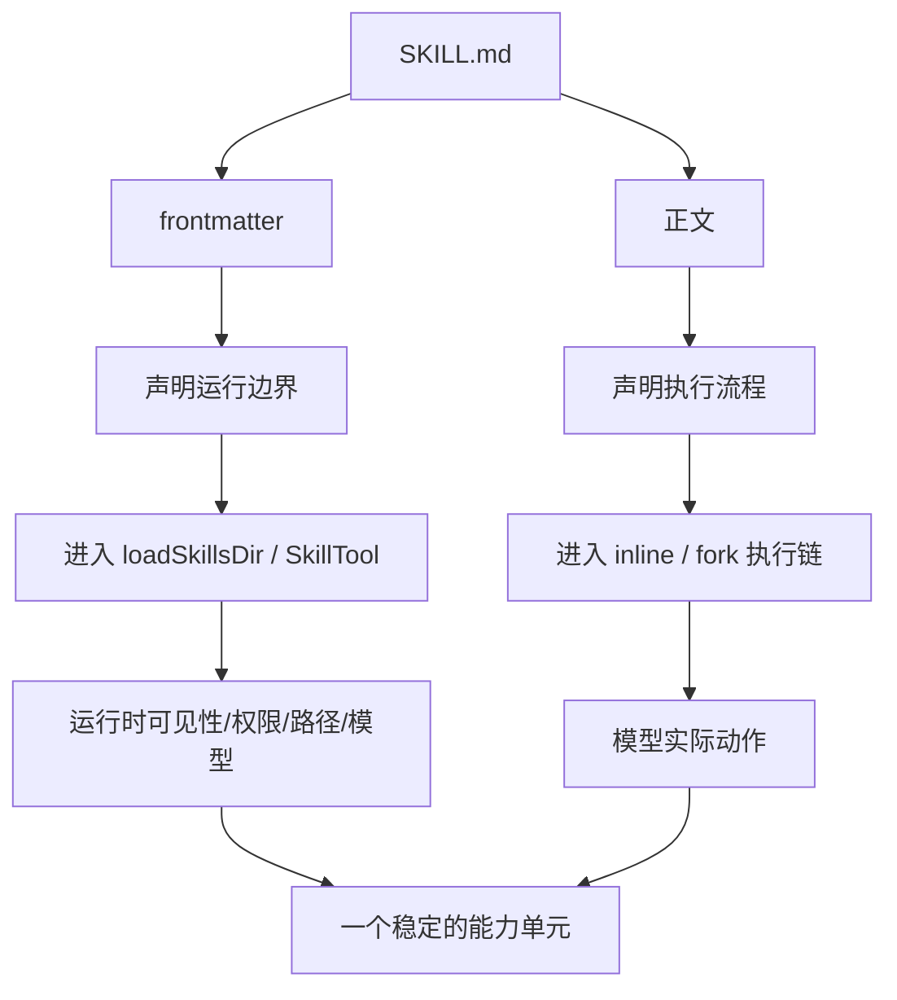

# Claude Code 源码共读笔记 30：什么样的 SKILL 才是真正能进 runtime 的好 skill

## 这篇看什么

前一篇我把 skill frontmatter 的地位讲清楚了：

> frontmatter 不是注释，而是 skill 的运行时接口。

那再往前走一步，一个很自然的问题就是：

> 既然 SKILL.md 不是普通 markdown，那到底什么样的 skill，才算“真的能进 runtime”的好 skill？

这次我不再追单个源码文件，而是把前面几篇已经建立起来的理解收拢成一套写法判断。

也就是说，这篇不是字段手册，也不是模板大全。

我真正想回答的是：

- 什么样的 skill 结构，在 Claude Code 的系统里是稳的
- 什么样的 skill 虽然能跑，但其实设计得很差
- `inline / fork / allowed-tools / hooks / paths / model / effort` 这些字段什么时候值得写
- skill 正文到底该写“内容”，还是写“执行约束”

我现在对这个问题的最短结论是：

> 一个真正好的 skill，不是“prompt 写得花”，而是它的运行边界清楚、执行路径克制、权限声明最小、正文能直接转成稳定动作。

也就是说，**好 skill 的标准首先是系统设计，其次才是文案写作。**

---

## 先给主结论

### 1. 好 skill 的第一标准不是“内容丰富”，而是“进入 runtime 之后不变形”

很多人写 skill，第一反应是：

- 多写点背景
- 多写点风格
- 多给点例子
- 多补几种情况

这当然不一定错。

但从 Claude Code 这套架构看，skill 真正的第一标准不是“信息密度大”，而是：

> 它一旦被 loader、SkillTool、inline/fork 执行层接进去之后，行为还能保持清楚、稳定、可预测。

换句话说，**能进 runtime**，不只是“格式合法”，而是：

- 不会误触发多余权限
- 不会平白切模型
- 不会把执行路径搞混
- 不会正文里一半是目标、一半是约束、一半是例子，最后模型抓不到重点

所以一个好 skill 的第一评价维度不是“读起来像不像一篇好文章”，而是：

> 跑起来是不是一个边界明确的能力单元。

### 2. skill 的 frontmatter 应该像接口声明，不应该像愿望清单

这是我现在最强烈的一个判断。

很多人写 frontmatter 时，会把它当成：

- 这个 skill 也许以后要用到的能力列表
- 一种“保险起见都先填上”的设置区

比如：

- 先加 `allowed-tools`
- 先加 `model`
- 先加 `effort`
- 先加 `hooks`
- 先加 `paths`

看起来“完整”，但其实很容易把一个 skill 写坏。

因为这些字段一旦写上去，就不是备注了，而是 runtime 行为声明。

所以 frontmatter 最好的风格不是“尽量全”，而是：

> **只声明真的要影响运行时行为的东西。**

### 3. skill 正文最重要的不是“解释一切”，而是给模型一个稳定动作框架

我现在越来越觉得，很多写坏的 skill，问题不在 frontmatter，而在正文。

常见坏味道是：

- 目标、背景、原则、例外、案例、安抚话术全搅一起
- 大量抽象空话
- 很多“你应该”“你最好”“通常建议”，但没有具体动作次序
- 正文像产品文档，不像可执行工作流

而 Claude Code 这套 skill 机制决定了：

> 正文最终是会被塞进模型执行上下文里的。

所以正文真正应该提供的是：

- 任务目标
- 判断边界
- 动作顺序
- 输出要求
- 失败/例外时的处理

也就是说，正文应该更像：

> **一个供模型执行的稳定工作流提示**

而不是“给人看的介绍页”。

---

## 先把总图立住：一个好 skill 到底由哪几层组成



这个图最想表达的是：

- frontmatter 负责**边界**
- 正文负责**动作**
- 两边都写好，skill 才会稳定

---

## 第一层：一个好 skill 的 frontmatter，首先应该是“最小而明确”的

### 1. `description` 和 `when_to_use` 要短，但要有区分度

这两个字段特别容易写虚。

坏写法通常像：

- 帮助用户完成各种复杂任务
- 用于高质量分析和执行
- 适用于需要细致处理的问题

这种写了等于没写。

好的写法应该让系统和模型立刻知道：

- 它处理哪类任务
- 它和相邻 skill 的区别是什么

比如要么写清场景，要么写清边界：

- 用于把一篇已有文章重写成微信公众号可发布版本
- 用于先审代码评审意见，再决定该不该改
- 用于把长文拆成小红书多图卡片文案

我现在的判断是：

> `description` / `when_to_use` 最怕泛，宁可窄一点，也别空一点。

### 2. `allowed-tools` 应该是最小权限，不是“反正都可能用到”

这个字段最容易被滥写。

源码已经说明得很清楚：

- 它会进入 permission context
- 它会影响 auto-allow / ask
- 它不是备注，而是真授权

所以坏写法通常是：

- `Read, Write, Edit, Bash`
- 或者直接把一堆工具全挂上

这会让 skill 看起来像“能干很多事”，但实际代价是：

- 权限边界变模糊
- auto-allow 更难成立
- 读 skill 的人也更难知道它到底想干嘛

好写法应该是：

> skill 真需要哪个工具，就写哪个；能更细粒度，就别粗放。

比如源码里也有提醒：

- 优先 `Bash(gh:*)` 这种模式
- 不要直接大而化之地给整个 `Bash`

### 3. `context` 不要为了“显得高级”就写 fork

我现在非常确定一点：

> **能 inline 的 skill，就尽量 inline。**

`context: fork` 的代价并不低。

它意味着：

- 走 subagent
- 建新的执行链
- 处理上下文隔离
- 有额外 prompt cache / transcript / cleanup 成本

所以 fork 适合的是哪类 skill？

- 自成一体的工作流
- 明显需要独立 token budget
- 不太需要中途跟当前主循环紧密交互
- 适合“交给 worker 去做再回结果”的任务

不适合的则是：

- 只是加一段操作方法
- 只是改当前模型的行为方式
- 需要跟当前上下文紧密来回咬合的任务

所以我会把这条写得很死：

> `context: fork` 不是增强版 skill，而是另一种执行架构。别滥用。

### 4. `model` 和 `effort` 不要默认就写

这两个字段看起来很诱人，因为它们很像“加点性能参数”。

但其实一旦写了，就会真的影响执行：

- inline 路径会改当前 mainLoopModel / effortValue
- fork 路径会改子 agent model / effort

所以只有在这些情况下才值得写：

- 确实需要不同模型能力
- 这个 skill 明显比当前主循环需要更高/更低 effort
- 不写会明显影响质量或成本

如果只是“也许更好”，那通常就不值得写。

### 5. `hooks` 是高影响字段，不该随手加

`hooks` 看起来很灵活，但我现在更倾向把它当“高影响能力”。

因为一旦注册，它会进入 session/agent 生命周期。

所以只有当这个 skill 本身就是一种：

- 需要持续约束后续行为
- 或者需要伴随执行过程触发 hook 逻辑

的能力时，才值得写。

普通 skill 不需要为了“以后可能有用”提前带 hooks。

### 6. `paths` 只该用在“真的有条件激活意义”的 skill 上

`paths` 的正确用途，不是“把适用文件类型写全”。

它真正的价值在于：

> 让 skill 只在相关工作区域出现。

所以只有当这个 skill 非常明显是：

- 与某类文件/目录强绑定
- 不希望全局常驻
- 只在碰到这些文件时才值得露出来

时，`paths` 才真正有价值。

否则你只是把本来就该全局可见的 skill，平白搞成了条件技能。

---

## 第二层：一个好 skill 的正文，不该像说明书，而该像工作流

这个判断我现在越来越明确。

### 坏正文长什么样

- 上来一大段抽象背景
- 充满“你应该谨慎”“请认真思考”“确保质量”
- 原则很多，动作很少
- 输出要求不清楚
- 一旦遇到边界情况，不知道模型到底该先判断还是先执行

### 好正文长什么样

我觉得至少应该有这几个东西：

1. **任务目标**
   - 这 skill 是来解决什么问题的

2. **触发条件 / 边界**
   - 什么情况用它
   - 什么情况不用它

3. **动作顺序**
   - 先做什么
   - 再做什么
   - 遇到问题怎么处理

4. **输出要求**
   - 最终产物长什么样
   - 要不要保留证据/引用/细节

5. **必要时的例外处理**
   - 缺信息怎么办
   - 权限不够怎么办
   - 外部依赖失败怎么办

也就是说，一个好 skill 的正文更像：

> **给模型的一段稳定 SOP**

而不是“产品介绍页”。

---

## 第三层：从这套 runtime 看，skill 最怕三种坏味道

### 坏味道 1：边界不清

比如：

- skill 既像执行器，又像审查器，又像风格指导
- 目标宽得没边
- 什么都能做一点，什么都不够稳

这种 skill 最大的问题不是“野心大”，而是：

> 系统根本不知道它应该在什么时候出现、以什么方式出现、最后算成功还是算偏题。

### 坏味道 2：权限过胖

比如：

- 默认就带大把 `allowed-tools`
- 明明只是读写文档，却把 Bash / MCP / 编辑全带上
- frontmatter 看起来像万能工具包

这类 skill 通常短期看“方便”，长期看会很难维护，也更难被系统信任。

### 坏味道 3：正文像论文，不像动作

比如：

- 解释很多
- 真正可执行步骤很少
- 语气很像在写原则宣言

这种 skill 常常读起来很高级，跑起来却很飘。

因为模型最后需要的是动作框架，不是气氛营造。

---

## 第四层：什么时候该 inline，什么时候该 fork

这一点我觉得值得单独写死。

### 优先 inline 的情况

- 只是给当前主循环增加一段方法
- 任务本身不重
- 需要紧贴当前上下文继续推进
- 不值得为它单独起一个子 agent
- 中途可能需要继续跟当前用户意图来回咬合

### 更适合 fork 的情况

- 明显是一个独立工作包
- 有自己完整的输入 → 处理 → 输出
- 预计会比较耗 token 或步骤较多
- 适合 worker 执行后再把结果交回
- 不需要一直和当前主线程混在一起

我现在的实际判断规则会非常简单：

> **如果你没强理由要 fork，那就默认 inline。**

因为 inline 是更便宜、更直、更少系统负担的路径。

---

## 第五层：从源码看，一个“好写法”的 skill 模板骨架大概长这样

我不想把这篇写成模板大全，但还是可以给一个我现在认可的骨架。

### A. 轻量 inline skill

```md
---
description: 用于把已有内容整理成可直接发送的简明结论
when_to_use: 当已经有原始材料，但需要压缩成短结论时使用
allowed-tools: Read
---

目标：
把当前已给出的内容整理成简明、可执行、可转发的结论。

执行步骤：
1. 先提炼核心结论
2. 再补充必要背景，但不要展开成长文
3. 保留关键限制条件和不确定点
4. 输出时优先短句和列表

输出要求：
- 先给结论
- 再给 2-4 个关键支撑点
- 不要写空洞总结
```

这个骨架的特点是：

- frontmatter 很轻
- 权限克制
- 正文是动作，不是散文

### B. 独立 fork skill

```md
---
description: 用于独立完成一轮代码库扫描并输出发现报告
when_to_use: 当任务本身是完整子问题，适合交给子 agent 独立处理时使用
context: fork
agent: general-purpose
allowed-tools:
  - Read
  - Glob
  - Grep
  - Bash(git:*)
effort: medium
---

目标：
独立扫描目标代码库，输出一份基于证据的发现报告。

执行步骤：
1. 先识别相关目录和关键入口文件
2. 再阅读实现和相邻模块，确认真实行为
3. 记录关键证据，不要只写猜测
4. 汇总成结构化报告返回

输出要求：
- 先给主要结论
- 再给证据点
- 明确区分已确认事实和推断
```

这个骨架的特点是：

- fork 的理由明确
- 工具权限是最小可用集
- 输出要求可验收

---

## 第六层：如果只给几条“写好 skill”的硬规则，我会给这 8 条

### 1. 能 inline 就别 fork

### 2. `allowed-tools` 只给最小权限

### 3. frontmatter 只写真正影响运行时行为的字段

### 4. `description` / `when_to_use` 宁可窄一点，也别写空话

### 5. 正文优先写动作顺序，不要堆抽象原则

### 6. 输出要求必须具体，不要只写“高质量结果”

### 7. `paths` 只给真的需要条件激活的 skill

### 8. `hooks` / `model` / `effort` 都属于高影响字段，默认克制

这 8 条如果守住，skill 基本就不会太差。

---

## 第七层：这篇和前几篇的关系

这一篇其实是 skill 线的“写法实践版总结”。

前几篇讲的是：

- skill 是什么
- 怎么进 runtime
- inline / fork 怎么跑
- frontmatter 为什么不是注释

而这一篇开始真正落到：

- 既然它会这样跑，那你该怎么写它

也就是说，技能线到这里已经从：

- **源码理解**

走到了：

- **写法方法论**

这一步我觉得非常关键。

因为如果只停在源码理解，最后容易变成“我知道它怎么工作”；
但只有落到写法方法论，才会变成“我知道怎么写出系统真正喜欢的 skill”。

---

## 我现在对“好 skill”的一句话定义

如果只留一句最短的话，我会留这个：

> 一个真正好的 skill，不是写得最花的 prompt，而是一个边界清楚、权限克制、执行路径明确、正文可直接转成稳定动作的 runtime 能力单元。

这里最想保住的四个词是：

- **边界清楚**
- **权限克制**
- **路径明确**
- **稳定动作**

因为这四个词，基本就是 Claude Code 这套 skill 系统真正偏爱的东西。

---

## 这篇最值得记住的几个判断

### 判断 1：好 skill 的第一标准不是“内容丰富”，而是“进入 runtime 后不变形”

### 判断 2：frontmatter 应该像接口声明，不应该像愿望清单

### 判断 3：正文应该像工作流，不应该像说明书或散文

### 判断 4：inline 是默认路径，fork 需要强理由

### 判断 5：`allowed-tools` / `hooks` / `model` / `effort` 都是高影响字段，默认克制

### 判断 6：skill 的本质不是 prompt 文案，而是能力单元设计

---

## 下一步最顺怎么接

如果还继续，我觉得后面最顺有两条：

### 方向 A：挑一个 Claude Code 自带 skill 实例，按这套方法拆
也就是从抽象方法论回到真实样本。

### 方向 B：开始总结“agent 和 skill 的分工边界”
也就是再往上一层，讲：
- 什么该做成 skill
- 什么该做成 agent
- 什么该只是 prompt / command

这两个方向都自然。
我个人会更倾向先走 **A**，拿一个真实 skill 样本验证这套判断。