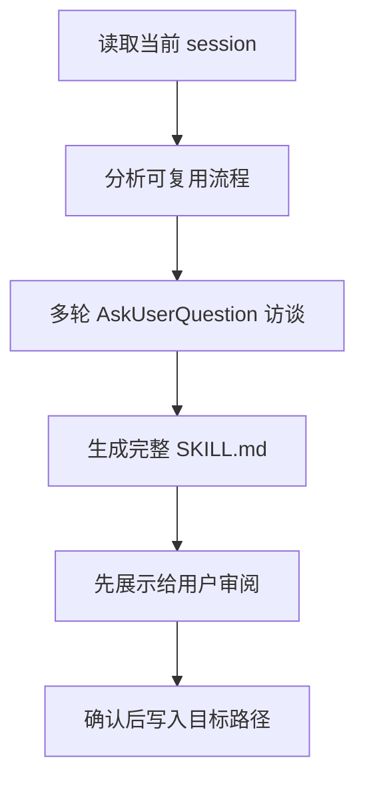

# Claude Code 源码共读笔记 31：skillify 是 Claude Code 对好 skill 写法的官方样板

## 这篇看什么

前一篇我刚把“什么样的 SKILL 才是真正能进 runtime 的好 skill”收成了一套写法方法论。

按那个顺序，下一步最自然的就不是继续讲抽象原则，而是拿一个真实样本来验证。

这次挑的就是 Claude Code 自带的：

- `src/skills/bundled/skillify.ts`

我挑它的原因很简单：

> 如果说前一篇是在总结“好 skill 应该怎么写”，那 `skillify` 就几乎是 Claude Code 官方自己给出的写法样板。

因为它不是普通 skill。

它做的事情本身就是：

- 回看当前 session
- 把可复用的流程提炼出来
- 采访用户补齐约束
- 最后生成一个 SKILL.md

也就是说，`skillify` 不是“用 skill 完成某项业务”的技能，
而是：

> **用来生产 skill 的 skill。**

这就让它非常适合被拿来当样本。

因为它一定会暴露 Claude Code 团队对这些问题的真实偏好：

- 他们认为什么叫“可复用流程”
- 他们希望 skill 在写法上保留什么结构
- 他们觉得 frontmatter 哪些字段值得显式出现
- 他们认为什么样的步骤说明，才足够让模型稳定执行

所以这篇我真正想回答的是：

> Claude Code 官方自己是怎么教模型写一个“能进 runtime”的 skill 的？

---

## 先给主结论

### 1. `skillify` 最值钱的地方，不是会生成 skill，而是它定义了“生成 skill 时必须补齐哪些信息”

如果只看表面，`skillify` 很像一个自动化写模板工具。

但真的往下读，会发现它最核心的价值根本不是“代写一个 SKILL.md”。

它真正值钱的是：

> 它把“一个可复用 skill 应该包含哪些信息”这件事，拆成了一套很明确的采集框架。

它要求模型先做 session 分析，再做多轮 AskUserQuestion 访谈，最后才输出文件。

这说明 Claude Code 团队对 skill 生成的态度非常清楚：

- skill 不是 prompt 灵感现场发挥
- skill 不是把这轮做过的事原样拷贝一遍
- skill 是要把“目标、输入、步骤、成功标准、用户修正、工具边界、agent 选择”这些东西沉淀出来

也就是说，`skillify` 其实先定义了一套：

> **什么样的流程，才有资格被沉淀成 skill。**

### 2. `skillify` 说明 Claude Code 团队最看重的，不是 prompt 文笔，而是流程可复用性

这个 skill 的 prompt 很长，但我觉得最值得注意的不是它写得很细，
而是它一直在逼模型回答“这个流程怎样才能复用”。

比如它会特别追问：

- inputs / parameters 是什么
- distinct steps 是什么
- success artifacts / criteria 是什么
- 哪里用户纠正了你
- 用了哪些 tools / permissions
- 用了哪些 agents
- 哪些步骤可以并行
- 哪些步骤需要 human checkpoint

这些问题全都指向同一个核心：

> skill 必须是一个可反复执行、边界清楚、结果可判断的流程单元。

这和我前一篇总结出来的判断是完全一致的。

### 3. `skillify` 其实在给“好 skill”下一个比源码更具体的定义

我觉得这一篇和前一篇接起来之后，可以把好 skill 的定义再具体一点：

> 一个好的 skill，不只是 frontmatter 和正文写得清楚，而是它能把一次真实 session 里的隐性经验，提炼成“输入—步骤—成功标准—约束—输出”这五层稳定结构。

这就是 `skillify` 真正厉害的地方。

它不是在教模型“怎么写 markdown”，而是在教模型：

- 如何把一次成功协作，压缩成一个未来还能再跑的执行单元

---

## 先把总图立住：`skillify` 的工作流其实是 4 段

这个图其实已经说明了它为什么值得当样本。

因为它不是“直接生成”，而是：

- 先抽象
- 再补齐
- 再成文
- 最后确认落盘

这就是一个成熟 skill 设计流程该有的样子。

---

## 第一层：`skillify` 一上来就强调“从 session 里提炼 repeatable process”

它的开头写得很直接：

- `You are capturing this session's repeatable process as a reusable skill.`

我觉得这句特别重要。

因为它没有说：

- 总结这次对话
- 帮用户存档
- 把这轮内容写成文档

它说的是：

> **捕捉这次会话里可重复的流程。**

这就把 `skillify` 的目标框死了：

- 不是留痕
- 不是回顾
- 而是抽取“可重复执行的部分”

这个起手势本身就很 Claude Code。

因为 Claude Code 的整个 skill 系统，本来就不是知识库，而是可复用 workflow 库。

---

## 第二层：它要求模型先看 session memory，再看 user messages，这个顺序很有意思

`skillify` 会给模型两块上下文：

### 1. `session_memory`
也就是这次会话的总结性记忆。

### 2. `user_messages`
而且特别强调：

- 要注意用户是怎么 steering 过程的
- 要注意用户在哪些地方纠正了你

这个顺序非常妙。

### 为什么先给 session memory

因为 Claude Code 显然认为：

- skill 提炼首先要看这次会话到底做了什么
- 不能只盯局部消息，要先有整体轮廓

### 为什么再给 user messages

因为一个 skill 不是只复刻“做了什么”，还得保留：

> 用户是怎么把这件事纠偏成他们真正想要的样子。

这点特别值。

也就是说，官方并不认为“成功流程 = agent 自己最后跑出来的结果”。

他们承认：

- 用户修正
- 用户偏好
- 用户反复强调的要求

也是 skill 设计的一部分。

这和贵平你这边一直强调的那种：

- 不够细就是失败
- 要把重复反馈沉成约束

其实是很同路的。

---

## 第三层：它的 Step 1 非常像一份“可复用流程审计清单”

`skillify` 在 Step 1 里要求模型先分析这些东西：

- repeatable process 是什么
- inputs / parameters 是什么
- distinct steps 是什么
- success artifacts / criteria 是什么
- 用户在哪里纠正了你
- 需要哪些 tools / permissions
- 用了哪些 agents
- goals 和 success artifacts 是什么

这一段我觉得特别像：

> **把一轮 session 变成可复用 skill 之前的审计清单。**

### 这里最值得记的，不是“列得很全”

而是它抓的都是会影响 runtime 的东西：

- 输入
- 步骤
- 成功标准
- 权限
- agents
- 用户修正

也就是说，官方心里非常清楚：

> skill 不是“方法建议”，skill 是运行单元。

所以它在抽象技能时，不是问“风格是什么”，而是问“执行怎么闭环”。

---

## 第四层：它不是直接写文件，而是强制先做多轮访谈，这说明官方不信“自动猜完整”

我觉得这是整个 `skillify` 最有味道的地方之一。

它没有要求模型：

- 自己总结一下然后直接写

相反，它明确要求进入：

- `Step 2: Interview the User`

而且还特别强调：

- 所有问题都必须通过 `AskUserQuestion`
- 不要用 plain text 问问题
- 每轮都可以迭代，直到用户满意
- 不要自己造“我再补充一下”的虚选项，而是给 substantive choices

这说明 Claude Code 团队对 skill 生成有一个非常现实的认识：

> 一轮成功 session 里，有很多隐含约束是模型自己推不完整的，必须通过用户确认补齐。

这点特别成熟。

因为很多系统都会默认：

- 既然 agent 已经做成了一次，那它就能自动总结出未来模板

但 `skillify` 明确不这么乐观。

它要求做真正的采访和确认。

这其实很像产品设计，而不是 prompt engineering。

---

## 第五层：四轮访谈设计，几乎就是“好 skill 必须补齐的四种信息”

我觉得这个结构值得单独拆。

### Round 1：高层确认

它先确认：

- 名字
- 描述
- 高层目标
- 成功标准

这说明一个 skill 最先需要稳定的，不是步骤，而是：

> **这个 skill 到底要解决什么问题。**

### Round 2：更多细节

它开始补：

- 高层步骤
- 参数
- 是 inline 还是 fork
- skill 存在哪儿（repo / personal）

这里就已经进入 runtime 设计了。

尤其是：

- `inline / fork`
- repo-specific vs personal

这两个问题都不是文案问题，而是实际系统设计问题。

### Round 3：逐步拆解

这一轮最值。

它对每个 major step 去问：

- 会产出什么 artifact
- 什么证明它成功了
- 是否要 human checkpoint
- 能不能并行
- 该怎么执行（Direct / Task agent / team）
- hard constraints / hard preferences 是什么

这简直就是在强行把“模糊经验”压成：

- artifacts
- success criteria
- checkpoints
- execution mode
- rules

也就是说，它在做的其实是：

> 把 skill 正文真正变成可执行 workflow。

### Round 4：触发条件收尾

最后再确认：

- 什么时候应该 invoke
- trigger phrases 是什么
- 还有没有 gotchas

这说明官方对 `when_to_use` 的重视是真高。

它不是一个顺手补的字段，而是整个 skill 可发现性的关键。

---

## 第六层：`skillify` 给出的 SKILL.md 模板，直接暴露了官方认定的“好 skill 骨架”

这部分特别值，因为它几乎就是半官方模板。

它要求的格式大概是：

- frontmatter
- 标题
- Description
- Inputs
- Goal
- Steps
  - 每步都有 Success criteria
  - 可选 Execution / Artifacts / Human checkpoint / Rules

### 我觉得最关键的是三点

#### 1. 每一步都必须有 **Success criteria**

这个要求我特别认同。

因为 skill 最大的问题之一，就是模型不知道：

- 什么时候该继续
- 什么时候该停
- 什么时候算完成

强制写 success criteria，本质上是在补 skill 的状态机边界。

#### 2. step annotations 非常 runtime-oriented

- `Execution`
- `Artifacts`
- `Human checkpoint`
- `Rules`

这些都不是写给人类欣赏的排版元素，
而是在帮模型理解：

- 这一步怎么执行
- 执行完会留下什么
- 什么地方必须停下来问人
- 哪些硬规则绝不能破

这就是标准的 workflow 设计思路。

#### 3. `when_to_use` 被点名说“CRITICAL”

而且明确要求：

- 以 `Use when...` 开头
- 带 trigger phrases
- 带 example user messages

这再次说明 Claude Code 团队不是把 skill 当文档收藏。

他们非常在乎：

> 模型以后到底能不能在合适的时候想起并调用这个 skill。

---

## 第七层：`skillify` 对 frontmatter 的态度，和我们前两篇总结高度一致

它明确写了这些规则：

- `allowed-tools`: minimum permissions needed
- `context`: 只有 self-contained skill 才用 fork
- `when_to_use` 非常关键
- `arguments` / `argument-hint`: 只有真有参数时才写

这几乎和我前两篇总结出来的判断一模一样：

### 对 `allowed-tools`
不是“列出所有可能用到的”，而是：
- 最小权限
- 尽量 pattern 化

### 对 `context: fork`
不是“更高级”，而是：
- 只适合自成一体、不中途强依赖用户互动的任务

### 对 `when_to_use`
不是“说明字段”，而是：
- skill 能不能被自动正确发现的核心

### 对 `arguments`
不是为了显得完整，而是：
- 只有真正存在参数接口时才写

所以 `skillify` 很像是在说：

> 官方自己也不鼓励把 skill 写成“大而全的愿望清单”。

他们鼓励的是：

- 小而稳
- 明确
- 可执行
- 可判断完成

---

## 第八层：`skillify` 自己的 frontmatter，也很能说明它的定位

它注册时的配置是：

- `name: 'skillify'`
- `allowedTools: Read, Write, Edit, Glob, Grep, AskUserQuestion, Bash(mkdir:*)`
- `userInvocable: true`
- `disableModelInvocation: true`
- `argumentHint: [description ...]`

这里面我觉得最值得注意的是两点：

### 1. `disableModelInvocation: true`

这很有意思。

说明官方不希望模型在普通流程里自己突然决定“来生成一个 skill 吧”。

而是：

> `skillify` 应该是用户显式触发的沉淀动作。

这非常合理。

因为 skill 化本身是一种“把一次协作固化成未来资产”的动作，
天然就应该更受用户控制。

### 2. 它的工具权限虽然不算少，但仍然是围绕“写 skill 文件”最小闭环来配的

- 需要看 session / 内容 → `Read` / `Grep` / `Glob`
- 需要写 skill → `Write` / `Edit`
- 需要访谈用户 → `AskUserQuestion`
- 需要创建目录 → `Bash(mkdir:*)`

也就是说，它的权限不是“为了方便给全”，而是跟任务闭环严格对齐。

这再次验证了我们前面那条：

> 好 skill 的权限边界应该跟任务结构对齐，而不是跟想象中的未来扩展对齐。

---

## 第九层：`skillify` 最大的启发，不是它会生成 skill，而是它把 skill 设计变成了一个产品化流程

我觉得这是这篇最后想收住的点。

如果只把 `skillify` 当一个 bundled skill，它当然已经很有意思。

但我觉得它真正厉害的是：

> 它把“写一个好 skill”这件事，从 prompt 手艺，提升成了一套产品化流程。

这个流程至少包括：

1. 从 session 里识别 repeatable process
2. 采集用户修正和偏好
3. 补齐输入 / 步骤 / 产物 / 成功标准 / checkpoints
4. 强制审阅后再落盘

这说明 Claude Code 团队对 skill 的理解，不是：

- 写几段提示词就行

而是：

- 这是在设计一个未来会反复被 runtime 调用的能力单元

所以必须严肃对待。

---

## 我现在对 `skillify` 的一句话定义

如果只留一句最短的话，我会留这个：

> `skillify` 不是“帮你写 skill 的工具”，而是 Claude Code 官方对“什么样的流程值得沉淀成 skill、以及什么样的 SKILL.md 才真正可复用”的一套内建方法论。

这句话里最想保住两个词：

- **值得沉淀**
- **内建方法论**

因为这正是它和普通模板生成器最大的区别。

---

## 这篇最值得记住的几个判断

### 判断 1：`skillify` 的核心价值不是生成文件，而是先定义“生成 skill 之前必须补齐什么”

### 判断 2：官方最看重的是流程可复用性，而不是 prompt 文笔

### 判断 3：四轮访谈结构，本质上是在收集好 skill 必需的五层信息：目标、输入、步骤、成功标准、约束

### 判断 4：官方模板里把 `Success criteria` 设为每步必填，这非常说明他们对 skill 完成判据的重视

### 判断 5：`allowed-tools`、`context`、`when_to_use`、`arguments` 的规则，和我们前面总结出的“好 skill 写法”高度一致

### 判断 6：`disableModelInvocation: true` 说明 skill 化是用户主导的沉淀动作，不该被模型随手触发

---

## 下一步最顺怎么接

如果继续拆 bundled skills，我觉得有两条都很顺：

### 方向 A：`verify`
看 Claude Code 官方怎么定义“验证”这件事，特别适合接工程质量观。

### 方向 B：`stuck`
看 Claude Code 官方怎么处理 agent 卡住和失效恢复。

如果只选一个，我下一篇会更倾向：

> **`verify`**

因为它和前面的 skill/runtime 方法论连得更紧，也更能看出 Claude Code 的工程价值观。