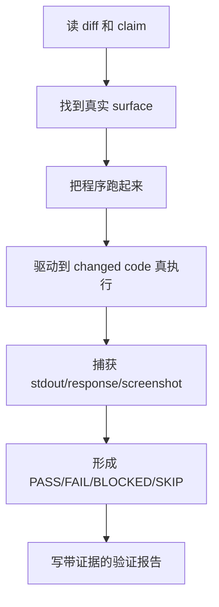

# Claude Code 源码共读笔记 32：verify 是 Claude Code 对“验证即运行时观察”的官方定义

## 这篇看什么

上一篇我拆的是 `skillify`，它更像 Claude Code 官方对“怎么写一个好 skill”的样板。

这次继续拆另一类更有工程味的内置 skill：

- `verify`

而且这次我按你的要求，**把完整 `SKILL.md` 原文直接收进来**，不只讲注册壳。

先说结论：

> `verify` 不是一个“帮你多做点测试”的 skill，而是 Claude Code 官方对“验证”这件事的定义声明：验证不是跑 CI，不是读代码，不是补一个小脚本，而是把真实程序跑起来，在真实表面上观察变化是否发生。

这句话非常重。

因为它其实是在重新划定“验证”这件事的边界。

很多工程团队说验证，实际上混着三种东西：

- 看代码像不像对
- 跑测试绿不绿
- 真把程序跑起来看行为是不是对

而 `verify` 这份 skill 非常明确地说：

> **前两者都不算验证本身。验证是 runtime observation。**

这也是为什么我觉得它很值得拆。

因为它不是一个普通工作流 skill，而是一份工程价值观文件。

---

## 先给主结论

### 1. `verify` 在定义一条非常强硬的原则：验证 = 运行 + 观察 + 留证据

这份 skill 的第一句核心判断就是：

> **Verification is runtime observation.**

这几乎已经把全文立住了。

它后面所有规则其实都围着这句话展开：

- 要把 app/build 真跑起来
- 要驱动到 changed code 真执行的位置
- 要捕获 stdout/response body/screenshot/pane dump 这类证据
- 没有证据就不算验证

也就是说，它不是在教“怎么多做点检查”，而是在说：

> **验证的唯一可信对象，是程序运行时暴露出来的行为。**

### 2. 它有意把“跑测试”“读 diff”“临时 import 调函数”都排除在验证之外

这份 skill 最有冲击力的地方，不是它强调 runtime，而是它敢把很多团队默认会算进“验证”的动作，明确排除掉。

比如：

- 不要 run tests
- 不要 typecheck
- 不要 import-and-call
- 不要把内部函数调用结果当验证

它甚至直接说：

- 这些是 CI
- 这些是 code review
- 这些是 unit test you wrote
- 不是验证

这个边界画得非常狠，但也非常清楚。

### 3. `verify` 真正在定义的不是一个 skill，而是一种“工程闭环标准”

如果只把它看成一个 skill，会低估它。

我更愿意把它定义成：

> Claude Code 团队对“我说这个改动真的工作了”这句话，要求你拿出什么证据的官方标准。

所以它其实在回答的是：

- 什么时候能说 PASS
- 什么只能算 BLOCKED / SKIP
- 什么属于环境问题，不属于变更本身
- 什么样的证据才足够让别人信

这就是工程标准，不只是 prompt 文本。

---

## 先把完整 `verify` skill 原文放进来

下面这段，是我从打包产物里反向解出来的 **完整 `verify/SKILL.md` 原文**。

```md
---
name: verify
description: Verify that a code change actually does what it's supposed to by running the app and observing behavior. Use when asked to verify a PR, confirm a fix works, test a change manually, check that a feature works, or validate local changes before pushing.
---

**Verification is runtime observation.** You build the app, run it,
drive it to where the changed code executes, and capture what you
see. That capture is your evidence. Nothing else is.

**Don't run tests. Don't typecheck.** CI ran both before you got here
— green checks on the PR mean they passed. Running them again proves
you can run CI. Not as a warm-up, not "just to be sure," not as a
regression sweep after. The time goes to running the app instead.

**Don't import-and-call.** `import { foo } from './src/...'` then
`console.log(foo(x))` is a unit test you wrote. The function did what
the function does — you knew that from reading it. The app never ran.
Whatever calls `foo` in the real codebase ends at a CLI, a socket, or
a window. Go there.

## Find the change

Establish the full range first — a branch may be many commits:

```bash
git log --oneline @{u}..              # count commits
git diff @{u}.. --stat                # full range, not HEAD~1
gh pr diff                            # if in a PR context
```

State the commit count in your report. Large diff truncating? Redirect:
`git diff @{u}.. > /tmp/d` then Read it. No diff at all → say so, stop.

**The diff is ground truth. The PR description is a claim about it.**
Read both. If they disagree, that's a finding.

## Surface

The surface is where a user — human or programmatic — meets the
change. That's where you observe.

| Change reaches | Surface | You |
|---|---|---|
| CLI / TUI | terminal | type the command, capture the pane — [example](examples/cli.md) |
| Server / API | socket | send the request, capture the response — [example](examples/server.md) |
| GUI | pixels | drive it under xvfb/Playwright, screenshot |
| Library | package boundary | sample code through the public export — `import pkg`, not `import ./src/...` |
| Prompt / agent config | the agent | run the agent, capture its behavior |
| CI workflow | Actions | dispatch it, read the run |

**Internal function? Not a surface.** Something in the repo calls it
and that caller ends at one of the rows above. Follow it there. A
bash security gate's surface isn't the function's return value — it's
the CLI prompting or auto-allowing when you type the command.

**No runtime surface at all** — docs-only, type declarations with no
emit, build config that produces no behavioral diff — report
**SKIP — no runtime surface: (reason).** Don't run tests to fill
the space.

**Tests in the diff are the author's evidence, not a surface.** CI
runs them. You'd be re-running CI. Tests-only PR → SKIP, one line.
Mixed src+tests → verify the src, ignore the test files. Reading a
test to learn what to check is fine — it's a spec. But then go run
the app. Checking that assertions match source is code review.

## Get a handle

Check for existing knowledge before cold-starting:

- **`.claude/skills/*verifier*/`** — if one matches your surface (CLI
  verifier for a CLI change, etc.), route to it. It knows readiness
  signals and env gotchas you don't. Mismatched surface → skip that
  one, try the next. Stale verifier (fails on mechanics unrelated to
  the change) → ask the user whether to patch it; don't FAIL the
  change for verifier rot.
- **`.claude/skills/run-*/`** — knows how to build and launch. Use its
  primitives as your handle.
- **Neither** — cold start from README/package.json/Makefile. Timebox
  ~15min. Stuck → BLOCKED with exactly where, plus a filled-in
  `/run-skill-generator` prompt. Got through → mention
  `/init-verifiers` in your report so next time is faster.

## Drive it

Smallest path that makes the changed code execute:

- Changed a flag? Run with it.
- Changed a handler? Hit that route.
- Changed error handling? Trigger the error.
- Changed an internal function? Find the CLI command / request / render
  that reaches it. Run that.

**Read your plan back before running.** If every step is build /
typecheck / run test file — you've planned a CI rerun, not a
verification. Find a step that reaches the surface or report BLOCKED.

Once the claim checks out, keep going: break it (empty input, huge
input, interrupt mid-op), combine it (new thing + old thing), wander
(what's adjacent? what looked off?). The PR description is what the
author intended. Your job includes what they didn't.

**The verdict is table stakes. Your observations are the signal.**
A PASS with three sharp "hey, I noticed…" lines is worth more than a
bare PASS. You're the only reviewer who actually *ran* the thing —
anything that made you pause, work around, or go "huh" is information
the author doesn't have. Don't filter for "is this a bug." Filter for
"would I mention this if they were sitting next to me."

**End-to-end, through the real interface.** Pieces passing in
isolation doesn't mean the flow works — seams are where bugs hide.
If users click buttons, test by clicking buttons, not by curling the
API underneath.

## Capture

Stdout, response bodies, screenshots, pane dumps. Captured output is
evidence; your memory isn't. Something unexpected? Don't route around
it — capture, note, decide if it's the change or the environment.
Unrelated breakage is a finding, not noise.

Shared process state (tmux, ports, lockfiles) — isolate. `tmux -L
name`, bind `:0`, `mktemp -d`. You share a namespace with your host.

## Report

Inline, final message:

```
## Verification: <one-line what changed>

**Verdict:** PASS | FAIL | BLOCKED | SKIP

**Claim:** <what it's supposed to do — your read of the diff and/or
the stated claim; note any mismatch>

**Method:** <how you got a handle — which verifier/run-skill, or
cold start; what you launched>

### Steps

Each step is one thing you did to the **running app** and what it
showed. Build/install/checkout are setup, not steps. Test runs and
typecheck don't belong here — they're CI's output.

1. ✅/❌/⚠️ <what you did to the running app> → <what you observed>
   <evidence: the app's own output — pane capture, response body,
   screenshot path>

**Screenshot / sample:** <the one frame a reviewer looks at to see
the feature — image path for GUI/TUI, code block for library/API;
omit for build/types-only>

### Findings
<Things you noticed. Not just bugs — friction, surprises, anything
a first-time user would trip on. "Took three tries to find the right
flag." "Error message on typo was unhelpful." "Default seems odd for
the common case." "Works, but slower than I expected." Lower the bar:
if it made you pause, it goes here. Claim/diff mismatch, pre-existing
breakage, and env notes also belong.

Lead with ⚠️ for lines worth interrupting the reviewer for — those get
hoisted above the PR comment fold. Plain bullets are context they'll
find if they expand. Empty is fine if nothing stuck out — but nothing
sticking out is itself rare.>
```

**Verdicts:**
- **PASS** — you ran the app, the change did what it should at its
  surface. Not: tests pass, builds clean, code looks right.
- **FAIL** — you ran it and it doesn't. Or it breaks something else.
  Or claim and diff disagree materially.
- **BLOCKED** — couldn't reach a state where the change is observable.
  Build broke, env missing a dep, handle wouldn't come up. Not a
  verdict on the change. Say exactly where it stopped +
  `/run-skill-generator` prompt.
- **SKIP** — no runtime surface exists. Docs-only, types-only,
  tests-only. Nothing went wrong; there's just nothing here to run.
  One line why.

No partial pass. "3 of 4 passed" is FAIL until 4 passes or is
explained away.

**When in doubt, FAIL.** False PASS ships broken code; false FAIL
costs one more human look. Ambiguous output is FAIL with the raw
capture attached — don't interpret.
```

---

## `verify` 自带的两个 example 也很值

这两个 example 不是配角，我觉得它们其实是在告诉模型：

- CLI 变化该怎么验证
- Server/API 变化该怎么验证

### examples/cli.md

```md
# Verifying a CLI change

The handle is direct invocation. The evidence is stdout/stderr/exit code.

## Pattern

1. Build (if the CLI needs building)
2. Run with arguments that exercise the changed code
3. Capture output and exit code
4. Compare to expected

CLIs are usually the simplest to verify — no lifecycle, no ports.

## Worked example

**Diff:** adds a `--json` flag to the `status` subcommand. New flag
parsing in `cmd/status.go`, new output branch.

**Claim (commit msg):** "machine-readable status output."

**Inference:** `tool status --json` now exists, emits valid JSON with
the same fields the human output shows. `tool status` without the flag
is unchanged.

**Plan:**
1. Build
2. `tool status` → human output, same as before (non-regression)
3. `tool status --json` → valid JSON, parseable
4. JSON fields match human output fields

**Execute:**
```bash
go build -o /tmp/tool ./cmd/tool

/tmp/tool status
# → Status: healthy
# → Uptime: 3h12m
# → Connections: 47

/tmp/tool status --json
# → {"status":"healthy","uptime_seconds":11520,"connections":47}

/tmp/tool status --json | jq -e .status
# → "healthy"
# (jq -e exits nonzero if the path is null/false — cheap validity check)

echo $?
# → 0
```

**Verdict:** PASS — flag works, JSON is valid, fields line up.

## What FAIL looks like

- `unknown flag: --json` → not wired up, or you're running a stale build
- Output isn't valid JSON (`jq` errors) → serialization bug
- `tool status` (no flag) changed → regression; the diff touched more
  than it should
- JSON has different field names than expected → claim/code mismatch,
  might be fine, note it

## Reading from stdin, destructive commands

If the CLI reads stdin → pipe in test data.
If it writes files / hits a network / deletes things → point it at a
tmp dir / a mock / a dry-run flag. If there's no safe mode and the
diff touches the destructive path, say so and verify what you can
around it.
```

### examples/server.md

```md
# Verifying a server/API change

The handle is `curl` (or equivalent). The evidence is the response.

## Pattern

1. Start the server (background, with a readiness poll — see below)
2. `curl` the route the diff touches, with inputs that hit the changed branch
3. Capture the full response (status + headers + body)
4. Compare to expected

## Lifecycle

If there's a run-skill it handles this. If not:

```bash
<start-command> &> /tmp/server.log &
SERVER_PID=$!
for i in {1..30}; do curl -sf localhost:PORT/health >/dev/null && break; sleep 1; done
# ... your curls ...
kill $SERVER_PID
```

No readiness endpoint? Poll the route you're about to test until it
stops returning connection-refused, then add a beat.

## Worked example

**Diff:** adds a `Retry-After` header to 429 responses in `rateLimit.ts`.
**Claim (PR body):** "clients can now back off correctly."

**Inference:** hitting the rate limit should now return `Retry-After: <n>`
in the response headers. It didn't before.

**Plan:**
1. Start server
2. Hit the rate-limited endpoint enough times to trigger 429
3. Check the 429 response has `Retry-After` header
4. Check the value is a positive integer

**Execute:**
```bash
# trigger the limit — 10 fast requests, limit is 5/sec per the diff
for i in {1..10}; do curl -s -o /dev/null -w "%{http_code}\n" localhost:3000/api/thing; done
# → 200 200 200 200 200 429 429 429 429 429

# capture the 429 headers
curl -si localhost:3000/api/thing | head -20
# → HTTP/1.1 429 Too Many Requests
# → Retry-After: 12
# → ...
```

**Verdict:** PASS — `Retry-After: 12` present, positive integer.

## What FAIL looks like

- Header absent → the diff didn't take effect, or you're not actually
  hitting the 429 path (check the status code first)
- Header present but value is `NaN` / `undefined` / negative → the
  logic is wrong
- You got 200s all the way through → you never triggered the changed
  path. Tighten the request burst or check the rate limit config.
```

---

## 先把总图立住：`verify` 真正要求的不是“检查”，而是“到表面去观察”



这张图就是 `verify` 的灵魂。

它不接受“我看起来觉得对”。
它要的是：

- 跑起来
- 打到表面
- 带证据

---

## 第一层：它最狠的地方，是把“验证”和“CI / code review / unit test”彻底切开

这份 skill 读起来最大的冲击，其实不是它说了什么，而是它明确说了很多 **不算** 什么。

### 不算验证的东西

- 重新 run tests
- 重新 typecheck
- `import { foo } from './src/...'` 再手调
- 只读代码判断“应该没问题”

它甚至直接给这些动作重新分类：

- 这是 CI
- 这是 code review
- 这是你临时写的 unit test

### 为什么这个切分重要

因为太多工程团队会把这些动作混成一句：

- “我验证过了”

但 `verify` 这份 skill 明确说：

> 这些动作当然有价值，但它们不是“变更在真实表面上工作了”的证据。

这条边界划清之后，很多模糊状态会瞬间消失。

比如：

- 测试绿了，但用户入口没跑过 → 不能说 PASS
- 代码看起来对，但没打到 surface → 不能说 PASS
- 单独函数行为对，但端到端没走通 → 不能说 PASS

这其实是对“闭环”两个字最硬核的解释。

---

## 第二层：`surface` 是这份 skill 的关键词，也是最值钱的抽象

我觉得 `verify` 全文里最有价值的概念，不是 runtime，而是：

> **surface**

它把变更最终会抵达的地方抽成几类：

- terminal
- socket
- pixels
- package boundary
- the agent
- Actions

这个抽象非常强。

因为它等于在问：

- 用户真正接触这个变化的地方在哪
- 程序化调用者真正感受到变化的边界在哪

### 为什么 `surface` 这么好用

因为它能直接把“内部函数改动怎么验证”这类含糊问题变清楚。

`verify` 的答案很干脆：

- internal function 不是 surface
- 去找调用它并最终落到 surface 的那条链

也就是说，验证不是围着实现细节转，而是围着**被世界感知到的边界**转。

这和很多“我把函数单独跑一下”式验证，完全不是一个层级。

---

## 第三层：它把“找把手”单独写成一节，说明官方承认真实项目里验证最大难点常常不是执行，而是起步

`Get a handle` 这一节我很喜欢。

因为它没有装作所有仓库都已经井井有条。

它明确承认现实是：

- 有些 repo 已经有 verifier skill
- 有些 repo 只有 run-skill
- 有些 repo 什么都没有，只能冷启动

这意味着官方对验证这件事的理解不是“套模板就好”，而是：

> 先找到最小可执行入口，才谈得上验证。

### 这里的三层策略特别现实

1. 有 verifier → 优先用
2. 没 verifier 但有 run-skill → 用它做 handle
3. 什么都没有 → 冷启动，但 timebox 15 分钟

这其实已经是一套很成熟的工程策略了。

它既不死板，也不浪漫。

尤其是这句：

- stale verifier 不该直接导致变更 FAIL

这个判断特别成熟。

因为它在区分：

- 验证基础设施烂了
- 变更本身错了

这两件事不该混为一谈。

---

## 第四层：`Drive it` 这一节的本质，是要求“最小路径打到 changed code”

这节我觉得是全文最实用的一段。

它不是让你“全面测试”，而是要求：

> 找到最小路径，让 changed code 真执行。

举的例子都非常朴素：

- 改 flag → 带 flag 跑
- 改 handler → 打那个 route
- 改 error handling → 触发那个 error
- 改内部函数 → 去找最终能到 surface 的调用链

这是一种非常经济的验证观。

不是回归测试思维，也不是 QA 全覆盖思维。

而是：

> 先把这次改动对应的真实行为打出来。

### 但它又不止于“claim 验证”

后面那段也很值：

- break it
- combine it
- wander

这说明官方并不满足于：

- PR 说什么，你只证什么

而是明确要求：

> 一旦 claim 证实了，继续往外看相邻行为和异常情况。

这是很像资深工程师的习惯，而不是流水线测试员的习惯。

---

## 第五层：它对报告格式的要求，实际上是在防止“我做了很多，但别人看不出来”

`Report` 这一节特别像写给工程师的纠偏说明。

它要求报告必须带：

- Verification one-liner
- Verdict
- Claim
- Method
- Steps
- Screenshot/sample
- Findings

### 我觉得最关键的是三点

#### 1. 每一步必须是对 **running app** 做了什么

build/install/checkout 都不算 steps。

这条非常狠，但很对。

因为它在强制你区分：

- setup
- runtime verification

这条一旦守住，报告就会很干净。

#### 2. Findings 的门槛被刻意拉低

这一段我特别喜欢。

它说的不是“只写 bug”，而是：

- anything that made you pause
- friction
- surprises
- odd defaults
- slower than expected

也就是说：

> 真正跑过的人脑子里会留下很多“细小但真实”的信息，而这些就是验证者最值钱的产出。

这和那种只交一个 PASS 完全是两回事。

#### 3. PASS / FAIL / BLOCKED / SKIP 的语义被强行写死

这很重要。

特别是：

- tests pass ≠ PASS
- build broke ≠ FAIL（可能是 BLOCKED）
- no runtime surface ≠ FAIL（而是 SKIP）
- no partial pass
- when in doubt, FAIL

这一套 verdict 语义定义，实际上是在给团队消除大量“词不达意”的状态汇报。

---

## 第六层：两个 example 非常说明官方想教的，不是概念，而是动作模版

### CLI example 教的是什么

它教的是：

- 对 CLI 变化，证据就是 stdout/stderr/exit code
- 你应该同时看：
  - 新路径是否工作
  - 老路径是否回归
- `jq -e` 这种 cheap validity check 很好用

这其实不是概念，而是非常实战的动作模版。

### Server/API example 教的是什么

它教的是：

- server 要先 background + readiness poll
- 证据是完整 response（status + headers + body）
- hitting changed branch 很关键
- 没打中 changed path，不能装作验证过了

这和上面正文那条：

> make the changed code execute

是完全闭环的。

所以这两个 example 的价值不是举例而已，而是：

> 把抽象原则翻译成“你下一步到底该怎么敲命令”。

---

## 第七层：`verify` 的注册壳虽然很薄，但也暴露了它的定位

`verify.ts` 本体其实不复杂：

- 从 `verifyContent.ts` 拿 `SKILL_MD` 和 example 文件
- `parseFrontmatter(SKILL_MD)`
- description 从 frontmatter 里拿
- `userInvocable: true`
- `getPromptForCommand(args)` 就是 skill body + 可选 `## User Request`

这里有两个点我觉得值得记：

### 1. 它没有复杂 frontmatter 配置

没有：

- `context: fork`
- `allowed-tools`
- `hooks`
- `model`
- `effort`

这很说明问题。

因为 `verify` 的本质不是“带一套复杂执行架构的能力单元”，
而是一份：

> 对验证方法论的强约束说明。

它更像方法技能，不像流程技能。

### 2. 它通过 `## User Request` 接受额外上下文

这也很合理。

因为验证这件事本来就高度依赖当前变更的 claim 和场景。

所以官方没有把它做成参数特别多的 skill，
而是让正文先定义方法，再把用户请求拼进来。

这种结构比堆很多 arguments 更自然。

---

## 第八层：它和我们前面整条 skill 主线其实是严丝合缝的

如果把前面几篇一起看，`verify` 这个样本其实非常漂亮。

### 从定义层看

它就是一个普通 `prompt command` skill。

### 从 inline 路径看

它不会 fork，而是 inline 注入当前主循环。

### 从写法层看

它的 frontmatter 极轻，正文极强。

### 从方法论看

它把“好 skill”的几个核心原则都示范出来了：

- 边界明确
- `when_to_use` 清楚
- 正文是动作，不是散文
- 输出标准明确
- verdict 语义清楚

也就是说，`verify` 不是只适合拿来学“怎么验证代码变更”，
它本身也是一个很好的 **好 skill 样本**。

---

## 我现在对 `verify` 的一句话定义

如果只留一句最短的话，我会留这个：

> `verify` 是 Claude Code 官方对“验证”这件事的工程定义：不是重跑 CI，不是读代码猜结果，而是通过真实 surface 观察运行时行为，并用可附带证据的报告来给出 PASS / FAIL / BLOCKED / SKIP。

这里最想保住三个词：

- **surface**
- **运行时行为**
- **证据**

因为这三个词，基本就是这份 skill 的骨架。

---

## 这篇最值得记住的几个判断

### 判断 1：`verify` 的核心不是“多做测试”，而是重新定义什么才算验证

### 判断 2：runtime observation + evidence capture 才是验证的硬标准

### 判断 3：tests / typecheck / import-and-call 都有价值，但都不等于验证本身

### 判断 4：`surface` 是这份 skill 最值钱的抽象，它把“内部改动怎么验证”这个问题彻底讲清了

### 判断 5：PASS / FAIL / BLOCKED / SKIP 的语义被写死，是为了让验证报告真正可读、可传递、可复核

### 判断 6：`verify` 既是一份验证方法论，也是一个很好的“好 skill 样本”

---

## 下一步最顺怎么接

如果继续拆 bundled skills，我觉得现在最顺的是：

- **`stuck`**

因为 `verify` 讲的是“怎么确认真的成了”，
而 `stuck` 大概率讲的是“当 agent 真的卡住时，官方希望怎么恢复”。

这两篇会刚好形成一对：

- 成功验证的标准
- 失败/卡住时的恢复标准
