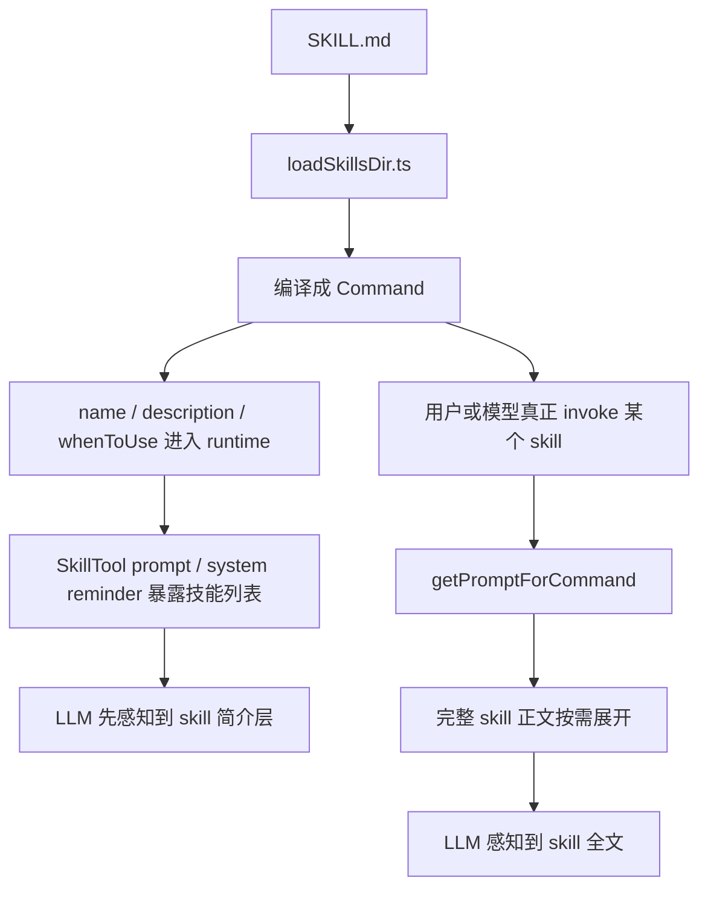

# Claude Code 源码共读笔记 35：skill 的 name 和 description 是什么时候让 LLM 感知到的

## 这篇看什么

这个问题其实问得特别准，而且正好卡在 skill 机制最容易误解的一层：

> skill 的 `name` / `description` 到底是什么时候让 LLM 感知到的？
> 是不是会话一开始就把所有 skill 全量注进去？

这个问题表面看像 prompt 细节，实际上会牵出 skill 这套系统里一个很重要的分层：

1. skill 什么时候先被系统加载成 `Command`
2. 模型什么时候先看到 skill 的“简介层”
3. 完整 skill 正文又是什么时候才真正进上下文

我这次重点补看了三处：

- `src/skills/loadSkillsDir.ts`
- `src/tools/SkillTool/prompt.ts`
- `src/utils/messages.ts`

看完之后，可以把结论说得很清楚：

> **不是每次会话一开始就把所有 skill 的完整内容全量注进模型。**

更准确的说法是：

> skill 的 `name` / `description` / `whenToUse` 会先在定义层被加载成 `Command` 字段，然后通过“skill 列表 / relevant skills reminder”这种简介层逐步暴露给 LLM；而完整 skill 正文只有在该 skill 被真正 invoke 时，才按需展开进当前上下文。

我觉得这句话就是这篇的主结论。

---

## 先给主结论

### 1. `name` / `description` 先进入 runtime，不等于先进入完整 prompt

第一层一定要先分清：

- **被系统加载**
- **被模型完整看到**

这两件事不是一回事。

`loadSkillsDir.ts` 在 skill 定义层做的事情，是把 skill 编译成 `Command`。到这一步时：

- `name`
- `description`
- `whenToUse`

这些字段已经进入了 runtime 的 command registry。

但这不等于：

- 模型已经看到了 skill 全文
- 会话一开始就把所有 skill 正文塞进系统提示词

更准确地说，到了这一步只是：

> **skill 已经在系统内部可用、可查、可枚举。**

还不是“模型已拿到完整技能内容”。

### 2. 模型在开局通常先感知到的是“技能列表简介层”，不是完整 skill 正文

这层是这篇最关键的结论。

`src/tools/SkillTool/prompt.ts` 写得非常直白，里面有两条特别重要的信息：

#### 第一条：
SkillTool prompt 明确告诉模型：

- available skills are listed in system-reminder messages in the conversation

也就是说，Claude Code 的设计不是：

- 在工具 prompt 里直接塞每个 skill 的完整正文

而是：

> **先通过 system-reminder message 告诉模型“现在有哪些可用 skill”。**

#### 第二条：
源码注释直接写了：

- full content is only loaded on invocation

这句话几乎已经把问题回答完了。

它说明：

> **默认进模型的是 skills 的 listing / discovery 层；完整 skill 正文只有调用时才会加载。**

这就是 Claude Code 对 skill prompt 预算最核心的设计。

### 3. relevant skill 提醒也只暴露 `name + description` 这一层，不暴露全文

`src/utils/messages.ts` 里处理 `skill_discovery` attachment 的时候，做的是：

```ts
const lines = attachment.skills.map(s => `- ${s.name}: ${s.description}`)
```

然后拼成：

- `Skills relevant to your task:`
- `- skill-name: description`

再用 system reminder 包起来。

这说明 relevant skill surfaced 给模型的时候，给的也是：

- `name`
- `description`

最多再加一层“这是 relevant 的”语义，
而不是 skill 正文。

所以模型在正常对话里，先看到的通常不是完整技能内容，而是：

> **技能目录卡片。**

这一层非常像“发现层”，不是“执行层”。

---

## 先把总图立住：skill 信息是分三层进入模型的



这个图最重要的一点就是：

> **简介层先进入模型，正文层后进入模型。**

这两个阶段不能混。

---

## 第一层：`loadSkillsDir.ts` 负责把 `name` / `description` 先变成 runtime 字段

这一层其实不复杂，但特别关键。

`loadSkillsDir.ts` 里有个很明确的函数：

- `estimateSkillFrontmatterTokens(skill)`

它里面直接拿的是：

```ts
const frontmatterText = [skill.name, skill.description, skill.whenToUse]
  .filter(Boolean)
  .join(' ')
```

这里已经很说明问题了。

### 为什么这段特别值

因为它在暗示 Claude Code 对 skill 信息做了两层区分：

#### A. frontmatter-level summary
也就是：
- `name`
- `description`
- `whenToUse`

#### B. full content
也就是 skill 正文全文。

源码注释也写得很直：

> full content is only loaded on invocation.

这说明定义层早就把 skill 分成了：

- **用于发现/估算/展示的简介层**
- **用于真正执行的正文层**

所以 `name` / `description` 是在定义层就先进入 runtime 的，
但它们那时还是 command fields，不是完整 prompt body。

---

## 第二层：SkillTool prompt 本身不会把所有 skill 正文全塞给模型

这层要特别讲清楚，因为这是最容易误解的地方。

很多人会自然猜：

- 既然 skill 这么重要，那会不会会话一开始就把所有 skill 正文打包进系统提示？

答案是：**不是。**

`src/tools/SkillTool/prompt.ts` 的设计非常明确：

### 1. 它给模型的是一种“如何使用 SkillTool”的说明
而不是技能全文集合。

它会告诉模型：

- available skills are listed in system-reminder messages in the conversation
- when a skill matches the request, you should invoke Skill tool
- if command tag already exists, follow loaded instructions directly

这说明 SkillTool prompt 的角色是：

> **教模型什么时候该用 skill，以及 skill 信息会在哪里看到。**

不是把所有 skill 正文一股脑塞进去。

### 2. `formatCommandsWithinBudget(...)` 说明 skills list 本身是预算受控的
这段实现特别能说明 Claude Code 的真实做法。

它会把可用 skills 格式化成：

- `- skill-name: description`

而且会做：

- context window 百分比预算控制
- description 长度裁剪
- extreme case 下甚至只保留名字

这件事已经说明得很明白了：

> Claude Code 在 turn-1 关心的是“让模型知道有哪些 skill 可用”，而不是“先让模型读完所有 skill 全文”。

否则根本没必要搞这么一整套 listing budget 逻辑。

### 3. 注释已经把设计意图写明了
最关键的注释就是：

- full content is only loaded on invoke
- verbose whenToUse strings waste turn-1 cache_creation tokens without improving match rate

这句话翻成人话就是：

> 开局时只需要让模型知道“有哪些技能，大概做什么”；如果把 skill 正文全塞进去，只会浪费 turn-1 token 和 cache，而不提高匹配效果。

这其实是非常成熟的设计。

---

## 第三层：模型开局到底能“感知到”什么？

如果把问题问得更实一点，答案其实是：

### 会话开局，模型通常先能感知到的是：
- skill 名字
- skill description
- 有时加 `whenToUse`
- 这些信息组成的 skill listing

但这层感知有几个特点：

### 1. 是摘要层
模型先知道：
- 有这个 skill
- 它大概是做什么的
- 什么时候可能值得用

### 2. 是预算受控层
不是无限展开，description 可能会被截断。

### 3. 是发现层，不是执行层
它的作用是帮助模型决定：

- 这件事该不该调用某个 skill

而不是让模型在开局就完整遵循 skill 正文里的所有步骤。

所以如果你问：

> 会话一开始 skill 的 `name` / `description` 会不会让 LLM 感知到？

答案是：

> **通常会，但它先感知到的是简介层，不是全文层。**

---

## 第四层：relevant skills reminder 是第二个关键入口

除了 SkillTool 自己那边的技能列表，另一条很重要的注入链是：

- `skill_discovery` attachment

`src/utils/messages.ts` 处理这类 attachment 时，做的是：

```ts
const lines = attachment.skills.map(s => `- ${s.name}: ${s.description}`)
```

然后拼成：

- `Skills relevant to your task:`
- 若干 `- name: description`

再包进 system reminder。

### 这一层特别重要

因为它说明：

> 不是所有 skill 都要一直在模型眼前全量常驻；Claude Code 还会按当前任务，再额外把“相关 skill”提醒一遍。

这就形成了两层感知：

#### 第一层：可用技能全集 listing
#### 第二层：当前任务相关技能 listing

但两层给的都还是：

- `name`
- `description`

而不是 skill 全文。

所以 Claude Code 的 skill 感知链其实非常节制：

- 开局给目录
- 当前任务给相关卡片
- 真调用时才给全文

这就是一套很完整的分层。

---

## 第五层：完整 skill 正文什么时候才真正让 LLM 感知到？

这一层答案最简单，也最关键：

> **只有 skill 被真正 invoke 时。**

也就是：

- 用户显式 `/xxx`
- 模型调用 SkillTool
- `processPromptSlashCommand(...)`
- `command.getPromptForCommand(...)`

到了这一步，才会把完整 skill 正文展开出来。

### 这时发生了什么

这时候不再是 listing 了，而是：

- skill 正文被展开
- 参数被替换
- `${CLAUDE_SKILL_DIR}` / `${CLAUDE_SESSION_ID}` 被替换
- 可能带出 attachments
- hooks / permissions / model / effort 进入运行时效果

也就是说，这时 skill 才真正从：

- **可发现对象**

变成：

- **正在执行的能力单元**

所以如果把整个 skill 信息流压成一句话，就是：

> `name` / `description` 先让模型知道“有这个技能”；完整 skill 正文再让模型知道“这个技能具体怎么做”。

---

## 第六层：为什么 Claude Code 不在开局把所有 skill 全文都注进去？

这其实是一个很好的设计问题。

我觉得答案可以收成三点：

### 1. token 预算
skill 多起来以后，如果一开局就把所有正文塞进去，turn-1 token 会非常夸张。

### 2. cache creation 成本
源码注释里已经明确提到：

- verbose descriptions / content 会浪费 turn-1 cache_creation tokens

也就是说，Claude Code 很在意开局上下文的缓存成本。

### 3. 匹配效果并不会因此更好
模型通常只需要先知道：

- 有哪些 skill
- 哪些和当前任务相关

就足以决定要不要调用 SkillTool。

把全文先塞进去，反而只会：

- 更贵
- 更重
- 更乱
- 更容易让无关 skill 噪声抢上下文

所以 Claude Code 选的是很合理的三段式：

1. **先告诉你有哪些**
2. **再提醒你哪些相关**
3. **最后真正调用时才给全文**

这是非常成熟的 prompt 预算设计。

---

## 第七层：这件事也解释了为什么 `when_to_use` 很重要，但又不该写太长

`SkillTool/prompt.ts` 里其实还顺手解释了一个相关问题。

它在描述展示字符串时会做：

```ts
const desc = cmd.whenToUse
  ? `${cmd.description} - ${cmd.whenToUse}`
  : cmd.description
```

也就是说，模型开局看到的“技能简介层”里，`whenToUse` 是会参与进去的。

### 这意味着什么

意味着：

- `description` 决定 skill 是干什么的
- `whenToUse` 决定 skill 什么时候该被想起来

所以 `when_to_use` 对自动发现非常关键。

### 但它又不能太长

因为它属于 listing 层，而 listing 层本身有预算：

- `MAX_LISTING_DESC_CHARS = 250`
- 极端情况下甚至会只保留名字

这就解释了一个很有意思的设计平衡：

> `when_to_use` 很重要，但它的重要性发生在“发现层”；既然是发现层，就必须足够精确、足够短，不然只会烧掉预算而不提高匹配率。

这点其实和 `skillify` 里对 `when_to_use` 的强调，是完全能对上的。

---

## 八、把整个问题压成一个分层答案

如果现在回到最初那个问题：

> skill 的 `description` 和 `name` 是什么时候让 llm 感知到的？每次会话刚开启就会注入进去吗？

我觉得最准确的回答应该是分三层：

### 第一层：定义层
在 `loadSkillsDir.ts` 把 skill 加载成 `Command` 时，
`name` / `description` / `whenToUse` 已经进入 runtime。

### 第二层：发现层
会话开局和后续 turn 中，模型通常会通过：
- SkillTool 的 skill listing
- relevant skills system reminder

先感知到 skill 的：
- `name`
- `description`
- 部分 `whenToUse`

### 第三层：执行层
只有 skill 被真正 invoke 时，
完整 skill 正文才按需展开进当前上下文。

也就是说：

> **会话刚开启时，LLM 通常能先感知到 skill 的简介层；但不会默认拿到所有 skill 的完整正文。完整正文是调用时才加载。**

---

## 我现在对这个问题的一句话定义

如果只留一句最短的话，我会留这个：

> skill 的 `name` / `description` 并不是在每次会话开局以完整 `SKILL.md` 形式全量注入给 LLM，而是先在定义层进入 `Command`，再通过 skill listing / relevant-skills reminder 这种简介层逐步暴露给模型；只有在 skill 被真正 invoke 时，完整正文才按需展开进上下文。

这句话里最想保住的两个词是：

- **简介层**
- **按需展开**

因为这正是 Claude Code 在 skill prompt 预算上的核心设计。

---

## 这篇最值得记住的几个判断

### 判断 1：`name` / `description` 先进入 runtime，不等于先进入完整 prompt

### 判断 2：会话开局模型通常先感知到的是 skill listing，而不是 skill 全文

### 判断 3：relevant skill reminder 也是 `name + description` 级别的发现层注入

### 判断 4：完整 skill 正文只有在 invoke 时才真正展开进上下文

### 判断 5：Claude Code 对 skill 的提示预算设计，本质上是“先发现，再加载”，而不是“先全量灌进去”

---

## 下一步最顺怎么接

这篇其实顺手把另一个相关问题也带出来了：

> `when_to_use` 和 `description`，到底哪个对 skill 自动发现更关键？

如果继续，这个问题很值得单开一篇。因为它会直接落到：

- 好 skill 的发现层应该怎么写
- 为什么 `when_to_use` 在 `skillify` 里会被写成 CRITICAL
- Claude Code 到底怎么平衡“发现率”和“prompt 预算”

这个方向我觉得挺顺。