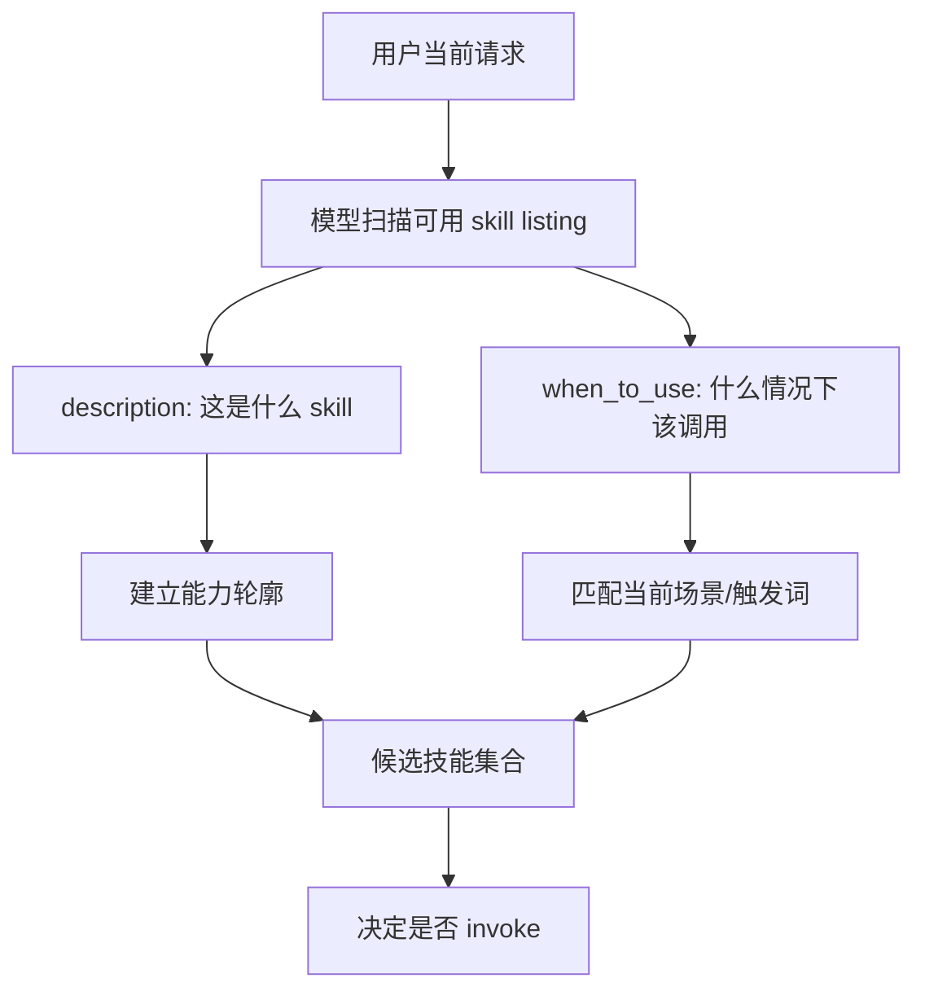

# Claude Code 源码共读笔记 36：when_to_use 和 description，哪个对 skill 发现更关键

## 这篇看什么

上一篇我刚把一个问题拆清了：

> skill 的 `name` / `description` 不是开局以完整 `SKILL.md` 形式全量注入，而是先以 skill listing / relevant-skills reminder 这种简介层逐步暴露给模型；完整正文只有 invoke 时才按需展开。

那顺着这条线，马上就会冒出另一个很自然的问题：

> 在这个“简介层”里，`description` 和 `when_to_use` 到底哪个更关键？

这个问题我觉得非常值。

因为它会直接落到 skill 写法里最容易写坏的一块：

- `description` 到底该写什么
- `when_to_use` 为什么在 `skillify` 里会被写成 **CRITICAL**
- Claude Code 到底怎么平衡“更容易被模型发现”和“不要把 listing 写得又长又重”

这次我主要回看了两处：

- `src/tools/SkillTool/prompt.ts`
- `src/skills/bundled/skillify.ts`

看完之后，我现在会直接给结论：

> **如果问题是“skill 发现时，哪个字段更关键”，答案不是二选一，而是：`description` 决定这是什么，`when_to_use` 决定什么时候该想起它；而在自动发现这件事上，`when_to_use` 往往更关键。**

这句话其实就是这篇的主结论。

因为 skill 发现本质上不是“识别 skill 身份”，而是“在当前用户请求里，判断要不要把这个 skill 想起来”。

而这件事更依赖的，恰恰不是“这个 skill 是什么”，而是：

> **什么场景该调用它。**

也就是 `when_to_use`。

---

## 先给主结论

### 1. `description` 回答的是“它是什么”，`when_to_use` 回答的是“什么时候轮到它”

我觉得理解这两个字段，最稳的方法不是记定义，而是记它们分别在回答什么问题。

### `description`
它回答的是：

- 这个 skill 是干什么的
- 它的能力轮廓是什么
- 它和其它 skill 有什么基本区分

所以它更像：

> **身份说明**

### `when_to_use`
它回答的是：

- 在什么用户意图下，这个 skill 应该被想起来
- 哪些触发短语、表达方式、任务场景会命中它
- 它和其它相邻 skill 的使用边界在哪

所以它更像：

> **调用条件说明**

这两者不是重复，而是两个不同层级。

但如果问题是：

> 对“自动发现”更关键的是哪个？

那答案通常会偏向：

> **`when_to_use` 更关键。**

因为自动发现说到底是在判断：

- “现在是不是该它上场了？”

而不是：

- “它大概是做什么的？”

### 2. Claude Code 源码本身已经把这个倾向写出来了

这不是我主观猜的，而是源码里已经有明显信号。

`SkillTool/prompt.ts` 的 listing 描述拼法是：

```ts
const desc = cmd.whenToUse
  ? `${cmd.description} - ${cmd.whenToUse}`
  : cmd.description
```

这行代码其实特别能说明问题。

它不是二选一：

- 不会只给 `description`
- 也不会只给 `whenToUse`

而是把它们拼在一起。

这说明 Claude Code 团队认为：

> skill 的发现层简介，既需要“它是什么”，也需要“什么时候用”。

但顺序上是：

1. 先给 `description`
2. 再补 `whenToUse`

也就是说，系统默认的心智是：

- 先让模型知道这是什么 skill
- 再告诉模型它在什么场景下该被想起

### 3. 但真正决定“命中率”的，往往是 `when_to_use`

这一点我觉得非常重要。

如果只从“看起来信息完整”出发，很多人会把 `description` 写得很认真，
但 `when_to_use` 随便写两句，或者直接写成空泛说明。

结果就是：

- skill 的能力本身没问题
- 但模型在真实对话里就是不容易想起它

为什么？

因为自动发现不是在做百科分类，而是在做：

> **当前任务意图 → skill 调用决策**

这一步更依赖：

- trigger phrases
- 典型用户说法
- 场景边界
- “什么情况用，什么情况不用”

这些东西，本来就更接近 `when_to_use`，而不是 `description`。

---

## 先把总图立住：`description` 和 `when_to_use` 分别在 skill 发现里扮演什么角色



这个图最重要的一点就是：

> `description` 帮模型理解 skill 的能力轮廓，`when_to_use` 帮模型判断当前场景是不是该调用它。

两者都重要，但在“发现”这个动作上，`when_to_use` 更贴近决策本身。

---

## 第一层：为什么 `description` 不能没有

虽然我前面说自动发现更依赖 `when_to_use`，但这绝不等于 `description` 不重要。

恰恰相反，`description` 是 skill 发现里的地基。

### 没有好的 `description`，会发生什么

如果 `description` 很空，比如：

- 帮助处理复杂任务
- 用于高质量执行工作流
- 提供专业支持

那模型其实根本建立不起这个 skill 的能力轮廓。

这时候即使 `when_to_use` 写得还行，也容易出现两种问题：

#### 1. skill 之间区分不出来
因为大家看起来都像“很会做事”。

#### 2. 触发了也不敢调
因为模型不确信：
- 这个 skill 真是不是我想象中的那种能力

所以 `description` 的价值是：

> **让模型先对这个 skill 的能力边界有一个稳定的“第一印象”。**

它更像“名片正面”。

### 好的 `description` 应该是什么样

我现在更倾向它满足这两个要求：

1. **短**
2. **有区分度**

比如不要写：

- 用于帮助用户更高效完成工作

而要写成：

- 用于把已有文章改成公众号可发布版本
- 用于接收代码评审意见并判断该不该改
- 用于将长文拆成小红书多图卡片文案

也就是说，`description` 最怕的不是短，而是泛。

---

## 第二层：为什么 `when_to_use` 对自动发现更关键

这一点其实可以从 skill 发现的本质来理解。

skill 自动发现不是在回答：

- 这个 skill 是什么

而是在回答：

- 这轮用户请求下，现在哪个 skill 应该上场

这两个问题很像，但不是一回事。

### `when_to_use` 更贴近哪一步？

更贴近的是：

- 触发判断
- 场景命中
- 调用边界

也就是说，它直接参与的是：

> **把“当前用户意图”映射成“该不该调用这个 skill”**

这就是为什么 `skillify` 里会把 `when_to_use` 写成：

- **CRITICAL**

而且还特别要求：

- 要以 `Use when...` 开头
- 要写 trigger phrases
- 要写 example user messages

这套要求其实已经把它的定位写得非常清楚了：

> `when_to_use` 不是文档说明，而是 skill 的发现层触发接口。

### 一个很直观的对比

#### skill A
- description: 用于 cherry-pick PR 到 release 分支
- when_to_use: （空泛）在需要处理发布问题时使用

#### skill B
- description: 用于 cherry-pick PR 到 release 分支
- when_to_use: Use when the user wants to cherry-pick a PR to a release branch. Examples: “cherry-pick to release”, “CP this PR”, “hotfix this to release”

这两个 skill 的“能力说明”其实差不多。

但在真实对话里，模型明显更容易把 skill B 想起来。

原因不是它“更详细”，而是：

- 用户话术
- 触发短语
- 任务语境

都被明确写进了 `when_to_use`。

这就把 skill 发现从“语义猜测”变成了“更接近匹配”。

---

## 第三层：源码里为什么要把 `description` 和 `whenToUse` 拼成一条 listing？

这行代码我觉得特别有味道：

```ts
const desc = cmd.whenToUse
  ? `${cmd.description} - ${cmd.whenToUse}`
  : cmd.description
```

它背后其实有一个很稳的设计判断：

> 让模型感知 skill 时，不能只告诉它“这是什么”，也不能只告诉它“什么时候用”，而应该把两者拼在一起。

### 为什么不能只留 `description`

如果只留 `description`，模型知道：

- skill 大概是什么

但不一定知道：

- 哪种用户说法最容易命中它
- 哪些场景该调它
- 哪些邻近任务不该调它

### 为什么也不能只留 `when_to_use`

如果只留 `when_to_use`，模型知道：

- 某些场景下可以调

但能力轮廓本身会模糊。

尤其当有多个 skill 都可能写出类似场景时，
没有 `description`，模型反而更难区分它们到底谁更合适。

### 所以 Claude Code 的处理其实很合理

它在发现层做的是：

- `description` 先给能力轮廓
- `whenToUse` 再给触发边界

这两个合在一起，才形成一个对模型足够好用的 skill card。

所以如果问：

> 哪个更关键？

更准确的回答不是“另一个不重要”，而是：

> **`description` 是 skill card 的骨架，`when_to_use` 是它的触发器；在自动发现阶段，触发器通常更决定命中。**

---

## 第四层：为什么 `when_to_use` 重要，但又不能写成一大坨

这一点也很关键。

如果知道 `when_to_use` 对自动发现重要，很多人会自然走向另一个极端：

- 那我就尽量多写
- 多列场景
- 多列例子
- 多铺一点语义覆盖

但 `SkillTool/prompt.ts` 又明确提醒了另一个事实：

- listing 是有预算的
- `MAX_LISTING_DESC_CHARS = 250`
- 太长会被截断
- 过长的 `whenToUse` 会浪费 turn-1 cache_creation tokens，而不提高 match rate

这说明 Claude Code 对 skill 发现层的期待不是：

- 越全越好

而是：

> **越精准越好。**

### 所以好的 `when_to_use` 应该是什么样

我现在觉得它应该同时满足三件事：

#### 1. 场景明确
清楚告诉模型：
- 这 skill 是在哪类任务里上场

#### 2. 触发词具体
最好带：
- 用户可能真的会说的话
- 常见短语
- 同义表达

#### 3. 边界清楚
最好能让模型知道：
- 哪类相邻任务不该调它

也就是说，`when_to_use` 不是越长越好，而是越像：

> **高密度的触发边界描述**

越好。

---

## 第五层：`skillify` 为什么会把 `when_to_use` 标成 CRITICAL

我觉得这个地方其实已经非常说明官方态度了。

`skillify` 里对 `when_to_use` 的原话是：

- `when_to_use` is CRITICAL -- tells the model when to auto-invoke

而且它还明确要求：

- Start with `Use when...`
- include trigger phrases
- include example user messages

这基本已经把 `when_to_use` 的角色说透了。

### 它为什么不是“important”，而是“CRITICAL”？

因为 skill 写出来之后，有两个阶段：

1. 它能不能执行
2. 它能不能在该出现的时候被想起来

很多人容易只盯第一个阶段：

- 正文写对了
- frontmatter 合法了
- invoke 能跑了

但官方很清楚，第二阶段同样重要：

> 如果 skill 永远不容易被模型在合适的时候想起来，那它再能跑，也只是“存在”，不算“有效”。

所以 `skillify` 把 `when_to_use` 标成 CRITICAL，本质上是在说：

> **skill 的发现性是它可用性的一部分。**

这点非常重要。

---

## 第六层：如果只能优先优化一个字段，应该先优化谁？

如果现实一点问：

> 我现在手上有一批已有 skill，只能先重点优化一个字段，应该先改 `description` 还是先改 `when_to_use`？

我现在的判断会是：

### 默认优先优化 `when_to_use`

尤其当你遇到的是这些问题时：

- skill 写得明明不差，但模型老想不起来
- skill 经常在错误场景被调
- skill 和相邻 skill 容易混淆
- 模型只在非常直接的提示下才会调用它

这些问题，本质上更像是“发现层问题”，而不是“能力轮廓问题”。

这时优先改 `when_to_use`，收益通常更大。

### 什么时候该先改 `description`

只有当 skill 本身已经有这些坏味道时：

- 能力描述很泛
- 和其它 skill 看起来没区别
- 一看名字和描述，不知道它到底干嘛

这时才该先回头补 skill 的身份说明。

所以更实际的结论其实是：

> skill 不容易被发现时，先查 `when_to_use`；skill 容易被误解时，先查 `description`。

---

## 第七层：把这个问题压成一个真正可用的写法建议

如果把这篇最后压成可操作建议，我觉得可以收成下面这组：

### 写 `description` 时，问自己：
- 读完这一句，模型能不能知道这 skill 大概是干什么的？
- 它和相邻 skill 有没有明显区分？
- 会不会写得太泛，导致什么都像它？

### 写 `when_to_use` 时，问自己：
- 用户会用什么原话表达这类需求？
- 哪些 trigger phrases 最典型？
- 哪些场景最容易误触发，需要我主动划边界？
- 如果模型只看这一句，它能不能知道“什么时候该想起它”？

我觉得这组问题比记定义更有用。

---

## 八、把整个问题压成一句最短的话

如果只允许我留一句最短的话，我会留这个：

> `description` 决定 skill 是什么，`when_to_use` 决定 skill 什么时候该被想起；而在 Claude Code 的自动发现链路里，真正更影响命中率的，通常是 `when_to_use`。

这句话里最想保住的两个词是：

- **是什么**
- **什么时候想起**

因为这正是这两个字段最本质的分工。

---

## 这篇最值得记住的几个判断

### 判断 1：`description` 更像 skill 的身份说明，`when_to_use` 更像 skill 的触发接口

### 判断 2：自动发现不是在做百科分类，而是在做“现在该不该调它”的判断，所以 `when_to_use` 更贴近发现决策

### 判断 3：Claude Code 把两者拼成同一条 listing，是因为发现层同时需要能力轮廓和触发边界

### 判断 4：`when_to_use` 很重要，但不能写成又长又散的大段说明；它属于预算受控的 discovery 层

### 判断 5：如果 skill 不容易被想起，优先改 `when_to_use`；如果 skill 容易被误解，优先改 `description`

---

## 下一步最顺怎么接

这一篇如果再往下走，我觉得最顺的方向是：

> **skill vs agent：发现层和执行层的分工边界**

因为现在已经把：

- skill 是什么
- 怎么执行
- 怎么被发现
- 怎么写得更容易被发现

都讲清了。

下一步自然就是再往上一层：

- skill 适合承接什么
- agent 适合承接什么
- Claude Code 为什么要把“能力发现”和“执行主体”分成两层抽象

这个方向我觉得现在正好。