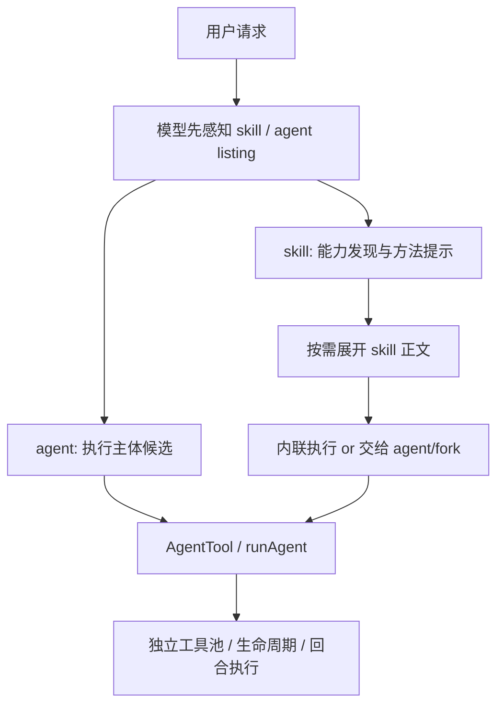

# Claude Code 源码共读笔记 37：skill 和 agent，是怎么分工的

## 这篇看什么

前面几篇其实已经把 skill 这条线拆得差不多了：

- skill 怎么被加载
- skill 怎么被发现
- skill 正文什么时候才真正进上下文
- `description` 和 `when_to_use` 怎么影响自动发现

那顺着这条线，再往前走一步，就会碰到一个更大的问题：

> Claude Code 里 skill 和 agent 到底是怎么分工的？
> 它们看起来都像“可调用能力”，为什么要同时存在两层？

这个问题如果只从表面看，很容易讲成：

- skill 偏轻
- agent 偏重

这当然不能算错，但还是太平了。

我这次回看了几处关键实现之后，觉得更准确的说法应该是：

> **skill 主要负责把“该怎么做”组织成可发现、可按需展开的能力说明；agent 才是 Claude Code 里真正负责跑完整自主回合、持有工具池、承接执行生命周期的运行主体。**

换句话说：

> **skill 更像能力包，agent 更像执行体。**

而 Claude Code 把这两层拆开，核心不是为了概念好看，而是为了同时解决两件事：

1. 让模型先知道“现在有什么现成方法可用”
2. 真到执行时，再把任务交给一个能独立跑起来的主体

我觉得这才是这套设计真正值钱的地方。

---

## 先给主结论

### 1. skill 不是和 agent 并列的另一种执行器，它更像 agent 前面那层“能力组织层”

这篇最需要先拆开的误解就是：

- skill 能不能自己执行？
- agent 能不能自己执行？

如果只看表面，你会觉得两者都能“被调用”，所以像两种平行抽象。

但源码越往下看越明显：

- skill 负责提供一段结构化 prompt / 能力说明 / 运行约束
- agent 负责真正进入 `runAgent(...)` 那条自主执行主干

也就是说，skill 更接近：

- 任务方法
- 操作规程
- 场景化能力模板

而 agent 更接近：

- 真正的 worker
- 真正有工具池的执行单元
- 真正会在 runtime 里独立跑回合的东西

所以它们不是“两个都能干同一件事”的重复设计，而是：

> **一个负责教模型该怎么组织工作，一个负责真的把工作跑完。**

### 2. Claude Code 把“发现能力”和“执行主体”拆成两层

如果把 skill 和 agent 放进同一张图里看，结构其实很清楚：

这张图里最关键的一点是：

> **skill 可以影响执行，但执行主干最后还是落到 agent 这边。**

尤其是 forked skill 这条路径，几乎就是在明说：

- skill 不是另起一套执行系统
- skill 最终也是借 agent runtime 在跑

### 3. skill 擅长复用“方法”，agent 擅长承接“工作”

这是我现在最想保住的一句判断。

为什么要有 skill？
因为很多东西重复的不是“人”，而是：

- 一个流程
- 一种判断框架
- 一套执行约束
- 一段提示词结构
- 一组允许工具 / effort / hooks / 参数替换规则

这些东西更适合被封装成 skill。

为什么还需要 agent？
因为真正落地时，总得有一个主体去：

- 拿工具
- 读写消息
- 注册 hooks
- 预加载 skill
- 管理上下文
- 跑自主回合
- 结束后返回结果

这些都是 agent runtime 的职责。

所以一句话压缩就是：

> **skill 负责复用工作方法，agent 负责承接实际工作。**

---

## 第一层：skill 在定义上更像 command，不像 worker

这件事从定义层就已经看得很清楚了。

`loadSkillsDir.ts` 这条线本质上是在做什么？

不是在造“一个会自己跑的实体”，而是在把 skill 解析成 `Command`：

- `name`
- `description`
- `whenToUse`
- `allowedTools`
- `model`
- `effort`
- `getPromptForCommand(...)`

这里最关键的是最后那个：

- `getPromptForCommand(...)`

这说明 skill 的核心产物不是“执行器实例”，而是：

> **给当前任务生成 prompt 内容。**

这一点特别关键。

因为它决定了 skill 的本质更接近：

- prompt-based capability
- command-like reusable instruction unit

而不是 agent 那种：

- long-lived autonomous worker definition

也就是说，skill 在结构上先天就是“内容生产者”，不是“回合运行者”。

### 这也解释了为什么 skill 会被当成 listing 来发现

前面几篇已经看过，skill 在模型开局先看到的是：

- `name`
- `description`
- `when_to_use`

而不是完整正文。

这说明 skill 的第一职责不是立刻开跑，而是先让模型知道：

- 这里有一种现成能力
- 这个能力适合什么场景
- 真需要时可以再展开

这种“先发现、后加载”的特征，本身就很像能力目录，不像执行主体。

---

## 第二层：agent 在定义上就是执行主体

反过来看 agent，味道就完全不一样了。

`loadAgentsDir.ts` 里 parse agent markdown 时，核心字段是：

- `name` → `agentType`
- `description` → `whenToUse`
- `tools`
- `disallowedTools`
- `skills`
- `initialPrompt`
- `mcpServers`
- `hooks`
- `model`
- `effort`
- `permissionMode`
- `maxTurns`
- `memory`
- `isolation`
- 正文 → `getSystemPrompt()`

和 skill 很不一样的一点是：

> **agent 的正文不是一个“按需展开的技能说明”，而是这个执行体自己的 system prompt。**

这就说明 agent 的定位从一开始就是：

- 一个可被调度的角色
- 一个有工具边界的执行体
- 一个能带着 system prompt 独立跑起来的 runtime 单元

### agent 的 frontmatter 其实都在描述“这个 worker 怎么活”

比如：

- `tools` 是它能拿什么工具
- `memory` 是它能带什么记忆
- `hooks` 是它注册什么生命周期钩子
- `maxTurns` 是它最多跑几轮
- `isolation` 是它是不是去 worktree/remote 跑

你会发现，这些都不是“技能文案字段”，而是：

> **运行时配置字段。**

所以从定义层就能看出，agent 和 skill 虽然都能被模型“看到”，但一个是在描述能力包，一个是在描述执行体。

---

## 第三层：SkillTool 更像把能力包接进当前任务

从运行路径上看，SkillTool 做的也不是“再发明一个执行器”。

`SkillTool.ts` 里核心分两种路径：

### 路径 A：inline skill

它会走：

- `processPromptSlashCommand(...)`
- 调 `command.getPromptForCommand(...)`
- 拿到 skill 展开后的内容
- 作为新的 message 注回当前上下文

这条路本质上是：

> **把 skill 作为方法说明，接进当前这轮任务。**

也就是说，skill 在这里更像是给当前主线程追加一层“应该怎么做”的运行时说明。

### 路径 B：forked skill

如果 skill 的 `context === 'fork'`，那就不会只做 inline 注入，而是走 `executeForkedSkill(...)`。

但再往下看，关键点来了：

- forked skill 不是自己发明一条新主干
- 它会进入 `prepareForkedCommandContext(...)`
- 然后选一个 `baseAgent`
- 再交给 agent 那套子系统去跑

这里其实已经把分工说得非常直白了：

> **skill 即使升级成 fork 执行，最后也还是借 agent 来跑。**

所以 skill 的“执行感”是借来的。

它自己负责的是：

- 把 prompt 组织好
- 把工具约束准备好
- 把上下文加工好

但真正把任务当成一个 autonomous run 去执行的，仍然是 agent。

---

## 第四层：runAgent 才是 Claude Code 的真正执行主干

这一层我觉得是最关键的。

`runAgent.ts` 里你会看到很多只有“执行主体”才配拥有的职责：

- 解析和组装 agent 的工具池
- 注册 agent frontmatter hooks
- 预加载 agent frontmatter 里指定的 skills
- 初始化 agent 专属 MCP servers
- 组装 agent-specific options
- 创建 subagent context
- 管理消息流、回合推进、结果返回

这几件事连在一起，基本已经说明了：

> **Claude Code 真正的 runtime 主干，不在 skill 里，而在 agent 里。**

### 一个特别关键的细节：agent 可以预加载 skill

`runAgent.ts` 里有段逻辑非常说明问题：

- agent frontmatter 可以写 `skills`
- 启动 agent 时，会把这些 skill 预加载进 initial messages

这个设计特别有意思。

它等于在架构上明确表达了：

- agent 是主
- skill 是附着在 agent 身上的方法包

也就是说，Claude Code 不只是“同时支持 skill 和 agent”，而是已经把它们组织成：

> **agent runtime + skill preload / invoke 的组合关系**

这就不是两个平行体系，而是一个主体系带一个能力插件层。

### 这点比“轻重之分”更重要

很多人会说：

- skill 轻量
- agent 重量

但源码里真正更有信息量的不是轻重，而是：

> **谁是 runtime 的主体，谁是 runtime 可装载的能力内容。**

答案非常明显：

- runtime 主体是 agent
- 可装载内容是 skill

---

## 第五层：AgentTool 暴露的是“可派出去工作的角色”

如果再看 `AgentTool/prompt.ts`，这个分工会更明显。

它对 agent 的 listing 格式是：

- `agentType: whenToUse (Tools: ...)`

而且 prompt 里反复强调的是：

- launch a new agent
- agent autonomously handle complex tasks
- each agent type has specific capabilities and tools available
- agent invocation starts fresh，需要完整 briefing

这里的措辞和 SkillTool 很不一样。

SkillTool 更像在说：

- 有哪些现成 skill 可用
- 什么时候该 invoke
- 调用后完整正文才会加载

AgentTool 则是在说：

- 你要不要启动一个新执行体
- 这个执行体有哪些工具
- 你该怎么给它写 task brief
- 它完成后会回你一个结果

这就说明 AgentTool 面向的不是“方法发现”，而是：

> **任务委派。**

所以我现在会把两者分得很开：

- SkillTool 面向能力发现与方法注入
- AgentTool 面向执行主体的派发与调度

---

## 第六层：为什么 Claude Code 不把 skill 直接做成 agent，或者把 agent 直接做成 skill

这个问题其实挺值。

如果不拆这两层，会怎么样？

### 如果一切都做成 agent

那很多本来只是：

- 一段方法说明
- 一个固定流程
- 一个写法规范
- 一个诊断框架

都会被迫升格成“要启动一个新 worker”。

代价会是：

- 太重
- 上下文切换更大
- 复用粒度太粗
- 很多本来适合 inline 注入的东西也得变成委派任务

### 如果一切都做成 skill

那又会失去另一边的东西：

- 独立工具池
- 独立 system prompt
- fresh context / fork / subagent 生命周期
- hooks、memory、MCP server、isolation 这类执行体配置

也就是说，skill 很适合复用“做法”，但它天然不适合独自承载“角色运行时”。

### 所以拆成两层其实非常合理

Claude Code 最后选的是：

- **skill 负责细粒度能力复用**
- **agent 负责粗粒度任务承接**

这一拆，刚好把两边都保住了：

- 既可以 inline 地把方法塞回当前线程
- 也可以在需要时把任务交给一个真正的执行主体

这比把所有东西都压成单一抽象成熟得多。

---

## 第七层：我现在对 skill vs agent 的一句话定义

如果只让我留一句最短的话，我会留这个：

> **skill 是 Claude Code 的能力包，agent 是 Claude Code 的执行体；前者解决“知道怎么做”，后者解决“真的去做”。**

这句话里最想保住的是两组对照：

- **能力包 vs 执行体**
- **知道怎么做 vs 真的去做**

因为这比“轻量 vs 重量”更接近源码里的真实分工。

---

## 这篇最值得记住的几个判断

### 判断 1：skill 的核心产物是 `getPromptForCommand(...)`，所以它本质上更像 prompt-based capability，而不是 worker

### 判断 2：agent 的正文是自己的 system prompt，frontmatter 里装的是 tools、memory、hooks、isolation 这些运行时配置，所以它本质上是执行主体

### 判断 3：SkillTool 主要做的是把能力包接进当前任务；即使是 forked skill，最后也还是借 agent runtime 在跑

### 判断 4：`runAgent(...)` 才是 Claude Code 真正的执行主干，skill 更像它上面的能力组织层

### 判断 5：Claude Code 把 skill 和 agent 分开，不是重复设计，而是在把“能力发现/方法复用”和“任务执行/主体调度”拆成两层

---

## 下一步最顺怎么接

这篇如果继续往下走，我觉得最顺的不是再泛讲 skill 或 agent 本身，而是继续顺着这条 runtime 边界追：

> **skill 是怎么借 agent runtime 跑起来的？**

也就是把 forked skill 那条链彻底拆开：

- `context: fork` 是什么时候决定路径切换的
- `prepareForkedCommandContext(...)` 到底做了哪些转换
- 为什么 skill 最后会落到 `baseAgent`
- 这条设计到底是在复用 agent，还是在有意保持统一执行主干

这个方向我觉得会很顺。