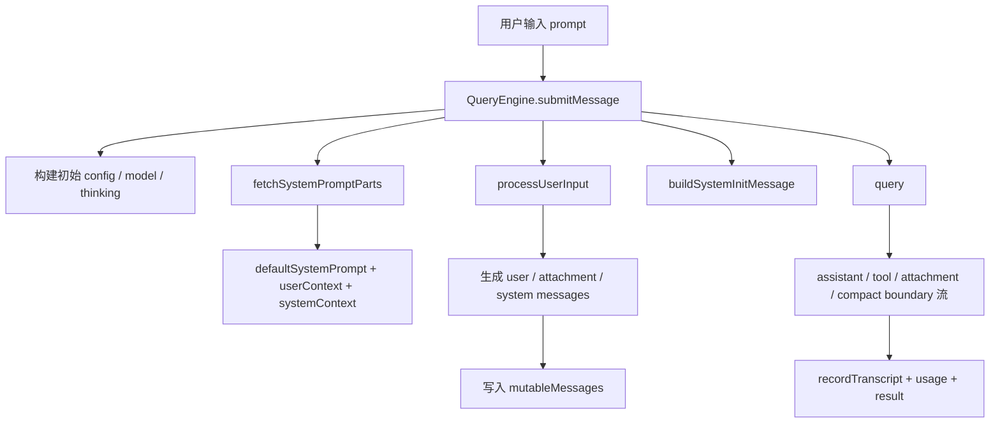

# Claude Code 源码共读笔记 38：QueryEngine 是一次用户请求进入运行时主链路的总入口

## 这篇看什么

前面 skill 篇和 agent 篇其实已经把很多“能力部件”拆出来了：

- skill 怎么被发现、加载、invoke
- agent 怎么被定义、怎么承接执行
- system prompt / reminder / tool listing 为什么要分层注入

但这些东西如果一直分开看，就还差最后一步：

> 一次真实用户请求进来之后，Claude Code 到底是从哪里开始把这些部件真正接起来的？

这次我回到最早那份学习路线里本来就写好的“回补主链路”，先看了：

- `src/QueryEngine.ts`
- `src/utils/systemPrompt.ts`
- `src/utils/processUserInput/processTextPrompt.ts`
- `src/constants/prompts.ts` 里 system prompt / env details 那段

看完之后，我现在会直接给一个很稳的结论：

> **如果说 `runAgent(...)` 是 agent/subagent 那条执行支线的主干，那 `QueryEngine.submitMessage(...)` 就是一次主线程用户请求进入 Claude Code runtime 的总入口。**

更具体点说：

> **它负责把“用户输入 → 消息对象 → prompt 组装 → slash/attachment 预处理 → query 主循环 → transcript / usage / result 输出”整条链路串起来。**

所以这篇最重要的，不是把 `QueryEngine` 说成一个普通 orchestrator，而是要看清：

> **它就是主线程一次交互生命周期的总装配点。**

---

## 先给主结论

### 1. `QueryEngine` 不是单纯“发请求给模型”，而是在组织一次完整交互生命周期

如果只看名字，很容易以为 `QueryEngine` 只是：

- 接一下 prompt
- 调一下模型 API
- 返回一下结果

但源码里它真正做的远比这多。

`submitMessage(...)` 里串起来的东西包括：

- 当前 cwd / app state / model / thinking config 初始化
- system prompt parts 拉取
- userContext / systemContext 组装
- 用户输入通过 `processUserInput(...)` 预处理
- slash command / attachment / tool permission side effects 落地
- transcript 预写
- skills / plugins snapshot 拉取
- `buildSystemInitMessage(...)` 发给上层
- 真正进入 `query(...)` 主循环
- 增量记录 usage / stop_reason / structured output / permission denials
- 维护 `mutableMessages`
- 在结束时产出 result message

所以 `QueryEngine` 的真实职责不是“问模型一个问题”，而是：

> **把一次用户交互变成 Claude Code runtime 能消费、能追踪、能恢复、能持续推进的一次完整会话回合。**

### 2. 它是主线程版本的“运行时装配器”

我觉得理解 `QueryEngine`，最有效的方法不是把它孤立看，而是把它和前面已经看过的 `runAgent(...)` 对照起来。

- `runAgent(...)`：给 agent/subagent/fork 那条执行链装 runtime
- `QueryEngine.submitMessage(...)`：给主线程用户请求装 runtime

两者做的事情很像，都是在组装：

- message buffer
- prompt
- tool context
- state
- lifecycle callbacks

只是服务对象不同：

- `runAgent(...)` 服务 agent 执行体
- `QueryEngine(...)` 服务主线程 query

所以这篇如果只留一句最短的话，我会留：

> **`QueryEngine` 是主线程 query 的 runtime 装配器。**

### 3. skill / agent / prompt / transcript 这些你前面看到的东西，在这里第一次真正收口

前面几篇 skill / agent 看起来像一堆独立机制。

但到了 `QueryEngine.submitMessage(...)` 这里，能明显看到它们第一次被真正收进一条主链：

- skill discovery tracking 在这里按 turn 清空、续用
- `processUserInput(...)` 在这里把 slash/attachment 先处理掉
- system prompt parts 在这里被拼好
- skills / plugins snapshot 在这里被采集给 system init
- query loop 在这里接管后续工具调用和消息推进

这说明 `QueryEngine` 的位置非常像：

> **主线程总线。**

它不一定拥有每个细节的实现，但负责让所有关键部件在这一回合里按顺序咬合起来。

---

## 先把总图立住：主线程一次请求是怎么进入 QueryEngine 的

这个图最重要的一点是：

> **`submitMessage(...)` 不是 query 前的一个小包装，而是 query 之前和之后的大量生命周期管理都在这里。**

所以它更像一个“总入口 + 总收口”，而不是一个薄薄的适配层。

---

## 第一层：`submitMessage(...)` 一上来先装运行时地基

`submitMessage(...)` 的开头不是立刻去处理 prompt，而是先把这轮交互的地基搭起来。

比如：

- 从 `this.config` 里拆出 cwd、commands、tools、mcpClients、thinkingConfig、maxTurns、taskBudget 等等
- 清空 turn-scoped 的 `discoveredSkillNames`
- `setCwd(cwd)`
- 准备 transcript persistence 相关状态
- 包一层 `wrappedCanUseTool(...)` 去跟踪 permission denials
- 算 `initialMainLoopModel`
- 算 `initialThinkingConfig`

这一步特别像系统在说：

> **先把这轮 query 的边界条件、运行参数和审计状态立起来，再谈用户输入。**

### 这说明 QueryEngine 的视角不是“字符串输入”，而是“一轮 runtime 执行”

这一点挺关键。

因为如果它只是 prompt adapter，它根本没必要上来先处理：

- permission denial tracking
- transcript persistence
- skill discovery turn state
- model / thinking config 解析

这些都属于“交互生命周期管理”，不是字符串预处理。

所以从函数开头就能看出来：

> **`submitMessage(...)` 看待一次请求的单位是 turn，不是 text。**

---

## 第二层：system prompt 不是在 query 里临时拼的，而是在进入 query 前先装好 parts

这是这篇里我觉得特别值得抓的一点。

`QueryEngine` 不会把 system prompt 当成一个简单字符串拍进去，而是先调用：

- `fetchSystemPromptParts(...)`

拿到三块：

- `defaultSystemPrompt`
- `userContext`
- `systemContext`

然后再基于：

- `customSystemPrompt`
- `appendSystemPrompt`
- memory mechanics prompt（特定条件下）

组合出最终的 `systemPrompt`。

### 这说明 Claude Code 的 prompt 组织本来就是分层的

这里要和 `utils/systemPrompt.ts` 连起来看。

`buildEffectiveSystemPrompt(...)` 那里写得非常明确，system prompt 的优先级是：

1. override prompt
2. coordinator prompt
3. agent prompt
4. custom system prompt
5. default system prompt
6. appendSystemPrompt 再补到最后

这说明 Claude Code 对 system prompt 的理解不是：

- 一份固定大字符串

而是：

> **一组按优先级装配的 prompt layers。**

这点和你前面在 skill / agent / reminder 那几篇里看到的“分层注入”是一致的。

### 所以 QueryEngine 在主链路里的一个关键职责，就是 prompt 装配入口

也就是说，主线程 query 并不是进到 `query(...)` 里才开始有 prompt。

在那之前，`QueryEngine` 已经先把：

- default prompt
- custom prompt
- append prompt
- env details
- user/system context

这些都准备好了。

所以这里非常适合收一句：

> **`QueryEngine` 不是 prompt 的消费者，它先是 prompt 的装配入口。**

---

## 第三层：用户输入先经过 `processUserInput(...)`，不是原样直送模型

这是主链路里特别关键、但很容易被忽略的一步。

`submitMessage(...)` 在真正进入 query 前，会先调用：

- `processUserInput(...)`

而不是把 `prompt` 原样丢给 `query(...)`。

这说明 Claude Code 的主线程输入模型是：

> **先把用户输入转成消息与副作用，再决定要不要真的 query。**

### 这一步会干什么

从当前这段链路看，至少包括：

- 生成用户消息
- 处理 attachment messages
- 处理 slash commands
- 更新 allowedTools
- 决定 `shouldQuery`
- 产出局部执行的结果文本（比如某些 local slash command）

这里其实已经把“输入处理”和“模型查询”分成了两层。

### `processTextPrompt(...)` 又说明了最底层的输入转换单位是什么

我顺手看了 `processTextPrompt.ts`，它特别直接：

- 给 prompt 生成 `promptId`
- 打 tracing / telemetry
- 把 string 或 content blocks 转成 `UserMessage`
- 如果有 pasted images，就把 text + images 组在同一个 user message
- 再把 attachment messages 拼进去

所以这条链其实是：

- 原始输入
- 先变成规范化 message objects
- 再由更高层逻辑决定是否触发 query

这说明 Claude Code 主链路里真正被处理的最小单位不是“纯文本 prompt”，而是：

> **message graph。**

这点很重要。

因为后面 transcript、resume、compact、attachment、tool result 全都是围绕 message 在运转的。

---

## 第四层：`mutableMessages` 才是 QueryEngine 持有的“活会话状态”

我觉得 `QueryEngine` 里另一个很关键的概念是：

- `this.mutableMessages`

它不是一个临时变量，而是整个 engine 持有的活消息缓冲区。

### 为什么这个字段很关键

因为后面几乎所有东西都围着它转：

- `processUserInput(...)` 之前要把当前 messages 传进去
- 用户输入处理完后，新的 messages 要 push 回来
- transcript 要基于它持久化
- `query(...)` 的输入 messages 是它的快照
- assistant / user / attachment / progress / system message 也会不断往里追加
- compact boundary 到来时，又会对它做裁剪

这说明 QueryEngine 维护的不只是“这轮请求”，而是：

> **当前主线程会话在 SDK/运行时视角下的活动消息状态。**

### 所以它不是 stateless query wrapper

这一点非常值得说清。

如果把 QueryEngine 看成 stateless API wrapper，会完全低估它。

它其实是有会话性的：

- 有 `mutableMessages`
- 有 `readFileState`
- 有 `permissionDenials`
- 有 `totalUsage`
- 有 `loadedNestedMemoryPaths`
- 有 turn-scoped 的 `discoveredSkillNames`

也就是说，它更像：

> **主线程 query session 的状态容器 + 执行入口。**

---

## 第五层：真正进入 `query(...)` 之前，QueryEngine 还会先发一个 system init message

这一步我觉得特别有意思，因为它很能说明 Claude Code 不是“偷偷开始工作”的。

在进入 `query(...)` 之前，`submitMessage(...)` 会先拉：

- 当前可用 skills snapshot
- 当前启用 plugins snapshot

然后 yield 一个：

- `buildSystemInitMessage(...)`

这里其实说明：

> **在 Claude Code 的主线程 runtime 里，query 开始前会先对外暴露一份“这轮系统初始化状态”。**

这个 system init 里包含：

- tools
- mcpClients
- model
- permissionMode
- commands
- agents
- skills
- plugins
- fastMode

这一步非常像把“当前运行时地图”先抛出来。

### 它的意义不只是 UI 展示

我觉得不能把这个只理解成 UI 友好。

更本质一点，它说明 QueryEngine 在语义上把一轮 query 划成两段：

1. **query 前的系统装配阶段**
2. **query 期间的消息流推进阶段**

而 `buildSystemInitMessage(...)` 正好卡在这个分界点上。

---

## 第六层：`query(...)` 是主循环，但 QueryEngine 负责消费并治理它的输出

到了真正：

- `for await (const message of query(...))`

这一步，主循环才正式开始。

但这里也很容易误读成：

- 既然已经进 query 了，QueryEngine 就只是转发消息

其实完全不是。

`submitMessage(...)` 在这个 `for await` 里还在持续做大量治理工作：

- assistant/user/compact boundary 何时写 transcript
- first transcript record 之后再 ack 初始用户消息
- turnCount 怎么加
- usage 怎么从 `stream_event` 里累计
- stop_reason 怎么从 `message_delta` 捕获
- attachment 里如果是 `structured_output` 要抽出来
- `max_turns_reached` 要转成 result error
- `queued_command` 要转成 replay message
- compact boundary 到来时要裁剪 `mutableMessages`
- system/api error 要转成最终结果

所以 query 虽然是“消息流生产者”，但 QueryEngine 仍然是：

> **这条消息流的会话治理者。**

### 这个分工其实很漂亮

- `query(...)` 负责生成运行时流
- `QueryEngine` 负责把这个流转成稳定的 SDK/session/result 语义

这就让 query 主循环本身不必承担所有 transcript / usage / replay / SDK 兼容逻辑。

我觉得这是很成熟的分层。

---

## 第七层：为什么说它是“总入口”，而不是“中间调度器”

这篇最后我觉得最值的是这个判断。

很多人会把 `QueryEngine` 理解成：

- 在 REPL 和 query 中间做调度

这不能说错，但信息量不够。

更准确的说法应该是：

> **`QueryEngine.submitMessage(...)` 是主线程一次用户请求正式进入 Claude Code runtime 的总入口。**

因为从这一刻开始，后面的所有关键东西都在这里完成第一次落地：

- prompt 被装起来
- input 被转成 message
- slash command 被预处理
- transcript 开始写
- skills/plugins snapshot 被拿到
- query 主循环被启动
- 返回消息被治理
- 最终 result 被产出

它已经不是简单的“桥接层”，而是：

> **主线程 turn lifecycle 的入口函数。**

这句话我觉得比“调度器”更准，也更能解释为什么它这么长、这么杂、但又很难被进一步切碎。

因为它承担的本来就是总装职责。

---

## 我现在对 QueryEngine 的一句话定义

如果只留一句最短的话，我会留这个：

> **QueryEngine 是 Claude Code 主线程 query 的运行时总装配器，而 `submitMessage(...)` 就是一次用户请求进入这条主链路的入口。**

这句话里最想保住的是三个词：

- **主线程**
- **总装配器**
- **入口**

因为它们分别对应：

- 和 `runAgent(...)` 的分工
- 它在架构上的职责
- 它在执行时序上的位置

---

## 这篇最值得记住的几个判断

### 判断 1：`QueryEngine.submitMessage(...)` 处理的不是“一个 prompt 字符串”，而是一轮完整的 runtime turn

### 判断 2：system prompt 在进入 `query(...)` 之前就已经按优先级被分层装配好了，QueryEngine 是 prompt 装配入口之一

### 判断 3：用户输入会先经过 `processUserInput(...)` 变成消息与副作用，再决定是否真正进入 query，所以 Claude Code 主链路处理的基本单位是 message，而不是裸文本

### 判断 4：`mutableMessages` 是主线程活动会话状态，说明 QueryEngine 不是 stateless wrapper，而是带状态的会话执行入口

### 判断 5：`query(...)` 负责产出运行流，但 transcript、usage、ack、structured output、compact boundary、result 这些治理逻辑仍然由 QueryEngine 收口

---

## 下一步最顺怎么接

既然现在已经正式回到主链路，那下一篇最顺的不是跳开，而是继续沿着这条链往前后各拆一层。

我觉得有两个都很顺：

### 方向 A：往前拆
**`processUserInput(...)` 到底怎么把 slash command、attachment、普通文本分流掉**

### 方向 B：往后拆
**`query(...)` 到底怎么驱动一次真正的模型-工具-消息主循环**

如果只选一个，我会更倾向 **方向 B**，因为这样能和这篇正好首尾接上：

> **第 38 篇回答“请求从哪里进入主链路”，下一篇就回答“进入之后，这条主链到底怎么跑”。**

这个节奏我觉得最顺。