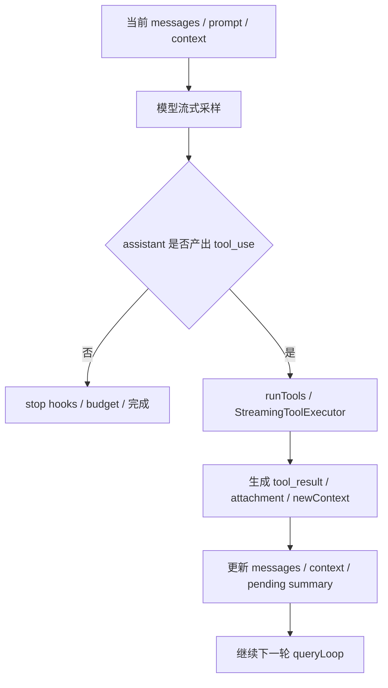

# Claude Code 源码共读笔记 39：query(...) 是怎么驱动模型、工具、消息主循环的

## 这篇看什么

上一篇刚把主线程入口收住：

> `QueryEngine.submitMessage(...)` 是一次用户请求进入 Claude Code runtime 主链路的总入口。

但那个结论只回答了“**从哪里进来**”。

再往下最自然的问题就是：

> **进来以后，这条主链到底是怎么跑起来的？**

也就是：

- 模型什么时候开始采样
- tool_use 是怎么被接住的
- tool_result 为什么能和 tool_use 严丝合缝地配对
- 一轮结束和继续下一轮的边界到底在哪里
- Claude Code 为什么能把“模型输出”和“工具执行”串成一个稳定的循环，而不是一堆松散事件

这次我主要回看了：

- `src/query.ts`
- `src/services/tools/toolOrchestration.ts`
- `src/utils/queryHelpers.ts`

看完之后，我现在会把 `query(...)` 的角色压成一句很清楚的话：

> **`query(...)` 不是一次单发模型调用，而是 Claude Code 主线程 runtime 里真正负责“模型采样 → 识别 tool_use → 执行工具 → 追加 tool_result → 再次采样”这条闭环的主循环。**

如果再压缩一点，就是：

> **`QueryEngine` 决定一轮请求怎么进入系统，`query(...)` 决定这一轮在系统里怎么活。**

我觉得这是理解主链路最关键的一步。

---

## 先给主结论

### 1. `query(...)` 的本质不是“发请求”，而是“持续推进直到没有 follow-up 为止”

这是这篇最该先立住的一点。

如果只看 `deps.callModel(...)` 那块，很容易觉得 `query(...)` 就是对模型流式 API 的一层包装。

但顺着 `queryLoop(...)` 往下看，很明显它真正干的是：

1. 准备本轮要送给模型的消息和 system prompt
2. 调模型流式采样
3. 从 assistant 输出里抓 tool_use
4. 执行工具，拿到 tool_result
5. 把 tool_result 再塞回消息流
6. 判断是否还需要 follow-up
7. 如果需要，就带着更新后的 messages/context 继续下一轮
8. 如果不需要，再去跑 stop hooks / token budget / 完成收口

所以 `query(...)` 的执行单位不是“一次 API call”，而是：

> **一个会不断自我续转的闭环回合。**

### 2. 它的核心判断不是 stop_reason，而是“这轮 assistant 有没有产出 tool_use”

源码里有个很关键的注释：

- `stop_reason === 'tool_use' is unreliable`

这句话特别说明问题。

Claude Code 没把循环推进寄托在 API 给的某个漂亮字段上，而是自己在 streaming 过程中做了更可靠的判断：

- assistant message 里有没有 `tool_use` block
- 如果有，就 `needsFollowUp = true`
- 如果没有，才有资格进入“结束这轮”的判断分支

也就是说，这个主循环真正依赖的是：

> **消息内容事实，而不是供应商 stop_reason 的语义承诺。**

这个设计很工程化，也很稳。

### 3. `query(...)` 真正维持的是“三段式循环”

我现在会把整条主循环拆成三段：

1. **采样段**：把当前 messages + prompt 送给模型
2. **工具段**：把模型产出的 tool_use 执行掉
3. **续转段**：把 tool_result 接回 messages，决定要不要继续下一轮

这三段连起来，就是 Claude Code 主线程最核心的运行闭环：

我觉得这个图特别重要。

因为它说明了 Claude Code 不是：

- 模型说一句
- 工具回一句
- 拼命补胶水

而是从架构上就把“模型-工具-消息”做成了一条循环主干。

---

## 第一层：`query(...)` 只是壳，真正的主循环在 `queryLoop(...)`

这层虽然简单，但特别值得先讲清。

导出的 `query(...)` 本身很薄：

- 建一个 `consumedCommandUuids`
- `yield* queryLoop(...)`
- 正常返回时补发 command completed lifecycle

真正的重活都在 `queryLoop(...)`。

这说明源码作者其实已经把“外部 generator 接口”和“内部循环主干”做了拆分：

- `query(...)`：对外接口
- `queryLoop(...)`：内部状态机/主循环

### 这个拆分的意义

它让外层还能处理一些 generator 生命周期相关的收尾，而不会把 queryLoop 搞得更杂。

所以从结构上看，`queryLoop(...)` 才是真正该读的那一层。

---

## 第二层：主循环不是纯函数，而是围绕一个可续转的 `State` 反复推进

`queryLoop(...)` 很关键的一点是，它没有把所有变量散着写，而是维护了一个跨迭代 `state`：

- `messages`
- `toolUseContext`
- `maxOutputTokensOverride`
- `autoCompactTracking`
- `stopHookActive`
- `maxOutputTokensRecoveryCount`
- `hasAttemptedReactiveCompact`
- `turnCount`
- `pendingToolUseSummary`
- `transition`

然后在 `while (true)` 每轮开始时再解构出来。

### 这说明 queryLoop 本质上是一个显式状态机

这一点我觉得特别值。

很多看起来“长得乱”的 runtime loop，本质问题是没有显式 state，只能靠一堆临时变量和嵌套 if 撑着。

而这里其实已经比较清楚：

> **每一轮 queryLoop 都是在读取旧状态、做一次推进、然后决定下一个状态是什么。**

这就是状态机思路。

### 所以 `continue` 在这里不是“回到 while 顶部”这么简单

在这份代码里，很多 `continue` 前都会先：

- 重建 `state = { ... }`

这说明每一次 continue 都代表一次**有原因的状态迁移**，比如：

- compact 后重试
- reactive compact 后重试
- fallback model 后重试
- max output tokens 恢复后重试
- stop hook blocking 后重试
- token budget continuation 后重试

所以它不是朴素循环，而是：

> **一组带 transition reason 的可恢复主循环。**

---

## 第三层：每轮真正送给模型的不是原始 messages，而是“处理过的 query 视图”

这是主循环里非常容易漏掉，但特别重要的一层。

每轮开始，并不是直接拿 `state.messages` 去调模型，而是会先生成：

- `messagesForQuery`

它至少会经过这些处理：

- `getMessagesAfterCompactBoundary(...)`
- `applyToolResultBudget(...)`
- `snipCompactIfNeeded(...)`
- `microcompact(...)`
- `contextCollapse.applyCollapsesIfNeeded(...)`
- `autocompact(...)`

也就是说，真正送进模型上下文的，其实是：

> **当前会话消息的一个 runtime 投影视图。**

### 这点很关键

因为它说明 Claude Code 的 query 主循环不是“把 transcript 原封不动发回模型”。

它会在每轮采样前，先对上下文做一层很重的整理：

- 裁剪
- 替换
- 压缩
- collapse
- compact

所以模型看到的是“当前最适合继续工作的上下文版本”，不是“人眼看到的全部历史原貌”。

### 这也是 queryLoop 真正拥有上下文治理权的证据

这点和上一篇对 QueryEngine 的判断能接起来：

- QueryEngine 治理整轮 turn 生命周期
- queryLoop 治理“本轮真正送进模型的上下文视图”

两者刚好咬上。

---

## 第四层：模型流式采样阶段，queryLoop 一边收消息，一边实时判断这轮要不要续转

进入 `deps.callModel(...)` 之后，才算真正开始采样。

但这里也不是单纯“yield 模型流”这么轻。

循环里会持续做几件事：

- 收集 `assistantMessages`
- 收集 `toolUseBlocks`
- 一旦看到 tool_use，就把 `needsFollowUp = true`
- 在 streaming tool execution 开启时，把 tool block 交给 `StreamingToolExecutor`
- 处理 fallback / tombstone / withheld errors / cache edit boundary 等特殊逻辑

### 这说明 queryLoop 在采样阶段就已经开始“读懂输出”了

它不是等模型吐完一整轮，再统一分析。

而是边流边做判断：

- 这是不是 tool_use
- 这轮是不是得继续
- 这条消息要不要暂时 withheld
- fallback 后前面那些半残 assistant message 要不要 tombstone

所以这里真正做的是：

> **边采样，边把原始流转成运行时可继续推进的结构化状态。**

### `needsFollowUp` 是整个循环的关键闸门

我觉得整个 queryLoop 的第一关键布尔值就是它：

- 有 tool_use → `needsFollowUp = true`
- 没 tool_use → 进入结束分支

这比 stop_reason 更核心。

因为 Claude Code 要决定的不是“API 说没说结束”，而是：

> **当前 assistant 输出有没有把工作委托给工具。**

只要委托了，就不能算这轮完成。

---

## 第五层：tool_use 不是散着跑的，`runTools(...)` 会先分批，再决定并发还是串行

这层是我这次觉得特别漂亮的地方。

工具执行不是一个个硬跑，而是走：

- `runTools(...)`
- `partitionToolCalls(...)`

### 它先问的是：这些 tool call 能不能安全并发？

`partitionToolCalls(...)` 会按每个 tool 的：

- `inputSchema.safeParse(...)`
- `tool.isConcurrencySafe(parsedInput)`

来决定分组。

最后得到的是两类 batch：

1. **单个非并发安全工具**
2. **一批连续的并发安全工具**

这个设计非常成熟。

它不是傻乎乎地：

- 全串行，保守但慢
- 全并发，快但容易炸

而是：

> **按工具语义决定局部并发。**

### 所以 Claude Code 的工具执行主张不是“并发优先”，而是“语义安全优先”

我觉得这点很值得写出来。

因为很多系统一讲并发就停在“为了快”。

但这里更像是：

- 能安全并发的读类操作一起跑
- 不能安全并发的写类或有副作用操作单独跑

这说明运行时在保护的是：

- 文件状态一致性
- 上下文更新顺序
- tool result 配对稳定性

不是单纯追吞吐量。

---

## 第六层：并发工具即使一起跑，context 更新也不会乱写

这是 `runTools(...)` 里一个特别关键但容易忽略的细节。

对于并发安全 batch：

- 工具结果可以并发产生
- 但 `contextModifier` 不会立刻乱改全局 context
- 它会先按 `toolUseID` 收集到 `queuedContextModifiers`
- 等这一批结果都回来后，再按 block 顺序应用 modifier

这个设计很值。

### 它解决了一个经典问题：并发执行，但上下文变更仍然有序

如果并发工具一边跑一边直接改 shared context，很容易出问题：

- 改动顺序不稳定
- 同一轮结果不可复现
- 某些工具依赖 context 的后续值会飘

Claude Code 的解法是：

> **结果可以并发，context mutation 仍然顺序提交。**

这其实很像数据库里把“执行”和“提交”拆开。

我觉得这点特别成熟。

### 串行 batch 则直接沿着 currentContext 往下传

对非并发安全工具，`runToolsSerially(...)` 很直接：

- 一个个执行
- 每次如果有 `contextModifier` 就立刻更新 `currentContext`
- 再跑下一个

也就是说：

- 并发 batch：并发执行，顺序提交 context
- 串行 batch：顺序执行，顺序提交 context

这两条都很清楚。

---

## 第七层：Claude Code 特别在意 tool_use 和 tool_result 必须成对出现

这次读 query 相关代码，一个反复出现的主题就是：

> **不要让 tool_use 孤儿化。**

你会在很多地方看到这个执念：

- fallback 时 tombstone 半残 assistant message
- 失败时 `yieldMissingToolResultBlocks(...)`
- 中断时也要补 synthetic tool_result
- `queryHelpers.ts` 里先把 assistant tool_use 写入 messages，再执行工具
- 注释里多次提到否则 API 会因为 duplicate / orphaned tool_use_id 报错

### 这其实是整个消息循环成立的基础约束

因为 Claude / SDK 这套消息格式不是“tool_call event”那种松散事件流，而是：

- assistant message 里有 `tool_use`
- user message 里有对应 `tool_result`

如果这两者配不齐，后面会出很多灾难：

- resume 出错
- normalizeMessagesForAPI 出错
- tool_use id 重复
- orphaned result / orphaned call
- 下轮 API 调用直接 400

所以你可以把它理解成 queryLoop 的底层不变量：

> **每个 tool_use 最终都要有一个可配对的 tool_result。**

### 这也是为什么它宁可补 synthetic result，也不愿留悬空调用

这背后不是 UI 需要，而是 runtime 自保。

不把这条约束守住，整个多轮工具循环就不稳定了。

---

## 第八层：当没有 tool_use 需要继续时，queryLoop 才真正进入“结束判定阶段”

很多人会把“模型吐完内容”理解成一轮结束。

但在 queryLoop 里，不是这样。

只有在：

- `!needsFollowUp`

成立后，系统才会进入一大段结束判定：

- prompt-too-long recovery
- reactive compact
- max output tokens escalation/recovery
- API error surface
- stop hooks
- token budget continuation
- completed return

这说明“没有 tool_use”只是：

> **可以开始判断这轮是否结束**

而不是：

> **已经结束**

### 这一层很重要

因为它表明 Claude Code 的结束条件不是单一的。

至少还要看：

- 有没有 recoverable error
- stop hooks 有没有阻止继续
- token budget 要不要自动 nudging continuation

所以真正的轮次边界，其实是：

> **模型这轮不再要求工具，并且 runtime 的后处理也同意收口。**

这比“assistant 说完了”细得多，也更接近真实执行系统。

---

## 第九层：所以 `query(...)` 真正像一个“可恢复的回合驱动器”

如果把这篇所有点收起来，我现在最想保住的不是“它会调模型和工具”，而是这个：

> **`query(...)` 是一个带恢复能力、带上下文治理、带工具编排、带结束判定的回合驱动器。**

它驱动的不是单次 completion，而是整条：

- 当前上下文视图
- 当前模型调用
- 当前工具批次
- 当前状态迁移
- 下一轮继续还是收口

这才是 `query(...)` 在 Claude Code 架构里的真实位置。

---

## 我现在对 `query(...)` 的一句话定义

如果只留一句最短的话，我会留：

> **`query(...)` 是 Claude Code 主线程里真正驱动“模型采样 → tool_use → 工具执行 → tool_result 回流 → 下一轮续转/收口”闭环的主循环。**

这里最想保住的是四个词：

- **驱动**
- **闭环**
- **续转**
- **收口**

因为这四个词正好对应它最核心的职责。

---

## 这篇最值得记住的几个判断

### 判断 1：`query(...)` 的执行单位不是一次模型 API 调用，而是一个会根据状态不断续转的 runtime 回合

### 判断 2：循环继续与否的核心依据不是 `stop_reason`，而是 assistant 输出里是否真实出现了 `tool_use`

### 判断 3：每轮送进模型的其实是 `messagesForQuery` 这个 runtime 视图，而不是原始 transcript 的机械回放

### 判断 4：工具执行不是简单串跑，而是先按 `isConcurrencySafe(...)` 分批，再决定并发执行还是串行执行

### 判断 5：Claude Code 极度在意 `tool_use` / `tool_result` 成对，这是整个多轮消息-工具循环稳定成立的底层约束

### 判断 6：没有 tool_use 之后也不代表立刻结束，还要经过 recover、hooks、budget 等后处理判定，才能真正收口

---

## 下一步最顺怎么接

现在主链其实已经拆出两层了：

- 第 38 篇：`QueryEngine.submitMessage(...)` 是主线程入口
- 第 39 篇：`query(...)` 是主线程闭环驱动器

再往下最顺的，我觉得有两个分支都很自然：

### 方向 A：拆输入前处理
**`processUserInput(...)` 是怎么把 slash command、attachment、普通文本分流掉的**

### 方向 B：拆消息和上下文约束
**Claude Code 为什么这么执着于 tool_use/tool_result pairing、compact boundary 和 message normalization**

如果只选一个，我会更倾向 **方向 A**。

因为这样顺序会更完整：

1. 输入怎么进来
2. QueryEngine 怎么接住
3. query(...) 怎么跑起来

到这时，主线程主链就真的闭了一圈。