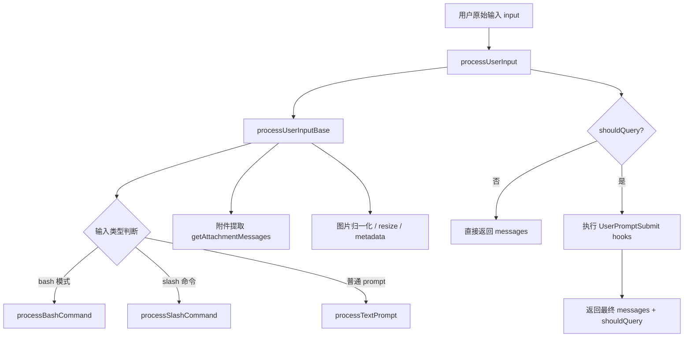

# Claude Code 源码共读笔记 40：processUserInput(...) 是怎么分流 slash、attachment 和普通文本的

## 这篇看什么

前两篇主链路已经把两个关键层位收住了：

- 第 38 篇：`QueryEngine.submitMessage(...)` 是一次用户请求进入主线程 runtime 的总入口
- 第 39 篇：`query(...)` 是真正驱动“模型采样 → 工具执行 → 消息续转”的闭环主循环

但这两篇中间其实还夹着一个非常关键的入口层：

> **用户输入在真正进入 query 之前，是怎么先被拆型、分流、补附件、决定要不要 query 的？**

这个问题如果不看，很容易误以为 Claude Code 的输入链路是：

- 用户输一段文字
- 直接转成一条 user message
- 然后丢进 query

但源码里明显不是这样。

这次我主要回看了：

- `src/utils/processUserInput/processUserInput.ts`
- `src/utils/processUserInput/processSlashCommand.tsx`
- `src/utils/processUserInput/processTextPrompt.ts`

看完之后，我现在会把 `processUserInput(...)` 的角色压成一句很清楚的话：

> **`processUserInput(...)` 不是单纯把输入包成 message，而是 Claude Code 主线程在 query 前的输入路由层。**

它真正做的是：

- 先把输入规范化
- 处理图片和 pasted contents
- 决定是否提取 attachment
- 判断这是 bash、slash 还是普通 prompt
- 再把它们分流到不同子链路
- 最后返回一组 messages + `shouldQuery`，交给上层决定是否进入 query

所以这篇如果只留一句最短的话，我会留：

> **`processUserInput(...)` 负责把“用户原始输入”转换成“Claude Code 可执行的输入类型”。**

---

## 先给主结论

### 1. `processUserInput(...)` 的核心产物不是 message，而是“分流结果”

这一点很重要。

因为它的返回值不是简单的一条 user message，而是：

- `messages`
- `shouldQuery`
- 有时还会带 `allowedTools` / `model` / `resultText` / `nextInput`

这说明它关心的不是“消息长什么样”，而是：

> **这次输入经过处理后，系统下一步到底该不该进入 query，以及该带什么运行时副产物过去。**

也就是说，`processUserInput(...)` 的输出单位更像：

- 输入处理决议

而不是：

- 单个消息对象

### 2. 它把输入处理拆成了两段：base 分流 + hook 审核

源码结构很清楚：

- `processUserInput(...)`
  - 先调 `processUserInputBase(...)`
  - 如果 `shouldQuery === false`，直接返回
  - 如果 `shouldQuery === true`，再跑 `UserPromptSubmit hooks`

这说明 Claude Code 的输入链路不是一锅炖，而是两层：

1. **先判定输入属于哪条处理路径**
2. **只有真的要 query 时，才让 hooks 介入做最后一层拦截/补上下文**

这个拆法我觉得非常合理。

因为很多 slash/local 命令本来就不该进入模型，没必要还去跑 user-prompt hooks。

### 3. `processUserInputBase(...)` 才是真正的输入路由器

如果只看职责，真正“像路由器”的不是外层 `processUserInput(...)`，而是里面的 `processUserInputBase(...)`。

它要做的核心判断基本就是：

- 输入是不是 string 还是 content blocks
- 有无 pasted images / image blocks
- 是否桥接来源（bridgeOrigin）
- 是否要跳过 slash command
- 是否命中 ultraplan keyword
- 是否需要提 attachment
- 最后该走 bash / slash / regular prompt 哪条支路

所以这篇的重心，实际上就是读懂 `processUserInputBase(...)` 这层分流。

---

## 先把总图立住：主线程输入进入 query 之前的分流长什么样

这个图最关键的一点是：

> **输入不是直接进 query，而是先被转换成一份“经过分流和补料的消息决议”。**

这一步其实就是主线程输入链的预处理层。

---

## 第一层：它先做的不是命令判断，而是输入规范化

这点非常容易被忽略。

`processUserInputBase(...)` 一上来先做的不是判断 `/xxx`，而是把输入尽量整理成统一形态：

- `inputString`
- `precedingInputBlocks`
- `normalizedInput`
- `imageMetadataTexts`

如果 `input` 不是 string，而是一组 `ContentBlockParam[]`，它会先：

- 遍历 image block
- 做 `maybeResizeAndDownsampleImageBlock(...)`
- 收集尺寸等 metadata
- 保留最后一个 text block 作为 `inputString`
- 其余 block 放进 `precedingInputBlocks`

### 这说明 Claude Code 的输入从一开始就不是“纯文本中心”

这一点很关键。

它早就接受了主线程输入可能是：

- 纯文本
- 文本 + 图片 block
- pasted image
- IDE selection 注入后的 block 组合

所以 `processUserInputBase(...)` 的第一职责不是“读命令”，而是：

> **把多模态/多来源输入先归一化。**

### `normalizedInput` 这个变量特别说明问题

它的注释写得很直白：

- 处理后的 image block 要真正传给 `processTextPrompt`
- 否则 resize 工作就白做了

这个细节说明这层归一化不是表面清洗，而是真正会影响后面 API 输入内容。

---

## 第二层：pasted 图片并不是顺手塞进去，而是有一整套预处理链

这次我觉得特别值得单独提的是图片这条线。

源码里对 pasted image 做了不少事：

- 从 `pastedContents` 里筛选图片
- 记录 `imagePasteIds`
- `storeImages(...)` 把图先落盘
- `maybeResizeAndDownsampleImageBlock(...)` 并行缩放
- 收集尺寸 / sourcePath metadata
- 生成 `imageContentBlocks`
- 最后还会把 image metadata 作为 `isMeta` user message 附到结果里

### 这说明 Claude Code 处理图片不是“给模型看看图”这么简单

它还在考虑：

- API 限制
- CLI 工具后续可能要引用图片路径
- 上下文里要保留图像尺寸/来源信息

也就是说，图片输入在这条链里被当成：

> **既要给模型看，也要给后续工具链引用的正式输入材料。**

### 这也是为什么 image metadata 最后会被补成 `isMeta` message

这个设计挺妙。

因为图片尺寸、路径这种信息：

- 对模型有帮助
- 但不该伪装成用户真的说出来的话

所以它被放进：

- `createUserMessage({ isMeta: true })`

这说明 Claude Code 在输入语义上分得很细：

- 用户真说的话
- 系统为理解输入补充的元信息

是两类东西。

---

## 第三层：attachment 提取不是总会发生，而是取决于当前分支

这是这篇里我觉得很值的一点。

`processUserInputBase(...)` 不是无脑总去跑 `getAttachmentMessages(...)`，而是先算：

- `shouldExtractAttachments`

条件大致是：

- 不是 `skipAttachments`
- `inputString !== null`
- 且满足当前模式允许提前抽 attachment

特别关键的一句注释是：

> **对于 slash commands，attachments 会在 `getMessagesForSlashCommand` 里面提取。**

这句话很重要。

### 也就是说，attachment 的提取位置和输入路径绑定

不是所有输入都在同一个时机抽 attachment：

- 普通 prompt：在 `processUserInputBase` 这里抽
- slash prompt command：会在 skill/prompt 内容生成后再抽

这个区别非常关键。

因为 skill 的 prompt 正文本身也可能包含：

- `@` 提及
- MCP 资源
- agent mention

如果在 slash 外层就提前抽，只能看到 `/command args`，看不到 skill 展开后的正文，自然也抽不全。

所以这里的设计其实是在说：

> **attachment 提取不是基于“用户敲了什么”，而是基于“最终要送进模型的文本内容是什么”。**

我觉得这点特别成熟。

---

## 第四层：真正的分流判断顺序是 ultraplan → bash → slash → regular prompt

很多人会以为它先判断 slash，再判断别的。

其实顺序更细。

### 先有一个特殊重写：ultraplan keyword

如果命中特定条件：

- feature 开启
- 交互模式
- 非 `/` 开头
- 当前没在 ultraplan session
- 命中 keyword

它会直接把输入重写成：

- `/ultraplan ...`

然后走 `processSlashCommand(...)`。

这说明有些“普通文本输入”其实会在输入层被重写成命令路径。

### 然后才分 bash / slash / regular prompt

后面的顺序是：

1. `mode === 'bash'` → `processBashCommand(...)`
2. 以 `/` 开头且不跳过 slash → `processSlashCommand(...)`
3. 否则走 `processTextPrompt(...)`

这个顺序说明 `processUserInputBase(...)` 的思路不是“文本长什么样”，而是：

> **这份输入应该落到哪类执行语义里。**

---

## 第五层：slash command 这条支路，内部其实又分三种完全不同的命运

`processSlashCommand(...)` 看起来像一个函数，但往里看其实很分裂。

它至少分三类：

1. **`local-jsx`**
2. **`local`**
3. **`prompt`**

我觉得这是这篇最值得讲清的地方之一。

### A. `local-jsx`：这是本地 UI 命令，不一定进模型

这类命令会：

- `command.load()`
- 调 `mod.call(onDone, context, args)`
- 可能直接 `setToolJSX(...)` 弹出本地 UI
- 通常 `shouldQuery: false`

也就是说，这类 slash 本质上不是“给模型的 prompt”，而是：

> **本地交互命令。**

所以它和 skill 根本不是一条路。

### B. `local`：这是本地执行命令，结果写回 transcript，但也不一定进 query

这类命令会：

- 执行本地函数
- 返回 text / compact / skip 等结果
- 常见情况 `shouldQuery: false`

比如 compact 结果甚至会直接构造 post-compact messages。

也就是说，这类 slash 是：

> **在 query 前就本地执行完的命令式操作。**

### C. `prompt`：这才是最接近 skill / prompt 注入的那条线

这类命令要么：

- `context === 'fork'` → 走 forked sub-agent
- 否则 → `getMessagesForPromptSlashCommand(...)`

这时候才会真正去拿：

- `command.getPromptForCommand(args, context)`
- `allowedTools`
- `model`
- `effort`

然后构造一组 message，并且通常：

- `shouldQuery: true`

也就是说，真正会把 slash 转成模型继续工作的，主要是这一类 prompt/skill 命令。

### 这一层的结论很重要

所以 slash command 不是单一路径，而是一个大门牌，里面其实有三套语义：

- **本地 UI**
- **本地执行**
- **prompt/skill 注入**

这也是为什么只说“slash command 会被特殊处理”是不够的。

---

## 第六层：prompt 型 slash command 的本质，是把命令展开成一组 meta-visible 的消息

`getMessagesForPromptSlashCommand(...)` 这条线，我觉得和前面 skill 篇能直接接起来。

它做的关键事包括：

- 调 `command.getPromptForCommand(...)` 拿到正文
- 注册 skill hooks（如果允许）
- 记录 invoked skill，供 compaction preservation
- 解析 `allowedTools`
- 构造命令 loading metadata
- 把正文作为 `isMeta: true` 的 user message 塞进去
- 再加 `command_permissions` attachment message

### 这说明 prompt skill 的执行不是“把技能文档贴给用户”，而是“把技能正文注入模型上下文”

这个结论和前几篇是完全一致的。

也就是说，slash prompt/skill 这条路的核心产物是：

- 一组模型可见、用户不一定同权可见的运行时消息

而不是普通文本回显。

### 还有个特别关键的细节：attachment 会在 skill 正文出来之后再抽

这点前面提过，但这里更明显。

`getMessagesForPromptSlashCommand(...)` 会基于 skill 结果文本再跑：

- `getAttachmentMessages(..., { skipSkillDiscovery: true })`

这很说明问题：

> **对于 prompt/skill，真正重要的是“展开后的内容里有什么附件/引用线索”，不是用户敲的命令字面量。**

而且它还特地 `skipSkillDiscovery: true`，避免 skill 正文本身再次触发 discovery。

这个 guard 很工程化。

---

## 第七层：普通文本路径其实很薄，但它承担了“最终把输入变成标准 user message”的职责

对比 slash 那条复杂分流，`processTextPrompt(...)` 非常干净。

它基本做三件事：

1. 建 `promptId`
2. 打 tracing / telemetry
3. 构造 `createUserMessage(...)` + 拼上 attachment messages

如果有 pasted images：

- 文本放前面
- 图片 block 放后面
- 一起进同一条 user message

如果没有：

- 就直接把 `input` 做成 user message

### 所以普通文本路径的本质不是“简单”，而是“已经在前面被简化完了”

这一点很值得说清。

因为真正复杂的事：

- 输入归一化
- 图片处理
- attachment 抽取
- slash/badsh 分流

都已经在 `processUserInputBase(...)` 里做过了。

所以到了 `processTextPrompt(...)`，剩下的工作自然就只需要：

> **把归一化后的输入，铸造成标准 user message。**

这也说明函数边界其实切得不错。

---

## 第八层：`shouldQuery` 才是这层输入路由最关键的控制位

我觉得这一层必须单独讲。

因为从整个主线程链路看，`processUserInput(...)` 最重要的产物其实不是 `messages`，而是：

- `shouldQuery`

### 为什么它这么关键

因为它决定了这次输入后面是两种完全不同的命运：

#### 路径 A：`shouldQuery = false`
说明：
- 这是本地命令
- 或者已经在输入层被消费掉
- 或者被 hook/blocking/bridge 逻辑拦下了

此时上层不会进入 query 主循环。

#### 路径 B：`shouldQuery = true`
说明：
- 这份输入已经被整理成模型可继续工作的 messages
- 上层随后还会跑 `UserPromptSubmit hooks`
- 最终才进入 query

所以这一个布尔值，实际上是：

> **“输入处理层”和“模型运行层”之间的闸门。**

我觉得这个判断特别重要。

因为它说明 Claude Code 并不是“所有输入最后都喂模型”，而是有明确的 query gate。

---

## 第九层：外层 hooks 说明输入路由之后，还有一层“是否允许继续”的审核层

最后再补一层外面的 `processUserInput(...)`。

它在 `processUserInputBase(...)` 之后，只做一件大事：

- 如果 `result.shouldQuery` 为真，执行 `executeUserPromptSubmitHooks(...)`

然后 hooks 可能：

- 直接 blocking
- preventContinuation
- 补 additionalContexts
- 追加 hook message

### 这说明输入路由完成，不等于立刻进入 query

中间还夹着一层：

> **用户 prompt 提交审核层。**

所以更完整的理解应该是：

1. `processUserInputBase(...)` 决定输入属于哪类语义
2. `processUserInput(...)` 再决定这份可 query 的输入是否允许继续进入 query

这比只说“processUserInput 会分流”更完整。

---

## 我现在对 `processUserInput(...)` 的一句话定义

如果只留一句最短的话，我会留：

> **`processUserInput(...)` 是 Claude Code 主线程在 query 前的输入路由层：先归一化输入，再按 bash / slash / 普通 prompt 分流，补齐 attachment 和 meta 信息，最后用 `shouldQuery` 决定是否把这次输入真正送进模型。**

这句话里最想保住的是四个词：

- **输入路由层**
- **归一化**
- **分流**
- **shouldQuery 闸门**

因为这四个词正好对应它在主链里的真实位置。

---

## 这篇最值得记住的几个判断

### 判断 1：`processUserInput(...)` 的核心产物不是单条 message，而是一份输入处理决议：messages + `shouldQuery` + 运行时附加信息

### 判断 2：真正的输入路由器是 `processUserInputBase(...)`，外层 `processUserInput(...)` 则是在路由后追加 hooks 审核层

### 判断 3：Claude Code 的输入从一开始就不是纯文本中心，而是先支持 content blocks、图片、pasted contents、bridge 输入的统一归一化

### 判断 4：attachment 提取不是固定时机统一处理，而是跟输入路径绑定；对 prompt/skill 来说，很多 attachment 要等 skill 正文展开后再抽

### 判断 5：slash command 不是单一路径，而是至少分成 `local-jsx`、`local`、`prompt` 三种完全不同的执行语义

### 判断 6：`shouldQuery` 是输入处理层和模型运行层之间最关键的闸门，不是所有用户输入最终都会进入 query

---

## 下一步最顺怎么接

现在主线程主链其实已经补得很完整了：

- 第 38 篇：`QueryEngine.submitMessage(...)` 是入口
- 第 39 篇：`query(...)` 是闭环驱动器
- 第 40 篇：`processUserInput(...)` 是 query 前输入路由层

接下来我觉得有两个方向都很顺：

### 方向 A：继续拆 attachment
**`getAttachmentMessages(...)` 是怎么把文件、agent mention、MCP 资源、上下文 reminder 抽出来的**

### 方向 B：继续拆 prompt 组装
**system prompt / userContext / systemContext 到底是怎么一起并进请求的**

如果只选一个，我会更倾向 **方向 A**。

因为 `processUserInput(...)` 里 attachment 其实已经反复出现了，但我们还没把它单独拆透。