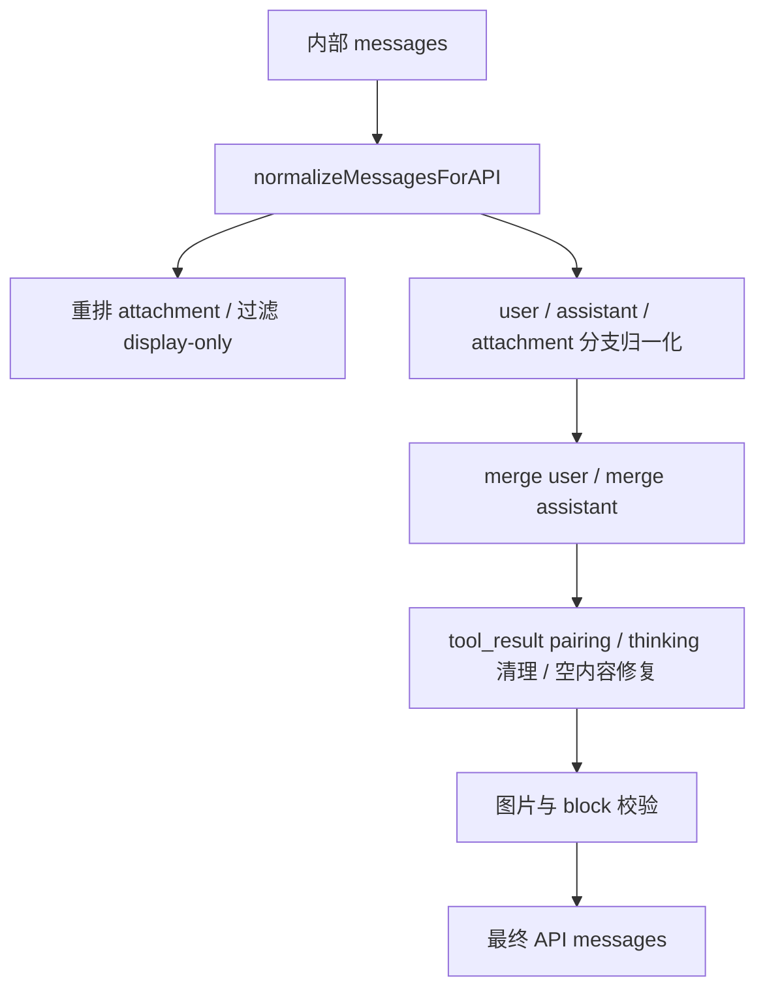

# Claude Code 源码共读笔记 42：messages.ts 是怎么把消息规范化成 API 请求的

## 这篇看什么

前面几篇其实已经把主线程输入侧拆得很完整了：

- `QueryEngine.submitMessage(...)` 是入口
- `query(...)` 是闭环驱动器
- `processUserInput(...)` 是输入路由层
- `getAttachmentMessages(...)` 是结构化上下文注入层

但这几层看完之后，还差最后一个非常关键的收口问题：

> **这些 user / assistant / attachment / tool result / system reminder，最后到底是怎么被整理成一份能真正发给 API 的消息序列的？**

这个问题如果不看，很容易误以为：

- 内部 transcript 长什么样
- 发给 API 的就差不多也长什么样

但源码里明显不是这样。

这次我主要回看了：

- `src/utils/messages.ts`
- `src/query.ts` 里调用它的地方

看完之后，我现在会把 `messages.ts` 在这条链里的角色压成一句很清楚的话：

> **`messages.ts` 不是一个普通的消息工具箱，它更像 Claude Code 在“内部消息世界”和“API 可接受消息世界”之间的归一化边界层。**

最核心的函数就是：

- `normalizeMessagesForAPI(messages, tools)`

它要做的不是简单格式转换，而是：

- 重排消息顺序
- 过滤 display-only / 不该出现在 API 里的消息
- 把 attachment 翻译成 meta/system reminder user messages
- 合并连续 user/assistant 消息
- 规范 tool_use / tool_result 结构
- 修复或剔除会导致 API 报错的坏消息形态
- 保证最终 payload 尽量符合供应商对 role alternation、tool pairing、content shape 的严格要求

所以这篇如果只留一句最短的话，我会留：

> **`normalizeMessagesForAPI(...)` 是 Claude Code 发送请求前的最后一道消息清洗与结构修复层。**

---

## 先给主结论

### 1. Claude Code 内部持有的消息，不等于可以直接发给 API 的消息

这是这篇最该先立住的一点。

内部 transcript 里有很多东西对运行时很有用，但对 API 不一定合法：

- virtual messages
- progress
- 某些 system message
- attachment messages
- thinking-only 残片
- orphan tool_result
- duplicate tool_use id
- 图片/文档过大时残留的 meta 消息

也就是说，Claude Code 内部消息流是：

> **运行时友好格式**

而供应商 API 需要的是：

> **协议友好格式**

`messages.ts` 的核心作用，就是把前者压成后者。

### 2. `normalizeMessagesForAPI(...)` 真正干的是“结构修复”，不只是“格式归一化”

我觉得这点非常值。

很多系统里 `normalize` 这个词听起来像轻量整理。

但这里其实远不止整理：

- 会 merge 消息
- 会 strip 坏 block
- 会补 synthetic tool_result
- 会清 orphan
- 会防止 role alternation 错误
- 会防止 tool_reference / image / PDF 之类的 API 400
- 会清 trailing thinking
- 会给空 assistant 补 placeholder

所以它更像：

> **消息协议修复器**

而不只是 normalizer。

### 3. attachment 体系只有经过 `messages.ts` 转译，才算真正进入模型上下文

上一篇已经看过：

- attachment 是结构化上下文对象
- `attachments.ts` 负责装配

但这篇再往下看会更清楚：

> **attachment 自己并不是 API message。**

它必须经过：

- `normalizeAttachmentForAPI(...)`
- `wrapMessagesInSystemReminder(...)`

才会变成模型真正看到的 user/meta/system reminder 内容。

所以 `messages.ts` 在架构上的位置其实非常关键：

- attachment 在这里才真正“落地成 prompt 语义”

---

## 先把总图立住：消息是怎么从内部 transcript 变成 API payload 的

这张图最关键的一点是：

> **Claude Code 发请求前不是“拿 transcript 原样上送”，而是要先过一整条消息修复流水线。**

---

## 第一层：`normalizeMessagesForAPI(...)` 一上来先做的，是把“根本不该进 API 的消息”先清掉

函数开头的几个动作其实已经很说明问题了：

- `reorderAttachmentsForAPI(messages)`
- 过滤 `isVirtual`
- 后面再统一过滤 progress / synthetic api error / 非 local-command system message

### 这说明内部消息里本来就混着很多“只服务本地 runtime/UI”的消息

比如：

- progress
- virtual assistant/user
- synthetic api error
- 普通 system message

这些在内部很有用，但如果原样送给 API：

- 要么无意义
- 要么不合法
- 要么会污染模型上下文

所以 `normalizeMessagesForAPI(...)` 的第一职责其实是：

> **划清哪些消息属于 runtime，哪些消息属于 prompt payload。**

### `reorderAttachmentsForAPI(...)` 也说明 attachment 的相对位置是敏感的

虽然这次没深拆这个函数，但从主函数注释已经能看出来：

- attachment 会先被 bubble up
- 直到撞到 tool result 或 assistant message 为止

这说明 attachment 不是想放哪就放哪。

因为在 API 语义里：

- 它最终会变成 user/meta content
- 位置不对，就可能打乱 tool_result 邻接关系或 role alternation

所以 attachment 的顺序，本身也是协议层问题。

---

## 第二层：user / assistant / attachment 在归一化时走的是三条不同逻辑

这点特别关键。

`normalizeMessagesForAPI(...)` 里虽然是一个大循环，但实际上 message type 的处理逻辑差异非常大。

### A. user message：核心是 merge、strip、smoosh 风险控制

对 user message，它做的事包括：

- 去掉无效 tool_reference
- 处理图像/PDF/request-too-large 之后残留的 meta user message block stripping
- 连续 user message merge
- 某些场景下注入 turn boundary text

这说明 user 路径的主要问题是：

> **如何把一堆系统追加的 user/meta 消息，整理成 API 能接受的少量稳定 user turn。**

### B. assistant message：核心是 tool_use 规范化与同 id merge

对 assistant message，它做的核心事是：

- 规范 `tool_use.input`
- 规范 tool name
- 去掉 tool-search 不兼容字段
- 如果同一 `message.id` 的 assistant 流片段被拆开，重新 merge 回去

这说明 assistant 路径主要面对的是：

> **流式输出碎片化**

Claude Code 在运行时可能会逐块拿到 assistant 内容，所以 API 发送前得把属于同一 assistant reply 的碎片重新拼起来。

### C. attachment message：核心是“翻译”

对 attachment message，本身不会直接发。

它会先走：

- `normalizeAttachmentForAPI(...)`

返回一组 `UserMessage[]`

然后这些 user message 再参与后面的 merge/smoosh/校验。

所以 attachment 路径的关键不在 merge，而在：

> **从结构化对象翻译成用户不可见但模型可见的 meta user content。**

这三条路径放一起看，会非常清楚：

> **`messages.ts` 不是统一平铺所有消息，而是在按消息语义分别修。**

---

## 第三层：`normalizeAttachmentForAPI(...)` 其实是 attachment → prompt 语义 的总翻译器

这一层承接上一篇特别顺。

如果上一篇说 attachment 是“结构化上下文对象”，那这一篇就可以明确说：

> **`normalizeAttachmentForAPI(...)` 是 attachment 进入模型语境前的总翻译器。**

### 它做的不是简单字符串化，而是“按 attachment 类型选择最合适的提示方式”

比如：

- `file`：不是一句“这里有个文件”，而是伪造成一对 `FileReadTool` 的 use/result 轨迹
- `directory`：伪造成 `Bash ls` 的 use/result 轨迹
- `mcp_resource`：转成 resource full contents + 不要重复读取提醒
- `agent_mention`：转成“用户表达了想调用某 agent”的 system reminder
- `skill_listing`：转成“可用 skills 列表”
- `hook_additional_context`：转成明确带来源的 reminder
- `queued_command`：转成中途排队输入/通知消息

### 这说明 attachment 的呈现策略是高度语义化的

这里特别值的一点是：

Claude Code 不是把 attachment 粗暴塞成 JSON dump，而是会问：

> **模型最应该怎么理解这个对象？**

有些适合被理解成：
- 过去已经发生过的一次工具读取

有些适合被理解成：
- 当前线程状态提醒

有些适合被理解成：
- 用户表达的意图

所以这一层的价值，不是“转换格式”，而是：

> **选择最合理的 prompt 叙事形态。**

---

## 第四层：system reminder wrapper 其实是这套消息语义的一个关键边界

`wrapInSystemReminder(...)` 和 `wrapMessagesInSystemReminder(...)` 看起来很小，但我觉得地位很高。

它们本质上在做一件事：

> **告诉模型：这不是普通用户自然语言，而是系统级补充提醒。**

### 这为什么重要

因为 attachment / hook / mode reminder / MCP instructions 这些内容，如果不加边界，很容易在模型心里和用户意图混在一起。

Claude Code 的做法是：

- 绝大多数系统补充上下文，都用 `<system-reminder>...</system-reminder>` 包起来

这其实是在给模型打标签：

- 这是要遵守/参考的系统侧信息
- 不是用户聊天口语

### 所以 `messages.ts` 在做的不只是协议修复，也在做语义标注

这一点很关键。

它不是“让 API 接收成功”就完了，
而是还在帮助模型正确区分：

- 用户原话
- 系统补充信息
- 工具轨迹
- 模式提醒

这个边界做得越稳，模型越不容易误解上下文来源。

---

## 第五层：merge 不是优化 token 那么简单，而是协议兼容的硬要求

很多人会把 merge 只理解成省 token。

这里其实不止。

### 连续 user merge
源码里直接写了：

- Bedrock 不支持多个连续 user messages
- 1P API 虽然支持，但也会 merge

所以 merge user 先是 **兼容性要求**，然后才顺带有 token/结构简化收益。

### assistant 同 id merge
assistant message 这边按 `message.id` merge，也是为了把流式碎片重组成协议上合理的一条 assistant 回复。

### attachment 产出的 user message 也会继续 merge
这一点也很有意思。

attachment 经 `normalizeAttachmentForAPI(...)` 产出后，并不会享有特权，还是会继续参与：

- `mergeUserMessages`
- `mergeUserMessagesAndToolResults`

这说明整个系统追求的不是“保留原始拆分痕迹”，而是：

> **得到一份最终对 API 最稳的消息形态。**

所以 merge 在这里的本质是：

> **消息协议整形**

而不只是省几 token。

---

## 第六层：tool_result 的位置与结构，是 `messages.ts` 最敏感的一条红线

这条线在源码里非常重。

不只是 `normalizeMessagesForAPI(...)` 本身，后面还有：

- `mergeUserMessagesAndToolResults(...)`
- `hoistToolResults(...)`
- `smooshSystemReminderSiblings(...)`
- `sanitizeErrorToolResultContent(...)`
- `ensureToolResultPairing(...)`

这一大串都在围着 tool_result 打补丁。

### 这说明什么

说明 Claude Code 运行时里最脆弱、最容易把 API 弄炸的，就是：

> **tool_use / tool_result 这条消息协议边界。**

### 为什么这么敏感

因为它有很多硬约束：

- 要有成对关系
- `tool_result` 不能孤儿化
- 某些 sibling text 不能放错位置
- error tool_result 内部 block 类型有限制
- 不能出现重复 `tool_result`
- 不能出现 orphan `tool_use`

所以从 `messages.ts` 的设计能直接读出一个结论：

> **Claude Code 的消息归一化，最主要是在为 tool protocol 擦屁股。**

这话虽然直，但挺接近源码现实。

---

## 第七层：`ensureToolResultPairing(...)` 已经不是 normalizer，而是 defensive repair 了

我觉得这一层特别值得单独讲。

`ensureToolResultPairing(...)` 的注释写得很直白：

- forward：给没有 result 的 tool_use 补 synthetic error tool_result
- reverse：剥掉引用不存在 tool_use 的 orphan tool_result
- strict mode 下甚至直接 throw，不做修复

### 这说明运行时作者默认承认：消息历史有时就是会坏

这是一个很成熟的姿态。

它不是假设：

- 上游一定永远正确

而是假设：

- resume、compaction、stream interruption、message merge、历史脏数据，都可能把 pairing 弄坏

所以这里干的已经不是“优雅归一化”，而是：

> **防御性修复。**

### 而且它还要同时照顾 API 的另外一个红线：role alternation

比如：

- strip orphaned tool_result 之后，如果消息空了，必要时还要补 placeholder user message
- 不然 payload 可能直接变成 assistant 后面又 assistant，API 又会 400

这点特别能说明：

> **消息修复是多约束耦合问题。**

不是修好 A 就完了，修 A 还可能破坏 B，所以必须成体系地修。

---

## 第八层：thinking / whitespace / empty content 清理，说明 API 对“看起来无害的残片”也很敏感

这几步我觉得非常有工程味：

- `filterOrphanedThinkingOnlyMessages(...)`
- `filterTrailingThinkingFromLastAssistant(...)`
- `filterWhitespaceOnlyAssistantMessages(...)`
- `ensureNonEmptyAssistantContent(...)`

### 这说明一个事实

Claude Code 不是只在意“大结构”对不对，
还在意很多很细碎的残片会不会把请求搞崩。

比如：

- 只剩 thinking 的 assistant message
- trailing thinking 被剥掉后只剩空白文本
- assistant content 被清理完之后变空数组

这些在人类看来可能不算事，
但在 API 协议层都可能变成 hard error。

所以这一层说明：

> **messages.ts 还在负责把“人眼看不出来的问题残片”清扫掉。**

---

## 第九层：`getMessagesAfterCompactBoundary(...)` 说明“发给 API 的历史”本来就是投影视图，不是完整 transcript

虽然这函数不是 `normalizeMessagesForAPI(...)` 本体，但它和这篇特别相关。

`query.ts` 在准备 `messagesForQuery` 时，会先过：

- `getMessagesAfterCompactBoundary(...)`

这说明消息归一化的输入，从一开始就已经不是“完整历史”，而是：

- compact boundary 之后的切片
- 必要时再叠加 snip projection

### 所以 `messages.ts` 处理的其实是“上下文投影”，不是“历史全文”

这点我觉得特别重要。

因为它意味着 Claude Code 整个消息系统都不是围着“忠实回放完整历史”设计的，
而是围着：

> **给下一次模型调用构造一份合法、够用、稳定的上下文投影。**

这和“聊天记录展示层”的目标完全不同。

---

## 第十层：所以 `messages.ts` 本质上是 Claude Code 的“协议边界层”

如果把上面这些点都收起来，我现在最想保住的，不是“它会 merge message”，而是：

> **`messages.ts` 是 Claude Code 内部 runtime 语义，向外部模型 API 协议收敛的那一层边界。**

这层边界同时承担三件事：

### 1. 语义翻译
- attachment → reminder / meta message
- 运行时事件 → 模型可理解的提示语义

### 2. 协议修复
- merge
- strip
- pairing
- placeholder
- sanitize

### 3. payload 整形
- role alternation
- tool result ordering
- assistant content 非空
- image/document/tool_reference 合法化

所以一句话说，它不是 utility file，
而是：

> **Claude Code 的 message protocol layer。**

---

## 我现在对 `normalizeMessagesForAPI(...)` 的一句话定义

如果只留一句最短的话，我会留：

> **`normalizeMessagesForAPI(...)` 是 Claude Code 在真正发起模型请求前的消息协议边界层：它把内部 transcript、attachment 和工具轨迹，整理、翻译并修复成一份 API 可接受的稳定消息序列。**

这句话里最想保住的是六个词：

- **消息协议边界层**
- **整理**
- **翻译**
- **修复**
- **稳定**
- **API 可接受**

因为这六个词几乎就是这段源码的全部价值。

---

## 这篇最值得记住的几个判断

### 判断 1：Claude Code 内部消息流和最终发送给 API 的消息流不是同一种东西，`messages.ts` 就是它们之间的边界层

### 判断 2：`normalizeMessagesForAPI(...)` 不是轻量格式转换，而是一条包含重排、过滤、翻译、merge、修复、校验的完整协议整形流水线

### 判断 3：attachment 只有经过 `normalizeAttachmentForAPI(...)` 和 system reminder 包装之后，才真正变成模型能消费的 prompt 语义

### 判断 4：merge user/assistant 消息不只是省 token，更是适配供应商 API 和流式碎片化输出的硬兼容要求

### 判断 5：tool_use / tool_result pairing 是整套消息归一化里最敏感的一条红线，`ensureToolResultPairing(...)` 已经属于防御性修复，不只是正常整理

### 判断 6：thinking、whitespace、empty assistant content 这些人眼看起来无伤大雅的残片，在 API 协议层都可能致命，因此 `messages.ts` 必须做细粒度清扫

---

## 下一步最顺怎么接

现在主线程消息链其实已经连得很顺了：

- 第 38 篇：入口
- 第 39 篇：query 主循环
- 第 40 篇：输入分流
- 第 41 篇：attachment 注入
- 第 42 篇：消息协议归一化

接下来我觉得最顺的有两个方向：

### 方向 A：回到 prompt 组装
**system prompt / userContext / systemContext / attachment 最后是怎么一起并进一次实际模型请求的**

### 方向 B：继续深挖 compact / snip
**Claude Code 是怎么把旧消息压缩、切边、投影，再继续工作的**

如果只选一个，我会更倾向 **方向 A**。

因为到这一步，输入和消息协议层已经收得差不多了，下一步回去补“最终请求长什么样”，会很成体系。