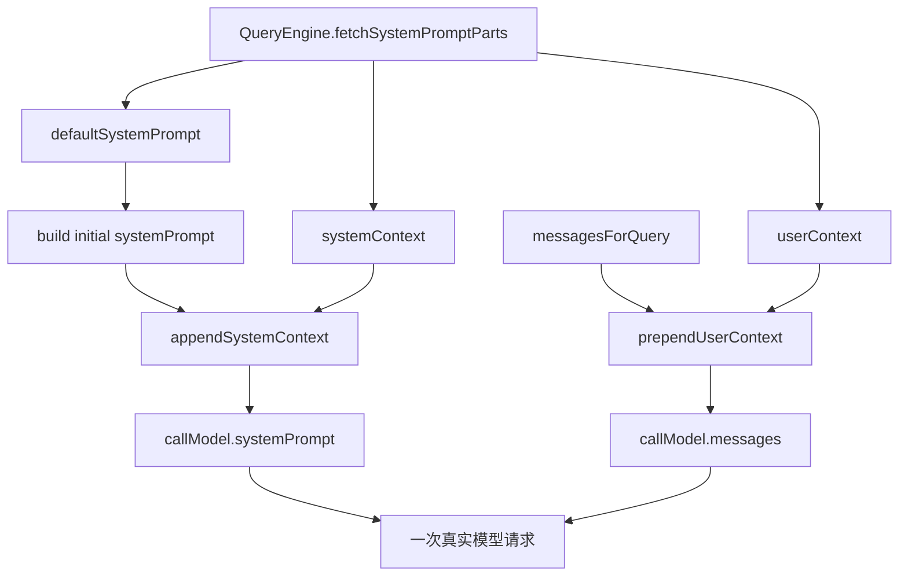

# Claude Code 源码共读笔记 43：system prompt 和 context 最后是怎么并进请求的

## 这篇看什么

前几篇其实已经把“消息侧”拆得很完整了：

- 输入怎么进来
- attachment 怎么生成
- messages.ts 怎么把内部 transcript 规范化成 API message

但到这里其实还差最后一个总装问题：

> **真正发给模型的一次请求，最终长什么样？**

也就是：

- `systemPrompt` 到底从哪几层拼出来
- `userContext` 为什么不是 system prompt 的一部分
- `systemContext` 为什么又会被 append 回 system prompt
- `messagesForQuery` 在进入 `callModel(...)` 之前还会经历哪些投影
- attachment 归一化后的消息，到底是在这张图里的哪一层

这次我主要回看了：

- `src/QueryEngine.ts`
- `src/query.ts`
- `src/utils/systemPrompt.ts`
- `src/constants/prompts.ts` 里 env details 那段

看完之后，我现在会把这条链压成一句很清楚的话：

> **Claude Code 的实际模型请求，不是“一段 system prompt + 一串消息”这么简单，而是把 prompt 分成 system 层、userContext 层、message history 层三段分别组装后，再一起送进 `callModel(...)`。**

换句话说：

> **最终请求是三层结构，不是一坨大字符串。**

我觉得这是看懂 Claude Code prompt 设计最关键的一步。

---

## 先给主结论

### 1. `QueryEngine` 决定 prompt 原材料，`query(...)` 决定它们怎样真正上桌

这篇最值得先立住的，是 `QueryEngine` 和 `query(...)` 在 prompt 组装上的分工。

- `QueryEngine`：拿 system prompt parts、算 userContext/systemContext、准备初始 `systemPrompt`
- `query(...)`：把 `systemPrompt + systemContext + userContext + messagesForQuery` 真正组合成一次模型调用的 payload

也就是说：

> **prompt 组装不是一个函数一次做完，而是“上游备料，下游上菜”。**

### 2. 最终请求至少有三层：system 层、userContext 层、messages 层

这是这篇最核心的结构判断。

到了真正 `deps.callModel(...)` 时，关键参数是：

- `systemPrompt: fullSystemPrompt`
- `messages: prependUserContext(messagesForQuery, userContext)`

而 `fullSystemPrompt` 又来自：

- `appendSystemContext(systemPrompt, systemContext)`

这其实已经把最终请求拆成三段了：

1. **systemPrompt**
2. **userContext 预置到消息最前面**
3. **messagesForQuery（也就是实际历史投影）**

所以 Claude Code 并不是：

- 把所有东西都塞进 system prompt

而是有意识地分成三层。

### 3. `systemContext` 和 `userContext` 虽然都叫 context，但它们被放进请求的位置不一样

这是我觉得最值得单独拎出来讲的一点。

源码里明显能看出来：

- `systemContext` 会 append 到 system prompt
- `userContext` 会 prepend 到 user messages

也就是说，Claude Code 并不把这两个 context 当成一回事。

这个区别不是命名风格，而是架构上的判断：

> **有些上下文应该被模型理解成“系统级规则/环境设定”，有些则更适合作为当前对话前缀信息进入消息流。**

这点特别值。

---

## 先把总图立住：真正发给模型的一次请求长什么样

这个图最关键的一点是：

> **Claude Code 的请求载荷天然就是分层的。**

不是把所有上下文压成一个 prompt blob，再赌模型自己理解层级。

---

## 第一层：`QueryEngine` 先拿到的不是一个 prompt，而是 prompt parts

`QueryEngine.submitMessage(...)` 里非常关键的一步是：

- `fetchSystemPromptParts(...)`

它拿回来的不是单个字符串，而是：

- `defaultSystemPrompt`
- `userContext: baseUserContext`
- `systemContext`

### 这说明 Claude Code 一开始就不把 prompt 看成单块文本

这一点很关键。

它一开始拿到的就是“零件”，不是成品。

这也和前面 skill / attachment / messages 那些分层设计是一致的：

> **Claude Code 倾向于先把不同语义层拆开保存，最后再按位置组装，而不是一开始就拼死成大字符串。**

### `userContext` 还会再叠一层 coordinator user context

QueryEngine 里还有一步：

- `getCoordinatorUserContext(...)`

最后形成：

- `const userContext = { ...baseUserContext, ...coordinatorUserContext }`

这说明 userContext 本身也是一个可扩展 map，而不是固定 prompt 文本。

这又进一步说明：

> **Claude Code 把 context 当结构化数据看待，而不是只当自然语言段落。**

---

## 第二层：最初的 `systemPrompt` 是 QueryEngine 拼的，但这还不是最终版本

在 QueryEngine 里，初始 `systemPrompt` 是这么来的：

- custom prompt（如果有）
- default system prompt（否则）
- memory mechanics prompt（特定条件下）
- appendSystemPrompt（如果有）

拼成一个 `asSystemPrompt([...])`

### 这说明 QueryEngine 负责的，是 system 层的“初始底稿”

也就是说，此时的 `systemPrompt` 还只是：

> **主 prompt 基底。**

还没把后面 query 运行期要追加的 `systemContext` 真正塞进去。

所以这个阶段更适合理解成：

- build base system prompt

不是 final payload。

### 这里和 `buildEffectiveSystemPrompt(...)` 的关系也很清楚

`utils/systemPrompt.ts` 里那套优先级规则，本质上就是在定义：

- override prompt
- coordinator prompt
- agent prompt
- custom system prompt
- default system prompt
- appendSystemPrompt

这些层之间谁覆盖谁、谁追加谁。

所以可以把它看成：

> **system prompt 的“选材规则”在 `systemPrompt.ts`，而一次 query 的“实际拼盘”在 QueryEngine / query 里。**

---

## 第三层：`enhanceSystemPromptWithEnvDetails(...)` 说明 env details 本身就是 system 层材料

`constants/prompts.ts` 里那段我觉得特别值得看。

`enhanceSystemPromptWithEnvDetails(...)` 会往已有 system prompt 后面补：

- notes
- discover skills guidance（特定条件下）
- envInfo

### 这说明环境信息不是普通消息前缀，而是系统层约束

比如里面这些内容：

- agent thread bash cwd 会 reset
- final response 里要给绝对路径
- 不要用 emoji
- tool call 前不要写冒号

这些显然不是普通消息历史，更像：

> **系统级工作规约。**

所以把它们放在 system 层非常合理。

### 这也解释了为什么 system prompt 常常越来越像“运行手册”

Claude Code 的 system prompt 不只是身份说明，它还是：

- 平台行为规则
- runtime 约束说明
- 输出风格边界
- 特性开关带来的操作规程

所以它的角色更像：

> **运行手册 + 宪法**

而不是一句“你是某某助手”。

---

## 第四层：`systemContext` 不直接混进 base system prompt，而是在 query 阶段 append

这一步是这篇最值的地方之一。

在 `query.ts` 里，真正送给 `callModel(...)` 前，会做：

- `const fullSystemPrompt = asSystemPrompt(appendSystemContext(systemPrompt, systemContext))`

这说明：

- QueryEngine 给的是基础 `systemPrompt`
- query 阶段再把 `systemContext` append 上去

### 为什么这点重要

因为它说明 `systemContext` 的语义更像“本轮上下文增强”，不是 system prompt 的永久底稿。

也就是说，它更偏：

- per-query / per-turn system augmentation

而不是：

- identity / core instruction

### 这其实挺合理

因为有些东西很像系统信息，但又不是 Claude Code 的永恒身份的一部分，比如：

- 当前 query 的某些系统上下文派生结果
- 当前环境状态里的附加 system notes

这些如果一开始就跟默认 prompt 糊死在一起，边界会变得很模糊。

所以分成：

- base system prompt
- appended system context

是一个很清楚的设计。

---

## 第五层：`userContext` 不进 system prompt，而是被 prepend 到 message history

这一层我觉得最有意思。

真正调用模型时，`query.ts` 做的是：

- `messages: prependUserContext(messagesForQuery, userContext)`

而不是：

- 把 userContext 也 append 到 system prompt

### 这说明 Claude Code 把 userContext 看成“对当前对话的前置用户侧背景”

虽然名字叫 userContext，但它不等于用户原话。

它更像：

- 与用户当前会话有关的背景信息
- 需要在 message 流里前置给模型
- 但不适合上升成 system-level law

所以它被安放在 messages 侧，而不是 system 侧。

### 这是一种很细的语义切分

Claude Code 等于在说：

- **systemPrompt**：规则、身份、运行手册
- **systemContext**：本轮系统增强信息
- **userContext**：对当前交互有帮助的用户/会话背景前缀
- **messagesForQuery**：真正的历史投影

这四层分得非常清楚。

我觉得这比“全部进系统提示词”成熟很多。

---

## 第六层：`messagesForQuery` 也不是原始 transcript，而是经过投影和压缩后的历史视图

这条线要和前一篇接起来看。

在 `query.ts` 里，真正进入 `callModel(...)` 之前，`messagesForQuery` 已经经历了很多处理：

- `getMessagesAfterCompactBoundary(...)`
- `applyToolResultBudget(...)`
- `snipCompactIfNeeded(...)`
- `microcompact(...)`
- `contextCollapse.applyCollapsesIfNeeded(...)`
- `autocompact(...)`

### 这说明“历史消息层”本身就是投影视图

所以最终请求里的 message history，不是“聊天记录全文”，而是：

> **为这一次继续推理而裁剪、压缩、投影后的上下文历史。**

这一点非常重要。

因为它说明 Claude Code 不只在 prompt 上分层，
在 history 上也在做：

- 有选择地保留
- 有选择地压缩
- 有选择地投影

所以最后真正送给模型的是：

- 精心整理过的 prompt
- 精心投影过的 history

而不是 runtime 原始材料。

---

## 第七层：attachment 并不是额外第四路，它已经被吃进 messages 层了

这点特别值得讲清，不然很容易误会。

从最终 `callModel(...)` 看，好像只有：

- systemPrompt
- messages

那 attachment 在哪？

答案是：

> **attachment 已经在 `normalizeMessagesForAPI(...)` 里被翻译进 messages 了。**

也就是说，attachment 不是一个单独的 transport lane。

它在最终请求里体现为：

- 被翻译后的 meta user messages
- 被 system reminder 包装后的文本/内容块
- 某些情况下伪装成工具 use/result 轨迹

### 这说明最终请求虽然表面是三层，但 attachment 实际上是 messages 层的一部分来源

所以更精确点说，最终请求结构其实是：

1. `systemPrompt`
2. `userContext + normalized messagesForQuery`

而 `normalized messagesForQuery` 里面已经包含：

- 原始 user/assistant 历史
- tool_result
- attachment 翻译结果
- 各类 reminder

所以 attachment 的最终落点，是 **消息层内部**。

---

## 第八层：为什么要把 systemContext 和 userContext 分开放，而不是全部塞 system prompt

我觉得这是 Claude Code prompt 设计里很成熟的一点。

如果把一切都塞进 system prompt，会有什么问题？

### 1. 语义层次会糊
模型很难区分：
- 哪些是硬规则
- 哪些是当前环境补充
- 哪些是用户会话背景

### 2. cache / 稳定性可能更差
system prompt 是最敏感的 cache 层之一。把很多本该放 message 侧的东西混进去，会让系统层变化更频繁。

### 3. 可组合性差
如果 userContext / systemContext 都是结构化 map，后面要单独 prepend / append / override 都很方便；如果全烙成一段文本，很多操作就变粗糙了。

所以这套拆分，本质上是在优化三件事：

- **语义清晰度**
- **可组合性**
- **请求稳定性**

这不是随手写出来的 prompt 工程，而是比较成体系的 runtime prompt architecture。

---

## 第九层：所以最终请求其实是“规则 + 背景 + 历史”三段式

如果把这篇所有点收起来，我现在最想保住的一句话是：

> **Claude Code 最终发给模型的请求，可以理解成“规则 + 背景 + 历史”的三段式结构。**

具体对应就是：

### 1. 规则（system）
- default/custom/agent/coordinator prompt
- env details
- appendSystemPrompt
- systemContext

### 2. 背景（prepended user context）
- userContext
- 当前会话/协同上下文的前置说明

### 3. 历史（messagesForQuery）
- 经过 compact/snip/collapse/autocompact 投影后的消息历史
- 已包含 attachment 翻译结果与工具轨迹

我觉得这个三段式，比“system prompt + chat history”精确得多。

---

## 我现在对 Claude Code 最终请求组装的定义

如果只留一句最短的话，我会留：

> **Claude Code 的实际模型请求，是把 system 规则层、userContext 背景层和投影后的消息历史层分开组装后，再一起送进 `callModel(...)`；它不是把全部上下文揉成一段 prompt，而是显式保留层次。**

这句话里最想保住的是五个词：

- **规则层**
- **背景层**
- **历史层**
- **分开组装**
- **显式保留层次**

因为这五个词几乎就是这段设计的核心价值。

---

## 这篇最值得记住的几个判断

### 判断 1：`QueryEngine` 负责准备 prompt 原材料，`query(...)` 负责把这些材料真正装成一次模型调用的 payload

### 判断 2：最终请求至少分成三层：`systemPrompt`、前置的 `userContext`、以及投影后的 `messagesForQuery`

### 判断 3：`systemContext` 和 `userContext` 虽然都叫 context，但前者被 append 到 system 层，后者被 prepend 到消息层，说明它们在语义上被明确区分

### 判断 4：attachment 在最终请求里不是独立第四路，而是已经在消息归一化阶段被翻译并吸收到 messages 层内部

### 判断 5：`messagesForQuery` 从一开始就不是完整 transcript，而是 compact / snip / collapse / autocompact 之后的上下文投影视图

### 判断 6：Claude Code 的最终请求设计，本质上是在保留“规则、背景、历史”三种上下文的层次，而不是把一切都塞进一段大 prompt

---

## 下一步最顺怎么接

现在主线程这一大段我觉得已经收得很完整了：

- 入口
- query 主循环
- 输入分流
- attachment 注入
- 消息协议归一化
- 最终请求组装

接下来我觉得最顺的两个方向是：

### 方向 A：转去 compact / snip / context collapse
**Claude Code 是怎么把旧消息压缩、切边、投影，再继续工作的**

### 方向 B：转去 stop hooks / continuation gating
**query 在“看起来该结束了”之后，为什么还会继续、重试或被阻止收口**

如果只选一个，我会更倾向 **方向 A**。

因为现在 prompt / message / request 这条主链已经基本闭环了，往下接 context management 会最自然。