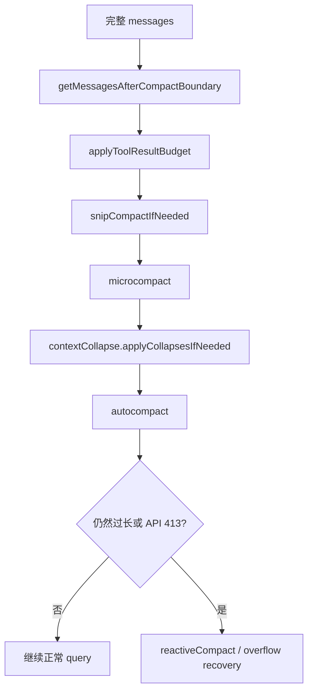

# Claude Code 源码共读笔记 44：Claude Code 是怎么把旧消息压缩、切边、投影，再继续工作的

## 这篇看什么

前面几篇已经把主线程请求这条线基本闭环了：

- 输入怎么进来
- 消息怎么整理
- prompt 怎么分层组装
- 最终请求怎么送给模型

但这条主链如果只看到这里，其实还缺最后一个非常关键的问题：

> **上下文一旦越来越长，Claude Code 到底怎么继续活下去？**

也就是：

- 为什么它不会一直背着全量 transcript 跑
- compact boundary 到底起什么作用
- snip 和 compact 是什么关系
- microcompact 为什么又不是完整 compact
- context collapse 跟 autocompact 谁先谁后
- 为什么 prompt 太长了以后，它还能继续转，而不是直接死掉

这次我主要回看了：

- `src/query.ts`
- `src/utils/messages.ts`
- `src/services/compact/compact.ts`
- `src/services/compact/microCompact.ts`

看完之后，我现在会把这条 context management 主线压成一句很清楚的话：

> **Claude Code 不是靠一次“大总结”解决上下文压力，而是用一串分层机制逐步减负：先切边，再局部裁剪，再清理旧工具结果，再做上下文投影，最后才在必要时整段 compact。**

换句话说：

> **它管理上下文的思路不是“满了就总结”，而是“能不重写就不重写，能局部减负就先局部减负”。**

我觉得这句话特别关键。

---

## 先给主结论

### 1. Claude Code 的 context management 不是一个功能，而是一条流水线

这是这篇最该先立住的一点。

很多人一说上下文压缩，脑子里只会想到：

- /compact
- 自动摘要
- 保留最近几轮

但 `query.ts` 里很清楚，真正发请求前的处理顺序其实是一整串：

1. `getMessagesAfterCompactBoundary(...)`
2. `applyToolResultBudget(...)`
3. `snipCompactIfNeeded(...)`
4. `microcompact(...)`
5. `contextCollapse.applyCollapsesIfNeeded(...)`
6. `autocompact(...)`
7. 如果还炸，再走 `reactiveCompact`

所以这里根本不是单点功能，而是：

> **分层 context reduction pipeline**

### 2. 它的基本策略是：先保留颗粒度，再保留连续性，最后才退到摘要

我现在会把它的优先级总结成：

- **先切掉已经被完整 compact 之前的历史**
- **再把不关键但占空间的局部内容减掉**
- **再尝试做可逆/弱侵入式的投影**
- **最后才把大段旧对话压成 summary**

这说明 Claude Code 的设计目标不是“压到最小”，而是：

> **尽量保住可工作的细节上下文，只在真没办法时才 summary。**

这点和很多“粗暴总结一下再继续”的 agent 很不一样。

### 3. compact boundary 是这一整套系统的地基

我觉得这是这篇里最值得单独拎出来的点。

`getMessagesAfterCompactBoundary(...)` 一上来就决定了：

- 本轮 query 默认只看最近一个 compact boundary 之后的消息

这意味着：

> **compact 不是一次性摘要动作，而是把整段会话从此切成“之前不再直接回放”和“之后继续细粒度工作”两半。**

这个边界一旦立住，后面所有 snip / microcompact / collapse / autocompact 都只需要在边界后的活动上下文上工作。

所以它非常像整个系统的“上下文地基切口”。

---

## 先把总图立住：Claude Code 的上下文减负顺序到底是什么

这个图最关键的一点是：

> **Claude Code 是逐层削减上下文压力，而不是一满就直接 summary。**

---

## 第一层：`getMessagesAfterCompactBoundary(...)` 先把“旧世界”切掉

这一层非常关键，而且很容易被低估。

`getMessagesAfterCompactBoundary(...)` 做的事情很简单：

- 找最后一个 `compact_boundary`
- 只返回这个 boundary 之后的消息（包含 boundary）
- 如果开了 `HISTORY_SNIP`，默认还会再套一层 `projectSnippedView(...)`

### 这说明完整 transcript 从来不是每轮 query 的起点

Claude Code 的默认工作视图不是：

- 全部消息

而是：

> **最近一次完整 compact 之后的活动段。**

这个设定很重要。

因为它意味着完整 compact 一旦发生，就已经从架构上改写了后续每轮 query 的起跑线。

### boundary 自己虽然被保留，但最终不会直送 API

注释里也写了：

- boundary 本身是 system message
- 后面 `normalizeMessagesForAPI(...)` 会把它过滤掉

所以 compact boundary 的作用不是给模型读，而是给 runtime 定义：

> **从哪里开始算“当前有效会话历史”。**

这就是为什么我说它是地基切口。

---

## 第二层：`applyToolResultBudget(...)` 说明 Claude Code 先减的是“超大工具结果”，不是对话主体

在真正进入 snip 和 compact 之前，`query.ts` 先做的是：

- `applyToolResultBudget(...)`

而且注释写得很清楚：

- 这是在 aggregate tool result size 上做 per-message budget
- 发生在 microcompact 之前

### 这说明第一优先级不是删对话，而是限制工具输出膨胀

这点特别成熟。

因为实际把上下文撑爆的，很多时候并不是：

- 用户和 assistant 的自然语言往返

而是：

- 大量 tool result
- read file 输出
- 搜索结果
- 命令 stdout/stderr

所以 Claude Code 的第一个动作不是“总结对话”，而是：

> **先把工具产出的体积约束住。**

这其实很符合真实上下文压力来源。

---

## 第三层：snip 不是完整 compact，它更像“局部切边投影”

这层我觉得特别关键。

`query.ts` 里的顺序是：

- 在 microcompact 之前先跑 `snipCompactIfNeeded(...)`
- 而且注释明确说了：
  - snip 和 microcompact 不互斥
  - `snipTokensFreed` 还会继续传给 autocompact 做阈值判断

### 这说明 snip 不是替代 compact，而是更前面的轻量减负机制

从命名和位置上看，snip 更像：

> **在不改变大结构的前提下，对上下文做投影式裁剪。**

它不是重新总结整段历史，
而是把某些内容从“模型看到的视图”里剪掉。

### 这也是为什么 `getMessagesAfterCompactBoundary(...)` 会默认套 `projectSnippedView(...)`

也就是说，snip 不只是当轮临时裁剪，
它还进入了“model-facing view”的默认投影逻辑。

这说明 snip 的语义其实是：

> **保留 transcript，改变 query 视图。**

这一点和完整 compact 的“改写后续历史起点”是不一样的。

---

## 第四层：microcompact 不是 summary，它主要在清旧 tool results

这一层特别值，因为名字很容易误导。

看 `microcompactMessages(...)` 的实现，能看出两个核心路径：

### A. time-based microcompact
当距离上次 main-loop assistant 已经很久、cache 基本冷掉时：

- 直接 content-clear 旧 tool results
- 但保留最近若干个

### B. cached microcompact
当模型支持 cache editing、而且是主线程场景时：

- 不改本地 message content
- 通过 cache_edits 告诉 API 删除哪些旧 tool results
- 边界消息甚至延后到 API 返回后再发

### 这说明 microcompact 的核心对象是 tool results，不是整段对话

也就是说，它真正想做的是：

> **尽可能低成本地把“最占空间、但不一定还要反复读”的旧工具结果清掉。**

所以它不是 mini-summary，
而更像：

- tool result garbage collection
- 或者说 tool-result-focused slimming

### 这也解释了为什么 query 里它发生在 autocompact 之前

因为如果只是旧工具结果把上下文撑大，
那没必要上来就整段 compact。

先把这些“肥肉”减掉，可能就已经够继续工作了。

---

## 第五层：context collapse 更像“读时投影”，不是 transcript 改写

这层是我觉得整个系统里最容易被误解、但也最漂亮的一层。

`query.ts` 里的注释写得非常清楚：

- collapse runs before autocompact
- nothing is yielded
- collapsed view is a read-time projection over full history
- summary messages live in collapse store, not REPL array
- projectView() replays commit log on every entry

### 这说明 context collapse 不是普通 compact

它并不直接把 REPL 里的消息数组改写成“summary + recent tail”。

而是：

> **在读取 query 视图时，把某些已归档段投影成更短的表示。**

这真的很不一样。

### 所以它的价值是：既减少模型看到的体积，又尽量不破坏本地完整历史

我觉得这点非常成熟。

因为这意味着：

- UI scrollback / 会话存储可以保留更完整的原始材料
- 但模型每轮看到的是 collapse 之后的高效视图

所以 context collapse 本质上更像：

> **面向模型上下文窗口的 projection layer**

而不是一次摘要命令。

---

## 第六层：autocompact 才是真正的“整段 compact”主力

到这一步，才轮到真正意义上的大 compact：

- `deps.autocompact(...)`

如果它成功，会拿到：

- `compactionResult`

然后立刻：

- `buildPostCompactMessages(compactionResult)`
- yield 这些 postCompactMessages
- 并把 `messagesForQuery = postCompactMessages`

### 这说明 autocompact 会直接重写后续 query 的活动上下文

而 `buildPostCompactMessages(...)` 的结构也很清楚：

- `boundaryMarker`
- `summaryMessages`
- `messagesToKeep`
- `attachments`
- `hookResults`

这说明真正完整 compact 后，后续可继续工作的上下文不是随便拼的，
而是一个明确的新基线。

### 所以 autocompact 是“从旧活动段切出一条新活动段”的动作

这点我觉得特别重要。

它不是单纯地产生一段 summary 文本，
而是在创建一个新的、后续 query 要从这里继续跑的上下文段。

这也是为什么 compact boundary 如此关键。

---

## 第七层：`buildPostCompactMessages(...)` 暴露了 compact 之后真正保留下来的最小工作集

这个函数虽然小，但信息量很高：

- boundary
- summary
- messagesToKeep
- attachments
- hookResults

### 这说明 compact 后保留的不只是 summary

这个点很值。

Claude Code 没有把 compact 理解成：

- “前面都总结成一段，然后从此往后聊”

而是还会显式保留：

- 必须继续带着走的消息片段
- 必须继续存在的 attachment
- hooks 带来的附加结果

所以完整 compact 的产物更像：

> **一个重建过的最小可工作上下文包。**

这比普通 summarization 明显成熟很多。

---

## 第八层：reactive compact 说明 Claude Code 还有“撞墙后恢复”的后备路径

虽然这篇没有深拆 `reactiveCompact.ts`，但从 `query.ts` 里的位置已经能看出它的角色了。

它主要在：

- prompt too long withheld
- media size error
- context collapse overflow recovery

这些场景里兜底。

### 这说明 Claude Code 的上下文管理不是只有 proactive 路径

前面那些：

- snip
- microcompact
- collapse
- autocompact

都还是在**尽量提前减负**。

而 reactive compact 则是在说：

> **如果还是撞到 provider 的真实限制，那就再走恢复性 compact。**

这个分层非常合理。

因为上下文压力的管理，不可能完全靠静态估算做对。

供应商的真实错误反馈本身，也是系统的一部分输入。

---

## 第九层：所以整套设计的核心不是“总结”，而是“尽量避免重写整个上下文”

如果把这篇所有点收起来，我现在最想保住的判断是：

> **Claude Code 真正的上下文管理哲学，不是频繁总结，而是尽量用切边、投影、局部清理这些更便宜的手段，延缓甚至避免整段 compact。**

我觉得这句话非常重要。

因为它解释了为什么会同时存在这么多层：

- compact boundary
- tool result budget
- snip
- microcompact
- context collapse
- autocompact
- reactive compact

如果系统的想法只是“满了就总结”，这些层根本没必要这么复杂。

它之所以存在，是因为作者真正想保住的是：

- 细节颗粒度
- prompt cache 稳定性
- 较低的重写成本
- 更自然的持续工作体验

这点我觉得很值。

---

## 我现在对 Claude Code 上下文管理链的定义

如果只留一句最短的话，我会留：

> **Claude Code 的上下文管理是一条分层减负流水线：先用 compact boundary 切出活动段，再通过 snip、microcompact、context collapse 这类局部手段压缩视图，最后才在必要时用 autocompact / reactive compact 重建新的最小可工作上下文。**

这句话里最想保住的是六个词：

- **分层减负**
- **活动段**
- **局部手段**
- **压缩视图**
- **必要时**
- **最小可工作上下文**

因为这六个词几乎就是这套设计的核心。

---

## 这篇最值得记住的几个判断

### 判断 1：Claude Code 的 context management 不是单个 compact 功能，而是一整条从切边、投影、局部清理到完整 compact 的流水线

### 判断 2：compact boundary 是整套系统的地基：它决定后续 query 默认只在最近一个完整 compact 之后的活动上下文上工作

### 判断 3：snip 和 context collapse 都更像“模型视图投影”，不一定直接改写本地完整 transcript

### 判断 4：microcompact 的核心目标不是总结对话，而是优先清理占空间最大的旧 tool results，尽量避免过早进入完整 compact

### 判断 5：autocompact 的产物不是一段 summary，而是一个重建过的最小可工作上下文包，由 boundary、summary、messagesToKeep、attachments、hookResults 共同组成

### 判断 6：reactive compact 说明 Claude Code 还有“撞墙后恢复”的兜底路径，整个系统既有 proactive reduction，也有 reactive recovery

---

## 下一步最顺怎么接

现在如果继续沿这条线往下钻，我觉得最顺有两个方向：

### 方向 A：单拆 microcompact
**Claude Code 为什么把旧 tool results 的清理单独做成一层，而不是直接交给 autocompact**

### 方向 B：单拆 context collapse
**context collapse 为什么是读时投影，而不是直接改写 transcript，它到底保住了什么**

如果只选一个，我会更倾向 **方向 B**。

因为这层最不直觉，也最能体现 Claude Code 在“保留完整历史”和“缩小模型视图”之间的折中设计。