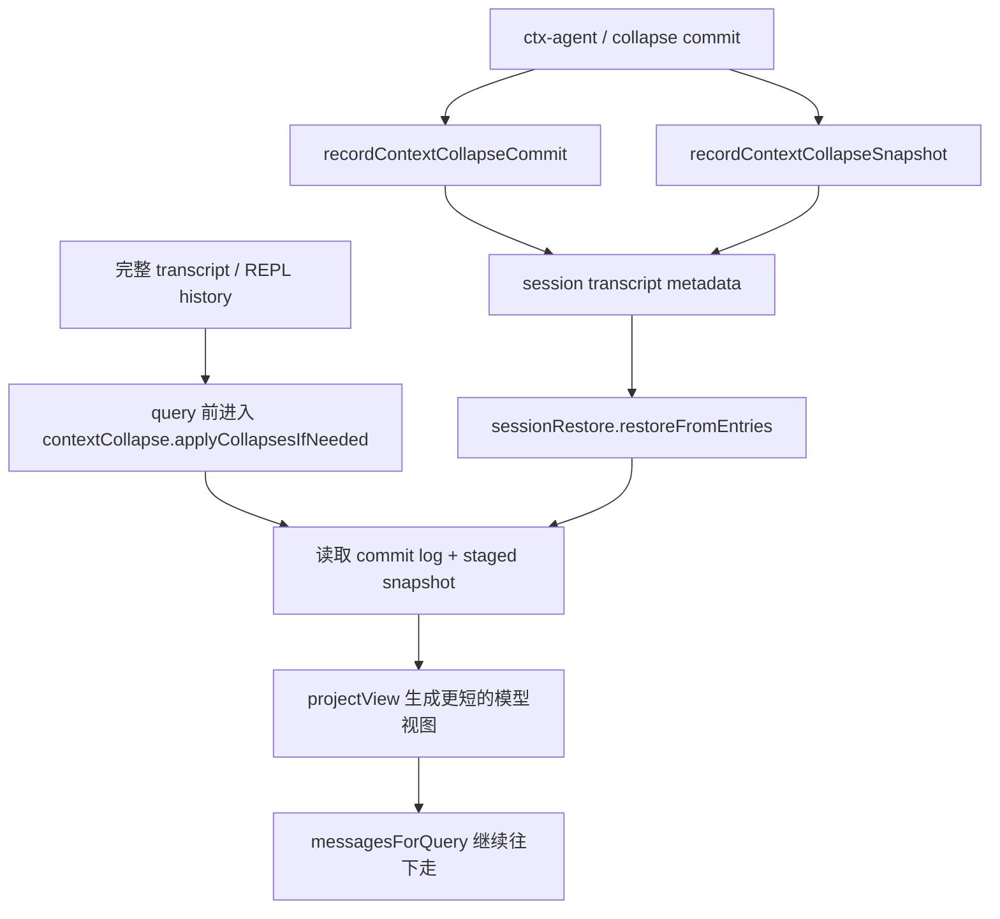

# Claude Code 源码共读笔记 45：context collapse 为什么是读时投影，而不是改写 transcript

## 这篇看什么

上一篇已经把 Claude Code 的 context management 主线收住了：

- compact boundary 先切活动段
- snip 做局部视图裁剪
- microcompact 清旧 tool results
- context collapse 在 autocompact 前做进一步减负
- 真不行了才上 autocompact / reactive compact

但其中最不直觉的一层，其实正是 context collapse。

因为从直觉上讲，如果系统想把上下文变短，最简单的做法明明是：

- 直接改写 transcript
- 把旧消息换成 summary
- 从此以后就只保留 summary

可 Claude Code 看起来没有这么做。

至少从 `query.ts`、`sessionRestore.ts`、`sessionStorage.ts`、`setup.ts` 这几处已经暴露出来的实现和注释看，它走的是另一条路：

> **context collapse 更像一层“读时投影”，而不是直接把本地 transcript 改写掉。**

这次我主要回看了：

- `src/query.ts`
- `src/setup.ts`
- `src/utils/sessionRestore.ts`
- `src/utils/sessionStorage.ts`

虽然当前这份恢复源码里 `src/services/contextCollapse/*` 具体实现文件没有完整落出来，但这些调用点和注释已经足够把核心设计意图看得很清楚。

看完之后，我现在会把这层设计压成一句很明确的话：

> **context collapse 的目标不是把历史“变成别的东西”，而是在不破坏完整 transcript 的前提下，给模型构造一个更短的工作视图。**

我觉得这句话特别值。

---

## 先给主结论

### 1. context collapse 的核心产物不是“新 transcript”，而是“更短的 query view”

这是这篇最该先立住的一点。

`query.ts` 里关于 context collapse 的那段注释写得非常直接：

- nothing is yielded
- collapsed view is a read-time projection over the REPL's full history
- summary messages live in the collapse store, not the REPL array
- `projectView()` replays the commit log on every entry

这几句合起来，意思其实已经很清楚了：

> **context collapse 不是把 REPL 里的消息数组重写成 summary 版，而是每次 query 前，在读取视图时投影出一个更短版本。**

这和普通 compact 是完全不同的哲学。

### 2. 它保住的是“本地完整历史”和“模型工作视图”之间的分离

如果直接改写 transcript，会发生什么？

- UI scrollback 变粗
- resume / 调试 / 审计会少很多原始细节
- 后续别的机制要再找原消息时会很麻烦

而 context collapse 现在这套设计更像是在说：

- transcript 可以尽量保留完整
- 模型每轮看到的只是一个压缩后的 projection

也就是说，它在主动分离：

> **存储语义** 和 **模型消费语义**

这一点我觉得非常成熟。

### 3. commit log + snapshot 说明它不是临时技巧，而是一套可持续、可恢复的投影系统

这一层很关键。

如果 context collapse 只是一次性 query 内的小花招，那根本不需要：

- `recordContextCollapseCommit(...)`
- `recordContextCollapseSnapshot(...)`
- `restoreFromEntries(...)`
- `initContextCollapse()`

但源码里这些都在。

这说明 Claude Code 把 context collapse 当成：

> **一个需要跨 turn、跨恢复、跨会话延续的上下文投影子系统。**

而不是一次 query 里的小优化。

---

## 先把总图立住：context collapse 这层到底怎么工作

这张图最关键的一点是：

> **context collapse 改的是“读出来给模型看的视图”，不是“底下保存的原消息”。**

---

## 第一层：`query.ts` 的注释几乎已经把设计意图写明了

这一层证据非常直接。

`query.ts` 里关于 `applyCollapsesIfNeeded(...)` 那段注释，我觉得信息量非常大：

- collapse 在 autocompact 之前跑
- 如果 collapse 已经把上下文压到阈值以下，autocompact 就不需要动了
- nothing is yielded
- collapsed view is a read-time projection over the REPL's full history
- summary messages live in the collapse store, not the REPL array
- `projectView()` replays the commit log on every entry

### 这几句合起来，已经足够说明它不是 transcript rewrite

尤其是这两点：

1. **nothing is yielded**
   - 说明它不像 autocompact 那样会把新的 compact messages 显式塞回消息流

2. **summary messages live in the collapse store, not the REPL array**
   - 说明 summary 不是直接替换掉本地消息数组里的老消息

所以如果硬要压缩成一句话，就是：

> **autocompact 改“活动上下文基线”，context collapse 改“读取活动上下文的方式”。**

这个区别我觉得特别重要。

---

## 第二层：为什么说它是“读时投影”，不是“写时改写”

这里我觉得要把“读时投影”这四个字说人话。

所谓读时投影，意思不是很玄乎，基本就是：

- 底下那份原始消息还在
- 但当 query 要拿消息去喂模型时
- 先根据 collapse commit log 算一遍
- 得到一个更短的 model-facing view

也就是说，改动发生在：

> **读取给模型的那一刻**

而不是：

> **把 transcript 本体永久改掉的那一刻**

### 这和普通 compact 的写法是反过来的

普通 compact 更像：

- 先写出新的 summary / boundary / keep messages
- 再用它们作为后续真正的消息基线

而 context collapse 更像：

- transcript 还是老 transcript
- 但 query 时不再原样回放
- 而是重放一份 collapse 后的影子视图

我觉得这里的关键词就是：

> **projection，而不是 rewrite。**

---

## 第三层：为什么 Claude Code 要多做这一层，而不是直接改 transcript

我觉得这是这篇里最值的问题。

如果直接改 transcript，有什么问题？

### 1. 本地完整历史会被破坏

一旦旧消息被真正替换成 summary：

- UI 里看到的就不再是完整交互
- debug 某轮工具行为时，会丢失很多现场细节
- 后续如果别的子系统想重读原始片段，也会更麻烦

### 2. 过早 summary 会降低后续灵活性

很多时候上下文虽然长，但并不代表你真的想永久失去颗粒度。

如果只是本轮模型窗口撑不住，
那可能更合理的做法是：

- 暂时给模型一个短视图
- 而不是把底下的历史也粗暴重写

### 3. resume / restore 语义会变复杂

如果 transcript 本体一直被改写，
那恢复时到底该恢复：

- 原始历史？
- 改写后的历史？
- 每次改写的链？

复杂度会很高。

而 context collapse 现在这套做法更优雅：

- transcript 继续保持它的主叙事
- collapse 另存成 commit log + snapshot
- 需要 query view 时再重建投影

这就把“存储”和“投影”分开了。

所以这层设计真正保住的是：

> **完整历史不轻易丢，模型视图按需变短。**

---

## 第四层：commit log 说明 collapse 不是一次性结果，而是一串可重放的变换记录

`sessionStorage.ts` 里很关键的两个接口是：

- `recordContextCollapseCommit(...)`
- `recordContextCollapseSnapshot(...)`

其中 commit 里会记：

- `collapseId`
- `summaryUuid`
- `summaryContent`
- `summary`
- `firstArchivedUuid`
- `lastArchivedUuid`

### 这说明 collapse 的语义不是“存个当前结果”，而是“记一笔变换”

也就是说，commit log 记录的不是：

- 当前最终视图长什么样

而更像：

- 哪一段被归档了
- 归档摘要是什么
- 这次 collapse 的边界在哪里

这正是 event log / commit log 的思路。

### 这也解释了为什么 `projectView()` 要“replay the commit log”

因为最终 query view 不是直接读一个现成副本，
而是：

- 从当前 transcript 出发
- 把这些 commit 重新应用一遍
- 得到最新的 collapse 视图

所以这套设计本质上是：

> **用可重放的 collapse 变换，生成模型视图。**

这比直接保存一份“当前压缩版 transcript”灵活得多。

---

## 第五层：snapshot 说明 collapse 还带有“运行中的 staged 状态”

如果只有 commit log，其实还不够。

因为源码里还专门持久化了：

- `marble-origami-snapshot`

从 `recordContextCollapseSnapshot(...)` 看，里面会记：

- `staged`
- `armed`
- `lastSpawnTokens`

注释也写了：

- 这是 staged queue + spawn state 的快照
- restore 时 last-wins

### 这说明 context collapse 不只是“已提交的 collapse 历史”，还有“准备中的 collapse 状态”

这点很值。

它意味着 context collapse 运行时不是只有最终 commit，
还有一层内部状态机，比如：

- 哪些段已经 staged、准备 collapse
- 当前系统是不是 armed
- 上次 ctx-agent spawn 的 token 情况

所以 snapshot 的作用大概就是：

> **让 context collapse 的运行中状态在恢复后也能续上。**

这比只恢复最终 commit 细很多。

---

## 第六层：`sessionRestore.ts` 说明 collapse 视图必须在第一次 query 前恢复好

这一层证据也很直接。

`sessionRestore.ts` 里写得很清楚：

- restore context-collapse commit log + staged snapshot
- must run before the first query()
- so `projectView()` can rebuild the collapsed view from the resumed Message[]
- even empty entries 也要 restore，因为它会先 reset store

### 这说明 context collapse 在恢复时不是可有可无的附属物

它不是“恢复完消息后，顺手恢复一下”。

而是：

> **如果不先恢复 collapse store，第一次 query 看到的上下文视图就会错。**

这说明它已经深深嵌进 query 主路径了。

### “即使空也要 restore” 这个细节特别说明问题

因为如果不 reset，
一个 session 内 `/resume` 到另一个没有 collapse commit 的会话时，
旧 store 还会留着，导致投影视图脏掉。

这说明作者对这个状态污染点是非常有意识的。

也再次说明：

> **context collapse 是一个真正有内部状态的运行时子系统。**

---

## 第七层：遇到 compact boundary 要清空旧 collapse commits，说明 collapse 依附于“当前活动段”

`sessionStorage.ts` 里还有一个特别值的细节：

- 读 transcript 时，一旦遇到 `compact_boundary`
- 会把 `contextCollapseCommits.length = 0`
- `contextCollapseSnapshot = undefined`

注释里解释得也很直白：

- compact boundary 之前的那些 commits，不该再作用到 post-boundary chain
- 否则 `/context` 的 collapsed spans 会 overcount

### 这说明 collapse 并不是跨 boundary 永久叠加的

它的作用范围依附于：

> **最近那个完整 compact 之后的活动段。**

这点非常重要。

因为它说明 context collapse 和 autocompact 不是互相独立的平行机制，
而是有明确主次关系：

- autocompact 立新基线
- context collapse 只在这个新基线上继续做投影优化

一旦基线变了，旧的 collapse commit log 就要作废。

这层关系我觉得很漂亮。

---

## 第八层：overflow recovery 说明 context collapse 还有“先排队、撞墙时再 drain”的味道

`query.ts` 里另一个特别有意思的点是：

当遇到 withheld 413，并且不是已经处于 `collapse_drain_retry` 时，会：

- `contextCollapse.recoverFromOverflow(messagesForQuery, querySource)`
- 如果 `drained.committed > 0`
- 就带着 `reason: 'collapse_drain_retry'` 再跑一轮

### 这说明 context collapse 不是只会温和投影，它还有 overflow 时的紧急排水通道

也就是说，平时它可能在：

- 累积 staged 内容
- 维持投影视图

但当真正撞到 provider 限制时，它还能：

> **主动把 staged collapse 提交掉，换一份更短的 query view 再试一次。**

这就说明它不是静态 projection，
而是一个带恢复能力的动态系统。

### 这也解释了为什么 snapshot 里会有 `staged` / `armed` 这种状态

因为 overflow drain 想工作，
就必须知道：

- 当前有没有 staged collapse 可以提交
- 系统现在是不是 armed
- 提交后下一轮该怎么 retry

所以这一整套逻辑是连着的。

---

## 第九层：setup 时初始化，restore 时回放，query 时投影——说明它真的是一条独立子系统

把这几处连起来看，其实脉络非常完整：

### setup
- `initContextCollapse()`

### restore
- `restoreFromEntries(commits, snapshot)`

### query
- `applyCollapsesIfNeeded(...)`
- `recoverFromOverflow(...)`

### persist
- `recordContextCollapseCommit(...)`
- `recordContextCollapseSnapshot(...)`

这已经不是“某个函数顺便做一下视图裁剪”了，
而是：

> **一条完整的、可初始化、可持久化、可恢复、可投影、可 overflow-recovery 的子系统。**

我觉得这点特别值。

因为它说明 Claude Code 在上下文管理上，已经不是简单 prompt 工程，而是开始有独立 runtime subsystem 的味道了。

---

## 第十层：所以 context collapse 真正保住了什么

如果把这篇所有点收起来，我现在最想保住的，不是“它很高级”，而是这句更实在的话：

> **context collapse 保住的是原始 transcript 的完整性，同时把模型每轮真正看到的上下文改成一个更短、更可持续的工作视图。**

也就是说，它真正同时保住了两件事：

### 1. 对人/系统有价值的完整历史
- scrollback
- debug
- restore
- 未来别的投影/分析机制

### 2. 对模型有价值的短工作上下文
- 更少 token 压力
- 更低重写成本
- 更晚触发 full compact
- 更自然的持续工作体验

这就是为什么它不直接改 transcript。

因为一旦直接改，
这两种价值就会被强行绑死在同一份数据上。

而现在它把这两者拆开了。

我觉得这就是整套设计最漂亮的地方。

---

## 我现在对 context collapse 的一句话定义

如果只留一句最短的话，我会留：

> **context collapse 是 Claude Code 的模型视图投影层：它不直接改写本地 transcript，而是通过可持久化的 commit log + snapshot，在 query 时重放 collapse 变换，给模型生成一份更短的工作视图。**

这句话里最想保住的是六个词：

- **模型视图投影层**
- **不直接改写**
- **commit log**
- **snapshot**
- **query 时重放**
- **更短的工作视图**

因为这六个词几乎就是这套设计的核心。

---

## 这篇最值得记住的几个判断

### 判断 1：context collapse 的核心产物不是新的 transcript，而是更短的 model-facing query view

### 判断 2：它选择读时投影而不是写时改写，本质上是在分离“完整历史存储”和“模型消费视图”这两种语义

### 判断 3：commit log 说明 collapse 记录的是一串可重放变换，而不是单个最终结果

### 判断 4：snapshot 说明 context collapse 还带有 staged queue / spawn state 这类运行中状态，因此它不是纯静态投影

### 判断 5：restore 必须在第一次 query 前先恢复 context collapse store，说明这层已经深度嵌进主线程 query 路径

### 判断 6：遇到 compact boundary 要清空旧 collapse commits，说明 context collapse 依附于最近一个完整 compact 之后的活动段，而不是跨基线永久叠加

### 判断 7：overflow recovery 说明它还有“撞墙时先 drain staged collapse 再 retry”的恢复能力，不只是温和的平时投影

---

## 下一步最顺怎么接

如果继续沿 context management 这条线往下拆，我觉得最顺有两个方向：

### 方向 A：单拆 microcompact
**为什么旧 tool results 的清理要单独做成一层，而且还分 cached / time-based 两条路**

### 方向 B：单拆 reactive compact
**为什么 Claude Code 需要一条“撞到 413 再恢复”的后备链，而不是只靠 proactive 估算**

如果只选一个，我会更倾向 **方向 A**。

因为 context collapse 这篇已经把“投影视图”讲透了，下一篇切去 microcompact，会正好把另一条“局部减负”主线也补完整。