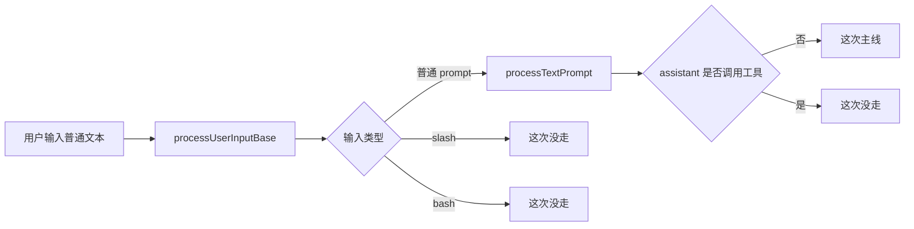
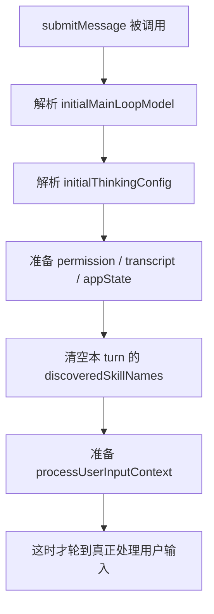
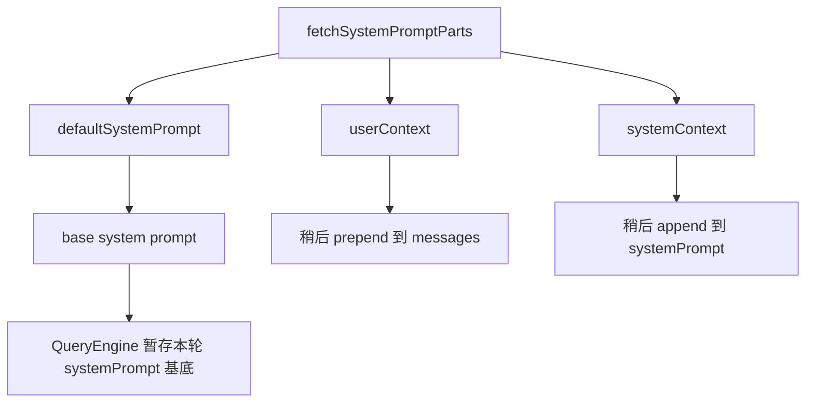
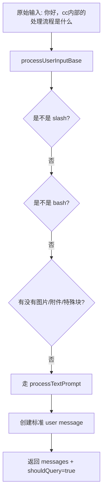
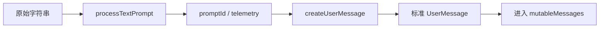
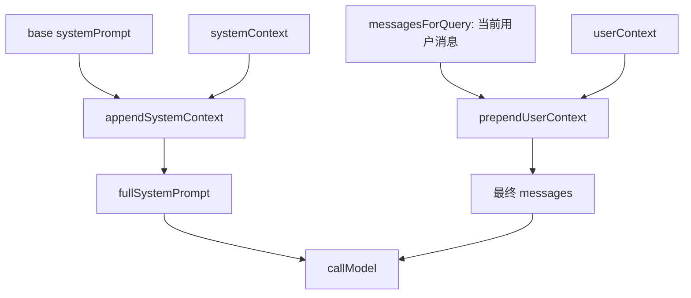
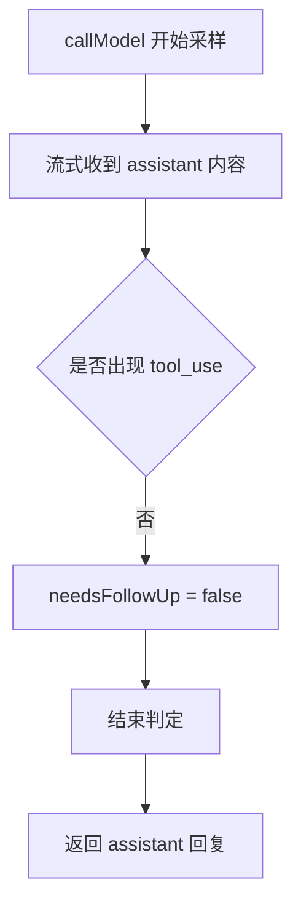
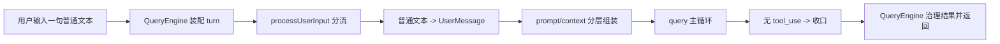
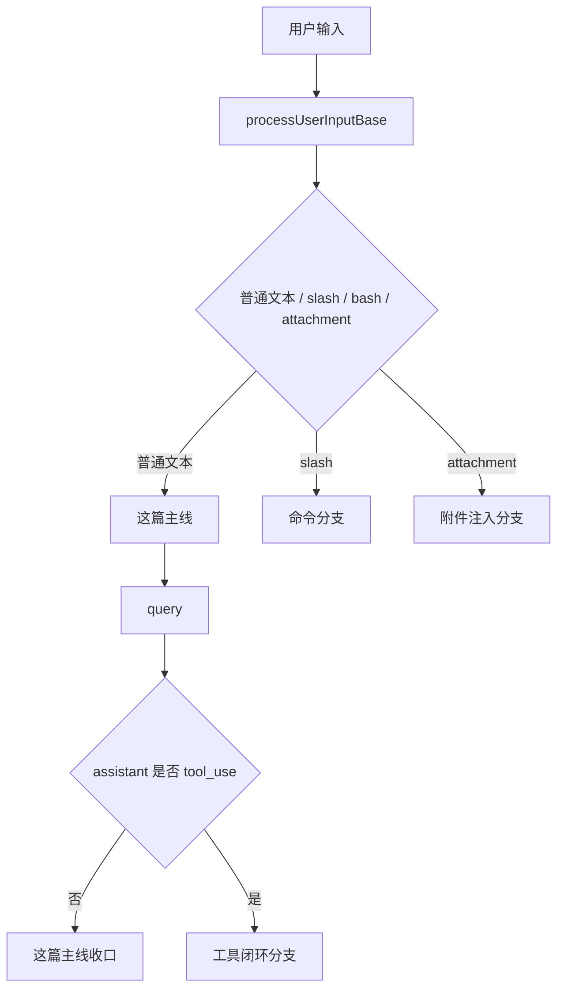

# Claude Code 源码共读笔记 46：用一个新会话例子串起 QueryEngine 主链

## 这篇看什么

前面其实已经把主线程的几个关键部件分开拆过了：

- `QueryEngine.submitMessage(...)` 是入口
- `query(...)` 是主循环
- `processUserInput(...)` 是输入路由层
- `messages.ts` 是消息协议边界层
- system prompt / userContext / systemContext 是分层组装的

但这些东西如果一直拆着看，也有一个明显问题：

> **知道每个零件做什么了，但不一定真的能在脑子里跑出“一次请求是怎么流过去的”。**

所以这篇我不再按函数拆，而是换一个更直观的方式：

> **直接拿一个最简单的新会话例子，把 Claude Code 主线程内部的整条链跑一遍。**

例子就用这个：

> 用户新开一个会话，输入：**“你好，cc内部的处理流程是什么”**

我这次刻意把例子限制在最简单场景：

- 新会话
- 普通文本输入
- 无附件
- 无 slash command
- 不主动触发 tool_use

因为这样最适合把 QueryEngine 主链本身看清，而不会一开始就被分叉干扰。

这篇的目标不是回答“模型会怎么回答这句话”，而是回答：

> **这句话从用户敲下回车，到 Claude Code 开始产出首轮 assistant 回复，中间内部到底依次发生了什么。**

看完这一篇，我觉得应该能把前面那些拆散的结论重新收成一张更完整的脑内地图。

---

## 先给主结论

如果只先讲一句话，我会先讲这个：

> **在这个例子里，Claude Code 内部并不是“收到文本 → 发给模型 → 拿回答”这么短，而是至少要经过五层：会话状态初始化、输入路由、prompt/context 组装、query 主循环启动、返回消息治理。**

再压缩一点，就是：

> **用户说的是一句话，但 Claude Code 内部跑的是一轮完整 runtime turn。**

这也是为什么我一直觉得，`QueryEngine` 最准确的理解方式不是“API 调用器”，而是：

> **主线程一次交互的总装配器。**

---

# 先把整条链一眼看明白

## 图 1：从用户输入到首轮回复的总流程

```mermaid
flowchart TD
    A[用户新开会话] --> B[输入: 你好，cc内部的处理流程是什么]
    B --> C[QueryEngine.submitMessage]
    C --> D[初始化本轮 runtime 状态]
    D --> E[fetchSystemPromptParts]
    E --> F[得到 defaultSystemPrompt / userContext / systemContext]
    F --> G[processUserInput]
    G --> H[普通文本路径 processTextPrompt]
    H --> I[生成 user message]
    I --> J[写入 mutableMessages]
    J --> K[buildSystemInitMessage]
    K --> L[进入 query(...)]
    L --> M[准备 messagesForQuery + fullSystemPrompt]
    M --> N[callModel]
    N --> O[流式收到 assistant message]
    O --> P{是否出现 tool_use}
    P -- 否 --> Q[结束判定 / 收口]
    P -- 是 --> R[工具执行 / 下一轮续转]
    Q --> S[QueryEngine 治理结果并返回]
```

这张图其实就是这篇最核心的一张总图。

如果你只想先抓住一句话，那就是：

> **这句用户输入会先被包进一个完整 turn，然后才进入真正的模型主循环。**

---

## 图 2：这次例子的“最小主线”没有走哪些分叉



这张图的作用，是先把边界讲清。

因为这篇不是要覆盖所有情况，而是要用一个最干净的例子，把主线先串活。

所以我后面会不断提醒：

- 哪些分叉这次没走
- 但如果换成 slash / attachment / tool_use，会从哪里拐出去

---

# 第一幕：用户刚开一个新会话，Claude Code 眼里这不是“空白聊天框”，而是一个新的 turn 容器

用户看到的只是：

- 打开 Claude Code
- 新开一个会话
- 输入一句话

但 Claude Code 内部真正开始工作的时刻，不是“出现了文本”，而是：

> **`QueryEngine.submitMessage(...)` 被调用的时候。**

### 这一步最重要的不是处理文本，而是先把这一轮 turn 的运行时骨架立起来

也就是像我前面那篇拆过的：

- 当前主线程用哪个 model
- 当前 thinking config 是什么
- 工具权限怎么判断
- transcript 要怎么记
- 本轮 discovered skills 状态先清空
- `mutableMessages` 当前是什么
- cwd 和 app state 是什么

这里要特别强调一个点：

> **在 QueryEngine 眼里，这次输入首先不是一段 string，而是一轮要被管理、记录、可能持续推进的 runtime turn。**

所以如果把这次例子翻成内部视角，更像是：

- 收到一个新的用户回合请求
- 需要先把这轮执行上下文搭好
- 然后再决定怎么处理那句文本

### 图 3：新会话第一句输入时，QueryEngine 先做什么



这一层特别值得记住。

因为它解释了为什么 QueryEngine 看起来总是“很长、很杂”。

不是因为它设计差，
而是因为它本来承担的就是：

> **一次主线程 turn 的运行时装配职责。**

---

# 第二幕：在碰用户输入之前，system prompt 的材料已经开始备好了

在这个例子里，用户说的是：

> “你好，cc内部的处理流程是什么”

很自然会让人以为下一步就是把这句话丢给模型。

其实不是。

在真正 query 之前，Claude Code 先做了一步非常关键的事：

- `fetchSystemPromptParts(...)`

拿到：

- `defaultSystemPrompt`
- `userContext`
- `systemContext`

### 这一步特别重要，因为它说明 Claude Code 从一开始就不是“拿一段完整 prompt 去用”

而是：

- 先拿 prompt 零件
- 再在后面按层组装

这跟很多简单 agent 非常不同。

简单 agent 常常是：

- 一段 system prompt 固定写死
- 一串聊天历史直接拼上去

而 Claude Code 的做法更像：

> **system 规则层、用户背景层、消息历史层先拆开存，再按位置重新装起来。**

### 在这次例子里，这些 prompt 材料虽然用户看不见，但已经决定了模型之后会怎么理解问题

比如 system 层里会包含：

- Claude Code 自己的工作规则
- 环境说明
- 输出约束
- 各种 runtime 行为提示

也就是说，用户看到的只有一句：

> “你好，cc内部的处理流程是什么”

但模型真正收到的，绝对不是裸问题。

它前面已经垫好了大量上下文规则。

### 图 4：在用户这句普通文本进入 query 前，prompt 材料怎么分层准备



这张图就是前面第 43 篇那条结论的人话版。

简单说就是：

- **规则先备料**
- **背景先拆层**
- **还没真正发请求**

---

# 第三幕：这句话不会原样进模型，而是先经过输入路由层

现在终于轮到用户那句话本身了：

> “你好，cc内部的处理流程是什么”

Claude Code 会先走：

- `processUserInput(...)`

而不是直接进入 `query(...)`。

这一步其实就是第 40 篇拆过的主线。

但这次我们不从函数拆，而是从这个具体例子来理解。

### 在这个例子里，系统会先判断：这到底是哪类输入？

它会先排除：

- 不是 bash 模式
- 不是 `/xxx` slash command
- 没有附件 / pasted image
- 没有特殊 command 重写

于是最后会落到最简单那条路：

- `processTextPrompt(...)`

也就是说，这句话在内部会被归类成：

> **普通文本 prompt**

### 这一步特别重要，因为 Claude Code 不是“文本中心”的

哪怕这次只是普通文本，系统依然是先经过统一分流层，
只是最后恰好走到了最薄的一条支路。

所以这句用户输入的真实内部命运不是：

- string → model

而是：

- string → 输入路由层 → 普通文本分支 → user message

### 图 5：这句输入在 `processUserInput(...)` 里的分流命运



这一层的结论很简单，但很重要：

> **用户哪怕只说了一句最普通的话，也不是直接送模型，而是先被翻译成一组消息决议。**

---

# 第四幕：普通文本路径其实很薄，但它承担了“把用户这句话铸造成标准消息”的职责

在这个例子里，到了 `processTextPrompt(...)`，事情就变得相对简单了。

系统主要做的，是把：

> “你好，cc内部的处理流程是什么”

铸造成一条标准 `UserMessage`。

这一步通常会伴随：

- 生成一个 promptId
- 打 tracing / telemetry
- 如果有 attachment message 就拼上
- 没有的话就只保留这条用户消息

因为这个例子里没有图片、没有附件，所以最后最核心的产物其实就是：

> **一条规范化后的 user message，准备进入主线程消息流。**

### 这里最值得记住的是：Claude Code 处理的基本单位已经不再是 text，而是 message

到这里，用户那句中文问题在系统里已经不再是“原始字符串”，
而是：

- 一个有 uuid
- 有 timestamp
- 有 role
- 有 content
- 可以进入 transcript
- 可以参与后续 normalize / compact / resume 的消息对象

这就是为什么我前面一直说：

> **Claude Code 的主链路基本单位是 message，不是 text。**

### 图 6：用户这句话是怎么变成消息对象的



---

# 第五幕：消息刚进系统，还不会立刻 query，先要进入当前会话的活动状态

这一步也特别容易被忽略。

很多人会想象成：

- 用户输入生成了一条 user message
- 系统立刻拿这条 message 去问模型

其实中间还有一步：

- 写入 `mutableMessages`

也就是这条新 user message 会先成为：

> **当前会话活动消息状态的一部分。**

### 这说明这次输入不是孤立请求，而是会话状态的一次推进

哪怕这是个“新会话”，它也不是 stateless RPC。

在 QueryEngine 眼里，这更像：

- 当前会话消息数组之前为空或接近空
- 现在追加了第一条真实用户消息
- 后续 query 将以这个活动状态为基底继续工作

所以这一步特别适合用一句话概括：

> **QueryEngine 不是收一个 prompt 然后临时发请求，它是在推动一条活会话往前走。**

---

# 第六幕：真正发给模型之前，Claude Code 还会先抛一份“系统初始化快照”

在真正进入 `query(...)` 之前，`QueryEngine.submitMessage(...)` 还有一步挺有意思：

- `buildSystemInitMessage(...)`

它会把这一轮主线程 runtime 的初始化状态先整理出来。

比如：

- 当前 tools
- model
- permissionMode
- commands
- skills
- agents
- plugins
- fastMode

### 为什么这一步很重要

因为这说明 Claude Code 对“一轮 query 开始”这件事，内部其实有一个很明确的阶段切分：

1. **系统装配阶段**
2. **模型主循环阶段**

这个 init message 很像在说：

> 现在这轮运行时地图已经装好了，下面要进入真正的 query loop 了。

在用户界面里，这可能只是一些很轻的状态展示；
但在架构上，它说明 QueryEngine 并不是偷偷跳进 query，
而是先把运行时背景显式立起来。

### 图 7：进入 query 前，系统会先完成哪些“装配动作”

```mermaid
flowchart TD
    A[用户消息进入 mutableMessages] --> B[system prompt parts 已备好]
    B --> C[system init snapshot]
    C --> D[skills / tools / model / permissionMode 就位]
    D --> E[现在才正式进入 query(...)]
```

---

# 第七幕：进入 `query(...)` 后，这句普通文本会被组装成一次真正的模型请求

到这里，才轮到真正的模型主循环。

但哪怕到了 `query(...)`，也不是“立刻 callModel”。

系统还会先把这轮真正送给模型的 payload 再整理一遍。

在这个例子里，最值得抓住的是这三层：

1. `fullSystemPrompt`
2. `prependUserContext(messagesForQuery, userContext)`
3. 当前这轮 `messagesForQuery`

也就是说，模型看到的并不是单独那句：

> “你好，cc内部的处理流程是什么”

而是一个更完整的三层结构：

- system 规则层
- 前置 userContext 背景层
- 消息历史层（此时基本就是这条用户消息）

### 这也意味着：新会话的第一句输入，其实最能看出 QueryEngine 的“总装”作用

因为这时还没有复杂历史干扰，
你会特别清楚地看到：

- prompt 不是临时拼一段大文本
- messages 不是直接扔进去
- context 是分层挂上去的

### 图 8：这个例子里，真正发给模型的一次请求长什么样



这张图其实就是第 43 篇那条结论，在这个具体例子里的落地版。

---

# 第八幕：如果这句输入没有触发 tool_use，那么这个例子的主线会非常干净

现在来到这个例子的关键分叉点。

Claude Code 调 `callModel(...)` 后，会流式拿到 assistant 输出。

对于这个问题：

> “你好，cc内部的处理流程是什么”

在我们设定的这条最小主线里，
默认它**不会主动触发工具调用**。

那意味着什么？

意味着 `query(...)` 这轮大概率会走最简单的闭环：

- 模型开始采样
- 流式产出 assistant 内容
- 没有 `tool_use`
- `needsFollowUp = false`
- 进入结束判定
- 收口返回

### 这就是为什么我刻意选这个例子

因为它让你能先看清：

> **即使完全不触发工具，Claude Code 内部也已经跑完了一轮完整的 QueryEngine 主链。**

很多人一说 Claude Code 内部流程，就只想到 tool loop。

但其实在这个例子里，
哪怕完全没有工具调用，前面的这些层也都真实存在：

- QueryEngine 装配
- processUserInput 分流
- prompt/context 分层组装
- query loop 启动
- 返回消息治理

### 图 9：这个例子在 `query(...)` 里的最小闭环



这张图其实很重要。

因为它说明：

> **“没有工具调用”不是“没有流程”，而是走了 QueryEngine 主链里最干净的一条收口路径。**

---

# 第九幕：assistant 的首轮输出还要经过 QueryEngine 的治理，才变成用户最终看到的结果

到这里很多人会以为已经结束了：

- 模型答完了
- 返回给用户

其实还差最后一层：

- QueryEngine 要消费 `query(...)` 产出的流
- 记录 usage
- 抽取 stop_reason
- 更新 transcript
- 维护 `mutableMessages`
- 组装最终 result

也就是说，`query(...)` 负责的是：

> **把这轮消息流跑出来**

而 `QueryEngine` 负责的是：

> **把这条消息流收成一轮稳定的会话结果。**

这就是为什么我一直觉得：

- `query(...)` 更像引擎
- `QueryEngine` 更像总装+治理层

### 图 10：首轮 assistant 回复从 query 流到最终结果的最后一段

```mermaid
flowchart TD
    A[query(...) 产出 assistant message 流] --> B[QueryEngine 消费消息流]
    B --> C[记录 transcript / usage / stop_reason]
    C --> D[更新 mutableMessages]
    D --> E[生成最终 result]
    E --> F[用户看到回复]
```

这一层特别适合用一句话概括：

> **模型回答不是直接“掉到用户面前”，而是还要经过 QueryEngine 的会话治理层。**

---

# 把这个例子完整串起来

到这里，可以把这个具体例子完整重述一遍了。

用户新开一个会话，输入：

> “你好，cc内部的处理流程是什么”

Claude Code 内部真正发生的是：

1. `QueryEngine.submitMessage(...)` 接住这一轮新 turn
2. 先初始化本轮 runtime 状态，而不是立刻处理文本
3. 拉 system prompt 零件：`defaultSystemPrompt / userContext / systemContext`
4. `processUserInput(...)` 识别这是普通文本，不是 slash / bash / 附件输入
5. `processTextPrompt(...)` 把这句话铸造成标准 `UserMessage`
6. 这条消息先进入 `mutableMessages`，成为当前会话活动状态的一部分
7. QueryEngine 发出 system init，标记系统装配已完成
8. 进入 `query(...)`
9. `query(...)` 组装 `fullSystemPrompt + prependUserContext(messagesForQuery, userContext)`
10. `callModel(...)` 开始采样
11. 如果没有 `tool_use`，这轮直接进入结束判定并收口
12. QueryEngine 治理返回流，记录 transcript / usage，最后把结果交还给用户

### 图 11：这篇例子的“一句话总图”



我觉得这张图就是整篇最该记住的总图。

---

# 如果这句不是普通文本，流程会从哪里分叉？

这篇主线故意选的是最简单场景，
但你看完之后，最好顺手知道几条常见分叉会在哪里拐出去。

## 分叉 1：如果用户输入的是 `/command`
那不会直接走 `processTextPrompt(...)`，
而会在 `processUserInputBase(...)` 里分流到：

- `processSlashCommand(...)`

然后再继续分成：

- `local-jsx`
- `local`
- `prompt`

也就是说，slash 的复杂度发生在 **query 之前**。

## 分叉 2：如果用户输入里有附件 / `@file` / MCP 资源
那会在输入层和 attachment 层额外生成：

- attachment messages

然后这些 attachment 不会单独作为第四路请求发送，
而会先进入消息归一化，最后被翻译进 `messages` 层。

## 分叉 3：如果 assistant 首轮触发了 tool_use
那这个例子就不会在第一个 assistant 回复处收口，
而会进入：

- tool execution
- tool_result 回流
- 下一轮 query 续转

这时整条链会从“单轮问答”升级成“多轮闭环执行”。

### 图 12：同一个主链最常见的三个分叉点



这张图的意思很简单：

> **你现在看到的是 QueryEngine 主链的中轴线，真正的复杂度来自沿线不断长出来的分叉。**

---

# 这篇最想保住的判断

如果把这篇所有内容都收起来，我最想保住的不是“流程很多”，而是下面这句：

> **对用户来说，这只是新会话里的第一句普通提问；但对 Claude Code 来说，这已经是一轮完整的 runtime turn：先装配运行时，再把输入翻译成消息，再分层组装 prompt/context，最后启动 query 主循环并治理结果。**

这句话里最关键的是：

- **不是纯文本请求**
- **是一轮 runtime turn**
- **先装配，再分流，再组装，再主循环，再治理**

我觉得这才是把 QueryEngine 真正看活的角度。

---

# 我现在对这个例子的最短总结

如果只留一句最短的话，我会留：

> **用户输入“你好，cc内部的处理流程是什么”时，Claude Code 内部并不是把这句话直接发给模型，而是先由 QueryEngine 把它包装成一轮完整 turn：初始化状态、路由输入、生成消息、组装 prompt/context、启动 query，再把返回流治理成最终回复。**

---

# 这篇最值得记住的几个判断

### 判断 1：新会话的第一句普通文本，也不是“直接问模型”，而是一次完整的 turn 装配过程

### 判断 2：`QueryEngine.submitMessage(...)` 的第一职责不是处理文本，而是先把这轮 runtime 的执行骨架搭起来

### 判断 3：用户原始输入必须先经过 `processUserInput(...)`，在这个例子里才会落到最简单的 `processTextPrompt(...)` 路径

### 判断 4：真正发给模型的 payload 不是裸问题，而是 `systemPrompt + userContext + messagesForQuery` 这套分层结构

### 判断 5：即使这个例子完全没有触发 tool_use，Claude Code 内部也已经完整跑过了一轮主线程 QueryEngine 主链

### 判断 6：`query(...)` 负责把模型流跑起来，`QueryEngine` 负责把这条流治理成稳定的会话结果，这两层分工不能混

---

# 下一步最顺怎么接

如果继续沿这种“用例子串主链”的写法往下写，我觉得最顺的有两个方向：

### 方向 A：把同一个例子改成 attachment 版
比如：
> “你好，帮我看看 `@src/QueryEngine.ts` 的主流程”

这样可以把：
- attachment 注入
- messages 归一化
- prompt 组装
- query 主循环

再串一遍，而且更贴近真实使用场景。

### 方向 B：把同一个例子改成 tool-use 版
比如：
> “你好，帮我读一下 QueryEngine.ts，然后告诉我主流程”

这样就能把：
- 首轮 assistant 触发 `tool_use`
- tool_result 回流
- 第二轮续转

这条闭环完整画出来。

如果只选一个，我会更倾向 **方向 B**。

因为这篇已经把“无工具的最小主线”讲清了，下一篇再把“有工具的真实闭环”补上，会特别顺。