# Claude Code 源码共读笔记 47：用一个新会话例子，通俗解释 QueryEngine 主链

## 这篇看什么

如果你没看过 Claude Code 源码，但有编程基础，第一次听到这些名字时，通常会有点懵：

- `QueryEngine.submitMessage(...)`
- `processUserInput(...)`
- `query(...)`
- `callModel(...)`

看起来好像都在“处理用户输入”，但又不是一回事。

所以这篇我不按源码文件逐个拆，而是换一个更容易进入的方式：

> **直接拿一个最简单的新会话例子，把 Claude Code 内部流程跑一遍。**

例子还是这句：

> 用户新开一个会话，输入：**“你好，cc内部的处理流程是什么”**

为了把主线讲清，我把场景刻意限制成最简单版本：

- 新会话
- 普通文本输入
- 没有附件
- 不是 slash 命令
- 主线先假设不会触发工具调用

这样做的好处是：

- 你能先看清主链
- 不会一上来就被附件、命令、tool use 分叉打散

这篇的目标不是“精准还原每一行代码”，而是回答一个更实用的问题：

> **当用户在新会话里说出第一句话时，Claude Code 内部到底依次发生了什么？**

---

## 先给一个最短结论

如果只先记一句话，我建议先记这个：

> **用户看到的是“发出一句话”，Claude Code 内部跑的却是一整轮运行流程：先准备环境，再处理输入，再组装 prompt，再启动模型主循环，最后再把结果整理成用户看到的回复。**

也就是说，它不是：

- 收到文本
- 直接发给模型
- 拿回答

而更像：

- 创建一轮新的运行任务
- 给这轮任务装配上下文和规则
- 把文本翻译成系统内部消息
- 再进入真正的模型执行阶段

这也是为什么我一直觉得，`QueryEngine` 更像：

> **主线程一次交互的总装配器**

而不是一个普通 API 包装函数。

---

# 一张总图先看明白

## 图 1：从“用户发一句话”到“Claude Code 开始回复”的总流程

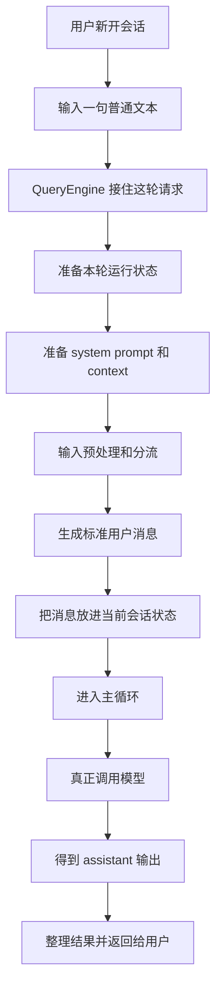

如果你先只看这张图，可以把 Claude Code 想成一条流水线。

用户的一句话，不会直接跳到“模型回答”那一步，中间至少要经过：

- 装配
- 翻译
- 组装
- 执行
- 治理

---

# 第一部分：为什么新会话的第一句话，也不是“直接发给模型”

从用户视角看，这件事很简单：

1. 新开一个会话
2. 输入一句话
3. 等回复

但从 Claude Code 内部视角看，这句输入首先不是“自然语言文本”，而是：

> **一轮新的任务入口。**

这时真正接住它的，是：

- `submitMessage(...)`（提交一轮用户消息）

这个函数在 `QueryEngine` 里。

### `QueryEngine` 是什么

你可以先把 `QueryEngine` 理解成：

> **主线程里负责组织一次完整问答回合的总控器。**

它不只负责调用模型，还负责：

- 准备本轮配置
- 处理输入
- 启动主循环
- 管理消息状态
- 记录 transcript 和 usage
- 收口最终结果

所以这里第一步最重要的判断是：

> **用户发来的不是“一个字符串”，而是“一轮需要被组织起来的交互”。**

---

## 图 2：新会话第一句话，在系统眼里先变成什么

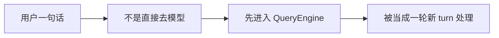

这里的 **turn**，你可以理解成：

- 一轮完整交互
- 一个从用户输入开始，到系统收口结束的执行单位

这个词很重要，因为后面很多逻辑都不是围绕“文本”设计的，而是围绕“turn”设计的。

---

# 第二部分：`submitMessage(...)` 先做的不是处理文本，而是搭好这轮运行骨架

很多人第一次看 `submitMessage(...)`，会觉得它很长、很杂。

但如果换个角度就容易理解了。

它像是在做这件事：

> **先把这轮请求要用的运行环境搭起来。**

比如它要先准备：

- 这轮用哪个模型
- thinking 配置是什么
- 当前工作目录是什么
- 工具权限怎么判定
- transcript 怎么记
- 当前会话已有消息是什么

这些东西看起来和用户那句中文问题没直接关系，但它们决定了：

- 这轮任务之后怎么跑
- 出错了怎么恢复
- 结果怎么记录

所以 `submitMessage(...)` 第一步最像的是：

> **为这轮交互搭脚手架。**

### 函数名顺手翻译一下

- `submitMessage(...)`：提交一轮用户消息
- `mutableMessages`：当前会话里那份“还在增长中的消息数组”
- `thinkingConfig`：这轮推理强度/推理模式配置

这些名字如果第一次看会有点抽象，但放到这个例子里就很直观了：

用户输入第一句话之前，Claude Code 先要决定：

- 这轮谁来回答
- 带哪些规则
- 在什么状态下回答

---

## 图 3：`submitMessage(...)` 一上来先搭哪些东西

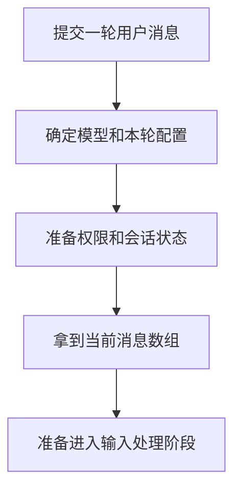

所以不要把 `submitMessage(...)` 想成一个“发请求”的动作，
它更像是：

> **一轮请求的启动器。**

---

# 第三部分：在处理用户这句话之前，system prompt 已经开始准备了

现在回到用户的原始输入：

> “你好，cc内部的处理流程是什么”

直觉上，我们会觉得系统应该马上处理这句话本身。

但实际上，在真正进入模型主循环前，Claude Code 还要先准备 prompt 材料。

这一步大致会拿到三类东西：

- `defaultSystemPrompt`（默认系统提示词）
- `userContext`（用户/会话背景）
- `systemContext`（系统侧补充上下文）

### 这三个东西，为什么要分开？

这是 Claude Code 很成熟的一点。

因为它没有把所有上下文都塞进同一个大字符串里，而是先分层：

#### 1. `defaultSystemPrompt`
你可以把它理解成：

- 系统基本规则
- Claude Code 的工作方式
- 平台级约束

#### 2. `userContext`
它更像：

- 跟当前用户或当前会话相关的背景信息
- 适合放在消息流前面
- 不一定是“系统法律”

#### 3. `systemContext`
它更像：

- 本轮额外补充的系统侧上下文
- 会在真正发请求前再挂到 system prompt 上

所以 Claude Code 的思路不是：

> 把所有东西拼成一大段 prompt

而是：

> 先把规则、背景、历史拆开，再按位置装回去

---

## 图 4：prompt 材料不是一坨，是三层备料

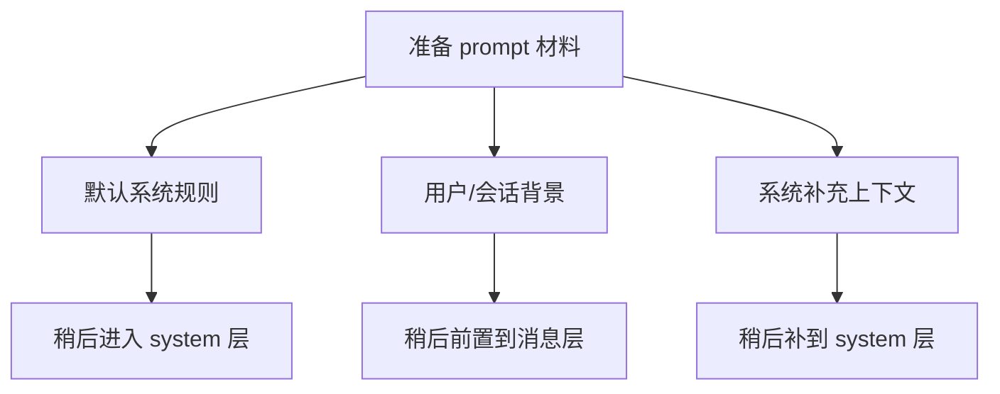

这张图很关键，因为它直接对应后面真正请求发出去时的结构。

---

# 第四部分：用户这句话不会直接进模型，而是先进入输入预处理层

现在终于轮到这句用户文本本身了。

Claude Code 会先走：

- `processUserInput(...)`（输入预处理/分流）

它的职责，你可以先粗暴理解成：

> **判断这次输入到底属于哪一类，再决定后面该怎么处理。**

因为在 Claude Code 里，输入不止一种：

- 普通文本
- slash 命令
- bash 模式
- 带图片/附件的输入
- 可能还会有更复杂的 block 输入

所以系统不能看到文本就直接送模型，必须先问一句：

> **这到底是哪种输入？**

在我们这篇的例子里，答案很简单：

- 不是 slash
- 不是 bash
- 没有附件
- 没有图片

所以最后会走最简单的路径：

- `processTextPrompt(...)`（把普通文本变成标准消息）

---

## 图 5：这句输入在预处理层的命运

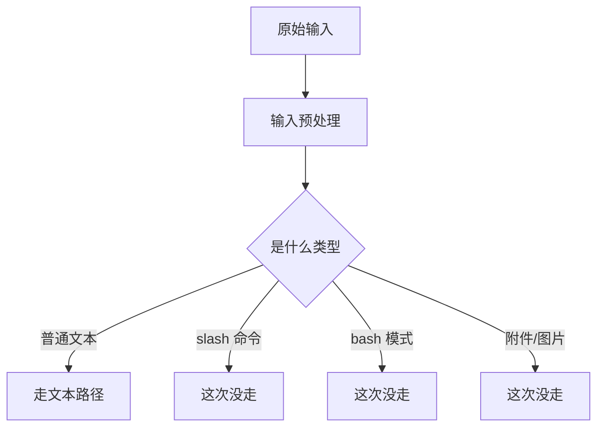

这里最重要的一个认知是：

> **Claude Code 的输入处理不是“文本优先”，而是“先分类，再处理”。**

这和很多简单聊天机器人差别很大。

---

# 第五部分：`processTextPrompt(...)` 做的事其实很朴素——把一句话铸造成系统内部标准消息

在这个例子里，真正把用户那句话变成系统内部对象的，是：

- `processTextPrompt(...)`

这个函数名也挺直白：

> **处理普通文本 prompt。**

它在这个例子里主要做的，就是把：

> “你好，cc内部的处理流程是什么”

变成一条标准 `UserMessage`（用户消息对象）。

你可以把这一步理解成：

- 生成一个消息对象
- 给它加上 uuid / timestamp 等元数据
- 让它能进入会话历史和后续运行链

### 为什么这一步重要

因为从这一步开始，系统处理的基本单位就不再是“字符串”了，
而是“消息对象”。

也就是说，后面的：

- transcript
- resume
- compact
- normalize
- tool result pairing

都不是围绕文本字符串运转的，而是围绕消息运转的。

所以这里可以记一句很重要的话：

> **用户输入先被变成消息，后面所有能力都是在消息层工作。**

---

## 图 6：一句普通文本是怎么变成标准消息的

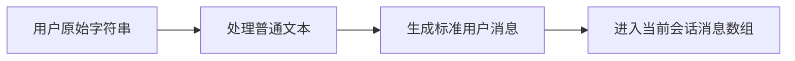

这条路径虽然简单，但它就是整个主链路的入口基础。

---

# 第六部分：这条消息先进入当前会话状态，而不是立刻去问模型

这一步特别容易被忽略。

很多人会直觉地想象成：

- 用户输入
- 系统直接拿这句话去问模型

但中间其实还有一步非常关键：

> **把这条消息写进当前会话的活动状态。**

前面提过，`QueryEngine` 维护着一份：

- `mutableMessages`（当前会话活动消息数组）

在这个例子里，用户这条第一句输入，会先进入这份数组。

为什么这一步重要？

因为它说明 Claude Code 的工作方式不是 stateless 的 RPC，而是：

> **在推动一条活会话向前生长。**

哪怕这是新会话，系统也不是“临时拿一句话去调用 API”，而是：

- 先把它并入当前会话状态
- 后续 query 再基于这份会话状态继续工作

这就是为什么 `QueryEngine` 会维护消息数组、usage、transcript、compact 边界这些状态。

---

## 图 7：为什么说它是在推动一条活会话

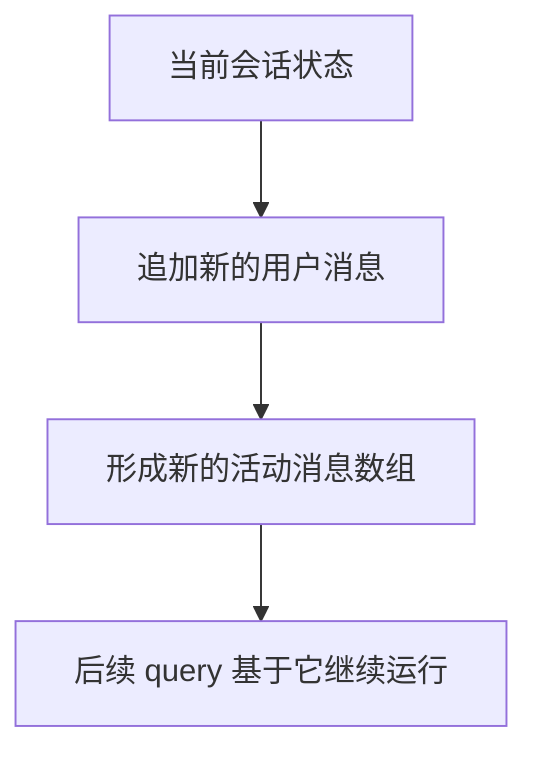

换句话说：

> **不是“文本驱动系统”，而是“消息状态驱动系统”。**

---

# 第七部分：在真正调用模型前，系统还会先把“这轮运行地图”立起来

在进入主循环之前，Claude Code 还会做一件挺有代表性的事：

- 生成一份系统初始化快照

前面源码里对应的是：

- `buildSystemInitMessage(...)`（构建系统初始化消息）

这一步的意义是：

- 把当前 tools、model、permissionMode、commands、skills、agents、plugins 等运行信息先立出来

这说明 Claude Code 对“一轮 query”这件事的内部理解很清楚：

1. 先装配运行时
2. 再进入真正的模型主循环

这一步在用户界面上未必总是很显眼，
但它在架构上非常重要，因为它表明：

> **系统不是偷偷从输入跳进模型，而是先完成一轮运行环境装配。**

---

# 第八部分：到这时，才真正进入 `query(...)` 这条主循环

接下来，真正驱动模型工作的，是：

- `query(...)`（主线程查询主循环）

这个名字如果用中文说人话，可以理解成：

> **负责把“上下文送进模型、接住输出、必要时继续推进”的主循环。**

在这个例子里，因为我们选的是最简单场景，所以主线会比较干净。

但在正式调用模型前，系统还是会先把请求再组装一次：

- system 规则层
- userContext 背景层
- 当前消息历史层

也就是说，真正发给模型的，不是裸问题：

> “你好，cc内部的处理流程是什么”

而是大致这样一套东西：

1. system prompt：系统规则和行为说明
2. userContext：用户/会话背景
3. messages：当前消息历史（这时主要就是用户刚说的那句话）

这一步对应的核心动作，可以粗略理解成：

- `fullSystemPrompt`
- `prependUserContext(...)`
- `callModel(...)`

其中：

- `callModel(...)`：向模型发起一次真实请求

---

## 图 8：真正发给模型的不是裸问题，而是三层结构

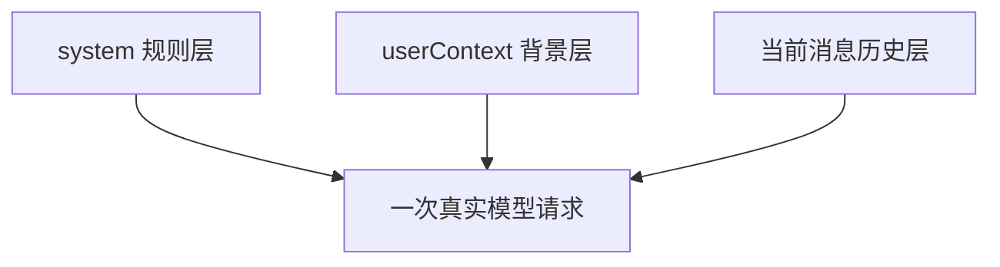

这是 Claude Code 和很多简单聊天程序很不一样的一点。

它不是把所有东西糊成一段 prompt，而是明显在保留层次。

---

# 第九部分：在这个最小例子里，主循环大概率不会触发工具调用

现在到一个关键分叉点。

模型开始处理这句话之后，会流式返回 assistant 内容。

在我们这次选的例子里，主线假设它：

- 不会主动调用工具

那就意味着这轮主循环会走最简单的一条路：

1. 开始采样
2. 收到 assistant 输出
3. 没有 `tool_use`
4. 进入结束判定
5. 收口返回

这里要特别说明一个点：

> **没有工具调用，不代表没有主循环。**

很多人一说 Claude Code 内部流程，就以为一定要看到：

- tool_use
- tool_result
- 多轮续转

其实不是。

就算完全没有工具调用，Claude Code 依然已经完整跑过了一轮主链：

- QueryEngine 装配
- 输入分流
- prompt 组装
- query 主循环
- 结果治理

只是这次走的是最干净的一条收口路径。

---

## 图 9：这个例子在主循环里的最简单闭环

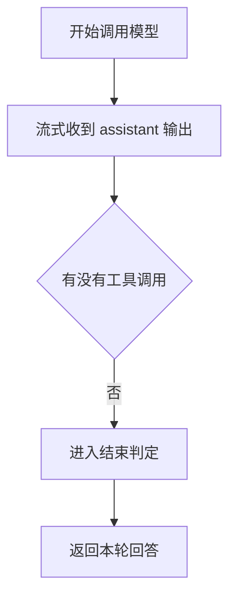

所以你可以把这个例子理解成：

> **一轮没有工具分叉的 QueryEngine 主链演示。**

---

# 第十部分：模型给出回答后，还要经过 QueryEngine 的治理层，才变成用户最终看到的结果

到了这里，很多人会自然地认为流程结束了。

其实还差最后一步。

因为 `query(...)` 负责的是：

> **把模型输出这条消息流跑出来。**

但 `QueryEngine` 还要负责：

- 消费这条消息流
- 记录 transcript
- 统计 usage
- 维护 `mutableMessages`
- 抽取 stop reason
- 组装最终 result

也就是说，模型输出并不是直接“掉到用户面前”的。

中间还要经过一层：

> **会话治理层。**

这也是为什么我一直觉得：

- `query(...)` 像“引擎”
- `QueryEngine` 像“总装 + 会话治理”

这个分工特别重要，不能混在一起理解。

---

## 图 10：从模型输出到用户看到回复，中间还隔着一层治理

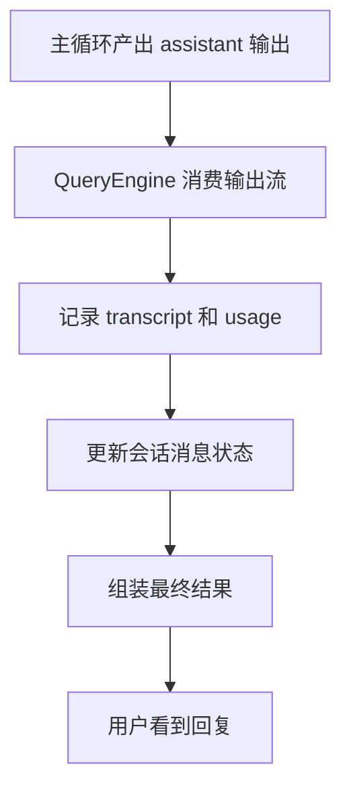

所以最后返回给用户的，不只是“模型说了什么”，
而是：

> **被系统整理过、归档过、挂回会话状态之后的结果。**

---

# 用一句更通俗的话，把这个例子完整串起来

现在可以把整篇压成一个更通俗的版本。

用户新开一个会话，说：

> “你好，cc内部的处理流程是什么”

Claude Code 内部大致会这样跑：

1. **先把这次输入当成一轮新的任务入口**，由 `submitMessage(...)` 接住
2. **先搭好这轮运行环境**，包括模型、权限、会话状态、transcript 等
3. **准备 prompt 材料**，包括系统规则、用户背景、系统补充上下文
4. **把原始输入送进预处理层**，判断它是不是普通文本、命令、附件输入
5. **因为这次只是普通文本**，所以走 `processTextPrompt(...)`，把它变成标准用户消息
6. **这条用户消息先进入当前会话状态**，成为后续运行的基底
7. **系统立起这轮运行地图**，然后进入 `query(...)` 主循环
8. **真正调用模型**，把 system 层、背景层、消息层一起发出去
9. **如果没有工具调用**，这轮就直接进入结束判定并收口
10. **QueryEngine 再把输出整理成最终结果**，同时更新 transcript、usage 和会话状态

这一整套过程说明：

> **对用户来说，这只是发出一句话；对 Claude Code 来说，这已经是一轮完整的运行流程。**

---

## 图 11：这篇文章最该记住的一张总图

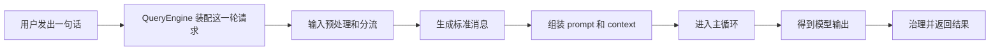

如果你之后把别的文章都忘了，至少把这张图留在脑子里。

因为它抓住了 QueryEngine 最本质的角色：

> **不是直接问模型，而是组织一轮完整交互。**

---

# 如果这句输入不是普通文本，会从哪里分叉？

这篇为了讲清主线，故意选了最简单场景。

但你最好顺手知道，真正复杂度都长在哪些分叉上。

## 分叉 1：如果输入是 `/command`
它就不会走普通文本路径，而会进：

- `processSlashCommand(...)`（处理 slash 命令）

然后再继续分成：

- 本地 UI 命令
- 本地执行命令
- prompt/skill 命令

这意味着：

> **slash 的复杂度发生在进入主循环之前。**

## 分叉 2：如果输入里带附件、图片、`@file`
那输入预处理阶段就会多出：

- 附件提取
- 消息补料
- 附件消息注入

这些内容最后不会作为独立第四路请求发出去，
而是会被翻译进消息层。

## 分叉 3：如果 assistant 触发了工具调用
那主循环就不会在第一轮收口，
而会进入：

- tool use
- tool result
- 下一轮续转

这时 Claude Code 就从“单轮问答”变成“多轮执行”。

---

## 图 12：这条主链最常见的几个分叉点

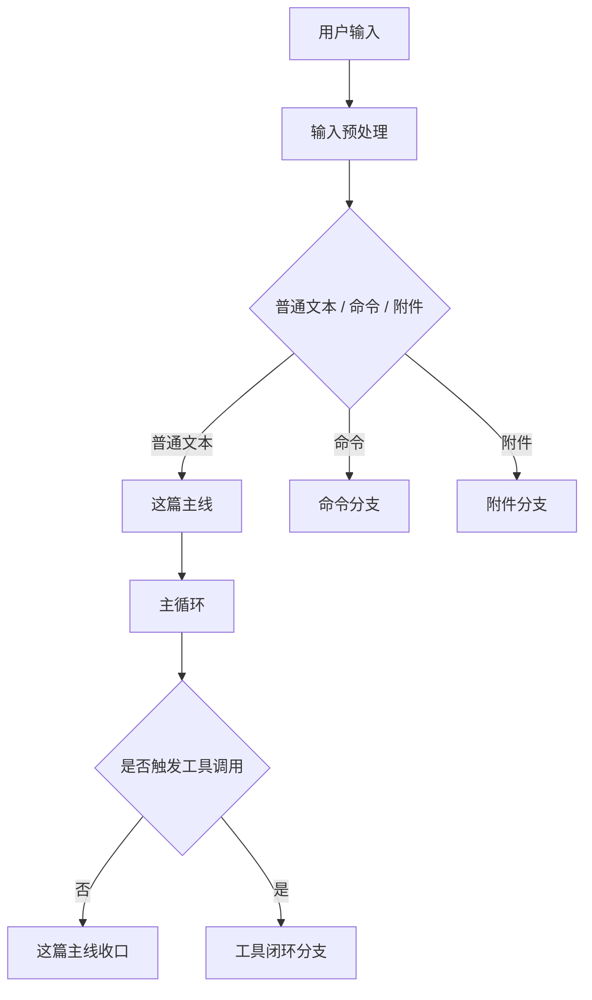

这张图最想说明的是：

> **你现在看到的是主链中轴线，真正的复杂度来自沿线分叉。**

---

# 这篇最想保住的判断

如果把整篇收成一句最重要的话，我会留：

> **用户在新会话里说出第一句话时，Claude Code 内部并不是把文本直接发给模型，而是先由 QueryEngine 把它包装成一轮完整 turn：准备运行状态、处理输入、生成消息、组装 prompt/context、启动主循环，再把输出整理成最终回复。**

这句话里最重要的几个点是：

- **不是直接发文本**
- **而是包装成一轮 turn**
- **先装配，再执行，再治理**

这就是 QueryEngine 最值得记住的地方。

---

# 我现在对 QueryEngine 主链的最短总结

如果只留一句最短的话，我会留：

> **QueryEngine 主链做的事，不是“帮用户问模型一个问题”，而是把用户的一次输入组织成一轮完整可运行、可记录、可继续推进的系统回合。**

---

# 这篇最值得记住的几个判断

### 判断 1：用户发出的第一句普通文本，在 Claude Code 内部不是直接去模型，而是先进入一轮新的 turn 装配流程

### 判断 2：`submitMessage(...)`（提交一轮用户消息）做的第一件事不是处理文本，而是准备本轮运行骨架

### 判断 3：`processUserInput(...)`（输入预处理/分流）负责先判断这次输入属于哪种类型，在这个例子里才会落到普通文本路径

### 判断 4：`processTextPrompt(...)`（把普通文本变成标准消息）真正完成了“字符串 → 用户消息对象”的转换

### 判断 5：真正发给模型的不是裸问题，而是 system 规则层、背景层、消息层共同组成的一次请求

### 判断 6：`query(...)`（主循环）负责驱动模型工作，而 `QueryEngine` 负责把这条输出流治理成最终会话结果，这两层不能混成一层理解

---

# 下一步最顺怎么接

如果继续沿这种“通俗例子串主链”的写法往下写，我觉得最顺有两个方向：

### 方向 A：写 attachment 版本
比如：
> “你好，帮我看看 `@src/QueryEngine.ts` 的主流程”

这样可以顺手把：
- 附件提取
- 附件消息注入
- 消息归一化
- 最终请求组装

也再串一遍。

### 方向 B：写 tool-use 版本
比如：
> “你好，帮我读一下 QueryEngine.ts，然后告诉我主流程”

这样就能把：
- assistant 首轮触发工具
- 工具结果回流
- 第二轮续转

完整讲出来。

如果只选一个，我会更倾向 **方向 B**。

因为这篇已经把“无工具的最小主线”讲清了，下一篇如果补“带工具的真实闭环”，两篇会正好成对。