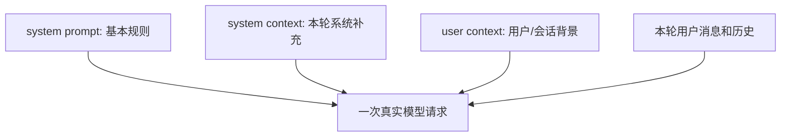
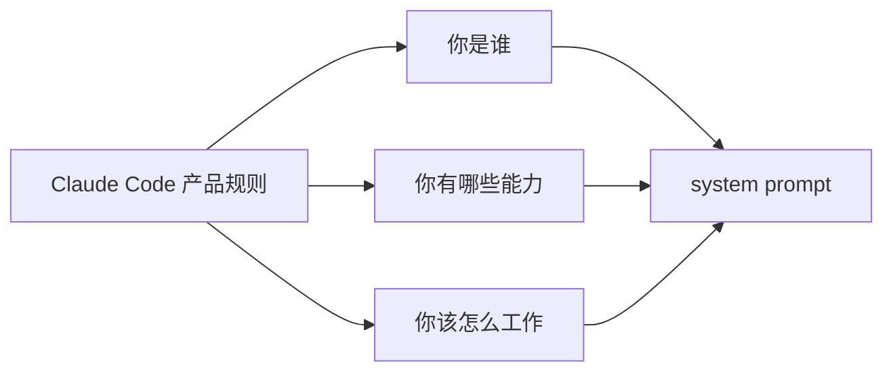
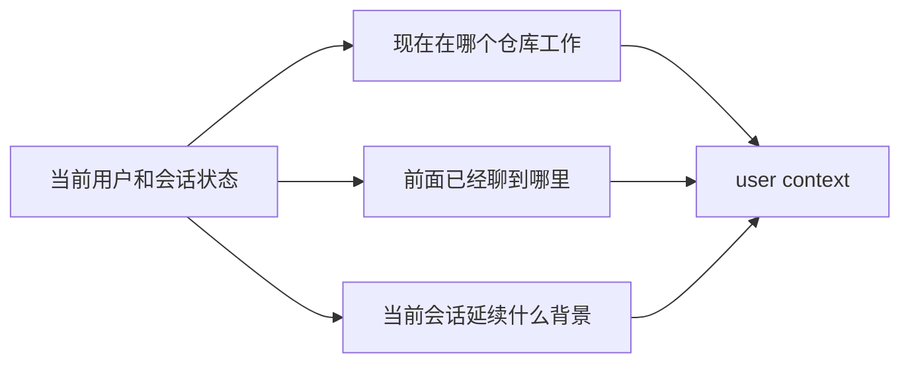
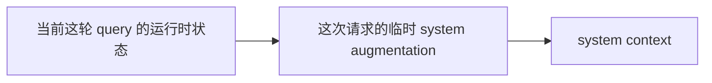
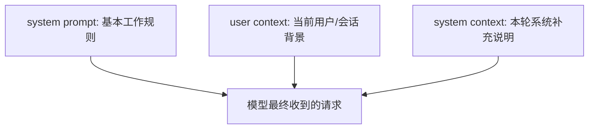

# Claude Code 源码共读笔记 48：system prompt、用户上下文、系统上下文，分别是什么

## 这篇看什么

前面几篇在讲 QueryEngine 主链时，反复出现了三个词：

- `systemPrompt`
- `userContext`
- `systemContext`

如果你已经顺着源码往下读了一段，会知道 Claude Code 最终发请求时，不是只带一段 prompt 和一串 messages，而是会把这几层东西分开组织。

但如果只停在这个层面，还是很容易有个困惑：

> **这三个东西到底分别是什么？它们都算“上下文”，为什么不合在一起？**

再进一步，很多人在真正使用 Claude Code 时还会自然问到另一个问题：

> **那 `CLAUDE.md` 又属于哪一层？**

这篇我就不再抽象讲“规则层 / 背景层 / 历史层”了，而是直接用 **实际使用 Claude Code 时会遇到的例子** 来拆。

因为这类问题，如果只用术语解释，很容易越解释越虚。

我想把它压成一句很直接的话：

> **这三者的差别，不在于它们是不是“上下文”，而在于它们分别回答三个不同问题：你该怎么工作、你现在在什么背景里工作、你这次请求临时还带了什么系统补充。**

我觉得这样最好记。

---

## 先给一个最短结论

如果只先记一句话，我建议记这个：

- **system prompt**：规定“你应该怎么工作”
- **user context**：补充“你现在是在什么用户/会话背景里工作”
- **system context**：补充“你这次请求还有哪些系统侧临时说明”

如果再压缩一点：

> **system prompt 是规则，user context 是背景，system context 是本轮补充说明。**

而 `CLAUDE.md`，最接近的归类就是：

> **system prompt 这一层里的项目级补充规则。**

---

# 先用一个真实使用 Claude Code 的场景串起来

假设你真的在 Claude Code 里工作。

你打开一个仓库，然后输入：

> 帮我读一下 `src/query.ts`，告诉我主循环是怎么跑的

从用户视角看，这只是你打出的一句话。

但 Claude Code 最终发给模型的，绝对不只是这一句。

粗暴一点说，模型实际看到的输入更像下面四层：

1. **system prompt**
2. **system context**
3. **user context**
4. **你刚刚输入的这句话 + 当前会话历史**

也就是说，你在界面里只看见一条用户输入，
但模型眼里的工作现场其实已经提前被铺好了。

---

## 图 1：同一句用户输入，模型眼里其实有四层材料

这张图最重要的作用，就是先打掉一个误解：

> **用户输入不等于模型输入。**

用户输入只是模型输入里最显眼的一层，但绝不是全部。

---

# 第一部分：system prompt 是什么

## 人话版定义

system prompt 就是：

> **Claude Code 每次开始工作前都要先读的一份“系统说明书”或“工作手册”。**

它回答的是：

> **你是谁？你能做什么？你该怎么做？**

所以它更像“基本规则”，而不是一次会话里的临时背景。

---

## 一个实际使用 Claude Code 的例子

还是刚才那个场景：

你在 Claude Code 里输入：

> 帮我读一下 `src/query.ts`，告诉我主循环是怎么跑的

在你这句话之前，模型其实已经先读过一大段产品级说明。里面会包含类似这样的意思：

- 你是 Claude Code
- 你工作在终端/代码仓库里
- 你可以使用读文件、改文件、执行命令等工具
- 你要遵守某些输出格式和行为规则
- 什么时候应当直接行动，什么时候应当保守一点
- 某些情况下路径、命令、回答风格要怎么写

这些内容不是你这个仓库特有的，也不是你这轮临时提问才生成的。

它们是：

> **Claude Code 这个产品本身就带着的工作规则。**

所以这就是 system prompt。

---

## 为什么它不属于 user context 或 system context

因为它不是：

- 当前用户独有的背景
- 当前会话临时生成的补充信息
- 某次 query 才有的额外说明

它是更稳定、更基础的那层东西。

所以最短地说：

> **system prompt 是“长期有效的基本工作规则”。**

---

## 图 2：system prompt 在实际使用里最像什么

---

# 第二部分：`CLAUDE.md` 属于哪一层

这个问题单独说清很重要。

## 结论先讲

`CLAUDE.md` 最接近：

> **system prompt 这一层里的项目级补充规则。**

也就是说，它不是 user context，也不是 system context。

它仍然属于“规则层”。

---

## 为什么这么说

因为 `CLAUDE.md` 里通常写的不是：

- 你这轮会话正在聊什么
- 当前用户之前干了什么
- 这一轮请求临时多了什么系统说明

它更常写的是：

- 在这个仓库里优先读哪些目录
- 提交前要不要先跑测试
- 用 `pnpm` 还是 `npm`
- 哪些文件不要改
- 哪些 generated 文件要跳过
- 项目里的分层约定是什么

这些内容的本质是：

> **在这个代码库里，Claude Code 应该遵守什么工作规则。**

这和产品级 system prompt 的差别只是范围不同：

- 产品级 system prompt：对所有仓库都成立
- `CLAUDE.md`：只对这个仓库成立

但它们都属于“规则层”。

所以我更愿意把 `CLAUDE.md` 理解成：

> **system prompt 的仓库本地扩展。**

---

## 一个实际例子

比如某个仓库的 `CLAUDE.md` 写着：

- 改代码前先看 `docs/architecture.md`
- 只用 `pnpm`
- 不要改 `generated/`
- 提交前运行 `pnpm test`

你在 Claude Code 里输入：

> 帮我修一下首页白屏问题

模型在正式思考你的问题前，系统很可能已经把这些规则当成“工作规则”喂给它了。

这显然不是 user context，也不是 system context。

它本质上还是：

> **规则层输入。**

---

# 第三部分：user context 是什么

## 人话版定义

user context 就是：

> **跟当前用户、当前会话、当前工作现场有关的背景信息。**

它回答的是：

> **你现在是在什么背景里工作？**

注意，这里的“用户”不是指“用户刚才说的那句话”。

它更像是：

- 这个人现在在哪个仓库里工作
- 这个会话前面聊到哪里了
- 当前正在延续哪条上下文
- 当前会话有什么背景信息值得前置给模型

所以它不是“规则”，而是“背景”。

---

## 一个实际使用 Claude Code 的例子

假设你在 Claude Code 里连续做了几轮操作：

第一轮你说：
> 帮我读一下 `QueryEngine.ts`

第二轮你说：
> 再看看 `query.ts`

第三轮你说：
> 那你继续看一下 `processUserInput`

到了第三轮时，你其实没有重复说很多背景信息，比如：

- 我们还在 `openclaw/openclaw` 仓库里
- 前面已经读过 `QueryEngine.ts`
- 现在是在这条讨论上下文里继续往下走

这些东西如果系统完全不补，模型当然也能从历史消息里猜一部分，
但 Claude Code 往往会明确把一部分背景作为 user context 这类前置信息组织好。

所以它更像：

> **当前会话的背景板。**

---

## 为什么它不属于 system prompt

因为它不是“你应该怎么工作”的规则。

它不会说：

- 你必须先读文件
- 你要遵守什么产品规则
- 输出风格如何

它只是在说：

- 你现在在哪个工作现场里
- 当前讨论延续到哪里了
- 这次回答最好别脱离当前会话背景

所以它不是规则，而是背景。

---

## 为什么它也不属于 system context

因为它不是“这次 query 临时多出来的一层系统补充说明”。

它更偏向：

- 当前用户和当前会话的长期连续背景

所以最短地说：

> **user context 是“用户/会话背景层”。**

---

## 图 3：user context 最像什么

---

# 第四部分：system context 是什么

## 人话版定义

system context 就是：

> **系统在这一次真实请求发出去前，临时追加给模型的系统侧补充说明。**

它回答的是：

> **这次请求，还有哪些系统层面的临时说明？**

关键词是：

- 系统侧
- 临时追加
- 针对当前 query

所以它既不像 system prompt 那么基础稳定，
也不像 user context 那样偏用户/会话背景。

---

## 一个实际使用 Claude Code 的例子

假设你还是在 Claude Code 里输入：

> 帮我读一下 `src/query.ts`，告诉我主循环是怎么跑的

在真正发请求前，系统可能还会加上一些本轮运行时才有的补充信息。

这类内容的特点是：

- 不是整个产品永远都成立的规则
- 也不是用户/会话的长期背景
- 而是这次 query 当前环境、当前模式、当前运行状态附带的 system augmentation

如果用人话比喻，它更像：

> **考试前临时贴在黑板上的补充通知。**

不是学校校规，
也不是学生档案，
而是“这场考试临时多了一条说明”。

---

## 为什么它不属于 system prompt

因为它不是“长期稳定的基本规则”。

它更像：

- 这一轮临时补上的系统说明
- 当前环境派生出来的附加提示

所以它比 system prompt 更“运行时”。

---

## 为什么它也不属于 user context

因为它也不是当前用户/当前会话的背景。

它不是在说：

- 你之前聊过什么
- 你现在在什么仓库里
- 这是哪个用户

它是在说：

- 这一次请求，系统额外补了什么

所以最短地说：

> **system context 是“本轮系统补充说明层”。**

---

## 图 4：system context 最像什么

---

# 第五部分：把这三者放进一个真实 Claude Code 请求里看

现在我们把它们放回一个真实使用例子里。

你在 Claude Code 里输入：

> 帮我读一下 `src/query.ts`，告诉我主循环是怎么跑的

模型收到的材料，大致可以这样理解：

## 1. system prompt
像这样：

- 你是 Claude Code
- 你有读文件/改文件/执行命令等能力
- 你要遵守终端编程助手的工作规则
- 这个仓库里还有 `CLAUDE.md` 规定的项目规则

这一层回答的是：

> **你该怎么工作。**

---

## 2. user context
像这样：

- 当前工作目录在这个仓库
- 当前会话前面已经读过哪些文件
- 现在是沿着哪条讨论上下文继续往下走

这一层回答的是：

> **你现在是在什么背景里工作。**

---

## 3. system context
像这样：

- 当前这轮 query 的系统侧额外补充说明
- 当前环境/当前模式派生出来的附加 system notes

这一层回答的是：

> **这次请求还有哪些系统层临时说明。**

---

## 4. 你刚输入的话
最后才是：

> 帮我读一下 `src/query.ts`，告诉我主循环是怎么跑的

也就是说，模型不是单独看到你这句话，
而是在一个已经被铺好的工作现场里看这句话。

---

## 图 5：一次真实 Claude Code 请求里的三层输入

---

# 第六部分：为什么 Claude Code 不把它们全揉成一段大 prompt

这个问题也值得顺手讲清。

如果全都揉成一段 prompt，会有什么问题？

## 1. 语义容易糊
模型很难区分：

- 哪些是长期规则
- 哪些是当前会话背景
- 哪些是本轮临时说明

## 2. 结构不好维护
如果所有东西都堆成一段大字符串，
那后面要单独追加、单独替换、单独前置，就会变得很笨重。

## 3. 稳定性也差
像 system prompt 这种层，一般比 message/history 层更敏感。
把不该放进去的东西都塞进去，整体结构就会更不稳定。

所以 Claude Code 的做法其实很成熟：

> **先拆出不同语义层，再按层组装。**

这就是为什么会有：

- system prompt
- user context
- system context

这三个看起来相似、其实职责不同的层。

---

# 这一篇最想保住的判断

如果把整篇压成一句最关键的话，我会留：

> **system prompt、user context、system context 的差别，不在于它们是不是“上下文”，而在于它们分别在回答三个不同问题：你该怎么工作、你现在在什么背景里工作、你这次请求还带了什么系统补充。**

而 `CLAUDE.md`，最合适的归类就是：

> **system prompt 这一层里的项目级规则补充。**

---

# 我现在对这三者的最短总结

如果只留一句最短的话，我会留：

> **system prompt 是规则，user context 是背景，system context 是本轮系统补充；`CLAUDE.md` 属于规则层，不属于背景层。**

---

# 这篇最值得记住的几个判断

### 判断 1：system prompt 负责定义 Claude Code 的基本工作规则，所以它最像“系统说明书”或“工作手册”

### 判断 2：`CLAUDE.md` 最接近 system prompt 这一层里的项目级补充规则，而不是用户背景或本轮临时说明

### 判断 3：user context 负责补充当前用户/当前会话的背景信息，所以它最像“当前工作现场的背景板”

### 判断 4：system context 负责补充当前这轮 query 的系统侧临时说明，所以它比 system prompt 更运行时、比 user context 更系统侧

### 判断 5：Claude Code 之所以把这三层拆开，是为了保留规则、背景、临时补充三种不同语义，而不是把一切揉成一段大 prompt

---

# 下一步最顺怎么接

如果继续沿这条“把抽象概念讲实”的写法往下写，我觉得最顺有两个方向：

### 方向 A：写一篇“真正发给模型的一次请求长什么样”的极简图解版
把：
- system prompt
- `CLAUDE.md`
- user context
- system context
- 当前消息历史

这几层放到一张图里彻底讲透。

### 方向 B：写一篇“为什么 `CLAUDE.md` 更像系统规则，而不是用户输入”的短文
直接专门拆很多人最容易混淆的这一点。

如果只选一个，我会更倾向 **方向 A**。

因为这样刚好能把这篇里讲的三个概念再落回真正请求的整体结构里。