# Claude Code 源码共读笔记 49：主循环术语表——从 QueryEngine 到 context reduction 的一张词汇地图

## 这篇看什么

前面从第 38 篇开始，我们其实已经连续把 Claude Code 主线程主链拆开读了一遍：

- 38：`QueryEngine.submitMessage(...)`
- 39：`query(...)`
- 40：`processUserInput(...)`
- 41：`getAttachmentMessages(...)`
- 42：`normalizeMessagesForAPI(...)`
- 43：system prompt / userContext / systemContext
- 44：context reduction pipeline
- 45：context collapse
- 46 / 47：用一个新会话例子把主链串起来
- 48：system prompt、用户上下文、系统上下文三者区别

读到这一步，通常会进入一个新阶段：

> **不是看不懂流程，而是词太多、概念太密、容易在脑子里串线。**

比如这些词，单拿出来好像都认识，但一放到主循环里就容易糊：

- `QueryEngine`
- `submitMessage`
- `query`
- `processUserInput`
- `messagesForQuery`
- `mutableMessages`
- `tool_use`
- `tool_result`
- `systemPrompt`
- `userContext`
- `systemContext`
- `normalizeMessagesForAPI`
- `compact boundary`
- `context collapse`
- `autocompact`

所以这篇不继续拆新文件，而是做一件更实用的事：

> **把前面 38-48 篇已经出现的高频术语，整理成一张“主循环词汇地图”。**

你可以把这篇当成：

- 后面继续读源码时的索引页
- 回头复习主链时的对照表
- 遇到新名词时先落位的参考坐标

这篇的目标不是给每个词写最完整百科，而是先回答三个问题：

1. 这个词在 Claude Code 里是什么意思
2. 它在主链的哪一层
3. 最容易和哪个词混

---

## 先给主结论

如果只先记一句话，我建议记这个：

> **Claude Code 主线程主链可以粗分成五层：入口层、输入分流层、请求组装层、query 主循环层、上下文治理层；大多数高频术语，其实都是这五层里的“定位词”。**

再压缩一点，就是：

- `QueryEngine`：入口和会话治理
- `processUserInput`：输入分流
- `systemPrompt/userContext/systemContext`：请求组装
- `query`：主循环
- `compact/collapse/autocompact`：上下文治理

所以这篇术语表最核心的工作，不是背定义，而是：

> **先把每个词放回它所在的层。**

只要层次不乱，大多数词都不会混得太离谱。

---

## 先把总图立住：主线程主链的五层词汇地图

```mermaid
flowchart TD
    A[入口层] --> A1[QueryEngine]
    A --> A2[submitMessage]
    A --> A3[mutableMessages]

    B[输入分流层] --> B1[processUserInput]
    B --> B2[processSlashCommand]
    B --> B3[processTextPrompt]
    B --> B4[getAttachmentMessages]

    C[请求组装层] --> C1[systemPrompt]
    C --> C2[userContext]
    C --> C3[systemContext]
    C --> C4[messagesForQuery]
    C --> C5[normalizeMessagesForAPI]

    D[query 主循环层] --> D1[query]
    D --> D2[tool_use]
    D --> D3[tool_result]
    D --> D4[needsFollowUp]

    E[上下文治理层] --> E1[compact boundary]
    E --> E2[snip]
    E --> E3[microcompact]
    E --> E4[context collapse]
    E --> E5[autocompact]
```

这张图不是精确源码依赖图，而是一张更适合人脑记忆的“定位图”。

你后面只要先问自己：

> 这个词属于哪一层？

很多混乱会立刻少一半。

---

# 第一组：入口层术语

## 1. QueryEngine

### 它是什么
`QueryEngine` 是 Claude Code 主线程 query 的**运行时总装配器**。

### 它主要干什么
它负责把一次用户输入组织成一轮完整的主线程 turn，包括：

- 准备本轮状态
- 调输入分流层
- 组装 prompt/context
- 启动 `query(...)`
- 消费消息流
- 记录 transcript / usage / result

### 最容易和谁混
最容易和 `query(...)` 混。

### 区别一句话
- `QueryEngine`：组织整轮交互
- `query(...)`：驱动模型-工具-消息闭环

### 最短记法
> **QueryEngine 是总装，不是主循环本身。**

---

## 2. submitMessage(...)

### 它是什么
`QueryEngine` 上最关键的入口函数。

### 它主要干什么
用户一次输入真正“进入 Claude Code 主线程”的入口，就是它。

它做的不是简单 submit 一条文本，而是：

- 起 turn
- 准备 prompt 零件
- 处理输入
- 写入活动消息状态
- 进入 query
- 收口结果

### 最容易和谁混
和“发送给模型”这个动作混。

### 区别一句话
`submitMessage(...)` 不是模型 API 调用，而是**一次用户请求进入主线程 runtime 的入口**。

### 最短记法
> **submitMessage 是 turn 入口，不是裸 prompt 提交。**

---

## 3. mutableMessages

### 它是什么
当前主线程会话里那份**还在增长中的活动消息数组**。

### 它主要干什么
它承载当前会话状态。

后面很多东西都围着它转：

- 新用户消息先写进来
- assistant 消息继续追加
- transcript 基于它持久化
- compact boundary 会裁剪它
- query 会基于它的投影视图继续往下跑

### 最容易和谁混
和 `messagesForQuery` 混。

### 区别一句话
- `mutableMessages`：会话里的活状态
- `messagesForQuery`：这一轮真正送进模型的投影视图

### 最短记法
> **mutableMessages 是仓库，messagesForQuery 是出库清单。**

---

# 第二组：输入分流层术语

## 4. processUserInput(...)

### 它是什么
query 前的**输入路由层**。

### 它主要干什么
把用户原始输入转成“Claude Code 可执行的输入类型”，并决定要不要真的进入 query。

它会处理：

- 普通文本
- slash 命令
- bash 模式
- 图片/附件
- hooks 审核

### 最容易和谁混
和 `processTextPrompt(...)` 混。

### 区别一句话
- `processUserInput(...)`：总分流器
- `processTextPrompt(...)`：普通文本支路

### 最短记法
> **processUserInput 负责判断“这是什么输入”。**

---

## 5. processSlashCommand(...)

### 它是什么
slash 命令分支的处理器。

### 它主要干什么
把 `/xxx` 这类输入分成不同执行语义：

- `local-jsx`
- `local`
- `prompt`

也就是说，slash 并不是一种东西，而是一个门牌，里面分很多命运。

### 最容易和谁混
和 skill 本身混。

### 区别一句话
`processSlashCommand(...)` 处理的是“slash 命令入口”，不是 skill 体系的全部。

### 最短记法
> **slash 是入口，skill 只是其中一条支路会接到的能力。**

---

## 6. processTextPrompt(...)

### 它是什么
普通文本输入的处理支路。

### 它主要干什么
把用户输入的普通文本铸造成标准 `UserMessage`。

如果有图片/附件，也会在这一层把它们跟文本拼进规范消息里。

### 最容易和谁混
和 `processUserInput(...)` 混。

### 区别一句话
它不是总路由器，而是“普通文本那条最薄的路径”。

### 最短记法
> **processTextPrompt 负责把 string 变成标准用户消息。**

---

## 7. getAttachmentMessages(...)

### 它是什么
附件提取层。

### 它主要干什么
把输入中的文件引用、提醒信息、某些资源引用等，转换成 attachment messages。

关键点不是“读附件”，而是：

> **把附件类输入翻译成消息协议里可继续流动的东西。**

### 最容易和谁混
和最终请求里的“独立附件通道”混。

### 区别一句话
attachment 最终不是独立第四路 transport，而是会被吃进 messages 层。

### 最短记法
> **attachment messages 是附件进消息世界的翻译层。**

---

# 第三组：请求组装层术语

## 8. systemPrompt

### 它是什么
规则层。

### 它主要干什么
定义 Claude Code 应该怎么工作，包括：

- 系统基本规则
- 平台行为约束
- agent / coordinator / custom prompt
- 项目规则补充（比如 `CLAUDE.md` 这类）

### 最容易和谁混
和 `userContext`、`systemContext` 混。

### 区别一句话
- `systemPrompt`：规则
- `userContext`：背景
- `systemContext`：本轮系统补充

### 补一句
`CLAUDE.md` 最接近 system prompt 这一层里的**项目级补充规则**。

### 最短记法
> **systemPrompt 回答“你该怎么工作”。**

---

## 9. userContext

### 它是什么
用户/会话背景层。

### 它主要干什么
补充当前用户和当前会话的背景信息。

比如：

- 当前会话前面聊到哪里
- 当前工作背景是什么
- 某些对这次继续推理有帮助的用户/会话信息

### 最容易和谁混
和 `systemPrompt` 混，尤其容易被误解成“也是规则”。

### 区别一句话
它不是规则，而是背景；而且它通常会 prepend 到 messages 一侧，而不是进 system prompt。

### 最短记法
> **userContext 回答“你现在在什么背景里工作”。**

---

## 10. systemContext

### 它是什么
本轮系统补充层。

### 它主要干什么
在真正发请求前，为这次 query 追加系统侧临时说明。

它不是最底层长期规则，也不是用户背景，而是：

- per-query
- per-turn
- system-side augmentation

### 最容易和谁混
和 `systemPrompt` 混。

### 区别一句话
- `systemPrompt` 更像长期工作手册
- `systemContext` 更像这次请求临时多贴的一张系统通知

### 最短记法
> **systemContext 回答“这次请求系统临时还补了什么”。**

---

## 11. messagesForQuery

### 它是什么
这一次真正送进模型的消息历史投影视图。

### 它主要干什么
在每轮 query 前，把当前消息状态整理成“适合本轮继续推理”的版本。

它通常已经经历过：

- compact boundary 之后截断
- tool result budget 控制
- snip
- microcompact
- context collapse
- autocompact

### 最容易和谁混
和 `mutableMessages` 混。

### 区别一句话
`messagesForQuery` 不是完整 transcript，也不是当前会话活状态，而是**本轮送模的投影版历史**。

### 最短记法
> **messagesForQuery 是“给模型看的历史”，不是“会话里全部真实历史”。**

---

## 12. normalizeMessagesForAPI(...)

### 它是什么
消息协议边界层。

### 它主要干什么
把 Claude Code 内部 transcript / message 结构，整理成真正适合模型 API 的消息格式。

这一步非常关键，因为很多内部结构——尤其是 attachment、tool use/result、某些 meta 消息——都要在这里被翻译成模型接口认识的形式。

### 最容易和谁混
和“消息历史本身”混。

### 区别一句话
它不是维护会话历史，而是把内部消息协议**规范化成 API 请求格式**。

### 最短记法
> **normalizeMessagesForAPI 是内外消息协议的边界翻译器。**

---

# 第四组：query 主循环层术语

## 13. query(...)

### 它是什么
Claude Code 主线程里真正驱动“模型采样 → 工具执行 → 再续转/收口”的主循环。

### 它主要干什么
它不是一次单发模型调用，而是一个闭环：

1. 准备本轮 messages/prompt
2. 调模型
3. 看 assistant 有没有产出 `tool_use`
4. 有就执行工具并回流 `tool_result`
5. 没有就进入收口判定

### 最容易和谁混
和 `QueryEngine` 混。

### 区别一句话
- `QueryEngine`：整轮装配和治理
- `query(...)`：循环驱动器

### 最短记法
> **query 是引擎，不是整车。**

---

## 14. tool_use

### 它是什么
assistant 消息里声明“我要调用某个工具”的 block。

### 它主要干什么
它是模型把工作委托给工具的正式表达。

Claude Code 主循环判断要不要继续下一轮，核心看的是：

> assistant 输出里有没有真实出现 `tool_use`

### 最容易和谁混
和 stop reason 混。

### 区别一句话
Claude Code 更信“消息里有没有 `tool_use`”，不完全信供应商 `stop_reason === tool_use`。

### 最短记法
> **tool_use 是模型把活交给工具的正式单据。**

---

## 15. tool_result

### 它是什么
对某个 `tool_use` 的结果回执。

### 它主要干什么
把工具执行结果重新接回消息流，让下一轮模型继续工作。

### 最容易和谁混
和普通 assistant 文本混。

### 区别一句话
普通 assistant 文本是模型自己说的话；`tool_result` 是工具执行回来的结构化反馈。

### 最短记法
> **tool_result 是 tool_use 的回单。**

---

## 16. tool_use / tool_result pairing

### 它是什么
工具调用配对约束。

### 它主要干什么
确保每个 `tool_use` 最终都能找到对应的 `tool_result`。

这是 Claude Code 很执着的一条底层不变量，因为一旦失配，后面会出很多灾难：

- orphaned tool call
- duplicate tool_use_id
- resume 异常
- API 报错

### 最容易和谁混
和“只是 UI 展示问题”混。

### 区别一句话
这不是美观问题，而是 runtime 正常运转的基础协议约束。

### 最短记法
> **tool_use 不允许悬空。**

---

## 17. needsFollowUp

### 它是什么
query 主循环里判断“这一轮还要不要继续”的关键闸门之一。

### 它主要干什么
通常只要 assistant 这一轮产出了 `tool_use`，就会认为需要 follow-up。

### 最容易和谁混
和“模型有没有说完”混。

### 区别一句话
Claude Code 判断要不要继续，不是单看模型文本结束，而是看有没有后续工具闭环要继续推进。

### 最短记法
> **needsFollowUp 不是语气判断，而是闭环判断。**

---

# 第五组：上下文治理层术语

## 18. compact boundary

### 它是什么
上下文压缩边界。

### 它主要干什么
告诉系统：从哪个点往前的历史，可以被更激进地压缩/投影；从哪个点往后的部分，需要更原样地保留。

### 最容易和谁混
和“直接改写 transcript”混。

### 区别一句话
compact boundary 更像是后续生成投影视图时的裁剪边界，不是把原始 transcript 全量改写掉。

### 最短记法
> **compact boundary 是压缩分界线。**

---

## 19. snip

### 它是什么
较轻的一种裁剪手段。

### 它主要干什么
在不完全重做结构的情况下，把上下文做局部截短或删减，以控制窗口压力。

### 最容易和谁混
和更重的 compact/collapse 混。

### 区别一句话
snip 更像剪一小刀，不是重写整段历史。

### 最短记法
> **snip 是轻量剪枝。**

---

## 20. microcompact

### 它是什么
比完整 compact 更轻的小型压缩。

### 它主要干什么
在需要控上下文，但又没到必须重压缩的时候，先做一层较小粒度的收缩。

### 最容易和谁混
和 autocompact 混。

### 区别一句话
microcompact 是压缩动作类型；autocompact 是自动触发策略的一部分。

### 最短记法
> **microcompact 是小压缩，不是自动策略名。**

---

## 21. context collapse

### 它是什么
读时投影式上下文折叠。

### 它主要干什么
把旧上下文在“给模型看”这一刻折叠成更短、更适合续推的版本。

关键点是：

> **它更像读时投影，不是改写 transcript 真身。**

### 最容易和谁混
和“直接重写会话历史”混。

### 区别一句话
collapse 主要改变的是送模视图，不是把原始历史物理擦掉重写。

### 最短记法
> **context collapse 是折叠视图，不是抹掉原文。**

---

## 22. autocompact

### 它是什么
自动触发的上下文压缩策略。

### 它主要干什么
当上下文压力达到某个程度时，系统自动做 compact，避免窗口爆掉。

### 最容易和谁混
和“任意一种压缩动作”混。

### 区别一句话
autocompact 说的是“什么时候自动压”，不只是“怎么压”。

### 最短记法
> **autocompact 是自动压缩机制，不是单个压缩算法名。**

---

# 第六组：最容易混的几组词，直接并排说清

## A. QueryEngine vs query(...)

- `QueryEngine`：一轮 turn 的总装 + 会话治理
- `query(...)`：这一轮内部真正驱动模型/工具闭环的主循环

一句话：

> **前者是总控，后者是引擎。**

---

## B. mutableMessages vs messagesForQuery

- `mutableMessages`：当前会话活动消息状态
- `messagesForQuery`：这一轮真正送进模型的投影视图

一句话：

> **前者是会话活仓库，后者是送模清单。**

---

## C. processUserInput vs processTextPrompt

- `processUserInput`：输入总分流层
- `processTextPrompt`：普通文本分支

一句话：

> **前者决定“走哪条路”，后者负责“普通文本怎么变成消息”。**

---

## D. systemPrompt vs userContext vs systemContext

- `systemPrompt`：规则
- `userContext`：背景
- `systemContext`：本轮系统补充

一句话：

> **规则、背景、补充说明，三者不是一回事。**

---

## E. attachment messages vs normalizeMessagesForAPI

- attachment messages：把附件类输入先翻进消息世界
- normalizeMessagesForAPI：再把内部消息协议翻成模型 API 协议

一句话：

> **前者是附件进内部消息世界，后者是内部消息世界出 API 世界。**

---

## F. compact boundary vs context collapse

- compact boundary：压缩边界
- context collapse：折叠视图动作

一句话：

> **一个定边界，一个做折叠。**

---

# 这一篇最想保住的判断

如果把整篇压成一句最重要的话，我会留：

> **Claude Code 主线程里的大多数高频术语，其实不是散落的黑话，而是五层主链里的“定位词”；只要先分清它属于入口、分流、组装、主循环还是上下文治理，很多概念自然就不会混。**

这句话里最关键的是：

- **不是零散黑话**
- **而是分层定位词**
- **先分层，再记定义**

我觉得这比硬背术语释义更有用。

---

# 我现在对这份术语表的最短总结

如果只留一句最短的话，我会留：

> **读 Claude Code 主链时，先别急着逐个背词；先把词放回层次：QueryEngine 管入口，processUserInput 管分流，system/user/system context 管组装，query 管闭环，compact/collapse 管上下文治理。**

---

# 这篇最值得记住的几个判断

### 判断 1：`QueryEngine` 和 `query(...)` 不是同一层，一个是整轮 turn 的总装/治理层，一个是内部闭环驱动层

### 判断 2：`mutableMessages` 和 `messagesForQuery` 不是同一个东西，前者是活会话状态，后者是送模视图

### 判断 3：`processUserInput(...)` 是输入总路由，`processTextPrompt(...)` 只是普通文本支路

### 判断 4：`systemPrompt`、`userContext`、`systemContext` 分别对应规则、背景、本轮系统补充，`CLAUDE.md` 最接近规则层里的项目级补充

### 判断 5：`tool_use` / `tool_result` pairing 不是展示细节，而是 query 主循环成立的协议底座

### 判断 6：`compact boundary`、`snip`、`microcompact`、`context collapse`、`autocompact` 都属于上下文治理层，但职责并不相同：有的定边界，有的做轻裁剪，有的做读时折叠，有的负责自动触发

---

# 下一步最顺怎么接

如果继续沿这条线往下写，我觉得最顺有两个方向：

### 方向 A：做一篇“主循环时序图版”
把这份术语表里的词，按时间顺序真正串一次：

- 用户输入进来
- `submitMessage(...)`
- `processUserInput(...)`
- prompt 组装
- `query(...)`
- `tool_use / tool_result`
- compact / collapse
- 收口 result

这样术语表就能从“地图”变成“动画”。

### 方向 B：做一篇“最容易混的十组概念”
专门只讲对比，不再讲流程，比如：

- `QueryEngine` vs `query`
- `mutableMessages` vs `messagesForQuery`
- `systemPrompt` vs `userContext` vs `systemContext`
- `attachment messages` vs `normalizeMessagesForAPI`
- `compact boundary` vs `context collapse`

如果只选一个，我会更倾向 **方向 A**。

因为有了这篇第 49 篇术语表，再来一篇时序图版，第 38-49 这段主链就会更完整地闭成一个学习单元。