# Claude Code 源码共读笔记 50：主循环时序图版——一次用户输入是怎样穿过 QueryEngine 主链的

## 这篇看什么

前面这一串其实已经把 Claude Code 主线程主链拆得很细了：

- 第 38 篇讲入口：`QueryEngine.submitMessage(...)`
- 第 39 篇讲闭环：`query(...)`
- 第 40 篇讲输入分流：`processUserInput(...)`
- 第 43 篇讲请求组装：`systemPrompt / userContext / systemContext`
- 第 44-45 篇讲上下文治理：compact / collapse
- 第 49 篇又把高频术语收成了一张词汇地图

到这一步，脑子里通常会进入另一个卡点：

> **词都认识了，层次也知道了，但一按时间顺序去想，还是容易乱。**

比如很容易在脑子里把下面这些顺序想反：

- 到底是先 `processUserInput(...)` 还是先组 prompt？
- `mutableMessages` 和 `messagesForQuery` 先后是什么关系？
- `tool_use` 出现之后，`tool_result` 是怎么接回来的？
- compact / collapse 到底发生在 query 前、中、还是后？

所以这篇不再新增概念，而是专门做一件事：

> **把前面 38-49 篇已经讲过的东西，按“真正执行顺序”重新串一遍。**

你可以把这篇当成：

- 第 49 篇术语表的动态版
- 第 46 / 47 篇例子文的结构升级版
- 后面继续读源码时的一张主循环时序参照图

这篇的目标不是讲更多概念，而是回答一个非常具体的问题：

> **当用户在 Claude Code 里输入一句话时，这句话到底按什么顺序穿过 QueryEngine 主链？**

---

## 先给主结论

如果只先记一句话，我建议记这个：

> **一次用户输入穿过 Claude Code 主线程主链时，大致会依次经过六步：入口装配 → 输入分流 → 会话状态更新 → 请求组装 → query 闭环推进 → 结果治理收口。**

再压缩一点，就是：

1. `submitMessage(...)` 接住输入
2. `processUserInput(...)` 判断它是什么
3. 新消息写进 `mutableMessages`
4. 组装 `systemPrompt + userContext + messagesForQuery`
5. `query(...)` 跑模型/工具闭环
6. `QueryEngine` 把输出治理成最终结果

如果脑子里先有这六步，前面很多术语就都能落位。

---

## 先把总图立住：主线程主链的最小时间顺序

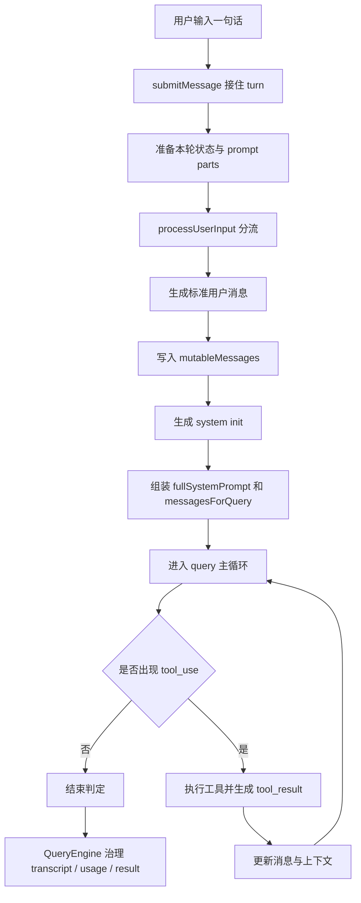

这张图其实就是整篇的总摘要。

你后面如果只记住一张图，我建议就记这张。

---

# 第一幕：用户输入进来，先不是去模型，而是先进入 turn 入口

假设用户在 Claude Code 里输入：

> 帮我读一下 `src/query.ts`，告诉我主循环是怎么跑的

在人的直觉里，这像是“把一句话发给模型”。

但在 Claude Code 主线程里，这句话首先进入的是：

- `QueryEngine.submitMessage(...)`

这一步最关键的意义不是“拿到文本”，而是：

> **系统正式承认：一轮新的 turn 开始了。**

也就是说，从这一步开始，Claude Code 不再把这看成一个普通字符串，
而是把它看成：

- 一轮新的主线程交互
- 一次需要被记录、推进、治理的运行单位

### 这一幕里主要发生什么

在真正处理输入前，`submitMessage(...)` 会先搭这一轮的地基，比如：

- 当前用哪个 model
- 当前 thinking config 是什么
- 当前 cwd 是什么
- 当前权限判定怎么做
- transcript 持久化状态怎么准备
- `mutableMessages` 当前长什么样

这一步特别像：

> **先把舞台搭好，再让演员上场。**

如果这里直接跳过，你后面就会很容易误把 Claude Code 看成一个 stateless API wrapper。

它不是。

它是一套“有会话状态的 turn runtime”。

---

## 图 1：主循环时序的起点，不是 callModel，而是 submitMessage

这张图虽然短，但它特别重要。

因为它把整个顺序从一开始就校正了：

> **起点不是模型调用，而是 turn 装配。**

---

# 第二幕：在碰用户原始输入之前，prompt 零件先备好

很多人会以为，系统应该先处理用户那句话，再去准备 prompt。

但 Claude Code 的主链更像是：

1. 先准备这轮运行环境
2. 先准备 prompt 零件
3. 再把用户输入放进去分流

这里的关键动作是拿到这些材料：

- `defaultSystemPrompt`
- `userContext`
- `systemContext`

这一步的关键不是“先把 prompt 拼完”，而是：

> **先把后面组装请求要用的三类原材料准备好。**

这里最好不要误会成“已经发请求了”。

并没有。

这时候还只是备料。

### 为什么这里顺序重要

因为它说明：

- 输入分流不是在一个完全空白的系统里发生的
- query 也不是先跑起来，后面再补 prompt

而是：

> **系统先知道自己是谁、当前带什么背景、这轮有什么系统补充，再去处理用户输入。**

这跟后面真正组装 `fullSystemPrompt + prependUserContext(...)` 能直接接上。

---

## 图 2：真正处理用户输入之前，系统先把三类 prompt 材料备好

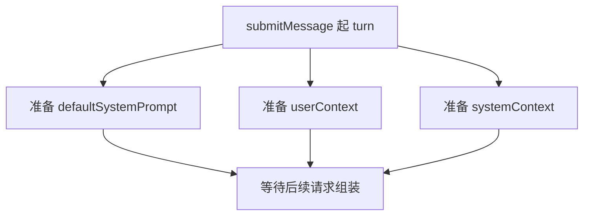

---

# 第三幕：用户输入进入输入分流层，而不是直接变成模型请求

现在终于轮到用户那句话本身了。

系统会调：

- `processUserInput(...)`

这一层的职责不是“立刻造请求”，而是：

> **先判断这次输入属于哪一种执行语义。**

比如它要先看：

- 是普通文本吗
- 是 slash 命令吗
- 是 bash 模式吗
- 有图片吗
- 有附件吗
- 有无特殊重写（比如某些 command keyword）

### 这一层的时间位置特别重要

因为很多人脑内会不小心把它排到 query 后面，或者误以为它只是轻量预处理。

其实不是。

它是一个正经的分流闸门。

也就是说：

- 有些输入会在这里被直接本地消费掉
- 有些输入会被改写成另一种执行路径
- 只有适合进 query 的输入，才会继续往后走

这一步的关键词不是“改文本”，而是：

> **判断命运。**

---

## 图 3：时序上，输入先分流，再决定是不是进 query

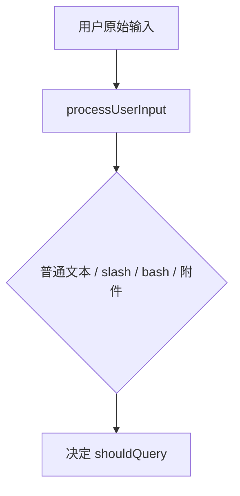

这里最好把 `shouldQuery` 一起记住。

因为它就是这一幕最重要的输出之一：

> **这次输入到底配不配进入模型主循环。**

---

# 第四幕：如果是普通文本，才会走 processTextPrompt，把 string 铸造成标准消息

假设我们仍然沿着最典型那条主线：

> 用户输入一句普通文本，没有 slash，没有 bash，没有附件

这时候就会落到：

- `processTextPrompt(...)`

这一幕最核心的动作，是把原始 string 变成标准 `UserMessage`。

也就是说，到这一步之后，系统真正开始处理的就已经不再是“字符串”了，
而是：

- 有 role 的消息
- 有 content 的消息
- 能进入 transcript 的消息
- 能参与后续 normalize / compact / resume 的消息

### 为什么这一幕不能跳过

因为后面很多术语都会依赖这一步：

- `mutableMessages`
- `messagesForQuery`
- `normalizeMessagesForAPI(...)`
- `tool_result` 回流

它们全都站在“消息协议”上，而不是站在裸文本上。

所以这里可以收一句：

> **主链真正的工作单位，是 message，不是 text。**

---

## 图 4：普通文本在时序上先被铸造成标准消息，再进入会话状态

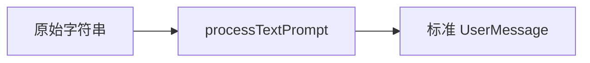

---

# 第五幕：新消息先写入 mutableMessages，主链处理的是“活会话”，不是一次性 RPC

这一步是很多人最容易下意识忽略的。

直觉会说：

- 文本变成消息
- 消息立刻送模型

但中间还有一个非常关键的动作：

- 先写进 `mutableMessages`

也就是当前会话活动消息状态。

这一步决定了 Claude Code 整体的工作方式：

> **它不是拿一句话临时打个 API，而是在推动一条活会话继续生长。**

这件事特别关键，因为一旦你脑子里真接受了“它是活会话”，后面很多设计就都顺了：

- 为什么需要 transcript
- 为什么需要 compact boundary
- 为什么有 context collapse
- 为什么 `messagesForQuery` 不是完整历史，而是投影视图

因为这些都不是 stateless RPC 会关心的问题。

### 这一幕也正好解释 mutableMessages 的位置

- 它不是 query 的输入参数副本
- 它是 QueryEngine 持有的当前主线程会话状态

所以时间顺序上一定要记住：

> **先更新 mutableMessages，后面 query 再基于它生成送模视图。**

---

## 图 5：时序上是先写活会话状态，再生成送模视图

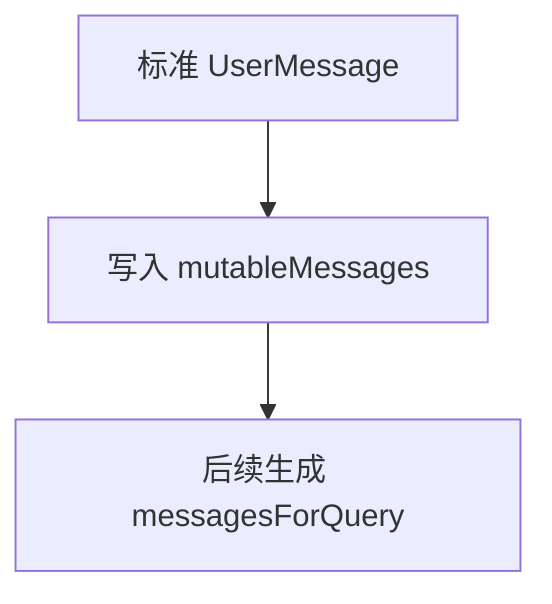

这张图其实就是 `mutableMessages` 和 `messagesForQuery` 最简单的一次对时解释。

---

# 第六幕：在真正进入 query 前，系统还会先抛出一份 system init

这一幕很多人读源码时会略过，但它对时序理解非常重要。

在真正进入 `query(...)` 之前，系统还会发一份类似“运行地图就绪”的初始化消息：

- `buildSystemInitMessage(...)`

这一层的作用是告诉上层：

- 当前 tools 是什么
- 当前 model 是什么
- 当前 permissionMode 是什么
- 当前 commands / skills / agents / plugins 状态是什么

从时序角度看，这一步的意义不是“展示一个 UI 卡片”那么简单。

它更像是在明确划线：

1. **前面是系统装配阶段**
2. **后面才是 query 主循环阶段**

这一层如果脑子里没分开，后面就容易把“系统准备”和“模型运行”糊成一团。

---

## 图 6：system init 是主循环前的一道明显分界线

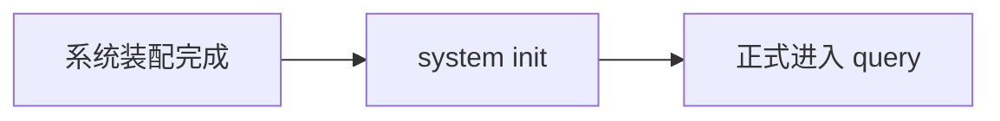

---

# 第七幕：真正送给模型前，要先把请求组装成三层结构

这一步终于来到“真正发请求”的门口。

但即使到了这里，也不是直接把 `mutableMessages` 整包塞进去。

系统还要先做请求组装。

这一幕最关键的几个对象是：

- `systemPrompt`
- `systemContext`
- `userContext`
- `messagesForQuery`

而真正的结构可以粗暴理解成：

1. `fullSystemPrompt = systemPrompt + systemContext`
2. `messages = prependUserContext(messagesForQuery, userContext)`

也就是说，最终送给模型的不是一坨文本，而是分层结构：

- system 规则层
- userContext 背景层
- 历史消息层

### 这里时间顺序一定要记住两件事

#### 第一，`messagesForQuery` 是在 query 前临时整理出来的
它不是长期状态本体。

#### 第二，`systemContext` 和 `userContext` 不是同一个位置
- `systemContext` 进 system 层
- `userContext` 前置到消息层

这一幕最容易和前面几幕混，
因为这里你开始第一次真正看到“请求 payload”长什么样。

---

## 图 7：真正发请求前的请求组装顺序

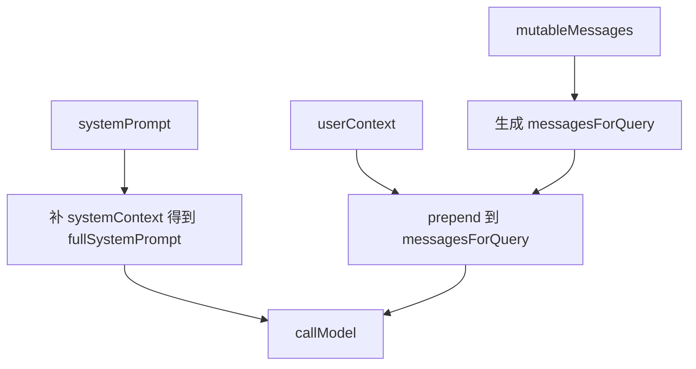

这张图建议和第 49 篇术语表对着一起看。

因为它刚好把：

- `mutableMessages`
- `messagesForQuery`
- `systemPrompt`
- `userContext`
- `systemContext`

这几个最容易串线的词，在时间上重新排了一次。

---

# 第八幕：进入 query(...) 后，主循环正式开始——它不是一次 API call，而是一条闭环

到这里，才真正进入：

- `query(...)`

这一层最容易被低估。

因为如果只看 `callModel(...)`，会错以为 `query(...)` 就是一层模型 API 包装。

其实不是。

它真正维护的是一个闭环：

1. 送一轮请求给模型
2. 收 assistant 输出
3. 看有没有 `tool_use`
4. 有就执行工具，生成 `tool_result`
5. 再把结果接回消息流
6. 决定是否继续下一轮
7. 没有 follow-up 才进入收口判定

也就是说，从时序角度看，`query(...)` 不是一个点，而是一段可循环的时间区间。

### 这一幕里最重要的判断词

- `tool_use`
- `tool_result`
- `needsFollowUp`

尤其是 `needsFollowUp`，它本质上是在问：

> 这一轮到底有没有形成新的闭环义务？

不是在问“assistant 文本是不是说完了”。

---

## 图 8：query 主循环的最小闭环

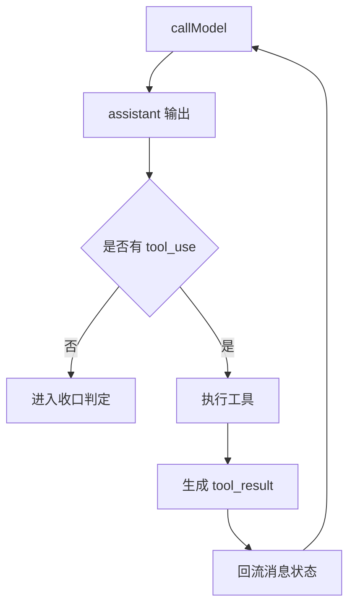

这张图就是第 39 篇最核心的那条判断的时序版。

---

# 第九幕：一旦出现 tool_use，就进入“工具执行 → 结果回流 → 再续转”这条支线

这一幕单独拎出来讲，是因为它正好是主循环和普通问答最大的分叉点。

如果 assistant 这一轮真的产出了 `tool_use`，时序上就会多出几步：

1. Claude Code 识别到 `tool_use`
2. 调工具执行层去跑这个工具
3. 拿到 `tool_result`
4. 把 `tool_result` 接回消息流
5. 更新上下文 / 消息状态
6. 再开始下一轮 query

### 这一幕有两个特别值得记住的点

#### 1. `tool_use` 和 `tool_result` 必须成对
这不是 UI 礼貌问题，而是协议约束。

#### 2. 工具跑完并不等于 turn 结束
它通常只是让主循环进入下一轮。

所以从时序角度看：

> **tool_result 不是终点，而是下一轮 query 的起点材料之一。**

这一点如果脑子里记住，很多“为什么它还会继续说 / 继续做”就都顺了。

---

## 图 9：tool_use 分叉的完整时间顺序

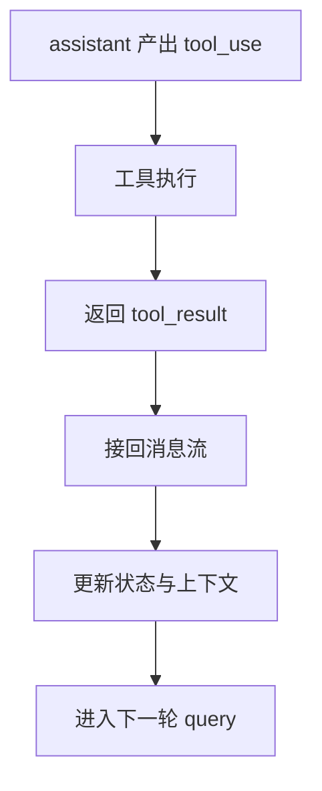

---

# 第十幕：compact / collapse 不只是“后处理”，它们是在送模前不断影响 messagesForQuery 的治理层

很多人一看到 compact / collapse，会本能地把它们理解成“收尾清理”。

但从时序角度看，这个理解不准。

更准确的说法是：

> **它们是在 query 前/中不断影响“这一轮送给模型的上下文视图”的治理层。**

也就是说，这些动作更像是发生在：

- 生成 `messagesForQuery` 时
- 进入下一轮 query 前
- 上下文压力过大时

比如：

- `compact boundary`
- `snip`
- `microcompact`
- `context collapse`
- `autocompact`

它们不是把整个 turn 结束后再慢慢整理，而是直接影响：

> **下一轮模型到底看到什么历史。**

### 这一幕最容易想错的地方

最容易想成：

- 先有完整历史
- query 一直机械重放完整历史
- 最后系统再压缩一下

其实 Claude Code 更像是：

- 维护完整或较完整的活动状态
- 但每轮送模前都可能重新投影、压缩、折叠

也就是说，compact/collapse 更像“送模前治理”，不是“事后清洁”。

---

## 图 10：上下文治理发生在送模视图生成阶段，不是纯收尾阶段

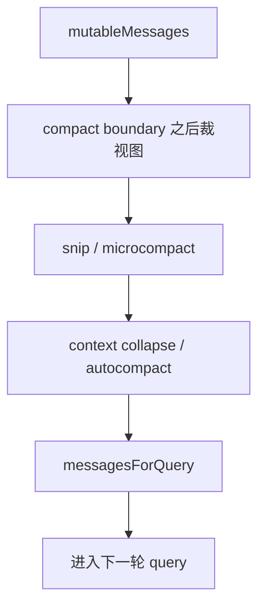

这张图特别适合拿来校正一个误解：

> **compact/collapse 影响的是“模型接下来看到什么”，不是“历史最终怎么存档”。**

---

# 第十一幕：当 query 终于不再需要 follow-up，才进入真正的收口阶段

query 主循环不是 assistant 文本一结束就立刻结束。

真正进入收口阶段，通常至少要满足：

- 这一轮没有新的 `tool_use`
- 没有新的 follow-up 义务
- recover / hooks / budget 等条件也允许收口

也就是说，时序上真正的“结束”其实很靠后。

在这之后，`QueryEngine` 还要接手做最后一层治理：

- transcript 记录
- usage 累计
- stop reason 抽取
- `mutableMessages` 更新
- 最终 result 产出

所以从时间顺序看：

> **query 的“没有下一轮”不等于 turn 立刻结束；后面还有一段治理和收口。**

这一幕如果省略掉，就会把 `query(...)` 和 `QueryEngine` 又混成一层。

---

## 图 11：真正的结尾不是模型停下，而是治理层收口完成

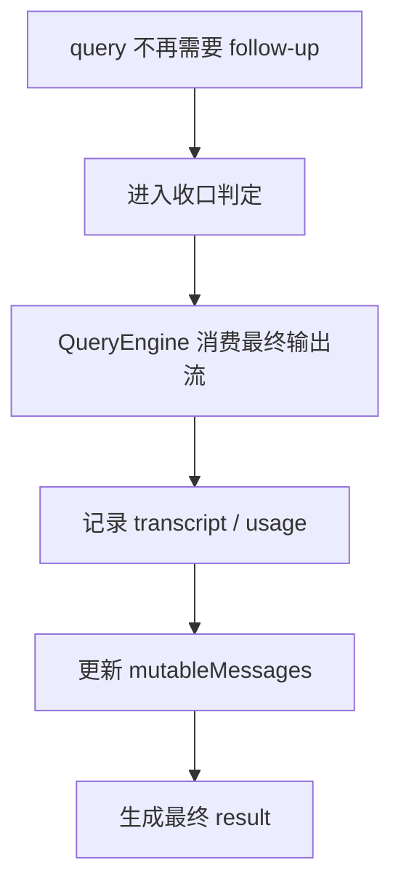

---

# 把整条时序压成一遍人话版

现在可以把这一整条主链，按最顺的人话顺序重新说一遍：

用户在 Claude Code 里输入一句话，比如：

> 帮我读一下 `src/query.ts`，告诉我主循环是怎么跑的

主线程内部真正发生的是：

1. **`submitMessage(...)` 接住这轮输入**，宣布一个新的 turn 开始
2. **系统先准备这轮运行地基**，包括 model、thinking、权限、会话状态、transcript 等
3. **系统把 prompt 零件先备好**，包括 `systemPrompt`、`userContext`、`systemContext`
4. **输入进入 `processUserInput(...)` 分流**，判断它是普通文本、slash、bash 还是附件输入
5. **如果是普通文本，就走 `processTextPrompt(...)`**，把 string 铸造成标准 `UserMessage`
6. **这条新消息先写进 `mutableMessages`**，成为当前活会话的一部分
7. **系统发出 system init**，正式把“装配阶段”和“query 阶段”分开
8. **系统基于 `mutableMessages` 生成 `messagesForQuery`**，并把 `systemPrompt/userContext/systemContext` 组装成真正请求
9. **进入 `query(...)` 主循环**，开始模型采样
10. **如果 assistant 产出 `tool_use`**，就执行工具、生成 `tool_result`、接回消息流、进入下一轮 query
11. **如果没有新的 follow-up**，才进入真正的结束判定
12. **最后由 `QueryEngine` 做 transcript/usage/result 的治理收口**，把结果交回给用户

这一遍说完，整条主链其实就清楚了：

> **先装配，再分流，再写活状态，再组请求，再跑闭环，再做治理。**

---

## 图 12：这篇最该记住的一张完整时序图

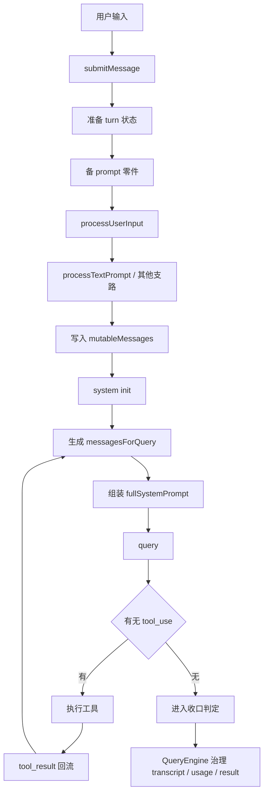

这张图基本可以当成第 38-50 篇这一小段主链阅读的总索引图了。

---

# 这篇最想保住的判断

如果把整篇压成一句最重要的话，我会留：

> **Claude Code 主线程主链不是“用户一句话 → 模型一句话”这么扁平，而是一条严格有顺序的时序链：先起 turn、再分流输入、再写入活会话、再组装请求、再跑 query 闭环、最后再由 QueryEngine 做治理收口。**

这句话里最关键的是：

- **不是扁平问答**
- **而是有顺序的时序链**
- **QueryEngine 负责头尾，query 负责中间闭环**

我觉得这就是这篇时序图版最值的地方。

---

# 我现在对这条主链的最短总结

如果只留一句最短的话，我会留：

> **一次用户输入真正穿过 Claude Code 主线程时，会先变成一轮 turn，再变成消息状态，再变成请求视图，最后在 query 闭环里推进并由 QueryEngine 收口。**

---

# 这篇最值得记住的几个判断

### 判断 1：主线程时序的真正起点不是 `callModel(...)`，而是 `submitMessage(...)` 启动一轮新的 turn

### 判断 2：prompt 零件（`systemPrompt` / `userContext` / `systemContext`）是在 query 前先备料，不是 query 跑起来后再临时拼

### 判断 3：`processUserInput(...)` 位于 query 之前，它的核心职责是判断输入命运，而不是单纯改写文本

### 判断 4：新消息会先写进 `mutableMessages`，然后系统才基于它生成 `messagesForQuery`；前者是活状态，后者是送模视图

### 判断 5：`query(...)` 在时间上不是一个点，而是一段可循环区间；只要出现 `tool_use`，就会进入“执行工具 → 回流结果 → 再续转”这条闭环支线

### 判断 6：compact / collapse 等上下文治理动作，本质上影响的是“下一轮模型看到什么”，不是纯粹发生在 turn 结束后的后处理

### 判断 7：真正的结束不是模型停下，而是 `QueryEngine` 完成 transcript、usage、result 的治理收口

---

# 下一步最顺怎么接

如果继续沿这条线往下写，我觉得最顺有两个方向：

### 方向 A：做一篇“tool-use 版时序图”
专门只讲一条更真实的闭环：

- assistant 首轮为什么决定发 `tool_use`
- 工具执行层怎么接住
- `tool_result` 怎样回流
- 第二轮 query 怎样继续

也就是把这篇里最复杂的支线单独放大。

### 方向 B：做一篇“请求 payload 极简图解版”
专门不讲时间，只讲“某一瞬间真正发给模型的请求长什么样”，把：

- `systemPrompt`
- `CLAUDE.md`
- `userContext`
- `systemContext`
- `messagesForQuery`

这几层彻底画清。

如果只选一个，我会更倾向 **方向 A**。

因为现在已经有：

- 术语表版（第 49 篇）
- 时序图版（第 50 篇）

下一篇再把“tool-use 真实闭环支线”放大，这一段主链学习单元就会更完整。