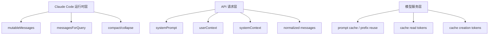
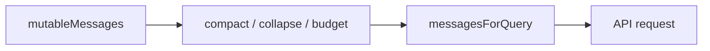
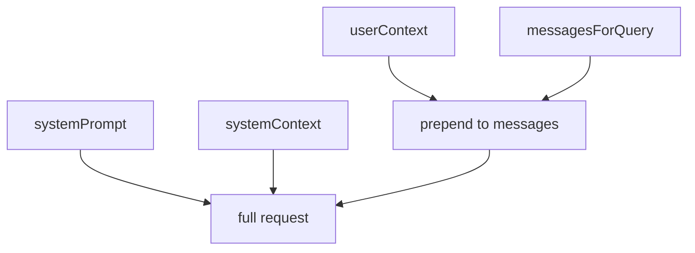
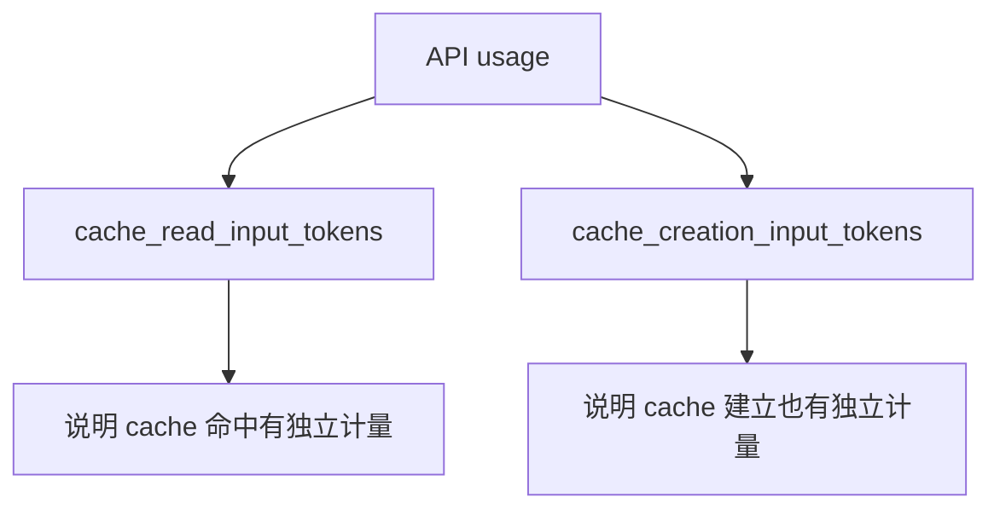
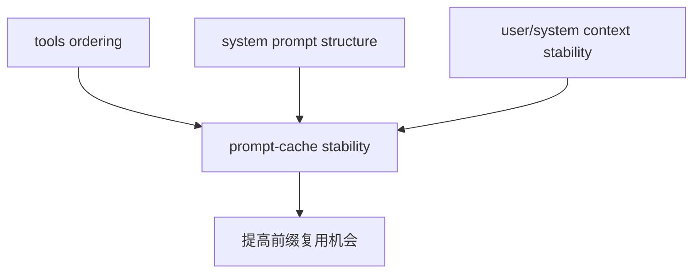
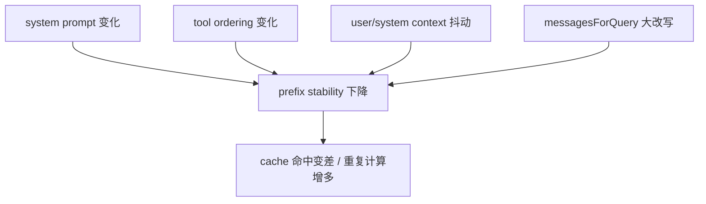

# Claude Code 源码共读笔记 51：长上下文每轮都重算吗——messagesForQuery、prompt cache 和重复计算到底发生在哪一层

## 这篇看什么

前面聊主循环时，我们其实已经把一条很重要的事实讲清了：

> **新的一轮 turn 发起时，Claude Code 不是只把“本轮新增一句话”发给模型。**

它会把前文带上。

但一旦继续往下问，马上就会出现第二个更关键的问题：

> **那前面的长上下文，是不是每一轮都要重新算一遍？**

比如：

- 前面已经有 100k 上下文了
- 现在你只多说了一句话
- 这轮新的请求里，前面那 100k 会不会还通过 API 传过去
- 如果传过去了，模型是不是又把这 100k 从头完整重算一遍

这个问题如果只靠口头解释，很容易混成一团，因为它其实混着三层：

1. **Claude Code 运行时层**：当前 turn 会不会继续带前文
2. **API 请求层**：真正发给模型的 payload 长什么样
3. **模型服务层**：前缀有没有 cache，重复计算有没有被复用

这篇就专门把这三层拆开。

我要先把结论放前面：

> **Claude Code 的新 turn 通常会继续把前文作为请求的一部分带上，但带上去的是一份为本轮生成的 `messagesForQuery` 视图；而“前面的内容会不会再次完整重算”则是更靠近模型服务层的问题。从源码能明确看出的结论是：Claude Code 整套设计显然在主动追求 prompt cache 稳定性，而且 usage 里也明确记录了 `cache_read_input_tokens` / `cache_creation_input_tokens`，所以这不是纯猜测，而是产品层和计量层都承认存在 cache。**

不过这里有一个很重要的边界：

> **源码能很确定地说明“Claude Code 在配合和暴露 prompt cache 机制”；但它不能替你证明某个模型服务内部究竟用什么 KV 复用细节。**

这个边界我觉得要先立住，不然后面很容易把“CLI 源码可证”的部分，和“底层模型服务内部实现”的部分混成一坨。

---

## 先给主结论

如果只先记一句话，我建议记这个：

> **新的一轮 turn 时，Claude Code 通常仍会把前文作为请求上下文的一部分继续带上；但它带的是为本轮生成的 `messagesForQuery`，不是 transcript 原样全文重放。而且从源码能明确看出，系统在主动优化 prompt cache 稳定性，并且在 usage 里显式记录了 cache read / cache write 相关 token。**

再压缩一点，就是：

- **前文通常还要带上**
- **但不是 transcript 全文原样照抄**
- **而且系统显然希望前缀尽量可 cache**
- **所以不是每轮都在“傻算整段历史”**

如果只记这四句，基本就够用了。

---

## 先把三层图立住：这个问题不是一层问题

这张图特别重要。

因为如果不先把三层拆开，后面所有讨论都会在一句话里打架：

- “会不会再传过去”
- “会不会再算一遍”
- “cache 到底在哪一层”

其实它们根本不是同一个问题。

---

# 第一部分：从 Claude Code 运行时层看，新 turn 不是只发“本轮新增一句话”

这个结论我们前面其实已经摸到了。

在 QueryEngine / query 这条主链里，Claude Code 不是 stateless 问答。

它内部会维护一份活会话状态：

- `mutableMessages`

然后每一轮 query 前，再从这份活状态里整理出：

- `messagesForQuery`

也就是说，真正送给模型的，不是“这轮新增一句话”，而是：

> **本轮需要继续推理的一份历史视图。**

### 这意味着什么

这意味着，如果你前面已经聊了很多轮，现在再发一轮新的 turn：

- 模型不是只看到这轮新增输入
- 系统会尽量让它继续看到前文背景

否则多轮会话根本没法成立。

所以对“前面的 100k 会不会继续带上”这个问题，第一层答案其实是：

> **会带语义上的前文。**

但关键是，
这里的“带上”，不是“transcript 全文原样重放”。

它是：

- 从 `mutableMessages` 出发
- 经过治理
- 生成 `messagesForQuery`
- 再进入 API 请求

这一步如果脑子里不分开，后面就很容易误以为：

> 会话里存了什么，就会 1:1 原样全发什么。

其实不是。

---

## 图 1：新 turn 带的是送模视图，不是 transcript 原文镜像

这张图最想打掉的误解就是：

> **会话记录 ≠ 本轮送模内容。**

---

# 第二部分：从 API 请求层看，发给模型的是结构化请求，不是“只发新增 delta”

如果只从接口语义看，Claude Code 每轮请求通常还是一份完整请求，而不是“只发这轮新增的一小段增量”。

从 `query.ts` 的参数就能看出来，`query(...)` 接的不是一个“本轮增量消息”，而是整套这轮请求材料：

- `messages`
- `systemPrompt`
- `userContext`
- `systemContext`
- 以及工具、预算等其他运行时参数

`query.ts` 里也明确从 `utils/api.ts` 引入了：

- `prependUserContext`
- `appendSystemContext`

这其实已经说明，这一轮真正发请求前，系统会把：

- system prompt 规则层
- system context 本轮系统补充
- user context 用户/会话背景
- messagesForQuery 历史消息视图

组织成一份完整请求。

所以在“接口语义”这一层，最准确的说法不是：

> 下一轮只发新增一句话

而是：

> **下一轮仍然会带着完整到足以继续推理的上下文结构去请求模型。**

这也是为什么多轮会话模型不会断片。

---

## 图 2：请求层看到的是一份完整结构，不是纯 delta-only

这张图最重要的作用是提醒你：

> **“有 cache”不等于“请求协议就变成只发增量”。**

这是后面最容易想错的一点。

---

# 第三部分：那是不是 transcript 原样全文每轮都重传？不是，Claude Code 中间还有一层治理视图

现在来回答第一个最常见误解：

> 如果前面已经有 100k 上下文，是不是每轮都把那 100k transcript 原文全塞给模型？

更准确答案是：

> **不一定。Claude Code 更像是每轮都重新生成一份“适合本轮继续推理”的送模视图。**

这一步背后站着的，就是我们前面已经读过的这些机制：

- `compact boundary`
- `snip`
- `microcompact`
- `context collapse`
- `autocompact`

这些机制的存在，本身就已经说明了一件事：

> **系统并没有把“每轮永远原样重放全部历史”当成唯一策略。**

如果永远原样重放，那压缩、折叠、边界、预算这些层就没那么重要了。

但实际上，Claude Code 在 query 前会非常在意：

- 本轮到底该保留多少历史
- 哪些历史保留原样
- 哪些要裁剪
- 哪些可以折叠成更短视图

所以“前面 100k 会不会继续传”这个问题，最准确的答法不是简单 yes/no，
而是：

> **会尽量传递前文语义上下文，但这份上下文通常是本轮重新整理过的 `messagesForQuery`，不是 transcript 全文的无脑镜像。**

---

# 第四部分：真正和“是不是重复计算”相关的，是 prompt cache / prefix reuse 这一层

现在才到第二个问题：

> **就算请求还带着前文，那模型会不会又把前面的长前缀从零完整算一遍？**

这个问题已经不属于“会话组织”本身了，
而更靠近模型服务层。

但这里有个好消息：

虽然 Claude Code 源码不能直接替你打开模型服务内部黑盒，
但它已经给了很多非常明确的信号，说明：

> **prompt cache 不是用户脑补出来的，它在这套系统里是被认真对待、被显式暴露、被主动优化的。**

这不是我靠行业经验猜的，而是源码里有很多直接证据。

---

## 证据 1：usage 里明确有 cache read / cache creation token 字段

在 `src/types/permissions.ts` 里，`ClassifierUsage` 直接定义了：

- `cacheReadInputTokens`
- `cacheCreationInputTokens`

在 `src/remote/remotePermissionBridge.ts` 的 usage stub 里，也直接有：

- `cache_creation_input_tokens`
- `cache_read_input_tokens`

在 `src/setup.ts` 的 session 统计里，甚至还会记录：

- `last_session_total_cache_creation_input_tokens`
- `last_session_total_cache_read_input_tokens`

这三处放在一起，其实已经够说明问题了：

> **这套系统不是“也许底层有 cache”；而是 usage 指标层面已经显式承认 cache 是真实存在且可计量的。**

如果没有这层机制，根本没必要专门在 usage 里铺这几个字段。

---

## 图 3：cache 不只是猜测，usage 层直接把它记出来了

这张图最重要的作用是帮你立一个判断：

> **cache 在这套系统里不是隐含概念，而是显式计量对象。**

---

## 证据 2：context.ts 明说 user/system context 是“cached for the duration of the conversation”

在 `src/context.ts` 里，`getSystemContext` 和 `getUserContext` 上方都有同一句注释：

> **This context is prepended to each conversation, and cached for the duration of the conversation.**

这句话的直接含义至少有两层：

### 第一层：在 Claude Code 运行时内部，这两类 context 本身就是会话级缓存的
也就是说，不是每轮都重新从头生成一次。

### 第二层：系统很在意这些前缀的稳定性
因为如果每一轮 user/system context 都抖来抖去，就很难让更下游的 prompt cache 稳定命中。

这里不要误解成：

> “既然 context 自己缓存了，那它就不会再进请求了。”

不是这个意思。

更准确的理解是：

> **运行时层会尽量保持这些前缀部分稳定、复用、少波动，从而让后续请求和 cache 策略更可控。**

---

# 第五部分：源码里还有更直白的证据——系统在主动追求 prompt cache 稳定性

如果只说 usage 字段，你还可以辩论说“也许只是 provider 提供了几个字段”。

但 Claude Code 源码里有一些注释是非常直白的，几乎已经把设计意图写出来了。

## 证据 3：tools.ts 明写了“为了 cache system prompt across users”

在 `src/tools.ts` 里，`getAllBaseTools()` 上面有一条非常醒目的注释：

> **This MUST stay in sync ... in order to cache the system prompt across users.**

这句话很重。

它说明什么？

说明系统 prompt 的组织方式，不只是“语义对不对”的问题，
还直接关系到：

> **system prompt 能不能稳定命中 cache。**

也就是说，工具列表的组织方式，本身就被当成 cache 稳定性的组成部分。

---

## 证据 4：assembleToolPool 明写了“为 prompt-cache stability 排序”

同一个文件更往下还有一段更关键的注释。

在 `assembleToolPool(...)` 里，built-in tools 和 MCP tools 的排序被专门设计成：

> **Sort each partition for prompt-cache stability**

而且还解释得很具体：

- built-ins 要保持连续前缀
- 不要让 MCP tool 插进 built-ins 中间
- 否则会 invalid downstream cache keys

这已经不是“顺手优化一下”了。

这是在直接承认：

> **工具数组的字节级稳定性，会影响 prompt cache 的命中。**

我觉得这一点特别值钱，因为它说明：

- cache 不是产品营销层概念
- 它已经深入到了 prompt 组织和工具排序这种非常工程化的细节里

这也反过来说明一个判断：

> **长上下文请求不是每轮都按“完全新前缀”来处理，否则系统没必要这么辛苦去保 prefix stability。**

---

## 图 4：系统不是被动接受 cache，而是在主动维护可缓存前缀

这张图最关键的一句话就是：

> **Claude Code 在“配合 cache”这件事上非常自觉。**

---

# 第六部分：更直白的一枪——有些地方甚至直接写了“别 bust the cache”

如果前面那些证据还不够直白，那 `Tool.ts` 里的这一句基本已经算摊牌了。

它在讲 fork subagent 继承父上下文时，专门有个字段：

- `renderedSystemPrompt?: SystemPrompt`

旁边注释写的是：

> **Used by fork subagents to share the parent's prompt cache ... getSystemPrompt() at fork-spawn time can diverge ... and bust the cache.**

也就是说：

- 系统明确认为 prompt cache 是真实存在的
- 系统明确担心重新渲染 system prompt 会导致前缀漂移
- 系统明确把“别 bust the cache”当成需要工程处理的问题

这句话其实已经把很多模糊讨论变得非常清楚了：

> **prompt cache 在 Claude Code 这套体系里不是隐喻，而是一个会被打爆、需要工程上保护的真实机制。**

这比单纯“usage 里有 cache token 字段”还更有说服力。

---

# 第七部分：所以，前面的 100k 到底会不会“再次计算”？

现在可以回到你最关心的那句人话了。

如果你前面已经有 100k 上下文，现在新来一轮 turn：

## 从 Claude Code 运行时层看
- 系统通常不会只发当前轮新增一句话
- 它会尽量继续带上前文
- 但带的是本轮生成的 `messagesForQuery`
- 不是 transcript 原样全文镜像

## 从 API 请求语义层看
- 这轮通常仍是一份“完整到足以继续推理”的请求
- 不是简单 delta-only 协议

## 从模型服务 / prompt cache 层看
- 源码无法替你证明每个 provider 的内部算法细节
- 但源码已经明确表明：系统在主动维持 prompt cache 稳定性
- usage 也显式记录 cache read / cache creation token
- 所以“前缀复用 / cache 命中”不是猜测，而是现实机制

所以我更愿意给一个既保守又准确的表述：

> **前面的长上下文通常仍会作为请求前缀的一部分继续参与这轮请求，但在服务端不一定按“从零完整重算全部前缀”的最笨方式处理。Claude Code 整套工程设计明显在努力让这段前缀尽量稳定、可复用、可命中 cache。**

这个说法我觉得是目前最稳的。

既没有装作已经知道模型服务内部全部细节，
也没有把源码里已经非常明确的 cache 证据说轻了。

---

# 第八部分：什么最容易破坏这种 cache 命中

这部分其实非常实用。

如果你已经接受“前缀存在 cache 复用空间”，那接下来更关键的问题就是：

> **什么东西最容易把这个前缀搞得不稳定？**

结合前面源码里的线索，我觉得至少有四类：

## 1. system prompt 结构变化
这也是为什么源码里这么在意 system prompt 和工具数组的稳定排序。

## 2. tools 列表变化
尤其是插入顺序变化、MCP tools 混入 built-ins 前缀等。

## 3. userContext / systemContext 波动
`context.ts` 里之所以把它们缓存到 conversation duration，很大程度上就是为了减少这种抖动。

## 4. messagesForQuery 视图发生大幅改写
比如：

- compact
- collapse
- snip
- 结构性裁剪

这些都会让本轮前缀和上一轮相比不再稳定一致。

所以从工程直觉上也能解释一件事：

> **为什么有时候长会话还挺顺，有时候一 compact 之后就像“换了个脑子”。**

因为送模视图真的变了。

变了，不只是语义变了，
对 cache 友好度也变了。

---

## 图 5：最容易让 cache 命中变差的几类变化

---

# 这一篇最想保住的判断

如果把整篇压成一句最关键的话，我会留：

> **Claude Code 的新 turn 通常仍会把前文作为请求上下文带上，但带的是本轮生成的 `messagesForQuery`；而从源码看，系统不仅暴露了 cache read / creation token，还在系统 prompt、tools 排序、context 生成等多个地方主动维护 prompt cache 稳定性，所以“前缀复用”在这套系统里不是猜测，而是被工程化认真对待的现实机制。**

我觉得这句话最值钱的地方有三点：

- 把 `messagesForQuery` 和 transcript 区分开了
- 把“请求带前文”和“服务端重复计算”区分开了
- 把“cache 存在”从经验判断推进到了源码证据层

---

# 我现在对这个问题的最短总结

如果只留一句最短的话，我会留：

> **Claude Code 每轮通常还会带着前文去请求模型，但系统会先把历史整理成 `messagesForQuery`；而源码已经明确表明它在主动追求 prompt cache 稳定性，所以前缀不是每轮都只能按最笨方式重新算。**

---

# 这篇最值得记住的几个判断

### 判断 1：新 turn 时继续带前文，和“模型是否重复完整重算前缀”不是同一个问题；前者属于运行时/请求层，后者更接近模型服务层

### 判断 2：Claude Code 继续带前文时，带的是本轮生成的 `messagesForQuery`，而不是 transcript 原样全文镜像

### 判断 3：`query.ts` 的请求组织方式说明每轮请求仍是完整上下文结构，不是纯 delta-only 协议

### 判断 4：源码中 `cache_read_input_tokens` / `cache_creation_input_tokens` 等 usage 字段，已经直接证明 cache 在这套系统里是显式计量对象

### 判断 5：`context.ts`、`tools.ts`、`Tool.ts` 的注释都在明确强调 prompt cache stability、cache across users、bust the cache 等工程目标，这说明系统在主动维护可缓存前缀

### 判断 6：system prompt 结构变化、tools 排序变化、context 抖动、messagesForQuery 大改写，都会降低前缀稳定性，从而影响 cache 命中

---

# 下一步最顺怎么接

如果继续沿这条线往下写，我觉得最顺有两个方向：

### 方向 A：写一篇“messages.ts 到底在这条链上管什么，不管什么”
专门把：

- `normalizeMessagesForAPI(...)`
- `messagesForQuery`
- transcript
- `mutableMessages`

这四个东西再彻底区分一次。

因为这次问题里，很多困惑其实都来自把这几个层混了。

### 方向 B：写一篇“什么最容易破坏 prompt cache 命中”
直接站在工程视角，把：

- system prompt 漂移
- tools 排序变化
- context 变化
- compact / collapse
- MCP tools 注入

这几类事情拆开讲。

如果只选一个，我会更倾向 **方向 A**。

因为把 `messages.ts`、`messagesForQuery`、transcript、`mutableMessages` 这几个层彻底分开后，后面再聊 cache、compact、resume、usage，都会顺很多。