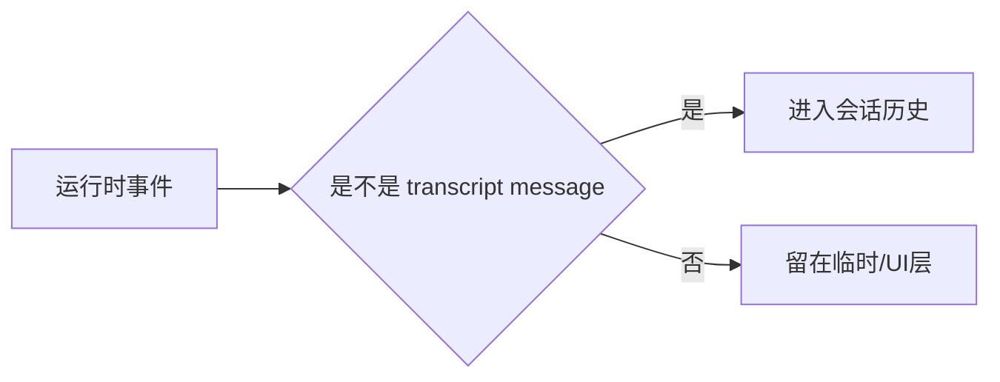
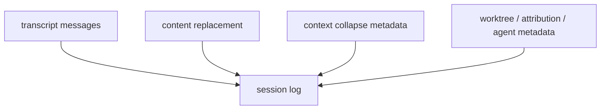

# Claude Code 源码共读笔记 52：sessionStorage 是会话状态落盘与恢复的汇合点

## 这篇看什么

前面这一串主循环文章，其实已经把 Claude Code 的“运行时半边”讲得比较清楚了：

- 用户输入怎么进入 `submitMessage(...)`
- `query(...)` 怎么驱动模型 / 工具闭环
- `messagesForQuery` 怎么成为真正送模的视图
- `compact` / `collapse` 怎么治理上下文
- agent / subagent 怎么被装起来

但如果继续问深一点，很快就会撞到另一半：

> **这些运行时状态，到底怎么被保存下来？下一次 resume 时，又是按什么逻辑恢复出来的？**

尤其你最近一直在问这些问题：

- transcript 到底是什么
- 它和 `mutableMessages` 是什么关系
- context collapse 为什么说是“读时投影，不是改写 transcript”
- content replacement 为什么要单独记下来
- subagent 的 sidechain transcript 是怎么接回 resume 的

这几个问题，最后都会收敛到一个文件：

- `src/utils/sessionStorage.ts`

我现在的判断很明确：

> **`sessionStorage.ts` 不是一个普通的“写日志工具文件”，它更像 Claude Code 会话生命周期里的持久化汇合点：负责把 transcript、session metadata、sidechain、content replacement、context collapse commit、worktree state 等等一系列运行时状态落到磁盘上，并为后续的 resume / replay / listSessions 提供统一地基。**

如果前面那几篇讲的是“这轮 turn 在内存里怎么跑”，
那这篇讲的就是：

> **这条运行轨迹怎么变成可恢复的会话历史。**

我觉得这一步非常关键。

因为只要这一层没补上，前面学到的主循环一直会有点悬：

- 你知道它在跑
- 但你还不知道它怎么留下痕迹，怎么跨进程、跨时间继续活着

---

## 先给主结论

如果只先记一句话，我建议记这个：

> **`sessionStorage.ts` 是 Claude Code 的会话持久化中枢：它定义什么东西算 transcript message、会话文件放哪、主线程和 subagent sidechain 怎么分别落盘，以及 resume 时需要哪些额外记录（比如 content replacement、context collapse commit、worktree state）才能把会话重新接回可运行状态。**

再压缩一点，就是：

- `query.ts` 负责把一轮跑起来
- `sessionStorage.ts` 负责把这轮留下来
- `conversationRecovery.ts` 负责把留下来的东西重新接起来

这三者是一条线上的上中下游。

---

## 先把总图立住：会话状态的三段链

```mermaid
flowchart TD
    A[运行时消息 / turn 状态] --> B[sessionStorage 落盘]
    B --> C[jsonl transcript + side entries]
    C --> D[conversationRecovery 读取]
    D --> E[resume 后的 Message[] + metadata]
```

这张图很重要。

因为它把前面很多零散问题都放回了一个简单框架里：

- 前面讲的主循环，是 A
- 这篇要讲的 `sessionStorage.ts`，是 B
- 真正落在磁盘上的会话文件，是 C
- resume 时的恢复逻辑，是 D

你只要先记住这四段，后面名词就不容易飞。

---

# 第一部分：`sessionStorage.ts` 最关键的地位，不是“存消息”，而是定义什么东西值得被持久化

很多人第一次看到 `sessionStorage.ts`，很容易把它想成：

- 把消息 append 到一个 jsonl 文件里
- 结束

但这个理解太轻了。

真正重要的不是“会写文件”，而是：

> **它在定义 Claude Code 里，哪些运行时对象会成为“可恢复会话历史”的一部分。**

这个区别很关键。

因为不是所有运行时东西都应该原样落盘。

源码一上来就立了一条非常核心的判断：

- `isTranscriptMessage(entry)`

它明确把 transcript message 限定为：

- `user`
- `assistant`
- `attachment`
- `system`

并且专门强调：

> **`progress` 不是 transcript message。**

这条判断特别值钱。

因为它说明 `sessionStorage.ts` 不只是“什么都存”，而是在做一个更根本的选择：

> **哪些东西属于会话本体，哪些只是运行中的临时 UI 状态。**

像 `progress` 这种高频、瞬时、只对当前界面有意义的东西，
如果也参与 transcript 和 parentUuid 链，resume 时会把整个会话链搞乱。

所以这里可以先收一句：

> **`sessionStorage.ts` 先定义“会话历史的边界”，然后才谈怎么存。**

---

## 图 1：会话持久化不是全量录屏，而是先决定什么算“历史本体”



这张图最重要的作用，就是打掉一个误解：

> **transcript 不是“所有运行时事件的全量录像”。**

它是被筛过的。

---

# 第二部分：Claude Code 的会话文件不是抽象概念，而是明确的 transcript jsonl 路径体系

`sessionStorage.ts` 很快就把另一个关键问题讲清了：

> **会话到底存到哪里。**

它不是随便临时放一个缓存目录。

你能直接看到几组关键函数：

- `getProjectsDir()`
- `getTranscriptPath()`
- `getTranscriptPathForSession(sessionId)`
- `getAgentTranscriptPath(agentId)`

这说明 Claude Code 对“会话持久化”不是模糊态度，而是有明确路径体系的。

### 主线程 transcript
主线程会话 transcript 是按：

- project dir
- session id

去组织 jsonl 路径。

### subagent transcript
subagent 则不是混进主线程一个大文件里，
而是走：

- 当前 session
- `subagents/`
- agent-specific jsonl

也就是说，subagent 有自己的 sidechain transcript。

这一点非常重要，因为它直接说明：

> **Claude Code 对 subagent 的理解不是“主线程里附带几条记录”，而是一条有独立持久化轨迹的 sidechain。**

这和我们前面读 `runAgent` 时看到的感觉是完全一致的：

- agent 不是 prompt 副作用
- 它是一个真正的一等运行对象

到 `sessionStorage.ts` 这里，这个判断第一次真正落到磁盘结构上。

---

# 第三部分：它不只存 transcript，还存一堆“resume 时必须重建的侧信息”

这是这篇里最值得讲的一点。

如果 `sessionStorage.ts` 只负责存 user / assistant 消息，那它当然重要，
但还不至于成为“汇合点”。

它真正升级成汇合点，是因为它还要处理大量：

> **不直接等于普通对话文本，但 resume 时必须知道的侧记录。**

从 `types/logs.ts` 就能看到这一层非常清楚地被建模出来了。

比如：

- `ContentReplacementEntry`
- `ContextCollapseCommitEntry`
- `ContextCollapseSnapshotEntry`
- `WorktreeStateEntry`
- `AttributionSnapshotMessage`
- `FileHistorySnapshotMessage`
- `AgentSettingMessage`
- `TagMessage`
- `ModeEntry`
- `PRLinkMessage`

这批东西有个共同特点：

- 它们不只是“说了什么”
- 而是“这场会话还带着哪些运行结构和恢复线索”

这也是为什么我不愿意把 transcript 只翻成“聊天记录”。

因为 Claude Code 的 session log 显然比普通聊天记录重很多。

它更像：

> **可恢复的会话运行档案。**

---

## 图 2：Claude Code 会话文件里不只有对话消息，还有恢复线索



这张图最想保住的感觉是：

> **resume 依赖的不是单一消息串，而是一整套会话档案。**

---

# 第四部分：为什么 content replacement 要单独持久化——因为 resume 需要“重建送模视图的一致性”

这一层很容易被低估。

在 `types/logs.ts` 里，`ContentReplacementEntry` 的注释写得非常直接：

> 记录那些在上下文中被较小 stub 替代的内容块；
> replay on resume for prompt cache stability.

这句话很值钱。

它说明什么？

说明 Claude Code 关心的不是“磁盘上原文在不在”这么简单，
而是：

> **resume 之后，送给模型看的上下文形状，要尽量和之前保持一致。**

也就是说，content replacement 不是普通日志字段，
而是为恢复“当时那套上下文投影视图”服务的。

这也正好和你前面那个 prompt cache 问题直接接上了。

我们前面已经看到：

- 系统很在意 prompt cache stability
- 它会努力让前缀别乱漂

到这里你就能看明白，这不是一句抽象口号。

因为 resume 场景里，连：

- 哪些内容被替换成了 stub
- 替换决策是什么

都要记下来。

否则 resume 后送模前缀就会漂掉。

所以如果用一句话概括这一层，我会说：

> **content replacement 持久化，不是为了审计，而是为了恢复上下文形状。**

---

# 第五部分：context collapse commit 为什么也要落盘——因为 transcript 本体没有直接存“折叠后的 placeholder”

这一层和上一层连得很紧。

`types/logs.ts` 对 `ContextCollapseCommitEntry` 的注释，也写得非常透：

- archived messages 本身已经在 transcript 里作为普通消息存在
- 真正需要额外持久化的，是：
  - splice instruction
  - boundary uuids
  - summary placeholder 的恢复信息

这实际上就在回答我们前面那句非常关键的话：

> **context collapse 为什么说是“读时投影”，不是改写 transcript”？**

因为：

- 被折叠的旧消息并没有被物理抹掉后再重写成一小段 summary
- transcript 上仍然保留原来的普通 user / assistant 消息
- 额外持久化的是“怎么把这段 span 在恢复时重新视为一个 collapse 结构”

这和“直接改写 transcript”完全不是一个世界观。

所以 `ContextCollapseCommitEntry` 这层 metadata 很重要，
它实际上是：

> **把“折叠是一种视图级改写”这件事，落成了 resume 可重建的数据结构。**

我觉得这一点特别值得记。

因为这不是理论解释，
而是持久化层自己在证明：

> **collapse 的真身不在 transcript 文本里，而在额外记录的边界与重建线索里。**

---

# 第六部分：`conversationRecovery.ts` 说明 sessionStorage 不是终点，而是 resume 的上游供给层

只看 `sessionStorage.ts`，你会知道它存了很多东西。

但只有再看 `conversationRecovery.ts`，你才会真正知道：

> **这些东西为什么必须存。**

`loadConversationForResume(...)` 这段非常关键。

它在 resume 时，不只是把 transcript 文件读出来，
还会把下面这些一起还原：

- `messages`
- `turnInterruptionState`
- `fileHistorySnapshots`
- `attributionSnapshots`
- `contentReplacements`
- `contextCollapseCommits`
- `contextCollapseSnapshot`
- `sessionId`
- `agentName / agentColor / agentSetting`
- `mode`
- `worktreeSession`
- `fullPath`

也就是说，resume 恢复的根本不是“最后几条消息”，而是：

> **一份带会话结构信息的恢复包。**

这一下就把 `sessionStorage.ts` 的地位彻底说清了：

它不是“日志存档层”，而是：

> **resume 的原材料仓库。**

你前面如果没有把这些侧记录写对，resume 就不只是“少一点展示信息”，
而是可能根本恢复不出正确的运行状态。

---

## 图 3：resume 恢复的是“消息 + 状态线索”的组合包

```mermaid
flowchart TD
    A[sessionStorage 落盘内容] --> B[conversationRecovery.loadConversationForResume]
    B --> C[Message[]]
    B --> D[contentReplacements]
    B --> E[contextCollapseCommits]
    B --> F[worktree / agent metadata]
    C --> G[恢复后的可继续会话]
    D --> G
    E --> G
    F --> G
```

这张图最关键的一句话是：

> **resume 恢复的不是“聊天文本”，而是“能继续运行的会话状态包”。**

---

# 第七部分：compact boundary 的 metadata 也在说明“历史没丢，只是链要会重新接”

这部分和前面的 context collapse 是一脉相承的。

在 `compact.ts` 里，`annotateBoundaryWithPreservedSegment(...)` 做的事情也很能说明 Claude Code 的思路。

它不是说：

- 直接把旧历史全部覆盖掉

而是在 compact boundary 上记一段 preserved segment metadata：

- `headUuid`
- `anchorUuid`
- `tailUuid`

注释里写得很清楚：

- preserved messages 在磁盘上保留原 parentUuids
- loader 在恢复时再 patch chain

这一点和前面两层拼起来，就会非常完整：

### 1. transcript 不是“每次 compact 后就被重写成全新故事”
### 2. 很多压缩/折叠动作更像“加边界 + 加重建线索”
### 3. loader / recovery 层负责把这些线索重新拼成可继续工作的链

这也再次说明，Claude Code 在这套状态系统上的设计，明显更接近：

> **保留真实历史 + 持久化投影线索 + 读时重建**

而不是：

> **每次都把旧历史粗暴重写成一份新 transcript。**

---

# 第八部分：我现在为什么更愿意把 transcript 理解成“会话运行档案”

读到这里，其实就能把我们前面那个中文翻译问题也一起收了。

如果只看 `user` / `assistant` 两类消息，
你当然可以把 transcript 理解成“对话记录”。

但只要把 `sessionStorage.ts` 和 `types/logs.ts` 真读进去，
我会更愿意把 Claude Code 里的 transcript / session log 整体理解成：

> **会话运行档案**

因为里面明显不只是：

- 谁说了什么

还包括：

- 会话链怎么连
- compact boundary 在哪
- 哪些内容被 replacement 过
- collapse commit 怎么恢复
- agent sidechain 怎么关联
- worktree / mode / tag / setting 是什么

当然，在日常共读里我还是会优先用“会话记录”这个较顺的词，
因为“会话运行档案”略重。

但如果你问我更严格一点的理解，
我现在会说：

> **它比“聊天记录”重得多，更接近一份可恢复的运行档案。**

---

# 术语补充 / 名词解释

这篇里有几个词，如果不单独拎出来解释，很容易在脑子里串线。

## 1. transcript
在这条线里我建议优先翻成：

- **会话记录**

如果强调更强的运行时意味，也可以理解成：

- **会话运行档案**

它不是纯聊天记录，因为里面还带很多恢复线索。

---

## 2. sidechain transcript
建议理解成：

- **侧链会话记录**
- 或更口语一点：**subagent 自己那条独立会话记录**

意思是 subagent 不只是往主线程里塞几条消息，
而是有自己的 transcript 文件。

---

## 3. content replacement
建议翻成：

- **内容替换记录**

意思不是“原文消失了”，而是：

- 某些很大的内容块在上下文里被更小的 stub 替代了
- 为了 resume 后保持上下文形状，需要把这个替换决策记下来

---

## 4. context collapse commit
建议理解成：

- **上下文折叠提交记录**
- 或更自然一点：**上下文折叠的持久化提交点**

它记录的不是“新的 transcript 正文”，
而是“怎么在恢复时把某段历史重新视为一个折叠结构”。

---

## 5. compact boundary
建议翻成：

- **压缩边界**

它的作用不是直接重写全文，
而是给后续 loader / recovery 一个“从哪里开始重接链”的锚点。

---

## 6. resume
我在这条共读线里建议统一理解成：

- **恢复会话**

不是单纯“打开旧记录”，
而是把一份持久化会话档案重新恢复成可继续运行的状态。

---

# 这一篇最想保住的判断

如果把整篇压成一句最关键的话，我会留：

> **`sessionStorage.ts` 的价值不在于“把消息写进 jsonl”，而在于它定义了 Claude Code 的会话历史边界，并把 transcript、sidechain、content replacement、context collapse commit、worktree state 等恢复所需线索统一持久化下来，供 `conversationRecovery.ts` 在 resume 时重建一份可继续运行的会话状态包。**

这句话里最重要的点有三个：

- 它不只是写日志
- 它在定义“什么算会话本体”
- 它服务的是 resume 可恢复性

---

# 我现在对 `sessionStorage.ts` 的最短总结

如果只留一句最短的话，我会留：

> **`sessionStorage.ts` 是 Claude Code 的会话持久化中枢：负责把运行时轨迹筛成可恢复的会话档案，并为 resume 提供重新接回链路所需的全部关键线索。**

---

# 这篇最值得记住的几个判断

### 判断 1：`sessionStorage.ts` 不是简单日志工具，而是在定义什么运行时对象有资格进入会话历史

### 判断 2：`progress` 不是 transcript message，这说明 transcript 不是“所有运行时事件的全量录像”，而是经过边界筛选的会话本体

### 判断 3：主线程 transcript 和 subagent transcript 是分开持久化的，这再次证明 subagent 在 Claude Code 里是一等运行对象，而不是主线程的附属提示词效果

### 判断 4：`ContentReplacementEntry` 和 `ContextCollapseCommitEntry` 的存在，说明 resume 依赖的不只是消息文本，还依赖“如何恢复上下文视图形状”的额外线索

### 判断 5：context collapse 没有把 archived messages 物理重写成一段新 transcript；真正被持久化的是边界和重建 metadata，这再次支持“折叠是读时投影，不是 transcript 改写”

### 判断 6：`conversationRecovery.ts` 恢复的不是一串旧消息，而是一整份“消息 + 结构状态 + 恢复线索”的可继续运行会话包

---

# 下一步最顺怎么接

如果继续沿这条线往下写，我觉得最顺有两个方向：

### 方向 A：专门写 `conversationRecovery.ts`
把 resume 这条链完整拉出来：

- transcript 是怎么加载的
- 中断 turn 怎么识别
- skills 怎么在 resume 后保留
- content replacement / collapse commit 怎么恢复进会话

这会是这篇天然的下游篇。

### 方向 B：专门写“transcript、mutableMessages、messagesForQuery 三者到底什么关系”
这篇会更偏概念澄清，能把最近几篇里最容易混的三层彻底分开。

如果只选一个，我会更倾向 **方向 A**。

因为这篇已经把持久化入口讲清了，下一篇直接接恢复入口，会最顺。