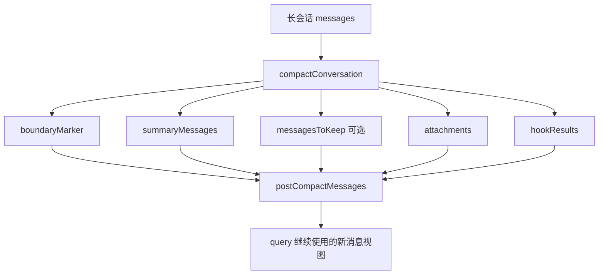
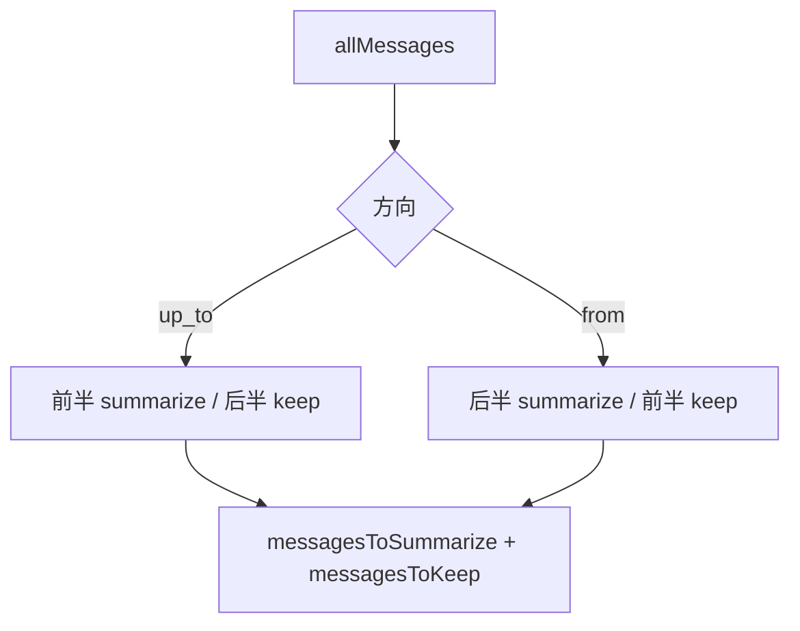

# Claude Code 源码共读笔记 53：compact 是怎么把长会话压成可继续运行的新上下文的

## 这篇看什么

前面那一串主循环文章，我们已经反复提过很多次 `compact`：

- 上下文太长时会 compact
- compact 后 `messagesForQuery` 会变
- compact boundary 会插进会话里
- resume 时还要重建 compact 之后的链

但说实话，到昨天为止，我们其实一直在“借它解释别的东西”，
却没有真正把它本人单独拎出来拆。

这会有个明显的问题：

> **你知道 compact 很重要，但还不知道它到底产出了什么结构、保留了什么、丢了什么、以及为什么它不是粗暴改写 transcript。**

这篇就专门补这个坑。

我这次重点看的是：

- `src/services/compact/compact.ts`
- 它在 `query.ts` 里的接入点

我要回答的不是抽象问题“compact 是不是压缩”，而是几个更具体的问题：

1. `compactConversation(...)` 的输入输出到底是什么
2. full compact 和 partial compact 各自做了什么
3. compact 后真正留下来的消息结构长什么样
4. `messagesToKeep`、`summaryMessages`、`boundaryMarker` 各自扮演什么角色
5. 为什么这套设计再次证明：
   > **compact 更像重写“送模视图”，而不是粗暴重写 transcript 正文**

如果用一句更人话的话来说，这篇就是要回答：

> **Claude Code 在上下文太长时，不是简单“压一段摘要顶上去”就完了，它其实在重新造一份还能继续运行、还能继续恢复、还能尽量保住上下文连续性的后续会话骨架。**

---

## 先给主结论

如果只先记一句话，我建议记这个：

> **`compact.ts` 做的不是“把旧消息缩短一点”这么简单，而是把长会话重组为一份新的后续上下文骨架：前面插入 compact boundary，再插入 summaryMessages，必要时保留 `messagesToKeep` 原样续在后面，再补 attachments 和 hooks，最后把这整份 post-compact messages 重新交还给 `query(...)` 继续跑。**

再压缩一点，就是：

- `compact` 不是单条摘要
- 它产出的是一整份新的 post-compact message bundle
- 这份 bundle 既要让模型继续理解前文
- 又要让系统后面还能 resume、还能 relink、还能保住一部分上下文连续性

这就是为什么它比“摘要一下聊天记录”复杂得多。

---

## 先把总图立住：compact 产出的不是摘要文本，而是一组新上下文组件

这张图特别关键。

因为它先把一个常见误解打掉了：

> **compact 的输出不是“一段 summary 文本”，而是一整个新的消息组合包。**

如果你先有了这个图，后面很多细节就都顺了。

---

# 第一部分：`CompactionResult` 说明 compact 本质上是“重组消息结构”，不是只生成摘要

`compact.ts` 里最该先看的，不是实现细节，而是结果类型：

- `CompactionResult`

这个类型已经把 compact 的真实意图写得很清楚了。

它的核心字段是：

- `boundaryMarker`
- `summaryMessages`
- `attachments`
- `hookResults`
- `messagesToKeep?`

这里最重要的是：

> **摘要只是其中一部分。**

如果 compact 只是“生成一段总结”，那结果类型只需要一个 `summary` 字符串就差不多了。

但现在它返回的是一组结构化部件，
这说明 Claude Code 想保住的不是“让人类看懂大意”这么简单，
而是：

> **让 compact 后的会话仍然像一个合法、可续推、可恢复的消息链继续存在。**

所以 compact 真正做的事，不是把旧会话压成一句话，
而是：

> **把旧会话翻译成一个新的、可继续运行的消息起点。**

---

# 第二部分：`buildPostCompactMessages(...)` 直接把 compact 的骨架顺序写死了

这一层非常值钱，因为它把 compact 后的结构顺序直接钉死了：

顺序就是：

1. `boundaryMarker`
2. `summaryMessages`
3. `messagesToKeep`
4. `attachments`
5. `hookResults`

这比任何抽象解释都直白。

它说明 compact 后的新上下文不是随便拼的，
而是有明确的协议顺序。

### 这个顺序为什么重要

因为它其实对应着五种不同语义：

#### 1. `boundaryMarker`
告诉系统：
- 从这里开始，后面的链已经是 compact 后的新阶段了
- 这是压缩边界

#### 2. `summaryMessages`
告诉模型：
- 前面那一大段历史，现在用这份用户消息形式的摘要继续带入

#### 3. `messagesToKeep`
告诉模型：
- 有些消息并没有被总结掉，需要原样续在后面

#### 4. `attachments`
告诉模型：
- compact 之后，一些上下文附件要重新补回来
- 比如工具、agent listing、MCP instructions 之类的 delta attachment

#### 5. `hookResults`
告诉系统：
- compact 相关 hook 产生的结果，也要作为新阶段的一部分继续接上

也就是说，这个顺序不是样式问题，而是：

> **compact 后新上下文的语义装配顺序。**

---

## 图 1：compact 后不是“摘要替换一切”，而是五层新骨架

我觉得这张图就是这篇最该记住的第一张图。

---

# 第三部分：full compact 的核心思路，是“旧历史全摘要化 + 当前状态重建附件”

先说 full compact，也就是 `compactConversation(...)` 这条主路径。

它做的事情可以粗暴概括成：

1. 先把当前长会话送去生成 summary
2. 执行 compact 相关 hooks
3. 插入 compact boundary
4. 生成 summary user message
5. 把 file / plan / skill / tools / agent listing / MCP 等附件重新挂回来
6. 再把这些东西拼成一份新的 post-compact messages

这里最关键的判断是：

> **full compact 不是简单保留一段原消息尾巴，而是更像“历史整体被摘要化后，再把当前系统状态重新补齐”。**

你能看到 full compact 在摘要之后会做很多“重建环境”的动作：

- `createPostCompactFileAttachments(...)`
- `createPlanAttachmentIfNeeded(...)`
- `createPlanModeAttachmentIfNeeded(...)`
- `createSkillAttachmentIfNeeded(...)`
- `getDeferredToolsDeltaAttachment(...)`
- `getAgentListingDeltaAttachment(...)`
- `getMcpInstructionsDeltaAttachment(...)`

这意味着 compact 后系统担心的问题不是“有没有一句摘要”，
而是：

> **摘要之后，模型还看不看得到继续工作所需的那些运行时环境提示。**

所以 compact 其实有两个输出目标：

### 目标 A：压历史
### 目标 B：补环境

这两件事必须同时成立。

否则 compact 之后模型虽然知道前情提要，
却不知道现在有哪些工具、plan mode、skills、MCP 说明还在生效。

---

# 第四部分：`boundaryMarker` 很重要，因为 compact 从来不是“静默替换”

compact 不是后台偷偷把历史删掉、然后装作什么都没发生。

源码里很明确：

- 会创建 `createCompactBoundaryMessage(...)`

这说明 compact 是显式打边界的。

我觉得这件事很重要，因为它代表 Claude Code 的设计态度是：

> **会话发生过一次上下文压缩，这件事本身也应该进入会话结构。**

这和很多系统那种“后台默默摘要、用户和恢复层都看不出来”不一样。

在 Claude Code 里，compact boundary 是一个明确的结构锚点。

它至少承担三件事：

1. 给当前会话标一个“压缩阶段切换点”
2. 给后续 loader / resume 一个可识别边界
3. 在必要时挂 `compactMetadata`

比如：

- `preCompactDiscoveredTools`
- `preservedSegment`

这些后面都挂在 boundary 上。

所以 boundary 不是装饰，而是 compact 体系的中枢锚点。

---

# 第五部分：为什么 summaryMessages 被做成 `UserMessage`，而不是系统内部私有摘要块

这一层也很有意思。

compact 后的 summary 不是只存在一个内部结构里，
而是被包装成：

- `UserMessage`

并且带上：

- `isCompactSummary`
- 某些情况下 `isVisibleInTranscriptOnly`
- partial compact 时还可能带 `summarizeMetadata`

这说明 Claude Code 想让 compact summary 继续作为**消息世界里合法的一员**存在。

而不是额外发明一个“这个东西只给内部看、和消息链平行”的特殊对象。

这么做的好处很明显：

- 它能继续沿着消息协议走
- 能进 transcript / resume / relink 体系
- 能让后面的 query 把它当作一条标准消息来消费

所以如果你问：

> compact 的 summary 在系统里更像什么？

我会回答：

> **更像一条带特殊标记的用户总结消息，而不是悬在消息链外面的摘要对象。**

---

# 第六部分：partial compact 比 full compact 更值得细看，因为它明确出现了 `messagesToKeep`

如果 full compact 更像“整体压一遍”，
那 partial compact 就更有“手术感”。

`partialCompactConversation(...)` 非常关键的一点是，它明确把消息分成两半：

- `messagesToSummarize`
- `messagesToKeep`

并且支持两个方向：

- `from`
- `up_to`

这两个方向的差别，源码注释写得很直白：

### `from`
- 总结 pivot 之后的部分
- 保留前面的部分
- 更偏 prefix-preserving

### `up_to`
- 总结 pivot 之前的部分
- 保留后面的部分
- 更偏 suffix-preserving

这一层的重要性在于，它第一次非常明确地说明：

> **compact 不是“要么全压，要么不压”。它也可以是保留一半原消息链，只替换另一半。**

这时候 `messagesToKeep` 的作用就特别清楚了：

- 它是 compact 后仍然原样留在消息链里的那一段
- 不是摘要，也不是附件
- 而是真正保住的原消息段

这也是为什么 partial compact 更能说明 Claude Code 的真实设计哲学：

> **它不是追求把所有旧消息都压成最短，而是在尽量平衡：压缩收益、上下文连续性、prompt cache 稳定性。**

---

## 图 2：partial compact 的基本切法

这张图建议记住，因为它直接决定你后面怎么看 `messagesToKeep`。

---

# 第七部分：`annotateBoundaryWithPreservedSegment(...)` 是 compact 设计最有意思的地方之一

如果只看前面那些步骤，你已经会觉得 compact 很讲究了。

但我觉得更有意思的是这一步：

- `annotateBoundaryWithPreservedSegment(...)`

它专门在 compact boundary 上挂：

- `headUuid`
- `anchorUuid`
- `tailUuid`

而且注释写得非常清楚：

- preserved messages 在磁盘上保留原 parentUuids
- loader 后面会据此 patch 链

这段我很喜欢，因为它再次说明 Claude Code 不是暴力重写 transcript。

如果是暴力重写，你根本不需要保：

- preserved segment 的头尾 uuid
- anchor uuid
- relink metadata

你只要把新 transcript 写成新的样子就行了。

但现在它显然不是这么做。

它在做的是：

> **原消息尽量保留原样落盘，但通过 boundary metadata 告诉恢复层：“后面把这段重新接回新的 compact 后链结构”。**

这其实是一种很克制、很工程的做法。

它保住了两件事：

### 1. 原消息身份尽量不变
### 2. 后续逻辑链又能重新拼成 compact 后的新骨架

所以 `preservedSegment` 这层 metadata，我会把它理解成：

> **compact 后会话链的重接说明书。**

---

# 第八部分：compact 和 prompt cache 的关系，不是抽象猜测，而是源码里直接写在注释和事件里

前面第 51 篇我们已经讲过 prompt cache。

compact 这里其实又给了不少非常具体的信号。

比如 full compact 里有：

- `promptCacheSharingEnabled`
- compaction usage 里的 `cache_read_input_tokens`
- `cache_creation_input_tokens`
- `notifyCompaction(...)`
- `markPostCompaction()`

partial compact 里也会记录：

- `compactionCacheReadTokens`
- `compactionCacheCreationTokens`

更关键的是源码注释本身也直接在说：

- 哪条路径更保 prefix cache
- 哪条路径会 invalidate cache

比如 partial compact 对 `up_to` / `from` 的解释就非常直接：

- `up_to` 会影响后面 kept messages 前面的 prefix
- `from` 更保 prefix

这说明 compact 不只是“压缩上下文大小”，
它同时也在处理另一个现实问题：

> **怎样压，才不至于把可复用前缀全部打烂。**

也就是说，compact 的目标从来都不是单目标优化。

它至少同时在优化三件事：

1. 上下文窗口压力
2. 会话连续性
3. prefix / prompt cache 稳定性

这个判断我觉得非常重要。

因为它解释了为什么 compact 设计会这么复杂。

它不是“产品经理想做个摘要按钮”，
而是 runtime 在做一套多目标平衡。

---

# 第九部分：`query.ts` 里的接入点说明 compact 之后不是新开一轮会话，而是当前 query 继续往下跑

最后再看一下它在 `query.ts` 里的接入点，就更清楚了。

关键动作是：

- `const postCompactMessages = buildPostCompactMessages(compactionResult)`
- 把这些 message `yield` 出去
- 然后直接：
  - `messagesForQuery = postCompactMessages`

这一步非常关键。

因为它说明 compact 之后不是：

- 结束当前 query
- 开一个全新独立 session

而是：

> **把当前 query 的消息视图原地切换成 compact 后的新消息骨架，然后继续往下跑。**

也就是说，compact 更像是：

> **主循环中途发生的一次上下文重构。**

而不是 session 层的大重启。

这也正好解释了为什么前面那些 boundary / summary / keep / attachment / hook 结构都必须做得这么严格。

因为 compact 之后，系统不是停下来重新开天辟地，
而是要在同一条 runtime 链上继续跑。

---

## 图 3：compact 后不是换会话，而是原地替换当前 query 的消息视图

这张图是这篇第二张最该记住的图。

---

# 术语补充 / 名词解释

这篇里有几个词，如果不单独落一下，很容易和前面几篇串线。

## 1. compact
我建议在这条共读线里统一理解成：

- **上下文压缩**

但这里的“压缩”不是单纯缩短文本，
而是重组一份 compact 后还能继续运行的新消息骨架。

---

## 2. boundaryMarker / compact boundary
建议理解成：

- **压缩边界标记**
- 或简称：**压缩边界**

它是 compact 后新阶段的结构锚点，不是装饰消息。

---

## 3. summaryMessages
建议理解成：

- **压缩摘要消息**

它不是普通注释文本，而是进入消息链、能被后续 query 继续消费的 `UserMessage`。

---

## 4. messagesToKeep
建议翻成：

- **保留消息段**
- 或 **原样保留的消息段**

意思是这部分消息不会被总结掉，而是会原样续在 compact 后骨架里。

---

## 5. preservedSegment
建议理解成：

- **保留段重接元数据**
- 或更口语一点：**保留段的链路重接说明**

它记录 head / anchor / tail，供 loader / resume 在后面重新把链接对。

---

## 6. postCompactMessages
建议理解成：

- **压缩后的新消息包**

这是 compact 真正交给 `query(...)` 继续使用的那份消息视图。

---

# 这一篇最想保住的判断

如果把整篇压成一句最关键的话，我会留：

> **`compact.ts` 做的不是“生成一段摘要”这么简单，而是把长会话重组成一份新的 post-compact message bundle：用 boundaryMarker 标出新阶段，用 summaryMessages 带住历史，用 messagesToKeep 保住必要原链，再补 attachments 和 hooks，最后让 `query(...)` 原地切换到这份新上下文骨架继续运行。**

这句话里最重要的点有四个：

- 不是单条摘要
- 是新的消息骨架
- 会保留一部分原链
- compact 后 query 继续原地跑

---

# 我现在对 `compact.ts` 的最短总结

如果只留一句最短的话，我会留：

> **`compact.ts` 是 Claude Code 的上下文重构器：它把过长会话压成一份可继续运行、可恢复、尽量保住连续性的 post-compact messages。**

---

# 这篇最值得记住的几个判断

### 判断 1：compact 的输出不是摘要字符串，而是一整份 `CompactionResult`，里面包含 boundary、summary、attachments、hookResults，以及某些路径下的 `messagesToKeep`

### 判断 2：`buildPostCompactMessages(...)` 规定了 compact 后新骨架的固定顺序：boundary → summary → keep → attachments → hooks

### 判断 3：full compact 更像“整体摘要化 + 运行环境附件重建”，目标不只是压历史，还有补足当前可继续工作的上下文环境

### 判断 4：partial compact 明确说明 compact 可以是“只总结一半、保留另一半原消息链”，这也是 `messagesToKeep` 最清楚的出现位置

### 判断 5：`annotateBoundaryWithPreservedSegment(...)` 证明 compact 不是粗暴重写 transcript；它更像“保留原消息身份 + 额外记录如何把链重接成新骨架”

### 判断 6：compact 同时在平衡三件事：上下文窗口压力、会话连续性、prompt cache 稳定性

### 判断 7：在 `query.ts` 里，compact 后不是另开新会话，而是把当前 `messagesForQuery` 原地替换成 `postCompactMessages`，然后继续同一条 query 主循环

---

# 下一步最顺怎么接

如果继续沿这条线往下写，我觉得最顺有两个方向：

### 方向 A：接 `microCompact.ts`
把：

- `compact`
- `microcompact`
- `context collapse`

这三者的边界彻底讲清。

因为现在 full/partial compact 已经立住了，再看 microcompact 会更容易判断它到底是不是“小号 compact”。

### 方向 B：接 `conversationRecovery.ts`
把 compact 后这些 boundary / preserved segment / content replacement 到底怎么在 resume 时重接回来再讲透。

如果只选一个，我会更倾向 **方向 A**。

因为你这次就是专门跳回来补 compact，那下一步自然就是把它旁边最容易混的 `microCompact.ts` 一起补掉。