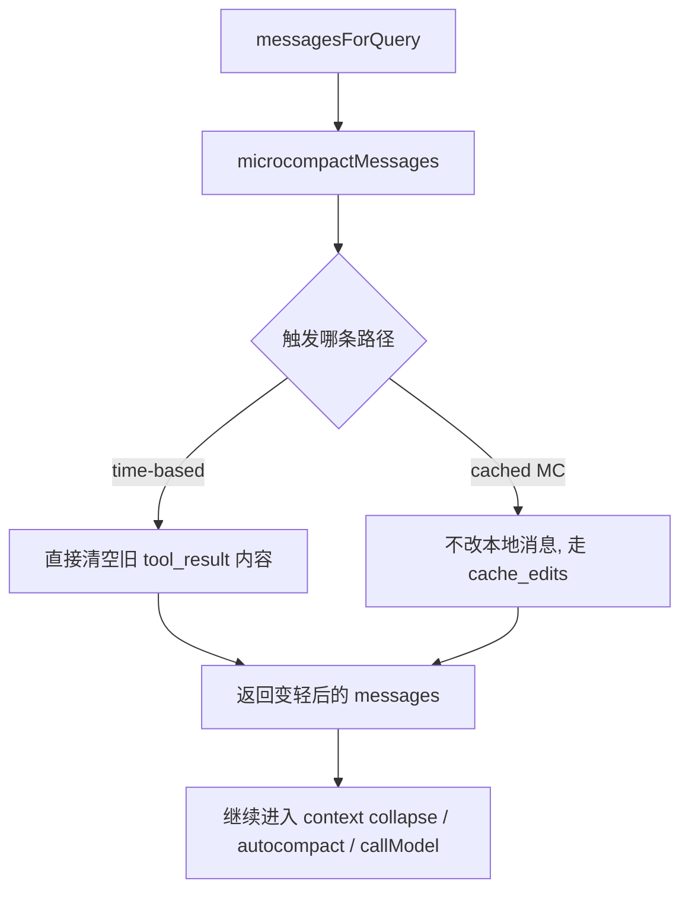
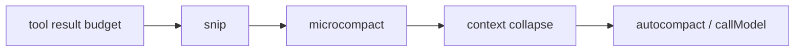
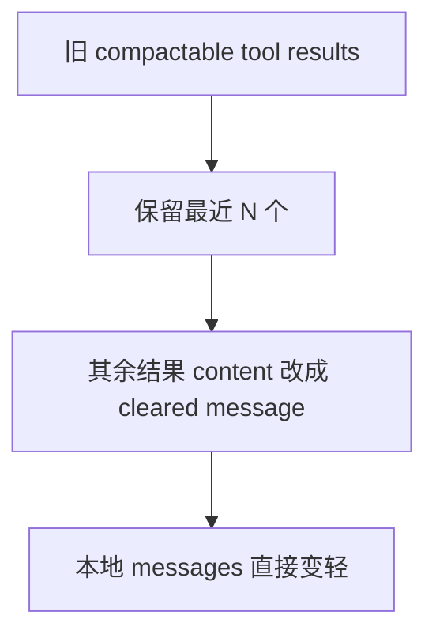
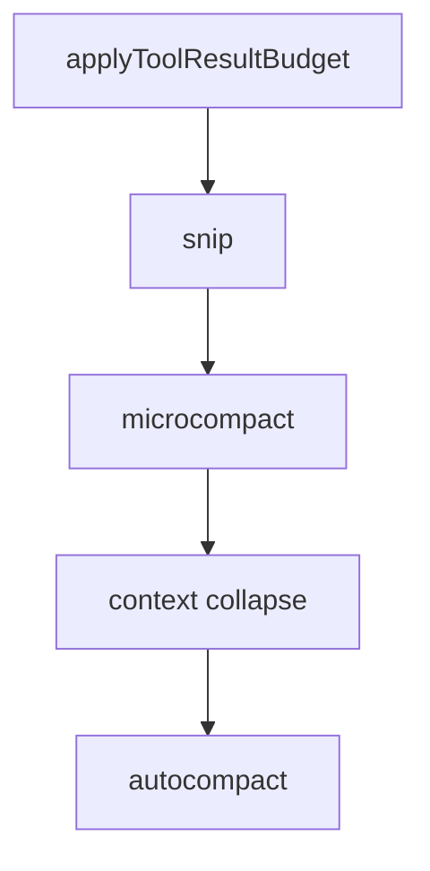

# Claude Code 源码共读笔记 54：microCompact 为什么不是小号 compact，而是另一层上下文治理机制

## 这篇看什么

昨天补完 `compact.ts` 之后，一个关键判断基本已经成立了：

> **compact 不是“写一段摘要”这么简单，而是在重组一份新的 post-compact messages 骨架。**

但如果这时直接把 `microcompact` 理解成“更轻一点、规模更小一点的 compact”，
其实还是会看偏。

因为这次真去读 `microCompact.ts`，会发现它和 regular compact 的思路差别非常大。

它不是：

- 再造一份 boundary + summary + messagesToKeep + attachments 的新骨架

而更接近：

> **在正式 API 调用前，针对特定高成本上下文块，做一次非常克制的局部瘦身，目标优先不是“重讲历史”，而是“别让这轮请求把没必要的大块内容再带进去或再重写一遍”。**

这篇我重点想回答四个问题：

1. `microCompact.ts` 现在到底有哪几条路径
2. 它真正处理的是什么内容
3. 它为什么和 `compact.ts` 不是同一层东西
4. 它和 `context collapse`、`autocompact` 的边界分别在哪里

如果只用一句更直白的话概括，这篇其实在回答：

> **microcompact 不是“小摘要器”，而更像 query 主循环前的一次局部减负动作，主要瞄准的是旧 tool result 这类“很贵、但不值得继续完整带着跑”的上下文负担。**

---

## 先给主结论

如果只先记一句话，我建议记这个：

> **`microCompact.ts` 不是 regular compact 的迷你版，而是一层前置的局部治理机制：它运行在 query 正式调用模型之前，主要针对旧的 compactable tool results 做瘦身；当前主路径要么通过 cache-editing 让服务端在不打烂前缀的前提下忽略旧 tool results，要么在 cache 已冷掉时直接把旧 tool results 的内容清空成占位文本。**

再压缩一点，就是：

- `compact`：重组上下文骨架
- `microcompact`：局部清理高成本 tool result 负担
- `collapse`：读时投影视图折叠

这三者虽然都在“让上下文变轻”，但不是一回事。

---

## 先把总图立住：microcompact 现在主要有两条路径

这张图是整篇的总摘要。

因为一旦你先看到“它分两条路径”，你就不会再把它脑补成一个简单函数：

- 输入长消息
- 输出短摘要

它不是这种东西。

---

# 第一部分：`query.ts` 里的位置，决定了 microcompact 根本不是 compact 的替身

我觉得看 microcompact，第一眼最该看的不是它文件内部，而是它在 `query.ts` 里排在什么位置。

顺序是这样的：

1. 先从 `getMessagesAfterCompactBoundary(messages)` 取当前消息视图
2. 先做 `applyToolResultBudget(...)`
3. 再做 `snip`
4. **再做 `microcompact`**
5. 然后才做 `context collapse`
6. 再往后才轮到更重的 autocompact / 正式请求

这个顺序已经很能说明问题了。

它说明：

> **microcompact 是 query 主循环里一次前置瘦身步骤，而不是 compact 那种“重组后续消息骨架”的大动作。**

尤其 `query.ts` 里那句注释也很关键：

- `Apply microcompact before autocompact`

这说明它的角色更像：

> **先做一次轻量减负，看看能不能把压力降下来；如果还不够，再让更重的机制出手。**

所以从时序上，microcompact 更接近：

- preflight trimming

而不是：

- session-level compaction event

这是理解它的第一把钥匙。

---

## 图 1：microcompact 在时序上是 query 前的前置瘦身层

这张图最重要的作用就是把它从 `compact.ts` 身边先拉开。

---

# 第二部分：`COMPACTABLE_TOOLS` 说明 microcompact 的目标非常具体——不是“所有历史”，而是某些工具结果

microCompact.ts 一上来就把它的目标范围钉得很窄：

它只盯这些工具：

- FileRead
- Shell 系列
- Grep
- Glob
- WebSearch
- WebFetch
- FileEdit
- FileWrite

也就是说，它不是对“任意旧消息”做轻量总结，
而是针对：

> **某些特别容易产出大块结果、又最可能成为上下文负担的工具结果。**

这点非常重要。

因为它说明 microcompact 的世界观不是：

- “历史太长了，我来概括一下对话”

而是：

- “有一类高成本内容（尤其旧 tool_result）在继续带着跑时性价比很低，我来把它们处理掉或淡化掉”

所以它天生就比 `compact` 更窄、更具体、更有工程味。

它更像一把小刀，
不是整个上下文重构器。

---

# 第三部分：cached microcompact 路径最能说明它为什么不是“小号 compact”

这次读源码，最有意思的其实是 cached microcompact 这条路径。

它的注释直接写了几个关键点：

- uses cache editing API
- remove tool results without invalidating the cached prefix
- does **NOT** modify local message content
- no disk persistence

这几句放在一起，基本已经把它和 regular compact 的差别说透了。

### regular compact 干什么
- 真的造出一套新的消息骨架
- 本地 message 结构会变
- 会出现 compact boundary / summary 等结构
- 会影响 transcript / resume 链接层

### cached microcompact 干什么
- 本地消息**不改**
- transcript **不改**
- 也不写一套 compact summary
- 只是给 API 层准备 `cache_edits`
- 让服务端在已有 cache 前提下忽略某些旧 tool result

这已经不是“更轻的 compact”了。

这是另一类机制。

如果要我用一句最短的话总结 cached MC，我会说：

> **它不是在重写消息，而是在利用服务端 cache editing 能力，对这轮请求的前缀使用方式做局部手术。**

这比“小摘要”要精确得多。

---

# 第四部分：cached microcompact 的核心目标，是“减负，但尽量别把 prefix cache 打烂”

这条路径最关键的，是它对 prompt cache 的态度。

regular compact 本质上一定会重构消息视图，
所以它对前缀稳定性影响更大。

但 cached microcompact 明显在追求另一个目标：

> **把不值得继续带着的旧 tool results 从服务端视角删掉，但尽量不破坏可复用的前缀。**

源码里有几个直接证据：

- `notifyCacheDeletion(...)`
- `pendingCacheEdits`
- `pinCacheEdits(...)`
- `getPinnedCacheEdits()`
- baseline `cache_deleted_input_tokens`

尤其 `pendingCacheEdits` 这套设计很有意思。

因为它说明：

- microcompact 本身不直接改 messages
- 而是先生成一块“接下来这轮 API 请求要带上的 cache edit 指令”
- query 之后再结合真实 API usage 去补边界消息

这和 regular compact 那种“先造 postCompactMessages，再让 query 继续跑”完全是两种思想。

所以 cached MC 更像：

> **API 使用策略层的上下文瘦身**

而 regular compact 更像：

> **消息结构层的上下文重构**

我觉得这个区分很关键。

---

# 第五部分：time-based microcompact 更有意思——它甚至不是“总结”，而是直接清空旧 tool_result 内容

如果 cached MC 已经很不像 compact 了，
那 time-based MC 就更明显。

它的触发条件也非常具体：

- 距离上一次 main-loop assistant message 的时间间隔太久
- cache 大概率已经冷掉

这时系统的判断是：

> 反正前缀也要重写了，那不如在请求前直接把旧 tool_result 内容清空，减小这轮真正要重写的体积。

这里最关键的一行其实是：

- `TIME_BASED_MC_CLEARED_MESSAGE = '[Old tool result content cleared]'`

这说明 time-based MC 根本不在试图“保留语义摘要”。

它做的是：

- 找出旧的 compactable tool results
- 保留最近 N 个
- 其余直接把内容替换成一个占位字符串

这不是摘要。

这是内容清空。

所以如果只看这条路径，你几乎已经不能再把 microcompact 理解成“小号 compact”了。

它更像：

> **上下文卫生处理：把又旧、又大、又不值得完整重带的工具结果内容直接擦成占位符。**

---

## 图 2：time-based microcompact 的动作不是总结，而是清空旧 tool_result 内容

这张图最想打掉的误解是：

> **microcompact 不一定会“总结”，有时候它就是直接清空。**

---

# 第六部分：为什么 time-based 路径只在 cache 已冷掉时才触发

这一层很值得单独讲，因为它把 microcompact 的工程意图说得很透。

源码里写得很直白：

- 如果距离上一次 assistant 消息太久，服务端 cache 已经过期
- 这时候 full prefix 反正要重写
- 那就先 content-clear 旧 tool results

换句话说，time-based MC 背后的思路不是：

- “旧消息难看，我整理一下”

而是：

- “既然这次无论如何都要重新写很长前缀，那就提前把最贵但价值最低的部分削掉。”

这非常工程。

它把 microcompact 明确放在了：

> **请求成本治理**

而不是：

> **会话叙事整理**

这也是为什么我越来越不想把 microcompact 跟 compact 混讲。

它俩虽然都在减上下文，
但心智模型完全不一样。

---

# 第七部分：`createMicrocompactBoundaryMessage(...)` 说明它虽然轻，但仍然是显式结构事件

虽然 microcompact 比 compact 轻得多，
但它也不是完全隐形。

`utils/messages.ts` 里专门有：

- `createMicrocompactBoundaryMessage(...)`

它会生成一个：

- `subtype: 'microcompact_boundary'`
- 带 `microcompactMetadata`

metadata 里会有：

- `trigger`
- `preTokens`
- `tokensSaved`
- `compactedToolIds`
- `clearedAttachmentUUIDs`

这个边界消息的存在，说明两件事：

### 1. microcompact 虽然轻，但不是完全无痕
系统仍然会把“刚才做过一次 microcompact”作为结构事件记录出来。

### 2. 它记录的重点和 regular compact 不一样
regular compact 重点记的是：
- boundary
- summary
- preserved segment
- compaction structure

microcompact 重点记的是：
- 省了多少 token
- 清了哪些 tool result
- 哪些 attachment UUID 受影响

也就是说，microcompact 的边界消息更像：

> **一次局部减负操作的审计点**

而不是上下文重构的主锚点。

---

# 第八部分：microcompact 和 `applyToolResultBudget`、`snip`、`collapse`、`autocompact` 的边界

这部分我觉得最值得给一个并排对比，不然很容易在脑子里混成一锅。

## 1. `applyToolResultBudget`
更像：

- **预算约束层**
- 针对 aggregate tool result size
- 可以结合 content replacement 做持久化记录

它处理的是：

> 单条或聚合 tool result 太大怎么办

---

## 2. `snip`
更像：

- **通用轻量剪枝**
- 不只盯 tool results
- 目标是先剪掉一部分上下文压力

---

## 3. `microcompact`
更像：

- **局部工具结果减负层**
- 非常偏 tool-result-specific
- 要么 cache-edit，要么清空旧内容

它处理的是：

> 有些旧工具结果继续原样带着，太贵也太不值

---

## 4. `context collapse`
更像：

- **读时投影视图折叠**
- 不一定直接改本地 transcript/message 真身
- 重点是给模型看的视图变了

---

## 5. `autocompact`
更像：

- **重型上下文压缩策略**
- 当上面这些还不够时，启动真正的 compact

所以如果只留一句最实用的分工，我会写成：

> **budget 管“不能太大”，snip 管“先剪一点”，microcompact 管“旧 tool result 别再完整背着跑”，collapse 管“给模型看的视图折起来”，autocompact 管“真的不行了就上整套 compact”。**

---

## 图 3：五层上下文治理的分工

这张图不是精确源码依赖图，
但很适合记分工。

---

# 第九部分：为什么我现在更愿意把 microcompact 叫“微压缩”而不是“小型 compact”

如果只是翻译问题，其实怎么叫都行。

但读完源码之后，我会更偏向：

- `microcompact` → **微压缩**

原因不是因为它“听起来更顺”，
而是因为它确实不像一个完整的 compact 流程。

“微压缩”这个词至少更容易让人想到：

- 局部
- 轻量
- 针对性
- 不一定重写消息骨架

而“小型 compact”会让人误会成：

- 只是规模小一点的 regular compact

这会把理解带偏。

所以在我们的共读体系里，我建议统一成：

- `compact` → **上下文压缩**
- `microcompact` → **微压缩**
- `context collapse` → **上下文折叠**

这样三者的职责边界会清楚很多。

---

# 术语补充 / 名词解释

这篇里几个词很容易和前几篇串线，我先单独落一下。

## 1. microcompact
建议翻成：

- **微压缩**

重点不是“更小的 compact”，
而是“更局部、更轻、更偏请求前瘦身的一层治理动作”。

---

## 2. cached microcompact
建议理解成：

- **缓存编辑型微压缩**
- 或 **基于 cache editing 的微压缩**

它不改本地 messages，主要通过 API 层的 cache_edits 来让旧 tool result 不再继续拖累请求。

---

## 3. time-based microcompact
建议理解成：

- **基于时间间隔触发的微压缩**

它在 cache 已冷掉时触发，直接把旧 tool_result 内容清空成占位字符串。

---

## 4. compactable tools
建议理解成：

- **可微压缩工具集**
- 或 **允许做微压缩处理的工具**

并不是所有工具结果都能动，只有一组明确列出来的高成本工具结果会被处理。

---

## 5. cache_edits
建议理解成：

- **缓存编辑指令**

它不是本地消息改写，而是随 API 请求发送、告诉服务端如何在缓存前缀上做删除/调整的一组指令。

---

## 6. cleared message
这里就是那个占位字符串：

- `[Old tool result content cleared]`

意思不是工具调用没发生，
而是“这个旧结果的详细内容已不再保留进这轮上下文”。

---

# 这一篇最想保住的判断

如果把整篇压成一句最关键的话，我会留：

> **`microCompact.ts` 不是“小号 compact”，而是 query 前的一层局部治理机制：它专门盯旧的高成本 tool results，要么通过 cache editing 在不打烂前缀的前提下让服务端忽略它们，要么在 cache 已冷掉时直接把其内容清空成占位文本，从而在更重的 collapse / autocompact 之前先做一次请求级减负。**

这句话里最重要的点有四个：

- 不是小号 compact
- 主要盯旧 tool results
- 一条 cache-edit 路径，一条 time-based 清空路径
- 它发生在更重治理层之前

---

# 我现在对 `microCompact.ts` 的最短总结

如果只留一句最短的话，我会留：

> **`microCompact.ts` 是 Claude Code 主循环里的局部减负层：不重组上下文骨架，只优先处理那些“继续完整带着跑很贵、但价值没那么高”的旧工具结果。**

---

# 这篇最值得记住的几个判断

### 判断 1：microcompact 在 `query.ts` 里是发生在正式模型请求之前的一层前置瘦身步骤，不是 regular compact 的替身

### 判断 2：它处理的目标非常具体，主要是某些 compactable tools 产生的旧 tool results，而不是整段对话历史

### 判断 3：cached microcompact 根本不改本地 messages，而是通过 cache_edits 让服务端在保前缀 cache 的前提下忽略某些旧结果

### 判断 4：time-based microcompact 在 cache 已冷掉时触发，做的不是总结，而是把旧 tool_result 内容直接清空成占位文本

### 判断 5：microcompact 虽然轻，但仍然会生成 `microcompact_boundary`，记录这次局部减负事件节省了多少 tokens、清了哪些工具结果

### 判断 6：它和 budget、snip、collapse、autocompact 是并列分工关系：microcompact 专门负责旧 tool result 的局部减负，而不是总管所有上下文压缩

---

# 下一步最顺怎么接

如果继续沿这条线往下写，我觉得最顺有两个方向：

### 方向 A：接 `conversationRecovery.ts`
现在 `compact` 和 `microcompact` 都立住了，再去看 resume 怎么恢复：

- content replacement
- compact boundary
- collapse commit
- skills / hooks / interruption state

会非常顺。

### 方向 B：补一篇“compact / microcompact / context collapse 对照表”
专门做一篇概念对照，不再拆单文件。

如果只选一个，我会更倾向 **方向 A**。

因为这条线现在已经把“运行时如何减负”讲清了，下一步最自然就是“恢复时这些结构怎么重新接回来”。