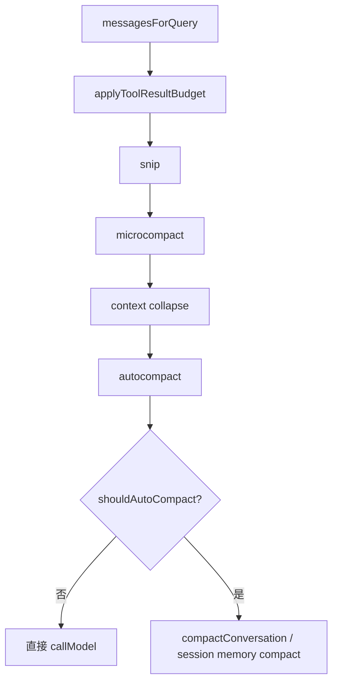
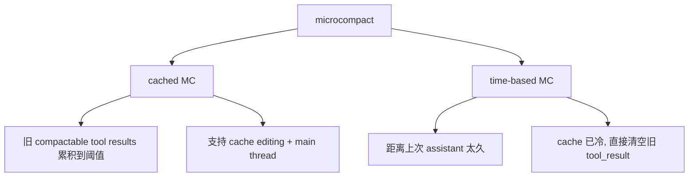
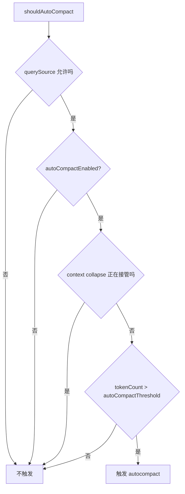

# Claude Code 源码共读笔记 55：什么时候会触发 compact，什么时候会触发 microcompact

## 这篇看什么

昨天补完 `compact.ts` 和 `microCompact.ts` 之后，一个很自然的问题就冒出来了：

> **那它们到底分别在什么时候触发？**

如果只说“上下文长了会 compact”“tool result 太多会 microcompact”，
其实还是太粗。

因为源码里真实发生的事情，比这复杂得多：

- query 前不是只有一个开关
- 而是一串按顺序执行的上下文治理链
- 每一层解决的问题不一样
- 触发条件也不一样
- 而且某些层是并列补位关系，不是互斥关系

这也是为什么光背 `compact` 和 `microcompact` 两个词，经常还是会混。

这篇我想做的事很具体：

> **把 `applyToolResultBudget`、`snip`、`microcompact`、`context collapse`、`autocompact/compact` 这几层，按 query 真正执行顺序重新排出来，并逐层解释：它们分别在什么条件下触发、各自想解决什么问题、互相之间是什么关系。**

如果只用一句人话概括，这篇其实是在回答：

> **Claude Code 在正式发模型请求前，会先沿着一条“从轻到重”的治理链尽量减负；microcompact 属于中间偏轻的一层，compact 属于最后更重的一层。**

---

## 先给主结论

如果只先记一句话，我建议记这个：

> **在 Claude Code 的 query 主循环里，`microcompact` 通常发生在正式 API 请求之前、且先于 `autocompact`；它优先处理旧 tool result 这类局部负担。`compact` 则通常发生在更轻治理之后，系统仍然判断整体上下文已超过自动压缩阈值时，由 `autoCompactIfNeeded(...)` 触发，进入真正的上下文骨架重组。**

再压缩一点，就是：

- **先做局部治理**：budget → snip → microcompact → collapse
- **还不够再做重型治理**：autocompact → compactConversation

这是这篇最重要的总判断。

---

## 先把总图立住：query 前的触发链不是一个开关，而是五层治理链

这张图几乎就是整篇的答案。

因为它先把一个很重要的事实立住了：

> **compact 和 microcompact 不是同一层开关。**

不是“上下文大了，要么触发 A，要么触发 B”。

而是：

> **先走一串从轻到重的治理链，microcompact 在前，compact 在后。**

这一步先记住，后面的触发逻辑就不会那么乱。

---

# 第一部分：`microcompact` 什么时候触发——它发生在 query 前，而且不是看“整段会话太长”才动

先说 `microcompact`。

最重要的不是它的实现细节，而是它在 `query.ts` 里的位置。

在当前主循环里，它发生在：

- `applyToolResultBudget(...)` 之后
- `snip` 之后
- `context collapse` 之前
- `autocompact` 之前

这说明第一件很重要的事：

> **microcompact 是一次 query 前的局部减负动作，不是“上下文已经爆了才被迫启动的大压缩”。**

也就是说，它的触发哲学更接近：

- 有一些特定负担可以先瘦一点
- 先瘦了再看要不要动更重的机制

这决定了它和 regular compact 根本不是一个层级。

---

# 第二部分：microcompact 现在其实有两类触发——一个看工具结果数量/阈值，一个看时间间隔

真读 `microCompact.ts`，会发现它不是单一路径，
而是两类主要触发。

## 第一类：cached microcompact 触发
这类触发发生在：

- `feature('CACHED_MICROCOMPACT')` 打开
- 当前 model 支持 cache editing
- 当前 querySource 属于 main thread
- 注册过的 compactable tool results 已经积累到值得删一批的程度

它盯的是：

- FileRead
- Shell
- Grep
- Glob
- WebSearch
- WebFetch
- FileEdit
- FileWrite

这些工具产出的旧 `tool_result`。

它真正判断的不是“整段上下文总 token 数已经炸了”，
而是：

> **是否已经有足够多“继续完整带着跑不值”的旧工具结果，可以通过 cache editing 让服务端忽略掉。**

所以这类触发本质上是：

- **局部结构型触发**
- **基于 compactable tool results 的积累情况**
- **优先考虑不打烂 prefix cache**

注意，这里不是“消息越长越触发”。

它更像：

> **这批旧工具结果已经到了该删的时候。**

---

## 第二类：time-based microcompact 触发
这类触发更明确，甚至可以说更“硬”。

它看的不是工具结果累计数量，而是：

- 距离上一次 main-loop assistant message 过去了多久

如果：

- `enabled = true`
- 当前是 main thread
- `(now - last assistant timestamp)` 超过 `gapThresholdMinutes`

就触发。

而默认安全值写得很清楚：

- `gapThresholdMinutes: 60`

注释也说明了为什么：

> 1 小时后，服务端的 prompt cache 基本可以确定已经过期。

所以 time-based MC 的核心判断不是：

- 会话太长

而是：

> **cache 已冷，反正这轮前缀要重写，那就先把旧 tool_result 内容清掉，别让它们也跟着被重写。**

这类触发本质上是：

- **时间型触发**
- **cache-cold 触发**
- **直接内容清空型减负**

这和 cached MC 的“保 cache”是同一体系里的两面。

一个是：
- cache 还热，尽量编辑 cache 使用方式

另一个是：
- cache 已冷，直接把不值的旧内容清掉

---

## 图 1：microcompact 的两类主要触发

这张图建议记住，因为它直接回答“microcompact 什么时候触发”。

---

# 第三部分：microcompact 触发后到底做什么——这也决定了它为什么不等于 compact

触发后，microcompact 做的事情分两种。

## cached MC 触发后
- 不改本地 `messages`
- 不生成 summary
- 不插 regular compact boundary
- 只是准备 `cache_edits`
- 让 API 层在服务端忽略某些旧 tool results

## time-based MC 触发后
- 直接改本地消息中的旧 `tool_result` 内容
- 把它们替换成：
  - `[Old tool result content cleared]`
- 保留最近 `keepRecent` 个
- 其余清空

所以你会发现：

> **microcompact 的触发目标始终是局部减负，而不是重组整段上下文叙事。**

这点要反复记。

因为它直接解释了为什么：

- microcompact 会早于 compact
- 也不会天然取代 compact

它的目标根本更窄。

---

# 第四部分：那 compact 什么时候触发——它看的是整体上下文压力，而不是某类局部内容是否该删

现在说 `compact`。

compact 不是在 `microCompact.ts` 里触发的，
而是主要在：

- `autoCompactIfNeeded(...)`

这条链里触发。

而 `autoCompactIfNeeded(...)` 的关键入口判断是：

- `shouldAutoCompact(...)`

这一步看的是什么？

不是旧 tool result 个数。

而是更整体的：

- 当前 token count
- 当前 model 的自动压缩阈值
- 当前有效窗口大小
- snip 已经释放了多少 token
- 当前 querySource 是否允许自动压缩
- 一堆递归/模式保护条件

所以 compact 的核心触发条件不是：

> 某类旧内容很贵

而是：

> **整个上下文已经到了该重型压缩的程度。**

这就是它和 microcompact 最本质的差别。

---

# 第五部分：`shouldAutoCompact(...)` 的触发判断，比“token 太多了”更讲究

如果把 `shouldAutoCompact(...)` 只理解成：

- token 超阈值 → 压缩

那还是太粗。

它实际上先过了很多保护条件：

## 1. 某些 querySource 直接不允许 autocompact
比如：

- `session_memory`
- `compact`
- `marble_origami`（context collapse agent）

原因也很工程：

- 避免递归死锁
- 避免和 context collapse 机制打架

## 2. 可以被环境变量和用户设置关掉
比如：

- `DISABLE_AUTO_COMPACT`
- 用户配置 `autoCompactEnabled`

## 3. context collapse 开启时，会抑制 proactive autocompact
这点特别重要。

源码注释写得很明确：

> 当 context collapse 开着时，它本身就是上下文管理系统；
> autocompact 如果在 90%-95% 这个区间抢先触发，会把 collapse 本来能保住的粒度上下文直接打成一份 summary。

也就是说：

> **不是一长就 compact。**

Claude Code 会先让别的上下文治理层去处理。

## 4. 最后才看 token count vs threshold
也就是：

- `tokenCountWithEstimation(messages) - snipTokensFreed`
- 与 `getAutoCompactThreshold(model)` 对比

只有这时候仍然高于阈值，
才会真正进入 autocompact 路径。

所以如果用一句更准确的话总结：

> **compact 是在一堆局部减负和模式保护之后，仍然判断整体上下文超过自动压缩阈值时才触发。**

这比“上下文大了就 compact”要准确得多。

---

## 图 2：compact 的触发不是单阈值，而是一串保护条件之后的整体判断

这张图比一句“超阈值就压”更接近真实逻辑。

---

# 第六部分：autocompact 真触发后，也不是立刻只有一条路——还会先试 session memory compaction

这点也很容易漏掉。

`autoCompactIfNeeded(...)` 在真的决定要压之后，
并不是直接无脑调用 `compactConversation(...)`。

它会先试：

- `trySessionMemoryCompaction(...)`

如果 session memory compaction 成功，
那可能就不用走 legacy/full compact 了。

只有 session memory 这条试不成，
才会再走：

- `compactConversation(...)`

这说明什么？

说明 compact 体系自己内部也有“先试更温和路径，再上更重路径”的倾向。

所以整条上下文治理链，其实是层层递进的：

- budget
- snip
- microcompact
- collapse
- autocompact
- session memory compact
- regular compact

这条链越往后，动作越重。

---

# 第七部分：把 compact 和 microcompact 并排对比，最实用的不是“哪个轻哪个重”，而是“它们各自看什么信号”

我觉得这个问题最适合用“看什么信号”来记。

## microcompact 看什么信号
### cached MC：
- compactable tool results 是否积累到该删一批
- 当前模型是否支持 cache editing
- 当前是否 main thread

### time-based MC：
- 距离上次 assistant 是否已经太久
- cache 是否大概率已冷

所以 microcompact 看的是：

> **局部负担信号**

---

## compact 看什么信号
- querySource 是否允许
- context collapse 是否已接管
- autoCompact 设置是否开启
- 当前整体 token count 是否超过自动压缩阈值

所以 compact 看的是：

> **整体压力信号**

这个对比非常实用。

如果你问我最短怎么分：

> **microcompact 看局部贵不贵，compact 看整体撑不撑得住。**

---

# 第八部分：为什么有时会先触发 microcompact，但最终还是触发 compact

这点也值得单独讲一下。

因为很多人会下意识以为：

- 既然都做了 microcompact，应该就不会再 compact 了吧？

其实不一定。

原因很简单：

> **microcompact 只解决它负责那一小块问题。**

比如：

- 它可以清旧 tool results
- 但不会帮你概括整段长历史
- 不会生成 summary
- 不会重建 postCompactMessages

所以如果：

- 会话里真正膨胀的不只是旧工具结果
- 或者就算清了一部分，整体 token 还是高于 autocompact threshold

那后面仍然会继续触发 autocompact / compact。

这不是两套机制冲突，
而是它们本来就是：

> **先局部减负，再决定要不要上重型压缩。**

所以你看到“同一轮里 microcompact 之后又 compact”，
不要觉得怪。

这正是这条治理链设计出来要干的事。

---

# 第九部分：如果只想凭现象判断，怎么区分“这是 microcompact 触发了”还是“这是 compact 触发了”

这个问题很实用，我给一个现象层判断法。

## 更像 microcompact 的现象
- 清掉了一批旧 tool result
- 出现 `microcompact_boundary`
- 没看到 regular compact summary
- 没有重建一整套 boundary + summary + keep + attachments 骨架
- 可能伴随 cache deletion / cache_edits 语义

## 更像 compact 的现象
- 明显出现 compact summary
- 插入 regular compact boundary
- `messagesForQuery` 被替换成新的 `postCompactMessages`
- 后续 query 继续在新骨架上跑

如果只留一句最实用的话：

> **只清旧工具结果，更像 microcompact；重做上下文骨架，才是 compact。**

---

# 术语补充 / 名词解释

这篇里出现了不少容易混的词，我单独落一下。

## 1. trigger
这里建议统一理解成：

- **触发条件**
- 或 **触发信号**

不是简单“有没有开功能”，而是“在当前 query 环境里，满足了什么判断逻辑才启动某层治理动作”。

---

## 2. shouldAutoCompact
建议理解成：

- **是否应触发自动压缩的总判断函数**

它不是单看 token 数，而是过了一堆 guard 之后的总体判断。

---

## 3. autoCompactThreshold
建议翻成：

- **自动压缩阈值**

意思是整体上下文压力到了这个水平之后，才值得上更重的 compact。

---

## 4. cached microcompact
建议理解成：

- **缓存编辑型微压缩**

重点是利用服务端 cache editing 能力，对旧 tool results 做局部删除，而不重组本地消息骨架。

---

## 5. time-based microcompact
建议理解成：

- **时间触发型微压缩**

当距离上次 assistant 太久、cache 已冷时触发，直接清空旧 tool result 内容。

---

## 6. session memory compaction
建议理解成：

- **会话记忆压缩路径**

它是 autocompact 真触发后先尝试的一条较温和路线，不等于 regular compact 本体。

---

# 这一篇最想保住的判断

如果把整篇压成一句最关键的话，我会留：

> **`microcompact` 和 `compact` 不是同一层触发器：前者主要看局部高成本 tool result 是否值得先做请求前减负，后者则是在 budget、snip、microcompact、collapse 等更轻治理之后，系统仍然判断整体上下文超过自动压缩阈值时，才通过 `autoCompactIfNeeded(...)` 进入真正的上下文骨架重组。**

这句话里最重要的点有四个：

- 它们不是同一层
- microcompact 看局部负担
- compact 看整体压力
- compact 往往是在更轻治理之后才上场

---

# 我现在对这个问题的最短总结

如果只留一句最短的话，我会留：

> **microcompact 在“还能先局部瘦身”时触发，compact 在“局部瘦身之后整体仍然超阈值”时触发。**

---

# 这篇最值得记住的几个判断

### 判断 1：`microcompact` 在 query 时序上发生在 `autocompact` 之前，它本质上是一次请求前的局部减负

### 判断 2：cached microcompact 主要看 compactable tool results 的积累情况，以及当前模型/线程是否支持 cache editing

### 判断 3：time-based microcompact 主要看“距离上次 assistant 太久、cache 已冷”这个时间信号，而不是整体 token 是否超阈值

### 判断 4：`compact` 主要由 `autoCompactIfNeeded(...)` 驱动，而它的核心判断函数 `shouldAutoCompact(...)` 看的是整体上下文压力，不是某类局部内容

### 判断 5：`shouldAutoCompact(...)` 不是单一 token 阈值判断，还会考虑 querySource 保护、用户设置、context collapse 接管等一系列 guard

### 判断 6：即使 microcompact 先触发，后面仍然可能继续触发 compact，因为 microcompact 只处理局部 tool result 负担，不负责重组整段上下文骨架

---

# 下一步最顺怎么接

如果继续沿这条线往下写，我觉得最顺有两个方向：

### 方向 A：接 `conversationRecovery.ts`
现在“什么时候减负、怎么减负”已经比较清楚了，下一步自然就是看：

- resume 时这些边界、替换记录、collapse commit 怎么恢复
- 为什么恢复后还能延续前面的上下文治理结果

### 方向 B：单做一篇“上下文治理总对照表”
把：

- tool result budget
- snip
- microcompact
- context collapse
- session memory compact
- compact

按“触发条件 / 动作 / 是否改本地消息 / 是否改骨架 / 是否影响 resume”做成一张总表。

如果只选一个，我会更倾向 **方向 A**。

因为这个问题已经把触发逻辑讲得差不多了，接着去看恢复链，会形成真正的闭环。