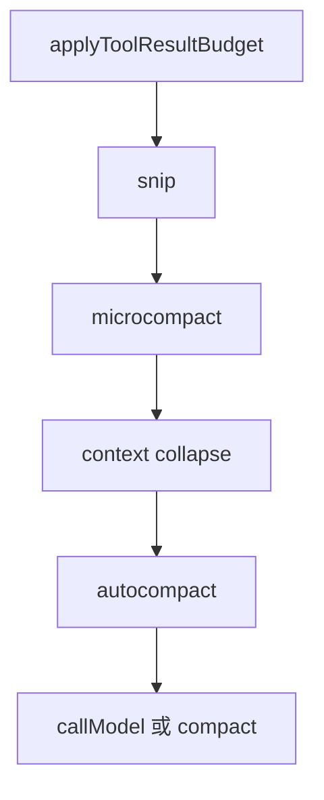
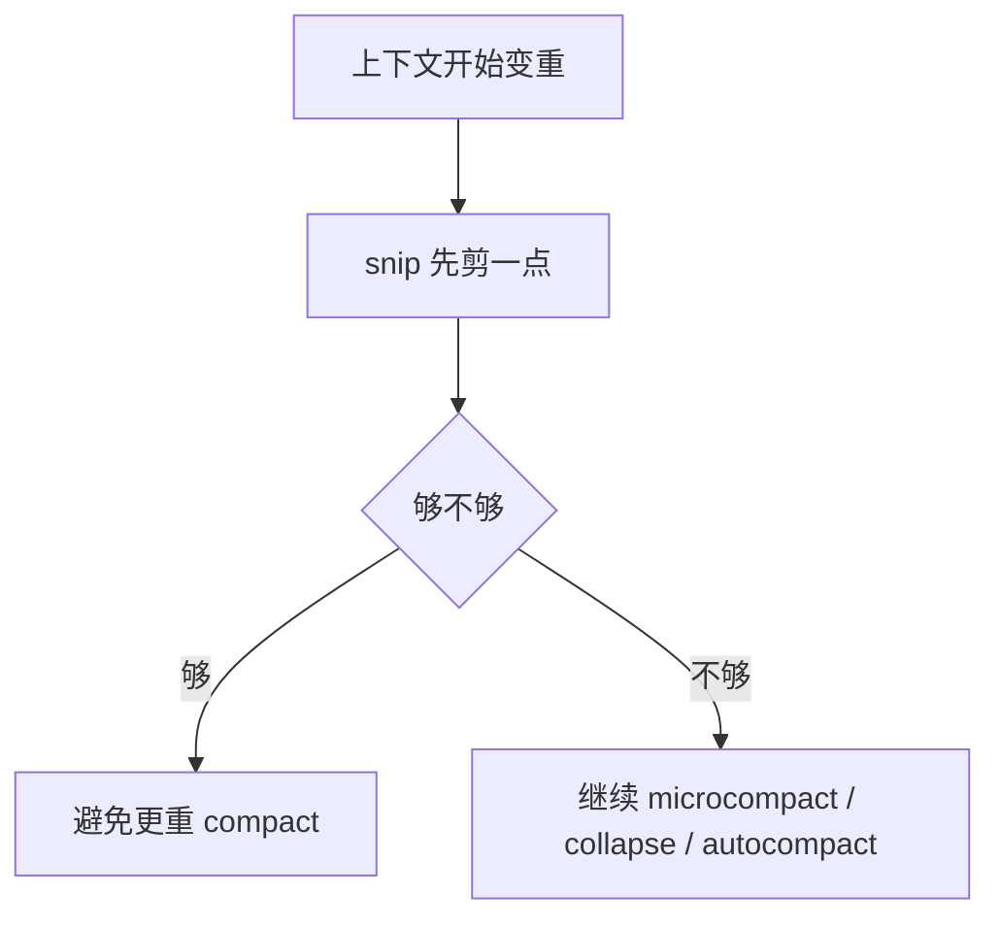

> 校正说明（2026-04-05）：第 56 篇主要回答的是 snip 在治理链里的**架构角色**。如果你更关心“它具体裁掉了什么”，请接着看第 58 篇《snip 到底裁掉了什么》，那篇补充了 model-facing 视图过滤、snipped messages、UI scrollback 与 resume 的关系。

# Claude Code 源码共读笔记 56：snip 是主循环里的轻量剪枝层

## 这篇看什么

前面连续补了：

- `compact.ts`
- `microCompact.ts`
- 什么时候会触发 compact / microcompact

这时候治理链里还剩一个很容易“看见了但没说透”的角色：

- `snip`

它在 `query.ts` 里明明有明确位置，
而且还会影响后面的 autocompact 判断，
但如果不单独拿出来讲，很容易长期被误解成：

- 一个不重要的小优化
- 或者“差不多就是 microcompact 吧”

这两个理解都不准。

这篇我不打算把它写成大总纲，
而是把它作为一篇**治理链补位篇**来讲清楚三件事：

1. `snip` 在主循环里的位置是什么
2. `snip` 到底解决什么问题
3. 它和 `microcompact`、`compact` 的边界到底在哪

先提前说结论：

> **`snip` 不是完整压缩，也不是只盯旧 tool result 的精准清理；它更像 query 前的一刀轻量剪枝，用最小动作先释放一部分上下文压力。**

---

## 先给主结论

如果只先记一句话，我建议记这个：

> **`snip` 是 Claude Code 主循环里的轻量剪枝层：它发生在 query 正式发请求前、位于 tool result budget 之后、microcompact 之前；它的职责不是重组上下文骨架，而是先用一刀更轻的裁剪释放一部分 token 压力，并把这部分已释放的 token 数显式传给后面的 autocompact 判断。**

再压缩一点，就是：

- `snip` 比 `compact` 轻
- `snip` 比 `microcompact` 更泛
- `snip` 的目标是：**先剪一点，再看后面还需不需要更重的治理**

这就是这篇最重要的判断。

---

## 先把总图立住：snip 在治理链里的位置非常关键

从 `query.ts` 看，顺序是：

这张图特别关键。

因为只要先把位置记住，很多概念就不会混：

- 它不是最早的预算层
- 它不是最晚的重型 compact
- 它处在中间，承担“先轻剪一刀”的角色

所以 `snip` 的第一重意义，不是它做了什么，
而是：

> **它被放在了一条“从轻到重”的治理链中间。**

---

# 第一部分：从 `query.ts` 看，snip 的角色是“先释放一点，再决定要不要上更重机制”

在 `query.ts` 里，`snip` 的调用非常直接：

- `const snipResult = snipModule!.snipCompactIfNeeded(messagesForQuery)`
- `messagesForQuery = snipResult.messages`
- `snipTokensFreed = snipResult.tokensFreed`
- 如果有 `boundaryMessage`，就把它 yield 出去

从这几个返回值，其实已经能看出很多东西。

它返回的是：

- 新的 `messages`
- 释放了多少 `tokensFreed`
- 可选的 `boundaryMessage`

这里最值钱的一点是：

> **snip 不会像 regular compact 一样产出 summaryMessages / messagesToKeep / attachments / hookResults 那种完整重组结构。**

它给的只是：

- 剪完后的 messages
- 以及“我大概释放了多少 token”

这非常说明它的定位。

它更像：

> **一刀剪枝**

而不是：

> **一次上下文重构工程**

所以从输出形态看，snip 就已经和 compact 拉开了。

---

# 第二部分：为什么我更愿意叫它“轻量剪枝”，而不是“小型压缩”

如果只从字面看，`snip` 其实可以翻成：

- 裁一刀
- 剪掉一点
- 截去一段

但放到 Claude Code 的治理链里，我更愿意统一叫：

> **轻量剪枝**

原因是这个词更贴它的几个核心特征：

## 1. 它是轻的
没有 regular compact 那么重。

## 2. 它是局部的
不像 full compact 要重组整个后续骨架。

## 3. 它是前置的
发生在 microcompact / collapse / autocompact 之前。

## 4. 它的目标是减负，不是重讲历史
从现有源码能坐实的部分看，它最明确的产物是：

- 剪完后的 messages
- 释放的 token 数

而不是摘要内容本身。

所以“剪枝”这个词比“压缩”更准。

“压缩”太容易让人脑内自动联想到：

- summary
- compact boundary
- postCompactMessages

这些其实不是 snip 的主特征。

---

# 第三部分：snip 最关键的一个作用，不是“它剪了什么”，而是“它会影响 autocompact 的触发判断”

我觉得这是 snip 最值得单独写一篇的原因。

如果它只是个无关紧要的小优化，
那其实没必要讲。

但源码里有一句非常关键的话：

- `snipTokensFreed is plumbed to autocompact so its threshold check reflects what snip removed`

意思是：

> **后面的 autocompact 判断，必须把 snip 已经释放掉的 token 算进去。**

为什么要这样？

因为 `tokenCountWithEstimation(messages)` 读到的有些 usage 信息是“受保护尾部 assistant”的旧值，
它自己不一定立刻反映出 snip 已经帮你减掉了多少上下文。

如果不把 `snipTokensFreed` 单独扣掉，
就会出现一个很别扭的问题：

- snip 明明已经把你从危险边缘拉回来一点
- 但 autocompact 还是按旧体积判断
- 于是系统可能误以为“还是超阈值”，继续上重型 compact

这就把 snip 的意义抵消掉了。

所以从工程角度看，snip 真正重要的地方是：

> **它不只是剪一下，它还改写了后续阈值判断的输入。**

这一点我觉得特别值钱。

因为它说明 snip 在系统里不是“可有可无的小修饰”，
而是：

> **整体治理链里一个真正被下游逻辑尊重的减压步骤。**

---

## 图 1：snip 的价值不仅在“剪”，还在“改变后面的阈值判断”

这张图是这篇最该记住的一张图。

---

# 第四部分：snip 和 microcompact 的边界——一个更泛，一个更专

我们刚补完了 `microCompact.ts`，
所以现在最容易发生的混淆就是：

> snip 和 microcompact 到底差在哪？

我觉得最实用的分法不是“哪个更大哪个更小”，
而是：

> **snip 更泛，microcompact 更专。**

## snip 更像什么
- 通用轻量剪枝层
- 目标是先释放一部分上下文压力
- 不强调只处理某类工具结果
- 最显式的输出是 `messages + tokensFreed + boundaryMessage`

## microcompact 更像什么
- 专门处理某些 compactable tools 的旧 `tool_result`
- 要么 cache editing
- 要么在 cache 冷掉时清空旧 tool_result 内容
- 更明确地偏向 tool-result-specific 减负

所以如果要一句最短对比：

> **snip 是通用小刀，microcompact 是旧 tool result 专用小刀。**

这个区分非常实用。

---

# 第五部分：snip 和 compact 的边界——一个先剪一点，一个重组骨架

snip 和 compact 的差别就更明显了。

## snip 做什么
- 剪完之后继续沿原有消息世界往下走
- 不造完整的 compact summary
- 不造 full post-compact bundle
- 不做 boundary + summary + keep + attachments + hooks 那套整装流程

## compact 做什么
- 真正进入 `compactConversation(...)`
- 造出新的 `CompactionResult`
- 再由 `buildPostCompactMessages(...)` 拼成全新的 post-compact messages
- 当前 query 原地切换到新骨架继续跑

所以：

> **snip 更像“原链上剪掉一点”**

而：

> **compact 更像“重建一套新链骨架”**

如果你只记这个区分，就已经够用了。

---

# 第六部分：snip 和 context collapse 的边界——一个直接改当前消息视图，一个更像读时投影折叠

这组也容易混。

从 `query.ts` 的顺序看，snip 在 `context collapse` 前面。

而且现在能从源码明确看出来的是：

- snip 会直接给出新的 `messagesForQuery`
- 还会给 `tokensFreed`
- boundaryMessage 还会被 yield

这说明 snip 是一个更“显式的当前视图改动”。

而我们前面读 context collapse 时已经知道：

- 它更像读时投影
- 它不一定直接在 REPL 消息数组里插一串普通 summary 消息
- 它有自己的 commit/store/projectView 那套逻辑

所以如果要最短区分：

> **snip 更像当前 query 视图上的一次显式小裁剪，collapse 更像一套持续生效的读时折叠机制。**

这两者虽然都能让“送模内容变轻”，
但不是一个层次的手法。

---

# 第七部分：snip 为什么不是可有可无——因为没有它，系统会更容易过早落到更重的 compact

如果没有 snip，会发生什么？

从当前这条治理链倒推，答案其实很清楚：

- tool result budget 之后
- 就直接进入 microcompact / collapse / autocompact

那就意味着：

> **系统少了一层“先用最小代价释放一点压力”的缓冲带。**

这层缓冲带的价值在于：

- 有些 turn 其实还没糟到必须上 compact
- 只是略微超重、或者略微危险
- 这时候如果先剪一点，就可能避免立刻进入更重的机制

换句话说，snip 的价值不是“它能解决最难的问题”，
而是：

> **它能避免系统太早动用更重的治理手段。**

这在工程上很重要。

因为越重的治理：

- 越容易改变上下文结构
- 越可能影响粒度
- 越需要更复杂的恢复逻辑

而 snip 恰恰是那种：

- 先试最小动作
- 先保住原链尽可能多的东西
- 不够再升级

这是一种很好的分层治理设计。

---

## 图 2：snip 的意义是给更重治理加一层缓冲带

这张图我觉得也很重要。

因为它把 snip 的工程价值说得很直观。

---

# 第八部分：这篇里一个需要诚实交代的边界

这里我也想把边界说清楚。

当前本地源码里，`query.ts` 明确是动态 require 了：

- `./services/compact/snipCompact.js`

但在你这份本地还原源码目录里，
我没有找到对应的 `snipCompact.ts` 源文件。

这意味着什么？

意味着：

- 这篇里我能非常确定地讲清它在主循环里的**位置**、**输入输出形态**、**下游影响**
- 也能基于这些确定它的**架构角色**
- 但我不会假装自己已经看到了它内部每一行具体剪枝规则

所以这篇的判断是：

> **基于 query 接口和下游行为可证的架构分析**

而不是“逐行复述 snipCompact 实现”。

我觉得这个边界应该说清楚。

不过就共读价值来说，这并不影响这篇成立。

因为它最重要的问题本来就不是：

- 某个 if 分支怎么写

而是：

- snip 在系统里扮演什么角色
- 它和别的治理层怎么分工

这一层现在已经足够明确了。

---

# 术语补充 / 名词解释

这篇里几个词值得单独落一下。

## 1. snip
建议翻成：

- **轻量剪枝**

比“裁剪”更贴它在治理链里的角色：前置、小刀、减负，而不是完整压缩。

---

## 2. tokensFreed
建议理解成：

- **已释放 token 数**

不是一个装饰性统计，而是会继续喂给后面的 autocompact 判断。

---

## 3. boundaryMessage
建议理解成：

- **剪枝边界消息**
- 或 **snip 边界消息**

说明系统会把这次轻量剪枝作为一个显式事件产出来。

---

## 4. lightweight pruning
如果后面写英文摘要，我会把 snip 对应成：

- **lightweight pruning**

这比 light compaction 更准。

---

# 这一篇最想保住的判断

如果把整篇压成一句最关键的话，我会留：

> **`snip` 的价值不在于“它也能让上下文变短”，而在于它作为主循环中的轻量剪枝层，先用更小代价释放一部分 token 压力，并把这部分释放量显式传给后续 autocompact 判断，从而给更重的 microcompact / collapse / compact 增加一道缓冲带。**

这句话里最重要的点有三个：

- 它是轻量剪枝层
- 它会影响后续阈值判断
- 它给更重治理增加缓冲带

---

# 我现在对 snip 的最短总结

如果只留一句最短的话，我会留：

> **snip 是 Claude Code 主循环里的轻量剪枝层：先剪一点，再决定要不要上更重的上下文治理。**

---

# 这篇最值得记住的几个判断

### 判断 1：snip 在时序上位于 tool result budget 之后、microcompact 之前，属于 query 前的前置减负层

### 判断 2：从现有源码可证部分看，snip 的核心输出是“剪完后的 messages + 已释放 token 数 + 可选边界消息”，而不是 regular compact 那种完整上下文骨架重组结果

### 判断 3：snip 和 microcompact 的边界是“更泛 vs 更专”：snip 是通用轻量剪枝，microcompact 更专门处理旧 tool results

### 判断 4：snip 和 compact 的边界是“原链小剪 vs 新骨架重组”：前者先轻轻减负，后者真正重建 post-compact messages

### 判断 5：snip 最重要的系统价值之一，是把 `tokensFreed` 传给后续 autocompact，避免系统按旧体积误判，过早进入更重的 compact

---

# 下一步最顺怎么接

如果继续沿这条线往下写，我觉得最顺有两个方向：

### 方向 A：接 `conversationRecovery.ts`
现在“怎么减负”这条链已经比较完整了，再去看“怎么恢复”会形成真正闭环。

### 方向 B：补一篇“治理总对照表”
把：

- tool result budget
- snip
- microcompact
- context collapse
- session memory compact
- compact

做成一张大对照表，后面会非常方便回看。

如果只选一个，我会更倾向 **方向 A**。

因为治理链已经读得够深了，现在最顺是接恢复链。