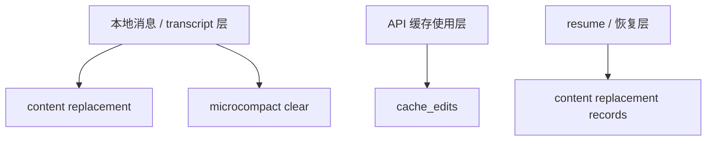
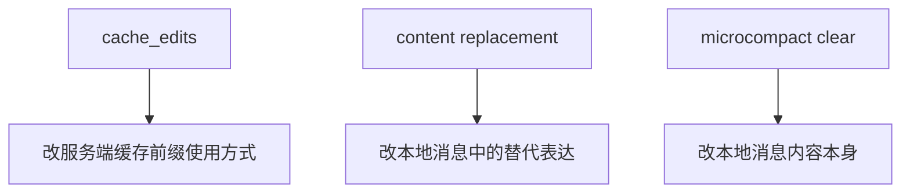

# Claude Code 源码共读笔记 57：cache_edits 是什么，以及它和 content replacement / microcompact clear 有什么区别

## 这篇看什么

前面读 `microCompact.ts` 时，最容易卡住的一个词就是：

- `cache_edits`

因为它看起来很像：

- 某种压缩
- 某种 replacement
- 某种消息改写

但真顺着源码往下看，会发现它和另外两种东西其实不是同一层：

1. `cache_edits`
2. `content replacement`
3. `time-based microcompact` 的内容清空（也就是把旧 tool result 变成 `[Old tool result content cleared]`）

这三者都在做“让上下文变轻”这件事，
所以特别容易混。

但如果把层次拆开，它们其实分别改的是三种不同的东西：

- 有的改**服务端如何使用缓存前缀**
- 有的改**本地消息里某个 tool_result 的在上下文中的替代表达**
- 有的改**本地消息内容本身**

这篇我就专门把这三层拆开。

我想回答的核心问题是：

> **`cache_edits` 到底是什么？为什么它不是本地消息改写？它又和 content replacement、microcompact clear 这两种“看起来也像在删内容”的机制，到底差在哪？**

先把一句最重要的话放前面：

> **`cache_edits` 改的不是本地 transcript / messages，而是服务端对“已缓存前缀”的使用方式。**

这句基本就是整篇的轴心。

---

## 先给主结论

如果只先记一句话，我建议记这个：

> **`cache_edits` 是发给模型服务端的一组“缓存前缀编辑指令”：本地 messages 不变，transcript 不变，但这轮 API 请求会告诉服务端，在继续复用那段缓存前缀时，把其中某些旧 tool results 视为已删除。它和 `content replacement`、`microcompact clear` 最大的区别，就是后两者都会影响本地消息中的内容表达，而 `cache_edits` 改的是服务端缓存使用方式。**

再压缩一点，就是：

- `cache_edits`：改**缓存怎么用**
- `content replacement`：改**模型看到的本地替代文本**，并记下来以便 resume
- `microcompact clear`：改**本地消息内容本身**，把旧内容直接清空成占位串

这三句记住，后面基本就不会混了。

---

## 先把总图立住：这三者分别改的是不同层

这张图非常重要。

因为它先把一个核心误区打掉了：

> **所有“让上下文变轻”的动作，不一定都在同一层发生。**

你一旦先接受这一点，
后面 `cache_edits` 就不容易再被误读成“某种本地文本替换”。

---

# 第一部分：`cache_edits` 最核心的定义——它不是本地消息修改，而是服务端缓存前缀编辑指令

`microCompact.ts` 对 cached microcompact 路径的注释已经写得非常直白：

- uses cache editing API
- remove tool results without invalidating the cached prefix
- does **NOT** modify local message content
- cache_reference and cache_edits are added at API layer

这几句放在一起，其实已经足够把 `cache_edits` 定义清楚了：

> **它不改本地 messages。**

这一点特别关键。

因为只要你脑子里先把这个判断立住，
后面很多混乱就会自动消失。

它不是：

- 本地 message 被删掉几段内容
- transcript 被改写成另一个版本
- compact summary 的一种别名

它更像是：

> **“服务端，我知道你那边还缓存着一大段前缀；这轮继续用那段缓存时，里面这几个旧 tool result 请按删除处理。”**

所以如果你问 `cache_edits` 到底是什么，
我会给一个非常短的人话版：

> **一组发给服务端的缓存使用修正指令。**

不是 message rewrite。

不是 transcript rewrite。

而是 cache usage rewrite。

---

# 第二部分：为什么会需要 `cache_edits`——因为直接改本地 messages 会更容易把 prefix cache 打烂

这里的工程动机也很重要。

如果系统只是想“把旧 tool result 弄掉”，最简单的方法当然是：

- 直接改本地 messages
- 把那段内容删了
- 再发请求

但问题是，
一旦你直接改本地前缀消息内容，
服务端就更容易把这轮前缀视为一段新的东西。

这样会带来什么？

- prefix cache 命中下降
- 重复计算成本上升
- 这轮请求更贵、更慢

而 cached microcompact 的目标恰恰是：

> **减掉旧 tool result 的上下文负担，同时尽量不把前缀 cache 打烂。**

这也是为什么它选择的是：

- 本地 messages 不动
- 用 `cache_edits` 告诉服务端“这轮怎么解释缓存前缀”

所以 `cache_edits` 的设计，不是为了概念优雅，
而是一个非常现实的工程折中：

> **我要删东西，但我又不想因此把整段前缀缓存废掉。**

---

# 第三部分：在 cached microcompact 路径里，`cache_edits` 是怎么进入这一轮请求的

这条链其实很清楚。

在 `cachedMicrocompactPath(...)` 里，系统会：

1. 遍历 messages
2. 找到 compactable tool results
3. 算出 `toolsToDelete`
4. 调 `createCacheEditsBlock(state, toolsToDelete)`
5. 把结果放进 `pendingCacheEdits`

注意这里最关键的一句注释：

- `Return messages unchanged - cache_reference and cache_edits are added at API layer`

也就是说，这一步返回给 query 的：

- `messages` 还是原样的

真正的“删除效果”并不是在本地 message 里完成，
而是在 API 层通过 `cache_edits` 生效。

后面在 `query.ts` 里，还能看到它对实际 API usage 的配套处理：

- 读取 `cache_deleted_input_tokens`
- 结合 baseline 算出本次真正删掉了多少缓存输入 token
- 然后再 yield 一个 `microcompact_boundary`

这再次说明：

> **`cache_edits` 的真实生效位置在 API / 服务端缓存层，不在本地消息层。**

---

## 图 1：cache_edits 的真实作用位置在 API 层，不在本地消息层

这张图是整篇第一张最该记住的图。

---

# 第四部分：那 `content replacement` 又是什么——它确实会改“模型看到的本地替代表达”

现在来对比 `content replacement`。

这条线和 `cache_edits` 看起来有点像，
因为它也在做“让上下文里的大块内容变轻”。

但它的做法完全不一样。

`toolResultStorage.ts` 里对 `ContentReplacementRecord` 的说明非常关键：

- `replacement` is the exact string the model saw
- stored rather than derived on resume so code changes ... can't silently break prompt cache

这句话基本说明：

> **content replacement 真的会让模型在本地消息层看到一个替代字符串。**

也就是说，它不是“服务端自己知道就行”。

它是：

- 某个 tool_result 太大了
- 系统在本地消息表示里，把它替换成一个更小的 stub
- 这个 stub 就是模型真正看到的东西
- 而且这个 replacement 还要记进 transcript，保证 resume 后还是同一个 stub

所以如果用一句最短的话总结 content replacement：

> **它是本地消息层的替代表达机制。**

这和 `cache_edits` 完全不是一层。

---

# 第五部分：为什么 `content replacement` 要落 transcript，而 `cache_edits` 不需要按同样方式落盘

这里差别很大，也很能说明它们的层级不同。

在 `types/logs.ts` 里，`ContentReplacementEntry` 的注释写得很清楚：

- replacement decisions survive resume
- replayed on resume for prompt cache stability

这说明 content replacement 有一个很强的要求：

> **resume 后模型还得看到和当初一样的 replacement 文本。**

为什么？

因为如果恢复后 replacement 方式变了，
那送模前缀形状也会变，prompt cache 稳定性就会被破坏。

所以 content replacement 必须：

- 记录 replacement 的 exact string
- 持久化到 transcript
- resume 时重建 replacement state

而 `cache_edits` 则不同。

它是：

- 某一轮请求如何使用缓存前缀的 API 指令
- 更偏 request-time / API-layer 机制

它当然也有跨轮 pinned / pending state，
但它不是那种“resume 后要把本地消息文本重建成某个替换字符串”的东西。

所以：

> **content replacement 是要进 transcript 的本地表达决策，`cache_edits` 是 API 层缓存使用策略。**

这就是为什么两者的持久化意义完全不同。

---

# 第六部分：再看第三个最容易混的——time-based microcompact clear，它改的是本地消息内容本身

第三类是 `time-based microcompact` 那条路径。

这条路径的关键常量你已经看到了：

- `TIME_BASED_MC_CLEARED_MESSAGE = '[Old tool result content cleared]'`

这条路径的逻辑是：

- cache 已冷
- 反正前缀要重写
- 那就直接把旧 tool_result 的内容清掉
- 只保留最近 N 个

它和 `cache_edits` 最大的差别在于：

> **它是真的改了本地消息内容。**

源码里能直接看到：

- `return { ...block, content: TIME_BASED_MC_CLEARED_MESSAGE }`

这就不是“服务端编辑缓存前缀”了。

而是：

- 这个 user message 里的 `tool_result` block
- 在本地 message 结构里就已经被替换成 cleared 文本了

所以这第三种机制，我会定义成：

> **本地消息内容级的直接清空。**

它比 `content replacement` 还更“硬”。

因为 content replacement 至少是“较小 stub 取代原内容”，
而这里几乎就是：

- 别带原内容了
- 只留一个 cleared 占位串

---

## 图 2：三种机制分别改的是三层不同对象

这张图是整篇第二张最该记住的图。

---

# 第七部分：把三者并排说清楚——最实用的不是定义，而是“它们分别改哪一层”

我觉得这个问题最适合做成并排判断。

## 1. `cache_edits`
### 改哪一层？
- **服务端缓存使用层**

### 本地 messages 会变吗？
- **不会**

### transcript 会因此重写吗？
- **不会按这种方式重写**

### 主要目标是什么？
- 删除旧 tool results 对这轮请求的缓存负担
- 同时尽量保住 prefix cache

### 最像什么？
- **缓存前缀编辑指令**

---

## 2. `content replacement`
### 改哪一层？
- **本地消息的替代表达层**

### 本地 messages 会变吗？
- **会，模型看到的是 replacement string**

### transcript 会记录吗？
- **会**

### 主要目标是什么？
- 让超大 tool_result 用较小 stub 表达
- 并在 resume 后保持同样 replacement，保证 prompt cache 稳定

### 最像什么？
- **本地送模文本替代机制**

---

## 3. `microcompact clear`
### 改哪一层？
- **本地消息内容本身**

### 本地 messages 会变吗？
- **会，直接清成 cleared message**

### transcript / 后续消息视图会反映吗？
- **会反映这次本地内容清空**

### 主要目标是什么？
- 当 cache 已冷时，直接把不值的旧 tool_result 内容清掉，减少这一轮要重写的输入体积

### 最像什么？
- **本地旧内容清空机制**

---

# 第八部分：为什么这三者会同时存在——因为 Claude Code 在处理的是三个不同层面的成本问题

如果只看结果，你会觉得这三者都在“删旧内容”。

但如果看工程问题本身，
它们其实分别在处理三种不同成本：

## 1. `cache_edits` 处理的是：
> **如何在不重写本地消息的前提下，减少服务端缓存前缀的负担**

## 2. `content replacement` 处理的是：
> **如何在本地消息层把超大内容变成稳定、可恢复、可复现的较小表示**

## 3. `microcompact clear` 处理的是：
> **当 cache 已经没救时，如何最快把旧内容从本地消息里清掉，减少本轮重写成本**

所以这三者不是重复设计，
而是：

> **分别打在 API 缓存层、本地表示层、本地内容层。**

这也正是为什么它们会并存。

---

# 第九部分：如果只看现象，怎么判断你看到的是哪一种

这个问题也很实用。

## 更像 `cache_edits` 的现象
- 本地消息没明显变
- 但 usage 里出现 `cache_deleted_input_tokens`
- 出现 deferred 的 `microcompact_boundary`
- 语义上像“服务端把某些旧 tool result 从缓存里删了”

## 更像 `content replacement` 的现象
- 某个大 tool_result 在本地消息里变成了较小 stub
- transcript 里还会记 replacement 记录
- resume 后还会保持同样 replacement

## 更像 `microcompact clear` 的现象
- 本地旧 tool_result 直接被替换成：
  - `[Old tool result content cleared]`
- 通常发生在 time-based MC 路径
- 背后原因是 cache 已冷

---

# 术语补充 / 名词解释

这篇里几个词特别容易混，我单独落一下。

## 1. cache_edits
建议理解成：

- **缓存前缀编辑指令**
- 或 **缓存使用编辑指令**

重点不是改本地文本，而是改服务端对缓存前缀的解释方式。

---

## 2. content replacement
建议理解成：

- **内容替代表达**
- 或 **内容替换记录**（指持久化那层）

它是本地送模文本层的替代机制，而且要可恢复。

---

## 3. microcompact clear
建议理解成：

- **微压缩清空**
- 或 **time-based 微压缩内容清空**

它不是摘要，而是把旧 tool_result 内容直接清空成固定占位串。

---

## 4. cache_deleted_input_tokens
建议理解成：

- **缓存删除输入 token 数**

这是服务端实际告诉你：这轮通过 cache editing 真删掉了多少缓存输入 token。

---

# 这一篇最想保住的判断

如果把整篇压成一句最关键的话，我会留：

> **`cache_edits` 的本质不是“删本地消息”，而是“改服务端对缓存前缀的使用方式”；它和 `content replacement`、`microcompact clear` 的根本区别，在于后两者都会影响本地消息中的内容表达，而 `cache_edits` 主要作用在 API / 服务端缓存层。**

这句话里最重要的点有三个：

- `cache_edits` 不等于本地改消息
- 它作用在缓存层
- 三者的区别最好按“改哪一层”来记

---

# 我现在对这个问题的最短总结

如果只留一句最短的话，我会留：

> **`cache_edits` 改的是缓存怎么用，`content replacement` 改的是本地替代表达，`microcompact clear` 改的是本地旧内容本身。**

---

# 这篇最值得记住的几个判断

### 判断 1：`cache_edits` 不是本地消息重写，而是服务端缓存前缀编辑指令

### 判断 2：cached microcompact 路径里，本地 `messages` 保持不变，真正的“删除效果”在 API 层通过 `cache_edits` 生效

### 判断 3：`content replacement` 会让模型在本地消息层看到 replacement string，而且这个 exact string 会被持久化到 transcript，保证 resume 后仍然一致

### 判断 4：time-based microcompact clear 则更直接：它会把本地旧 tool_result 内容直接改成 `[Old tool result content cleared]`

### 判断 5：三者都在减上下文负担，但分别作用在缓存使用层、本地表示层、本地内容层，所以不应该混成一个概念

---

# 下一步最顺怎么接

如果继续沿这条线往下写，我觉得最顺有两个方向：

### 方向 A：接 `conversationRecovery.ts`
因为这篇已经把 content replacement 为什么必须可恢复讲到了，接下来顺着看 resume 怎么把这些状态接回来会非常顺。

### 方向 B：做一篇“上下文治理总对照表”
把：

- tool result budget
- content replacement
- snip
- microcompact
- context collapse
- compact

都按“作用层 / 是否改本地消息 / 是否进 transcript / 是否影响 resume”做成一张表。

如果只选一个，我会更倾向 **方向 A**。

因为这条线现在越来越自然地收敛到“恢复链”了。