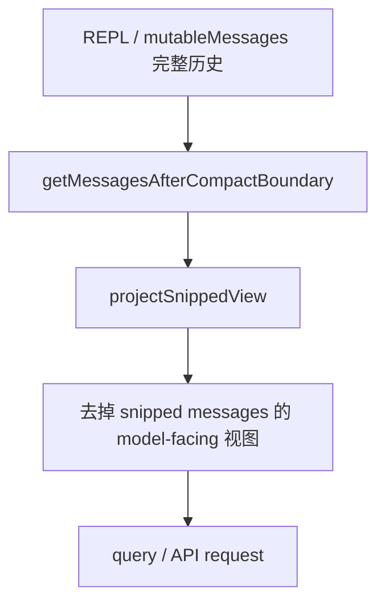
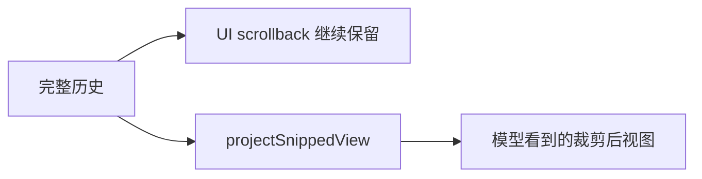
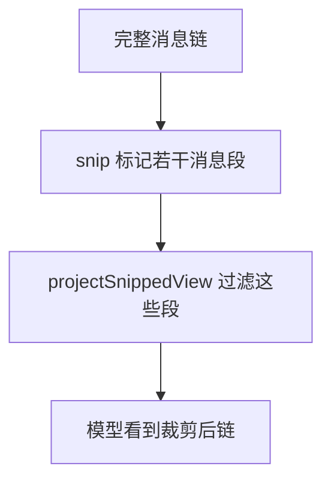

# Claude Code 源码共读笔记 58：snip 到底裁掉了什么

## 这篇看什么

写完第 56 篇之后，贵平给了一个非常准确的反馈：

> **“看完我还是不知道 snip 到底裁剪了什么东西。”**

这个反馈是对的。

因为第 56 篇更多讲的是 snip 在治理链里的**角色**，
但还没把“它最终对什么对象动刀”这件事落得足够实。

这篇就是专门补这个问题。

先把结论放前面：

> **从当前本地源码能坐实的部分看，snip 真正裁掉的不是 transcript 里的原始历史，而是“model-facing 的消息视图”里被标记为 snipped 的那部分消息。REPL 仍保留完整历史用于 UI scrollback，但送给模型的那份 `messagesForQuery` 默认会通过 `projectSnippedView(...)` 把这些 snipped messages 投影掉。**

这句话比“轻量剪枝”更进一步，
因为它终于回答了那个最关键的问题：

> **它剪的是哪一层？**

答案是：

- **不是简单删磁盘 transcript**
- **也不只是抽象上的“省一点 token”**
- **而是剪 model-facing 视图里的被 snip 标记那一段消息**

这篇我想回答四个问题：

1. snip 到底裁掉的是哪一层的东西
2. 它和 transcript / UI scrollback 的关系是什么
3. snip boundary、snip marker、snipped messages 分别扮演什么角色
4. 目前仍然还不能坐实的边界在哪里

---

## 先给主结论

如果只先记一句话，我建议记这个：

> **snip 裁掉的是“给模型看的消息视图”中的被 snip 标记消息，而不是把完整会话历史物理抹掉。`getMessagesAfterCompactBoundary(...)` 在默认情况下会额外调用 `projectSnippedView(...)`，把 REPL 里保留用于 scrollback 的 snipped messages 从 model-facing 视图中过滤掉。**

再压缩一点，就是：

- **UI 还留着完整历史**
- **模型默认看的是去掉 snipped messages 的投影视图**
- **snip 更像视图级裁剪，而不是 transcript 物理删除**

这三句是整篇最值钱的地方。

---

## 先把总图立住：snip 真正动刀的是“模型视图”，不是 UI 历史真身

这张图就是这篇最重要的总图。

因为它终于把“snip 裁掉的是什么”这件事说成了一句非常具体的话：

> **它裁的是 model-facing view。**

不是 UI scrollback。

不是磁盘 transcript 真身。

---

# 第一部分：`messages.ts` 已经直接写出来了——默认会把 snipped messages 过滤掉

这次最关键的源码证据，其实就在 `getMessagesAfterCompactBoundary(...)` 的注释里。

它写得很直接：

- returns messages from the last compact boundary onward
- **also filters snipped messages by default**
- REPL keeps full history for UI scrollback
- model-facing paths need both compact-slice AND snip-filter applied

这几句组合起来，已经足够说明很多问题。

它至少说明：

## 1. snip 不是只做 token 统计
因为真的有一个“snip-filter applied”的投影步骤。

## 2. snip 不是直接等于 compact slice
因为 compact boundary 之后，还要再额外做一层 snip-filter。

## 3. snip 不会让 UI 历史天然消失
因为 REPL 明确保留 full history for UI scrollback。

这一层其实已经足够回答用户最关心的问题了：

> **snip 裁掉的是“模型要看的那份历史”，不是“用户界面还保不保留那段历史”。**

这个区分特别重要。

因为如果不分 UI 视图和 model 视图，
你就很容易一直误以为：

- snip = 物理删消息

其实不是。

---

# 第二部分：`projectSnippedView(...)` 的存在，说明 snip 是一套“投影过滤”机制

虽然当前本地源码里我还没拿到 `snipProjection.ts` 文件本体，
但 `messages.ts`、`QueryEngine.tsx`、`Message.tsx` 都明确在 require：

- `../services/compact/snipProjection.js`

并且我们已经能看到它至少提供：

- `projectSnippedView(...)`
- `isSnipBoundaryMessage(...)`

这说明 snip 不是只有一个“剪刀函数”，
而是至少分成两部分：

## 1. 产生 snip 结构 / 标记的那部分
也就是 `snipCompactIfNeeded(...)` 及相关 boundary / marker 生成逻辑。

## 2. 把这些标记解释成“模型视图应该怎么被过滤”的那部分
也就是 `projectSnippedView(...)`。

这非常关键。

因为这说明 snip 的本质不是：

- 直接把消息数组里某些东西完全抹掉

而更像：

> **在完整历史上打上 snip 结构标记，再由 model-facing 投影阶段把这些标记过的消息过滤掉。**

也就是说，它更接近：

- **结构化视图裁剪**

而不是：

- **无痕物理删除**

---

# 第三部分：UI 还留着完整历史，是因为 snipped messages 对 scrollback 仍然有价值

这一层特别值得讲。

如果系统只是想“一劳永逸省 token”，它最简单的办法当然是：

- 直接删消息
- UI 也别显示了
- 模型也看不到

但现在源码明确不是这样。

它说得很清楚：

- REPL keeps full history for UI scrollback

也就是说，设计者显然认为：

> **用户回看长会话时，仍然需要看到那段历史。**

哪怕模型这轮已经不需要继续背着那一段。

这是一个很好的设计选择。

因为它同时满足了两件事：

## 对模型
- 少背一点历史
- 省 token
- 降上下文压力

## 对用户
- 之前聊过什么、做过什么还看得到
- UI 不会像“吞掉了一大段历史”一样突兀

所以 snip 的设计更像：

> **把“人类回看需要的历史”和“模型这轮必须继续带着的历史”分开了。**

这其实挺高级的。

因为很多系统会偷懒，把这两件事混成一套视图。

Claude Code 明显在这里做了分层。

---

## 图 1：snip 之后，人和模型看到的不是完全同一份历史

这张图我觉得是这篇第一张最该记住的图。

---

# 第四部分：snip boundary 和 snip marker 说明 snip 不是隐形的，它也是显式结构事件

从 `Message.tsx` 能看到一件很关键的事：

- UI 会识别 `isSnipBoundaryMessage(message)`
- UI 也会识别 `isSnipMarkerMessage(message)`

并且：

- boundary 会渲染成 `SnipBoundaryMessage`
- marker 则直接 `return null`

这说明两件事。

## 1. snip 不是完全隐形后台优化
它是会在消息结构里留下明确标记的。

## 2. 边界和标记不是一回事
- `snip boundary` 更像给 UI 和恢复逻辑看的结构锚点
- `snip marker` 更像一种内部辅助标记，不一定要显式展示给用户

虽然现在还没拿到 `snipCompact` 源文件去看每一种 message subtype 的构造细节，
但至少已经能确定：

> **snip 不是单纯“函数返回了少一点的数组”，而是有自己的边界和标记体系。**

这又进一步支持了“视图裁剪机制”这个判断。

---

# 第五部分：`sessionStorage.ts` 又补了一枪——resume 时会把 snip 移除的历史重新过滤掉，而不是当作彻底消失

这一条特别值钱。

`sessionStorage.ts` 里有几段注释已经把 resume 场景说透了：

- unlike compact_boundary which truncates a prefix, snip removes arbitrary messages from the reconstructed chain
- without this filter, buildConversationChain reconstructs the full unsnipped history
- resume loads their pre-snip history (the pre-fix behavior)

这几句放在一起，含义非常明确：

> **底层链重建时，本来是能把 pre-snip history 全部重建出来的；但 resume 为了保持 snip 后的一致视图，还要再应用一层 snip 过滤。**

这说明什么？

说明 snip 再次不是“物理删库”。

如果那些消息物理上真的没了，
就不存在“buildConversationChain reconstructs the full unsnipped history”这件事。

但现在源码注释明说：

- 不加这个 filter，会把未 snip 前的完整历史重建出来

这几乎已经把事情说透了：

> **snip 更像是在完整链之上记录“这些消息在 model-facing 视图里应被移除”的规则。**

而不是把原始会话历史彻底抹掉。

这和我们前面从 `messages.ts` 得到的判断完全吻合。

---

# 第六部分：那它到底裁掉“哪类内容”？——现在能严谨确认到的是“被 snip 标记的任意消息段”，而不是只限某一种 block 类型

这里要非常谨慎。

因为贵平刚才追问的关键其实是：

> **到底是裁 tool_result？还是裁旧 user/assistant？还是裁某些中间段？**

就当前本地源码能坐实到的程度，我认为最稳的说法是：

> **snip 裁掉的是“被 snip 机制标记为应从 model-facing 视图中过滤掉的消息段”。**

而不是更武断地说：

- 它只裁 tool_result
- 它只裁 assistant
- 它只裁某个固定窗口

为什么我不愿意说得更死？

因为现在你这份本地源码里，
真正负责“决定哪些消息被标记为 snipped”的 `snipCompact.js/ts` 源文件我还没拿到。

所以我不能假装已经逐行看到了选择算法。

但我们已经可以很确定地知道两件事：

## 1. 它处理的是“消息级对象”，不是只有某个 block
因为 `projectSnippedView` 作用在 `Message[]` 投影层。

## 2. 它可以移除 arbitrary messages from the reconstructed chain
这句在 `sessionStorage.ts` 里写得非常直接。

所以更接近真实系统的说法是：

> **snip 裁的是消息段（message spans / arbitrary messages），而不是只对某一个 block 类型做就地替换。**

我觉得这个判断已经比“轻量剪枝”更落地了。

---

## 图 2：当前能最稳确认的是“snip 移除的是消息段”，不是某个单独 block 小修小补

这张图比“snip 是小剪刀”要具体得多。

---

# 第七部分：为什么 `force-snip`、`context_efficiency`、`[id:]` message tags 这些配套设计也能反向说明 snip 是“消息段级操作”

这次顺着 `commands.ts`、`attachments.ts`、`messages.ts` 继续往外看，
还有几个旁证也很有意思：

## 1. 有 `/force-snip`
说明 snip 不是完全自动魔法，至少也有可显式触发的路径。

## 2. 有 `context_efficiency` attachment / nudge
而且注释里写得很清楚：

- every N tokens of growth without a snip
- resets on prior nudges, snip markers, snip boundaries, and compact boundaries

这说明 snip 在系统里是一个“上下文治理事件”，
不是局部字符替换那么小的东西。

## 3. 用户消息会被附加 `[id: ...]` tag 供 SnipTool 引用
这说明 SnipTool 很可能需要引用 message 级别的对象来做选择。

这几个旁证拼起来，会让“snip 是消息段级操作”这个判断更稳。

至少它不像只是在某个 tool_result block 上做局部字符串截断。

它明显在围绕：

- message ids
- boundaries
- markers
- projection

这整套结构在工作。

---

# 第八部分：所以，今天这个问题最准确的答案是什么

如果回到贵平最开始那句：

> **“snip 到底裁剪了什么东西？”**

我现在会给一个比之前更实、更稳的回答：

> **snip 裁掉的是“模型继续推理时不再需要带着跑的那部分消息段”——这些消息在 REPL / transcript 的完整历史里并不一定物理消失，但会被 snip 结构标记，并在 `projectSnippedView(...)` 生成的 model-facing 视图中默认被过滤掉。**

如果再压缩一点：

- **它裁的是消息段，不是简单字符截断**
- **它裁的是模型视图，不是 UI scrollback 真身**
- **它靠 boundary / marker / projection 一起生效**

这已经比前一篇准确多了。

---

# 术语补充 / 名词解释

这篇里有几个词值得单独落一下。

## 1. snipped messages
建议理解成：

- **被 snip 标记后、默认不再进入 model-facing 视图的消息**

不是“永远不存在的消息”，而是“默认从送模视图中过滤掉的消息”。

---

## 2. projectSnippedView
建议理解成：

- **snip 视图投影函数**
- 或 **snipped 消息过滤投影**

它的作用是把完整消息链投影成模型真正看到的那份裁剪后视图。

---

## 3. snip boundary
建议理解成：

- **snip 边界消息**

它是 snip 事件的显式结构锚点，UI 里会有专门渲染。

---

## 4. snip marker
建议理解成：

- **snip 标记消息**

更偏内部结构辅助标记，不一定需要直接展示给用户。

---

# 这一篇最想保住的判断

如果把整篇压成一句最关键的话，我会留：

> **snip 裁掉的不是 transcript 真身，而是 model-facing 视图里被 snip 标记的消息段；Claude Code 保留完整历史给 UI scrollback 和链重建用，再通过 `projectSnippedView(...)` 默认把这些 snipped messages 从送模视图中过滤掉。**

这句话里最重要的点有三个：

- 不是物理删 transcript
- 是过滤 model-facing 消息段
- UI 和恢复层仍然可能保留完整历史

---

# 我现在对这个问题的最短总结

如果只留一句最短的话，我会留：

> **snip 裁掉的是“模型继续看到的消息段”，不是“用户再也看不到的历史真身”。**

---

# 这篇最值得记住的几个判断

### 判断 1：`getMessagesAfterCompactBoundary(...)` 默认会额外过滤 snipped messages，这已经直接说明 snip 的主要作用层是 model-facing 视图

### 判断 2：REPL 保留完整历史用于 UI scrollback，因此 snip 不是简单的物理删消息

### 判断 3：`sessionStorage.ts` 明确说明，如果不额外应用 snip 过滤，resume 链会重建出 full unsnipped history，这再次证明 snip 更像视图级移除规则

### 判断 4：当前最稳能确认的是：snip 裁掉的是“被标记的消息段 / arbitrary messages”，而不是可以武断限定为某一种 block 类型

### 判断 5：snip boundary、snip marker、SnipTool、message id tags 等配套设计，进一步说明 snip 是围绕消息级结构工作的，而不是单纯的字符串截断

---

# 下一步最顺怎么接

如果继续沿这条线往下写，我觉得最顺有两个方向：

### 方向 A：回主轴接 `conversationRecovery.ts`
因为 snip、compact、content replacement 都已经指向“恢复时怎么重建正确视图”这个问题了。

### 方向 B：补一篇“上下文治理总对照表”
把：

- tool result budget
- snip
- microcompact
- content replacement
- context collapse
- compact

按“改哪一层 / 是否改本地消息 / 是否影响 model-facing 视图 / 是否进 resume”做成一张总表。

如果只选一个，我会更倾向 **方向 A**。

因为现在所有线索都已经自然地往恢复链收敛了。