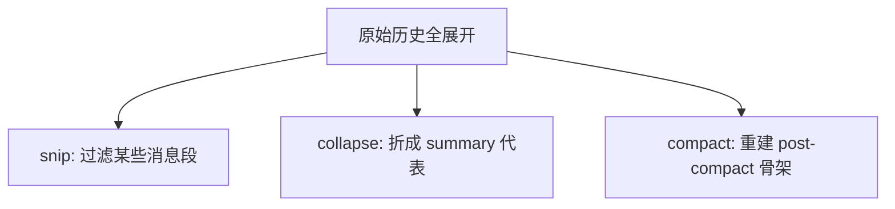
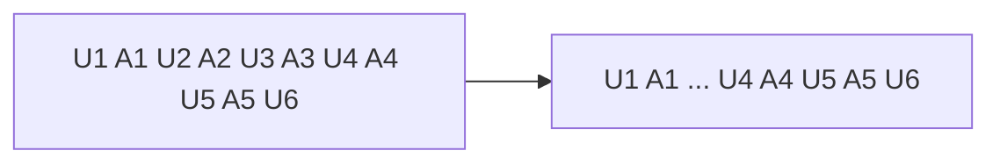
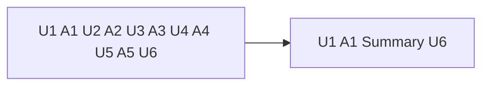
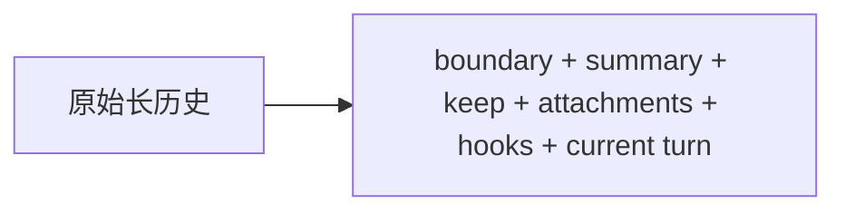

# Claude Code 源码共读笔记 59：上下文管理四种形态并排例子——原始、snip、collapse、compact

## 这篇看什么

前面这条上下文管理线，已经拆了很多篇：

- `compact.ts`
- `microCompact.ts`
- `snip`
- `cache_edits`
- `content replacement`
- `context collapse`

但越到后面，越容易出现一个问题：

> **每个词单独都懂一点，一放到真实会话里还是容易串。**

尤其最容易混的四种形态是：

1. 原始未处理的历史
2. `snip` 之后
3. `context collapse` 之后
4. `compact` 之后

如果只用抽象术语讲，很容易讲成：

- 一个是剪枝
- 一个是折叠
- 一个是压缩

但读者脑子里还是没有画面。

所以这篇不再走抽象路线，
直接做一件事：

> **拿同一段会话，做一个并排例子，看它在原始 / snip / collapse / compact 四种情况下，模型真正看到的东西分别长什么样。**

这篇可以理解成“上下文管理篇”的一个收尾文。

它不追求再引入新术语，
而是帮你把前面那几篇真正压成可视化心智模型。

---

## 先给主结论

如果只先记一句话，我建议记这个：

> **同一段旧会话，在 Claude Code 里至少有四种常见处理形态：原始形态是整段原文继续带着跑；`snip` 形态是把某些消息段从 model-facing 视图中过滤掉；`context collapse` 形态是把一大段旧原文折成一条 summary 代表；`compact` 形态则更重，它会直接重建一套新的 post-compact messages 骨架。**

再压缩一点，就是：

- **原始**：全展开
- **snip**：拿掉一截
- **collapse**：折成一条总结
- **compact**：整包重打

如果先记住这四句，后面整条上下文管理线就会清楚很多。

---

## 先把总图立住：四种形态不是强弱版关系，而是不同层次的改造



这张图非常简单，
但它先把一个常见误区打掉了：

> **它们不是“同一种压缩从轻到重的四档”。**

更准确地说，它们是：

- 改造层次不同
- 动手对象不同
- 留下来的东西也不同

所以后面别再只用“轻一点 / 重一点”去记它们。

---

# 第一部分：先造一个统一的运行时例子

为了避免越讲越抽象，
我们先统一用一段虚拟但非常接近真实使用的会话。

假设你连续做了这些事：

1. 让 Claude 读 `query.ts`
2. 让 Claude 读 `messages.ts`
3. 让 Claude 读 `compact.ts`
4. 让 Claude 读 `microCompact.ts`
5. 让 Claude 解释 `cache_edits`
6. 你现在又说：
   > 回到 `conversationRecovery.ts`，看看 resume 怎么恢复

如果把旧历史简化一下，模型当前前面大概背着的是：

- U1：帮我读 `query.ts`
- A1：解释 QueryEngine 主循环
- U2：再看 `messages.ts`
- A2：解释 normalize / merge / attachments
- U3：再看 `compact.ts`
- A3：解释 compactConversation / boundary / summary
- U4：再看 `microCompact.ts`
- A4：解释 cached MC / time-based MC
- U5：`cache_edits` 到底是什么？
- A5：解释 cache_edits vs content replacement
- U6：现在回到 `conversationRecovery.ts`

我们下面就用这同一段历史，
分别看四种上下文管理形态里，**模型真正看到什么**。

---

# 第二部分：原始形态——模型看到的是整段展开历史

先看最朴素的情况。

如果什么都没发生：

- 没有 snip
- 没有 collapse
- 没有 compact

那模型看到的就是这整段原始展开历史。

大致像这样：

```text
U1: 帮我读 query.ts
A1: QueryEngine 会先...
U2: 再看 messages.ts
A2: normalizeMessagesForAPI 会...
U3: 再看 compact.ts
A3: compactConversation 会返回 boundaryMarker...
U4: 再看 microCompact.ts
A4: cached microcompact 不改本地 messages...
U5: cache_edits 到底是什么？
A5: cache_edits 改的是缓存前缀使用方式...
U6: 现在回到 conversationRecovery.ts
```

这时候它的特点是：

- 所有旧消息都还是**逐条展开**
- 每个局部细节都还在
- 上下文纹理最完整
- 但 token 最贵

所以原始形态可以理解成：

> **完整，但重。**

这也是所有后续上下文管理动作想要处理的起点。

---

# 第三部分：snip 之后——模型不再看到被 snip 的那一截消息段，但 UI/完整历史仍可能保留

现在看 snip。

根据我们前面已经坐实的部分，snip 更像是：

> **把某一段消息从 model-facing 视图里过滤掉。**

还是拿上面那段历史举例。

假设系统觉得中间这段太旧、太拖上下文：

- U2 / A2
- U3 / A3

这一小段先别继续给模型看了。

那 snip 之后，模型看到的更像：

```text
U1: 帮我读 query.ts
A1: QueryEngine 会先...
[这里有一段旧消息被 snip 过滤，不再默认进入 model-facing 视图]
U4: 再看 microCompact.ts
A4: cached microcompact 不改本地 messages...
U5: cache_edits 到底是什么？
A5: cache_edits 改的是缓存前缀使用方式...
U6: 现在回到 conversationRecovery.ts
```

这里最重要的是：

- 被 snip 的那段消息对模型来说，**不再展开出现**
- 但它不是“变成一条 summary”
- 更像是“这一截先拿掉了”
- UI scrollback / 完整历史底层仍可能保留

所以 snip 之后的感觉是：

> **模型眼前少了一截。**

不是：

> **模型眼前多了一条摘要。**

这就是它和 collapse 的第一大区别。

---

## 图 1：snip 更像从模型视图里拿掉一截



这张图里最关键的是那个 `...` 的含义：

> **不是摘要代表，而是中间那一截没再默认给模型看。**

---

# 第四部分：context collapse 之后——模型不再看到旧原文，但会看到一条 summary 代表

现在看 collapse。

它和 snip 最大的区别就是：

> **collapse 不是把那一段简单拿掉，而是把那一段折成一条 summary 代表。**

还是用同一段历史。

假设系统决定把中间这一大段旧历史折起来：

- U2 / A2
- U3 / A3
- U4 / A4
- U5 / A5

collapse 之后，模型看到的更像：

```text
U1: 帮我读 query.ts
A1: QueryEngine 会先...
Summary: 前面已经继续阅读并比较了 messages.ts、compact.ts、microCompact.ts，确认了 compact、microcompact、cache_edits 的边界和作用层。
U6: 现在回到 conversationRecovery.ts
```

这里最重要的变化是：

- 那几轮旧消息的**逐条原文细节没了**
- 但那几轮消息的**阶段性结论还在**
- 模型不是“完全失忆”
- 而是“只记得压缩版摘要”

所以 collapse 的感觉更像：

> **把一大段旧聊天折成一张摘要卡片。**

这是它和 snip 最本质的区别。

snip 是：
- 先别给模型看这段

collapse 是：
- 这段别原样展开了，改给一张总结卡片

---

## 图 2：collapse 更像“拿掉原文，换上一张摘要卡片”



这张图建议和 snip 那张一起记。

因为它们的不同一眼就能看出来：

- snip：中间少了一截
- collapse：中间变成一条 summary

---

# 第五部分：compact 之后——不是局部替换一段，而是整套后续消息骨架重建

最后看 compact。

compact 和前面两个最不同的地方在于：

> **它不是只对中间某段老历史做局部处理，而是直接把当前 query 之后要继续使用的消息骨架整套重建。**

前面已经读过 `compact.ts`，
它最终会产出：

- `boundaryMarker`
- `summaryMessages`
- `messagesToKeep`
- `attachments`
- `hookResults`

所以如果还是用同一段历史举例，compact 后模型看到的更像：

```text
System: [compact boundary]
User: [compact summary] 前面已经完成 query/messages/compact/microcompact/cache_edits 等共读，并确认了上下文治理链的关键边界...
(可选) 保留下来的最近消息段
(可选) 补回的 attachments / hooks / 环境提示
U6: 现在回到 conversationRecovery.ts
```

这时候发生的就不是：

- “中间少一截”
- 或“中间折成一条 summary”

而是：

> **后面这轮要继续运行的整份上下文骨架，都被换成了一套新的 post-compact messages。**

所以 compact 的感觉更像：

> **不是折一张卡片，而是整包重新打包。**

这是它和 collapse 最大的区别。

collapse 还更像“原骨架里折掉一段旧历史”。

compact 则是：
- 直接造新的消息包给 query 接着跑

---

## 图 3：compact 是整套后续骨架重建，不只是中间一段变化



这张图虽然粗，但能把 compact 和前两个立刻拉开。

---

# 第六部分：把四种形态真正并排摆一次

我觉得最有用的，其实就是这张并排表。

## 同一段历史，在四种形态下，模型真正看到什么

### 1. 原始形态
```text
U1 A1 U2 A2 U3 A3 U4 A4 U5 A5 U6
```
特点：
- 全展开
- 细节最全
- 最贵

---

### 2. snip 形态
```text
U1 A1 ... U4 A4 U5 A5 U6
```
特点：
- 某一截旧消息不再默认进入 model-facing 视图
- 没有额外 summary 代表
- UI/完整历史仍可能保留

---

### 3. collapse 形态
```text
U1 A1 Summary U6
```
特点：
- 旧历史原文不展开
- 但会留下 summary 代表
- 保住阶段性结论，牺牲细节纹理

---

### 4. compact 形态
```text
CompactBoundary + CompactSummary + Keep/Attachments/Hooks + U6
```
特点：
- 整套后续消息骨架被重建
- 不只是中间替一段
- 是最重的重组动作

---

如果只保留一句对照，我会写成：

> **snip 是“拿掉一截”，collapse 是“换成摘要卡片”，compact 是“整包重打”。**

我觉得这句以后会非常好用。

---

# 第七部分：什么时候最容易觉得它们“像换脑子”

这个问题其实和用户体验很相关。

## 原始形态
模型最像“原来的自己”，因为细节还都在。

## snip 之后
模型会像：
- 某一段旧事先不提了
- 但最近和两端还连着

有点像选择性忽略一截。

## collapse 之后
模型最容易让人感觉：
- 方向没丢
- 但细节少了
- 像把一大段旧聊天只记成一段“前情提要”

## compact 之后
模型最容易让人感觉：
- 上下文被系统性重整过
- 继续工作没问题
- 但会明显不再像原来那条逐条展开的老链

如果从“换脑子感”排序，我会粗暴排成：

> **原始 < snip < collapse < compact**

当然这不是绝对规则，
但对感受来说大体是这个顺序。

---

# 术语补充 / 名词解释

这篇虽然尽量少术语，但还是有几个词最好单独落一下。

## 1. model-facing view
建议理解成：

- **模型真正看到的那份消息视图**

不是 UI scrollback，也不是磁盘 transcript 真身。

---

## 2. summary representative
建议理解成：

- **摘要代表**
- 或 **摘要卡片**

也就是 collapse 后留下来的那条短总结，用来代表前面那一大段旧历史。

---

## 3. post-compact messages
建议理解成：

- **compact 后的新消息骨架**

它是 compact 真正交回给 query 继续运行的那份新消息包。

---

# 这一篇最想保住的判断

如果把整篇压成一句最关键的话，我会留：

> **同一段旧历史在 Claude Code 里可以有四种完全不同的运行时形态：原始形态是整段原文继续展开；snip 是把某一截旧消息从 model-facing 视图里拿掉；context collapse 是把一大段旧原文换成一条 summary 代表；compact 则更重，它会直接重建一整套新的 post-compact messages 骨架。**

这句话里最重要的点有四个：

- snip 是拿掉一截
- collapse 是换成摘要卡片
- compact 是整包重打
- 别再把它们都叫“压缩”就完事

---

# 我现在对这条上下文管理线的最短总结

如果只留一句最短的话，我会留：

> **原始是全展开，snip 是拿掉一截，collapse 是折成一张摘要卡片，compact 是整包重新打包。**

---

# 这篇最值得记住的几个判断

### 判断 1：`snip` 和 `collapse` 都不是 regular compact 的弱化版，它们对旧历史的处理方式本质不同：前者偏过滤，后者偏摘要代表

### 判断 2：`snip` 之后，模型默认不再看到那一截 snipped messages，但 UI / 完整历史底层仍可能保留它们

### 判断 3：`context collapse` 之后，模型不再看到旧原文细节，但会看到一条能代表那段旧历史的 summary

### 判断 4：`compact` 最重，它不是局部替换一段，而是直接重建 post-compact messages 整体骨架

### 判断 5：如果只想凭心智模型快速区分四者，记“全展开 / 拿掉一截 / 换成摘要卡片 / 整包重打”就够用了

---

# 下一步最顺怎么接

如果继续沿主轴往下走，我觉得最顺还是：

**第 60 篇：`conversationRecovery.ts` 是 resume 把这些不同上下文形态重新接回 runtime 的恢复入口**

因为这篇已经把上下文管理这一段收尾了，
下一步正好进入：

- 这些 boundary / summary / replacement / collapse commit
- 到底怎么在 resume 时重新恢复出来。