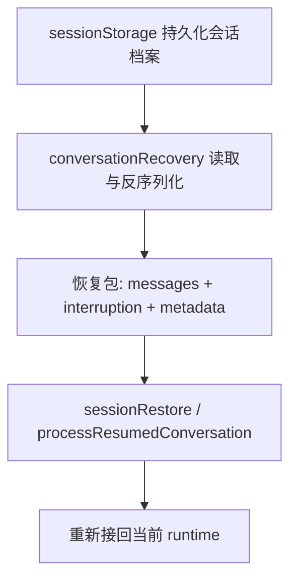
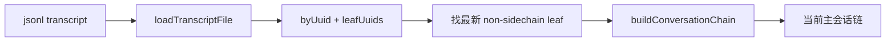
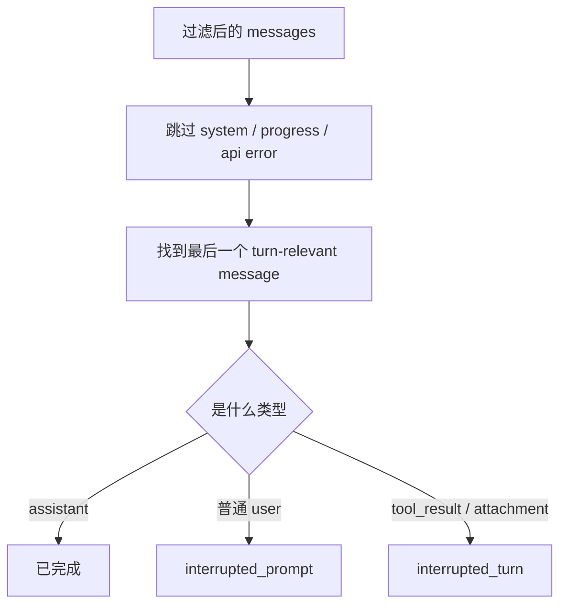

# Claude Code 源码共读笔记 61：conversationRecovery 是 resume 把会话重新接回 runtime 的恢复入口

## 这篇看什么

前一篇 `sessionStorage.ts` 已经把“会话怎么落盘”讲清了。

但只讲落盘还不够。

真正更关键的问题其实是：

> **当你执行 `--resume` / `--continue` 时，Claude Code 到底是怎么把一份磁盘上的会话档案，重新变成一条能继续运行的 runtime 会话？**

这个问题的入口文件就是：

- `src/utils/conversationRecovery.ts`

这次我主要看了：

- `conversationRecovery.ts`
- `sessionRestore.ts`
- `sessionStart.ts`
- 以及前面已经读过的 `sessionStorage.ts` / `fileHistory.ts`

看完之后，我现在的判断很明确：

> **`conversationRecovery.ts` 不是“读取旧消息”的工具文件，而是 resume 的恢复入口：它负责挑对来源、清洗旧消息、识别中断状态、补出 API 合法形态、恢复 skill 状态、接回 hook 消息，然后把 transcript 世界重新翻译成 runtime 世界。**

如果说：

- `sessionStorage.ts` 负责把运行轨迹存下来

那这篇对应的就是：

- `conversationRecovery.ts` 负责把这份轨迹重新接活

我觉得这一步非常值。

因为很多系统都能“读出旧记录”，
但很少系统能把旧记录重新恢复成**可继续工作的状态**。

Claude Code 明显在做的是后者。

---

## 先给主结论

如果只先记一句话，我建议记这个：

> **`conversationRecovery.ts` 的核心任务不是“加载 transcript”，而是把 transcript 转回一份 API 可接受、主循环可继续、上下文状态尽量不失真的恢复包：包括消息清洗、中断识别、skill 恢复、session start hooks、session metadata，以及后续 `sessionRestore.ts` 要继续接上的 file history / attribution / context collapse / worktree / agent 设置。**

再压缩一点，就是：

- `sessionStorage.ts`：把会话存下来
- `conversationRecovery.ts`：把会话读回来并清洗成可恢复输入
- `sessionRestore.ts`：把会话重新接回当前进程状态

这三者是一条链。

---

## 先把总图立住：resume 不是“读文件”，而是三段恢复链

这张图很重要。

因为它先打掉一个误解：

> **resume 不是“打开旧 jsonl”这么简单。**

真正发生的是：

1. 先确定从哪读
2. 读出来以后先清洗
3. 识别是不是中断在半截
4. 把一些丢失的 runtime 语义补回来
5. 再交给 session restore 层去恢复 AppState / worktree / collapse / todos / agent 上下文

也就是说，它不是“文件读取”，而是“恢复编排”。

---

# 第一部分：`loadConversationForResume(...)` 真正在做的是“恢复源选择”

`conversationRecovery.ts` 里最核心的函数就是：

- `loadConversationForResume(...)`

这个函数第一眼就能看出，它并不假设只有一种恢复来源。

它支持几种入口：

- `source === undefined`：也就是 `--continue`，找最近会话
- `sourceJsonlFile`：也就是直接从某个 `.jsonl` 路径恢复
- `typeof source === 'string'`：按 session ID 恢复
- `source` 已经是 `LogOption`：说明上游已经加载好了

这说明 Claude Code 对 resume 的理解，不是“只能从当前目录最近一次会话恢复”，
而是更通用的：

> **恢复入口和恢复动作要分开。**

先决定“恢复源是谁”，
再做“怎么恢复”。

这是很成熟的设计。

因为一旦把来源层做松，后面很多玩法都自然出来了：

- 当前项目继续最近会话
- 直接按 session id 恢复
- 跨目录恢复
- 从手头某个 transcript 文件恢复

这不是实现细节，而是会话系统的能力边界。

---

# 第二部分：它先处理“读哪份日志”，再处理“怎么把日志变回会话”

这一步特别值得注意。

`loadConversationForResume(...)` 没有一上来就动消息清洗，
而是先做日志层判断：

- `loadMessageLogs()`
- `getLastSessionLog(...)`
- `loadMessagesFromJsonlPath(...)`
- `loadFullLog(...)`
- `isLiteLog(...)`

这一层说明：

> **resume 的第一步不是恢复消息，而是先拿到一份足够完整的会话档案。**

这里尤其关键的是 `isLiteLog(...) -> loadFullLog(...)`。

这意味着系统知道：

- 有些场景下手里拿到的只是轻量日志索引
- 真正恢复时，必须把它升级成 full log

也就是说，`conversationRecovery.ts` 很清楚“列会话”和“恢复会话”需要的数据密度不一样。

我觉得这个判断挺稳。

因为很多系统把“列表展示模型”和“恢复执行模型”混成一份数据，后面很容易出问题。

Claude Code 明显没有这么干。

---

# 第三部分：直接读 `.jsonl` 路径时，它走的是“链式回溯”而不是整文件顺序重放

`loadMessagesFromJsonlPath(...)` 很值，
因为它把另一个设计点暴露得很清楚。

它的做法不是：

- 按文件顺序把所有消息都读出来
- 直接当成会话

而是：

1. `loadTranscriptFile(path)`
2. 拿到 `byUuid` 和 `leafUuids`
3. 找“最新的 non-sidechain leaf”
4. `buildConversationChain(byUuid, tip)`
5. `removeExtraFields(chain)`

这说明 Claude Code 对 transcript 的理解不是简单 append log，
而更像：

> **一条带 parentUuid 链接关系的消息图，恢复时要找主链末端，再回溯出当前会话链。**

这一点很重要。

因为它再次说明：

- transcript 不是平铺的聊天列表
- sidechain / orphan / 分叉消息是可能存在的
- 恢复时必须明确“当前主会话链的尾巴是哪条”

所以 `buildConversationChain(...)` 这一步，本质上是在做：

> **从日志图里还原出当前会话主链。**

而不是简单地“从头到尾读一遍文件”。

---

## 图 1：从 `.jsonl` 恢复时，先找主链 tip，再反推整条链

这张图建议记住。

因为它能帮你建立一个很关键的感觉：

> **resume 不是顺序读取，而是链式恢复。**

---

# 第四部分：`deserializeMessagesWithInterruptDetection(...)` 才是这篇最关键的恢复逻辑

如果说 `loadConversationForResume(...)` 是总入口，
那真正最有意思的恢复逻辑，集中在：

- `deserializeMessagesWithInterruptDetection(...)`

这个函数一眼看上去像在“做清洗”，
但它做的其实更重：

> **把“磁盘上的已持久化消息”翻译成“可以重新进入 query 主循环的消息序列”。**

这里至少做了五件关键事：

1. 迁移旧 attachment 类型
2. 清理非法 `permissionMode`
3. 去掉 unresolved tool uses
4. 去掉 orphaned thinking-only assistant messages
5. 去掉只有空白的 assistant 消息
6. 识别 turn interruption
7. 必要时补 synthetic continuation / sentinel

这已经不是简单 deserialize 了。

它更像：

> **resume 前的消息整形器。**

---

# 第五部分：attachment migration 说明 resume 还要承担“向后兼容旧会话格式”

最前面那个 `migrateLegacyAttachmentTypes(...)` 很容易被忽略，
但我觉得特别值。

它处理这些情况：

- `new_file` -> `file`
- `new_directory` -> `directory`
- 老会话没有 `displayPath` 的 attachment，补 `displayPath`

这说明一个重要事实：

> **resume 不是只面向“当前版本自己刚写下的会话”，还要面向旧版本历史。**

这就是成熟系统必须做的事情。

如果不做这一层，会怎样？

- 老 transcript 还能读
- 但恢复后 attachment 结构可能和当前 runtime 预期不兼容
- 最终在 UI、tool、context 展示层炸掉

所以 migration 这层虽然不花哨，
但它体现的是一种很务实的系统态度：

> **历史会话不是一次性数据，版本升级后也要尽量接得住。**

---

# 第六部分：filter unresolved / orphaned / whitespace，说明 resume 首先要把 transcript 修成 API 合法状态

这一块我觉得是整篇里最值得学的工程判断之一。

恢复时它连续做了三轮过滤：

- `filterUnresolvedToolUses(...)`
- `filterOrphanedThinkingOnlyMessages(...)`
- `filterWhitespaceOnlyAssistantMessages(...)`

这三类消息为什么要处理？

## 1. unresolved tool uses
也就是 assistant 发了 `tool_use`，但没有对应 `tool_result`

这种消息如果直接带回去，API pairing 会不合法。

## 2. orphaned thinking-only assistant messages
这是流式持久化里很典型的问题：

- thinking block 单独落盘
- 中间又插了用户消息
- 最终 resume 时消息边界不再适合直接送 API

## 3. whitespace-only assistant messages
模型可能先吐出 `\n\n`，用户中途取消，
结果 transcript 里留下一个“形式上是 assistant、内容其实没意义”的消息。

这些过滤连在一起说明了一件很重要的事：

> **persisted transcript 不是天然就能再送一次 API 的；resume 必须先做结构修复。**

这一点特别重要。

因为很多人直觉上会觉得：

- 都已经落盘了
- 读回来继续发不就行了

Claude Code 明显知道这不成立。

落盘日志 ≠ 可继续送模的消息列。

中间必须有一层恢复修复。

---

# 第七部分：中断识别不是看 stop_reason，而是看“最后一个 turn-relevant message 是什么”

`detectTurnInterruption(...)` 很有意思。

它没有依赖 stop_reason，
而是做了一套更接近 transcript reality 的判断：

- 跳过 `system` / `progress`
- 跳过 synthetic API error assistant
- 看最后一个真正和 turn 有关的消息

然后再分情况：

- 最后是 assistant -> 大概率正常完成
- 最后是普通 user -> `interrupted_prompt`
- 最后是 tool_result -> 多半是 `interrupted_turn`
- 最后是 attachment -> 也算中断在 user turn

这个判断很值。

尤其注释里写得很明确：

> 流式持久化路径里，persisted message 上的 `stop_reason` 往往总是 `null`，因为记录发生在 `message_delta` 之前。

这等于在告诉你：

> **恢复场景里，别迷信 API 的理想语义；要尊重 transcript 实际落盘时机。**

所以它不是按“理论上这轮有没有结束”判断，
而是按“磁盘上留下来的最后可见结构”判断。

这是非常工程化、非常现实主义的设计。

---

## 图 2：中断检测看的是“最后一个有效 turn 消息”

这张图的核心意思是：

> **resume 在判断“断在哪”时，看的是 transcript 形状，不是 stop_reason。**

---

# 第八部分：把 `interrupted_turn` 统一改写成 `interrupted_prompt`，是为了把恢复消费者的复杂度压平

这里是一个特别漂亮的小设计。

内部状态其实有三种：

- `none`
- `interrupted_prompt`
- `interrupted_turn`

但在 `deserializeMessagesWithInterruptDetection(...)` 里，
`interrupted_turn` 最后会被统一改写成：

- 追加一条 synthetic user meta message：`Continue from where you left off.`
- 对外只暴露 `interrupted_prompt`

这件事很值。

因为它不是在“伪造历史”，
而是在做一种恢复接口规整：

> **不管原来断在 user prompt 阶段，还是断在 tool / assistant 半途中，对后续消费者来说，统一都表现成“有一条待继续的 prompt”。**

这样好处特别明显：

- 后续恢复逻辑不用分两套继续路径
- query 主循环只要接住“还有个 prompt 要继续”即可
- SDK / CLI 恢复接口也更稳定

这就是一个典型的系统设计判断：

> 内部状态可以复杂，但暴露给下游的恢复语义尽量统一。

---

# 第九部分：assistant sentinel 这一步很小，但它暴露了“API 合法性优先”的恢复哲学

还有一个特别细的点：

如果过滤后最后一个相关消息是 user，
它会插入一条 synthetic assistant sentinel：

- `NO_RESPONSE_REQUESTED`

注释里写得很清楚：

> 这样即使没有立刻触发 resume action，conversation 也先保持 API-valid。

这件事很有意思。

说明 Claude Code 恢复时不是只考虑“人类看起来对不对”，
而是明确先保：

> **消息序列对 API 来说是否合法。**

也就是说，恢复层首先服务的是 runtime / protocol，
其次才是展示。

我觉得这个优先级非常对。

因为如果连 API pairing / alternating 都不合法，
后面再漂亮的恢复体验都没意义。

---

# 第十部分：`restoreSkillStateFromMessages(...)` 说明 skill 的“调用历史”不是纯文本，而是进程态的一部分

这是这篇里另一个我很喜欢的点。

`restoreSkillStateFromMessages(...)` 会扫描 attachment：

- `invoked_skills`
- `skill_listing`

然后做两件事：

## 1. 把 invoked skills 重新塞回 bootstrap state
通过 `addInvokedSkill(...)`

## 2. 如果 transcript 里已经有过 skill listing，则 `suppressNextSkillListing()`
避免 resume 后重复发那一大坨 listing

这说明什么？

说明 Claude Code 认为 skill 相关状态不是纯消息文本。

它还包括一些**进程内记忆**：

- 哪些 skill 已经被调用过
- 下次要不要重新提示 skill listing

如果只恢复 transcript，不恢复这些进程态，
会怎样？

- 再次 compact / resume 时，skill 状态可能丢失
- 模型会看到重复的 skill listing
- runtime 行为会和原会话不一致

所以这层设计其实在说明：

> **resume 的目标不是“读回文字”，而是尽量恢复会话的工作状态。**

---

# 第十一部分：`processSessionStartHooks('resume')` 说明 resume 不是静态回放，而是一次新的会话入口事件

`loadConversationForResume(...)` 在消息反序列化之后，还会做一步：

- `processSessionStartHooks('resume', { sessionId })`

然后把 hook messages push 回 messages。

这一点特别关键。

它说明在 Claude Code 眼里，resume 不是被动的“打开旧存档”，
而是一个新的 session lifecycle event。

也就是说，resume 时系统会承认：

- 这是一次新的进入
- 相应的 SessionStart hooks 应该有机会再运行
- hook 产出的额外上下文，也应该重新进入会话

这一点很成熟。

因为有很多东西本来就是“每次进入会话时都应该重新检查”的：

- 环境变化
- watchPaths
- hook_additional_context
- 初始用户提示 side channel

所以它不是“旧会话原封不动继续”，
而是：

> **旧会话状态 + 一次新的 resume 进入事件**

两者叠在一起。

---

# 第十二部分：`conversationRecovery.ts` 只恢复“会话包”，真正把它接进当前进程的是 `sessionRestore.ts`

这点很值得单独说清楚。

`conversationRecovery.ts` 返回的内容包括：

- `messages`
- `turnInterruptionState`
- `fileHistorySnapshots`
- `attributionSnapshots`
- `contentReplacements`
- `contextCollapseCommits`
- `contextCollapseSnapshot`
- `sessionId`
- `agentName / agentColor / agentSetting`
- `mode`
- `worktreeSession`
- `fullPath`
- 等等

这已经很多了，
但它还没有真正“改当前进程状态”。

真正往当前 runtime 里接的是：

- `restoreSessionStateFromLog(...)`
- `processResumedConversation(...)`
- `restoreWorktreeForResume(...)`
- `restoreAgentFromSession(...)`

这条分工我觉得很清楚：

## `conversationRecovery.ts`
负责：
- 读档
- 清洗
- 识别中断
- 组装恢复包

## `sessionRestore.ts`
负责：
- 改当前 bootstrap / AppState / cwd / session pointer
- 恢复 attribution / todos / context collapse / worktree / agent mode

这个拆分很好。

因为它把：

- **数据恢复**
- **进程状态恢复**

分成了两层。

这能显著降低耦合。

---

## 图 3：`conversationRecovery` 和 `sessionRestore` 的分工

一句话理解就是：

> `conversationRecovery` 负责把旧会话读成“能接的包”，`sessionRestore` 负责把这个包真正接进当前进程。

---

# 第十三部分：resume 还会顺手恢复很多“不在消息文本里”的 runtime 状态

这部分其实是第 12 部分的展开。

从 `sessionRestore.ts` 可以看得更清楚，resume 真正接回来的不只是消息，还包括：

- file history snapshots
- attribution state
- context collapse commit log + snapshot
- todos（从 transcript 中最后一次 TodoWrite 反推）
- 当前 session id / session file pointer
- cost state
- session metadata
- worktree cwd
- agent setting / model override
- coordinator / normal mode

这里最值得记的一句话其实是：

> **“会话恢复”在 Claude Code 里不是恢复聊天，而是恢复一整个工作现场。**

这也是为什么前面 `conversationRecovery.ts` 要返回那么多 metadata，
而不是只返回 `messages`。

因为只恢复消息，本质上还没恢复会话。

---

# 第十四部分：我最喜欢的一个判断——resume 的首要目标不是“忠实回放”，而是“恢复到可继续工作”

整篇看下来，我觉得 `conversationRecovery.ts` 最值得学的一点就是这个：

> **resume 的目标不是机械地、逐字地还原持久化文件，而是把当前会话恢复到一个“尽量不失真、同时可继续工作”的状态。**

所以它才会做这些看起来“不是纯读档”的动作：

- unresolved tool_use 过滤
- thinking-only orphan 清理
- whitespace assistant 清理
- interruption 统一化
- synthetic continuation message
- synthetic assistant sentinel
- skill state 恢复
- sessionStartHooks('resume')

这些动作如果从“忠实回放”视角看，似乎都算加工。

但如果从“恢复工作现场”视角看，就完全合理。

Claude Code 选的显然是后者。

而且我觉得这是对的。

因为用户执行 resume，本来就不是为了考古，
而是为了继续工作。

---

# 术语补充 / 名词解释

## 1. deserializeMessages
这里不要只理解成“反序列化 JSON”。

更准确地说，是：

- **把持久化消息整形成可再进入 runtime 的消息列**

## 2. interrupted_prompt
建议理解成：

- **上一次会话停在一个待继续的用户提示上**

Claude Code 会尽量把不同中断形态统一收成这个语义。

## 3. interrupted_turn
建议理解成：

- **上一次会话停在一轮执行中途**

但内部最终会把它规整成 `interrupted_prompt` 形态，方便后续继续。

## 4. assistant sentinel
这里就是那条 synthetic assistant：

- `NO_RESPONSE_REQUESTED`

作用不是给人看，
而是先把消息列补成 API 合法形态。

## 5. resume hooks
也就是：

- `processSessionStartHooks('resume')`

意思是 resume 会被当成一次新的进入事件，允许 hook 在恢复时补上下文。

---

# 这一篇最想保住的判断

如果把整篇压成一句最关键的话，我会留：

> **`conversationRecovery.ts` 的本质不是读取旧 transcript，而是把一份磁盘上的会话档案重新整理成“可继续进入主循环”的恢复包：既要修复消息结构、识别中断、保持 API 合法，也要恢复 skill / hook / metadata 这些不在纯文本里的运行时语义，然后再交给 `sessionRestore.ts` 把它真正接回当前进程。**

这句话里最重要的点有五个：

- 不是简单读 transcript
- 要先修消息结构
- 要识别中断并统一恢复语义
- 要恢复文本之外的 runtime 语义
- 最后还要交给 session restore 接进当前进程

---

# 我现在对 `conversationRecovery.ts` 的最短总结

如果只留一句最短的话，我会留：

> **`conversationRecovery.ts` 是 Claude Code 的 resume 入口层：负责把持久化会话重新整理成一份能继续运行的 runtime 恢复包。**

---

# 这篇最值得记住的几个判断

### 判断 1：resume 的第一步不是恢复消息，而是先选恢复源，并拿到足够完整的 full log

### 判断 2：从 `.jsonl` 恢复时，Claude Code 走的是“找主链 tip → 回溯 conversation chain”，而不是简单顺序读全文件

### 判断 3：persisted transcript 不是天然 API-valid，resume 前必须过滤 unresolved tool_use、orphaned thinking-only、whitespace-only assistant 等结构噪音

### 判断 4：中断检测依赖“最后一个 turn-relevant message 的形状”，而不是依赖 stop_reason，这反映了它尊重流式持久化的现实约束

### 判断 5：Claude Code 会把 `interrupted_turn` 统一规整成 `interrupted_prompt`，说明它在主动压平恢复接口复杂度

### 判断 6：skill 状态和 skill listing 抑制逻辑也要恢复，说明 resume 的目标不是恢复文本，而是恢复工作状态

### 判断 7：resume 会重新触发 `SessionStart` hooks，说明它被视为一次新的会话进入事件，而不是纯静态回放

### 判断 8：`conversationRecovery.ts` 负责恢复包，`sessionRestore.ts` 负责把恢复包真正接进当前进程；一个偏数据恢复，一个偏进程状态恢复

---

# 下一步最顺怎么接

如果继续沿这条线往下写，我觉得最顺有两个方向。

## 方向 A：专门写 `sessionRestore.ts`

把下面这些一次讲透：

- worktree 是怎么恢复 cwd 的
- context collapse 为什么要在第一次 query 前 restore
- agent setting / mode / attribution / todos 是怎么重新接回去的

这会是 `conversationRecovery.ts` 最天然的下游篇。

## 方向 B：专门写“resume 里的消息修复规则总表”

也就是把：

- unresolved tool use
- orphaned thinking
- whitespace assistant
- sentinel
- interruption normalization

整理成一篇“恢复前消息为什么不能直接送 API”的概念篇。

如果只选一个，我会更倾向 **方向 A**。

因为这篇已经把“恢复入口”讲清了，下一篇直接接“恢复后怎样接进当前 runtime”，会最顺。