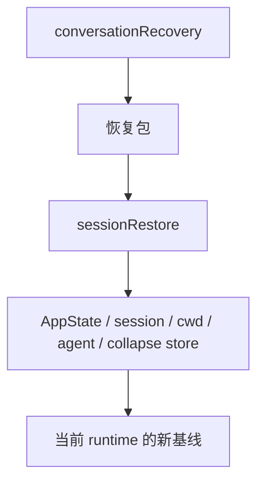
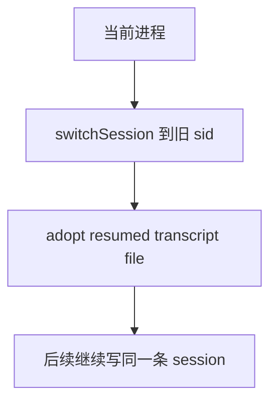

# Claude Code 源码共读笔记 62：sessionRestore 是把恢复包真正接回当前 runtime 的落地层

## 这篇看什么

前一篇 `conversationRecovery.ts` 已经把 resume 入口讲清了。

那篇的核心结论是：

> 它负责把磁盘上的会话档案整理成一份“能继续进入主循环”的恢复包。

但问题还没完。

因为恢复包就算已经有了，也还只是一个“包”。

真正更关键的问题是：

> **Claude Code 到底怎么把这份恢复包真正接进当前进程、当前 cwd、当前 AppState、当前 session 指针，让它不只是“能读”，而是真正“接着跑”？**

这个问题的主文件就是：

- `src/utils/sessionRestore.ts`

这次我重点看了：

- `sessionRestore.ts`
- 它和 `conversationRecovery.ts` 的接口边界
- 它和 `sessionStorage.ts` / `worktree` / `context collapse` / `agent` 恢复之间的连接点

看完之后，我现在的判断很明确：

> **`sessionRestore.ts` 不是 resume 的附属工具文件，而是恢复落地层：它负责把上一层准备好的恢复包，真正投射进当前进程状态里，包括 AppState、session pointer、worktree cwd、agent 定义、mode、context collapse store、todos、attribution、以及 resumed transcript 的文件接管。**

如果说：

- `conversationRecovery.ts` 负责“把旧会话读成可接的包”

那 `sessionRestore.ts` 负责的就是：

- **把这个包接到当前 runtime 身上**

这一层其实比“读文件”更像真正的恢复系统。

---

## 先给主结论

如果只先记一句话，我建议记这个：

> **`sessionRestore.ts` 的核心任务不是恢复消息文本，而是恢复当前进程的运行现场：它一边把 file history / attribution / context collapse / todos 这些状态接回 AppState，一边把 resumed session 的 sessionId、transcript 文件、worktree cwd、agent setting、mode 和初始 state 接回当前进程，让恢复结果真正变成“当前这次运行”的新基线。**

再压缩一点，就是：

- `conversationRecovery.ts`：恢复数据包
- `sessionRestore.ts`：恢复进程现场

这是这两篇最该分清的边界。

---

## 先把总图立住：恢复不是一层，而是“读包 → 接包”两段

这张图很重要。

因为它把 resume 的两层语义分开了：

### 第一层：恢复包
- 消息
- metadata
- interruption state
- replacement / collapse / snapshots

### 第二层：恢复落地
- 当前 session 指向谁
- 当前 cwd 是什么
- 当前 AppState 带什么状态
- 当前 agent / mode / transcript file 归谁

你只要先记住这两层，`sessionRestore.ts` 就不会被误读成“再加工一下 messages”。

它不是这个角色。

---

# 第一部分：`restoreSessionStateFromLog(...)` 说明它先恢复的是 AppState 内部状态，不是外层会话壳

`sessionRestore.ts` 里最直接的一层是：

- `restoreSessionStateFromLog(...)`

这个函数做的事情其实非常明确：

- 恢复 `fileHistory`
- 恢复 `attribution`
- 恢复 `context collapse` store
- 恢复 `todos`

这几个点有个共同特征：

> **它们都是“消息文本之外，但又属于当前工作状态”的 AppState 级内容。**

也就是说，这一层不是在动：

- session id
- cwd
- agent type
- transcript 文件归属

而是在把那些“会影响当前交互体验和后续运行”的内部状态先接回去。

这一点很重要。

因为它说明 Claude Code 的恢复不是单块大逻辑，
而是先按状态层次拆：

- 先恢复 AppState 子状态
- 再恢复外层 session / cwd / agent 壳

这个分层做得挺稳。

---

# 第二部分：恢复 file history，说明“恢复会话”也包括恢复文件编辑历史视角

`restoreSessionStateFromLog(...)` 第一件事就是：

- `fileHistoryRestoreStateFromLog(...)`

这里我觉得特别值的一点是：

> **恢复会话在 Claude Code 里，不只是恢复聊天，还包括恢复“文件改动历史视角”。**

这意味着：

- resume 后你看到的不是一条孤立消息链
- 连 file checkpointing / diff 相关的历史状态，也被视为会话现场的一部分

这和普通聊天产品完全不一样。

它更像一个真正的工作台：

- 会话说了什么
- 会话期间改过哪些文件
- 这些文件历史现在该怎么看

都是同一套恢复现场的一部分。

所以 file history 放在这里，不是锦上添花，
而是在强调：

> **Claude Code 的 session 本质上是工作会话，而不是纯文本会话。**

---

# 第三部分：attribution restore 说明某些 feature state 不是全局重算，而是按会话快照恢复

第二个类似的点是 attribution：

- `attributionRestoreStateFromLog(...)`
- `restoreAttributionStateFromSnapshots(...)`

虽然这是 feature-gated 的，
但它表达的设计态度很清楚：

> **一些与当前工作会话绑定的 feature state，不需要每次从零推导，而可以从会话快照恢复。**

这很合理。

因为如果每次 resume 都靠重新扫描整条消息、整条文件历史再计算，
一方面贵，另一方面也容易和原会话不完全一致。

而 snapshot restore 的优点是：

- 速度快
- 语义稳定
- 恢复后状态更接近当时会话现场

这点和 context collapse snapshot 其实是同一种思路。

---

# 第四部分：context collapse 必须在第一次 query 前 restore，说明它不是附属优化，而是 query 主路径依赖

这一层我觉得是整篇里最值得保住的点之一。

`restoreSessionStateFromLog(...)` 和 `processResumedConversation(...)` 都会做：

- `restoreFromEntries(result.contextCollapseCommits ?? [], result.contextCollapseSnapshot)`

而且注释写得很明确：

> **Must run before the first query()**

原因也写得很直白：

- `projectView()` 需要根据 resumed messages 重建 collapsed view
- 而且就算没有 entries，也得 restore，因为它会先 reset store
- 否则 in-session `/resume` 到另一个没有 collapse commit 的 session 时，会残留上个 session 的 stale store

这几句合起来，其实已经把这套设计说透了：

> **context collapse 在 Claude Code 里不是“可有可无的上下文优化”，而是恢复后第一轮 query 正确性的前置条件。**

这很重要。

因为它意味着：

- collapse store 是进程内状态
- resume 时必须显式 reset / restore
- 否则不是“少一点优化”，而是 query 看到的上下文视图会错

这说明它已经是 runtime 主路径的一部分了。

---

## 图 1：context collapse restore 的位置不能靠后

一句话：

> 不是先 query 再说，而是先 restore collapse store，再允许第一轮 query。

---

# 第五部分：Todo 恢复这段特别有意思——它不是靠单独文件，而是从 transcript 里反推最后一次 TodoWrite

`extractTodosFromTranscript(...)` 这段很有意思。

它的逻辑是：

1. 倒着扫 messages
2. 找最后一个 assistant message
3. 在 content 里找 `tool_use`，名字是 `TodoWrite`
4. 解析它的 input.todos
5. 用这个结果恢复 AppState.todos

我觉得这很漂亮。

因为它说明 Claude Code 并没有为 todos 单独再发明一套复杂持久化层，
至少在这条 SDK / 非交互恢复路径里，它做的是：

> **把 transcript 自身当作 todo state 的可信来源。**

也就是说，TodoWrite 不只是一个“展示工具”，
它顺手也成了：

- todo 状态的持久化协议

这是一种非常 Claude Code 风格的设计：

- 不额外开新协议就不开
- 能复用现有消息 / 工具轨迹，就复用现有轨迹

当然，这里它也写得很清楚：

- interactive mode 的 v2 tasks 是走 file-backed
- AppState.todos 在那条路径下并不是主角

这说明它没有强行把所有模式揉成一种恢复方案，
而是承认不同运行模式的持久化策略可以不同。

---

# 第六部分：`restoreAgentFromSession(...)` 很值，因为它明确把“恢复 agent”设计成“恢复定义 + 恢复默认 model override”

这个函数我很喜欢。

它的逻辑特别清楚：

## 情况 1：用户已经通过 CLI 显式指定了 agent
那就保持当前 agent，不强行恢复 session 里的 agent

## 情况 2：session 里根本没有 agentSetting
那就清理 stale bootstrap state

## 情况 3：session 里有 agentSetting，且当前 agentDefinitions 里还能找到
那就：
- `setMainThreadAgentType(...)`
- 如有需要，再恢复 model override

## 情况 4：session 里记录的 agent 已经不存在
那就打 debug log，回退到默认行为

这套设计我觉得特别成熟。

因为它没有盲目坚持“历史优先”，
也没有盲目坚持“当前 CLI 优先”，
而是分层判断：

> **用户显式输入 > 当前环境可用性 > 历史会话设置**

这就是很稳的优先级设计。

尤其“历史 agent 已不存在”这个分支也很现实。

如果一个系统只考虑最理想路径，
这种恢复逻辑通常会很脆。

Claude Code 显然考虑了会话跨版本、跨配置、跨环境的现实。

---

# 第七部分：mode restore 不是直接照抄，而是“先匹配，再必要时刷新 agent definitions”

`processResumedConversation(...)` 里关于 coordinator mode 的处理也很有意思。

它不是看到 `result.mode` 就机械设回去，
而是先调用：

- `matchSessionMode(result.mode)`

如果有 warning，就补一条 system warning message。

然后后面再看：

- `refreshAgentDefinitionsForModeSwitch(...)`

也就是说，它的态度不是：

- 历史模式一定要原样恢复

而是：

> **先让当前 runtime 和历史 session mode 对齐；如果 mode 切换影响了 built-in agents，就重新推导 agent definitions。**

这很重要。

因为 mode 不是孤立标记。

mode 一变，可能影响的是：

- 当前有哪些 built-in agents
- agent 列表怎么展示
- 当前状态怎么解释

所以 mode restore 的本质不是恢复一个枚举值，
而是恢复一整套围绕该 mode 展开的运行语义。

这点特别值得记。

---

# 第八部分：`switchSession(...) + resetSessionFilePointer() + adoptResumedSessionFile()` 这条线说明 resume 不是“读旧文件”，而是“当前进程接管旧 session”

这里是整篇最像“真正恢复系统”的地方。

在 `processResumedConversation(...)` 里，非 fork 路径会做这些事：

- `switchSession(...)`
- `renameRecordingForSession()`
- `resetSessionFilePointer()`
- `restoreCostStateForSession(sid)`
- `restoreSessionMetadata(...)`
- `restoreWorktreeForResume(...)`
- `adoptResumedSessionFile()`

这些动作连起来看，表达的是一个非常强的语义：

> **当前进程不只是“读了一份旧 transcript”，而是在正式接管这个旧 session。**

这里最关键的两个动作我觉得是：

## 1. `switchSession(...)`
把当前 bootstrap/session identity 切到被恢复的 session

## 2. `adoptResumedSessionFile()`
把当前 session file 指针真正指向 resumed transcript

这就意味着恢复之后，后续新的记录、退出时的 metadata re-append、共享/导出等行为，
都不再是“另起一份临时记录”，
而是接着原来的 session 继续写。

这个动作非常重。

它说明 resume 的默认语义是：

> **继续这条旧 session**

而不是：

> **读取旧 session 的内容，然后开一条新 session**

---

## 图 2：默认 resume 是“接管旧 session”，不是“复制旧 session”

这张图对应的就是默认 `--resume/--continue` 语义。

---

# 第九部分：`--fork-session` 这条分支特别值，因为它把“继续旧 session”和“从旧 session 分叉新 session”明确拆开了

这段我很喜欢。

如果是 `forkSession`，逻辑明显不一样：

- 不去 `switchSession` 到旧 sid
- 不去接管旧 transcript file
- 但如果有 `contentReplacements`，要 `recordContentReplacement(...)` 把这些 replacement 记录灌进新 session
- `restoreSessionMetadata(...)` 时要去掉 `worktreeSession`，避免 fork 会话误接管原 worktree

这几步加在一起，其实在表达一个非常清晰的设计：

> **fork-session 不是普通 resume 的“少做几步”，而是另一种语义：复制会话内容，但不接管原 session 的所有权。**

尤其 worktree 那条注释很值：

- fork 不应该接管原 session 的 worktree
- 不然 fork 退出时如果点 Remove，可能把原 session 还在引用的 worktree 删掉

这说明 Claude Code 对“会话所有权”想得很清楚。

不是所有从旧会话长出来的新运行，都应该继承底层资源的 ownership。

这点太工程了，而且太对了。

---

# 第十部分：worktree restore 做得很克制：恢复 cwd，但不强行重建 projectRoot 叙事

`restoreWorktreeForResume(...)` 这段我觉得非常成熟。

它的逻辑大致是：

1. 如果当前已经有 fresh worktree（比如 `--worktree` 新建的），那 fresh 优先
2. 否则如果 transcript 记录了 `worktreeSession`，尝试 `process.chdir(worktreePath)`
3. 如果目录已经没了，就 `saveWorktreeState(null)`，显式覆盖 stale cache
4. 如果目录还在，就：
   - `setCwd(...)`
   - `setOriginalCwd(...)`
   - `restoreWorktreeSession(...)`
   - 清 memory file cache / system prompt sections / plans cache

最有意思的是它故意不设 `projectRoot`。

注释解释得很清楚：

- transcript 并没有记录这个 worktree 当初是通过 `--worktree` 进入，还是 EnterWorktreeTool 进入
- 两种入口的 `projectRoot` 语义不完全一样
- 所以这里保守处理，只恢复 cwd 和 worktree session，不乱改更重的语义锚点

我觉得这特别值得学。

因为它体现了一个很好的恢复原则：

> **能确定的就恢复；不能确定的，不要假装知道。**

这比很多系统那种“我猜你大概想这样”要稳太多了。

---

# 第十一部分：`exitRestoredWorktree()` 说明 mid-session `/resume` 不是一次性场景，而是需要可逆切换

还有一个很容易被忽略，但非常值的函数：

- `exitRestoredWorktree()`

它解决的是这种情况：

- 当前进程已经因为一次 resume 切进了某个 worktree
- 然后你在同一个进程里又 `/resume` 到另一个 session
- 如果不先退出旧 worktree，就会卡在旧 cwd / 旧 currentWorktreeSession 上

这说明 Claude Code 明确考虑到了：

> **resume 可能发生在一个已经活着的进程里，而且同一个进程里可能连续切多个 session。**

这不是 CLI 一次性启动的问题，
而是 session switching 的问题。

所以 `exitRestoredWorktree()` 本质上是在做：

> **恢复动作的反向清理。**

这非常成熟。

因为只有考虑可逆性，in-session `/resume` 才真的稳。

---

# 第十二部分：`refreshAgentDefinitionsForModeSwitch(...)` 暴露了另一个很好的原则——恢复后允许“重新推导”，而不是死守历史快照

这个函数我觉得很能代表 Claude Code 的恢复哲学。

它会在 mode switch 后：

- clear `getAgentDefinitionsWithOverrides` cache
- 重新读当前 cwd 的 agent definitions
- 把 CLI agents 重新 merge 进去
- 再重新得出 active agents

这说明恢复系统没有死守一个想法：

- “历史会话里是什么，就一字不差恢复成什么”

而是更现实：

> **恢复的是“在当前环境里，最合理地续上那条会话”**

如果当前 mode 切换了，
那 built-in agents 就应该按当前 mode 重算。

也就是说，恢复系统既尊重历史，
又承认当前环境是活的。

这是一种非常成熟的折中。

---

# 第十三部分：`computeStandaloneAgentContext(...)` 和 `computeRestoredAttributionState(...)` 说明恢复前就开始算初始渲染状态了

这两个函数不复杂，
但它们透露出一个设计重点：

> **session restore 不只是为了让 query 能跑，也为了让 UI / 初始 render 一开始就处在对的状态。**

这也是为什么注释里会强调：

- used for computing initial state before render

也就是说，恢复系统服务的不只是底层执行，
还服务于：

- 当前页面一进来就该显示什么 agent 名称 / 颜色
- attribution 初始状态是什么

这是很完整的 thinking。

说明 Claude Code 恢复的是“会话现场”，
而不是单纯恢复“后端执行上下文”。

---

# 第十四部分：我现在最喜欢的一个判断——`sessionRestore.ts` 真正恢复的是“当前进程的责任边界”

把这篇所有点收起来后，我现在最想保住的一句话其实是：

> **`sessionRestore.ts` 恢复的，不只是状态值，而是当前进程应该对哪条 session、哪份 transcript、哪个 cwd、哪些运行时子系统负责。**

为什么我会这么说？

因为它做的很多动作，本质上都在定义责任边界：

- 当前 session id 指向谁
- 当前 transcript file 由谁接管
- 当前 cwd 应该在哪
- 当前 worktree ownership 怎么处理
- 当前 agent / mode 该怎么理解
- 当前 collapse store 属于哪条会话
- 当前 todos / attribution / file history 要恢复到什么状态

这其实已经不是普通意义上的“恢复字段”。

而是在说：

> **当前进程，从现在开始，是哪条会话的继续者。**

我觉得这个理解特别重要。

因为只有站在这个角度，你才会明白为什么这里会有：

- adoptResumedSessionFile
- switchSession
- restoreWorktreeForResume
- forkSession 的 ownership 剥离
- restore context collapse before first query

这些看起来很“重”的动作。

它们不是杂。

它们是在接管责任。

---

# 术语补充 / 名词解释

## 1. restoreSessionStateFromLog
建议理解成：

- **把恢复包里的子状态灌回 AppState**

它主要管 file history、attribution、collapse store、todos 这些进程内状态。

## 2. processResumedConversation
建议理解成：

- **把恢复包落成当前 session 语义**

它会处理 session id、metadata、mode、agent、worktree、initialState 等更外层的恢复动作。

## 3. adoptResumedSessionFile
建议理解成：

- **接管被恢复 session 的 transcript 文件**

不是读一下而已，而是让后续记录继续写进这条旧 session。

## 4. fork-session
建议理解成：

- **从旧会话分叉内容，但不继承原会话的资源所有权**

尤其不该接管原来的 worktree。

## 5. worktree ownership
这里可以人话理解成：

- **谁对这个 worktree 的生命周期负责**

这也是为什么 fork 路径要刻意剥离它。

---

# 这一篇最想保住的判断

如果把整篇压成一句最关键的话，我会留：

> **`sessionRestore.ts` 的本质不是“把恢复包里的字段填回去”，而是把一条被恢复的旧会话真正接成当前进程的工作现场：既恢复 AppState 里的 file history / attribution / todos / collapse store，也恢复 session 身份、transcript 文件、cwd、worktree、agent 和 mode 的责任边界，让这次运行从“读到旧会话”变成“接管并继续这条旧会话”。**

这句话里最重要的点有五个：

- 不是简单回填字段
- 要恢复 AppState 子状态
- 要恢复 session / transcript / cwd 归属
- fork 和 resume 是两种不同 ownership 语义
- 最终目标是“接管并继续”

---

# 我现在对 `sessionRestore.ts` 的最短总结

如果只留一句最短的话，我会留：

> **`sessionRestore.ts` 是 Claude Code 的恢复落地层：负责把恢复包真正接进当前 runtime，让当前进程成为那条旧会话的继续者。**

---

# 这篇最值得记住的几个判断

### 判断 1：`sessionRestore.ts` 主要恢复的是当前进程状态，不是消息文本；它是恢复落地层，不是恢复入口层

### 判断 2：`restoreSessionStateFromLog(...)` 先恢复 file history、attribution、collapse store、todos，说明 AppState 子状态本身就是会话现场的一部分

### 判断 3：context collapse 必须在第一次 query 前 restore，而且即使空也要 restore，因为它承担 reset stale store 的职责

### 判断 4：Todo 恢复是通过 transcript 中最后一次 TodoWrite 反推出来的，说明工具轨迹本身也可以成为状态持久化协议

### 判断 5：`restoreAgentFromSession(...)` 体现了很稳的优先级：用户显式 CLI > 当前环境可用性 > 历史 session 设置

### 判断 6：默认 resume 的语义是“接管旧 session”，而不是“复制旧内容”；这由 `switchSession(...)` 和 `adoptResumedSessionFile()` 明确体现

### 判断 7：`fork-session` 是另一种语义：复制内容，但不继承原 session 的 transcript / worktree ownership

### 判断 8：worktree restore 非常克制：恢复 cwd 和 session 状态，但不臆造 projectRoot 这类无法从 transcript 确定的重语义

### 判断 9：`exitRestoredWorktree()` 说明 in-session `/resume` 是可逆切换问题，不是一次性启动问题

### 判断 10：恢复系统最终恢复的不是一组字段，而是当前进程对哪条会话负责的边界

---

# 下一步最顺怎么接

如果继续沿这条线往下写，我觉得最顺有两个方向。

## 方向 A：专门写 `worktree` 恢复链

把这一组串起来：

- `restoreWorktreeForResume(...)`
- `exitRestoredWorktree()`
- `saveWorktreeState(...)`
- `restoreWorktreeSession(...)`

这样可以单独把“会话恢复如何影响 cwd / project anchoring / ownership”讲透。

## 方向 B：专门写 `TodoWrite` / tasks 的状态恢复语义

也就是把：

- transcript 里的 tool_use
- AppState.todos
- v1 / v2 tasks 差异
- resume 时为什么有的从 transcript 恢复、有的走 file-backed

单独做成一篇。

如果只选一个，我会更倾向 **方向 A**。

因为这篇已经把恢复落地层讲清了，下一篇接 worktree，会把“恢复为何不只是读消息，而是改当前工作现场”讲得更立体。