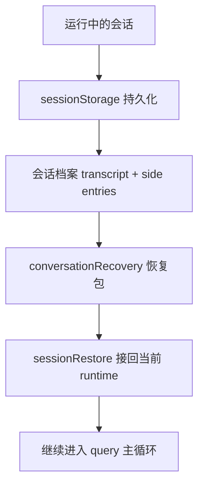
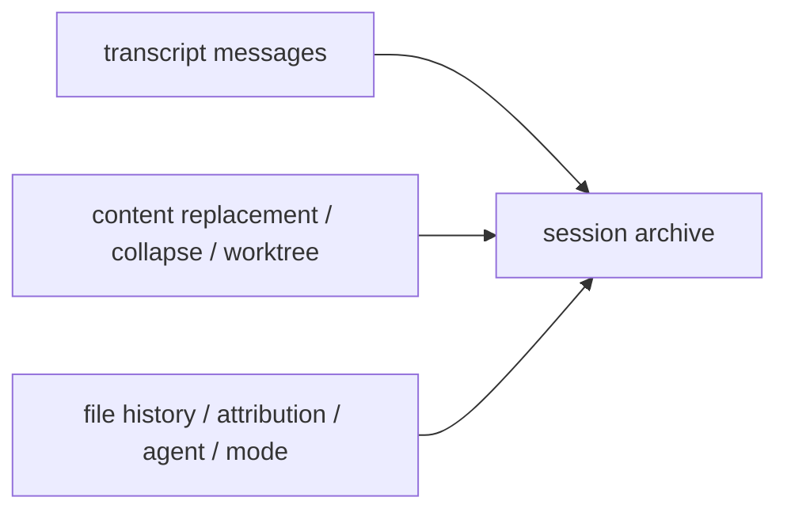
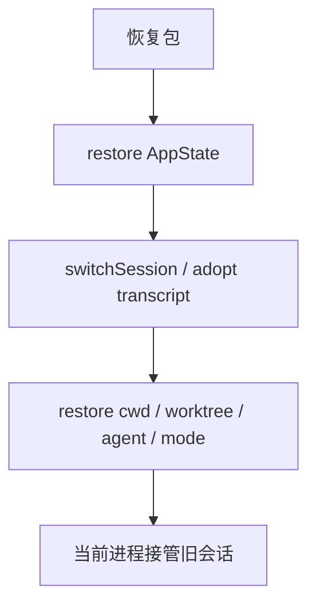

# Claude Code 源码共读笔记 63：session 线收尾：Claude Code 怎么把会话存下来、读回来、再接着跑

## 这篇看什么

前面 session 这条线，实际上已经拆了几篇关键节点：

- `sessionStorage.ts`
- `conversationRecovery.ts`
- `sessionRestore.ts`
- 再加上和它强相关的 `compact / collapse / content replacement` 这一侧

到这个阶段，如果继续拆，当然还能继续拆：

- worktree 恢复链
- todo / tasks 恢复
- attribution
- context collapse restore 细节

但这些更像专题支线，
已经不是“Claude Code 的 session 机制到底怎么闭环”的主干问题了。

所以这篇就不再新开太多源码细节，
而是专门做一个**session 线总收口**。

目标很明确：

> **给没一路跟着读下来、但有编程基础的人，建立一个完整心智模型：Claude Code 到底怎么把一条会话存下来、读回来、再继续跑。**

也就是说，这篇的重点不是再抠单个函数，
而是把这一整条机制真正收成一张脑图。

---

## 先给主结论

如果只先记一句话，我会留这个版本：

> **Claude Code 的 session 机制，本质上不是“把聊天记录存成文件再读出来”，而是把一条运行中的工作会话持久化成一份可恢复档案；恢复时，再把这份档案清洗成可继续进入主循环的恢复包，并最终接回当前进程状态，让这条旧会话真正继续跑下去。**

再压缩一点，就是：

- **存下来**：`sessionStorage.ts`
- **读回来**：`conversationRecovery.ts`
- **接着跑**：`sessionRestore.ts`

如果把这三层串顺，Claude Code 的 session 线就算真的读明白了。

---

## 先把总图立住：Claude Code 的 session 线其实只有三大段

这张图我建议直接记住。

因为它已经把最核心的问题都串起来了。

很多人第一次看 Claude Code 的 session 逻辑时，容易被很多词带乱：

- transcript
- resume
- session log
- content replacement
- collapse commit
- worktree
- sidechain

但如果你先抓住这张图，事情就简单很多：

### 第一段：持久化
把当前工作会话存成一份可恢复档案

### 第二段：恢复包
从档案里读出一份“能继续跑”的消息和元状态

### 第三段：恢复落地
把这份恢复包真正接到当前进程身上

其实整条线就是这三段。

---

# 第一部分：为什么 Claude Code 的 session 不是“聊天记录”，而更像“工作会话档案”

这是整条线最根上的判断。

如果把 session 理解成普通聊天记录，
很多后面的设计你都会觉得奇怪：

- 为什么还要存 content replacement
- 为什么还要存 context collapse commit
- 为什么 worktree state 也要进来
- 为什么 subagent transcript 是单独 sidechain
- 为什么恢复后还要补 AppState、agent、cwd、session pointer

但如果你把它理解成：

> **一份工作会话档案**

这些设计就全顺了。

因为 Claude Code 要恢复的从来不只是：

- 谁说了什么

它还要恢复：

- 会话链结构
- 运行中上下文治理痕迹
- 哪些大块内容被替换过
- 当前 worktree 是什么
- 当前 agent 是谁
- 当前 mode 是什么
- 当前 file history / todos / attribution 状态如何

所以我现在更愿意说：

> **Claude Code 的 session 是一份“可恢复工作现场”的会话档案。**

这句话一旦立住，后面很多看起来“很重”的设计都会变得合理。

---

# 第二部分：`sessionStorage.ts` 解决的是“什么东西值得进入会话历史”

session 线的第一站当然是：

- `sessionStorage.ts`

但它的关键不只是“写文件”，
而是：

> **定义哪些东西算会话本体，哪些只是运行时噪音。**

最典型的例子就是：

- `progress` 不算 transcript message

这说明 Claude Code 从一开始就没打算把所有运行时事件都原样录像。

它在做筛选。

### 会进入会话本体的
- user
- assistant
- attachment
- system
- 再加上一堆恢复时需要的 side entries

### 不会进入会话本体的
- 临时 UI 状态
- 不值得进入 parentUuid 链的瞬时事件

这一层特别重要。

因为如果边界不先定清，
后面的 resume 会一团乱。

所以 `sessionStorage.ts` 最根本的价值是：

> **先定义会话历史边界，再把这份边界内的东西持久化。**

---

# 第三部分：Claude Code 真正持久化的，不只是 transcript，还有一整套恢复线索

这条线必须单独说清。

很多人会直觉地以为：

- session = transcript = 消息数组

Claude Code 不是这样。

它真正落盘的是：

## 1. transcript message 本体
- user / assistant / attachment / system

## 2. 恢复线索 side entries
- content replacement
- context collapse commit
- context collapse snapshot
- worktree state
- attribution snapshot
- file history snapshot
- agent setting
- mode
- tag / PR link 等等

这说明 Claude Code 很清楚：

> **只存消息文本，不足以恢复一条工作会话。**

为什么？

因为恢复后的正确性，不只取决于“消息长什么样”，
还取决于：

- 当前送模视图应该怎么重建
- 当前工作目录应该在哪
- 当前会话到底是哪个 agent / 哪种 mode
- 当前有哪些上下文治理痕迹要继续生效

所以 `sessionStorage.ts` 存的不是“聊天内容”，
而是：

> **消息 + 恢复元状态**

这是 session 线第一件必须记住的事。

---

## 图 1：会话档案 = 消息本体 + 恢复线索

这张图比“session=聊天记录”更接近 Claude Code 的真实实现。

---

# 第四部分：`conversationRecovery.ts` 解决的是“怎样把档案读成一份能继续工作的恢复包”

有了档案，还不能直接 resume。

因为磁盘上的档案，不等于：

- API 合法消息列
- 主循环可继续状态

所以才有：

- `conversationRecovery.ts`

这一层干的事情，我现在会把它概括成：

> **把持久化档案翻译成恢复包。**

它主要做几类事：

## 1. 选恢复源
- 最近会话
- session id
- `.jsonl` 路径
- 已加载 log

## 2. 找主链
- 不是简单顺序读文件
- 而是找最新 non-sidechain leaf，再回溯主会话链

## 3. 清洗消息结构
- unresolved tool use 过滤
- orphaned thinking-only 过滤
- whitespace-only assistant 过滤
- 旧 attachment migration
- 非法 permissionMode 清理

## 4. 识别中断状态
- 不是靠 stop_reason
- 而是靠最后一个 turn-relevant message 的形状

## 5. 统一恢复语义
- 把 `interrupted_turn` 规整成 `interrupted_prompt`
- 必要时补 synthetic continuation 和 assistant sentinel

## 6. 恢复运行中附加语义
- skill state
- skill listing 抑制
- resume hooks

这些动作连起来说明一件很重要的事：

> **恢复包的目标不是忠实复刻磁盘内容，而是最大限度恢复“还能继续工作”的状态。**

这是 session 线第二个必须记住的点。

---

# 第五部分：为什么 persisted transcript 不能直接送回 API

这是这条线里最容易被低估、但又最该记住的点之一。

很多人直觉上会想：

- 都已经持久化了
- 读回来继续发给模型不就行了

Claude Code 的恢复逻辑其实明确在告诉你：

> **不行。**

为什么不行？

因为持久化发生在一个真实、流式、可能中断、可能半成品的运行现场里。

这会留下很多“磁盘上合理，但 API 再送一次不合法”的东西，比如：

- `tool_use` 没有配对 `tool_result`
- thinking block 单独落盘后变成孤儿
- assistant 只留下空白换行
- 最后一轮停在半截

所以 `conversationRecovery.ts` 必须先做消息修复。

这说明 Claude Code 很清楚一个现实：

> **持久化档案的语义，和重新送模的语义，不是同一层。**

这也是为什么恢复中间必须多出一层“恢复包”。

---

# 第六部分：`sessionRestore.ts` 解决的是“怎样让当前进程真正成为这条旧会话的继续者”

session 线第三段，就是：

- `sessionRestore.ts`

这篇最重要的结论，其实不是“恢复更多状态”，
而是：

> **让当前进程正式接管这条旧会话。**

这句话比“恢复状态”更准。

因为它做的事情其实都是围绕“接管责任边界”展开的：

## 1. 恢复 AppState 子状态
- file history
- attribution
- context collapse store
- todos

## 2. 恢复 session 身份
- `switchSession(...)`
- `restoreCostStateForSession(...)`
- `resetSessionFilePointer()`
- `adoptResumedSessionFile()`

## 3. 恢复 cwd / worktree 现场
- `restoreWorktreeForResume(...)`
- 必要时清理 stale worktree cache

## 4. 恢复 agent / mode 语义
- `restoreAgentFromSession(...)`
- `matchSessionMode(...)`
- `refreshAgentDefinitionsForModeSwitch(...)`

## 5. 恢复 UI / 初始渲染所需状态
- standaloneAgentContext
- restored attribution
- refreshed agent definitions

这些动作连起来，真正发生的是：

> **当前这次运行，不再只是“看到了旧会话”，而是“接管了旧会话”。**

这是 session 线第三个必须记住的点。

---

## 图 2：恢复包要先“接包”，旧会话才算真正活过来

这张图的重点不是步骤顺序绝对精确，
而是那个核心感觉：

> **恢复完不是“读到了”，而是“接管了”。**

---

# 第七部分：默认 resume 和 fork-session，为什么是两种完全不同的语义

这是 session 线里很容易忽略，但非常值的一点。

Claude Code 很明确地区分了两种恢复语义：

## 1. 默认 resume / continue
语义是：

> **继续这条旧 session**

所以会：

- `switchSession(...)`
- `adoptResumedSessionFile()`
- 后续继续写同一条 session transcript

## 2. fork-session
语义是：

> **以旧会话内容为起点，分叉出一条新 session**

所以不会：

- 接管原 transcript 文件
- 接管原 session id
- 接管原 worktree ownership

但会：

- 把必要的 content replacement 记录复制进新 session

这个区分特别成熟。

因为它不是把 fork 理解成“resume 的变体”，
而是当成另一种所有权语义。

一句话说：

- **resume = 接管旧会话**
- **fork = 复制旧内容，开新会话**

这点最好记住。

---

# 第八部分：compact / collapse / content replacement 为什么一定要并入 session 线理解

如果只把 session 线理解成“存和取”，
其实还是会少一半。

因为 Claude Code 的会话，不是静态消息串，
而是已经经过上下文治理的工作会话。

所以 session 线必须连着理解这些东西：

## compact
- 会重建新的 post-compact messages 骨架
- boundary / summary / keep / attachments 都会进入会话结构

## context collapse
- 不直接改 transcript
- 但 collapse commit / snapshot 要持久化，恢复时再重建投影视图

## content replacement
- 某些上下文块被 stub 替代过
- resume 时要 replay，保证 prompt cache / 视图形状稳定

这三者说明了一个更深的事实：

> **Claude Code 持久化的不是“原始未加工会话”，而是一条已经被运行时治理过、同时又必须可恢复的工作会话。**

这也是为什么 session 线看起来比普通聊天持久化重得多。

---

# 第九部分：所以 Claude Code 的 session 机制，最值得学的不是“resume”，而是它对“会话”这件事的定义

把整条线读完后，我现在觉得最值得学的，其实不是某个具体 API 或某个函数技巧。

而是这个更大的设计判断：

> **Claude Code 把 session 定义成一条可持续运行的工作回路，而不是一份聊天历史。**

一旦你这么定义 session，后面很多设计都会自然长出来：

- 为什么 transcript 不等于所有运行时事件
- 为什么 sidechain transcript 要独立持久化
- 为什么 content replacement / collapse commit 要单独落盘
- 为什么 resume 前必须先做消息修复
- 为什么 restore 不是回填字段，而是接管当前进程责任
- 为什么 fork 和 resume 要分成两种 ownership 语义

也就是说，真正值钱的不是“怎么 resume”，
而是：

> **先把 session 定义成什么。**

Claude Code 在这一点上，明显比很多 agent / chat 系统更成熟。

---

# 用一句更通俗的话，把整条 session 线串起来

如果用最通俗的人话讲 Claude Code 的 session 线，我会这样说：

1. **先把当前这条工作会话存下来**
   - 不是只存聊天
   - 连恢复时需要的各种结构线索一起存

2. **下次要继续时，先把这份档案读回来**
   - 但不是直接拿来用
   - 先修消息结构、识别中断、补回技能和 hook 语义

3. **再把这份恢复包接到当前进程身上**
   - 恢复当前 session 身份
   - 恢复 transcript 文件归属
   - 恢复 cwd / worktree / agent / mode / AppState

4. **最后才真正继续 query 主循环**
   - 所以这条旧会话不是“被查看”
   - 而是“被接续”

这四句话基本已经把整条线收完了。

---

## 图 3：最容易记住的一张 session 收尾总图

我建议如果只记一张图，就记这张。

---

# 术语补充 / 名词解释

## 1. session
在这条线里，不建议只理解成“聊天会话”。

更准确地说，是：

- **一条可恢复的工作会话**

## 2. transcript
建议优先理解成：

- **会话记录**

如果要更严格一点，可以理解成：

- **会话运行档案的一部分**

因为它不是全部，还需要 side entries 一起看。

## 3. recovery package / 恢复包
就是 `conversationRecovery.ts` 整理出来的那份东西。

它不只是 messages，
还包括 interruption state、content replacements、collapse commits、session metadata 等等。

## 4. restore
这里不要只理解成“把值填回去”。

更准确地说，是：

- **把恢复包真正接到当前进程身上**

## 5. continue vs fork
最简单的理解：

- `continue/resume`：继续旧 session
- `fork-session`：从旧内容分叉出新 session

---

# 这一篇最想保住的判断

如果把整篇压成一句最关键的话，我会留：

> **Claude Code 的 session 机制，本质上是在维护一条可持续运行的工作会话：先把它持久化成可恢复档案，再把档案整理成能继续进入主循环的恢复包，最后把恢复包接回当前进程状态，因此 resume 从来不是“打开旧聊天记录”，而是“接续一条旧的工作回路”。**

这句话里最重要的点有四个：

- session 是工作会话，不只是聊天记录
- 持久化的是档案，不只是消息
- 恢复时要先形成恢复包
- 最终目标是接续工作回路

---

# 我现在对 Claude Code session 线的最短总结

如果只留一句最短的话，我会留：

> **Claude Code 的 session 线，本质上是在把一条运行中的工作会话，做成可存档、可恢复、可继续接管的系统回路。**

---

# 这条线最值得记住的 10 个判断

1. session 不是聊天记录，而是工作会话
2. transcript 不是所有运行时事件的全量录像
3. 持久化的不只是消息，还有恢复线索
4. resumed transcript 不能直接送 API，必须先修复结构
5. resume 的中断检测依赖 transcript 形状，不依赖 stop_reason
6. `conversationRecovery.ts` 负责生成恢复包，不负责接管当前进程
7. `sessionRestore.ts` 负责把恢复包接回当前 runtime
8. 默认 resume 是接管旧 session，不是复制旧内容
9. fork-session 是复制内容但不接管原 session ownership
10. compact / collapse / content replacement 都属于 session 线的一部分，而不是外部补丁

---

# 下一步最顺怎么接

session 主线我觉得就到这里可以正式收尾了。

如果后面还想继续，不建议再叫“session 主线”，而更适合当专题支线来写。

## 方向 A：worktree 恢复专题
专门讲：
- cwd
- project anchoring
- ownership
- in-session `/resume` 的可逆切换

## 方向 B：tasks / TodoWrite 恢复专题
专门讲：
- transcript 里的 tool_use 怎么变成 todo state
- v1/v2 tasks 的差异
- 为什么不同模式恢复策略不同

## 方向 C：做一篇“session 线 + context 线”的对照总图
也就是把：
- sessionStorage / recovery / restore
- compact / microcompact / collapse

放到一张更大的系统图里。

如果只选一个，我会更倾向 **方向 C**。

因为现在 session 线已经收口了，下一步最有价值的，不是继续下钻，而是把“会话恢复”和“上下文治理”两条线并成一张更大的 Claude Code runtime 图。