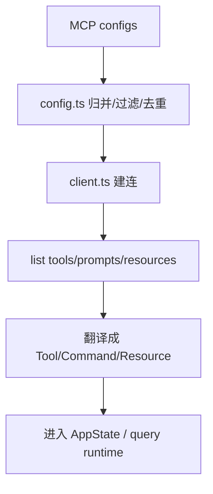

# Claude Code 源码共读笔记 64：Claude Code 是怎么把 MCP 外部能力接进 runtime 的

## 这篇看什么

session 线刚收完，下一条最自然的主线其实就是 MCP。

因为前面我们讲清的是：

- 会话怎么存
- 怎么恢复
- 怎么重新接回 runtime

那紧接着最自然的问题就是：

> **这个 runtime 到底怎么长出“外部能力”？**

Claude Code 给出的一个核心答案，就是 MCP。

所以这篇先不讲太细的 OAuth、授权弹窗、插件市场，也不急着讲某个具体 MCP server 怎么写。

我想先立住一个更根的问题：

> **Claude Code 是怎么把一堆外部 MCP server，翻译成当前 runtime 里模型真的能调用的 tools / commands / resources 的？**

这次我主要看了：

- `src/services/mcp/types.ts`
- `src/services/mcp/config.ts`
- `src/services/mcp/client.ts`
- `src/services/mcp/MCPConnectionManager.tsx`
- 以及 `query.ts` 里 MCP 和主循环的接点

看完之后，我现在最明确的判断是：

> **Claude Code 对 MCP 的处理，不是“发现一个远程接口就直接塞给模型”，而是走了一条完整的接入链：配置归并 → 策略过滤 → 建立连接 → 拉取 tools/prompts/resources → 翻译成 Claude Code 自己的 Tool/Command 抽象 → 放进 AppState → 每轮 query 再按当前状态刷新和暴露。**

也就是说，MCP 在 Claude Code 里不是“外挂”，
而是一个被严密接进 runtime 的能力层。

---

## 先给主结论

如果只先记一句话，我会留这个版本：

> **Claude Code 接入 MCP 的核心，不是“连上 server”这么简单，而是把外部 server 翻译成内部 runtime 能理解的能力对象：server config 先被收敛成统一的 `ScopedMcpServerConfig`，再被连接成 `MCPServerConnection`，再从 server 拉出 tools / prompts / resources，最后分别映射成 Claude Code 的 `Tool`、`Command` 和资源工具，进入当前 AppState 和 query 主循环。**

再压缩一点，就是：

- **MCP server ≠ 直接给模型用**
- **先接入，再翻译，再纳入 runtime**

这句话就是这篇最该记住的主心骨。

---

## 先把总图立住：MCP 接入是 5 段，不是 1 段



这张图很重要。

因为它先打掉了一个最常见的误解：

> **MCP 不是“拿到一个 server 地址，然后模型就会用它”。**

Claude Code 中间插了很多工程层：

- 配置归并
- 策略过滤
- transport 选择
- 连接缓存
- tool 翻译
- prompt 转 command
- resource 补资源工具
- 运行时刷新

这意味着 Claude Code 把 MCP 当成的是：

> **一种受 runtime 管理的外部能力来源。**

而不是直接穿透给模型的原始接口。

---

# 第一部分：`types.ts` 先把 MCP 从“杂多外部 server”统一成 Claude Code 能处理的配置/连接类型

我觉得看 MCP 最好的第一站，不是 client.ts，
而是：

- `src/services/mcp/types.ts`

因为它先把 MCP 这件事做了类型层收口。

这里最关键的是两层类型：

## 第一层：配置类型
- `McpServerConfig`
- `ScopedMcpServerConfig`

Claude Code 支持的 transport 很多：

- `stdio`
- `sse`
- `http`
- `ws`
- `sdk`
- 还有 IDE / claudeai-proxy 这种内部变体

如果没有这一层统一类型，
后面的 config merge、connect、dedup、policy filter 都会很散。

所以它先做了一件最基本但特别重要的事：

> **把来源不同、传输方式不同的 MCP server，先统一收成一份标准配置对象。**

其中 `scope` 又特别关键。

它把一个 server 不只是定义成“怎么连”，
还定义成“它从哪来”：

- local
- user
- project
- dynamic
- enterprise
- claudeai
- managed

这一步看起来像 metadata，
其实后面非常重要。

因为你后面讲：

- precedence
- dedup
- policy
- plugin 注入
- enterprise 接管

都要靠它。

---

## 第二层：连接状态类型
- `MCPServerConnection`

它不是简单 boolean connected。

而是明确拆成：

- `connected`
- `failed`
- `needs-auth`
- `pending`
- `disabled`

这说明 Claude Code 对 MCP 的理解不是：

- server 要么有，要么没有

而是：

> **一个 MCP server 在 runtime 里是有生命周期状态的。**

这点很重要。

因为只要你承认它是一个“活对象”，
后面很多设计就自然了：

- reconnect
- auth cache
- skip cached needs-auth
- onclose 清缓存
- pending / failed 的 UI 呈现

所以 `types.ts` 这一层，实际上是在告诉你：

> **Claude Code 不是把 MCP 当静态配置，而是当动态连接对象。**

---

# 第二部分：`config.ts` 解决的是“哪些 MCP server 最终有资格进入系统”

如果说 `types.ts` 定义了对象，
那 `config.ts` 解决的就是：

> **哪些对象最终能进入 Claude Code 的 MCP 池。**

这个文件其实比想象中重要很多。

因为它不只是“读配置文件”，
而是在做完整的入口治理。

它主要做几件事：

## 1. 多来源配置归并
- enterprise
- user
- project
- local
- dynamic
- plugin
- claude.ai connectors

## 2. 配置校验与环境变量展开
- schema parse
- env expand
- 缺失变量警告
- Windows npx 之类的平台兼容提醒

## 3. 策略过滤
- allowlist / denylist
- managed-only
- plugin-only 限制
- enterprise exclusive control

## 4. 去重
- plugin MCP servers 和 manual servers 去重
- claude.ai connectors 和 manual servers 去重
- 按 command/url signature 去重，而不是只按名字

## 5. 启用/禁用状态
- disabledMcpServers
- enabledMcpServers
- builtin 默认禁用 server 的特判

这说明一个非常重要的设计判断：

> **Claude Code 把 MCP 的第一道关，不放在“连得上”，而放在“有没有资格进入候选池”。**

这是非常成熟的工程思路。

因为如果不先做入口治理，
后面连接层会承担太多不该承担的复杂度。

---

# 第三部分：它不是按“名字冲突”去重，而是按“底层 server 签名”去重，这很值

`config.ts` 里我特别喜欢的一点，是去重逻辑。

它不是简单看：

- server 名字是不是一样

而是做了：

- `getMcpServerSignature(...)`
- 对 stdio 看 command array
- 对 remote 看 url
- 对 CCR proxy URL 还能解出原始 vendor URL 再比

这说明 Claude Code 清楚一个现实：

> **同一个 MCP server 可以以不同名字出现在不同入口里。**

比如：

- 手工配置一个 Slack MCP
- claude.ai connector 又带来一个 Slack MCP
- plugin 又附带一个同样的 URL

如果只按名字比，根本不够。

Claude Code 这里选的是更对的方式：

> **按“底层是否真的是同一个 server”去 dedup。**

这非常值钱。

因为这不是体验小优化，
而是直接关系到：

- 重复连接
- 重复 tool 暴露
- 每轮 prompt 里重复浪费 token
- 相同 server 以多个名字出现造成的模型困惑

我觉得这是个很成熟的系统判断。

---

# 第四部分：`getAllMcpConfigs()` 暴露了 Claude Code 的入口优先级观

再往前推一步，`getClaudeCodeMcpConfigs()` / `getAllMcpConfigs()` 其实把优先级讲得很清楚。

大致是：

- enterprise 有排他权时，别的都不用
- 否则先合 Claude Code 自己这边的来源
- plugin 先于 manual merge，但会被 manual signature suppress
- claude.ai connectors 最后 merge，且优先级最低

更重要的是，手工配置和当前项目状态一般优先于平台侧“自动带来的连接器”。

这背后其实是个很好的产品判断：

> **离用户当前工作现场越近、表达意图越明确的配置，优先级越高。**

比如：

- 当前项目 local/project 配置 > 云端 connector
- 用户显式写的 `.mcp.json` > 自动同步来的东西

这个排序很合理。

因为 Claude Code 面对的不是纯协议环境，
而是一个“用户正在当前仓库里工作”的真实 runtime。

---

## 图 1：进入候选池前，MCP 已经被做过一轮入口治理


这张图对应的核心意思是：

> **能否进入候选池，和能否连上，是两件不同的事。**

Claude Code 先处理前者。

---

# 第五部分：`client.ts` 真正解决的是“如何把候选 server 变成活连接”

如果 `config.ts` 负责“谁有资格进来”，
那 `client.ts` 负责的就是：

> **这些合格 server 怎么真的连起来。**

这里最重要的是：

- `connectToServer(...)`

这个函数几乎就是 MCP 接入的物理装配线。

它做的事很完整：

## 1. 按 transport 类型选连接方式
- SSEClientTransport
- StreamableHTTPClientTransport
- WebSocketTransport
- StdioClientTransport
- SDK control transport
- in-process transport（某些 builtin MCP）

## 2. 处理不同 transport 的认证/headers/proxy/timeout
- auth provider
- request headers
- wrap timeout
- proxy options
- session ingress token
- claude.ai proxy auth

## 3. 建立 `Client`
- 声明自己的 capability
- 注册 roots handler
- 注册默认 elicitation handler

## 4. 建连与超时控制
- `client.connect(transport)`
- race timeout
- 连接失败分类
- needs-auth 特殊返回

## 5. 连接后读取 server capability/instructions
- tools
- prompts
- resources
- server instructions

## 6. 注册 onerror/onclose / reconnection 相关逻辑
- session expired
- clear cache
- reconnect 机会
- cleanup

你会发现，Claude Code 在这里没有把 MCP 当成一个轻薄包装。

它做的是一整套：

> **transport abstraction + connection lifecycle management**

这也是为什么我会说，MCP 在 Claude Code 里不是外挂，而是 runtime 的正式能力层。

---

# 第六部分：MCP server 连上以后，还没结束；关键是要被翻译成 Claude Code 自己的抽象

这一层是这篇最该记住的点之一。

很多人会把“连上 server”误以为就是 MCP 接入完成。

在 Claude Code 里，远远不是。

真正更关键的是：

> **server capability 要被翻译成 Claude Code 内部统一能力模型。**

这里主要有三类映射：

## 1. `tools/list` → `Tool[]`
通过：
- `fetchToolsForClient(...)`

它会把 MCP 工具翻译成 Claude Code 的 `Tool` 对象。

重点包括：
- tool name 规范化成 `mcp__<server>__<tool>`
- 接上 `MCPTool` 的 call/checkPermissions/userFacingName 等行为
- 读取 annotations 转成只读/破坏性/open-world 等属性
- 把 input schema 接到 Claude Code 的 tool schema 里

这一步很关键。

因为它说明 Claude Code 并没有让模型“直接调用 MCP 协议里的 tool”，
而是：

> **先把它封装成 Claude Code 自己的 Tool 抽象。**

这让后面权限、UI、analytics、tool collapse、prompt 暴露都能统一走同一套基础设施。

---

## 2. `prompts/list` → `Command[]`
通过：
- `fetchCommandsForClient(...)`

这里特别有意思。

Claude Code 没把 MCP prompt 当“模型内部参考文本”，
而是翻译成：

- slash-command 风格的 `Command`

而且名字会做成：
- `mcp__<server>__<prompt>`

这说明 Claude Code 在做一种很清晰的设计：

> **MCP prompt 在它这里更像可执行命令入口，而不是静态提示片段。**

这非常值。

因为它让 MCP prompt 被接入到现有 command 系统，
而不是另发明一套“prompt marketplace only”逻辑。

---

## 3. `resources/list` → `ServerResource[]` + 补资源工具
通过：
- `fetchResourcesForClient(...)`
- 再按需补 `ListMcpResourcesTool` / `ReadMcpResourceTool`

这个设计也很漂亮。

它没有把资源直接暴露成“模型自己知道怎么读”的隐式对象，
而是：

- 先记录资源列表
- 再通过统一工具把“列资源/读资源”接进模型可调用层

这意味着 Claude Code 对 resource 的看法也很工程化：

> **资源本身不是模型动作；读取资源仍然应该通过受控工具完成。**

这和它整体的 tool-first 设计是一致的。

---

# 第七部分：MCPTool 的意义不是“代转发”，而是把外部 tool 纳入 Claude Code 的统一 tool 语义

`fetchToolsForClient(...)` 里把每个 MCP tool 转成 `Tool` 对象时，
我觉得最值得记住的一点是：

> **MCPTool 不是简单 RPC wrapper，而是把外部工具纳入 Claude Code 自己的 tool 语义体系。**

为什么这么说？

因为它除了 `call()`，还接了很多 Claude Code 自己关心的判断：

- `isReadOnly()`
- `isDestructive()`
- `isOpenWorld()`
- `isConcurrencySafe()`
- `isSearchOrReadCommand()`
- `toAutoClassifierInput()`
- `checkPermissions()`
- `userFacingName()`

这说明 Claude Code 关心的不是“能不能调到外部功能”，
而是：

> **这个外部功能在我系统里应该被当成什么类型的动作。**

这一步非常关键。

因为如果没有这层归一化，MCP tool 就只是黑箱 RPC。

而一旦有了这层，Claude Code 后面的：

- 权限系统
- auto-mode classifier
- defer/collapse
- UI 展示
- analytics

都能继续统一处理。

---

# 第八部分：MCP 工具调用并不是“调了就算”，中间还包了重试、结果整形、大输出治理、URL elicitation

`client.ts` 后半段还有一个非常重要的事实：

> **Claude Code 不是只把 MCP tool 接进来了，它还把“调用之后的治理链”也包进来了。**

比如：

## 1. session 失效重试
- `ensureConnectedClient(...)`
- session expired 时清缓存并重连

## 2. URL elicitation retry
- `callMCPToolWithUrlElicitationRetry(...)`
- 处理 -32042
- 走 hook / 用户交互 / 再重试

## 3. 大输出治理
- `processMCPResult(...)`
- 太大则截断或持久化到文件
- 给模型返回“去读文件”的说明，而不是直接塞爆上下文

## 4. 结果内容整形
- image / audio / resource / resource_link 转成 Claude API content blocks
- 二进制内容落盘后只给摘要说明

## 5. needs-auth / Unauthorized / OAuth 过期处理
- 401 分类
- `needs-auth` 缓存
- auth tool 注入

这说明 Claude Code 对 MCP 调用的理解不是：

- call once, done

而是：

> **MCP tool call 也是 query runtime 的一等动作，需要完整的错误恢复、输出治理、交互补偿和状态迁移。**

这一点非常值钱。

因为这就是“平台化”和“协议直连”的区别。

---

# 第九部分：`getMcpToolsCommandsAndResources(...)` 暴露了一个更高层的事实——Claude Code 真正拉的是“能力包”，不是单个 tool

我特别喜欢这个函数名字：

- `getMcpToolsCommandsAndResources(...)`

它很诚实。

它不是叫：
- `getMcpTools`

因为 Claude Code 真正从 MCP server 拉下来的，
不是只有 tools，
而是一个更完整的能力包：

- client
- tools
- commands
- resources

这点很重要。

因为它说明在 Claude Code 的架构里，MCP server 不是某种“第三方工具仓库”，
而更像：

> **一个外部能力节点。**

一个节点进来以后，可能贡献：

- 可调用工具
- 可执行 prompt 命令
- 可枚举资源
- 甚至 skill（如果开了 MCP_SKILLS）

这比“第三方工具接入”丰富得多。

也是 Claude Code 平台感更强的地方。

---

## 图 2：Claude Code 从一个 MCP server 拉下来的不是单个工具，而是一整包能力

```mermaid
flowchart LR
    A[MCP Server] --> B[tools/list]
    A --> C[prompts/list]
    A --> D[resources/list]
    B --> E[Tool[]]
    C --> F[Command[]]
    D --> G[ServerResource[] + resource tools]
```

这张图可以帮你避免把 MCP 理解得过窄。

---

# 第十部分：为什么 `query.ts` 里每轮都要 refresh tools——因为 MCP 是活的，不是静态 build-time 资产

前面 `rg` 里有一行很关键：

- `Refresh tools between turns so newly-connected MCP servers become available`

这句话其实已经把另一个核心特征讲出来了：

> **MCP 在 Claude Code 里是运行时动态能力，不是启动时一次性静态装配。**

也就是说，MCP server 的状态可能变化：

- 连接刚建立
- auth 刚补齐
- 某 server 被 toggle enabled
- 某动态 server 被加入

所以 query 不是一劳永逸地拿一份 tools 快照。

它会在 turn 之间刷新。

这点非常关键。

因为它说明 Claude Code 的 runtime 设计承认：

- tool universe 是会变的
- 外部能力面是动态的

而不把工具池假设成永远静态。

这也是 MCP 这条线和 session 线能自然接起来的原因：

- session 线解决 runtime continuity
- MCP 线解决 runtime extensibility

---

# 第十一部分：我最想保住的一个判断——Claude Code 并不是“支持 MCP”，而是在“把 MCP 平台化”

读到这里，我现在最想保住的判断其实不是某个函数名。

而是这句：

> **Claude Code 不是简单“支持 MCP 协议”，而是在把 MCP 做成自己的平台能力层。**

为什么我会这么说？

因为它做的不是单点协议兼容，
而是整套平台动作：

- 配置层统一
- 多来源 merge
- policy filter
- signature dedup
- transport lifecycle
- tool/command/resource 翻译
- auth / reconnect / retry
- result normalization
- 大输出治理
- query turn 动态刷新

这已经不是“能用 MCP”这么简单了。

更准确地说，是：

> **Claude Code 正在把 MCP 接成自己的外部能力总线。**

这也是为什么我觉得 MCP 应该放在 session 线后面读。

因为它正好回答了 session 线之后的下一个问题：

- 这套 runtime 活起来以后，能力从哪来？

Claude Code 的答案之一就是：

- 从 MCP 外部能力总线来。

---

# 术语补充 / 名词解释

## 1. MCP server
在这条共读线里，不建议只理解成“一个远程接口”。

更准确地说，是：

- **一个外部能力节点**

因为它可能同时贡献 tools、prompts、resources，甚至 skills。

## 2. `ScopedMcpServerConfig`
建议理解成：

- **带来源信息的标准 MCP 配置对象**

重点不只是怎么连，还包括“它从哪来”。

## 3. `MCPServerConnection`
建议理解成：

- **MCP server 在 runtime 里的连接状态对象**

不是单纯“client 引用”。

## 4. MCPTool
建议理解成：

- **被 Claude Code 归一化后的外部工具壳**

重点是它已经进入 Claude Code 的 tool 语义体系。

## 5. MCP command
这里其实是把 MCP prompt 翻译成：

- **Claude Code 的命令入口**

不是单独另起一套 prompt 子系统。

---

# 这一篇最想保住的判断

如果把整篇压成一句最关键的话，我会留：

> **Claude Code 接入 MCP 的关键，不在于“能连上多少 server”，而在于它把外部能力完整翻译成了自己的 runtime 组件：配置先归并与治理，连接再生命周期管理，server capability 再映射成 Tool/Command/Resource，最后作为动态能力面进入 AppState 和 query 主循环，因此 MCP 在 Claude Code 里不是外挂，而是受平台统一管理的外部能力层。**

这句话里最重要的点有五个：

- 先治理配置，不先直接连
- 连接是有生命周期的
- capability 要翻译成内部抽象
- 结果要进入 AppState / query 主循环
- MCP 是平台能力层，不是外挂

---

# 我现在对 Claude Code MCP 接入层的最短总结

如果只留一句最短的话，我会留：

> **Claude Code 的 MCP 层，本质上是在把外部 server 翻译成受 runtime 管理的 Tool / Command / Resource 能力包。**

---

# 这篇最值得记住的几个判断

### 判断 1：MCP 接入不是一步，而是“配置归并 → 建连 → 拉能力 → 翻译抽象 → 进入 runtime”的五段链路

### 判断 2：`config.ts` 的价值不只是读配置，而是决定哪些 server 有资格进入候选池，并通过 policy / dedup / precedence 先做入口治理

### 判断 3：去重按底层 command/url signature，而不是只按 server 名字，这说明 Claude Code 真正在意的是“是不是同一个底层能力源”

### 判断 4：`client.ts` 的核心不是 RPC，而是 transport 选择、连接生命周期管理、auth/timeout/reconnect/cleanup 的完整装配线

### 判断 5：MCP capability 不直接给模型，而是被翻译成 Claude Code 自己的 `Tool`、`Command` 和资源工具，这让它们能统一接入现有 runtime 基础设施

### 判断 6：MCPTool 的价值不只是代转发，而是把外部工具纳入 Claude Code 的统一 tool 语义，如只读/破坏性/open-world/权限检查/自动分类输入等

### 判断 7：Claude Code 从一个 MCP server 拉下来的不是单个 tool，而是一整包能力：tools + prompts + resources（以及某些模式下的 skills）

### 判断 8：query 每轮会 refresh tools，说明 MCP 在 Claude Code 里是动态能力面，而不是启动时静态装配资产

---

# 下一步最顺怎么接

如果继续沿这条线往下写，我觉得最顺有两个方向。

## 方向 A：专门写 MCP 权限 / needs-auth / OAuth 这条线

也就是接：

- `auth.ts`
- `channelPermissions.ts`
- `channelAllowlist.ts`
- `createMcpAuthTool(...)`

这样可以把“外部能力怎么被接进来”继续接到“外部能力怎么被管住”。

## 方向 B：专门写 MCPTool 调用链

也就是接：

- `fetchToolsForClient(...)`
- `MCPTool.call(...)`
- `callMCPToolWithUrlElicitationRetry(...)`
- `processMCPResult(...)`

这样可以单独把“外部工具是怎么被 Claude Code 包装、调用、治理结果的”讲透。

如果只选一个，我会更倾向 **方向 B**。

因为这篇刚把“server 怎么接进 runtime”讲清，下一篇直接接“tool 怎么被翻译和调用”，会最顺。