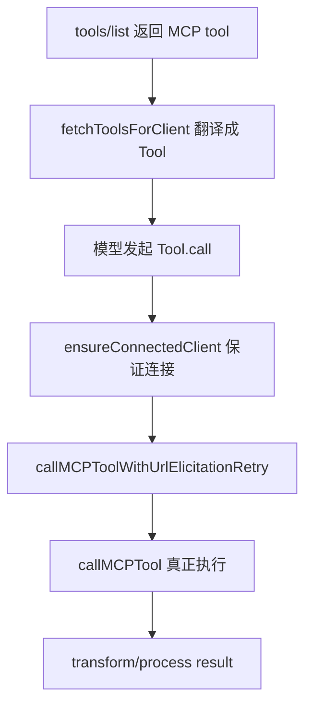
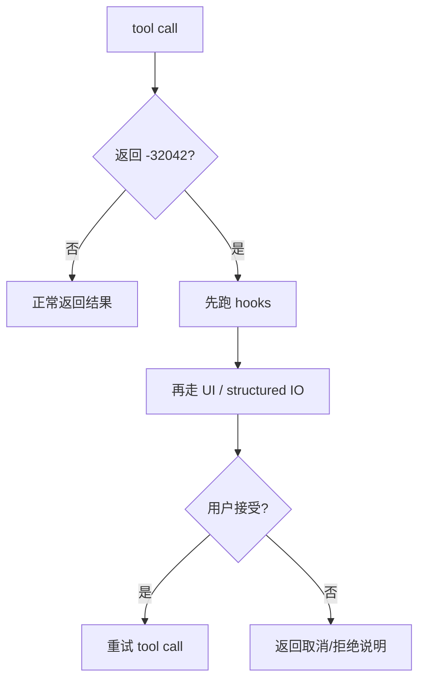
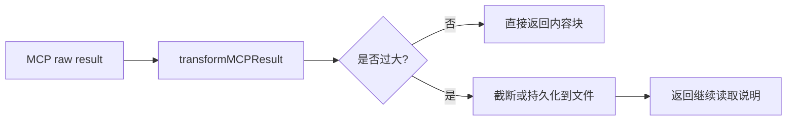

# Claude Code 源码共读笔记 65：MCPTool 调用链：外部 tool 是怎么被包装、调用、重试和治理结果的

## 这篇看什么

前一篇 MCP 入口篇，主要回答的是：

- MCP server 怎么进入 Claude Code runtime
- tools / prompts / resources 怎么被发现并接进系统

但那还只是“接进来”。

更关键的问题其实是：

> **一个外部 MCP tool，最后到底是怎么变成 Claude Code 里的一个可调用工具的？模型点下去以后，中间具体发生了什么？**

这次我主要顺着 `client.ts` 里的这条链看：

- `fetchToolsForClient(...)`
- `MCPTool.call(...)`（更准确说，是 `Tool` 对象上的 `call` 实现）
- `ensureConnectedClient(...)`
- `callMCPToolWithUrlElicitationRetry(...)`
- `callMCPTool(...)`
- `transformMCPResult(...)`
- `processMCPResult(...)`

看完之后，我现在最明确的判断是：

> **Claude Code 对 MCP tool 的处理，不是“把远程 RPC 暴露给模型”那么薄，而是做了一整条工具运行时包装链：先把 MCP tool 翻译成 Claude Code 的 `Tool` 对象，再把调用过程接进统一的权限、进度、重连、认证、输出治理和结果整形逻辑里。**

也就是说，MCPTool 真正重要的地方，不是“它能转发调用”，
而是：

> **它把外部工具纳入了 Claude Code 自己的 tool runtime。**

这篇就专门讲这条调用链。

---

## 先补一句：为什么 MCP 这里天然会长出认证、权限和状态机

你如果第一次看这条链，可能会本能地觉得：

- tool 不就是 tool 吗
- 为什么这里有 needs-auth、session expired、重连、URL elicitation、结果持久化这么多东西

但只要把 MCP 想清楚，这些东西其实都很自然。

因为 Claude Code 这里面对的，不是本地纯函数，
而是：

- 远程 SaaS
- 企业内网服务
- 带用户身份的外部数据面
- 会过期的授权会话
- 可能超长输出、可能带图像/音频、可能要求人类补一步 URL 打开的工具

所以问题从来不是：

- 模型能不能发起一次调用

而是：

> **模型发起的这次调用，是否有可用连接、是否有合法身份、是否能继续、结果是否能安全进入上下文。**

这就是为什么 MCP tool 一旦认真落地，几乎一定会长出：

- 认证状态
- 连接状态机
- 重试链
- 输出治理

Claude Code 不是多做了，
而是把这个现实正面接住了。

---

## 先给主结论

如果只先记一句话，我会留这个版本：

> **Claude Code 的 MCPTool 调用链，本质上是在把一次“外部协议调用”翻译成一次“内部受控工具执行”：先把 MCP tool 映射成 Claude Code 的 `Tool` 抽象，再通过 `ensureConnectedClient` 保证连接有效，通过 `callMCPToolWithUrlElicitationRetry` 处理人机补偿，通过 `callMCPTool` 处理超时、401、session 失效、进度与 telemetry，最后再由 `transformMCPResult` / `processMCPResult` 把结果压成 Claude Code 能安全消化的内容。**

再压缩一点，就是：

- **外部 tool 先被包装**
- **调用过程被治理**
- **结果再被整形和收口**

这就是这篇最该记住的主心骨。

---

## 先把总图立住：MCPTool 调用不是一步，而是 6 段

这张图很重要。

因为它能帮你把 MCP tool 的整个 runtime 过程一次性看清。

如果你只盯着 `client.callTool(...)` 那一行，
会很容易误以为这事只是个 SDK RPC wrapper。

但 Claude Code 实际做的是一条更长的链：

- 先把 tool 本体翻译进系统
- 再把调用前后的各种现实问题接住
- 最后把结果收成 Claude Code 能吃的东西

这才是它的平台化味道所在。

---

# 第一部分：`fetchToolsForClient(...)` 最关键的工作，不是“拉列表”，而是“把 MCP tool 编译成 Claude Code Tool”

如果说上一篇 `64` 重点是 MCP 入口，
那这篇真正的起点，其实是：

- `fetchToolsForClient(...)`

它当然表面上是在做：

- `tools/list`

但更重要的，是它拿到结果以后做的那一步：

> **把每个 MCP tool 映射成 Claude Code 自己的 `Tool` 对象。**

这一步特别关键。

因为 Claude Code 不是把 MCP 原始 tool 结构原封不动交给模型，
而是重新包了一层自己的语义壳。

映射后，每个工具会拥有这些信息：

- 统一的工具名
- input schema
- 只读 / 破坏性 / open-world 等性质
- 自动分类输入
- 权限检查逻辑
- 用户可见名字
- 真正的 `call(...)`

也就是说，`fetchToolsForClient(...)` 真正做的是：

> **把 MCP server 的 capability，编译进 Claude Code 的工具系统。**

这个词我觉得用“编译”挺合适。

因为这不是简单包装，
而是把外部能力翻译进内部抽象。

---

# 第二部分：tool name 被标准化成 `mcp__<server>__<tool>`，不是命名小事，而是 runtime 定位机制

这里最容易被低估的一个点，是命名。

Claude Code 会把 MCP tool 名字做成：

- `mcp__<server>__<tool>`

很多人第一次看会觉得这只是前缀规范。

我现在觉得不是。

它其实承担了几层作用：

## 1. 运行时唯一定位
不同 server 里可能有同名 tool，
加前缀后才能唯一定位。

## 2. 权限与规则系统的锚点
后面 `checkPermissions()` 给的建议规则，也是基于这个完整名字。

## 3. UI / telemetry / 调试一致性
只要看到名字，就知道它来自哪台 MCP server。

## 4. 把“来源”编码进 tool identity
Claude Code 关心的不只是“这是什么动作”，
还关心“这个动作来自哪里”。

所以这个命名不是 cosmetic，
而是：

> **把外部来源稳定地折进工具身份。**

这对于一个混合内建 tool 与外部 tool 的 runtime 特别重要。

---

# 第三部分：MCPTool 真正的价值，是把外部能力纳入 Claude Code 的工具分类体系

再往下一层看，Claude Code 给 MCP tool 补的那些函数特别值得注意：

- `isReadOnly()`
- `isDestructive()`
- `isOpenWorld()`
- `isConcurrencySafe()`
- `isSearchOrReadCommand()`
- `toAutoClassifierInput()`
- `checkPermissions()`
- `userFacingName()`

这些不是花哨的附加字段。

它们在说明一个更重要的架构判断：

> **Claude Code 不把 MCP tool 当黑箱 RPC，而是努力理解它在系统里属于哪种动作。**

比如：

## 只读 / destructive / open-world
这直接关系到：
- 安全感知
- 用户批准
- auto mode 决策
- tool collapse 行为

## concurrency-safe
这关系到：
- 能否并发调用
- 会不会造成状态竞争

## toAutoClassifierInput
这关系到：
- Claude Code 如何把一次工具调用编码给自动分类器

## userFacingName
这关系到：
- 用户最终看到的工具名是否清楚

这说明 Claude Code 不是只想“能调起来”，
而是想：

> **让外部工具进入同一套统一治理面。**

这就是它和很多“协议通了就算完”的实现最大的差别。

---

# 第四部分：`checkPermissions()` 这一段很值，因为它说明 MCP tool 也必须纳入统一权限入口

MCP tool 的 `checkPermissions()` 返回的是：

- `behavior: 'passthrough'`
- 一条 permission message
- 以及建议写入本地规则的 suggestion

这很值得注意。

因为它说明 Claude Code 没有为 MCP tool 另开一个完全独立的权限系统，
而是：

> **让外部工具也进入现有 tool permission 入口。**

这很成熟。

因为从 runtime 角度看，
内建工具和外部工具虽然来源不同，
但只要都属于“模型能触发的动作”，
就应该共享同一套：

- 规则入口
- 提示机制
- allowlist 语义
- 用户批准体验

所以这里的关键不是它权限判断多复杂，
而是它把 MCP tool 放进了统一闸门。

这一点特别重要。

---

# 第五部分：真正调用开始时，第一件事不是发请求，而是 `ensureConnectedClient(...)`

这一步我觉得非常值。

在 `call(...)` 里面，它不是直接：

- `client.callTool(...)`

而是先：

- `ensureConnectedClient(client)`

这背后的判断很成熟：

> **MCP client 引用存在，不等于当前连接还活着。**

因为连接对象可能经历这些状态变化：

- 已经断开
- session 过期
- cache 被清掉
- auth 状态变化
- transport 早就死掉，但调用点手里还有旧引用

所以 Claude Code 在真正发起 tool 调用前，
会先把这个引用重新校验成“现在可用的 connected client”。

这相当于在调用链前面加了一层：

> **连接有效性防线。**

这也是为什么我会说，Claude Code 这里不是薄封装。

它不信任“拿着一个 client 对象就说明万事 OK”。

---

# 第六部分：`callMCPToolWithUrlElicitationRetry(...)` 是这条链里最像“人机协作补偿层”的部分

这是我觉得整条调用链里最有意思的设计点之一。

Claude Code 明确处理了一种情况：

- MCP tool 返回 `UrlElicitationRequired`（错误码 `-32042`）

这意味着什么？

意味着这个 tool 不能只靠纯后台调用完成，
它需要用户补一个动作，通常是：

- 打开一个 URL
- 完成某个授权或确认步骤

Claude Code 对这件事的处理不是直接报错退出，
而是：

1. 识别这是 URL elicitation
2. 解析出一组 elicitation 请求
3. 先给 hooks 一个机会去自动处理
4. hooks 不处理，再交给 UI / structured IO
5. 用户 accept / decline / cancel 后，再决定是否重试 tool call

这说明 Claude Code 对 MCP tool 的理解非常现实：

> **有些外部动作不是单次 RPC，而是“工具调用 + 人类补一步”的组合流程。**

这个判断特别成熟。

因为一旦接真实外部系统，
这种半自动、半交互的动作是常态，不是例外。

所以 `callMCPToolWithUrlElicitationRetry(...)` 本质上是在做：

> **把协议级“需要人类介入”翻译成 Claude Code 自己的人机补偿流程。**

---

## 图 1：URL elicitation 其实是一条“调用中途的人机补偿支线” 

这张图很重要。

因为它能帮你理解 Claude Code 这里不是“单步调用”，
而是允许调用流程中途临时转入交互补偿分支。

---

# 第七部分：`callMCPTool(...)` 才是真正的执行核心，但它也不是裸 SDK 调用

到了 `callMCPTool(...)`，才真正走到最像“执行核心”的地方。

但即便这里，也不是简单地：

- `client.callTool(...)`
- return

中间还包了很多治理动作。

## 1. 工具级 timeout
它用：
- `Promise.race`
- 自己的 timeout promise

原因也写得很实在：

> SDK 自己的 timeout 在某些 transport 异常场景下不一定可靠。

这个处理非常工程化。

它不是迷信 SDK，
而是承认底层 transport 在真实世界里会有各种边缘故障。

---

## 2. 长时运行 progress logging
如果 tool 跑太久，会定期打日志：

- 还在跑
- 已经过了多久

这不是小事。

因为对远程 MCP tool 来说，
“慢”是常态之一。

所以 Claude Code 在这里其实是在补：

> **长调用可观测性。**

不然这类工具在 runtime 里会非常像“死掉了”。

---

## 3. SDK progress → Claude Code progress
`callTool(..., { onprogress })` 这段很值。

它会把 MCP SDK 里的进度事件，映射成 Claude Code 自己的：

- `mcp_progress`
- started / progress / completed / failed

也就是说，Claude Code 不只是要拿到结果，
还要把中间过程纳入自己统一的进度语义。

这让 UI 和 tool runtime 可以用统一方式理解外部工具运行状态。

---

# 第八部分：401、session expired、connection closed 这些错误，被 Claude Code 明确当成“连接状态迁移”而不是普通失败

这一段特别值得学。

在 `callMCPTool(...)` 里，Claude Code 会特别识别几类错误：

## 1. 401 / Unauthorized
会转成：
- `McpAuthError`

这意味着：
- 不是“这个工具坏了”
- 而是“这个 server 的授权状态已经失效”

## 2. session expired
如果遇到：
- 404 + `-32001`
- 或某些 HTTP transport 下的 `Connection closed`

它不会只报错，
而是：
- clear connection cache
- 抛 `McpSessionExpiredError`
- 让上层走重建连接 / retry

这背后有个非常成熟的设计判断：

> **这些错误不是一次调用失败，而是连接状态已经变了。**

这点很重要。

因为如果把这类错误当普通失败处理，
系统就只能停在“报错给用户”。

Claude Code 选的是更稳的路径：

> **把协议错误翻译成 runtime 状态迁移。**

这是平台化实现很典型的特征。

---

# 第九部分：上层 `call(...)` 对 `McpSessionExpiredError` 的 retry 很克制，只重试一次

我挺喜欢这个设计。

在 `call(...)` 里，如果遇到：

- `McpSessionExpiredError`

它会：
- 用 fresh client 再试一次
- 但 `MAX_SESSION_RETRIES = 1`

这很值。

因为它体现的不是“尽可能多试几次”，
而是：

> **在已知这是一类可恢复状态迁移时，做一次有意义的恢复性重试。**

这和很多系统那种“出错了就无脑重试三次”很不一样。

Claude Code 这里更像在说：

- 我知道问题在哪
- 我知道一次 reconnect 足够验证是否恢复
- 超过这个范围，再重试就是噪音

这是非常成熟的工程克制。

---

# 第十部分：结果返回前还有两层：`transformMCPResult(...)` 和 `processMCPResult(...)`

这一段是整条链里最像“结果治理层”的部分。

也是最容易被忽略的部分。

## 第一层：`transformMCPResult(...)`
它先解决的是：

> **MCP tool 返回的东西，到底怎么转成 Claude Code 认得的内容形态。**

它会处理几种主要情况：

- `toolResult`
- `structuredContent`
- `content[]`

然后再进一步把内容块转成 Claude API / Claude Code 能认的 block：

- text
- image
- audio
- resource
- resource_link

所以这一步其实是在做：

> **协议结果 → Claude 内容块**

不是简单 stringify。

---

## 第二层：`processMCPResult(...)`
这一步解决的是：

> **这个结果即便格式合法，是否还适合直接塞进当前上下文？**

如果太大，就进一步治理：

- 截断
- 或持久化到文件
- 给模型返回“去读文件”的说明

这说明 Claude Code 很清楚一个现实：

> **外部 tool 的结果合法，不代表它适合作为模型当前上下文的一部分。**

这是很成熟的第二层判断。

很多系统只做到“能转成字符串”，
Claude Code 明显更进一步，
在做：

- 结果可消费性治理

---

# 第十一部分：图片、音频、resource、二进制 blob 的处理，说明 Claude Code 不愿意把 MCP 结果粗暴扁平化

我觉得这一点很值。

它没有把所有东西都强行变成一段文本，
而是尽量保留结果的媒介属性：

## image
- 保留为 image block
- 必要时 resize / downsample

## audio
- 持久化后返回文件说明

## resource
- text 资源直接进文本
- blob 按图片/二进制分类处理

## resource_link
- 变成明确的 link 描述块

这说明 Claude Code 在处理 MCP 结果时的态度不是：

- “先都 stringify 了再说”

而是：

> **尽量保住结果的媒介语义，再决定怎么进入模型/用户视图。**

这很重要。

因为外部 tool 的结果天生就可能是多模态的。

如果全都扁平化成字符串，
后面很多信息会直接丢掉。

---

# 第十二部分：大输出持久化这段特别能体现 Claude Code 的现实主义

`processMCPResult(...)` 里我特别喜欢的一点，是对“大输出”的处理。

它不会硬把超大结果塞进模型上下文，
而是：

1. 判断 content 是否需要 truncation
2. 如果开了大输出文件特性，优先把结果存到文件
3. 再返回一段 instructions，告诉模型：
   - 结果在哪个文件
   - 格式是什么
   - 应该怎么继续读

这一步特别成熟。

因为它承认了一个现实：

> **MCP 的价值越大，它返回的结果就越可能大到不适合直接喂给模型。**

如果系统不承认这点，后面就会出现：

- 上下文被爆掉
- token 成本飙升
- 大段无意义结果淹没真正任务

Claude Code 在这里做的是：

> **把“大结果”从上下文负担，转成“可继续访问的外部工件”。**

这非常像成熟系统该有的处理方式。

---

## 图 2：MCP 结果不是“拿到就塞上下文”，中间还有一层结果治理

这张图建议记住。

它对应的是 Claude Code 对“tool result 可消费性”的第二层治理。

---

# 第十三部分：`McpToolCallError` 这类包装说明 Claude Code 很重视 telemetry-safe 的错误语义

还有一个很容易被忽略、但特别值的点：

它不会简单把底层异常原样往外抛。

你会看到它专门包：

- `McpAuthError`
- `McpSessionExpiredError`
- `McpToolCallError`
- `TelemetrySafeError`

这说明 Claude Code 在意的不只是：

- 出没出错

还在意：

> **这个错误在 runtime 里应该被理解成哪一类事件，以及它能不能安全进入 telemetry / 日志 / UI。**

这很成熟。

因为外部 tool 错误天然很杂。

如果你不先分类，
系统后面就会很难做：

- 自动恢复
- 状态迁移
- UI 提示
- 安全 telemetry

所以这里其实是在做：

> **错误语义归一化。**

---

# 第十四部分：我最想保住的一个判断——Claude Code 真正包的不是“协议调用”，而是“工具执行语义”

把整条链看完后，我现在最想保住的判断其实是这句：

> **Claude Code 并不是在给 MCP 加一个调用封装，而是在把外部协议调用重新铸造成自己的工具执行语义。**

为什么我会这么说？

因为它做的远不止：

- 发请求
- 拿结果

它实际上重新定义了这次动作：

- 它是谁（tool identity）
- 它属于什么风险类型（readOnly / destructive / openWorld）
- 它怎么被权限系统看到
- 它怎么被连接层保障
- 它怎么处理中途人类介入
- 它怎么处理中途 session 失效
- 它怎么表达 progress
- 它怎么把结果整形成 Claude 内容块
- 它怎么避免大输出冲爆上下文

也就是说，Claude Code 包的不是 RPC，
而是：

> **一次完整的“工具执行事件”。**

这就是为什么 MCP tool 到这里已经不像一个外部协议对象，
而更像 Claude Code 内部原生工具家族的一员。

---

# 术语补充 / 名词解释

## 1. MCPTool
这里不要只理解成“调用 MCP 的工具”。

更准确地说，是：

- **一个被 Claude Code runtime 重新包装后的外部工具壳**

## 2. URL elicitation
建议理解成：

- **工具执行中途要求用户补一个外部动作（通常是打开 URL）**

它不是普通报错，而是交互补偿请求。

## 3. `ensureConnectedClient`
建议理解成：

- **调用前的连接有效性防线**

拿着 client 引用不代表连接现在还活着。

## 4. `transformMCPResult`
建议理解成：

- **协议结果 → Claude 内容块**

## 5. `processMCPResult`
建议理解成：

- **结果治理层**

它关心的不是结果是否合法，而是结果是否适合直接进入当前上下文。

---

# 这一篇最想保住的判断

如果把整篇压成一句最关键的话，我会留：

> **Claude Code 对 MCP tool 的真正处理，不是“把远程调用暴露给模型”，而是把外部工具重新收编进自己的工具执行 runtime：工具先被翻译成统一 `Tool` 抽象，调用前先校验连接，调用中处理认证、session 失效、URL elicitation 和 progress，调用后再做结果整形与大输出治理，因此一个 MCP tool 最终表现得不像裸协议对象，而像 Claude Code 自己的受控工具。**

这句话里最重要的点有五个：

- 先翻译成 Tool 抽象
- 调用前先保连接有效
- 调用中承接认证/状态迁移/人机补偿
- 调用后做结果整形和治理
- 最终目标是把外部工具收编进统一 runtime

---

# 我现在对 Claude Code MCPTool 调用链的最短总结

如果只留一句最短的话，我会留：

> **Claude Code 的 MCPTool 调用链，本质上是在把外部协议调用收编成一次受控的内部工具执行。**

---

# 这篇最值得记住的几个判断

### 判断 1：`fetchToolsForClient(...)` 的核心不是拉列表，而是把 MCP tool 编译成 Claude Code 的 `Tool` 对象

### 判断 2：`mcp__<server>__<tool>` 不是命名细节，而是把来源编码进 tool identity，服务于权限、UI、调试和唯一定位

### 判断 3：MCP tool 被补上 readOnly / destructive / openWorld / classifier input / checkPermissions 等语义，说明 Claude Code 在主动理解“这个动作属于哪类工具”

### 判断 4：真正执行前先走 `ensureConnectedClient(...)`，说明 client 引用存在不等于连接仍然有效

### 判断 5：`callMCPToolWithUrlElicitationRetry(...)` 把协议级“需要人类补一步”的情况接进了 Claude Code 自己的人机补偿流程

### 判断 6：`callMCPTool(...)` 不是裸 SDK 调用，而是把 timeout、progress、401、session expired、telemetry-safe error 分类都包了进去

### 判断 7：401 和 session expired 被当成连接状态迁移，而不是普通失败，这让上层可以做有意义的恢复性重试

### 判断 8：`transformMCPResult(...)` + `processMCPResult(...)` 说明 Claude Code 对结果做了两层治理：先转成 Claude 可认内容，再判断是否适合进入当前上下文

### 判断 9：大输出持久化不是权宜之计，而是 Claude Code 对“外部结果可能远大于模型工作集”这个现实的正式回应

### 判断 10：MCP tool 到最后表现得不像裸协议对象，而像 Claude Code 内部原生工具家族的一员

---

# 下一步最顺怎么接

如果继续沿这条线往下写，我觉得最顺有两个方向。

## 方向 A：认证 / needs-auth / OAuth 这条线

也就是接：

- `auth.ts`
- `createMcpAuthTool(...)`
- `isMcpAuthCached(...)`
- `handleRemoteAuthFailure(...)`
- `checkAndRefreshOAuthTokenIfNeeded(...)`

这样可以把这篇里已经出现的：

- 401
- needs-auth
- auth cache
- re-authorization

单独讲透。

## 方向 B：权限 / allowlist / channelPermissions 这条线

也就是接：

- `checkPermissions()` 下游是怎么接进 Claude Code 权限系统的
- MCP tool 和普通 tool 的统一闸门在哪里
- external capability 为什么要加 channel allowlist

如果只选一个，我会更倾向 **方向 A**。

因为这篇已经反复碰到了：

- 401
- needs-auth
- session expired

下一篇直接把“为什么 MCP tool 天然会长出认证状态机”讲透，会最顺。