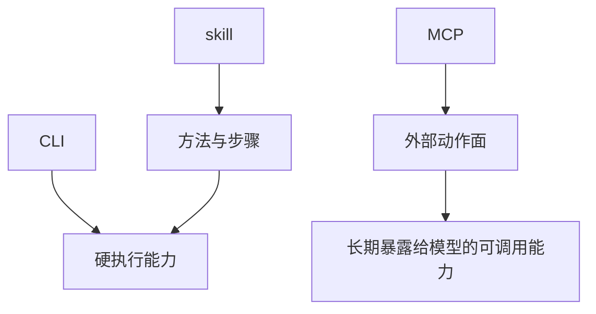
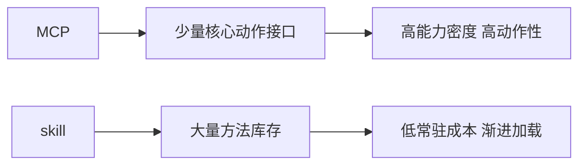
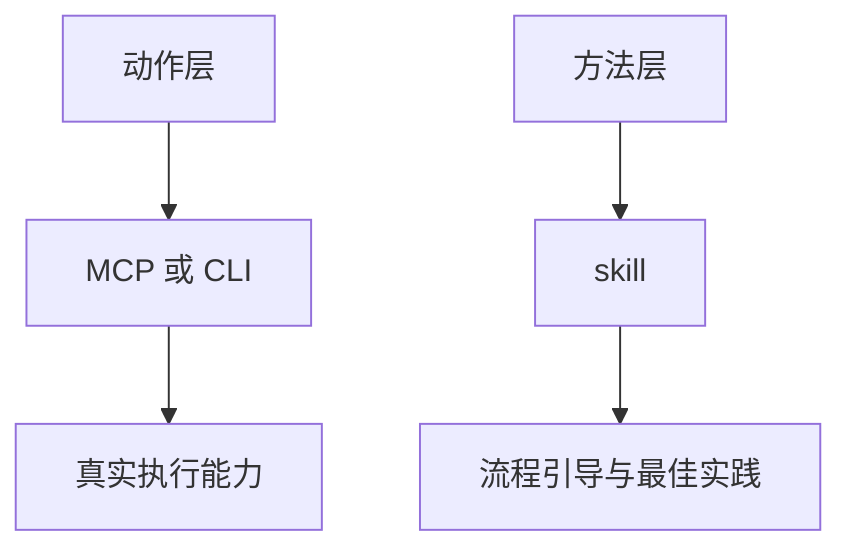

# Claude Code 源码共读笔记 66：为什么在 Claude Code 里，CLI + skill 往往比铺太多 MCP 更实用

## 这篇看什么

前面两篇 MCP 共读，已经把两件事讲清了：

- MCP server 是怎么接进 Claude Code runtime 的
- 一个 MCP tool 又是怎么被包装、调用、重试和治理结果的

按常理，读到这里，很多人自然会往前再推一步：

> **那是不是以后什么外部能力都应该优先做成 MCP？**

尤其是当你已经有一堆本地 CLI 时，这个问题会更尖锐。

比如：

- 已经有稳定的 `feishu-cli`
- agent 可以直接在本机 shell 里执行它
- 再加一个 skill 告诉 agent 怎么用这个 CLI

这时候还要不要专门再做一个 Feishu MCP server？

我现在的判断其实挺明确：

> **不一定，而且在很多真实使用场景里，`CLI + skill` 反而是比“铺很多 MCP”更实用、更省上下文、也更符合 Claude Code 当前 runtime 结构的方案。**

这篇就不再细拆某一个具体源码文件，
而是把前面几篇共读已经读出来的结构性结论收成一篇“架构判断篇”。

目标不是讲协议，
而是回答一个更现实的问题：

> **在 Claude Code 里，什么时候该用 MCP，什么时候该用 CLI + skill？为什么很多时候后者反而更划算？**

---

## 先给主结论

如果只先记一句话，我会留这个版本：

> **Claude Code 里的 MCP，更像“高能力密度、也高上下文占用的外部动作面”；skill 更像“常驻成本很低、按需渐进展开的方法模块”；而本地 CLI 恰好是一种非常适合被 skill 驱动的硬能力接口。所以在可信本机环境里，如果某个外部系统已经有稳定 CLI，很多时候用 `CLI + skill` 比专门把它再 MCP 化更划算。**

再压缩一点，就是：

- **MCP 适合少量核心、必须长期暴露的能力接口**
- **skill 适合大量方法层知识与流程引导**
- **CLI 很适合当 skill 背后的执行底座**

这句话就是这篇最该记住的主心骨。

---

## 先把总图立住：CLI、skill、MCP 三者不是互斥，而是不同层

这张图最重要的意义，是先把三者从“替代关系”纠正成“分层关系”。

很多人第一次比较 skill 和 MCP，容易陷入这种问题：

- 到底哪个更先进？
- 到底哪个应该取代哪个？

我现在越来越不愿意这么看。

更准确的说法应该是：

### CLI 是什么
- 一种硬能力接口
- 命令边界清楚
- 参数清楚
- 人和 agent 都能执行

### skill 是什么
- 一种方法层模块
- 告诉 agent 什么时候用什么能力、按什么步骤做

### MCP 是什么
- 一种把外部能力长期接进 runtime 的标准化动作面

所以正确问题不是：

- skill 和 MCP 谁取代谁

而是：

> **当前这个能力，更适合被放在哪一层。**

---

# 第一部分：为什么你会感觉“挂太多 MCP 会吃爆系统上下文”，而“挂很多 skill 却还好”

我觉得你观察到的这个现象非常真实，而且不是错觉。

它背后其实有明确的结构性原因。

## MCP 为什么重
一个 MCP server 一旦接进 runtime，通常不只是“有个配置”这么简单。

Claude Code 为了让模型能用它，往往要持续感知这些东西：

- server instructions
- tool 名字
- tool description
- input schema
- prompt / command 元数据
- resources 能力
- 认证状态
- 连接状态
- turn 间 refresh 的动态性

也就是说，MCP 进入的是：

> **当前可调用动作面。**

只要它进入当前动作面，模型就需要对它“有可见性”。

而这会天然吃掉：

- system/context budget
- tool 选择空间
- 动作决策注意力

所以一个 session 不能舒服地挂太多 MCP，
这不是实现失误，
而是 MCP 作为“活能力面”的自然代价。

---

## skill 为什么轻
skill 在 Claude Code 里的经济性，恰恰来自另一种策略：

> **先暴露轻量目录，再按需展开正文。**

也就是说，skill 默认常驻的往往只是：

- name
- description
- when_to_use

真正的正文、细步骤、长说明，通常等模型判断“现在值得加载”时才展开。

所以 skill 更像：

> **低常驻成本的潜在方法库存。**

这就是为什么一个 session 可以挂很多 skill，
但挂很多 MCP 往往会明显变钝。

前者主要是方法索引变厚，
后者则是动作面和工具面直接膨胀。

---

# 第二部分：MCP 吃掉的不只是 token，更是“动作选择空间”

我觉得这一点特别值得单独说。

很多人一说上下文成本，马上想到的是 token。

但 MCP 更大的代价，很多时候不只是 token，
而是：

> **模型的动作选择空间会膨胀。**

比如你挂 20 个 MCP server，
每个再带十几个工具。

问题就不只是：

- prompt 变长了

更是：

- 哪个 server 才是对的？
- 哪几个工具名字相近？
- 哪些能力重叠？
- 哪些看起来能做，但不该现在做？

这会直接增加 agent 的决策噪音。

也就是说，MCP 带来的负担往往是双重的：

- **上下文变重**
- **选择面变乱**

而 skill 通常没有这么强的副作用。

因为 skill 更多是在方法层帮助模型组织行为，
不会一下子把大量真实动作入口同时铺到眼前。

所以从 runtime 角度看：

> **MCP 的成本，不只是“描述它要花多少 token”，更是“让模型面对多少动作分叉”。**

这句我觉得非常关键。

---

# 第三部分：这就是为什么 MCP 更适合“少而硬”，skill 更适合“多而轻”

把上面两点合起来，结论就非常自然了。

## MCP 更适合什么
我会用一句话概括：

> **少而硬。**

也就是：

- 真正高价值
- 必须实时可调用
- 必须访问外部系统
- 必须带用户身份 / 权限
- 不能只靠本地文件和方法层解决

这种能力才值得长期占着动作面的位置。

---

## skill 更适合什么
我会用另一句话概括：

> **多而轻。**

也就是：

- 领域方法论
- 最佳实践
- 工作流约束
- 低成本长尾知识
- 各种“怎么做更稳”的操作套路

这些东西非常适合放在 skill 层，
因为它们不必一直高亮暴露给模型，
却能在需要时迅速被调出来。

所以如果你倒过来设计——
试图用大量 MCP 去覆盖所有领域能力——
很容易出现这种情况：

- tool 面炸开
- session 变钝
- 模型乱选工具
- 上下文预算持续被侵蚀

这其实不是一个好的长期形态。

---

## 图 1：MCP 与 skill 的结构性分工

这张图能帮你记住一个非常实用的判断：

> **MCP 该精选，skill 可以铺开。**

---

# 第四部分：为什么在很多真实场景里，CLI 恰好是比 MCP 更合适的能力底座

这时候就能回到你举的那个 Feishu 例子了。

如果一个外部系统已经有稳定 CLI，
那它其实天生就有几个非常大的优点：

## 1. 边界硬
- 子命令清楚
- 参数清楚
- 输入输出边界清楚

## 2. 容易调试
- agent 出错了，人可以手动复现
- stdout/stderr 好查
- 哪个参数错了一目了然

## 3. 行为稳定
- CLI 本身就是一层产品化接口
- 相比自己再包一层 server，通常更成熟

## 4. 对本机 agent 特别友好
- 不需要额外长连接状态
- 不需要额外 tool 列表长期暴露
- 不需要额外的 server lifecycle

所以在本机可信环境里，CLI 往往是非常好的“硬能力底座”。

它不像 MCP 那样要求你先把整个能力面接进 runtime，
而是：

> **需要时再执行一条具体命令。**

这点非常重要。

因为它把“能力存在”变成了“执行动作时才真正展开”，
而不是“从 session 一开始就常驻在动作面里”。

---

# 第五部分：CLI 的短板，正好是 skill 最擅长补的位置

当然，CLI 不是没有短板。

它的主要问题不是能力不够，
而是：

- 模型不一定天然会用好它
- 不一定知道哪些子命令最关键
- 不一定知道什么时候该先读后写
- 不一定知道怎么组织多步命令链
- 不一定知道哪些错误是正常可重试，哪些该停下来

而这恰恰是 skill 最擅长补的位置。

也就是说，skill 可以把下面这些东西固化下来：

- 什么时候该调用这个 CLI
- 哪些子命令最常用
- 哪些参数是高频核心参数
- 长任务时先做什么，再做什么
- 什么时候应该一次大写入，不要很多小写入
- 哪些错误属于认证问题，哪些属于输入问题

所以最顺的组合其实是：

> **CLI 提供硬执行能力，skill 提供使用方法和工作流约束。**

这个组合非常自然。

甚至可以说，它刚好补齐了两者各自的短板：

- CLI 解决“能做”
- skill 解决“怎么更稳地做”

---

# 第六部分：拿 Feishu 文档来举例，为什么 `feishu-cli + skill` 很可能就已经是最优解

假设你已经有一个稳定的：

- `feishu-cli`

而且 agent 已经能在本机 shell 中执行它。

那你真正需要的，很多时候不是再做一个 Feishu MCP server，
而是一个 skill 去告诉 agent：

- 修改已有文档时，先读取现状
- 如果只是补一段，优先局部 patch，不整篇覆盖
- 如果是长文更新，优先少量大块写入
- 避免逐条碎写
- 涉及表格/标题/列表时，优先保结构
- 导入 Markdown 时用哪条命令
- 更新现有 doc 时用哪种策略

这些东西都不是 MCP 天生提供的。

这些是：

> **工作方法。**

而 Feishu CLI 已经把“动作能力”提供好了：

- 导入文档
- 读取内容
- 更新块
- 创建文档
- 查询信息

这时候再加一个 skill，整个系统就会非常顺：

- 平时常驻成本低
- 需要时 skill 告诉 agent 怎么干
- 真正执行时走本地稳定 CLI
- 出错了人也能手动复现同一条命令

我现在会很明确地说：

> **对 Feishu 这类已有稳定 CLI、且主要由本机可信 agent 使用的能力，`CLI + skill` 经常比专门再做 MCP 更实用。**

---

# 第七部分：那什么时候还是应该做 MCP？

说到这里，也得补一个边界。

不然容易滑向另一个极端：

- “那就永远别做 MCP 了”

这当然也不对。

我现在会这样判断：

## 更适合做 MCP 的情况
满足越多，越应该考虑 MCP：

- 能力必须长期暴露给模型作为正式工具面
- 需要结构化 schema 和标准 tool 调用
- 需要跨不同 agent / runtime / 产品复用
- 需要 resources / prompts / auth / session 这类统一协议能力
- 不是给你本机一个 agent 用，而是要当成平台能力接入
- 需要让工具成为系统里的“一等能力节点”

这种时候，MCP 的标准化收益就非常高。

---

## 更适合做 CLI + skill 的情况
满足越多，越应该先走这条路：

- 已经有稳定 CLI
- 本机可信环境运行
- 人和 agent 都会直接用这套命令
- 更看重可调试、可复现、可人工接管
- 不需要把一大批动作长期暴露给模型
- 不需要复杂的远程连接生命周期
- 更像“执行工具”，而不是“平台能力节点”

这种情况下，再专门 MCP 化，很多时候不是提升，
而只是：

- 增加接入层复杂度
- 增加上下文成本
- 增加动作选择噪音

---

# 第八部分：所以最实用的产品判断不是“CLI 还是 MCP”，而是“动作层和方法层分别放哪”

我觉得整篇最值得收束成这句：

> **不要把问题问成“CLI 和 MCP 谁更先进”，而要问：这个能力的动作层该放哪里，这个能力的方法层该放哪里。**

一旦这么问，很多事情就顺了。

## 方案 1：MCP + skill
适合：
- 平台级能力
- 外部系统正式接入
- 需要长期暴露的工具面

## 方案 2：CLI + skill
适合：
- 本机可信环境
- 已有成熟 CLI
- 高频执行但不想长期膨胀动作面

## 方案 3：只有 skill
适合：
- 纯方法论
- 纯领域知识
- 不涉及外部实时动作

而这三种方案里，
我觉得最容易被低估、但在实际工作里非常高效的，恰恰是：

> **CLI + skill。**

因为它往往在复杂度、上下文成本、调试成本和执行稳定性之间，取得了一个很好的平衡。

---

## 图 2：最实用的判断不是“谁更高级”，而是“动作层和方法层怎么分布”

这张图可以帮助你在设计 agent 能力体系时少走很多弯路。

---

# 第九部分：我最想保住的一个判断——在 Claude Code 当前结构里，MCP 不该铺太多，skill 可以挂很多

把整篇收起来后，我现在最想保住的判断其实就是这句：

> **在 Claude Code 当前 runtime 结构里，MCP 更适合少量核心、精选接入的动作层，而 skill 更适合大规模挂载的方法层；如果某个外部系统已经有稳定 CLI，那么让 skill 去驱动 CLI，往往比把这套能力再 MCP 化更实用。**

为什么我会这么说？

因为前面几篇其实已经把这个结构性差异讲出来了：

- MCP 进入的是动态动作面
- 会长期占用系统上下文和选择空间
- skill 走的是渐进加载，常驻成本小很多
- CLI 能把真实执行动作保持在“需要时才展开”的状态

所以这不是个人偏好，
而是 Claude Code 当前架构下一个很自然的设计结论。

---

# 术语补充 / 名词解释

## 1. 动作层
这里建议理解成：

- **agent 真正能执行的能力接口层**

在这篇里，MCP 和 CLI 都可能扮演动作层。

## 2. 方法层
这里建议理解成：

- **告诉 agent 什么时候、按什么步骤、以什么策略使用动作层的那一层**

在这篇里，skill 主要就属于方法层。

## 3. 上下文占用
这里不要只理解成 token 长短。

更准确地说，是：

- **system/context budget + 模型动作选择空间 + runtime 常驻能力面的综合成本**

## 4. 渐进加载
这里指的是：

- **先暴露轻量目录，真正需要时再展开正文**

这正是 skill 在 Claude Code 里特别省预算的关键。

## 5. 能力节点
这里主要对应 MCP server。

意思是：

- **不是单个函数，而是一整个可向 runtime 贡献 tools / commands / resources 的能力源。**

---

# 这一篇最想保住的判断

如果把整篇压成一句最关键的话，我会留：

> **Claude Code 当前的能力结构，不适合把所有外部能力都铺成 MCP：MCP 是高能力密度、也高上下文开销的动作面，应该少量精选；skill 是低常驻成本、按需渐进展开的方法层，适合大规模挂载；而对于已经有稳定 CLI 的外部系统，让 skill 去驱动 CLI，往往能同时保住执行能力、上下文经济性和可调试性。**

这句话里最重要的点有五个：

- MCP 很强，但也很重
- skill 很轻，适合铺开
- CLI 可以成为很好的动作底座
- skill 最适合补 CLI 的方法层短板
- 设计问题不该问“谁更先进”，而该问“动作层和方法层怎么分布”

---

# 我现在对这个判断的最短总结

如果只留一句最短的话，我会留：

> **在 Claude Code 里，MCP 该精选，skill 可以铺开，而稳定 CLI 往往是最适合被 skill 驱动的动作底座。**

---

# 这篇最值得记住的几个判断

### 判断 1：MCP 吃掉的不只是 token，更是当前 runtime 的动作选择空间，因此不适合无上限铺开

### 判断 2：skill 的优势不只是“像提示词”，而是它依赖轻量目录 + 按需展开，常驻成本远低于 MCP

### 判断 3：CLI 的强项在于边界硬、可调试、可复现、可人工接管，这在本机可信 agent 场景里非常值钱

### 判断 4：CLI 的短板主要是“模型未必天然会用好”，而这正好是 skill 最擅长补的位置

### 判断 5：对已有稳定 CLI 的外部系统，`CLI + skill` 往往是比“再做一层 MCP”更高性价比的方案

### 判断 6：MCP 更适合少量核心、必须长期暴露给模型的高价值动作接口，而不是承载所有长尾领域能力

### 判断 7：真正成熟的能力体系设计，不是问 CLI、skill、MCP 谁更先进，而是问动作层和方法层分别放在哪一层

---

# 下一步最顺怎么接

如果继续沿这条线往下写，我觉得最顺有两个方向。

## 方向 A：回到 MCP 主线，继续写认证 / needs-auth / OAuth

也就是按原计划接：

- `auth.ts`
- `createMcpAuthTool(...)`
- `isMcpAuthCached(...)`
- `handleRemoteAuthFailure(...)`

这样能继续把 MCP 主线补完整。

## 方向 B：单独拉一条“Claude Code 能力分层”小支线

也就是把：

- tool
- skill
- command
- MCP
- CLI

放在一张更大的图里，讲清：

- 哪些是动作层
- 哪些是方法层
- 哪些是入口层
- 哪些是能力源

如果只选一个，我会更倾向 **方向 A**。

因为这篇已经把一个很重要的产品判断沉淀出来了，接下来回到 MCP 主线继续讲 auth，会更顺。