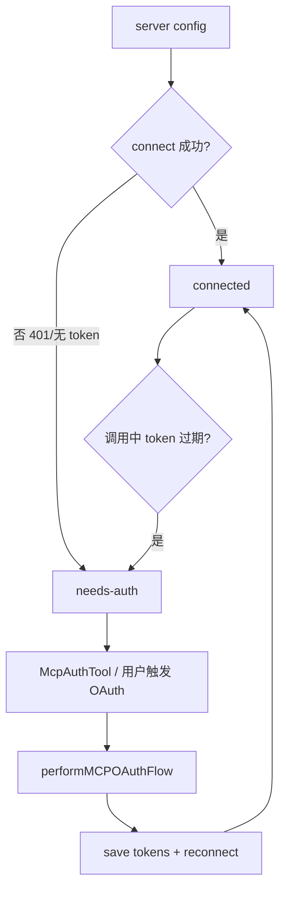
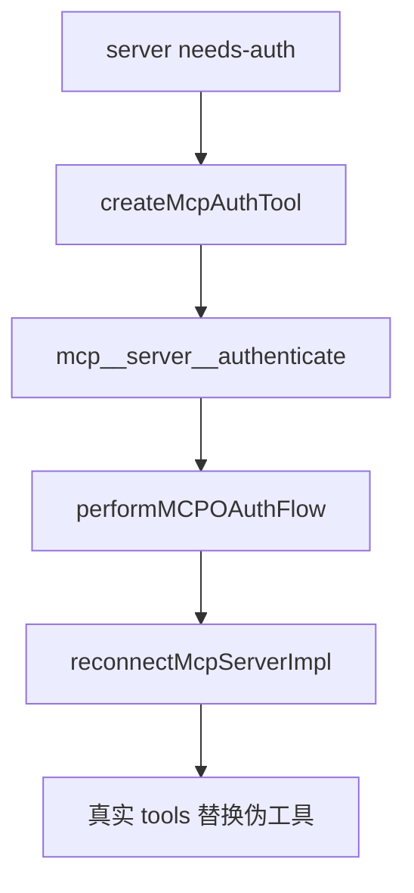

# Claude Code 源码共读笔记 67：MCP 认证状态机：为什么 needs-auth 不是补丁，而是正式能力层

## 这篇看什么

前两篇 MCP 共读，其实已经把一个现象反复碰到了：

- 有些 MCP server 明明已经配置好了
- 但连上时还是会掉进 `needs-auth`
- 连接成功后，中途又可能因为 401、session expired 再掉回去
- 而 Claude Code 不只是报错，它还会：
  - 缓存 needs-auth
  - 跳过未来一段时间的重连
  - 注入一个 `authenticate` 伪工具
  - 允许模型或用户重新拉起 OAuth flow

如果只从“工具调用”视角看，这会显得有点奇怪。

像是系统突然多长出了一套额外逻辑。

但这次把 `auth.ts`、`client.ts`、`McpAuthTool.ts`、`toolExecution.ts` 串起来以后，我现在的判断非常明确：

> **在 Claude Code 里，MCP 认证并不是外挂补丁，而是一条正式的状态机：它负责管理“这个外部能力节点当前能不能以合法身份进入 runtime”，并在连接失败、token 过期、scope 不够、用户取消、重新认证之间保持一个清楚的迁移路径。**

也就是说，`needs-auth` 不是错误文案，
而是：

> **MCP server 在 Claude Code runtime 里的一个正式状态。**

这篇就专门把这条线讲透。

---

## 先给主结论

如果只先记一句话，我会留这个版本：

> **Claude Code 对 MCP 的认证处理，本质上不是“遇到 401 再想办法”，而是在把 OAuth/授权问题纳入一条运行时状态机：连接层先判断 server 是 `connected`、`failed` 还是 `needs-auth`，token 层用 `ClaudeAuthProvider` 管 client info、tokens、refresh、step-up scope 和 discovery state，调用层再把 401/session-expired 翻译成状态迁移，最后用 `McpAuthTool` 把“重新认证”也收编成系统自己可见、可触发的一种能力。**

再压缩一点，就是：

- **needs-auth 是状态，不是提示词**
- **OAuth flow 是 runtime 的一部分，不是外部旁路**
- **重新认证也被包装成系统能力**

这就是这篇最该记住的主心骨。

---

## 先把总图立住：MCP 认证在 Claude Code 里是一条状态迁移链

这张图非常重要。

因为它把一个最关键的事实讲清了：

> **认证不是连接前的单次步骤，而是贯穿连接、调用、失效、恢复的一整条状态迁移链。**

如果你先接受这件事，后面的很多设计都会自然很多：

- 为什么 `types.ts` 里 `needs-auth` 是正式状态
- 为什么 `client.ts` 要做 needs-auth cache
- 为什么会凭空多出一个 `authenticate` 工具
- 为什么 `toolExecution.ts` 会在运行时把 connected client 打回 needs-auth

这些都不是零散 patch，
而是状态机的组成部分。

---

# 第一部分：`needs-auth` 从一开始就是类型系统里的正式状态，不是报错分支

这一点先讲很重要。

Claude Code 在 MCP 连接类型里，明确把状态拆成：

- `connected`
- `failed`
- `needs-auth`
- `pending`
- `disabled`

这其实已经说明很多事情了。

因为系统没有把授权问题揉进：

- `failed`

而是单独拉出：

- `needs-auth`

这背后的判断很成熟：

> **“连不上” 和 “还没拿到合法身份” 不是一回事。**

这点特别重要。

如果全都揉成 failed，会发生什么？

- 用户看不出该修网络还是该授权
- runtime 也没法有针对性地恢复
- model 只能看到一个模糊失败，而不知道“其实是缺认证，不是坏掉”

Claude Code 明显不接受这种含糊。

它在类型层先把这件事分清了：

> **授权未完成，是一种独立的可恢复状态。**

---

# 第二部分：`client.ts` 在连接阶段就把 needs-auth 当成一级分流，而不是等到调用时报错

这一点也非常关键。

在 `connectToServer(...)` 和批量装载那条线里，Claude Code 做了两层非常有意思的处理：

## 1. 远程连接一旦识别出 auth failure，直接走 `handleRemoteAuthFailure(...)`
这个函数会做几件事：

- 打 needs-auth analytics
- 写入本地 auth cache
- 返回 `{ type: 'needs-auth' }`

注意，它不是：

- 抛异常
- 等上层随便显示一个错误

而是：

> **把连接失败翻译成明确的 runtime 状态对象。**

这很值。

因为它说明 Claude Code 把“认证失败”从技术异常，提升成了系统语义。

---

## 2. 对最近 needs-auth 的 server，后面会直接跳过连接
`client.ts` 里还有一段很关键：

- `isMcpAuthCached(name)`
- `hasMcpDiscoveryButNoToken(name, config)`

如果命中，就：

- 不再真的去 probe
- 直接把这个 server 作为 `needs-auth`
- 顺手只挂一个 `createMcpAuthTool(...)`

这说明 Claude Code 很清楚一个现实：

> **有些 server 在用户重新授权之前，重复重连是没有意义的。**

如果不做这层，会怎样？

- 每次启动都打一轮无意义网络请求
- print mode 会等整批连接
- 用户反复看到失败噪音
- system/runtime 资源被白白消耗

所以 needs-auth cache 不是体验润色，
而是：

> **把“已知不可恢复”的连接尝试短路成一个稳定状态。**

这一点特别工程。

---

## 图 1：Claude Code 在连接阶段就把认证失败转成稳定状态，而不是一味重试

这张图对应的核心意思是：

> **needs-auth 是一种主动短路后的稳定状态，不是消极失败。**

---

# 第三部分：`ClaudeAuthProvider` 说明认证在 Claude Code 里并不是“拿个 token”，而是完整的会话状态管理

真正最关键的代码，其实在：

- `auth.ts`
- 尤其是 `ClaudeAuthProvider`

看完这个类，你会发现 Claude Code 这里处理的远不只是：

- access token

它实际上在管理一整组 OAuth 会话状态：

- client information
- client secret
- access token
- refresh token
- expiresAt
- scope
- discoveryState
- stepUpScope
- codeVerifier
- authorizationUrl
- refreshInProgress

这说明一个很重要的事实：

> **在 Claude Code 里，MCP 认证不是一个瞬时动作，而是一个持续维护的运行时子状态。**

这和我们前面讲 session 线时的感觉很像。

它不是“授权完了就没事”，
而是：

- 后面还要 refresh
- 还要 invalidation
- 还要 step-up
- 还要跨进程锁
- 还要重新发现 metadata

也就是说，它更像一个：

> **auth session**

而不是一个 token blob。

---

# 第四部分：`performMCPOAuthFlow(...)` 不是“弹个浏览器”而已，而是在把 OAuth 正式接进 Claude Code 会话流

很多人对 OAuth 的第一反应是：

- 打开浏览器
- 用户登录
- 回调回来
- 结束

Claude Code 当然也做这些，
但 `performMCPOAuthFlow(...)` 更值的地方在于：

> **它把 OAuth 从外部流程，正式接进了 Claude Code 自己的执行链。**

这里面至少做了这些事：

## 1. 清理旧 token / 复用 step-up scope 与 discoveryState
这说明认证不是每次从零开始。

## 2. 记录 flowAttemptId 与 analytics
说明这条链本身被当作系统正式流程观察。

## 3. 建 callback server / 校验 state / 处理 cancel / timeout
说明它认真处理的是：
- 用户取消
- 超时
- CSRF 防护
- 端口占用

## 4. 通过 `sdkAuth(...)` 驱动 OAuth 授权与 token 交换
说明它不是自己拍脑袋实现，而是把 SDK 能力收编进自己的流程。

## 5. 成功后 `saveTokens(...)`
把结果正式落进 secure storage

这些动作连起来看，真正发生的是：

> **OAuth flow 被做成了 Claude Code 自己 runtime 的一个可管理事件。**

这很重要。

因为它意味着认证不是“外面搞完再回来告诉我结果”，
而是 Claude Code 自己知道：

- 现在正在 auth
- auth 为什么失败
- auth 失败是用户取消、provider 拒绝、port 冲突还是 token exchange 失败

这就是完整系统和“浏览器脚本拼一下”的区别。

---

# 第五部分：step-up scope 这段特别值，因为它说明“认证成功”也不是绝对态，而可能继续升级

我觉得 `markStepUpPending(...)` 和相关注释特别有意思。

Claude Code 明确处理一种情况：

- 当前 token 不是完全没了
- 但 scope 不够
- server 返回 403 insufficient_scope

这时候系统做的不是：

- 盲目 refresh token

而是：

- 标记 step-up pending
- 暂时不再走 refresh token 路
- 强制落回授权 flow，要求 scope 升级

这背后有一个很成熟的判断：

> **refresh 可以延长旧授权，但不能凭空提升权限。**

所以 Claude Code 不是把认证看成二元状态：

- authenticated / unauthenticated

而是承认：

- 还可能出现“已认证但 scope 不够”的中间状态

这就是为什么我会说它是一条状态机，不是一块 token 布尔值。

---

# 第六部分：`refreshAuthorization(...)` 这一段说明 token refresh 在 Claude Code 里是正式维护链，不是顺手补救

`ClaudeAuthProvider.tokens()` 里有一个非常重要的行为：

- token 快过期（5 分钟内）就主动 refresh

而 `_doRefresh(...)` 里面又做了很多很成熟的事：

## 1. 跨进程 lockfile
这非常关键。

因为同一台机器上可能有多个 Claude Code 进程。
如果不加锁，就会同时 refresh，甚至互相覆盖。

## 2. refresh 前重新读 keychain
避免另一个进程刚刚已经成功刷新

## 3. metadata 发现复用
避免每次 refresh 都重新跑完整 discovery

## 4. 对 `invalid_grant` 的专门处理
说明 refresh token 自己也可能失效

## 5. 重试只对 timeout / transient server error 开启
说明它不是无脑重试，而是按错误类型做有意义恢复

这说明 Claude Code 在 refresh 这里处理的，不是“补救一下过期 token”，
而是：

> **一条正式的认证维护链。**

而这也是为什么前面 `needs-auth` 看起来不像补丁，
因为它后面站着的是一整套正式维护逻辑。

---

# 第七部分：`McpAuthTool` 这一招非常漂亮——它把“重新认证”也变成了 Claude Code 自己的 tool

这是我最喜欢的设计点之一。

当一个 server 处于 needs-auth 时，Claude Code 做的不是：

- 什么都不给模型
- 只在 UI 上写“请去手动登录”

而是：

> **注入一个伪工具：`mcp__<server>__authenticate`**

这个工具做的事情很明确：

- 调用 `performMCPOAuthFlow(...)`
- 拿到 auth URL
- 把 URL 告诉用户
- 后台继续等回调
- 一旦完成，再自动 `reconnectMcpServerImpl(...)`
- 用 prefix-based replacement 把原来的假工具替换成真实 tools

这个设计真的很值。

因为它说明 Claude Code 在做一件非常一致的事：

> **即使是“让外部能力重新可用”这件事，也尽量通过系统自己已有的工具机制来表达。**

这比“单独开个奇怪的 auth 面板”要统一得多。

也就是说，`needs-auth` 不是把这个 server 从系统里踢出去，
而是把它临时降级成：

- 一个只有 authenticate 能力的能力节点

等 auth 完成，再恢复成真正的完整能力节点。

这就是非常漂亮的 runtime 设计。

---

## 图 2：needs-auth 时，Claude Code 不是把 server 删除，而是给它换上一个 authenticate 伪工具

这张图其实能很好说明 Claude Code 的一致性：

> **认证恢复也走工具系统，而不是系统外旁路。**

---

# 第八部分：`toolExecution.ts` 里把运行中 401 重新打回 needs-auth，说明状态机会在调用期闭环

还有一个特别关键的闭环点，在：

- `toolExecution.ts`

如果某个 MCP tool 在运行时抛出：

- `McpAuthError`

Claude Code 就会：

- 找到对应 client
- 如果它原来是 `connected`
- 直接把它改回 `needs-auth`

这一步非常关键。

因为它说明认证状态机不是只发生在：

- 连接阶段

而是会延续到：

- 调用阶段

也就是说，server 不是“连上一次就永久 connected”。

它可以：

- connected
n→ 调用中 401
- 再回到 needs-auth
- 再通过 auth tool 或 UI 恢复
- 再 connected

这就是一条真正闭环的状态迁移链。

也是为什么我一直强调：

> **needs-auth 是状态，不是提示。**

---

# 第九部分：为什么 Claude Code 不直接把 OAuth 藏起来，而要把这么多 auth 细节显式化

这里我觉得有个更深的产品判断。

Claude Code 明显没有选择这种路子：

- “我们偷偷帮你刷新 token，一旦失败就泛化成 tool 错误”

它更倾向于：

- 显式区分 auth failure
- 显式给出 needs-auth
- 显式生成 auth tool
- 显式缓存不可恢复状态
- 显式记录 flow start/success/error

为什么？

我觉得因为 MCP 面对的外部世界太复杂了：

- SaaS OAuth
- enterprise IdP
- XAA
- token 过期
- step-up auth
- callback 超时
- 用户取消

如果都藏掉，表面简洁，
但 runtime 会非常不可解释。

Claude Code 选的是更工程化的路线：

> **把认证问题从“神秘失败”翻译成系统内可解释的状态与事件。**

这其实就是成熟系统的做法。

---

# 第十部分：我最想保住的一个判断——Claude Code 在 auth 这里管理的不是 token，而是“外部能力的可进入性”

把整篇收起来后，我现在最想保住的判断其实是这句：

> **Claude Code 在 MCP 认证这条线里真正管理的，不是 access token 本身，而是“这个外部能力节点当前是否有资格、以什么身份、以什么 scope 进入 runtime 并持续可用”。**

为什么我会这么说？

因为它做的已经远超“拿 token”了：

- 连接期把 401 翻成 needs-auth
- 用 cache 把不可恢复连接短路掉
- 用 OAuth flow 正式接住重新授权
- 用 step-up 处理 scope 升级
- 用 refresh 维护长期可用性
- 用 auth tool 把重新认证收编进工具系统
- 用 toolExecution 把运行期 401 再闭环回 needs-auth

这整套下来，你会发现它管的是：

> **外部能力能否继续被系统吸纳。**

这已经是平台能力管理，而不是 token 管理了。

---

# 术语补充 / 名词解释

## 1. needs-auth
这里不要理解成一条错误提示。

更准确地说，是：

- **MCP server 在 Claude Code runtime 里的正式状态之一**

意思是：这个 server 已存在，但当前缺少可用授权，暂时不能作为正常能力节点工作。

## 2. step-up auth
建议理解成：

- **不是完全没登录，而是当前 token 的 scope 不够，需要升级授权范围**

## 3. discoveryState
建议理解成：

- **OAuth server 发现结果的缓存状态**

它帮助 refresh 和后续 auth 避免每次重新做完整发现。

## 4. auth cache
这里主要指 `mcp-needs-auth-cache.json` 那条缓存。

建议理解成：

- **“这个 server 在用户重新授权前，不值得反复重连”的短期记忆**

## 5. McpAuthTool
建议理解成：

- **Claude Code 给 needs-auth server 临时注入的重新认证工具**

它不是普通业务工具，而是一个“恢复能力节点可用性”的系统工具。

---

# 这一篇最想保住的判断

如果把整篇压成一句最关键的话，我会留：

> **Claude Code 的 MCP 认证系统，本质上是一条正式的运行时状态机：它不只是存 token，而是在持续管理外部能力节点的可进入性——连接时识别 needs-auth，调用时把 401/expired session 翻译回状态迁移，用 `ClaudeAuthProvider` 维护 client/tokens/scope/discovery，用 `McpAuthTool` 把重新认证也收编进工具系统，因此认证在这里不是外部旁路，而是 MCP 能力层本身的一部分。**

这句话里最重要的点有五个：

- needs-auth 是正式状态
- auth 不是单次动作，而是持续维护链
- 401/expired 会触发状态迁移
- re-auth 也被做成系统工具
- Claude Code 真正管理的是外部能力的可进入性

---

# 我现在对 Claude Code MCP 认证线的最短总结

如果只留一句最短的话，我会留：

> **Claude Code 的 MCP 认证线，本质上是在把“外部能力能否以合法身份进入 runtime”做成一条正式状态机。**

---

# 这篇最值得记住的几个判断

### 判断 1：`needs-auth` 不是错误提示，而是 MCP server 的正式 runtime 状态

### 判断 2：Claude Code 在连接阶段就把 auth failure 翻成状态对象，并用 auth cache 主动短路无意义重连

### 判断 3：`ClaudeAuthProvider` 管的不是单个 token，而是一整组 OAuth 会话状态：client info、tokens、scope、discovery、step-up、refresh

### 判断 4：`performMCPOAuthFlow(...)` 不是“打开浏览器”而已，而是把 OAuth 正式接进 Claude Code 的执行链与观察链

### 判断 5：step-up scope 说明“已认证”不是绝对态，scope 不够时也会继续落回授权流

### 判断 6：refresh 链里有跨进程锁、metadata 复用、invalid_grant 分类和有限重试，说明 token 维护是正式维护链，不是顺手补救

### 判断 7：`McpAuthTool` 很关键，它把“重新认证”也收编成 Claude Code 自己的工具入口

### 判断 8：`toolExecution.ts` 会把运行时 401 从 connected 再打回 needs-auth，说明认证状态机会在调用期闭环

### 判断 9：Claude Code 真正管理的不是 token，而是外部能力节点当前能否继续被 runtime 吸纳与使用

---

# 下一步最顺怎么接

如果继续沿这条线往下写，我觉得最顺有两个方向。

## 方向 A：权限 / allowlist / channelPermissions 这条线

也就是接：

- MCP tool 的 `checkPermissions()` 下游怎么进入统一权限系统
- `channelPermissions.ts`
- `channelAllowlist.ts`
- 外部能力为什么还要再过一层安全边界

这样可以把 MCP 主线从：

- 接入
- 调用
- 认证

继续推进到：

- 约束

这会非常完整。

## 方向 B：单独拉一篇 XAA / enterprise auth 专题

也就是把：

- `oauth.xaa`
- IdP login
- token exchange
- 为什么它不是普通 OAuth consent flow

单独讲透。

如果只选一个，我会更倾向 **方向 A**。

因为 MCP 主线现在最自然的下一篇，就是：

> **外部能力已经进来了，也能 auth 了，那 Claude Code 下一步怎么把它管住？**