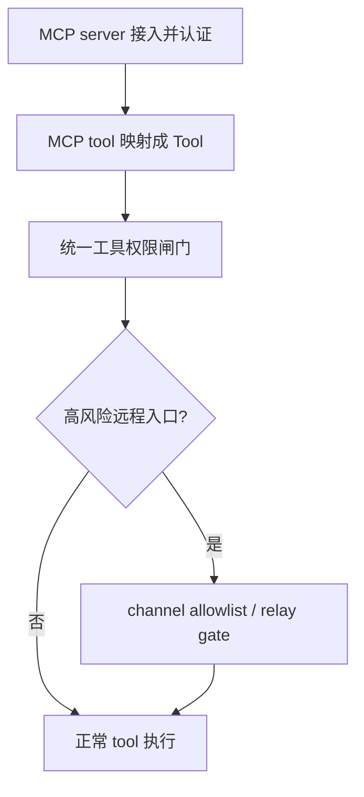
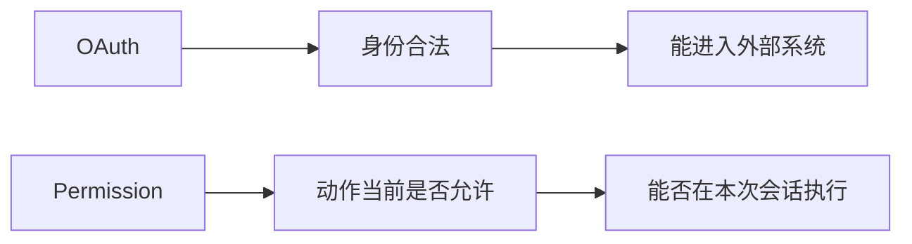
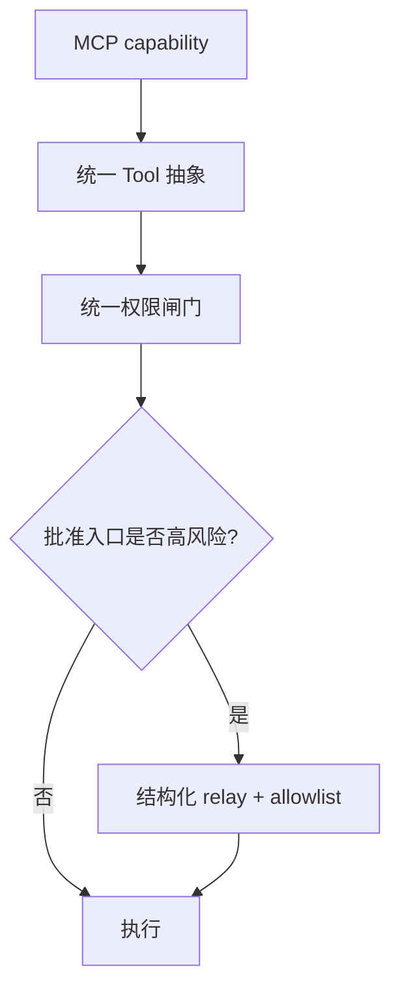

# Claude Code 源码共读笔记 68：MCP 权限边界：为什么外部能力进来以后，还要再过统一闸门

## 这篇看什么

MCP 这条主线到前一篇，其实已经走到一个很自然的问题了：

- 外部能力已经接进 runtime 了
- tool 也能正常调用了
- auth 也补上了

那是不是就意味着：

> **这些外部能力从此就和内建 tool 一样，模型想怎么调就怎么调？**

答案显然不是。

这次把 `MCPTool.ts`、`client.ts`、`permissions.ts`、`channelPermissions.ts`、`channelAllowlist.ts`、`useManageMCPConnections.ts` 串起来以后，我现在的判断很明确：

> **Claude Code 对 MCP 的安全处理，不是“先连上、能 auth 就行”，而是把外部能力放进了至少两层边界里：第一层是统一工具权限闸门，第二层是对 channel 这类远程入口再额外加 allowlist / relay 限制。**

也就是说，在 Claude Code 里，MCP 的真实路径不是：

- 接入 → 可用

而更像：

- 接入 → auth → 进入统一工具权限系统 → 某些入口再过额外信任边界

这篇就专门讲这个“为什么 auth 不等于可以随便用”的问题。

---

## 先给主结论

如果只先记一句话，我会留这个版本：

> **Claude Code 对 MCP 的权限设计，核心不是给外部工具另做一套孤立安全系统，而是先把它们收编进现有 tool permission 闸门，再对高风险入口（尤其 channel 远程批准）加第二层来源信任边界。因此 MCP 的安全性不是靠“这个 server 通过了 OAuth”来保证，而是靠“这个动作在当前 runtime 中是否被允许，以及这个批准信号来自哪个被信任的入口”共同决定。**

再压缩一点，就是：

- **OAuth 解决“你是谁”**
- **permission 解决“你现在能不能这么做”**
- **allowlist 解决“这个批准入口值不值得信”**

这就是这篇最该记住的主心骨。

---

## 先把总图立住：MCP 的安全边界在 Claude Code 里至少有两层

这张图很重要。

因为它能先打掉一个很常见的误解：

> **OAuth 完成 ≠ 这个工具可以随便用。**

OAuth 只说明：

- 这条外部能力链现在有合法身份

但后面还要继续回答：

- 这个具体动作现在该不该执行？
- 这个批准信号来自哪里？
- 这个入口本身值不值得信？

Claude Code 明显没有把这些问题混在一起。

它做的是分层边界。

---

# 第一部分：MCP tool 先被“收编成 Tool”，这一步本身就是权限设计的前提

这一点其实在 64 和 65 里已经埋下来了。

Claude Code 不是把 MCP tool 原样裸露给模型，
而是先在 `client.ts` 里把它映射成自己的 `Tool` 对象。

这一步看起来像抽象统一，
但它对权限系统还有个更深的意义：

> **只有先把外部能力翻译成系统内统一 Tool 抽象，后面的统一权限闸门才成立。**

否则会怎样？

- 内建 tool 一套权限逻辑
- MCP tool 一套权限逻辑
- channel/remote 特例再一套

最后一定会分裂。

Claude Code 显然知道这个坑，
所以它先把 MCP tool 做成真正的 `Tool`：

- 有统一 `name`
- 有统一 `checkPermissions()`
- 有统一 `userFacingName()`
- 有统一 `isReadOnly / isDestructive / isOpenWorld`

这意味着从 runtime 的权限视角看：

> **MCP tool 不再是“外部协议对象”，而是系统内部的一个标准动作。**

这正是后面统一权限闸门得以成立的前提。

---

# 第二部分：`MCPTool.ts` 默认就是 `passthrough`，说明 Claude Code 不想让 MCP 自己定义总权限逻辑

`src/tools/MCPTool/MCPTool.ts` 很短，但我觉得特别值。

它给 MCP 工具的默认 `checkPermissions()` 是：

- `behavior: 'passthrough'`
- message: `MCPTool requires permission.`

而 `client.ts` 里给具体每个 MCP tool 覆盖出来的 `checkPermissions()` 也基本是：

- `passthrough`
- 外加 rule suggestion

这背后的判断很关键：

> **Claude Code 不希望 MCP tool 自己成为最高权限判官。**

也就是说，MCP tool 本身当然可以提供：

- 它是不是 readOnly
- 它是不是 destructive
- 它是不是 openWorld

但真正的“现在该不该执行”，
Claude Code 更倾向于交给：

- 统一 permissions pipeline

这很成熟。

因为它避免了一个风险：

- 每类工具都自己实现一整套权限世界观

那样系统后面一定会碎。

Claude Code 选的是另一条路：

> **MCP tool 提供动作语义，统一 permissions 再决定当前行为。**

---

# 第三部分：`permissions.ts` 说明 Claude Code 真正的权限入口是“统一闸门”，不是 MCP 特例

看 `src/utils/permissions/permissions.ts` 这段就很清楚了。

它的权限判断顺序大致是：

1. 先看整个 tool 是否被 deny rule 拦掉
2. 再看整个 tool 是否有 ask rule
3. 再调用 `tool.checkPermissions(...)`
4. 再处理 deny / ask / safetyCheck 等更细的返回
5. 再进入后面的批准/交互流程

这条链最关键的地方是：

> **MCP tool 不是从旁边插进来，而是走和其他工具同一条大闸门。**

这很重要。

因为这意味着 Claude Code 的安全体系不是：

- “内建工具一个世界，MCP 另一个世界”

而是：

- “所有模型可触发动作都先过统一闸门，MCP 只是来源不同”

这其实是非常成熟的平台设计。

因为只要你的系统允许多种来源的能力：

- builtin
- MCP
- 也许未来还有别的 extension source

那最稳的做法一定是：

> **动作来源可以不同，但权限入口尽量统一。**

Claude Code 明显就是这样做的。

---

# 第四部分：MCP 的 `checkPermissions()` 最大的价值，不是直接决定 allow/deny，而是给统一权限系统提供语义与规则建议

这一点我觉得特别值得单独说。

在 `client.ts` 里，每个具体 MCP tool 的 `checkPermissions()` 返回大致是：

- `behavior: 'passthrough'`
- 一条 message
- `suggestions`：可以把这个 fully qualified tool name 写入 local rules

这说明 Claude Code 并不要求 MCP tool 自己给出所有最终裁决，
而是更强调它在权限系统里的两个作用：

## 1. 提供动作语义
比如：
- 这是哪个 tool
- 它完整名字是什么
- 它是 readOnly 还是 destructive

## 2. 提供规则锚点
也就是：
- 以后如果用户要允许/拒绝它，应该写哪条 rule

这很重要。

因为它说明 Claude Code 权限系统的目标不是：

- “每次都在运行时即兴判断”

而是：

> **把动作逐步沉淀成可复用规则。**

而 MCP fully-qualified tool name：

- `mcp__<server>__<tool>`

刚好就是这个规则系统的锚点。

所以这个命名和权限系统其实是紧密耦合的，
不是表面上的 UI 前缀而已。

---

# 第五部分：为什么 OAuth 不能替代 permission —— 因为“你是谁”和“你现在该不该做这个动作”不是一回事

这是整篇最核心的概念区分之一。

很多人第一次看 MCP + OAuth，会本能觉得：

- 既然用户都授权了
- 那这个外部 tool 不就该能用了？

Claude Code 的实现其实明确在说：

> **不够。**

因为 OAuth 回答的是：

- 当前连接以谁的身份访问这个外部系统

但 permission 还要回答的是：

- 当前这个具体动作，是否应该在这次会话、这次上下文、这条规则下执行

举个很直白的例子：

- 你已经 OAuth 登录 GitHub 了
- 并不意味着这次 agent 就该自动去改 issue、发评论、删 label

这就是为什么我会把它压成三句话：

- OAuth：**你是谁**
- permission：**你现在能不能这么做**
- allowlist：**这个批准入口值不值得信**

三者不是平替，
而是不同层级的问题。

Claude Code 之所以成熟，
恰恰是因为它没有把三者混成一个“用户都授权了就都行”的粗糙模型。

---

## 图 1：OAuth 和 permission 管的是两个不同问题

这张图建议记住。

因为很多系统一旦把这两件事混起来，
后面安全模型就会变得非常模糊。

---

# 第六部分：channelPermissions 这条线特别值，因为它说明 Claude Code 连“批准信号从哪来”都要再过一道边界

如果前面几层讲的是普通工具权限，
那 `channelPermissions.ts` 这条线讲的就是更深一层：

> **连“批准”这件事本身，Claude Code 也不把它当成天然可信。**

这里最关键的点是：

- permission prompt 可以通过渠道（Telegram / iMessage / Discord 等）转发给用户
- 用户在外部渠道回复 yes/no + request id
- 但 Claude Code 不会把普通文本直接当批准
- 它要求 channel server 显式发一个结构化事件：
  - `notifications/claude/channel/permission`
  - 带 `{request_id, behavior}`

这说明它在做一件非常清楚的事：

> **把“用户真的批准了”与“系统里出现一段看起来像批准的话”严格区分开。**

也就是说，权限回复不是文本语义判断，
而是：

- 结构化事件匹配
- pending map 中的 request id 命中
- first resolver wins

这其实是很硬的安全设计。

因为它避免了：

- 一般聊天文本误触发批准
- 模糊消息被当成 yes/no
- agent 自己生成一句像“yes abcde”就被系统误认

所以 `channelPermissions.ts` 这条线真正值的地方是：

> **Claude Code 甚至把“批准的传递路径”也做成了正式协议，而不是靠文本猜。**

---

# 第七部分：但仅有结构化事件还不够，所以还要有 channel allowlist

这里就要接到 `channelAllowlist.ts` 了。

这个文件本质上回答的是另一个问题：

> **就算某个 channel server 能发结构化 permission event，它本身配不配成为批准入口？**

Claude Code 的回答很明确：

- 不是谁都行
- 必须在 allowlist 里
- 而且是插件级 allowlist，不是任意 server 自报家门就行
- GrowthBook 开关还能整体开/关

这背后其实是个非常成熟的现实判断：

> **结构化协议能防误触发，但不能防“入口本身就是恶意的”。**

也就是说，
即使某个 channel server 很规范，
会发正确的结构化事件，
如果它本身来源不可信，
那它仍然可能伪造“用户批准了”。

所以 Claude Code 还要再补一层：

- allowlist 只允许被信任的 marketplace/plugin 组合进入这条批准链

这就是第二层信任边界。

我觉得这点特别值。

因为它说明 Claude Code 的安全设计不是停在：

- “消息格式对就行”

而是继续追问：

- “这个发消息的人值不值得信？”

---

# 第八部分：`useManageMCPConnections.ts` 把 channel gate 真正接进运行时，说明这不是静态配置，而是 live gate

`useManageMCPConnections.ts` 很值得看，
因为它把前面那两个看起来像“政策文件”的东西真正接进了 runtime：

- `gateChannelServer`
- `findChannelEntry`
- `createChannelPermissionCallbacks`
- `isChannelPermissionRelayEnabled()`

这说明 channel allowlist / permission relay 不是离线策略说明，
而是会在当前 session 里真的影响：

- 哪些 channel server 能注册
- 哪些 permission 回复会被接受
- 哪些入口在本次会话根本不会生效

这很关键。

因为它再次说明 Claude Code 在安全这里不是：

- “写个文档提醒一下用户”

而是：

> **把信任边界做成运行时真实 gate。**

这点和前面 MCP auth 那条线是一致的。

Claude Code 很少只停在“概念上区分”，
它更喜欢把区分真正做成 runtime 状态或 runtime gate。

---

# 第九部分：所以 Claude Code 的 MCP 权限，不是一道门，而是“统一动作闸门 + 高风险入口加闸”

把前面几部分收起来，结构就很清楚了。

我现在更愿意把 Claude Code 的 MCP 权限理解成两层：

## 第一层：统一动作闸门
也就是：
- MCP tool 先变成标准 `Tool`
- 走统一 `permissions.ts`
- 规则、ask、deny、safetyCheck 都在这层处理

## 第二层：高风险入口加闸
也就是：
- 像 channel permission relay 这种远程批准入口
- 还要再过结构化事件 + allowlist + feature gate

这意味着 Claude Code 对外部能力不是“信一次就全信”，
而是：

> **能力来源、动作执行、批准来源，分别过边界。**

这就是很成熟的安全分层。

也是为什么我觉得这一篇应该作为 MCP 主线的最后一篇：

- 64：怎么接进来
- 65：怎么调用
- 67：怎么认证
- 68：怎么被管住

到这里，MCP 这条主线就算闭环了。

---

## 图 2：Claude Code 对 MCP 的约束，不是一道门，而是分层边界

这张图我建议作为 MCP 主线最后一张图记住。

---

# 第十部分：我最想保住的一个判断——Claude Code 真正保护的不是“tool 有没有权限”，而是“动作链条的每个关键来源是否可信”

把整篇收起来后，我现在最想保住的判断其实是这句：

> **Claude Code 对 MCP 的权限设计，真正保护的不是某个 tool 名字本身，而是整条动作链：外部能力先被收编成统一 Tool，具体动作再过统一 permission 闸门，而像远程批准这种高风险来源，还要再过 allowlist 和结构化 relay 校验。它在保护的是整条动作链上每一个关键来源是否可信。**

为什么我会这么说？

因为你会发现，它每一层都在问“来源”问题：

- 这个能力来源于哪个 server？
- 这个动作对应哪个 fully-qualified tool？
- 这个规则锚点指向哪个精确动作？
- 这个批准信号来自哪个 channel server？
- 这个 channel server 是否在 allowlist？

这已经不是简单“这个工具能不能用”的问题了。

而是：

> **整条从能力来源到批准来源的信任链是否成立。**

我觉得这就是 Claude Code 在 MCP 安全边界上最成熟的地方。

---

# 术语补充 / 名词解释

## 1. unified permission gate / 统一权限闸门
这里主要指 `permissions.ts` 那条主链。

意思是：

- **不管动作来自 builtin 还是 MCP，先走同一条权限入口。**

## 2. passthrough
这里不要理解成“直接放行”。

更准确地说，是：

- **当前这个 tool 自己不在这里做最终裁决，而是把决定权继续交给统一权限系统。**

## 3. fully-qualified tool name
这里对 MCP 来说，通常是：

- `mcp__<server>__<tool>`

它不只是命名规范，还是规则锚点和权限识别锚点。

## 4. permission relay
这里指的是：

- **把权限提示转发到外部渠道，再把用户回复结构化地带回 Claude Code。**

## 5. channel allowlist
这里建议理解成：

- **不是所有能发 permission event 的 channel server 都自动可信，只有被批准的 plugin/marketplace 组合才能成为正式批准入口。**

---

# 这一篇最想保住的判断

如果把整篇压成一句最关键的话，我会留：

> **Claude Code 的 MCP 权限边界，不是“OAuth 过了就能用”，而是分层建立的：先把外部能力收编成统一 Tool，再经过统一 permissions 闸门决定当前动作是否允许，而像 channel 这种远程批准入口还要再经过结构化 relay 与 allowlist 校验。它真正保护的是从能力来源到批准来源的整条信任链。**

这句话里最重要的点有五个：

- OAuth 不等于动作许可
- MCP tool 必须先进统一 Tool 抽象
- 权限入口尽量统一，不做 MCP 特例世界
- 远程批准入口还要再过一层来源信任边界
- Claude Code 管的是整条动作链的可信性

---

# 我现在对 Claude Code MCP 权限线的最短总结

如果只留一句最短的话，我会留：

> **Claude Code 的 MCP 权限线，本质上是在用统一动作闸门加多层来源边界，去约束外部能力如何进入并执行。**

---

# 这篇最值得记住的几个判断

### 判断 1：MCP tool 能进入 runtime，不代表就可以直接执行；auth 解决的是身份，permission 解决的是当前动作许可

### 判断 2：Claude Code 先把 MCP tool 收编成统一 `Tool` 抽象，这一步本身就是统一权限系统得以成立的前提

### 判断 3：MCP 的 `checkPermissions()` 多数时候返回 `passthrough`，说明 Claude Code 不想让外部工具自己掌管最高权限裁决

### 判断 4：真正的权限主入口在 `permissions.ts`，MCP tool 和其他 tool 共享同一条闸门，这比做一套 MCP 特例权限系统成熟得多

### 判断 5：fully-qualified MCP tool name 不只是命名规范，更是本地规则系统的精确锚点

### 判断 6：channel permission relay 说明 Claude Code 连“批准信号”本身都不把它当普通文本，而是要求结构化事件匹配 pending request

### 判断 7：channel allowlist 说明仅有结构化协议还不够，批准入口本身还要有来源信任边界

### 判断 8：Claude Code 真正保护的不是单个 tool，而是从能力来源到批准来源的整条信任链

---

# 下一步最顺怎么接

MCP 主线到这篇我觉得已经可以正式收尾了。

如果后面还想继续，不建议再叫“MCP 主线”，而更适合作为专题支线。

## 方向 A：做一篇 MCP 主线收口总图

把这几篇并成一张大图：

- 64 接入
- 65 调用
- 67 认证
- 68 权限边界

然后给出：

- MCP server
- MCP tool
- auth
- permission
- runtime

之间的总关系。

## 方向 B：切去下一个主题

按照我们前面的优先级，我会建议切到：

- hooks 系统
n或者
- plugin 系统

如果只选一个，我会更倾向 **方向 A**。

因为这条线现在已经很完整了，再补一篇总收口，后面转题会更顺。