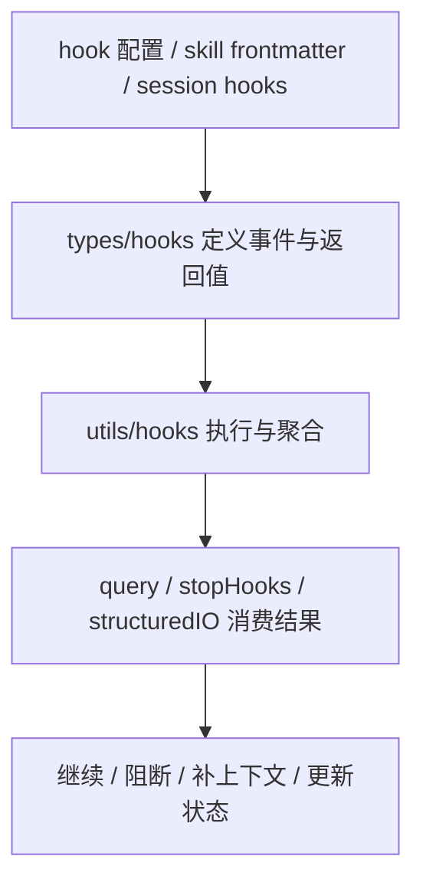
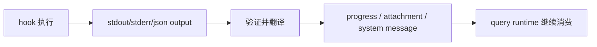
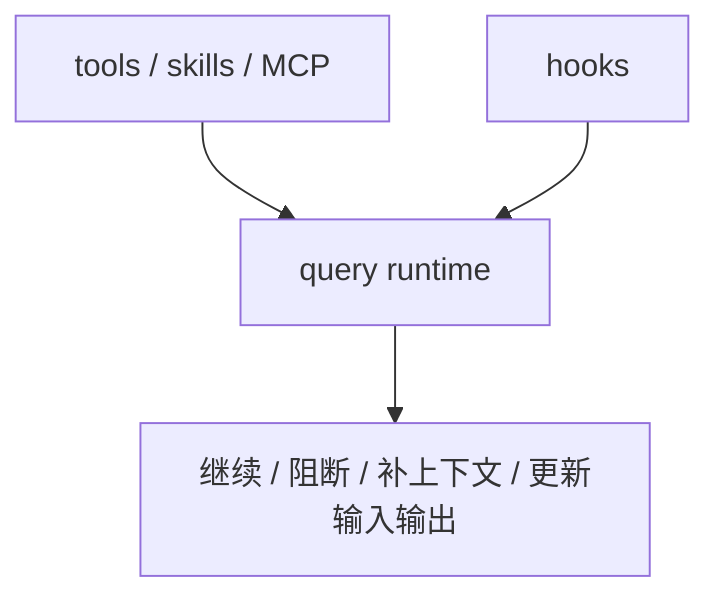

# Claude Code 源码共读笔记 69：hooks 总入口：Claude Code 是怎么把 hook 接进 runtime 的

## 这篇看什么

MCP 主线刚收完，下一条我觉得最值得接的，就是 hooks。

因为前面 MCP 那几篇，讲清的是：

- 外部能力怎么接进 runtime
- tool 怎么被调用
- auth 怎么做成状态机
- permission 怎么做成统一闸门

但 Claude Code 里还有一条同样很关键的线：

> **很多动作不是模型自己临场决定的，而是被某些“运行时插入点”系统性改写、阻断、补充、继续推进。**

这条线的名字就是：

- hooks

我这次没有按最开始猜的 `src/hooks/*` 去找，
因为真实入口并不在那里。

真正更关键的入口是：

- `src/types/hooks.ts`
- `src/utils/hooks.ts`
- `src/utils/hooks/postSamplingHooks.ts`
- `src/query/stopHooks.ts`
- `src/query.ts`

看完这条线以后，我现在最明确的判断是：

> **Claude Code 的 hooks 不是“给用户加点自动化脚本”的附属功能，而是一套正式接进 runtime 的编排层：它定义哪些生命周期事件可以被拦截、增强、阻断或补上下文，并且把这些外部/用户自定义逻辑收编成 query 主循环的一部分。**

也就是说，hooks 在 Claude Code 里并不只是扩展点，
更像：

> **运行时编排骨架的一部分。**

这篇先不细拆某一个具体 hook，
而是先回答总问题：

> **Claude Code 到底是怎么把 hook 接进 runtime 的？它在架构里属于哪一层？**

---

## 先给主结论

如果只先记一句话，我会留这个版本：

> **Claude Code 的 hooks，本质上是一套“事件驱动的运行时编排层”：`types/hooks.ts` 先把可插入的事件、输入、输出和结果语义严格类型化，`utils/hooks.ts` 负责把用户/插件/skill/会话派生出来的 hook 配置真正执行起来，而 `query.ts`、`stopHooks.ts`、`postSamplingHooks.ts` 再把这些 hook 接到主循环、停机点、工具链和补偿逻辑上，因此 hook 在这里不是外围脚本，而是对 query runtime 的正式干预接口。**

再压缩一点，就是：

- **types 定义插口**
- **utils 执行 hook**
- **query/runtime 消费 hook 结果**

这句话就是这篇最该记住的主心骨。

---

## 先把总图立住：Claude Code 的 hooks 不是一个文件，而是一条 runtime 链

这张图很重要。

因为它先打掉了一个最容易产生的误解：

> **hooks 不是“某个地方调用 shell 脚本”这么简单。**

它真正存在的是一条链：

1. 先定义哪些事件点允许被插入
2. 再定义 hook 可以返回什么语义
3. 再决定这些语义如何回流到 runtime
4. 最终影响主循环和工具执行

也就是说，hooks 不是小功能，
而是一条完整的运行时机制。

---

# 第一部分：`types/hooks.ts` 最重要的作用，不是声明类型，而是给 hook 立“合法干预边界”

我觉得 hooks 最好的第一站不是执行器，
而是：

- `src/types/hooks.ts`

因为看完它以后，你会立刻知道 Claude Code 对 hooks 的基本态度不是：

- “用户写个脚本，随便输出点东西”

而是：

> **hook 能干什么、在哪些事件点干、返回什么形状，都是被显式收口的。**

这个文件最值的地方有两个：

## 1. 先把 event space 收得很清楚
这里至少能看到这些事件：

- `PreToolUse`
- `PostToolUse`
- `PostToolUseFailure`
- `UserPromptSubmit`
- `SessionStart`
- `Setup`
- `SubagentStart`
- `PermissionDenied`
- `PermissionRequest`
- `Notification`
- `Elicitation`
- `ElicitationResult`
- `CwdChanged`
- `FileChanged`
- `WorktreeCreate`
- 以及 stop / compact 相关链路在别处的消费

这个枚举很重要。

因为它说明 Claude Code 对 hooks 的理解不是：

- 给几个工具前后插脚本

而是：

> **从工具执行到会话生命周期，再到交互补偿和环境变化，都可以是 hook 事件点。**

这已经不是“工具钩子系统”了，
而是更完整的 runtime hooks 系统。

---

## 2. 再把 output semantics 收得很清楚
`syncHookResponseSchema` / `hookJSONOutputSchema` 很关键。

因为它定义了 hook 可以合法返回什么：

- `continue`
- `suppressOutput`
- `stopReason`
- `decision`
- `reason`
- `systemMessage`
- 以及最关键的：`hookSpecificOutput`

这里最值的是 `hookSpecificOutput`。

Claude Code 没让所有 hook 都返回一坨松散 JSON，
而是按事件类型收成专门语义，比如：

### PreToolUse
- `permissionDecision`
- `permissionDecisionReason`
- `updatedInput`
- `additionalContext`

### SessionStart
- `additionalContext`
- `initialUserMessage`
- `watchPaths`

### PostToolUse
- `additionalContext`
- `updatedMCPToolOutput`

### PermissionRequest
- allow/deny 决策
- updated permissions

也就是说，Claude Code 对 hook 的看法是：

> **不是“你运行个脚本告诉我点文本”，而是“你在某个正式事件点上，按这个事件允许的语义对 runtime 产生影响”。**

这很成熟。

因为它极大降低了 hook 机制变成混沌脚本系统的风险。

---

# 第二部分：`utils/hooks.ts` 真正干的不是“执行脚本”，而是把 hook 变成受控 runtime 事件处理器

如果说 `types/hooks.ts` 是边界定义层，
那：

- `src/utils/hooks.ts`

就是正式执行层。

这个文件很大，但我现在觉得最值得抓住的是一句话：

> **它不是在“调用几个 hook”，而是在把 hook 变成 Claude Code runtime 里的受控事件处理器。**

为什么这么说？

因为它干的事远不止 `spawn(command)`：

- 组织 hook 输入（session_id / transcript_path / cwd / permission_mode / agent_id ...）
- 处理 trust gate
- 处理不同 hook source（settings / skill / plugin / session-derived / callback）
- 处理 shell / prompt / agent / http / callback 等不同 hook 执行形态
- 处理 sync / async hook
- 处理 timeout
- 处理 progress message
- 处理 blocking / non-blocking / cancelled / retry
- 聚合 hook 结果并翻译回系统消息/attachment/progress

这意味着 `utils/hooks.ts` 本质上是在做：

> **一个 hook runtime。**

这点非常重要。

因为很多系统里的 hook 只是“命令回调”。

Claude Code 明显不是。

它做的是更完整的：

- 输入标准化
- 执行编排
- 输出语义验证
- 生命周期管理
- 结果回流

所以我会说，这一层已经接近“hook engine”了。

---

# 第三部分：workspace trust 这一层特别值，因为它说明 Claude Code 连 hook 能不能执行都不默认放开

`shouldSkipHookDueToTrust()` 这一小段我觉得特别值。

它的态度非常明确：

> **在 interactive mode 下，所有 hooks 都要求 workspace trust。**

而且注释写得非常坦白：

- 这是 defense-in-depth
- 不只是防当前主流程
- 也是防未来某个路径不小心在 trust 前触发 hook

这说明 Claude Code 非常清楚：

> **hooks 的危险度，本质上等于“允许工作区里的配置在 agent runtime 的关键事件点执行任意命令”。**

所以 trust gate 不是小修小补，
而是 hooks 真正进入 runtime 的第一道门。

这点特别重要。

因为它再次说明 hooks 在 Claude Code 里的级别很高，
高到必须先经过 workspace trust 才允许介入。

---

# 第四部分：hook 输入不是随便拼的日志，而是正式的 runtime snapshot

`createBaseHookInput(...)` 这段很值得记。

Claude Code 会给 hook 输入这些核心字段：

- `session_id`
- `transcript_path`
- `cwd`
- `permission_mode`
- `agent_id`
- `agent_type`

以及各事件自己的 event-specific input。

这说明 hook 收到的不是“人类聊天上下文摘录”，
而是：

> **一份正式 runtime snapshot。**

这很关键。

因为它说明 Claude Code 期待 hook 干的事情，不只是“打印个日志”，
而是：

- 结合 session 身份
- 结合 agent 类型
- 结合工作区路径
- 结合 transcript 位置
- 对当前运行状态作出真实干预

所以从输入层就能看出来：

> **hook 在 Claude Code 里是面向 runtime 的，不是面向 UI 的。**

---

# 第五部分：hook 结果不是旁路消息，而是会重新进入 message / attachment / progress 体系

这一点特别关键。

Claude Code 执行完 hook 后，不是简单把 stdout 打到终端。

它会把 hook 结果重新翻译成系统里的正式消息对象，比如：

- `progress`
- `attachment`
- `system message`
- `hook_success`
- `hook_non_blocking_error`
- `hook_error_during_execution`
- `hook_stopped_continuation`

这意味着什么？

意味着 hook 的输出不是在系统外面漂着，
而是：

> **重新进入 Claude Code 自己的消息和事件系统。**

这点很重要。

因为只有这样，hook 才能真正影响：

- transcript
- summary
- query 决策
- UI 呈现
- stop/retry/abort 行为

也正因为如此，hooks 才不是旁路脚本，
而是 query runtime 的正式组成部分。

---

## 图 1：hook 不是执行完就散掉，而是回流进 Claude Code 自己的消息系统

这张图建议记住。

它能帮你建立一个非常关键的感觉：

> **hook 的影响不是“外部副作用”而已，而是被系统重新吸收。**

---

# 第六部分：`postSamplingHooks.ts` 很值，因为它说明并不是所有 hooks 都来自 settings.json

这一点很容易被忽略。

`postSamplingHooks.ts` 明确展示了另一种 hooks：

- 程序内注册的 internal REPL hook
- 不一定走 settings
- 但同样在 query 关键节点执行

这特别重要。

因为它说明 Claude Code 的 hooks 不是狭义上的：

- 用户配置的 shell hooks

而是更广义的：

> **运行时在某些正式事件点允许插入处理逻辑。**

也就是说，Claude Code 的 hook 概念其实有两层：

## 狭义 hook
- settings.json / skill frontmatter / plugin 提供的 hook 配置

## 广义 hook
- runtime programmatic hook
- 比如 post-sampling hooks 这种内部注册点

这进一步证明 hooks 在架构里的位置，不只是“可配置功能”，
而是更靠近：

> **runtime extensibility interface**

---

# 第七部分：`stopHooks.ts` 暴露了 hooks 在 Claude Code 里的真正重量——它们能决定 query 是否继续

如果只看工具前后 hook，
你可能还会觉得 hooks 只是“增强执行体验”。

但 `query/stopHooks.ts` 把 hooks 的重量一下拉满了。

因为这里 hooks 不只是附带动作，
而是会真的影响：

- 当前 turn 是否继续
- stop reason 是什么
- 是否插入 hook summary
- 是否进入后续补偿链

也就是说，stop hooks 已经不是：

- “执行完告诉你一下”

而是：

> **直接参与 query loop 的终止条件判断。**

这非常重要。

因为它说明 hooks 在 Claude Code 里不是外围插件 API，
而是：

> **主循环控制面的一部分。**

尤其这类 attachment：

- `hook_stopped_continuation`

一出来，你就知道系统已经承认：

- hook 可以改变 runtime 的继续/停止判定

这不是轻量能力。

这是很重的权力。

---

# 第八部分：所以 hooks 在 Claude Code 里最像什么？我觉得最像“事件驱动编排层”

把前面几部分收起来后，我现在更愿意用下面这个类比：

> **tools 是动作原语，skills 是方法模块，MCP 是外部能力面，而 hooks 更像事件驱动编排层。**

为什么这么说？

因为 hooks 最特别的地方，不在于它自己做事，
而在于：

- 它能在事件点插入
- 它能观察上下文
- 它能改变后续行为
- 它能补额外上下文
- 它能阻断继续执行
- 它能更新输入/输出

换句话说，hook 不是纯“能力”，
而是：

> **对 runtime 里已有能力和流程的重写接口。**

这就是它和 tool / skill / MCP 最本质的区别。

我觉得这句话特别值得记。

---

# 第九部分：为什么我说 hooks 比“插件回调”更重

很多系统一提 hooks，大家脑子里会浮现：

- beforeSave
- afterCommit
- onStart

这种轻回调。

Claude Code 的 hooks 更重，主要体现在四点：

## 1. 事件点覆盖面更广
不只是工具前后，
还有 session、permission、elicitation、cwd、file change、worktree、notification 等。

## 2. 输出语义更正式
不是 return true/false，
而是有完整 JSON schema 和 event-specific output。

## 3. 会回流到主消息系统
而不是只做本地副作用。

## 4. 会影响 query 主循环
尤其 stop / permission / pretool 这类点。

所以如果用更准确的话说，Claude Code 这里不是：

- callback system

而更接近：

> **runtime orchestration system**

这就是为什么我觉得 hooks 值得单独拉成一条主线来读。

---

## 图 2：hooks 在 Claude Code 架构里的位置

这张图的重点就是：

> **hooks 不是工具家族的一员，而是对 runtime 本身进行编排和改写的一层。**

---

# 第十部分：和前面几条线的关系怎么理解

这部分我觉得很重要，
不然 hooks 很容易单独看飘。

## 和 session 线的关系
session 线解决的是：
- 会话怎么持续
- 怎么恢复
- 怎么重新接回 runtime

hooks 解决的是：
- 在这条 runtime 活着的时候，哪些事件点允许被外部逻辑介入

所以一个更偏 continuity，
一个更偏 orchestration。

---

## 和 MCP 线的关系
MCP 线解决的是：
- 外部能力怎么接进来
- 怎么 auth
- 怎么被 permission 约束

hooks 解决的是：
- 这些能力什么时候被额外检查
- tool 前后怎样被补上下文/改输入/改输出/阻断

所以一个更偏 capability plane，
一个更偏 control plane。

---

## 和 skill 的关系
skill 提供的是：
- 方法论
- 什么时候该怎么做

hooks 提供的是：
- 在 runtime 关键事件点，系统性地插手

所以一个更偏模型行为引导，
一个更偏系统行为编排。

---

# 术语补充 / 名词解释

## 1. HookEvent
建议理解成：

- **Claude Code runtime 允许外部逻辑插入的正式事件点**

## 2. hookSpecificOutput
建议理解成：

- **某一类 hook 专有的合法返回语义**

不是任意 JSON，而是按事件类型收口的输出协议。

## 3. post-sampling hook
建议理解成：

- **模型完成采样后、但 runtime 还没完全收口前的内部插入点**

它说明 hooks 不只来自 settings，也可能来自内部程序注册。

## 4. stop hook
建议理解成：

- **在当前 query/turn 准备结束时，对“是否继续”拥有影响力的一类 hook**

## 5. orchestration layer / 编排层
这里建议理解成：

- **不是提供动作能力，而是决定已有动作与流程在什么条件下如何运行的一层。**

---

# 这一篇最想保住的判断

如果把整篇压成一句最关键的话，我会留：

> **Claude Code 的 hooks，不是“用户可以挂几个脚本”的附属功能，而是一套正式接进 query runtime 的事件驱动编排层：事件点先被严格类型化，hook 输入输出先被协议化，执行过程再由 `utils/hooks.ts` 统一调度，最终结果重新回流进消息系统与主循环控制面，因此 hooks 在这里更像 runtime orchestration interface，而不是普通插件回调。**

这句话里最重要的点有五个：

- 事件点是正式定义的
- 输入输出是协议化的
- 执行是统一调度的
- 结果会回流进 runtime
- hooks 的本质是编排层，不是回调糖衣

---

# 我现在对 Claude Code hooks 总入口的最短总结

如果只留一句最短的话，我会留：

> **Claude Code 的 hooks，本质上是在把“哪些 runtime 事件可以被外部逻辑改写”做成一套正式机制。**

---

# 这篇最值得记住的几个判断

### 判断 1：hooks 不是单个文件，而是一条 runtime 链：types 定义插口，utils 执行 hook，query/runtime 消费结果

### 判断 2：`types/hooks.ts` 最关键的作用不是声明类型，而是给 hook 的合法干预边界立协议

### 判断 3：Claude Code 的 hook 事件覆盖面很广，不只是工具前后，还包括 session、permission、elicitation、cwd、file change、worktree 等生命周期事件

### 判断 4：hook 的返回值不是松散脚本输出，而是 event-specific 的正式语义，比如 updatedInput、permissionDecision、updatedMCPToolOutput、watchPaths 等

### 判断 5：`utils/hooks.ts` 干的不是简单执行 shell，而是一个 hook runtime：输入组织、trust gate、sync/async、timeout、progress、聚合、回流全都在这里

### 判断 6：workspace trust 是 hooks 真正进入 runtime 的第一道门，说明 Claude Code 把 hooks 视为高权限干预接口

### 判断 7：hook 结果会重新进入 Claude Code 自己的 message / attachment / progress 体系，因此它们不是旁路脚本输出

### 判断 8：`stopHooks.ts` 说明 hooks 可以直接影响 query loop 的继续/停止判定，所以它们已经进入主循环控制面

### 判断 9：从架构位置看，hooks 更像 runtime orchestration layer，而不是普通插件回调

---

# 下一步最顺怎么接

如果继续沿这条线往下写，我觉得最顺有两个方向。

## 方向 A：直接写工具执行链 hooks

也就是接：

- `PreToolUse`
- `PostToolUse`
- `PostToolUseFailure`
- `PermissionRequest`

这会把 hooks 如何真正进入 tool 执行主链讲透。

## 方向 B：直接写会话生命周期 hooks

也就是接：

- `SessionStart`
- `UserPromptSubmit`
- `Stop`
- `SubagentStop`

如果只选一个，我会更倾向 **方向 A**。

因为这篇刚把 hooks 定义成“编排层”，下一篇最自然就是讲：

> **它先是怎么进入工具执行主链的。**