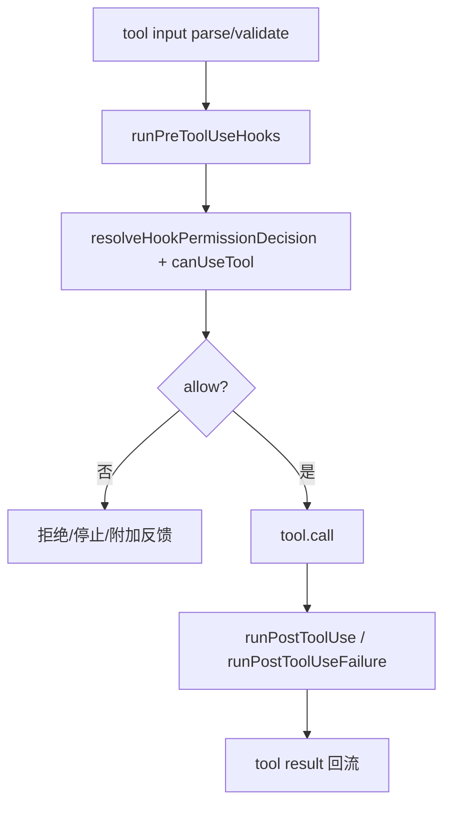
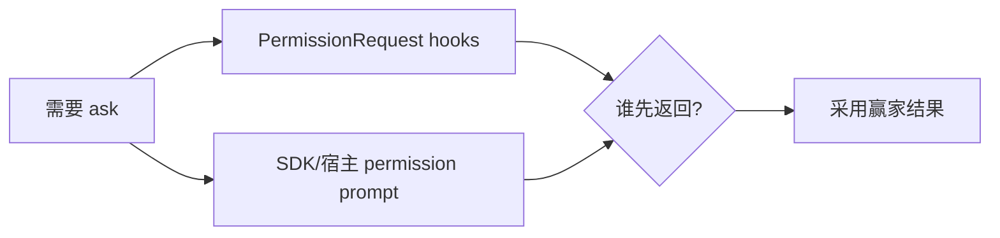
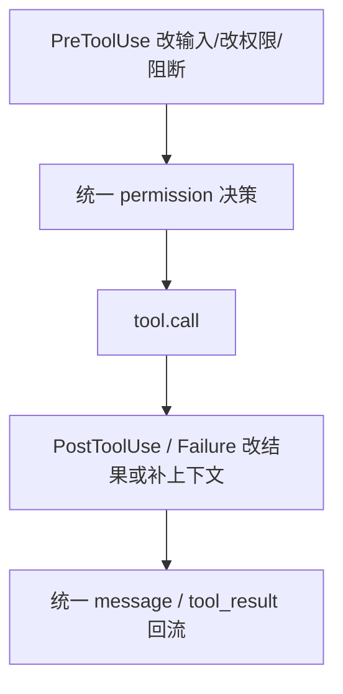

# Claude Code 源码共读笔记 70：PreToolUse 与 PostToolUse：hook 是怎么进入工具执行主链的

## 这篇看什么

前一篇 hooks 总入口，已经把一个大的判断立住了：

> **hooks 在 Claude Code 里更像 runtime orchestration layer，而不是普通插件回调。**

但那一篇还是总图。

如果要真正证明“hooks 是编排层”，
最好的办法不是继续抽象，
而是直接看它最重的一条链：

> **它到底是怎么进入工具执行主链的。**

也就是这几类 hook：

- `PreToolUse`
- `PostToolUse`
- `PostToolUseFailure`
- `PermissionRequest`

这次我主要顺着：

- `src/services/tools/toolExecution.ts`
- `src/utils/hooks.ts`
- `src/cli/structuredIO.ts`

把工具执行这条线看了一遍。

看完之后，我现在最明确的判断是：

> **Claude Code 的工具 hooks 不是“工具前后顺手跑个脚本”，而是被正式嵌进了 tool execution pipeline：前置 hook 可以改输入、补上下文、直接给权限结论甚至阻断继续；后置 hook 可以读结果、改结果、补上下文；PermissionRequest hook 还会和真实权限提示并行竞争，谁先决定谁赢。**

也就是说，这些 hook 在这里不是 observer，
而是：

> **tool runtime 的共同决策者。**

这篇就专门讲这条工具执行主链。

---

## 先给主结论

如果只先记一句话，我会留这个版本：

> **Claude Code 的工具执行 hooks，本质上已经不是“前后通知”了，而是被嵌进了工具调用决策链：`runPreToolUseHooks(...)` 在真正 permission check 和 tool.call 之前运行，能直接修改输入、补额外上下文、给出 allow/deny/ask 或阻断继续；`resolveHookPermissionDecision(...)` 再把这些结果和统一权限系统合流；工具执行后，`runPostToolUseHooks(...)` / `runPostToolUseFailureHooks(...)` 会继续改写结果或附加上下文；而 `PermissionRequest` hooks 甚至能和用户/SDK 的真实权限提示并行赛跑。**

再压缩一点，就是：

- **PreToolUse 进入调用前链路**
- **PermissionRequest 进入权限决策链**
- **PostToolUse / Failure 进入结果回流链**

这就是这篇最该记住的主心骨。

---

## 先把总图立住：工具执行不是“permission → call → result”三步，而是夹着 hook 的长链

这张图非常重要。

因为它一下就能看出来：

> **hook 不是挂在工具链外面，而是插在工具链里面。**

尤其是 `PreToolUse` 和 `PermissionRequest`，
它们根本不是“执行前广播一下”，
而是会真的改变：

- 这个工具最后用什么输入跑
- 这个工具到底是 allow、ask、deny
- 当前 turn 要不要在这里停下来

所以从 runtime 位置看，
这些 hook 已经是工具执行管线的一部分了。

---

# 第一部分：`runToolUse(...)` 真正的主链不是直接 call tool，而是先进入 `streamedCheckPermissionsAndCallTool(...)`

`toolExecution.ts` 的整体结构很清楚。

模型发出一个 `tool_use` 之后，真正进入的不是：

- `tool.call(...)`

而是：

- `runToolUse(...)`
- 再进 `streamedCheckPermissionsAndCallTool(...)`
- 再进 `checkPermissionsAndCallTool(...)`

这一层层包装非常重要。

因为它说明 Claude Code 从架构上就不认为“工具调用”只是：

- 参数校验
- 调函数
- 返回结果

而是一个更长的运行时事件。

也正因为它被定义成更长的事件，
PreToolUse / PermissionRequest / PostToolUse 才有正式切口可插进去。

换句话说：

> **不是 hooks 在硬插 tool pipeline，而是 Claude Code 本来就把 tool pipeline 设计得足够长，允许 hooks 进入。**

这点我觉得特别值。

---

# 第二部分：`runPreToolUseHooks(...)` 不是拿来记日志，而是直接参与“这次调用该怎么发生”

如果只看名字，`runPreToolUseHooks(...)` 很容易被低估。

但顺着 `checkPermissionsAndCallTool(...)` 走，你会发现它返回的东西远比“执行前回调”重。

它可能产出这些结果：

- `hookPermissionResult`
- `updatedInput`
- `additionalContext`
- `preventContinuation`
- `stopReason`
- `stop`
- 以及一堆 progress / attachment message

这意味着什么？

意味着 `PreToolUse` 根本不是：

- before hook

而是：

> **一次正式的调用前决策阶段。**

它会影响至少三类事情：

## 1. 这次调用用什么输入
hook 可以通过 `updatedInput` 改掉工具输入。

## 2. 这次调用的权限结论
hook 可以直接返回 allow / deny / ask。

## 3. 这次调用是否应该继续发生
hook 可以 `preventContinuation`，甚至直接 stop 当前执行。

这三件事合起来，就说明它已经不是观察者了。

它是：

> **调用前的干预点。**

---

# 第三部分：PreToolUse 最值的一点——它不只是“给建议”，而是真能改输入

这一点我觉得特别值得单独说。

Claude Code 在 `checkPermissionsAndCallTool(...)` 里专门处理：

- `hookUpdatedInput`
- `permissionDecision.updatedInput`

这说明 PreToolUse hook 的影响不是只有：

- 放行/拒绝

而是连：

- **工具最终吃到的输入是什么**

都能改。

这个权力很大。

因为它意味着 Claude Code 把 hook 定位成：

> **可以在工具真正执行前，对动作参数做正式重写。**

这和很多系统里的 before-hook 完全不是一个重量级。

后者通常最多只能：
- 看一眼
- 记个日志
- maybe block

Claude Code 这里已经允许：
- 改输入
- 再继续走 permission / call 流程

我觉得这是它 hooks 设计里很有代表性的地方。

---

# 第四部分：PreToolUse 的 permission result 不是最终裁决，而是先和统一权限系统“合流”

这里特别能看出 Claude Code 的成熟。

虽然 `runPreToolUseHooks(...)` 可以产出 `hookPermissionResult`，
但真正后面接的是：

- `resolveHookPermissionDecision(...)`
- 必要时再进 `canUseTool(...)`

也就是说，Claude Code 没把 hook 决策做成完全旁路，
而是把它并进统一权限链。

这个分层非常关键。

因为它说明系统没有走向：

- hook 世界一套权限逻辑
- tool 世界一套权限逻辑

而是：

> **hook 可以先提出决策，但最终还是要进入统一 permission pipeline 去收口。**

这和我们前面 MCP 权限那条线很一致。

Claude Code 很喜欢：

- 扩展点可强干预
- 但最后还是要回到统一主链收束

这是一种非常稳的系统风格。

---

# 第五部分：`resolveHookPermissionDecision(...)` 这一层很关键，因为它把“hook 决定”和“正常权限系统”揉成一条链

虽然这个函数本身在别的文件里，
但从调用位置已经能看出它的重要性。

它承担的不是一个小转换，
而是：

> **把 hook 给出的 permission 结果，和正常的 `canUseTool(...)` 路径对齐。**

也就是说，系统在这里回答的是：

- 如果 hook 已经说 allow/deny 了，后面怎么处理？
- 如果 hook 只是 passthrough，后面怎么回落到正常权限逻辑？
- 如果 hook 改了 input，后面的权限判断基于哪个版本？

这说明 Claude Code 对 hooks 的态度很清楚：

> **允许 hook 深入介入，但不允许它把主链撕裂。**

我觉得这个判断特别成熟。

因为很多 hook 系统越做越乱，
本质就是 hook 一旦介入，就自己开出一条平行世界。

Claude Code 很明显在避免这一点。

---

# 第六部分：`PermissionRequest` hook 更重，因为它不是在前面静态跑，而是和真实 permission prompt 并行赛跑

这一点我觉得是整篇里最有意思的设计点之一。

在 `structuredIO.ts` 里，`PermissionRequest` hooks 的处理不是：

- 先等 hooks 跑完
- 再弹用户 prompt

而是：

> **hooks 和 SDK/宿主 permission prompt 同时启动，谁先决出结果谁赢。**

也就是：

- `executePermissionRequestHooksForSDK(...)` 开始跑
- SDK `can_use_tool` prompt 也立刻发出去
- `Promise.race(...)`
- hook 先赢，就 abort SDK prompt
- SDK prompt 先赢，hook 结果就被忽略

这个设计特别漂亮。

因为它直接回应了一个真实问题：

> **不能为了等 hook，把真实权限 UI 卡住。**

也不能反过来让 hook 完全失去价值。

Claude Code 的处理非常工程化：

- 两边并发
- 谁先决定谁生效
- loser 取消/忽略

这说明 `PermissionRequest` hook 不是“附加建议”，
而是：

> **权限决策链上的正式竞争者。**

这点真的很值。

---

## 图 1：PermissionRequest hook 和真实权限提示不是串行，而是并发竞争

这张图建议记住。

因为它特别能体现 Claude Code hooks 的重量：

> **它们不是等在 UI 后面的附属逻辑，而是直接参与决策竞争。**

---

# 第七部分：`PermissionRequest` hook 还能顺手更新 permissions，说明它不仅能判一次，还能改未来规则

`executePermissionRequestHooksForSDK(...)` 里还有一个特别值的点：

如果 hook 返回的是 allow，
它还能带：

- `updatedPermissions`

然后系统会：

- `persistPermissionUpdates(...)`
- `applyPermissionUpdates(...)`
- 更新 appState 里的 permission context

这意味着 `PermissionRequest` hook 的影响不只在“这一次”决策。

它还可以：

> **顺手修改以后这类动作的权限规则。**

这点非常重要。

因为它说明 hook 在 Claude Code 里不是一次性 callback，
而是可以：

- 参与当前决定
- 顺便塑造未来决策环境

这就很接近“runtime policy mutation”了。

当然这里还是通过统一 permission updates 管道做，
没有变成 hook 自己瞎写规则，
这又一次体现了 Claude Code 那种：

- 干预很强
- 但收口依然统一

的设计风格。

---

# 第八部分：PreToolUse 的 stop 语义说明 hook 可以在工具真正执行前终止当前链路

这一点也很重。

在 `checkPermissionsAndCallTool(...)` 里，
如果 `runPreToolUseHooks(...)` 产出了：

- `stop`
- 或 `preventContinuation`
- 或明确的 `stopReason`

系统会直接：

- 生成 tool_result stop message
- 返回，不再进入 tool.call

这说明 `PreToolUse` hook 不只是：

- “建议不要这样做”

而是：

> **可以正式截断这次工具执行链。**

这是很强的控制面能力。

所以从架构位置看，PreToolUse hook 已经不只是 tool guard，
而更像：

- 调用前 gatekeeper
- 局部流程裁决点

---

# 第九部分：`PostToolUse` 的价值也不只是“工具成功后通知一下”，而是允许改写结果语义

很多人看到 PostToolUse，会下意识觉得它只是：

- after-success callback

但 Claude Code 这里更重。

因为 `types/hooks.ts` 里就已经允许 PostToolUse 专门返回：

- `updatedMCPToolOutput`
- `additionalContext`

结合 `toolExecution.ts` 里的后处理逻辑，
它表达的是：

> **工具执行成功后，hook 还能继续影响这次结果怎么被系统理解和回流。**

也就是说，PostToolUse 不只是做副作用，
而是会继续影响：

- 最终 tool result 的内容形态
- 额外补给模型的上下文
- transcript / message 层最终看到的是什么

这就意味着，hook 不只干预“能不能做”，
还干预：

> **做完以后，系统该怎么理解这次动作。**

这也是非常重的一层权力。

---

# 第十部分：`PostToolUseFailure` 说明 hook 不只编排 happy path，也编排 error path

这点很值得说。

Claude Code 明显没有把 hooks 只做在成功路径上。

它还专门有：

- `PostToolUseFailure`

这说明系统承认一个现实：

> **失败也是 runtime 正常的一部分，也值得被编排。**

这很成熟。

因为很多系统里 hook 只盯成功路径，
一旦失败，整个编排层就断掉了。

Claude Code 的设计明显不是这样。

它允许你在失败后：

- 补充解释
- 追加上下文
- 触发某些恢复辅助逻辑
- 改善模型对这次失败的后续处理

所以 hook 的覆盖面不是：
- 成功时增强一下

而是：
- **成功和失败都进入编排面。**

---

# 第十一部分：整个工具 hook 链最成熟的一点——允许强干预，但每一步都回到统一主链收口

把前面几节收起来后，我觉得这条线最成熟的地方，其实不是 hook 有多强。

而是：

> **它允许 hook 很强地干预，但又始终把结果收回统一的 tool execution 主链。**

你看这条链里的几个关键点：

- PreToolUse 可以改 input
- hook 可以给 permissionDecision
- PermissionRequest hook 可以和 UI prompt 并发抢答
- hook 可以更新未来 permissions
- PostToolUse 可以改 output 语义
- PostToolUseFailure 可以补失败后处理

这些都很强。

但与此同时：

- 权限仍然通过统一 permission decision 结构收口
- input 仍然回到 `processedInput`
- result 仍然回到 tool_result/message 流程
- 规则更新仍然走 permission updates 管道

这就是 Claude Code 很稳的地方。

它不是“hook 想怎么改就怎么改”，
而是：

- 在每个关键节点给你强插手能力
- 但最后都收回统一 runtime 语义

这就是一个成熟编排层该有的样子。

---

## 图 2：hook 很强，但最后都被收回统一工具主链

这张图建议记住。

因为它正好体现了 Claude Code hooks 设计里最成熟的平衡：

> **强干预，不等于主链分裂。**

---

# 术语补充 / 名词解释

## 1. PreToolUse
建议理解成：

- **工具执行前的正式干预点**

不只是 before-callback，它能改输入、给权限结论、补上下文、阻断继续。

## 2. PermissionRequest hook
建议理解成：

- **当正常权限系统进入 ask 路径时，额外加入决策竞争的一类 hook**

它不是被动通知，而是能和真实 permission prompt 竞争谁先决定。

## 3. updatedInput
这里不要理解成“小修小补”。

更准确地说，是：

- **hook 对本次工具调用参数的正式重写结果**

## 4. updatedPermissions
建议理解成：

- **hook 在决定本次 allow 的同时，对未来权限规则作出的正式更新提议**

## 5. PostToolUseFailure
建议理解成：

- **工具失败后仍然可被编排的错误路径插入点**

---

# 这一篇最想保住的判断

如果把整篇压成一句最关键的话，我会留：

> **Claude Code 的工具 hooks，真正厉害的地方不在“支持工具前后回调”，而在它把这些 hook 正式嵌进了工具执行主链：PreToolUse 能改输入、补上下文、抢先给 permission 结论甚至截断执行；PermissionRequest hooks 能和真实权限提示并发竞争；PostToolUse / PostToolUseFailure 又能继续改写结果语义与错误路径，但这一切最后都被统一收回 tool execution pipeline，因此 hooks 在这里是共同决策者，不是旁观者。**

这句话里最重要的点有五个：

- PreToolUse 能强干预调用前链路
- PermissionRequest 能进入权限决策竞争
- PostToolUse 能改结果语义
- Failure path 也被 hook 编排
- 所有干预最后仍回到统一工具主链收口

---

# 我现在对 Claude Code 工具 hooks 的最短总结

如果只留一句最短的话，我会留：

> **Claude Code 的工具 hooks，本质上是在把工具执行链改造成一个可被外部逻辑共同决策的运行时流程。**

---

# 这篇最值得记住的几个判断

### 判断 1：工具执行主链不是“permission → call → result”三步，而是中间正式插入了 PreToolUse、PermissionRequest、PostToolUse、PostToolUseFailure 等 hook 链路

### 判断 2：`runPreToolUseHooks(...)` 的价值不在记录日志，而在参与调用前决策：改输入、补上下文、给 permission 结果、阻断继续

### 判断 3：PreToolUse hook 能返回 `updatedInput`，说明 hook 在 Claude Code 里被允许正式重写工具参数

### 判断 4：hook 的 permission 决策不会撕裂主链，而是通过 `resolveHookPermissionDecision(...)` 和统一权限系统合流

### 判断 5：`PermissionRequest` hooks 和真实权限提示是并发竞争关系，不是串行附属关系；谁先决出结果谁赢

### 判断 6：`PermissionRequest` hooks 不仅能决定这一次 allow/deny，还能通过 `updatedPermissions` 正式更新未来权限规则

### 判断 7：PreToolUse 的 stop / preventContinuation 说明 hook 可以在 tool.call 前直接截断执行链

### 判断 8：PostToolUse 不只是 after-success 回调，它还能通过 `updatedMCPToolOutput` / `additionalContext` 继续改写结果语义

### 判断 9：PostToolUseFailure 说明 Claude Code 连错误路径也纳入了 hooks 编排面

### 判断 10：整条工具 hook 链最成熟的地方是“允许强干预，但最后仍回到统一主链收口”

---

# 下一步最顺怎么接

如果继续沿这条线往下写，我觉得最顺有两个方向。

## 方向 A：会话生命周期 hooks

也就是接：

- `SessionStart`
- `UserPromptSubmit`
- `Stop`
- `SubagentStop`

这样能把 hooks 从“工具执行编排”扩到“会话生命周期编排”。

## 方向 B：单独拉一篇 PermissionRequest hooks 专题

也就是把：

- SDK prompt race
- updatedPermissions
- hook vs UI prompt
- PermissionDenied hooks

单独再拉深一层。

如果只选一个，我会更倾向 **方向 A**。

因为 hooks 主线现在最自然的下一步，就是：

> **既然工具链已经讲清了，那会话生命周期是怎么被 hook 的。**