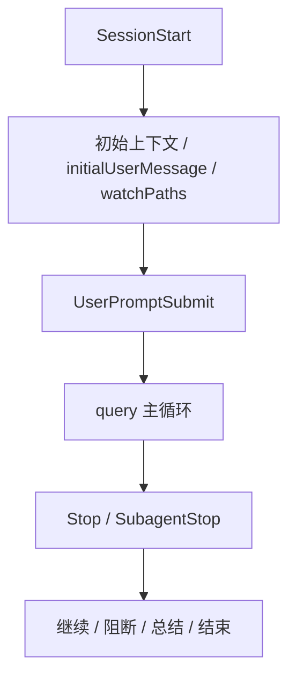
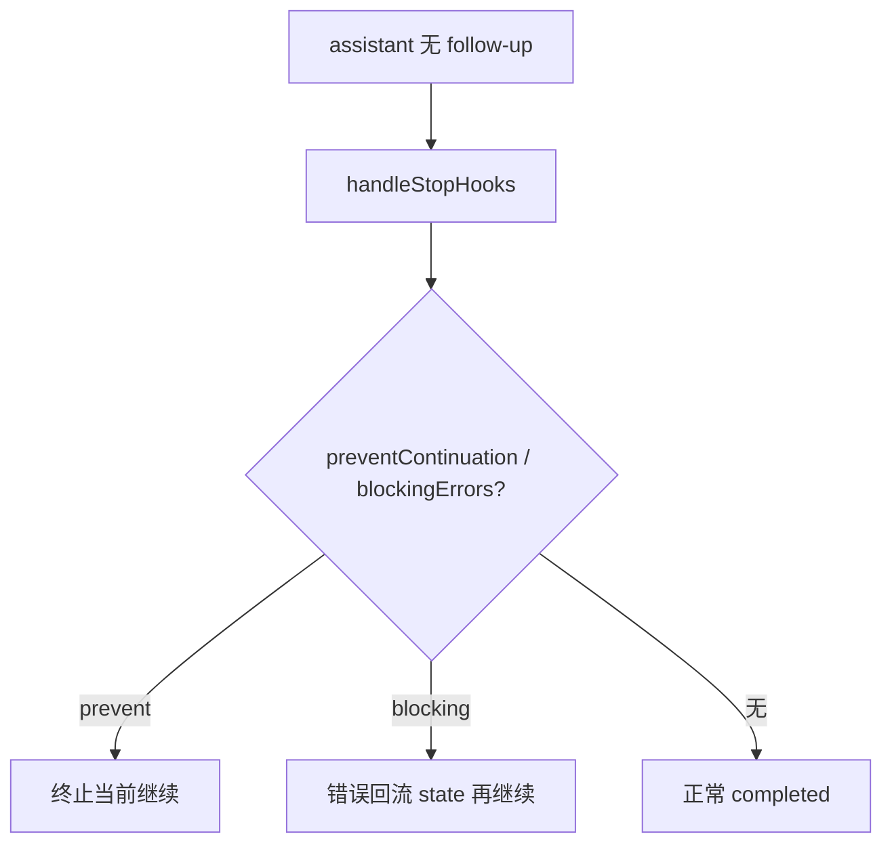
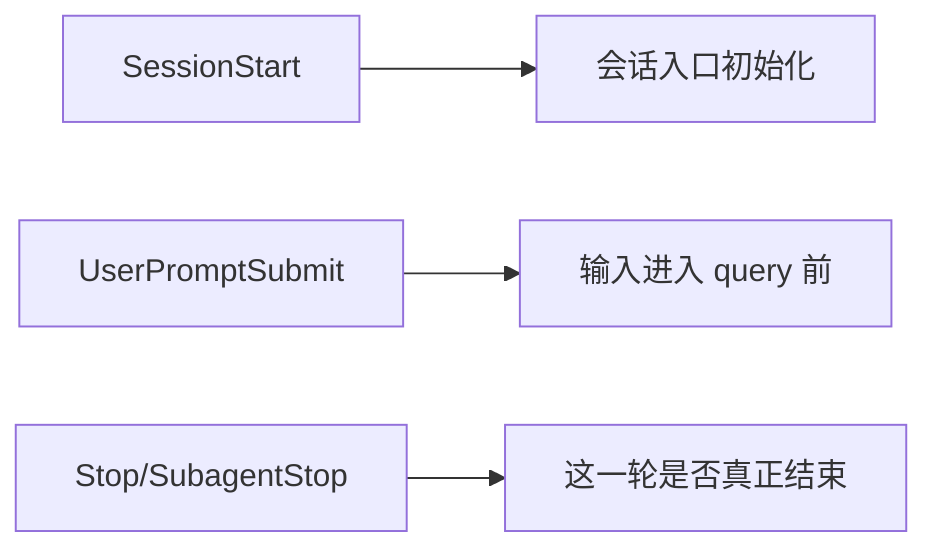

# Claude Code 源码共读笔记 71：SessionStart 与 Stop：hooks 是怎么进入会话生命周期的

## 这篇看什么

前一篇我们已经把 hooks 最重的一条工具链讲清了：

- `PreToolUse`
- `PostToolUse`
- `PostToolUseFailure`
- `PermissionRequest`

那篇最后留下的自然问题是：

> **hooks 只是在编排工具执行吗？还是它也在编排“整条会话”的生命周期？**

这次把：

- `src/utils/sessionStart.ts`
- `src/utils/processUserInput/processUserInput.ts`
- `src/utils/hooks.ts`
- `src/query/stopHooks.ts`
- `src/query.ts`

串起来以后，我现在的判断很明确：

> **Claude Code 的 hooks 不只是“工具执行编排层”，它还深入到了会话生命周期：会话开始时可以注入初始上下文、首条用户消息和 watchPaths；用户每次提交消息前可以被拦截、补上下文甚至阻断；query 准备结束时 Stop hooks 还能决定这轮是否真的结束；而对子代理来说，Stop 会自动转义成 `SubagentStop`，说明生命周期 hook 不是只服务主线程。**

也就是说，Claude Code 的 hooks 不只是：

- how tools run

它还在管：

- **how sessions begin, continue, and end**

这篇就专门讲这条会话生命周期 hooks 线。

---

## 先给主结论

如果只先记一句话，我会留这个版本：

> **Claude Code 的生命周期 hooks，本质上是在把“会话从哪里起、每次输入如何进入主循环、这轮何时真正结束”做成一套正式的可插拔编排层：`processSessionStartHooks(...)` 把 startup/resume/clear/compact 这些入口接成 SessionStart 事件，`executeUserPromptSubmitHooks(...)` 把每次用户输入变成进入 query 前的可干预阶段，而 `handleStopHooks(...)` / `executeStopHooks(...)` 又把 query 尾部的继续/停止判定交给 hook 共同参与；对子代理，这套 stop 机制还会自动转成 `SubagentStop`。**

再压缩一点，就是：

- **SessionStart 管会话怎么起**
- **UserPromptSubmit 管输入怎么进**
- **Stop/SubagentStop 管这一轮怎么收**

这就是这篇最该记住的主心骨。

---

## 先把总图立住：hooks 在会话生命周期里覆盖了“起点—入口—终点”三段

这张图特别重要。

因为它把 hooks 在生命周期里的位置一下就立住了：

- 开始前
- 每次用户输入前
- 每轮结束前

也就是说，hooks 在 Claude Code 里不是只盯工具，
而是覆盖了：

> **会话起点、输入入口、结束边界。**

这就是为什么我会说 hooks 更像 orchestration layer。

如果它只是 tool callback，
它不该进入 SessionStart 和 Stop 这些位置。

但 Claude Code 明显让它进来了。

---

# 第一部分：`processSessionStartHooks(...)` 真正干的不是“会话开始跑几个脚本”，而是把 session 入口做成正式 hook 事件

我觉得生命周期 hooks 的第一站必须是：

- `src/utils/sessionStart.ts`

因为这个文件把一个非常关键的判断写得很清楚：

> **Claude Code 不把“会话开始”当成自然发生的状态，而是把它做成一个正式事件点。**

`processSessionStartHooks(...)` 会接受这些 source：

- `startup`
- `resume`
- `clear`
- `compact`

这非常关键。

因为它说明 Claude Code 眼里的“SessionStart”不是只有：

- 第一次打开 REPL

而是更广义的：

- 新会话启动
- 旧会话恢复
- clear 后重开
- compact 后重新接续

换句话说，它在问的不是“是不是第一次打开界面”，
而是：

> **当前 runtime 现在是否正要进入一条新的工作入口。**

这就是很成熟的 lifecycle 视角。

---

# 第二部分：SessionStart hooks 最值的一点——它们不只是输出消息，而是能直接塑造这条会话的初始状态

`processSessionStartHooks(...)` 看起来只是聚合 hook 结果，
但真正值钱的是它聚合的那些内容：

- `additionalContexts`
- `initialUserMessage`
- `watchPaths`

这三样东西说明 SessionStart hook 的地位非常高。

## 1. additionalContexts
这会被做成：
- `hook_additional_context`
- 作为正式 attachment 进入消息流

这意味着 hook 可以在第一轮 query 之前，
就给这条会话补一层系统化上下文。

## 2. initialUserMessage
这个更重。

`pendingInitialUserMessage` 这种 side channel 的存在说明：

> **SessionStart hook 可以不等用户输入，就直接为这条会话制造“第一条用户意图”。**

这不是小增强。

这相当于说，hook 可以定义：
- 这条会话一开始就该从哪句话启动

## 3. watchPaths
它会被 `updateWatchPaths(...)` 接进去。

这说明 SessionStart hook 不只是补文本上下文，
还可以：

- 改变这条会话后续要观察哪些文件/路径变化

这已经是在直接塑造 runtime 的环境行为了。

所以我会说：

> **SessionStart hooks 不是输出欢迎语，而是在塑造会话初始工作现场。**

---

# 第三部分：为什么 SessionStart hooks 会在 startup/resume/clear/compact 多处触发？因为 Claude Code 在意的是“进入点”，不是“会话壳”

这一点我觉得特别值得单独说。

很多系统的 start hook 只有一次：
- 真启动时跑一下

Claude Code 明显不是。

你会看到它在这些地方都可能跑：

- `main.tsx` startup
- `conversationRecovery.ts` 的 resume
- `clear conversation`
- `compact` 完成后
- print mode / REPL 初始化若干路径

这说明 Claude Code 对 SessionStart 的理解非常现实：

> **用户感知中的“重新进入一条工作回路”，都值得视为一次新的 session entry。**

这很成熟。

因为从模型和 runtime 的角度看，
这些时刻虽然不一定是“新 session 文件”，
但确实都是：

- 新的上下文骨架刚建立
- 新的 query 即将开始
- 新的初始附加上下文值得重新补进来

所以 SessionStart hooks 跑多次，
不是重复，
而是 Claude Code 在刻意把“入口重建”视为正式事件。

---

# 第四部分：`UserPromptSubmit` 很关键，因为它说明“用户输入进入主循环”也不是直接发生，而是先过 hook 入口

如果 SessionStart 管的是“会话怎么起”，
那：

- `executeUserPromptSubmitHooks(...)`
- 在 `processUserInput.ts`

管的就是：

> **每一次用户输入，怎么进入 query。**

这里最重要的一点是：

Claude Code 不是把用户输入 parse 完就直接进 query，
而是会先：

- `executeUserPromptSubmitHooks(...)`

然后根据结果决定：

- block
- stop processing
- 附加上下文
- 继续进入主流程

这说明一个很关键的架构判断：

> **用户输入不是天然可信、天然完整、天然应该马上送模的。**

在 Claude Code 里，
它首先是一个可以被 runtime policy/automation 层重新解释的事件。

这很值。

因为它等于给系统提供了一个非常早的控制点：

- 在模型看到 prompt 之前就介入

这和 SessionStart 一样，
都是极早的生命周期插入点。

---

# 第五部分：UserPromptSubmit hooks 不只是能补上下文，还能把原始 prompt 整轮挡下来

`processUserInput.ts` 里这段特别值。

如果 `executeUserPromptSubmitHooks(...)` 返回：

- `blockingError`

系统会直接：

- 返回一个 system-level warning
- `shouldQuery: false`
- 原始用户输入不进入正常 query 流程

如果返回：

- `preventContinuation`

系统也会：
- 把“Operation stopped by hook”插进 messages
- 停止继续 query

这意味着 UserPromptSubmit hook 不是：

- “用户输入后附加一点元信息”

而是：

> **可以在 prompt 进入模型前，正式阻断这一轮。**

这就是很重的控制面能力。

而如果它不 block，
它还能继续：

- 追加 `hook_additional_context`
- 把 hook 成功消息插进消息流

也就是说，UserPromptSubmit hook 有两种重量级能力：

- **否决这轮输入**
- **重新塑造这轮输入的上下文边界**

这已经不是辅助功能了。

---

# 第六部分：Stop hooks 最能说明 hooks 已经进入 query 主循环的终止条件判定

这一点其实在 69 已经碰到过，
但放到生命周期里看会更清楚。

`query.ts` 在没有 tool follow-up 且最后消息不是 API error 时，
不会直接 return completed，
而是先：

- `yield* handleStopHooks(...)`

这说明什么？

说明 Claude Code 并不认为：

- “模型说完了”
- 就等于
- “这一轮真的结束了”

它还要再问一次：

> **Stop hooks 有没有意见？**

这非常关键。

因为它意味着 stop hooks 已经不只是收尾动作，
而是：

> **query loop 的一部分终止条件。**

如果 stop hook 返回：

- `preventContinuation`

那系统会直接：
- `reason: 'stop_hook_prevented'`
- 当前 turn 不再继续

如果它产生 blockingErrors，
系统甚至会把这些错误再塞回 state，
然后继续下一轮，
形成一个“hook 阻塞 → 新一轮继续处理”的回路。

这就是 hooks 进入主循环控制面的铁证。

---

## 图 1：Stop hooks 不是收尾旁白，而是 query loop 的最后一道关口

这张图特别重要。

因为它直接体现了 Claude Code 的一个核心事实：

> **“模型说完”不等于“runtime 同意结束”。**

---

# 第七部分：`handleStopHooks(...)` 干的事非常重——它不只是跑 hook，还顺手挂了很多 turn-end bookkeeping

看 `query/stopHooks.ts` 还有一个很有意思的地方：

在真正执行 stop hooks 之前/之后，
它还顺手做了很多背景工作：

- `saveCacheSafeParams(...)`
- prompt suggestion
- extract memories
- auto dream
- computer use cleanup
- teammate idle / task completed hooks

这一层说明什么？

说明 Claude Code 眼里的 stop 阶段，
不是单点事件，
而是：

> **一整个 turn-end orchestration window。**

也就是说，Stop hooks 所在的位置之所以重要，
不是只有“能 stop”，
还因为它恰好是：

- 一轮 query 收口前
- 各种后处理汇聚的窗口

所以 stop hook 能力才会显得特别重。

它站的位置本来就高。

---

# 第八部分：对子代理来说，Stop 会自动变成 `SubagentStop`，说明生命周期 hooks 不是主线程专属

这一点我觉得很漂亮。

在 `utils/hooks.ts` 里，`executeStopHooks(...)` 会根据有没有 `subagentId`，自动选择：

- `Stop`
- 或 `SubagentStop`

而 `registerFrontmatterHooks.ts` 里也明确有一条转换逻辑：

- 对 agent frontmatter 中的 Stop hooks，会自动改写成 `SubagentStop`

这说明 Claude Code 对生命周期 hooks 的理解不是：

- 只服务主线程 REPL

而是：

> **只要是一个运行中的 agent lifecycle，就应该有自己的结束事件。**

这很重要。

因为它说明 hooks 在 Claude Code 里已经跨过了：

- 主线程 vs 子代理

的边界。

它在意的是：

- 这个 runtime 单元现在是不是要停了

而不是：
- 这是不是用户直接看见的主线程

这就是更成熟的 runtime 视角。

---

# 第九部分：所以 SessionStart / UserPromptSubmit / Stop 这三类 hook，分别钉住了会话生命周期的三个关键关口

把前面几节收起来后，结构其实已经很清楚了。

我现在会这样概括：

## SessionStart
钉住的是：
- **会话入口重建时刻**

它负责：
- 初始化上下文
- 初始化首条用户消息
- 初始化 watchPaths

## UserPromptSubmit
钉住的是：
- **用户输入进入 query 之前**

它负责：
- block / stop
- 补附加上下文
- 改写这轮进入方式

## Stop / SubagentStop
钉住的是：
- **这一轮是否真的结束**

它负责：
- 决定继续还是停止
- 把阻塞错误回流到下一轮
- 顺手承接 turn-end orchestration

所以 hooks 在生命周期里的作用不是零散的，
而是非常有结构：

> **起点—入口—终点，三段都被它占住了。**

这就是为什么我会说 hooks 是 runtime orchestration layer。

---

## 图 2：SessionStart、UserPromptSubmit、Stop 分别占住生命周期三道关口

这张图建议记住。

因为它特别能帮助你把 hooks 从“某几个零散事件”重新看成：

> **生命周期编排结构。**

---

# 第十部分：我最想保住的一个判断——Claude Code 的 hooks 不只是管“怎么做事”，也在管“什么时候开始算一件事、什么时候算结束”

把整篇收起来后，我现在最想保住的判断其实是这句：

> **Claude Code 的 hooks 不只是参与“工具怎么执行”，它还参与定义“什么时候一条会话真正开始、什么时候一条用户输入算正式进入 query、什么时候一轮工作真的算结束”。也就是说，hooks 在这里不只是操作层编排，而是生命周期边界的共同制定者。**

为什么我会这么说？

因为你会发现它卡住的点都特别关键：

- 会话入口
- prompt 入口
- turn 终点
- 子代理终点

这些都不是“增强功能”会去碰的位置。

只有当系统把 hook 当成：

> **正式 runtime 控制面**

时，才会允许它进入这些位置。

而 Claude Code 显然就是这样做的。

---

# 术语补充 / 名词解释

## 1. SessionStart
这里建议理解成：

- **不仅是首次启动，而是任何会话入口重建事件**

包括 startup、resume、clear、compact。

## 2. initialUserMessage
建议理解成：

- **由 SessionStart hook 提前注入的第一条用户意图**

它说明 hook 可以在用户正式输入前塑造这条会话的启动方向。

## 3. UserPromptSubmit
建议理解成：

- **用户输入正式进入 query 前的生命周期插入点**

## 4. Stop hook
建议理解成：

- **在当前 query 准备收口时，对“这轮是否真的结束”拥有影响力的 hook**

## 5. SubagentStop
建议理解成：

- **对子代理 runtime 单元的 stop 事件版本**

说明生命周期 hooks 不是主线程专属。

---

# 这一篇最想保住的判断

如果把整篇压成一句最关键的话，我会留：

> **Claude Code 的生命周期 hooks，把会话的“起点—入口—终点”都做成了正式可插拔事件：SessionStart 可以塑造初始工作现场，UserPromptSubmit 可以决定输入是否正式进入主循环，Stop/SubagentStop 可以参与决定这一轮是否真正结束，因此 hooks 在这里不仅编排动作，还在共同定义 runtime 生命周期边界。**

这句话里最重要的点有五个：

- SessionStart 不是欢迎语，而是入口塑形
- UserPromptSubmit 是 prompt 进入主循环前的正式 gate
- Stop hooks 是 query loop 的终止关口
- SubagentStop 说明生命周期 hooks 跨越主线程与子代理
- hooks 管的不只是执行，还管生命周期边界

---

# 我现在对 Claude Code 生命周期 hooks 的最短总结

如果只留一句最短的话，我会留：

> **Claude Code 的生命周期 hooks，本质上是在让 runtime 的起点、入口和终点都变成可编排事件。**

---

# 这篇最值得记住的几个判断

### 判断 1：SessionStart hooks 在 Claude Code 里不是“首次启动时跑一次”，而是对 startup/resume/clear/compact 这些入口重建事件统一建模

### 判断 2：SessionStart hooks 的价值不只在输出消息，而在于能正式塑造初始状态：additionalContext、initialUserMessage、watchPaths

### 判断 3：UserPromptSubmit hooks 说明用户输入进入 query 前还有一道正式 gate，而不是 parse 完就直接送模

### 判断 4：UserPromptSubmit hooks 不仅能补上下文，还能 block / preventContinuation，让原始 prompt 整轮不进入 query

### 判断 5：Stop hooks 不是收尾旁白，而是 query loop 的一部分终止条件；“模型说完”不等于“runtime 同意结束”

### 判断 6：Stop hooks 的 blockingErrors 会回流进下一轮 state，说明它们不只是在最后发个 warning，而是能塑造后续控制流

### 判断 7：`handleStopHooks(...)` 所在的位置很高，因为它处在 turn-end orchestration window，上面还挂着 prompt suggestion、memory extraction、cleanup 等后处理

### 判断 8：SubagentStop 说明生命周期 hooks 不是主线程专属，而是面向所有 runtime 单元的正式 stop 事件

### 判断 9：SessionStart、UserPromptSubmit、Stop 三类 hook 分别占住了会话生命周期的起点、入口、终点三道关口

---

# 下一步最顺怎么接

如果继续沿这条线往下写，我觉得最顺有两个方向。

## 方向 A：hooks 主线收口

把前面三篇并起来：

- 69 总入口
- 70 工具执行链 hooks
- 71 生命周期 hooks

再压成一篇 hooks 总结：

- hooks 在 Claude Code 里到底属于哪一层
- 和 tool / skill / MCP / plugin 的边界是什么
- 为什么它更像 orchestration layer

## 方向 B：单独再拉一篇 SessionStart 专题

比如：

- initialUserMessage
- watchPaths
- compact/resume/clear 为什么都触发
- plugin hooks 为什么要在 SessionStart 前加载完

如果只选一个，我会更倾向 **方向 A**。

因为 hooks 主线现在其实已经够完整了，再补一篇总收口，会最整。