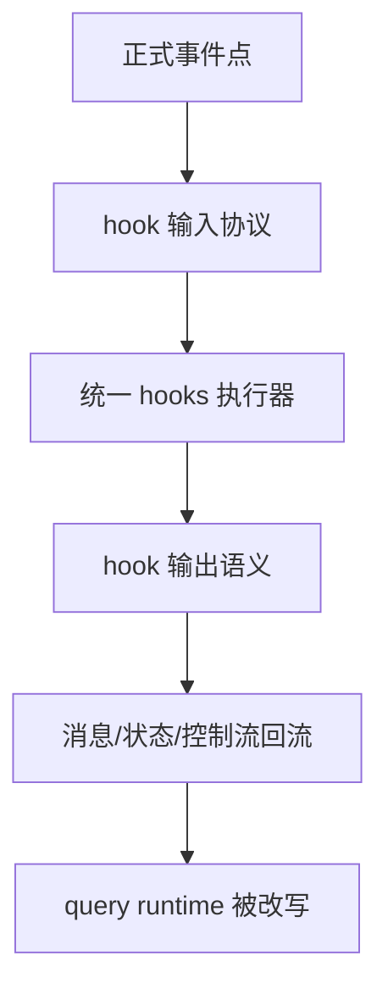
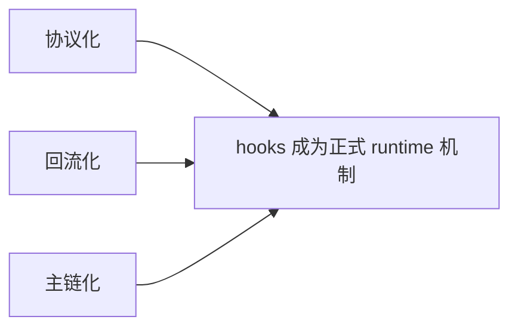
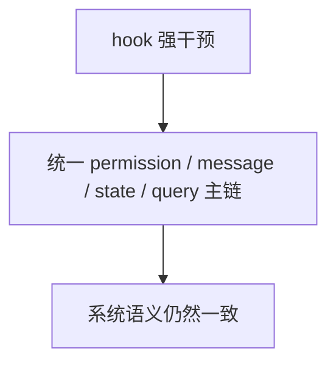

# Claude Code 源码共读笔记 72：hooks 主线收尾：为什么 Claude Code 的 hooks 本质上是 runtime 编排层

## 这篇看什么

hooks 这条线，前面其实已经拆了三篇主干：

- `69`：hooks 总入口
- `70`：工具执行链 hooks
- `71`：会话生命周期 hooks

如果继续拆，当然还能继续往下挖：

- 单独讲 `PermissionRequest`
- 单独讲 `SessionStart`
- 单独讲 `postSampling`
- 单独讲 `Stop` 里的后处理窗口

但到这一步，主线其实已经够完整了。

所以这篇不再追单个函数，
而是专门做 hooks 主线的总收口。

目标很明确：

> **把前面三篇的结论压成一个更大的架构判断：为什么 Claude Code 的 hooks，不该被理解成“几个回调”，而应该被理解成 runtime orchestration layer。**

也就是说，这篇不是补细节，
而是要把 hooks 在整套 Claude Code 里的位置彻底立住。

---

## 先给主结论

如果只先记一句话，我会留这个版本：

> **Claude Code 的 hooks，本质上不是“在若干时机执行外部脚本”，而是在把 query runtime 中那些关键事件——会话起点、用户输入入口、工具执行前后、权限请求、停止收口、子代理结束——都变成正式可插拔的控制点。它们有严格的事件类型、输入输出协议、统一执行器和回流机制，因此 hooks 在这里真正扮演的是运行时编排层，而不是插件回调层。**

再压缩一点，就是：

- **tool 提供动作原语**
- **skill 提供方法模块**
- **MCP 提供外部能力面**
- **hooks 提供运行时编排面**

这句话就是这篇最该记住的主心骨。

---

## 先把总图立住：hooks 在 Claude Code 里覆盖的是“事件 → 决策 → 回流”整条链

这张图很重要。

因为它一下就把 hooks 和普通回调系统区分开了。

普通回调通常更像：

- 事件发生
- 调用一下外部逻辑
- 外部逻辑做点副作用

Claude Code 的 hooks 不是这个结构。

它真正做的是：

1. 先把关键 runtime 事件做成正式事件点
2. 再为每类事件定义输入输出协议
3. 再通过统一执行器跑 hook
4. 再把结果翻译回系统自己的 message / permission / state / control flow
5. 最终影响 query runtime

所以 hooks 在这里不是附属通知系统，
而是：

> **runtime 里的可插拔控制层。**

---

# 第一部分：为什么说 hooks 在 Claude Code 里不是“功能扩展”，而是“控制扩展”

我觉得这是整条线最根上的一句话。

Claude Code 的 hooks 真正扩展的，不是：

- 新工具
- 新提示词
- 新模型能力

而是：

> **对已有 runtime 的控制权。**

比如前面三篇其实已经把这种控制权拆得很清楚了：

## SessionStart
它可以：
- 补 additional context
- 注入 initialUserMessage
- 更新 watchPaths

## UserPromptSubmit
它可以：
- block 这轮输入
- preventContinuation
- 在送模前补额外上下文

## PreToolUse
它可以：
- 改输入
- 给 permission 决策
- 阻断调用继续

## PermissionRequest
它可以：
- 和真实权限提示并发竞争
- 更新未来 permission rules

## PostToolUse / PostToolUseFailure
它可以：
- 改结果语义
- 补额外上下文
- 编排失败路径

## Stop / SubagentStop
它可以：
- 影响 query 是否真的结束
- 把 blocking errors 回流到下一轮 state

这些能力共同说明了一件事：

> **hooks 不是在增加动作，而是在改变 runtime 已有动作与流程如何发生。**

这就是为什么我更愿意把 hooks 定义成：

- control plane / orchestration layer

而不是扩展功能集合。

---

# 第二部分：Claude Code 为什么不满足于“before/after callback”，而要给 hooks 这么重的地位

我觉得这里有个很强的产品与架构判断。

如果 Claude Code 只给轻回调，会怎样？

- 用户可以记录日志
- 可以打印一些提示
- 但很难真正塑造 agent 行为

Claude Code 显然不满足于这个层次。

它真正想要的是：

> **允许用户、插件、skill/frontmatter、内部 runtime 逻辑在关键事件点系统性地介入 agent 行为。**

这就是为什么它做了这些看起来“很重”的设计：

- 严格类型化 HookEvent
- 每种事件自己的 hookSpecificOutput
- workspace trust gate
- sync/async hook runtime
- structured progress / attachment / error 消息
- 统一结果回流
- 甚至 stop hook 进入 query loop 终止条件

这些东西如果只想做 callback，是完全没必要的。

正因为它想做的是：

- **可编排的 agent runtime**

所以 hooks 才会被放到这么高的位置。

---

# 第三部分：hooks 最关键的三个特征，是“协议化、回流化、主链化”

如果把前面三篇压成三个词，
我会压成：

- **协议化**
- **回流化**
- **主链化**

这三个词我觉得特别能概括 Claude Code hooks 的成熟度。

## 1. 协议化
不是任意脚本随便吐点字符串，
而是：

- HookEvent 是正式枚举
- 输入是正式 schema
- 输出是 event-specific schema

这让 hooks 从“脚本习惯用法”变成了：

- **正式 runtime 协议的一部分**

---

## 2. 回流化
hook 结果不会散在系统外面，
而是会被重新吸进：

- message
- attachment
- progress
- permission decision
- state update
- stop/continue 控制流

这意味着 hook 不是做完就算，
而是会继续参与 Claude Code 的后续推理和展示。

---

## 3. 主链化
最重要的一点是：

- hooks 不是挂在主链旁边
- 而是正式进入主链

比如：
- UserPromptSubmit 在 prompt 进入 query 前
- PreToolUse 在 tool.call 前
- PermissionRequest 和真实 prompt 并发竞争
- Stop hook 进入 query 终止条件判定

也就是说，hooks 在 Claude Code 里已经不是扩展外围，
而是：

> **进入主链。**

这点最重要。

---

## 图 1：hooks 的真正重量来自“协议化 + 回流化 + 主链化”

这张图建议记住。

因为它比“hooks 很强”这种泛话更准确。

---

# 第四部分：和 tool、skill、MCP、plugin 的边界怎么理解

这部分我觉得特别重要。

因为 hooks 最容易被混词。

## hooks vs tool
- tool 解决的是：**能执行什么动作**
- hooks 解决的是：**这些动作在什么条件下如何被允许、改写、收口**

所以 tool 是 action primitive，
hooks 是 action orchestration。

---

## hooks vs skill
- skill 解决的是：**模型在任务层面该怎么思考、怎么组织步骤**
- hooks 解决的是：**系统在 runtime 事件点怎么强制或程序化介入**

所以 skill 更偏方法，
hooks 更偏控制。

---

## hooks vs MCP
- MCP 解决的是：**外部能力怎么接进来**
- hooks 解决的是：**这些能力进入系统后，何时、以何种方式、在什么边界下运行**

所以 MCP 是 capability plane，
hooks 是 control plane。

---

## hooks vs plugin
- plugin 更像能力/配置/逻辑的分发与装载来源
- hooks 更像这些来源最终接入 runtime 的控制接口之一

也就是说：

> **plugin 更像来源层，hooks 更像编排接口层。**

这点分清之后，后面读 plugin 系统会顺很多。

---

# 第五部分：为什么 hooks 的危险度很高，因此 trust 和统一执行器特别重要

这条线也一定得说清。

因为 hooks 一旦强到可以：

- 改 prompt 入口
- 改 tool 输入
- 改 permission 决策
- 改 stop 条件

那它的危险度就不再是“脚本自动化”那个级别了。

它实际上接近：

> **对 agent runtime 的策略级写权限。**

这就是为什么 Claude Code 会：

- 强依赖 workspace trust
- 用统一 `executeHooks(...)` 而不是让每处自己瞎跑
- 严格校验 hook 输出 schema
- 把很多结果收成统一 attachment/progress/error 类型

这些都不是形式主义。

而是在控制一个非常强的能力面。

所以从安全视角看，Claude Code 的 hooks 不是“方便的小扩展”。

它是：

- **高杠杆控制接口**

既然是高杠杆，
就必须：

- 强约束输入输出
- 强约束执行入口
- 强约束信任边界

这点特别重要。

---

# 第六部分：为什么说 Claude Code 的 hooks 比很多 agent 系统成熟，就成熟在“强干预但不撕裂主链”

我觉得这是 hooks 这条线里最值得学的架构判断。

很多系统如果给了 hooks 很强的能力，
最后往往会变成：

- hook 自己做一套决策
- 主链自己再做一套决策
- 二者边界越来越乱

Claude Code 相对成熟的地方恰恰在这里：

> **hooks 很强，但最终都被收回统一主链。**

比如：

- PreToolUse 可以给 permissionDecision，但还要回到统一 permission pipeline 收口
- PermissionRequest hook 可以更新 permissions，但仍然走统一 updates 管道
- PostToolUse 改结果，最后仍然回到统一 tool_result / message 流程
- Stop hook 可以阻止继续，但结果仍然通过 query loop state transition 表达

也就是说，它的风格不是：

- hook 开平行宇宙

而是：

- hook 强插手，但主链仍然只有一条

这太重要了。

因为这正是可维护系统和越来越乱系统的分水岭。

---

## 图 2：Claude Code 的 hooks 强在干预能力，但稳在最后仍回统一主链

这张图其实是整条 hooks 主线最该记住的平衡点。

---

# 第七部分：所以 Claude Code 的 hooks 最适合被定义成什么？

如果必须给它一个最准的一句话定义，
我现在会留这个版本：

> **Claude Code 的 hooks，是一套事件驱动、协议化、可回流、进入主链的 runtime 编排接口。**

这个定义里每个词都很重要：

- **事件驱动**：因为它围绕 HookEvent 展开
- **协议化**：因为输入输出有正式 schema
- **可回流**：因为结果会重新进入消息/状态系统
- **进入主链**：因为它真的参与 query、tool、permission、stop 等主流程
- **编排接口**：因为它改变的是流程控制，而不是单纯增加能力

我觉得这是 hooks 这条线最后最值得保住的一句话。

---

# 术语补充 / 名词解释

## 1. runtime orchestration layer / 运行时编排层
这里建议理解成：

- **不负责提供动作能力，而负责在关键 runtime 事件点改写已有流程的一层**

## 2. control plane / 控制面
这里在这条线里可以近似理解成：

- **决定 agent runtime 如何运行、何时停、何时被拦、何时补上下文的那一层**

## 3. main chain / 主链
这里主要指：

- query loop
- tool execution pipeline
- permission pipeline
- message/state 回流链

Claude Code 的成熟之处在于 hook 最后仍然回到这条主链。

## 4. protocolized hooks / 协议化 hooks
建议理解成：

- **不是自由脚本，而是输入输出都被显式约束的 hook 机制**

## 5. lifecycle boundary / 生命周期边界
这里指：

- 会话入口
- prompt 入口
- tool 调用前后
- turn 收口
- subagent 结束

hooks 可以正式进入这些边界点。

---

# 这一篇最想保住的判断

如果把整篇压成一句最关键的话，我会留：

> **Claude Code 的 hooks 之所以值得单独读，不是因为它“支持很多 hook 事件”，而是因为它把这些 hook 做成了正式的 runtime 编排层：事件先被类型化，输入输出先被协议化，执行由统一 hook runtime 承担，结果再回流进 permission、message、state 和 query loop 主链，于是 hooks 变成了控制 agent runtime 的可插拔接口，而不是普通插件回调。**

这句话里最重要的点有五个：

- hooks 的价值不在“数量多”而在“位置高”
- 事件、输入、输出都被正式化
- 执行不是散的，而是统一 runtime
- 结果不是旁路，而是回流主链
- hooks 真正控制的是 agent runtime 的运行方式

---

# 我现在对 Claude Code hooks 主线的最短总结

如果只留一句最短的话，我会留：

> **Claude Code 的 hooks，本质上是在把 agent runtime 的关键事件点做成可编排、可干预、可回流的控制接口。**

---

# hooks 主线最值得记住的 10 个判断

1. hooks 不是“脚本回调集合”，而是 runtime 编排层
2. 它扩展的不是能力，而是控制权
3. HookEvent 把关键 runtime 事件点正式化了
4. hook 输入输出都被协议化，而不是任意字符串
5. hook 结果会重新回流进消息、状态和控制流
6. hooks 已经进入工具执行主链，而不是挂在旁边
7. hooks 也进入会话生命周期的起点、入口、终点
8. workspace trust 之所以重要，是因为 hooks 相当于 runtime 控制接口
9. Claude Code 最成熟的地方是“强干预但不撕裂主链”
10. 和 tool/skill/MCP/plugin 相比，hooks 最适合被看成 control plane / orchestration layer

---

# 下一步最顺怎么接

hooks 主线到这里我觉得也可以正式收尾了。

如果后面继续，我觉得最顺有两个方向。

## 方向 A：切 plugin 系统

因为现在 hooks 的位置已经立住了，
下一步很自然就可以问：

- plugin 到底是在提供什么来源？
- plugin 和 hooks 的边界是什么？
- plugin 为什么不能直接等于 hooks？

这会非常顺。

## 方向 B：切 agentteam

因为 hooks 和 MCP 都讲完以后，
再看 agentteam / 多 agent 协作层，
会更容易看出：

- 能力面从哪来
- 编排面在哪
- 生命周期怎么挂

如果只选一个，我会更倾向 **方向 A**。

因为 plugin 和 hooks 的关系，现在正是最值得接的时候。