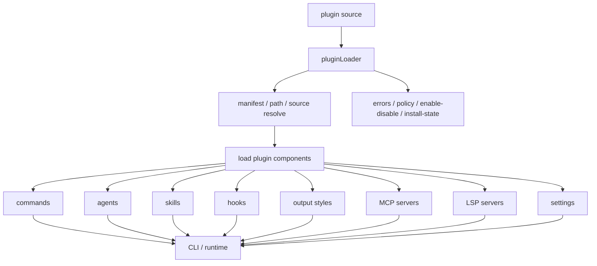

# Claude Code 源码共读笔记 73：Claude Code 的 plugin 系统到底在提供什么能力面

## 这篇看什么

hooks 主线刚收完，下一步最自然的问题其实不是“再看一个 hook 细节”，而是：

> 这些可插拔能力，到底是以什么单位被打包、发现、装载、治理的？

Claude Code 给出的答案就是 plugin。

但这里很容易先入为主，把 plugin 理解成两种过于简化的东西：

- “plugin 不就是 hooks 的壳吗”
- “plugin 不就是一堆本地扩展目录吗”

这两种理解都不太对。

因为只要把 `plugins.ts`、`pluginLoader.ts` 和 `types/plugin.ts` 连起来看，你会发现 Claude Code 里的 plugin 根本不是单点扩展，而是一个更正式的运行时抽象：

> plugin 是统一能力包，也是统一治理包。

这篇先不急着扎进安装细节、marketplace 细节、单个 loader 细节，而是先把总图立住：

- plugin 在系统里到底扮演什么角色
- 它和 hooks / skills / agents / MCP / commands 的边界是什么
- 为什么它不是“某一种扩展”的同义词
- 为什么 Claude Code 要把它做成一个正式能力层

如果这层不先看清，后面读 `loadPluginHooks.ts`、`mcpPluginIntegration.ts`、`validatePlugin.ts` 时，很容易把局部当整体。

## 先给主结论

如果这篇只先记一句话，我会留这个版本：

> Claude Code 的 plugin，不是某个单独扩展点，而是用来承载 commands、agents、skills、hooks、output styles、MCP servers、LSP servers 乃至 plugin 自身 settings 的统一能力包；同时它又有自己的发现、校验、启停、安装、策略和报错体系，所以它不仅是“扩展内容的容器”，还是“扩展治理的单位”。

再压缩一点，就是：

- hooks 是编排面
- skills 是方法面
- commands 是入口面
- agents 是角色面
- MCP / LSP 是外部能力面
- plugin 是把这些面打成一个可装载、可治理、可分发单位的封装层

所以 plugin 在 Claude Code 里真正回答的问题不是：

> “能不能再加一个扩展点？”

而是：

> “这些扩展点，怎么被作为一个正式能力包接进系统？”

这就是这篇最核心的判断。

## 从架构层看，它到底在干什么

如果先不看实现细节，只看类型和装配意图，Claude Code 的 plugin 总图更接近这样：

这张图想表达的其实就一句话：

> plugin 不是一个功能，而是一组功能面的统一装配入口。

而且右下角那个治理支路不能忽略：

- 不是 load 完就完了
- 不是目录扫到就直接用
- 不是“这儿有文件，所以 runtime 自动相信它”

它还有：

- source
- enabled / disabled
- install scope
- validation
- policy
- error typing
- cache / update / marketplace

所以 plugin 在 Claude Code 里的地位，比“一个扩展文件夹”重得多。

## 第一部分：从 `types/plugin.ts` 看，plugin 一开始就被定义成“多能力面的统一容器”

理解 plugin，最直接的切口反而不是先看 CLI，而是先看 `src/types/plugin.ts`。

因为类型定义不会告诉你所有流程细节，但它会非常明确地告诉你：

> 系统作者心里，plugin 到底是什么。

看 `LoadedPlugin` 这个核心结构，信息量其实很大。

它不是只有：

- `name`
- `path`

这种薄薄的元信息，而是直接挂了一整组运行时内容：

- `commandsPath / commandsPaths`
- `agentsPath / agentsPaths`
- `skillsPath / skillsPaths`
- `outputStylesPath / outputStylesPaths`
- `hooksConfig`
- `mcpServers`
- `lspServers`
- `settings`

这意味着，在 Claude Code 的心智模型里，plugin 从定义上就不是某一种扩展的载体，而是：

> “一组可进入 runtime 的能力组件”的聚合体。

这个点非常关键。

因为如果 plugin 只是 hooks 的封装，那它的核心字段应该围着 hook 转。

如果 plugin 只是 marketplace 安装包，那它的核心字段应该主要是版本、来源、安装路径。

但实际不是。

它的核心类型首先表达的是：

- 这个 plugin 提供了什么能力内容
- 这些内容分别以什么形态接入系统

所以只看类型就已经能得到第一个结论：

> plugin 的第一身份不是“分发包”，而是“能力包”。

后面的 marketplace、install、update、cache，更像是在这个能力包之外再叠上的分发治理层。

## 第二部分：plugin 为什么不能简单等于 hooks

这是 hooks 线收尾后最容易接错的一步。

因为你刚读完 69-72，很容易产生一种错觉：

- Claude Code 已经把 hook 讲得这么重了
- plugin 又常常会提供 hooks
- 那 plugin 不就是 hooks 的上层壳吗

但源码给出的答案明显不是这样。

从 `LoadedPlugin` 的结构看，hooks 只是其中一个字段。而从 `PluginComponent` 的定义看，组件面是并列的：

- commands
- agents
- skills
- hooks
- output-styles

这个并列关系很重要。

它说明 plugin 不是“为 hooks 服务的系统”，而是：

> 一个上位封装层，hooks 只是它能承载的组件之一。

换句话说：

- hooks 解决的是：在 runtime 关键事件点怎么介入
- plugin 解决的是：这些介入能力、命令能力、角色能力、风格能力、外部服务能力，怎么作为一个正式单元被打进系统

所以两者回答的是不同层级的问题。

我会这样区分：

### hooks 回答的是“怎么接管运行时事件”

例如：

- `SessionStart`
- `UserPromptSubmit`
- `PreToolUse`
- `PostToolUse`
- `Stop`

这是一条“事件 → 决策 → 回流”的编排链。

### plugin 回答的是“这些能力从哪里来、怎么被打包、怎么进入系统”

例如：

- 这个 hooks 配置属于哪个能力包
- 这个包还顺带提供哪些 commands / agents / skills
- 它是否启用
- 它来自哪个 marketplace / inline source / builtin source
- 它加载失败时如何报错
- 它能不能被策略阻止

所以说得更直一点：

> hooks 是 runtime 编排面，plugin 是能力封装与治理面。

把两者混成一个东西，会直接看歪后面的 plugin loader 设计。

## 第三部分：`pluginLoader.ts` 真正干的，不是“读目录”，而是“把插件变成正式 LoadedPlugin”

`pluginLoader.ts` 这个文件很长，但只看文件头部的注释，其实就已经把意图写得很明白了。

它说自己负责的是：

- discovering
- loading
- validating
- various sources
- duplicate detection
- enable/disable state
- error collection and reporting

这几个词放在一起，意思其实很重。

因为如果它只是个“扫目录工具”，它根本不需要承担这么多职责。

真正重要的是：

> pluginLoader 不是被动地把磁盘文件读出来，而是在把“某个来源的一组扩展内容”转成系统内部可用的 `LoadedPlugin`。

这里至少有四层动作。

### 1. 发现来源

plugin 不是只有一种来源。

从 loader 的注释和相关逻辑能看出来，至少包括：

- marketplace-based plugins
- session-only plugins（例如 inline / `--plugin-dir`）
- builtin plugins

也就是说，plugin 先天就是一个“多来源输入”的对象。

### 2. 解析与标准化

不同来源进来的东西，原始形态并不一样：

- 有的来自 marketplace 标识
- 有的来自本地路径
- 有的来自 builtin
- 有的只是当前会话里临时挂入

但 runtime 不能直接消费这些杂乱来源。

所以 loader 的工作之一，就是把这些不同入口标准化成统一的内部表示。

### 3. 组装成能力包

真正关键的动作在这一步。

它不是只拿一个 `plugin.json` 给你看看，而是要把 plugin 能提供的各类内容真正组装进：

- commands
- agents
- skills
- hooks
- output styles
- MCP servers
- LSP servers
- settings

所以 loader 更像一条装配线，而不是读取器。

### 4. 把错误、启用态、策略状态一起带进来

这一层很容易被忽略，但其实是 plugin 系统成熟度的证据。

Claude Code 没有把 plugin 错误处理做成：

- console 里吐一行字符串
- 某个地方 silent fail
- 让用户自己猜为什么没生效

而是专门定义了 `PluginError` 联合类型，说明它想把 plugin 失败也纳入正式治理。

所以 pluginLoader 干的不是：

> “把插件读出来”

而是：

> “把插件连同它的来源、能力内容、启停状态、策略限制和失败语义，一起纳入系统可治理的运行时表示。”

这才是它重的地方。

## 第四部分：`plugins.ts` 说明 plugin 已经不只是 runtime 概念，而是完整生命周期对象

如果只看 `pluginLoader.ts`，你会觉得 plugin 很像内部装配抽象。

但再看 `src/cli/handlers/plugins.ts`，就会发现它早就不是一个纯内部概念了。

因为 CLI 层已经围绕 plugin 形成了一整组正式操作：

- validate
- list
- install
- uninstall
- enable
- disable
- update
- marketplace 管理

这说明 plugin 已经拥有了自己的“运维面”。

一个系统里，什么东西值得专门给出完整 CLI 生命周期操作，通常说明它已经不是临时拼接的实现细节，而是正式的一等对象。Claude Code 显然就是这么对待 plugin 的。

### `validate`

说明 plugin 有正式 contract，不是“有文件就行”。

### `list`

说明 plugin 有可枚举状态，不是散落在磁盘里不可见。

### `enable / disable`

说明 plugin 有显式启停态，不是只靠删文件控制生死。

### `install / uninstall / update`

说明 plugin 有独立分发与版本生命周期，不只是本地脚本集合。

### `marketplace`

说明 plugin 已经不是个人自用 hack，而是面向生态分发的正式单位。

所以 plugin 在 Claude Code 里，其实同时活在两层：

### runtime 内部

它是 `LoadedPlugin`，承载多种可插拔能力。

### 用户接口层

它是一个可以安装、管理、验证、升级、列举的正式对象。

这两层叠在一起，才构成 plugin 的真实定位。

所以说 plugin 是“统一能力包”，其实还少说了一半。更完整的说法应该是：

> plugin 是统一能力包 + 统一生命周期包。

## 第五部分：为什么 Claude Code 要把 commands、agents、skills、hooks、MCP 这些东西绑成一个 plugin 单位

这是我觉得最有意思的地方。

因为从表面看，这几种东西明明差异挺大：

- commands 更像入口命令
- agents 更像角色模板
- skills 更像方法模块
- hooks 更像运行时编排点
- MCP / LSP 更像外部能力连接器

那为什么不让它们各自独立分发、各自独立治理？

Claude Code 的选择是：可以分面加载，但依然允许它们被打包成同一个 plugin。

我觉得这里至少有三个很现实的架构理由。

### 1. 真实扩展通常就是成套出现的

一个真正能用的扩展，往往不是只加一个点。

它可能同时需要：

- 一个 slash command 作为入口
- 一个 skill 作为方法说明
- 一组 hooks 做行为编排
- 一个 agent 负责某类角色任务
- 若干 MCP server 接外部系统

如果这些东西分散成五套独立分发机制，用户和系统都很痛苦。

Claude Code 把它们打成一个 plugin 单位，本质上是在承认：

> 真实扩展通常是“能力组合”，不是“单点组件”。

### 2. 治理边界最好和交付边界一致

如果一个扩展是一起交付给用户的，那它的治理最好也是一起的。

比如：

- 一起启用
- 一起禁用
- 一起校验
- 一起安装
- 一起升级
- 一起报错归因

这比让用户分别管理“这个扩展里的 hooks、那个扩展里的 commands、另一个扩展里的 MCP”要稳得多。

所以 plugin 统一的，不只是内容，还统一了治理边界。

### 3. runtime 需要一个统一身份来追踪来源

很多能力一旦进入 runtime，就会碰到一个问题：

> 这玩意儿到底是谁提供的？

如果没有 plugin 这一层统一身份，系统很难稳定回答：

- 这个 hook 属于哪个来源
- 这个 command 来自哪个分发包
- 这个 MCP server 是哪个插件带进来的
- 某个错误应该归因给谁

而 `source`、`repository`、`pluginId` 这些字段，正是在解决这个问题。

所以 plugin 这层的存在，也是在给扩展能力附加一个稳定来源身份。

## 第六部分：`PluginError` 很值得注意，它说明 Claude Code 在把“插件失败”也做成正式能力治理的一部分

很多系统在做插件时，最薄弱的一层就是错误处理。

常见做法是：

- 出错打印一下
- 加载失败就跳过
- 让用户看日志自己猜

Claude Code 明显不满足于这个级别。

`types/plugin.ts` 里专门定义了一大组 `PluginError` 联合类型，覆盖的错误语义非常丰富：

- `path-not-found`
- `git-auth-failed`
- `git-timeout`
- `network-error`
- `manifest-parse-error`
- `manifest-validation-error`
- `plugin-not-found`
- `marketplace-not-found`
- `marketplace-load-failed`
- `hook-load-failed`
- `component-load-failed`
- `mcp-config-invalid`
- `lsp-server-start-failed`
- `marketplace-blocked-by-policy`
- 等等

这个设计说明了一件事：Claude Code 不是把 plugin 失败当成“附带问题”，而是把它当成 plugin 系统本身的一部分。

换句话说：

> 插件系统不是“能加载时才存在”，而是“连失败方式都被正式建模”的能力层。

这是很成熟的一个信号。

因为一旦错误被类型化，后续很多事情都能做得更稳：

- 更好的 CLI 提示
- 更清晰的 UI 展示
- 更稳定的 telemetry
- 更准确的归因
- 更明确的用户修复路径

所以别小看这个 `PluginError`。它其实是在告诉你：

> Claude Code 想做的不是“插件支持”，而是“插件平台”。

## 第七部分：再往前推一步，plugin 在 Claude Code 里的真实定位已经接近“小生态单元”了

如果把前面的点压一下，我觉得可以得出一个更大的判断：Claude Code 里的 plugin，已经不只是技术上的加载对象，而更像一个“小生态单元”。

为什么这么说？因为它已经同时具备了这些属性：

### 有内容面

能提供 commands / agents / skills / hooks / MCP / LSP / output styles / settings。

### 有来源面

能区分 builtin、marketplace、inline、session-only 等来源。

### 有生命周期面

能被 install / uninstall / update / enable / disable / list / validate。

### 有治理面

有 policy、validation、duplicate detection、error typing、cache、versioning。

### 有生态面

有 marketplace、install counts、官方 / 已知市场管理、blocklist 等机制。

这些东西叠在一起，就说明 plugin 不是普通的目录约定，也不是某个局部扩展钩子。

它更像是 Claude Code 正在逐步搭起来的：

> 统一扩展生态的基础封装单元。

当然，这篇还只看了总图，没有深入到具体子模块。但总图已经足够说明：

- plugin 不是 hooks
- plugin 也不只是 commands
- plugin 更不是“下载一个扩展目录”
- 它是 Claude Code 把扩展生态正式纳入 runtime 与产品层之间的桥

这也是为什么它值得单独开一条线，而不是只在 hooks 或 MCP 旁边顺手提一句。

## 一句话定义

如果让我给这篇留一个最短定义，我会写：

> plugin 是 Claude Code 对“扩展能力包”的正式定义：它把 commands、agents、skills、hooks、MCP/LSP 与 settings 等内容，连同来源、启停、安装、校验、策略、报错一起，封装成一个可装载、可治理、可分发的统一单元。

## 术语补充 / 名词解释

### `LoadedPlugin`

Claude Code 运行时里的插件内部表示。不是磁盘目录本身，也不是 marketplace 条目本身，而是经过 loader 解析、标准化、装配后的“可运行插件对象”。

### `PluginComponent`

插件可提供的组件类型枚举。当前至少包括：

- commands
- agents
- skills
- hooks
- output-styles

它的意义是：Claude Code 从定义上就承认 plugin 是多组件容器。

### `source`

插件来源标识。用来回答“这个插件是从哪来的”，也是后续启停、报错、策略、展示的重要归因键。

### `manifest`

插件清单。描述这个 plugin 的元信息和组件入口，不等于运行时本体，但决定了它怎样被 loader 理解。

### plugin lifecycle

插件生命周期。包括安装、验证、启用、禁用、更新、卸载、列出等用户可见操作，不只是 runtime load 那一瞬间。

## 有意思的设计点

### 1. 它没有把 plugin 设计成“某一种扩展的宿主”

这是最重要的一点。

很多系统的插件其实只是“给某个单独扩展点加个包裹层”。Claude Code 不是。

它直接把多种能力面并列装进 plugin，这说明作者一开始想的就不是“补一个点”，而是“定义一个生态单位”。

### 2. 它让 runtime 视角和产品视角对齐了

runtime 需要一个统一可装配对象；CLI / marketplace / install 体系需要一个统一可治理对象。

Claude Code 用 plugin 把这两层对齐了。

### 3. 它把失败也做成了系统设计的一部分

真正成熟的扩展系统，不能只定义“成功时长什么样”，还得定义“失败时如何被识别、呈现、归因和修复”。

`PluginError` 正在做这个事情。

## 和前面已读模块的关系

这篇最适合接在 hooks 主线后面看。

因为前面 69-72 已经把 hooks 的位置立住了：

- hooks 是 runtime 编排面
- 它们在关键事件点介入 query 主链

但那条线里一直还留着一个更上层的问题：

> 这些 hook 配置，以及与它协作的 commands / skills / agents / MCP，到底以什么单位进入系统？

这篇给出的答案就是 plugin。

所以和前面几篇合起来看，关系大概是：

- tool：动作原语
- skill：方法模块
- agent：角色执行体
- hooks：运行时编排面
- plugin：把这些能力打成正式可治理扩展单元的封装层

这一步补上以后，整个 Claude Code 的扩展架构会顺很多。

## 下一步最顺怎么接

这篇把 plugin 的总定位立住之后，下一步最顺的不是继续讲 marketplace，也不是先讲安装命令，而是去看：

> 这个统一能力包，具体是怎么被装配成 `LoadedPlugin` 的？

所以我觉得下一篇最自然就是：

### 方向 A：直接进 `pluginLoader.ts`

题目可以是：

**Claude Code 源码共读笔记 74：pluginLoader 是怎么把插件装配成运行时能力包的**

重点回答：

- 不同来源怎么统一
- manifest / path / source 怎么标准化
- 组件内容怎么被装进去
- enable / disable / duplicate / error 是怎么一起处理的

这是最顺的一步。

### 方向 B：拆“接入面”

如果想更强调 plugin 和 hooks / command / agent / MCP 的边界，也可以下一篇直接看：

- `loadPluginHooks.ts`
- `loadPluginCommands.ts`
- `loadPluginAgents.ts`
- `mcpPluginIntegration.ts`

但我还是更倾向先走方向 A。

因为总图之后，先补装配主线，读者心里会更稳。