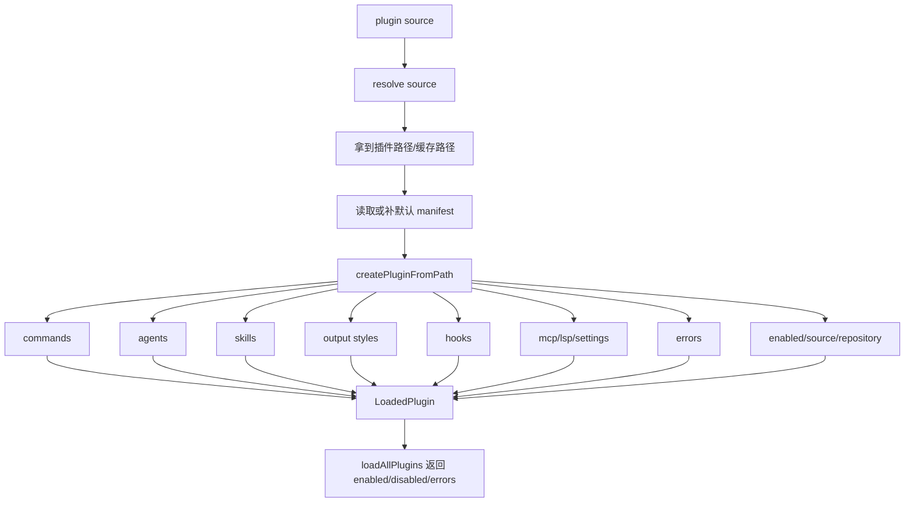

# Claude Code 源码共读笔记 74：pluginLoader 是怎么把插件装配成运行时能力包的

## 这篇看什么

上一篇 73 先把 plugin 的总定位立住了：

- plugin 不是 hooks 的别名
- plugin 也不是一个普通目录
- 它是 Claude Code 的统一能力包和统一治理包

那下一步最自然的问题就是：

> 这个“统一能力包”，在代码里到底是怎么被真正装起来的？

答案基本都在 `src/utils/plugins/pluginLoader.ts` 里。

这篇不打算把这个大文件逐段翻译一遍，而是抓最关键的一条主线：

- pluginLoader 处理哪些输入来源
- 一个 plugin 是怎么从磁盘/市场条目变成 `LoadedPlugin` 的
- manifest、目录约定、附加路径、hooks、错误、启停状态是怎么被一起装进去的
- 为什么我更愿意把它叫“装配线”，而不是“读取器”

如果说 73 讲的是 plugin 在架构图里的位置，那 74 讲的就是：

> **Claude Code 到底靠哪条装配线，把一个插件从“来源”变成“运行时对象”。**

## 先给主结论

如果只先记一句话，我会留这个版本：

> `pluginLoader.ts` 做的不是“读取插件目录”，而是把 builtin / marketplace / inline / session-only 等不同来源的插件，经过 manifest 解析、路径校验、组件收集、hooks 合并、错误建模和启停状态整理，统一装配成 `LoadedPlugin`，再交给后续 runtime 与 CLI 使用。

再压缩一点，就是：

- **输入是杂的**：来源不一样、结构不一样、有没有 manifest 也不一样
- **中间过程是严的**：要解析、校验、补默认值、记录错误、保留来源身份
- **输出是统一的**：最后都收敛成 `LoadedPlugin`

所以 pluginLoader 在 Claude Code 里的职责，不是 scan，而是 normalize + assemble。

## 先把总图立住：pluginLoader 处理的是“来源 → 标准化 → 装配 → 可治理输出”

如果只看主线，我觉得 pluginLoader 更接近下面这个结构：

这张图里最重要的是两个动作：

### 第一，来源标准化
无论你是 builtin、marketplace、inline，还是会话临时挂进来的插件，进入主链之前都得先被整理成“可以装配”的输入。

### 第二，能力装配
真正的插件对象不是一个路径，而是一组运行时能力 + 一组治理信息。

所以它最后产出的，不是“这个目录存在”，而是：

- 这个插件叫什么
- 来自哪里
- 当前启不启用
- 提供哪些组件
- 哪些组件有效
- 哪些组件缺失或出错
- 错误怎么归因

这就是 `LoadedPlugin` 的价值。

## 第一部分：pluginLoader 先解决的不是组件问题，而是“来源问题”

看这个文件最容易忽略的一点是：它花了非常多篇幅在处理来源、缓存、marketplace、seed cache、zip cache、inline plugin。

这其实说明了一件事：

> 在 Claude Code 眼里，插件系统的第一难点不是“怎么读 commands/”，而是“怎么把不同来源的插件变成一个统一输入”。

从文件头和后面的分支逻辑看，至少有几类来源：

- builtin plugin
- marketplace plugin
- inline plugin（比如 `--plugin-dir`）
- session-only plugin
- 本地缓存/种子缓存恢复出来的插件

这些来源在进入 loader 之前差异很大：

- 有的天然就在本地
- 有的要经过 marketplace 解析
- 有的要落到 cache 目录
- 有的只是临时目录，不一定有完整安装信息
- 有的甚至会先碰到 zip cache / versioned cache / legacy cache 的兼容逻辑

所以 pluginLoader 前半段大量代码看起来像“插件下载/缓存工程”，其实不是偏题，而是在解决 plugin 的第一性问题：

> **不同来源的插件，最终得变成一个统一可装配的路径与身份。**

这一步没做稳，后面所有 manifest、hooks、commands 都会散。

## 第二部分：`loadPluginManifest(...)` 很关键，它说明 manifest 是 contract，但不是硬门槛

我觉得这段设计很有意思。

`pluginLoader.ts` 里专门有 `loadPluginManifest(...)`，它的作用不是单纯“读 JSON”，而是把 manifest 这件事定成了一个很明确的 contract：

- 有 manifest，就按 schema 解析和校验
- manifest 损坏或校验失败，就明确抛错
- 如果根本没有 manifest，也不是直接判死刑，而是补一个最小默认 manifest，让插件还能工作

这个决策很重要。

因为它说明 Claude Code 对 plugin manifest 的态度不是二选一：

- 不是“manifest 可有可无，随便读一下”
- 也不是“没有 manifest 就完全不配叫 plugin”

它走的是更现实的一条路：

> **manifest 是正式 contract，但 loader 会为现实世界里不完整的插件输入做兼容性兜底。**

这比纯理想化设计成熟很多。

从实现看，这个函数做了几件事：

### 1. 没有文件时补默认 manifest
会根据传入的 `pluginName` 和 `source` 生成一个最小可用 manifest。

这说明 Claude Code 不希望因为缺一层元数据，就彻底丢失一个本来可运行的插件。

### 2. 有文件时用 `PluginManifestSchema` 校验
这说明 manifest 不是文档注释，而是正式接口。

### 3. schema 之外的未知字段会被 strip
这一点也很有意思。

它不是完全 strict 地把未知字段一律打爆，而是在装配阶段更强调“能标准化进 runtime 的部分”。

我自己的理解是：

- `validatePlugin.ts` 更偏作者视角，适合做严格校验
- `pluginLoader.ts` 更偏运行时视角，适合做能装就装、但对坏数据明确报错

这两个层级分得挺清楚。

所以单看 `loadPluginManifest(...)`，你就能感觉到 pluginLoader 的工作风格：

> 它不是做形式主义的 schema 检查，而是在做“运行时可用对象”的稳健装配。

## 第三部分：`createPluginFromPath(...)` 才是 plugin 真正被“装起来”的地方

如果让我只挑一个函数当这篇的主角，我会选：

> `createPluginFromPath(...)`

因为这个函数几乎就是 `LoadedPlugin` 的装配工厂。

它的结构很清楚，可以概括成下面几步。

### 第一步：先拿到 manifest，决定插件的基本身份
一开头先读：

- `pluginPath`
- `source`
- `enabled`
- `fallbackName`

然后通过 `loadPluginManifest(...)` 拿到 manifest。

接着立刻组装一个基础 `LoadedPlugin`：

- `name`
- `manifest`
- `path`
- `source`
- `repository`
- `enabled`

这一步的意义是：

> 插件先有“身份”，再有“内容”。

这个顺序是对的。

因为后面即使某些组件加载失败，系统也仍然需要知道：

- 这是哪个插件
- 来自哪儿
- 当前启用状态是什么
- 错误应该挂到谁头上

也就是说，Claude Code 不是“组件全成功才算插件存在”，而是“插件作为对象先成立，再逐步往上挂组件与错误”。

这是个很成熟的装配思路。

### 第二步：同时探测标准目录
接下来它会看标准位置有没有这些目录：

- `commands/`
- `agents/`
- `skills/`
- `output-styles/`
- `hooks.json`

这个动作说明 Claude Code 支持一种非常自然的约定式插件结构。

也就是说，就算 manifest 没把所有路径都逐条声明清楚，loader 也能按标准目录把常见组件接起来。

这带来的好处是：

- 对插件作者更省事
- 对简单插件更友好
- 对内建约定更稳定

但它没有停在这里。后面马上又会处理 manifest 里声明的附加路径，这说明 Claude Code 不是纯约定系统，而是：

> **标准目录优先 + manifest 增强覆盖。**

### 第三步：处理 manifest 里声明的 commands / agents / skills / output styles
这是 `createPluginFromPath(...)` 最能体现“装配线”气质的地方。

对于 commands、agents、skills、output styles，它都不是简单地记个字符串路径，而是：

- 把 manifest 字段统一整理成数组
- 把相对路径 resolve 到 plugin 根目录下
- 检查路径存在性
- 不存在时把错误推到 `errors`
- 存在时再挂到 `plugin` 对象上

这里有两个细节很值得注意。

#### 细节 1：错误记录和插件对象并行存在
即使某个组件路径缺失，plugin 不会整体报废。

它会：

- 尽可能保留其余组件
- 记录 `path-not-found` 或 `component-load-failed` 之类的错误

这说明 Claude Code 处理 plugin 的策略不是“全有或全无”，而是：

> **插件可以部分成功，但失败部分必须被明确建模。**

这比“一报错就整个插件消失”要更稳，也更利于用户定位问题。

#### 细节 2：commands 比其他组件更复杂
对于 commands，它额外支持对象映射、metadata，甚至 inline content。

这件事很能说明 Claude Code 对 command 的产品理解：

- command 不是一个简单文件列表
- 它更像一层“命令入口定义”
- 所以它会比 agents/skills 需要更多元信息

这也提醒我们，不要把插件各组件想得太对称。它们虽然被统一打包进 plugin，但每种组件的内部复杂度并不一样。

## 第四部分：hooks 的处理最能体现“标准约定 + 显式声明 + 合并”这套思路

如果你刚从 hooks 主线切过来，这一段会特别顺。

在 `createPluginFromPath(...)` 里，hooks 的处理不是“只认一个地方”。它大概是这样的逻辑：

- 先看标准位置 `hooks.json`
- 再看 manifest 里有没有额外声明 hooks 路径
- 逐个加载
- 合并成最终 `hooksConfig`
- 如果有重复路径或路径缺失，做错误记录或冲突处理

这说明 Claude Code 对 hooks 的态度并不是“插件作者只能用唯一一种声明方式”，而是：

> **允许约定式默认入口，也允许显式扩展声明，最后在 loader 层做统一合并。**

这背后其实有一个挺稳的设计判断：

- 简单插件不该被迫写很多配置
- 复杂插件又必须有能力拆分多个 hook 来源
- 所以装配层要承担合并责任

而专门抽出来的 `loadPluginHooks(...)` 辅助函数，又说明 hooks 不是随便 JSON.parse 一下就完，而是有自己的 schema 校验。

这一点和前面 hooks 主线是能对上的：

- hooks 在 runtime 里很重
- 所以它在 loader 里也不是轻飘飘的附带配置

我会把这一段总结成：

> hooks 在运行时是编排层，在 pluginLoader 里是需要被正式合并和校验的组件层。

## 第五部分：pluginLoader 的输出不是一个插件，而是一个“插件集合状态”

很多人看 loader，天然会盯着“单个插件怎么被创建”。

但如果你往后看 `loadAllPlugins(...)` 那条线，会发现 pluginLoader 最后真正交出去的，并不是一个 `LoadedPlugin`，而是更大的结果结构。

它会把所有插件最后整理成几组：

- enabled
- disabled
- errors

这一层很关键。

因为这说明 pluginLoader 面向的并不是“单次读取一个插件文件夹”的场景，而是：

> **整个 Claude Code 当前插件世界的活动快照。**

也就是说，后续调用者真正关心的是：

- 现在有哪些启用插件
- 哪些插件被装上了但没启用
- 哪些插件加载失败了
- 哪些错误应该暴露给 CLI / UI / telemetry

这比传统意义上的“loader”重很多。

它更像是在做一个 plugin registry snapshot。

这也是为什么前面 73 说 plugin 是统一治理包，这里会显得很落地：

- 有启用态
- 有禁用态
- 有错误态
- 有来源态

它们都不是附属信息，而是 loader 最终结果的一部分。

## 第六部分：从这条装配线能看出 Claude Code 的一个重要取舍——尽量装，但绝不默默吞错

我读这个文件时，最强的感受其实是这一点。

Claude Code 的 pluginLoader 很明显在走一种“工程上比较成熟”的中间路线：

### 它不是过于脆弱的
不是说：

- 缺个 manifest 就不行
- 缺个目录就整个插件废了
- 某个组件有问题就完全不返回这个插件对象

那样会很干，但实际很难用。

### 它也不是过于宽松的
它也没有说：

- 反正能读多少算多少
- 错误随便打印一行日志
- 组件丢了就当没看见

那样短期看方便，长期一定会把生态搞乱。

Claude Code 走的是中间这条：

> **尽量把插件装出来，但所有重要缺口都要被显式记录。**

这就是为什么你会在 `createPluginFromPath(...)` 和 `loadAllPlugins(...)` 一路看到这么多：

- path 校验
- schema 校验
- conflict 检查
- duplicate 检查
- error push
- source 跟踪

所以从工程气质上说，我觉得 pluginLoader 很像一个“带容错的严格装配器”。

这比单纯的 parser 或 scanner 准确得多。

## 第七部分：为什么我会把 74 的核心词定成“装配线”

这篇看到最后，我觉得最值得留下来的不是某个函数名，而是一个心智模型：

> pluginLoader = assembly line

为什么不是 parser？

因为它不只解析 manifest。

为什么不是 scanner？

因为它不只扫描目录。

为什么不是 registry？

因为 registry 更偏结果态，而它中间还有大量路径解析、缓存、规范化、组件拼装动作。

“装配线”这个比喻反而最贴切，因为它同时具备几件事：

- 多来源原料进入
- 经过多道标准化工序
- 局部组件允许失败但要记录
- 最后输出统一规格的运行时对象
- 再把整批对象整理成 enabled / disabled / errors

这套流程和真正的 assembly line 很像。

而且这种理解还能帮你顺着往下读：

- 想看“原料入口”就继续看 marketplace / cache / seed 逻辑
- 想看“组件安装位”就继续看 hooks / commands / agents / MCP integration
- 想看“出厂质检”就去看 validate / policy / pluginStartupCheck

也就是说，一旦把 pluginLoader 看成装配线，后面的整个 plugin 系统就不容易散。

## 一句话定义

如果让我给这篇留一个最短定义，我会写：

> `pluginLoader.ts` 是 Claude Code 的插件装配线：它把不同来源的插件输入，经过 manifest 解析、路径标准化、组件收集、hooks 合并、错误建模和启停整理，统一产出为 `LoadedPlugin` 及整批插件状态快照。

## 术语补充 / 名词解释

### `loadPluginManifest(...)`

插件 manifest 的运行时加载器。不是纯读取函数，而是“有则校验、无则补默认、坏则明确报错”的 contract 入口。

### `createPluginFromPath(...)`

单个插件的核心装配工厂。负责把某个 plugin path 连同 source、enabled 状态、manifest、组件路径、hooks、错误一起整理成 `LoadedPlugin`。

### `LoadedPlugin`

插件在 Claude Code 运行时里的统一内部表示。不是磁盘目录，也不是 marketplace 条目，而是已经过装配的插件对象。

### `loadAllPlugins(...)`

整批插件装配入口。它关注的不是单个插件能不能读出来，而是“当前所有插件的整体状态”：哪些启用、哪些禁用、哪些报错。

### default manifest

当插件缺少 `.claude-plugin/plugin.json` 时，loader 用 `fallbackName` 和 `source` 临时补出的最小 manifest。它体现的是运行时兼容性策略，不是对 plugin author 的最佳实践鼓励。

## 有意思的设计点

### 1. 先立对象，再挂组件

`createPluginFromPath(...)` 不是等全部组件成功才创建插件对象，而是先把插件身份立住，再逐步往上挂 commands、agents、skills、hooks 和错误。

这让“部分成功”的插件也能被系统正确理解和展示。

### 2. 标准目录和 manifest 增强同时存在

Claude Code 没走极端。

它既支持：

- `commands/`
- `agents/`
- `skills/`
- `output-styles/`
- `hooks.json`

这种约定式结构，也支持 manifest 显式声明附加路径。

这让简单插件和复杂插件都能落在同一条装配线上。

### 3. 错误不是附属日志，而是装配产物的一部分

这一点很关键。

在这条主线上，错误不是“顺手打印一下”，而是明确被 push 进结果里的治理信息。

这说明 Claude Code 设计 pluginLoader 时，从一开始就把“失败如何被理解”算进去了。

## 和前面已读模块的关系

这篇和 73 的关系特别直接。

73 解决的是：

- plugin 是什么
- plugin 为什么是统一能力包 / 治理包

74 解决的是：

- 这个统一能力包在代码里怎么被真正装起来

如果把它们连起来看，可以得到一条很顺的链：

- 73：先立 plugin 的架构定位
- 74：再看 pluginLoader 这条装配主线

再往后，最自然的就是继续拆它的“组件接入位”。

## 下一步最顺怎么接

我觉得 74 写完之后，下一步最顺的不是继续留在 `pluginLoader.ts` 里抠缓存细节，而是把“装配线”上最关键的几个组件接入位拆开看。

也就是：

### 75：plugin 的各能力接入面是怎么挂上去的

重点可以直接看：

- `loadPluginHooks.ts`
- `loadPluginCommands.ts`
- `loadPluginAgents.ts`
- `mcpPluginIntegration.ts`

核心问题会变成：

- plugin 提供的不同能力面，分别以什么方式进入 runtime
- 为什么 hooks、commands、agents、MCP 虽然都属于 plugin，但接入方式并不一样
- 哪些能力是装配时直接挂上的，哪些能力是后续 lazy load 的

这会比继续在 74 里深挖 marketplace 更顺，也更符合源码共读的节奏。