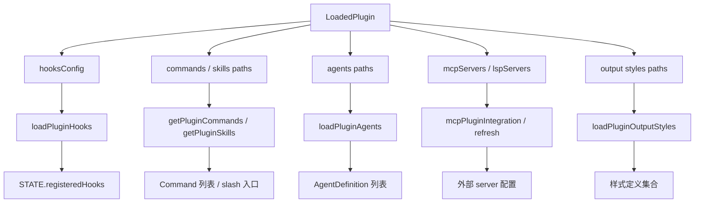

# Claude Code 源码共读笔记 75：plugin 的各能力接入面是怎么挂上去的

## 这篇看什么

73 先把 plugin 的架构定位立住了。

74 又把 `pluginLoader.ts` 这条主装配线讲清楚了：

- 不同来源的插件怎么被标准化
- 怎么被装成 `LoadedPlugin`
- 为什么它更像装配线而不是读取器

那接下来最自然的问题就是：

> 插件已经被装出来了，但它里面那些不同的能力，到底是怎么真正挂进 Claude Code runtime 的？

这个问题如果不拆开看，很容易把 plugin 想成一个统一黑盒。

但源码其实不是这么做的。

Claude Code 把 plugin 里的不同能力面拆成了几条不一样的接入链：

- hooks 有 hooks 的注册链
- commands / skills 有自己的发现链
- agents 有自己的加载链
- MCP / LSP 有自己的集成链
- output styles 也有单独入口

所以这篇想回答的，不是“plugin 里有什么”，而是：

> **plugin 里的不同能力，分别以什么方式进入系统；它们为什么不共用同一条接入链。**

这是读 plugin 线很关键的一步。

因为到这里你会发现：

> plugin 是统一封装层，但 runtime 接入不是统一做法，而是分面接入。

## 先给主结论

如果只先记一句话，我会留这个版本：

> Claude Code 的 plugin 把多种能力打包在一起，但这些能力进入 runtime 的方式并不统一：hooks 走“注册到全局事件表”的编排链，commands / skills 走“发现并枚举为可调用入口”的命令链，agents 走“解析 frontmatter 后装成角色定义”的 agent 链，MCP / LSP 走“外部服务配置接入与懒加载”的连接器链，output styles 则走“样式定义收集”的展示链。plugin 统一的是封装和治理边界，不统一的是接入方式。

再压缩一点，就是：

- **plugin 统一打包**
- **runtime 分面接入**

这句话就是这篇最该记住的骨架。

## 先把总图立住：同一个 plugin，进入 runtime 时会分流成几条不同主线

如果把这一层画出来，结构大概更接近这样：

这张图最重要的点有两个。

### 第一，plugin 不是一个统一“注册函数”全吃掉
Claude Code 并没有做成：

- 插件进来
- 一个 `registerPlugin(plugin)`
- 所有组件自动同构地挂进去

它没有这么扁平。

### 第二，不同组件被接进 runtime 的方式，本来就不一样
这是合理的。

因为这些东西本身差异就很大：

- hooks 是事件拦截与回流
- commands 是入口发现
- agents 是角色定义
- MCP / LSP 是外部服务连接
- output styles 是展示配置

如果强行统一成一条接入链，反而会把语义抹平。

所以 Claude Code 的做法是：

> **plugin 统一边界，组件分流接入。**

这其实是很稳的架构选择。

## 第一部分：hooks 这条线最像“正式注册系统”，不是简单配置读取

先看 `loadPluginHooks.ts`。

如果你刚读完 69-72，那这一块会特别顺。

它做的事情不是“把插件里的 hooks.json 读出来”，而是：

- 从所有 enabled plugins 里拿 `hooksConfig`
- 把每个 plugin 的 hook matcher 转成 native matcher
- 汇总成按事件分类的 hook 集合
- 最后通过状态层把旧 hooks 原子替换成新 hooks

这一步很关键。

因为这说明 plugin hooks 真正进入 runtime 的方式，不是“散落在插件对象里等人顺手去读”，而是：

> **被注册进全局 hooks 状态表，成为 Claude Code 正式运行时的一部分。**

### 这里最值得注意的点有三个

#### 1. 它只看 enabled plugins
这件事看起来理所当然，但实现上很重要。

因为这意味着 hooks 的生效边界，完全跟 plugin enable/disable 状态绑定。

plugin 关掉，hooks 就不再是“虽然文件还在，但说不定还有残影”，而是注册态直接消失。

#### 2. 它做的是全量交换，不是边读边改
`loadPluginHooks.ts` 里非常强调“clear + register”的原子性和 swap 过程。

这个设计是为了避免一种很讨厌的问题：

- 旧 hooks 已被清掉
- 新 hooks 还没装上
- 中间一小段时间 runtime 变成半空状态

这在 `Stop` 这类事件上尤其危险，因为如果中间空窗刚好发生，就会出现“插件明明装着，但某些 hooks 静悄悄失效”的问题。

所以它这里不是随便刷一下缓存，而是更像：

> **把插件 hooks 当成运行时正式注册表的一部分，认真处理原子替换。**

#### 3. hooks 的 hot reload 也被认真做了
`loadPluginHooks.ts` 里还有一套监听 plugin-affecting settings 变化并触发 reload 的逻辑。

这说明插件 hooks 不是“启动时读一次就算了”，而是一个可动态变化的运行时面。

这点和 commands / agents 也不完全一样。

因为 hooks 更接近系统行为本身，所以它对“当前注册状态”非常敏感。

### 所以我对 hooks 接入面的定义是

> hooks 是 plugin 里最像“runtime 编排注册”的那一支。

它不是简单发现，不是静态资源，也不是普通配置对象，而是要进入正式 hooks registry 的。

## 第二部分：commands / skills 这条线本质上是“可发现入口”的枚举链

再看 `loadPluginCommands.ts`。

这一块和 hooks 非常不一样。

它的核心问题不是：

- 某个运行时事件怎么被拦截

而是：

- 当前系统里有哪些 plugin command / skill 可被发现和调用

所以它更像一个“入口枚举器”。

### commands 这条线怎么挂上去
大意上是：

- 从 `loadAllPluginsCacheOnly()` 拿所有 enabled plugins
- 逐个扫描插件提供的 commands 路径
- 读取 markdown/frontmatter
- 做名字、来源、描述、命名空间等整理
- 最后返回一组 `Command[]`

这意味着 commands 进入 runtime 的方式不是注册到某个全局事件表，而是：

> **被收集成“当前系统可用命令入口清单”。**

运行时真正需要的时候，再从这份命令集合里做发现、展示、调用。

### skills 为什么和 commands 走得很近
在这个文件里，`getPluginSkills()` 和 plugin commands 是放在一起处理的。这很说明问题。

因为对 Claude Code 来说，plugin skill 在接入层更像：

- 一种可发现的命令/能力入口
- 而不是像 hooks 那样的全局事件注册项

也就是说，虽然从概念上你会说 skill 是方法模块，但从 plugin 接入角度，它和 commands 的共同点更强：

- 都需要被发现
- 都要能列出来
- 都要有名字/描述/来源
- 都是“给系统或模型看到的入口集合”

所以我会把 commands / skills 这条线概括成：

> **入口面，而不是注册面。**

### 这条线的一个重要特征：偏 cache-only
这类加载器普遍直接吃 `loadAllPluginsCacheOnly()`。

这说明什么？

说明这条链更偏：

- 读当前已装配好的 plugin 快照
- 在上面做派生收集

它不想自己再掺和安装/拉取/重建那一层。

也就是：

> pluginLoader 负责把插件装出来，commands/skills loader 负责在已装配结果上做“入口收集”。

职责切分很干净。

## 第三部分：agents 这条线不是“把文件列出来”，而是“把 markdown 角色定义解析成 AgentDefinition”

`loadPluginAgents.ts` 这条线也很有意思，因为它比 commands 更像结构化定义装配。

如果只看表面，你会觉得：

- 不就是读 `agents/` 目录吗

但实际不是。

这个文件真正做的是：

- 读 agent markdown 文件
- 解析 frontmatter
- 生成 `AgentDefinition`
- 处理 description / when-to-use / color / memory / effort / maxTurns 等字段
- 还会对某些高风险字段做限制

所以 agents 进入 runtime 的方式，不是简单文件挂载，而是：

> **被解释成正式 agent 定义对象。**

这件事和 commands/skills 也有差别。

因为 command 更像“入口条目”，而 agent 已经是一个完整角色配置。

### 这里有个非常关键的安全边界
`loadPluginAgents.ts` 里有一段特别值得记：

- plugin agent file 里的 `permissionMode` 会被忽略
- `hooks` 会被忽略
- `mcpServers` 会被忽略

源码里的注释很直白：

> 插件是第三方 marketplace code，这些字段会让单个 agent 文件偷偷提升能力边界；这种级别的控制，应该留在 manifest / install-time trust boundary，而不是埋在 `agents/` 里的某个 markdown 文件里。

这段判断非常重要。

它说明 Claude Code 对 plugin agent 的态度不是“反正你是 plugin 的一部分，想声明啥都行”，而是：

> **agent 可以定义角色行为，但不能在文件级别偷偷升级权限边界。**

这一下就把 plugin agent 的权力范围说清了。

也正因为这样，我会把 agents 这条线定义成：

> **角色装配链，而且是带安全裁边的角色装配链。**

这比“读 agent 文件”准确得多。

## 第四部分：MCP / LSP 这条线最像“外部连接器接入”，而且明显更偏懒加载

再看 `mcpPluginIntegration.ts` 和 `refresh.ts`，会发现 MCP / LSP 又是另一种气质。

它们和 hooks、commands、agents 都不一样。

因为这条线面对的不是本地 markdown 定义，也不是内部 runtime matcher，而是：

- 外部 server 配置
- 本地/远程服务进程
- 连接状态
- 重连与恢复

所以它本来就更像连接器系统。

### MCP 的接入方式有几个特点

#### 1. manifest 是主要入口
`mcpPluginIntegration.ts` 里会优先看 `plugin.manifest.mcpServers`。

而且它支持的格式并不止一种：

- 字符串路径
- 数组
- 内联对象
- 甚至 `mcpb` 这类来源

这说明 MCP 不是按目录约定去扫一堆 markdown，而是按“配置入口”来集成的。

#### 2. 它会做配置解析、校验、去重与错误记录
这和 plugin 整体设计是一致的。

也就是说，MCP 进入 runtime 不是“manifest 里有就直接信”，而是要经过：

- parse
- validate
- merge
- suppress duplicate
- error record

#### 3. 它明显比 commands/agents 更懒一些
在 `refresh.ts` 里能看出来，`loadAllPlugins()` 并不会一次性把每个 enabled plugin 的 `mcpServers` / `lspServers` 都预填满。

这些更像 lazy cache slot：

- 需要时再去 load
- refreshActivePlugins 时再补齐
- 然后写回 `plugin.mcpServers` / `plugin.lspServers`

这说明 Claude Code 对 MCP/LSP 的看法不是“插件装上时顺手读个配置就完”，而是：

> **这是一组外部连接资源，应该和刷新、恢复、状态更新一起管理。**

所以我会把这条线概括成：

> **连接器接入链，而不是纯定义发现链。**

### 这一层也解释了 plugin 为什么必须是统一治理包
因为如果没有 plugin 这层统一边界，MCP server 会很难回答：

- 是哪个 plugin 提供的
- 由谁负责启停
- 错误归属到哪
- 刷新时该重连哪些 server

所以 MCP/LSP 这一支，反过来也证明了 plugin 边界的必要性。

## 第五部分：output styles 这条线最轻，但也不是“顺手附带”

`loadPluginOutputStyles.ts` 相对轻一些，但它仍然是独立接入面。

它的职责不是：

- 参与模型主循环
- 拦截事件
- 定义 agent
- 建外部连接

它更像是：

> **从 enabled plugins 里收集样式定义，再用 plugin 名做命名空间整理。**

这件事虽然轻，但很能说明 Claude Code 的设计风格：

- 不会因为 output style 比较轻，就把它偷偷塞进别的加载链
- 而是仍然给它单独 loader
- 让它在架构上是一个明确接入位

这说明 plugin 的“多能力面”不是一句空话，而是真的每种能力都在系统里有自己的落点。

所以 output styles 虽然轻，但它让整张图更完整：

- plugin 不只是行为和工具
- 也包括展示层的可插拔配置

## 第六部分：`refreshActivePlugins(...)` 很像这几条接入链的汇合点

如果前面几条线分别看，容易觉得它们彼此孤立。

但 `refresh.ts` 里的 `refreshActivePlugins(...)` 很适合拿来当汇合视角。

这个函数大概干的是：

- 清相关 cache
- 重新拿 `loadAllPlugins()` 结果
- 并行拉 commands 和 agents
- 补 MCP / LSP lazy slot
- 重新加载 hooks
- 最后产出一个 refreshed snapshot

这说明什么？

说明 Claude Code 并不是让这些接入面永远各玩各的，而是在“插件刷新”这个动作上把它们重新并起来。

也就是说：

- 平时它们是分面 loader
- 到 refresh 时，它们又重新汇总成“当前 active plugin world 的最新快照”

这一层我觉得特别重要，因为它说明 runtime 架构不是碎的。

Claude Code 的做法更像：

> **分面接入，汇总刷新。**

这比“一个超级大 loader 统管所有细节”更清楚，也比“每条线彻底无关”更稳。

## 第七部分：为什么 Claude Code 不把这些能力面统一成一种接入方式

读到这里，一个很自然的问题是：

> 既然都属于 plugin，为什么不统一成一种注册协议？

我觉得答案其实挺明确：

因为这些能力本身就不是同一种东西。

如果硬统一，会丢掉很关键的语义差异。

### hooks
本质是事件编排，要注册到运行时状态表。

### commands / skills
本质是可发现入口，要被枚举和展示。

### agents
本质是角色定义，要被解析成结构化 agent 对象。

### MCP / LSP
本质是外部服务连接，要带配置、连接、刷新、重连这些运维意味。

### output styles
本质是展示配置，要收集成样式集合。

所以 Claude Code 选择的不是“形式统一”，而是“边界统一”。

> 统一的是 plugin；不统一的是每种能力进入 runtime 的方法。

这个判断我觉得很对。

因为架构里最怕的一种统一，就是把不同语义硬揉成一样。Claude Code 在这里明显没有这么做。

## 一句话定义

如果让我给这篇留一个最短定义，我会写：

> plugin 是 Claude Code 的统一封装边界，但 hooks、commands、skills、agents、MCP/LSP、output styles 进入 runtime 的方式并不统一；它们分别走注册链、入口枚举链、角色装配链、连接器链和样式收集链，最后在 refresh 阶段重新汇总成当前活动插件世界的快照。

## 术语补充 / 名词解释

### `loadPluginHooks()`

把所有 enabled plugins 的 `hooksConfig` 汇总、转换并注册进全局 hooks 状态表的加载器。它更像运行时注册器，而不是简单读取器。

### `getPluginCommands()` / `getPluginSkills()`

从已装配好的 enabled plugins 中收集命令/skill 入口定义的枚举器。重点是发现与列举，不是运行时事件注册。

### `loadPluginAgents()`

把 plugin agents 解析成 `AgentDefinition` 集合的角色装配器。会读 frontmatter，也会主动忽略某些越权字段。

### `loadPluginMcpServers()` / LSP integration

把 manifest 里声明的外部服务配置转成运行时可用 server 配置的连接器接入层。更偏配置、校验、懒加载和刷新。

### `refreshActivePlugins()`

插件刷新汇合点。把分散的各能力接入链重新并起来，得到当前最新的 active plugin snapshot。

## 有意思的设计点

### 1. hooks 是最“正式 runtime 化”的接入面

它直接进全局注册表，而且非常在意原子替换和热更新。

### 2. agents 这条线暴露了清晰的安全边界

plugin agent 可以定义角色，但不能在 agent markdown 里偷带 `permissionMode`、`hooks`、`mcpServers` 去抬高能力边界。

这条边界画得很漂亮。

### 3. MCP/LSP 说明 plugin 不只是内容包，还是连接器包

一旦看到这条线，你就会更容易理解为什么 plugin 不能只是“几个 markdown 目录”。

它还承担外部能力接入和后续刷新治理。

## 和前面已读模块的关系

这篇刚好接在 74 后面最顺。

- 73：plugin 是什么
- 74：pluginLoader 怎么把 plugin 装出来
- 75：装出来以后，不同能力面怎么真正挂进 runtime

这三篇合在一起，plugin 线就开始成形了。

尤其是 75 补上以后，一个很重要的误区会被拆掉：

> plugin 虽然是统一封装层，但 runtime 不是“一键统一注册”的。

它是统一边界、分面接入。

## 下一步最顺怎么接

我觉得 75 写完之后，下一步可以有两个方向。

### 方向 A：继续往治理层走

也就是写：

**76：validate / schema / policy 为什么说明 plugin 不是随便加载的目录，而是正式能力包**

这会把：

- schema
- validate
- policy
- startup check

这些治理层讲清楚。

### 方向 B：继续往生态层走

也就是写：

**76：plugin CLI / install / marketplace 是怎么把 plugin 变成产品级生态对象的**

这会更偏：

- install
- uninstall
- update
- list
- marketplace

如果只选一个，我现在更倾向 **方向 A**。

因为前面 73-75 都还主要在 runtime / 接入层，接下来先补治理层，会更完整。